# JUC

## 进程与线程

### 进程与线程

#### 进程

* 程序是由指令和数据组成的，但这些指令要运行起来，数据要读写，就必须将指令加载至 CPU，数据加载至内存。再指令运行过程中还需要用到磁盘、网络等设备。而进程就是用来加载指令、管理内存、管理IO的。

* 当一个程序被运行，从磁盘加载这个程序的代码到内存，这时就开启了一个进程。

* 进程可以视为程序的一个实例。有些程序可以同时运行多个实例进程（记事本、画图、浏览器等），有的程序只能启动一盒实例进程（360、网易云等）

#### 线程

* 一个进程中可以分为一到多个线程。

* 一个线程就是一个指令流，将指令流中的一条条指令以一定的顺序交给CPU执行。

* 在 Java 中，线程作为最小调度单位，进程作为资源分配的最小单位。在 Windows 中进程是不活动的，只是作为线程的容器。

#### 线程和进程的区别

* 进程基本上相互独立，而线程存在于进程内，是进程的子集。

* 进程拥有共享的资源 ，如内存空间等，供其内部的线程共享。

* 进程间通信较为复杂：
  
  * 同一台计算机的进程通信称为 IPC（Inter process communication）
  
  * 不同计算机之间的进程通信，需要通过网络，并遵守协议，如 HTTP等。

* 线程通信相对简单，因为它们共享进程内的内存（比如多个线程可以访问到同一个共享变量）

* 线程更轻量，线程上下文（CPU时间片）切换成本一般要比进程上下切换低。

#### 并行与并发

并行：同一时刻执行。

并发：同一时间段执行。

* 涉及到线程上下文切换，将 cpu时间片 分给不同的线程使用。（Windows 时间片最小约为15毫秒）

* 假设8核cpu开启了16个线程，但不足以同时满足1000人秒杀，这种情况操作系统的任务调度器就会让线程轮流使用cpu。

#### 同步和异步

从方法调用的角度看：

* 方法的调用者需要等待结果返回，才能继续运行即是同步。

* 方法的调用者不需要等待结果返回，发起方法调用后，就可以返回，继续运行即是异步。

## Java 线程

### 创建和运行线程

#### Thread

```java
Thread t = new Thread("t1") {
    @Override
    public void run() {
        log.debug("new Thread");
    }
};
// 启动线程
t.start();
log.debug("main...");
```

#### Runnable

```java
new Thread(() ->{
    log.debug("Runnable...");
}, "t1").start();

log.debug("main...");
```

#### FutureTask

```java
FutureTask<Integer> future = new FutureTask<>(() -> {
    log.debug("FutureTask...");
    return 100;
});
new Thread(future, "t1").start();

// get() 阻塞同步等待 task 执行的结果
log.debug("result: {}", future.get());
```

FutureTask 能够接收 Callable 类型的参数，用来处理有返回结果的情况。

### 查看进程线程的命令

#### Windows

* 任务管理器可以查看进程和线程数，也可以 kill 进程。

* `tasklist` 查看进程。

* `taskkill /F /PID <PID>` kill 线程。

#### Linux

* `ps -fe` 查看 Java 进程。

* `ps -fT -p <PID>` 查看指定进程。

* `kill -9 <PID>` kill 进程。

* `top` 查看进程，按 H 切换显示线程。

* `top -H -p <PID>` 查看指定进程的所以线程。

#### Java进程监控

* `jps` 查看所以 Java 进程。

* `jstack <PID>`查看指定 Java 进程的所以线程状态。

* `jconsole`查看指定 Java 进程中线程的运行情况（可视化界面）。

jconsole 远程监控配置（Linux）：

* 需要以如下配置运行 Java 类或 jar（java -jar）。

```txt
java -Djava.rmi.server.hostname=ip地址 -Dcom.sun.management.jmxremote -Dcom.sun.management.jmxremote.port=连接端口 -Dcom.sun.management.jmxremote.ssl=是否安全连接 -Dcom.sun.management.jmxremote.authenticate=是否认证 Java类或jar
```

* 修改 /etc/hosts 文件将 127.0.0.1 映射至主机名

* 如果需要认证访问，还需要几个步骤（具体Google，就不再赘述）

### 线程 API

| API               | 描述                                                                                                                               |
| ----------------- | -------------------------------------------------------------------------------------------------------------------------------- |
| `start()`         | 启动一个新线程，在新的线程中运行 run 方法，但是 start 只是让线程进入就绪状态，并不是立刻执行，CPU的时间片还没分给它。每个线程对象的 start 方法只能调用一次，多次调用会出现 IllegalThreadStateException。    |
| `run()`           | 新线程启动后会调用的方法。如果在Thread对象中传递了 Runnable 参数，那么线程启动后会调用 Runnable 中的 run 方法。否则默认不执行任何操作。但可以创建 Thread 的子类，来覆盖默认行为。                     |
| `join()`          | 等待线程运行结束。                                                                                                                        |
| `join(long n)`    | 等待线程运行结束，最多等待 n 毫秒。                                                                                                              |
| `getId()`         | 获取线程的长整型id，id唯一。                                                                                                                 |
| `getPriority()`   | 获取线程优先级。                                                                                                                         |
| `setPriority()`   | 设置线程优先级。Java中线程优先级是1~10的整数，默认优先级5，较大的优先级能提高该线程被CPU调度的几率。                                                                         |
| `getState()`      | 获取线程状态。Java中线程状态使用枚举类表示的。分别为 NEW、RUNNABLE、BLOCKED、WAITING、TIMED_WAITING、TERMINATED。                                              |
| `isInterrupted()` | 判断是否被中断，不会清除中断标记。                                                                                                                |
| `isAlive()`       | 线程是否存活，为true表示还没有执行完任务。                                                                                                          |
| `interrupt()`     | 中断线程，如果被中断的线程正在 sleep、wait、join 会导致被中断的线程抛出 InterruptedException，并清除中断标记；如果中断正在运行的线程，则会设置中断标记；park（LockSupport） 的线程被中断，也会设置中断标记。 |
| `sleep(long n)`   | 让当前指执行的线程休眠 n 毫秒，休眠期间会让出 cpu 的时间片（休眠期间不会占用cpu）。                                                                                  |

### sleep & yield

#### sleep

1. 调用 sleep 会让当前线程从 Running 进入 Timed Waiting 状态（阻塞）。

2. 其它线程可以使用 interrupt() 方法中断正在睡眠的线程，这时 sleep 方法会抛出 InterruptedException。

3. 所谓的中断，就是把正在睡眠的线程"叫醒"。

4. 睡眠结束后的线程未必会立即得到执行（等待分配CPU时间片）。

5. 建议使用 TimeUnit 的 sleep 替代 Thread 的 sleep 来获得更好的可读性。

#### yield

1. `yield()`：通知线程调度器让出当前线程对 cpu 的使用。

2. 调用 `yield()` 会让当前线程从 Running 进入 Runnable 状态（就绪）。然后调度器执行其它线程。（本身可能也会继续得到）

3. 具体的实现依赖操作系统的任务调度器。

### join

`join`：等待线程运行结束，方法是同步的。

`join(long n)`：等待线程运行结束，最多等待 n 毫秒。限时同步。但是如果线程提前执行完了，会导致 join 结束。（如果 join 等待3秒，但是线程两秒就执行完业务了，那么 join 会提前结束，这时等价于 无参 join）

### interrupt

中断正在睡眠（sleep、wait、join）的线程，会清空中断标记（false）。

如果中断正常执行的线程，则不会InterruptException，会将中断标记置为true。被中断的线程可以用`Thread.currentThread().isInterrupted()`判断是否被中断，然后执行对应的逻辑。可以用来停止线程。

#### 两阶段终止

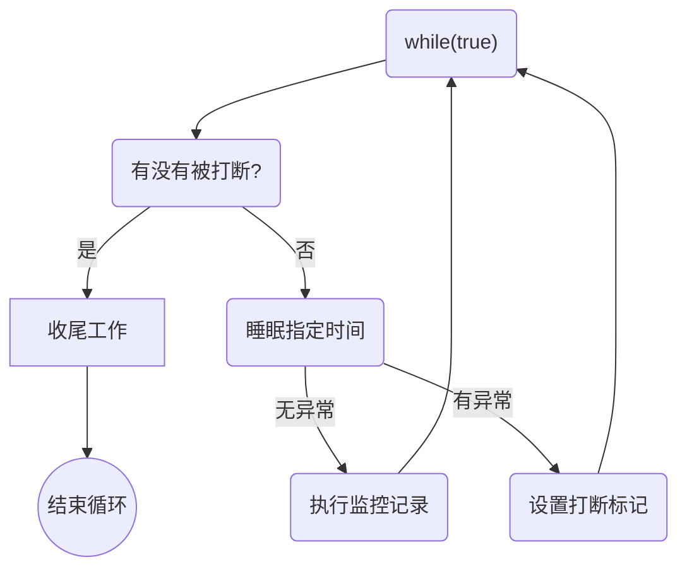

#### 终止线程的错误思路

1. 使用线程对象的 `stop()` 方法停止线程
   
   * stop 方法会 kill 线程，如果这时线程锁住了共享资源，那么当它被 kill 后就没有机会释放锁了，其它线程也将无法获取锁。

2. 使用 `System.exit(int n)` 方法停止线程
   
   * 目的是仅停止一个线程。但这种做法会让整个程序都停止。

### 主线程和守护线程

默认情况下，Java 进程需要等待所以线程都运行结束，才会结束。

守护（Daemon）线程：只要其它非守护线程运行结束了，即时守护线程的代码没有执行完，也会被强制结束。

* 垃圾回收器线程就是一个守护线程。

* Tomcat 中的 Acceptor 和 Poller 线程都是守护线程，所以当 Tomcat 接收到 shutdown 命令后，不会等待 Acceptor 和 Poller 处理完当前请求。

### 线程状态

#### 五种状态

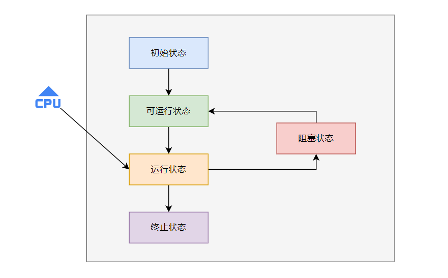

这是从操作系统层面来描述的：

* 初始状态：仅仅创建了线程对象，还没有和操作系统线程关联。

* 可运行状态：（就绪状态，yield）与操作系统线程关联，可以被 CPU 调度执行。

* 运行状态：获得了 CPU 时间片。当CPU时间片用完，会从运行状态转换中可运行状态，会导致线程的上下文切换。

* 阻塞状态：调用了阻塞 API，如 BIO 读写文件，这时该线程实际不会用到CPU，会导致线程上下文切换，进入阻塞状态。当BIO操作完成，会由操作系统唤醒阻塞的线程，转换至可运行状态。

* 终止状态：生命周期结束，线程任务执行完了。

#### 六种状态

Java API 层面描述：

* `NEW`：创建线程对象。

* `RUNNABLE`：调用了 start() 方法。RUNNABLE状态涵盖了操作系统层面的可运行状态、运行状态以及阻塞状态（BIO操作、阻塞API）。

* `BLOCKED`：synchronized。

* `WAITING`：join()、wait()、LockSupport.park()。

* `TIMED_WAITING`：sleep(long)、wait(long)、join(long)、LockSupport。

* `TERMINATED`：生命周期结束，线程任务执行完了。

### 线程运行基础

虚拟机栈、栈帧、程序计数器、局部变量表、返回地址 ...

## 共享模型之管程

管程：Monitor

### 共享问题

`i++`不是原子操作，在字节码上对应四条指令：

```txt
getstatic   i   // 获取静态变量 i 的值
iconst_1        // 把数字1放到操作数栈中
iadd            // 自增
putstatic   i   // 将修改后的值存入静态变量 i
```

如果此时有A、B两个线程在多线程下修改静态变量 i 的值，因为两个线程在字节码种都会有`putstatic`（将值写入内存（方法区，JDK8是元空间，在直接内存中存储）），此时 i 的值就会有两种可能。

#### 错乱情况

负数情况：

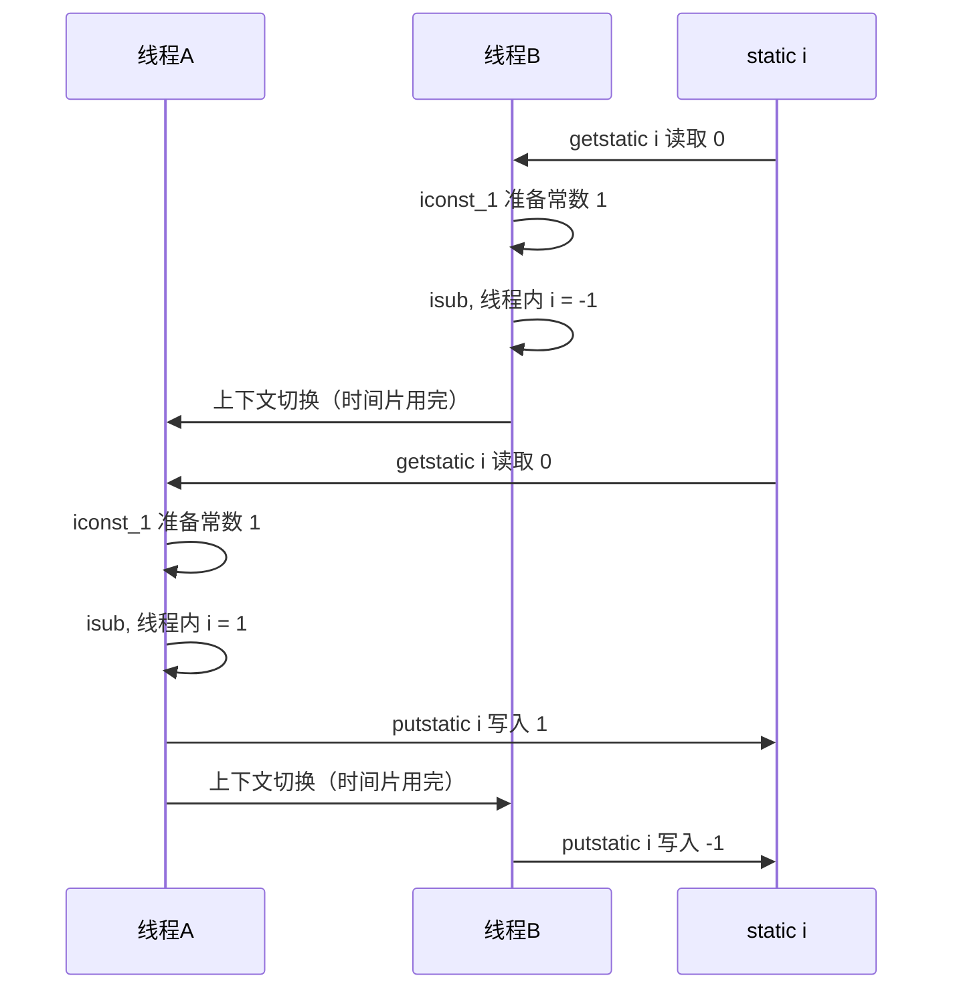

如果是正数的情况，则线程A、B执行顺序调换即可。这是由于指令交错执行造成的线程不安全。

#### 临界区（Critical Section）

在多线程对共享资源读写操作时会发生指令交错，这时就会出现问题（并发问题）。

一段代码块内如果存在对共享资源的多线程读写操作，则称这段代码块为临界区。

#### 竞态条件（Race Condition）

多个线程在临界区内执行，由于代码的执行序列不同而导致结果无法预测，则称之为发生了竞态条件。

### synchronized

避免临界区的竞态条件发生：

* 阻塞式：synchronized、Lock

* 非阻塞式：原子变量

synchronized，俗称对象锁，采用互斥的方式让同一时刻只能有一个线程可以持有对象锁。即使被 synchronized 锁住，线程也不可能一直执行，如果CPU时间片用完了，再去等待获取CPU时间片，期间是不会释放锁的。

synchronized 用对象锁保证了临界区内代码的原子性，临界区内的代码不会被线程切换打断。

#### 方法上的 synchronized

```java
// 成员方法
class Test {
    public synchronized void test() {}
}
// 等价于
class Test {
    public void test() {
        synchronized(this) {}
    }
}

// 静态方法
class Test {
    public synchronized static void test() {}
}
// 等价于
class Test {
    public static void test() {
        synchronized(Test.class) {}
    }
}
```

### Monitor

#### 对象头

以32位虚拟机为例，32位虚拟机空对象头占8字节，64位占16字节。

##### 普通对象

```ruby
|----------------------------------------------------------------|
|                 Object Header (64 bits)                        |
|-------------------------------|--------------------------------|
|      Mark Word (32 bits)      |      Klass Word (32 bits)      |
|-------------------------------|--------------------------------|
```

##### 数组对象

```ruby
|---------------------------------------------------------------------------------------------------|
|                               Object Header (96 bits)                                             |
|-------------------------------|--------------------------------|----------------------------------|
|      Mark Word (32 bits)      |      Klass Word (32 bits)      |      array length (32 bits)      |   
|-------------------------------|--------------------------------|----------------------------------|
```

##### 32位虚拟机Mark Word

```ruby
|----------------------------------------------------------------------|------------------------|
|           Mark Word (32 bits)                                        |   State                |
|----------------------------------------------------------------------|------------------------|
|   hashcode:25               |   age:4   |   biased_lock:0   |   01   |   Normal               |
|----------------------------------------------------------------------|------------------------|
|   thread:23   |   epoch:2   |   age:4   |   biased_lock:1   |   01   |   Biased               |
|----------------------------------------------------------------------|------------------------|
|              ptr_to_lock_record:30                          |   00   |   Lightweight Locked   |
|----------------------------------------------------------------------|------------------------|
|              ptr_to_heavyweight_monitor:30                  |   10   |   Heavyweight Locked   |
|----------------------------------------------------------------------|------------------------|
|                                                             |   11   |   Marked for GC        |
|----------------------------------------------------------------------|------------------------|
```

`biased_lock:0`：表示是否是偏向锁，紧接着最后2位`01`表示加锁状态。

##### 64位虚拟机Mark Word

```ruby
|--------------------------------------------------------------------------------------------------------------|
|                 Mark Word (64 bits)                                                 |   State                |
|-------------------------------------------------------------------------------------|------------------------|
|   unused:25   |hashcode:25  |   unused:1   |   age:4   |   biased_lock:0   |   01   |   Normal               |
|-------------------------------------------------------------------------------------|------------------------|
|   thread:54   |   epoch:2   |   unused:1   |   age:4   |   biased_lock:1   |   01   |   Biased               |
|-------------------------------------------------------------------------------------|------------------------|
|              ptr_to_lock_record:62                                         |   00   |   Lightweight Locked   |
|-------------------------------------------------------------------------------------|------------------------|
|              ptr_to_heavyweight_monitor:62                                 |   10   |   Heavyweight Locked   |
|-------------------------------------------------------------------------------------|------------------------|
|                                                                            |   11   |   Marked for GC        |
|-------------------------------------------------------------------------------------|------------------------|
```

#### Monitor

Monitor：监视器。

每个 Java 对象都可以关联一个 Monitor（操作系统提供的对象） 对象，如果使用 synchronized 给对象加锁（重量级）之后，该对象头的 Mark Word 中就会被设置指向 Monitor 对象的指针。

Monitor 结构如下：

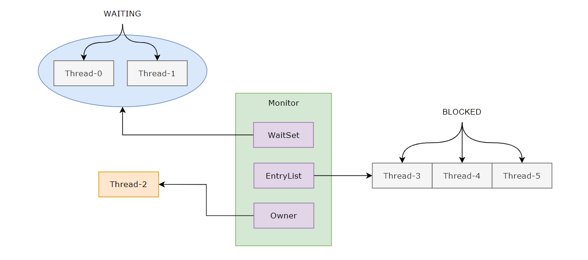

* 刚开始 Monitor 中 Owner 为 null。

* 当 Thread-2 执行 synchronized(obj) 就会将 Monitor 的所有者 Owner 设置为 Thread-2，Monitor 中只能同时存在一个 Owner。

* 在 Thread-2 加锁的过程中，如果 Thread-3、Thread-4、Thread-5 也执行到 synchronized(obj)，就会进入 EntryList BLOCKED。

* 等待 Thread-2 执行完同步代码块中的逻辑后，然后唤醒 EntryList 中等待的线程来竞争锁，竞争锁时是非公平的。

* WaitSet 中的 Thread-0、Thread-1 是之前获得过锁，但条件不满足进入 WAITING 状态的线程。

synchronized 必须是获取到同一个对象的 monitor 才有上述的效果。

##### 字节码角度

```java
public class App {

    static final Object lock = new Object();
    static int counter = 0;

    public static void main(String[] args) {
        synchronized (lock) {
            counter++;
        }
    }
}
```

字节码：

```txt
  public static void main(java.lang.String[]);
    descriptor: ([Ljava/lang/String;)V
    flags: ACC_PUBLIC, ACC_STATIC
    Code:
      stack=2, locals=3, args_size=1
         0: getstatic     #2                  // 加载静态变量 lock引用 到操作数栈上， （synchronized 开始）
         3: dup                               // 复制一份 lock引用，解锁用
         4: astore_1                          // 将 lock引用 从操作数栈弹出，存储局部变量表 slot 1
         5: monitorenter                      // （加锁）将 lock对象 MarkWord 设置为 Monitor 指针
         6: getstatic     #3                  // 加载静态变量 counter 到操作数栈上
         9: iconst_1                          // 准备常数 1，弹入到操作数栈上
        10: iadd                              // +1 
        11: putstatic     #3                  // 将修改后 counter 的值写回静态变量
        14: aload_1                           // 将局部变量表 slot 1 加载到操作数栈 （lock引用）
        15: monitorexit                       // （解锁）将 lock 对象 MarkWord 重置，唤醒 EntryList
        16: goto          24
        19: astore_2                          // 出现异常了，将异常信息从操作数栈弹出，存入局部变量表 slot 2
        20: aload_1                           // 从局部变量表 slot 1 加载 lock引用 到操作数栈上
        21: monitorexit                       // （解锁）将 lock 对象 MarkWord 重置，唤醒 EntryList
        22: aload_2                           // 将局部变量表 slot 2 异常信息加载到操作数栈上
        23: athrow                            // throw e
        24: return

      // 会监测同步代码块中的异常，即时出现异常，也能正常解锁
      Exception table:
         from    to  target type
             6    16    19   any
            19    22    19   any
      LineNumberTable: ...
      LocalVariableTable:
        Start  Length  Slot  Name   Signature
            0      25     0  args   [Ljava/lang/String;
```

#### synchronized 优化进阶

##### 轻量级锁

- 轻量级锁（Lightweight Lock），也称为偏向锁（Biased Locking），是Java中用于提高多线程同步性能的一种机制。它是一种乐观锁的实现方式，用于解决竞争不激烈的情况下对同步操作的性能影响。

- 轻量级锁的基本思想是在对象头中添加一些标志位来表示锁的状态，通过CAS（Compare and Swap）操作来实现锁的获取和释放。当一个线程尝试获取锁时，首先会尝试使用CAS将对象头中的锁标志位更新为自己的线程ID，如果成功获取锁，则表示该线程获取到了轻量级锁。如果CAS操作失败，说明有竞争发生，此时轻量级锁会膨胀为重量级锁，进而采用传统的互斥量方式进行同步。

- 轻量级锁的优势在于避免了传统的互斥量同步带来的性能开销，适用于线程间竞争不激烈的场景。它的主要特点包括：
  
  - 使用CAS操作实现锁的获取和释放，避免了线程阻塞和唤醒带来的开销；
  
  - 锁的状态保存在对象头中，不需要额外的内存空间；
  
  - 对于没有竞争的情况下，几乎没有额外的性能开销。

- 需要注意的是，轻量级锁并不适用于存在大量线程间竞争的情况，因为在竞争激烈的场景下，轻量级锁会频繁膨胀为重量级锁，这样反而会增加锁操作的开销。因此，在设计并发应用时，需要根据实际情况选择合适的锁机制。

直白讲就是：

- 虚拟机首先将在当前线程的栈帧创建一块空间用于存储锁记录（lock record），把对象头中的Mark Word复制到锁记录中，拷贝成功后，虚拟机将使用CAS操作将对象Mark Word更新为指向Lock Record的指针。（并将Lock Record里的owner指针指向对象的Mark Word）。

- 若操作成功，那就完成了轻量锁操作，把对象头里的tag改成00，表示此对象处于轻量级锁定状态。

- 如果失败，虚拟机首先会检查对象的Mark Word是否指向当前线程的栈帧，如果是就说明当前线程已经拥有了这个对象的锁，那就可以直接进入同步块继续执行；

- 否则说明多个线程在竞争锁：若当前只有一个等待线程，尝试自旋获取锁，自旋超过一定的次数，或者多个线程竞争，则需要在当前对象上生成重量锁。

##### 偏向锁

偏向锁使用场景：冲突很少，基本上就一个线程使用。

轻量级锁在没有竞争时，每次锁重入仍然需要执行 CAS 操作。在 Java6 引入了偏向锁来做进一步优化，只有第一次使用 CAS 时才将线程ID设置到对象的 Mark Word 中，之后锁重入发现这个线程ID是自己的，就表示没有竞争，不用再 CAS。以后只要不发生锁竞争，这个锁对象就归该线程所有。

###### 偏向状态

```ruby
|--------------------------------------------------------------------------------------------------------------|
|                 Mark Word (64 bits)                                                 |   State                |
|-------------------------------------------------------------------------------------|------------------------|
|   unused:25   |hashcode:25  |   unused:1   |   age:4   |   biased_lock:0   |   01   |   Normal               |
|-------------------------------------------------------------------------------------|------------------------|
|   thread:54   |   epoch:2   |   unused:1   |   age:4   |   biased_lock:1   |   01   |   Biased               |
|-------------------------------------------------------------------------------------|------------------------|
|              ptr_to_lock_record:62                                         |   00   |   Lightweight Locked   |
|-------------------------------------------------------------------------------------|------------------------|
|              ptr_to_heavyweight_monitor:62                                 |   10   |   Heavyweight Locked   |
|-------------------------------------------------------------------------------------|------------------------|
|                                                                            |   11   |   Marked for GC        |
|-------------------------------------------------------------------------------------|------------------------|
```

- 如果开启了偏向锁（默认开启），那么对象创建后，Mark Word值为 0x05，即最后3位为 101，这时它的 thread、epoch、age都为0。

- 偏向锁默认是延迟的，不会在程序启动时立即生效，如果想避免延迟，可以使用 VM 参数`-XX:BiasedLockingStartupDelay=0`来禁用延迟。

- 如果没有开启偏向锁（`-XX:UseBiasedLocking=false`），当对象创建后，Mark Word 值为 0x01，即最后3位为 001，这时它的 hashcode、age都为0，第一次用到 hashcode 时才会赋值。

- 只要没有发生锁竞争，对象头 Mark Word 就会一直存储着上一次的线程ID。

###### 撤销

调用对象 hashCode、其它线程使用锁对象、调用 wait/notify 都会导致偏向锁撤销。wait/notify 只有重量级锁才有。

由可偏向锁撤销到不可偏向锁。

偏向锁只有遇到其他线程尝试竞争偏向锁时，持有偏向锁的线程才会释放锁，线程不会主动释放偏向锁。

偏向锁的撤销，需要等待全局安全点（在这个时间点上没有字节码正在执行），它会首先暂停拥有偏向锁的线程，检查持有偏向锁的线程是否处于活动状态（同步代码块是否执行完），不处于活动状态则将对象头设置为无锁状态，线程可以使用CAS竞争锁。处于活动状态，则升级到轻量级锁，唤醒暂停线程继续执行。

###### 批量重偏向

在Java中，批量重偏向是一种优化技术，用于解决偏向锁的不适用场景。当一个线程获取对象的偏向锁后，如果其他线程也想获取该对象的锁，那么需要撤销原有的偏向锁，并将锁状态进行升级，这个过程称为批量重偏向。

批量重偏向的目的是为了避免偏向锁在多线程竞争下的频繁撤销和重偏向操作，从而提高并发性能。在某些场景下，当对象的偏向锁被多个线程竞争时，频繁的偏向锁撤销和重偏向操作会导致性能下降。为了避免这种情况，JVM引入了批量重偏向机制。

具体来说，当一个偏向锁的对象被多个线程竞争时，JVM会在达到一定条件时触发批量重偏向操作。这个条件通常是当对象的偏向锁数量超过一定阈值（超过20次）时，或者当系统经过一段时间后，判断当前偏向锁的竞争情况不再适合偏向锁优化时。

当撤销偏向锁超过阈值（20次）后，会给这些对象加锁时重新偏向至加锁线程。

###### 批量撤销

当撤销偏向锁超过阈值（40次）后，加锁对象会变为不可偏向（无锁状态），新建的对象也是不可偏向的。

即类的实例会变成不可偏向。原因是偏向是指类偏性，而不是对象实例偏向；一个类只能有一个偏向。

##### 锁膨胀

Java锁膨胀是指在多线程环境下，当某个线程获取锁之后，如果其他线程也需要获取相同锁，并且无法立即获取到，就会触发锁膨胀的过程。

Java中锁膨胀主要涉及到两种类型的锁（偏向锁和轻量级锁）：

1. 偏向锁膨胀：偏向锁是为了解决无竞争的情况下的性能问题。当一个线程获取了偏向锁后，如果其他线程也需要获取该锁，就会触发偏向锁膨胀，偏向锁会升级为轻量级锁。

2. 轻量级锁膨胀：当一个线程获取锁时，如果该锁的标记位为轻量级锁，并且有其他线程尝试获取该锁但失败了，那么该锁会膨胀为重量级锁，即锁的实现由CAS操作变为互斥量操作。

锁膨胀的过程涉及到锁的升级，从偏向锁到轻量级锁，再到重量级锁，每一次升级都会增加锁操作的开销，因此在设计并发程序时，应该尽量避免不必要的锁膨胀，以提高程序的性能和并发能力。

锁升级后，解锁操作需按照升级后锁的解锁方式进行解锁。

##### 自旋优化

重量级锁竞争的时候，还可以使用自旋来进行优化。在 Java6 之后自旋锁是自适应的，自旋成功的可能性较高，就会多自旋几次，反之，就会减少自旋次数或者不自旋。Java7之后不能控制是否开启自旋功能。

##### 锁消除

即锁对象没有逃离方法作用域，JVM 会认为可以不用加锁操作。

`-XX:-EliminateLocks` 关闭锁消除优化。

### wait/notify


BLOCKED 是等待锁，而 WAITING 是已经获得锁，但是又放弃了锁。BLOCKED 和 WAITING都处于阻塞状态，不占用CPU时间片。

BLOCKED 线程会在 Owner 线程释放锁时被唤醒。WAITING 线程会在 Owner 线程调用 notify/notifyAll 时被唤醒。WAITING 线程被唤醒后不会立即获得锁，仍需进入 EntryList 重新竞争。

#### API

| API               | 描述                                                               |
| ----------------- | ---------------------------------------------------------------- |
| `obj.wait()`      | 让进入 obj 监视器的线程到 WaitSet 等待。wait() 方法会释放锁。有参 wait(long n) 会被提前唤醒。 |
| `obj.notify()`    | 随机唤醒一个在 obj 上正在 WaitSet 等待的线程。                                   |
| `obj.notifyAll()` | 唤醒全部在 obj 上正在 WaitSet 等待的线程。                                     |

它们都是线程之间进行协作的手段，属于 Object 对象的方法，必须获得此对象，才能调用方法。

#### wait/sleep 区别

1. sleep 是 Thread  方法，wait 是 Object 的方法。

2. sleep 可以不用配合 synchronized 使用，wait 需要和 synchronized 配合使用。

3. sleep 不会释放锁，wait 会释放锁。

wait 无参即无限等待，有参就是有限等待。

sleep(long n) 和 wait(long n) 都是 TIMED_WAITING 状态。

### 同步模式之保护性暂停

Guarded Suspension，用在一个线程等待另一个线程的执行结果：

- 当有一个结果需要从一个线程传递到另一个线程，让这两个线程关联同一个 GuardedObject。

- join、Future 的实现，采用的就是 Guarded Suspension 方式。

- 但是当一个线程传递多个结果到另一个线程时，那么可以使用消息队列（生产者/消费者）

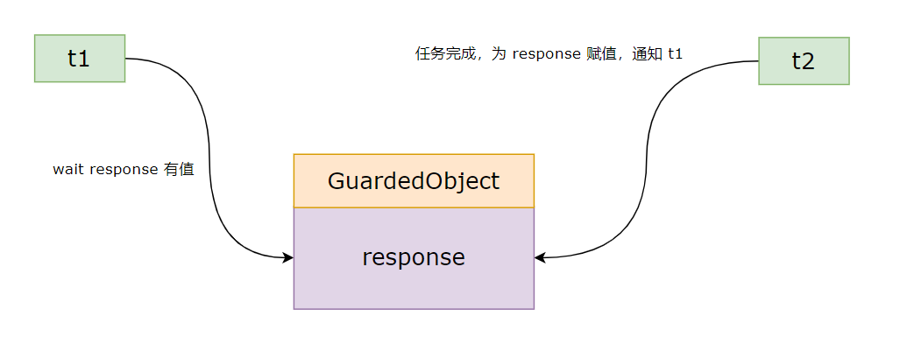

### LockSupport

FutureTask 内部实现采用下面两个方法进行同步的。

```java
// 暂停当前线程
LockSupport.park();

// 恢复某个线程的运行
LockSupport.unpark(暂停线程对象)
```

每个线程都有一个 Parker 对象，由三部分组成`_counter`、`_cond`、`_mutex`。调用 park() 时，`_counter` 减1，调用 unpark() 加1。如果先调用 unpark()，`_counter=1`，那么后调用 park() 时直接减1即可，无需等待阻塞。（0为加锁，1为解锁）

如果调用unpark()时线程在阻塞状态，则唤醒该线程。

调用多次 unpark() 的效果和调用一次 unpark() 一样。

### 线程状态转换

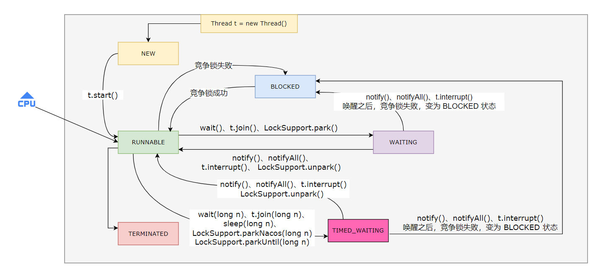

### Lock

#### 活跃性

##### 定位死锁

检测死锁可以使用 jconsole 工具，或者使用 jps 定位进程id，再用 jstack 定位死锁。

##### 死锁

两个线程互相持有对方想要的锁。

##### 活锁

两个线程改变对方的结束条件。

##### 饥饿

生产者生产速度跟不上消费者消费速度。

#### ReentrantLock

ReentrantLock特点：

* 可中断。

* 可以设置超时时间。

* 可以设置公平锁。

* 支持多个条件变量。

与 synchronized 一样，都支持可重入。

基本语法：

```java
ReentrantLock lock = new ReentrantLock();
lock.lock();
try {
    // 临界区
} finally {
    lock.unlock();
}
```

##### 可重入

可重入是指同一个线程如果首次获得了这把锁，可以有权利再次获取这把锁。如果是不可重入锁，那么第二次获得锁时，还是会被锁挡住。

```java
public class App {

    static ReentrantLock lock = new ReentrantLock();

    public static void main(String[] args) {
        m1();
    }

    public static void  m1() {
        lock.lock();
        try {
            m2();
        } finally {
            lock.unlock();
        }
    }
    public static void m2() {
        lock.lock();
        try {
            m3();
        } finally {
            lock.unlock();
        }
    }
    public static void m3() {
        lock.lock();
        try {
            System.out.println("m3");
        } finally {
            lock.unlock();
        }
    }
}
```

##### 可中断

中断处于阻塞等待的线程，防止无限制的阻塞。加锁使用`ReentrantLock.lockInterruptibly()`，别忘了解锁。

##### 锁超时

- `tryLock()`：获取不到锁立即返回false。

- `tryLock(long timeout, TimeUnit unit)`：获取不到锁时，等待指定等待时间，等待时间超时还没获取到锁，则返回false。

##### 公平锁

ReentrantLock 默认是不公平锁。

```java
public ReentrantLock() {
    sync = new NonfairSync();
}

public ReentrantLock(boolean fair) {
    sync = fair ? new FairSync() : new NonfairSync();
}
```

##### 条件变量

wait()和notify()这两个方法主要用于多线程间的协同处理，即控制线程之间的等待、通知、切换及唤醒。而ReentrantLock也支持这样条件变量的能力。

条件变量维护的是一个单向链表的队列，调用await()在队列等待和当条件满足时signal()唤醒。

```java
static ReentrantLock lock = new ReentrantLock();
static Condition condition1 = lock.newCondition();
static Condition condition2 = lock.newCondition();

public static void main(String[] args) {
    new Thread(() -> {
        lock.lock();
        try {
            condition1.await();
        } catch (InterruptedException e) {
            e.printStackTrace();
        } finally {
            lock.unlock();
        }
    }).start();

    new Thread(() -> {
        lock.lock();
        try {
            condition1.signal();
        } finally {
            lock.unlock();
        }
    }).start();
}
```

可以根据业务场景定义多个 Condition，用于存放不同等待事件的线程。

使用流程：

- await 前需要获得锁。

- await 执行后，会释放锁，然后进入 conditionObject 等待。

- await 的线程被唤醒（中断、超时）后，可以重新竞争锁。

- 竞争锁成功后，从 await 后执行。

API：

```java
// 等价 wait、wait(long n)
void await() throws InterruptedException;

boolean await(long time, TimeUnit unit) throws InterruptedException;

boolean awaitUntil(Date deadline) throws InterruptedException;

void awaitUninterruptibly();

// 唤醒线程，等价于 notify、notifyAll
void signal();

void signalAll();
```

## 共享模型之内存

JMM Java Memory Model，它定义了主存（线程共享内存）、工作内存（线程私有内存）的抽象概念。

JMM 体现在以下几个方面：

1. 原子性：保证指令不会受到线程上下文切换的影响。

2. 可见性：保证指令不会受到 CPU 缓存的影响。

3. 有序性：保证指令不会受到 CPU 指令并行优化的影响。

### 原子性

synchronized、Atomic工具类、Lock...

### 可见性

修饰成员变量和静态变量。

一个线程对主存的数据进行修改，但对于另一个线程是不可见的（获取的是缓存中的值）。可以使用`volatile`关键字解决不可见。每次必须到主内存中读取。

synchronized 也能保证数据的可见性、原子性，但 synchronized 属于重量级操作，性能相对较低。被 synchronized 修饰的代码，在开始执行时会加锁，执行完成后会进行解锁，但在一个变量解锁之前，必须先把此变量同步回主存中。synchronized 会强制当前线程读取主内存中的值。

`volatile`不能保证原子性，仅用在一写多读的情况。只能保证看到最新值，无法解决指令交错。

### 有序性

同一个线程内，JVM 在不会改变程序结果的前提下，可以调整语句的执行顺序。这些指令的各个阶段可以通过重排序和组合来实现指令级并行。

比如 double-check-lock 单例模式，JVM 可能会优化为：先将引用地址赋值给 INSTANCE 变量后，再执行构造方法，那么另一个线程进来一看 INSTANCE 不为空了，可能拿到的是一个未初始化完成的单例对象。

在 JDK5 以上的版本 volatile 才会真正生效。`volatile`禁止指令重排序。防止之前的指令重排序，利用了内存屏障（写之后，读之前设置内存屏障）。

synchronized 不保证有序性。

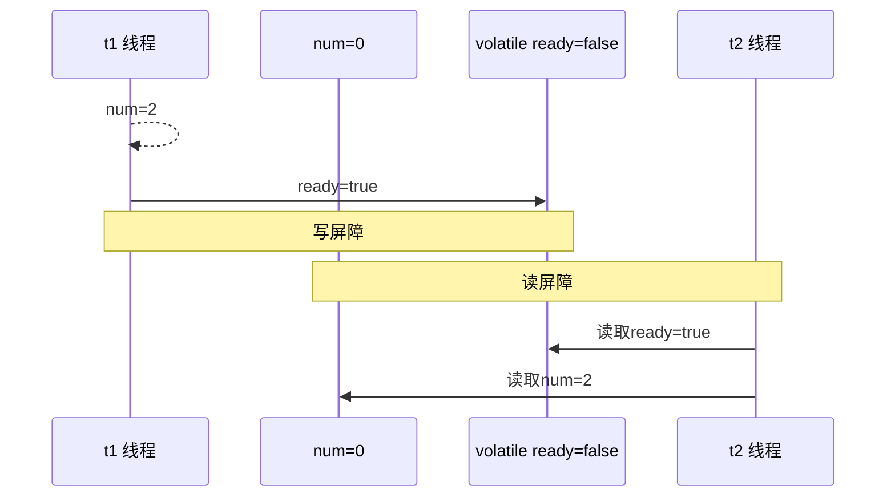

#### happens-before

happens-before 规定了哪些写操作对其它线程的读操作可见，是一套可见性与有序性的规则总结。

以下方式都可以对共享变量读可见。

1. synchronized。

2. volatile。

3. start() 前对共享变量的修改。

4. 线程结束前的写，对其它线程得知它结束后的读可见。

5. 线程中断前的写。

6. 对成员变量或静态变量的默认值（0、false、null）的写，对其它线程对该变量的读可见。

具有传递性，如果 x (happens-before) > y 并且 y (happens-before) > x，那么有 x (happens-before) > z

## 共享模型之无锁

### CAS

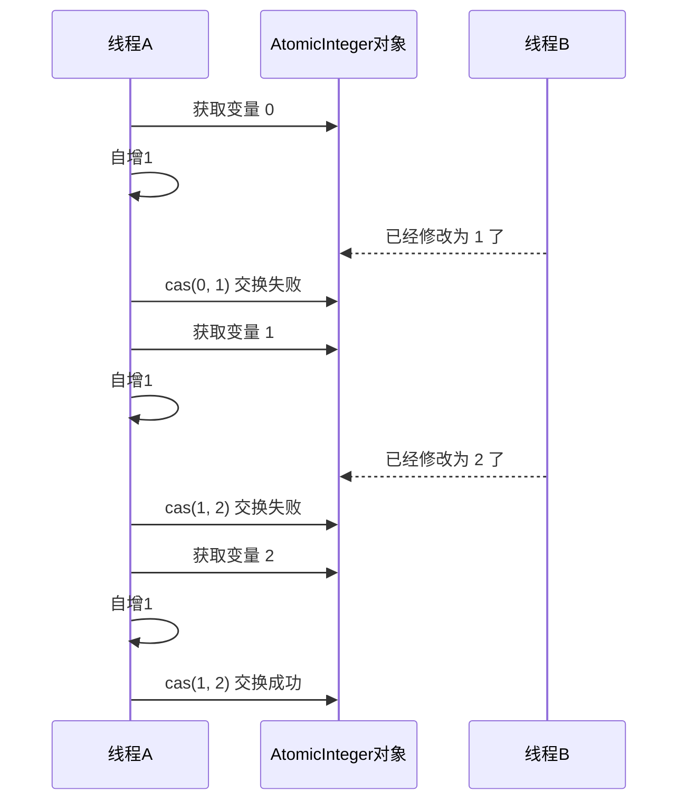

在对数据操作之前，首先会比较当前值跟传入值是否一样，如果一样就更新，否则不执行更新操作直接返回失败状态。

CAS 底层使用的 lock cpmxchg指令（X86架构），在单核或多核CPU下都能够保证 compareAndSwap 的原子性。

在多核状态下，当某个核执行到带有 lock 的指令时，CPU 会让总线锁住，当这个核讲此指令执行完，再开启总线。这个过程中不会被线程的调度机制中断，保证了多个线程对内存操作的准确性，是原子操作。

```java
// compareAndSet

/*
    expect：获取的当前最新值
    update：要修改的值
    工作内存 expect 和 主内存 expect 比较，如果相等则将主内存 expect 替换为 update
*/
public final boolean compareAndSet(int expect, int update) {
    return unsafe.compareAndSwapInt(this, valueOffset, expect, update);
}

public final native boolean compareAndSwapInt(Object var1, long var2, int var4, int var5);


// 自增
public final int incrementAndGet() {
    return unsafe.getAndAddInt(this, valueOffset, 1) + 1;
}

public final int getAndAddInt(Object var1, long var2, int var4) {
    int var5;
    do {
        var5 = this.getIntVolatile(var1, var2);
    } while(!this.compareAndSwapInt(var1, var2, var5, var5 + var4));

    return var5;
}
/*
    var1：是当前 AtomicInteger 对象
    var2：当前值（value）。（比如现在要实现 2+1）那么 var2 就是2，var4 就是 1
    var5：获取底层当前的值（value），获取最新值

    假设此时只有一个线程操作 AtomicInteger 对象，则 this.compareAndSwapInt(var1, var2, var5, var5 + var4) 的参数如下：
        this.compareAndSwapInt(AtomicInteger, 2, 2, 2+1)
        如果新值（主内存共享）和旧值（工作内存私有）相等，就将2+1写回主内存。在底层达到数据可见性。
    不相等则一直循环，直到相等为止。

*/
```

CAS 操作借助了 volatile 来达到交换并替换的效果。

- CAS 是乐观锁。synchronized 是悲观锁。

- CAS 体现的是无锁并发、无阻塞并发。但如果线程竞争激烈，必然会频繁重试，效率上也会受影响。线程数不超过CPU核心数时才能发挥 CAS 的性能。

CAS 底层是依赖于操作系统层的 CAS 指令。

### 原子整数

#### API

以 AtomicInteger 为例：

```java
AtomicInteger i = new AtomicInteger(0);
// i++
i.getAndIncrement();
// ++i
i.incrementAndGet();
// i--
i.getAndDecrement();
// --i
i.decrementAndGet();
// 等价于 i++，只不过不是加1，而是加指定步长
i.getAndAdd(5);
// 等价于 ++i，只不过不是加1，而是加指定步长
i.addAndGet(5);


// 使用函数式接口返回的结果更新当前值（value），返回更新后的值
i.updateAndGet(item -> {
    return 5;
});

// 使用函数式接口返回的结果更新当前值（value），返回更新前的值
i.getAndUpdate(item -> {
    return 5;
});
```

### 原子引用

- AtomicReference

- AtomicStampedReference：能够感知其它线程修改了共享变量对象，如果修改了，则自己的 cas 操作就算失败，然后再重试，不过 AtomicStampedReference cas 操作时会带一个版本号。

- AtomicMarkableReference：简化版 AtomicStampedReference，使用布尔值标识共享变量是否被修改。

```java
// AtomicStampedReference 基本用法
String obj = "A";
AtomicStampedReference<String> reference = new AtomicStampedReference<String>(obj, 0);

String oldReference = reference.getReference();
String newReference = "C";

int stamp = reference.getStamp();

reference.compareAndSet(oldReference, newReference, stamp, stamp+1);

// -------------------------------------------------------------------

// AtomicMarkableReference 基本用法
AtomicMarkableReference<String> markableReference = new AtomicMarkableReference<>(obj, true);
String oldReference = markableReference.getReference();
String newReference = "C";
markableReference.compareAndSet(oldReference, newReference, true, false);
```

### 原子数组

保护数组的元素变更时不受多线程影响（线程安全）。

原子更新数组的元素 Integer、Long、引用对象。AtomicReferenceArray类也支持比较并交换功能。即多线程下修改数组的元素 Integer、Long、引用对象 也是线程安全的。

- AtomicIntegerArray

- AtomicLongArray

- AtomicReferenceArray

### 字段更新器

利用字段更新器，可以针对对象的某个域（Field，字段）进行原子操作。只能配合 volatile 修饰的字段使用，否则抛异常。`java.lang.IllegalArgumentException: Must be volatile type`

- AtomicReferenceFieldUpdater

- AtomicIntegerFieldUpdater

- AtomicLongFieldUpdater

### 原子累加器

```txt
原文：https://www.bilibili.com/video/BV16J411h7Rd?p=180

LongAdder 原理跳过了，逻辑感很强，不愧是 Doug Lea 操刀。。。等后续涉及到并发编程时再来复习回顾。
```

#### LongAdder 原理

```java
/**
 * Table of cells. When non-null, size is a power of 2.

    累加单元数组，懒惰初始化，容量是2次幂
 */
transient volatile Cell[] cells;

/**
 * Base value, used mainly when there is no contention, but also as
 * a fallback during table initialization races. Updated via CAS.

    基础值，如果没有竞争，则用 cas 累加
 */
transient volatile long base;

/**
 * Spinlock (locked via CAS) used when resizing and/or creating Cells.

    在 cells 创建或扩容时，置为 1，表示加锁
 */
transient volatile int cellsBusy;
```

`@sun.misc.Contended`作用是防止缓存行伪共享，即一个 Cell 对应一个 缓存行。

```java
@sun.misc.Contended static final class Cell {
    volatile long value;
    Cell(long x) { value = x; }
    final boolean cas(long cmp, long val) {
        return UNSAFE.compareAndSwapLong(this, valueOffset, cmp, val);
    }

    // Unsafe mechanics
    private static final sun.misc.Unsafe UNSAFE;
    private static final long valueOffset;
    static {
        try {
            UNSAFE = sun.misc.Unsafe.getUnsafe();
            Class<?> ak = Cell.class;
            valueOffset = UNSAFE.objectFieldOffset
                (ak.getDeclaredField("value"));
        } catch (Exception e) {
            throw new Error(e);
        }
    }
}
```

#### LongAdder 源码

```java
LongAdder adder = new LongAdder();
adder.increment();

public void increment() {
    add(1L);
}

public void add(long x) {
    Cell[] as; long b, v; int m; Cell a;
    if ((as = cells) != null || !casBase(b = base, b + x)) {
        boolean uncontended = true;
        if (as == null || (m = as.length - 1) < 0 ||
            (a = as[getProbe() & m]) == null ||
            !(uncontended = a.cas(v = a.value, v + x)))
            longAccumulate(x, null, uncontended);
    }
}
```

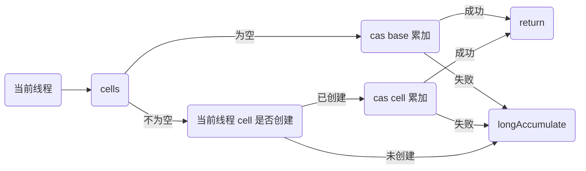

##### cells 未创建

```java
final void longAccumulate(long x, LongBinaryOperator fn,
                          boolean wasUncontended) {
    int h;
    if ((h = getProbe()) == 0) {
        ThreadLocalRandom.current(); // force initialization
        h = getProbe();
        wasUncontended = true;
    }
    boolean collide = false;                // True if last slot nonempty
    for (;;) {
        Cell[] as; Cell a; int n; long v;
        if ((as = cells) != null && (n = as.length) > 0) {
            if ((a = as[(n - 1) & h]) == null) {
                if (cellsBusy == 0) {       // Try to attach new Cell
                    Cell r = new Cell(x);   // Optimistically create
                    if (cellsBusy == 0 && casCellsBusy()) {
                        boolean created = false;
                        try {               // Recheck under lock
                            Cell[] rs; int m, j;
                            if ((rs = cells) != null &&
                                (m = rs.length) > 0 &&
                                rs[j = (m - 1) & h] == null) {
                                rs[j] = r;
                                created = true;
                            }
                        } finally {
                            cellsBusy = 0;
                        }
                        if (created)
                            break;
                        continue;           // Slot is now non-empty
                    }
                }
                collide = false;
            }
            else if (!wasUncontended)       // CAS already known to fail
                wasUncontended = true;      // Continue after rehash
            else if (a.cas(v = a.value, ((fn == null) ? v + x :
                                         fn.applyAsLong(v, x))))
                break;
            else if (n >= NCPU || cells != as)
                collide = false;            // At max size or stale
            else if (!collide)
                collide = true;
            else if (cellsBusy == 0 && casCellsBusy()) {
                try {
                    if (cells == as) {      // Expand table unless stale
                        Cell[] rs = new Cell[n << 1];
                        for (int i = 0; i < n; ++i)
                            rs[i] = as[i];
                        cells = rs;
                    }
                } finally {
                    cellsBusy = 0;
                }
                collide = false;
                continue;                   // Retry with expanded table
            }
            h = advanceProbe(h);
        }
        else if (cellsBusy == 0 && cells == as && casCellsBusy()) {
            boolean init = false;
            try {                           // Initialize table
                if (cells == as) {
                    Cell[] rs = new Cell[2];
                    rs[h & 1] = new Cell(x);
                    cells = rs;
                    init = true;
                }
            } finally {
                cellsBusy = 0;
            }
            if (init)
                break;
        }
        else if (casBase(v = base, ((fn == null) ? v + x :
                                    fn.applyAsLong(v, x))))
            break;                          // Fall back on using base
    }
}
```

##### cells 已创建

## 共享模型之不可变

- 属性用 final 修饰保证了该属性是只读的，不能修改。但如果是引用类型，虽然对象不可变，但其内部的属性是可变的。

- 类用 final 修饰保证了该类中的方法不能被覆盖，该类也无法被继承，防止子类无意间破坏不可变性。

单个方法是线程安全的，但如个其多个方法的组合不一定是线程安全的。

final 也用到了写屏障，final 之前的指令不会跑到 final 之后执行。

### 享元模式

场景：当需要复用数量有限的同一类对象时，如字符串常量池、线程池、包装类的缓存等。

## 并发工具

### 线程池

#### ThreadPoolExecutor

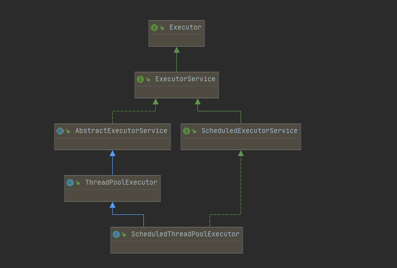

##### 线程池状态

ThreadPoolExecutor 使用 int 的高3位来表示线程池状态，低29位表示线程数量。这些信息存储在一个原子变量 ctl 中，目的是可以用一次 cas 原子操作进行赋值。

| 状态         | 高3位 | 接收新任务 | 处理阻塞任务 | 描述                     |
| ---------- | --- | ----- | ------ | ---------------------- |
| RUNNING    | 111 | Y     | Y      |                        |
| SHUTDOWN   | 000 | N     | Y      | 不会接收新任务，但会处理阻塞队列剩余任务   |
| STOP       | 001 | N     | N      | 会中断正在执行的任务，并抛弃阻塞队列任务   |
| TIDYING    | 010 | -     | -      | 任务全部执行完毕，活动线程为0，即将进入终结 |
| TERMINATED | 011 | -     | -      | 终结                     |

##### 构造方法

```java
public ThreadPoolExecutor(int corePoolSize,
                          int maximumPoolSize,
                          long keepAliveTime,
                          TimeUnit unit,
                          BlockingQueue<Runnable> workQueue,
                          ThreadFactory threadFactory,
                          RejectedExecutionHandler handler) {}
```

- `corePoolSize`：核心线程数（最多保留的线程数）。

- `maximumPoolSize`：最大线程数（减去核心线程数之后还能创建多少个临时线程）。

- `keepAliveTime`：存活时间，即超过 corePoolSize 的线程多久被回收。

- `unit`：存活时间单位。

- `workQueue`：阻塞队列。

- `threadFactory`：线程工厂，用来创建线程。

- `handler`：拒绝策略。

阻塞队列满了，新添加的任务才会去创建临时线程。最大线程数满了才会执行拒绝策略。

```txt
1. 线程池刚开始没有线程，当一个任务提交给线程池后，线程池会创建一个核心线程来执行该任务。
2. 当线程数达到 corePoolSize 后，这时新添加的任务会被加入到 workQueue 阻塞队列中，等待被线程池执行。
3. 如果 workQueue 是有界队列，那么当阻塞队列中任务数量超过了队列大小时，会创建 maximumPoolSize - corePoolSize 数目的临时线程来执行新添加的任务。
4. 如果线程数达到 maximumPoolSize，且还有新任务添加，这时会触发拒绝策略。JDK 提供了四种拒绝策略的实现：
    AbortPolicy：默认策略。抛 RejectedExecutionException 异常。
    CallerRunsPolicy：调用者线程执行该任务（即调用execute这个方法的线程）
    DiscardPolicy：放弃本次任务
    DiscardOldestPolicy：放弃队列中最早的任务，该任务取而代之。
5. 当高峰过去后，超过 corePoolSize 的临时线程如果在一段时间没有执行任务，则需要结束线程资源。这个时间由 keepAliveTime和unit 控制。
```

##### Executors.newFixedThreadPool

固定大小线程池：

```java
public static ExecutorService newFixedThreadPool(int nThreads) {
    return new ThreadPoolExecutor(nThreads, nThreads,
                                  0L, TimeUnit.MILLISECONDS,
                                  new LinkedBlockingQueue<Runnable>());
}

public static ExecutorService newFixedThreadPool(int nThreads, ThreadFactory threadFactory) {
    return new ThreadPoolExecutor(nThreads, nThreads,
                                  0L, TimeUnit.MILLISECONDS,
                                  new LinkedBlockingQueue<Runnable>(),
                                  threadFactory);
}
```

特点：

- 核心线程数 == 最大线程数，没有临时线程。

- 阻塞队列是无界的，可以添加任意数量的任务。

适用于任务量已知，相对耗时的任务。

##### Executors.newCachedThreadPool

带缓冲线程池：

```java
public static ExecutorService newCachedThreadPool() {
    return new ThreadPoolExecutor(0, Integer.MAX_VALUE,
                                  60L, TimeUnit.SECONDS,
                                  new SynchronousQueue<Runnable>());
}

public static ExecutorService newCachedThreadPool(ThreadFactory threadFactory) {
    return new ThreadPoolExecutor(0, Integer.MAX_VALUE,
                                  60L, TimeUnit.SECONDS,
                                  new SynchronousQueue<Runnable>(),
                                  threadFactory);
}
```

特点：

- 核心线程数是 0，最大线程数是 Integer.MAX_VALUE，临时线程的空闲时间是 60s。临时线程可以无限创建，都是临时线程，可被回收。

- 采用 SynchronousQueue 队列，该队列没有容量。将任务放到该队列中，不能马上返回（阻塞），需要等待另一个线程取出这个任务了，才能返回。最多只能放一个。多用于消息队列。

适用于任务数比较密集，但每个任务执行时间较短的情况。

##### Executors.newSingleThreadExecutor

单线程的线程池：

```java
public static ExecutorService newSingleThreadExecutor() {
    return new FinalizableDelegatedExecutorService
        (new ThreadPoolExecutor(1, 1,
                                0L, TimeUnit.MILLISECONDS,
                                new LinkedBlockingQueue<Runnable>()));
}

public static ExecutorService newSingleThreadExecutor(ThreadFactory threadFactory) {
    return new FinalizableDelegatedExecutorService
        (new ThreadPoolExecutor(1, 1,
                                0L, TimeUnit.MILLISECONDS,
                                new LinkedBlockingQueue<Runnable>(),
                                threadFactory));
}
```

使用场景：希望多个任务串行执行。线程数为 1，任务数超过 1时，会放入无界队列等待。

如果执行过程中发生异常，该线程池还会再创建一个线程，保证线程池的正常工作。

##### 提交任务

```java
// 执行任务
void execute(Runnable command);

// 提交任务 task，可以获取执行的返回值
<T> Future<T> submit(Callable<T> task);

// 提交 tasks 中的任务
<T> List<Future<T>> invokeAll(Collection<? extends Callable<T>> tasks)
        throws InterruptedException;

// 提交 tasks 中的任务，带超时时间
<T> List<Future<T>> invokeAll(Collection<? extends Callable<T>> tasks,
                          long timeout, TimeUnit unit)
        throws InterruptedException;

// 提交 tasks 中的任务，哪个任务先执行成功，就返回哪个任务的执行结果，其它任务取消
<T> T invokeAny(Collection<? extends Callable<T>> tasks) throws InterruptedException, ExecutionException;

// 提交 tasks 中的任务，哪个任务先执行成功，就返回哪个任务的执行结果，其它任务取消，带超时时间
<T> T invokeAny(Collection<? extends Callable<T>> tasks,
            long timeout, TimeUnit unit)
        throws InterruptedException, ExecutionException, TimeoutException;
```

##### 关闭线程池

###### shutdown

- 线程池状态变为 SHUTDOWN。

- 不会接收新任务。

- 已提交的任务会继续执行。

- 不会阻塞调用线程的执行。

```java
public void shutdown() {
  final ReentrantLock mainLock = this.mainLock;
  mainLock.lock();
  try {
      checkShutdownAccess();
      // 线程池状态变为 SHUTDOWN
      advanceRunState(SHUTDOWN);
      // 中断空闲线程
      interruptIdleWorkers();
      onShutdown(); // hook for ScheduledThreadPoolExecutor
  } finally {
      mainLock.unlock();
  }
  // 尝试终结
  tryTerminate();
}
```

###### shutdownNow

- 线程池状态变为 STOP。

- 不会接收新任务。

- 丢弃阻塞队列中的任务。

- 中断正在执行的任务。

```java
public List<Runnable> shutdownNow() {
  List<Runnable> tasks;
  final ReentrantLock mainLock = this.mainLock;
  mainLock.lock();
  try {
      checkShutdownAccess();
      advanceRunState(STOP);
      interruptWorkers();
      tasks = drainQueue();
  } finally {
      mainLock.unlock();
  }
  tryTerminate();
  return tasks;
}
```

##### Worker Thread

创建多少线程合适？：

1. CPU 密集型运算：通常采用 `cpu 核数 + 1` 能够实现最优的 CPU 利用率，+1 是保证当线程由于页缺失故障（操作系统）或其它原因导致暂停时，额外的这个线程就能顶替，保证 CPU 的时钟周期不被浪费。

2. IO 密集型运算：经验公式：`线程数 = 核数 * 期望 CPU 利用率 * 总时间(CPU计算时间+等待时间) / CPU 计算时间`

##### 任务调度线程池

- `ScheduledThreadPoolExecutor.schedule()`：延时执行。

- `ScheduledThreadPoolExecutor.scheduleAtFixedRate()`：定时执行。

- `ScheduledThreadPoolExecutor.scheduleWithFixedDelay()`：定时执行，以任务执行完成后开始计时。

线程池不会主动抛异常，需要手动捕获。或者使用 Callable，接收异常（会将异常封装到返回结果中）。

```java
ScheduledThreadPoolExecutor executor = new ScheduledThreadPoolExecutor(1);

// 延时执行
executor.schedule(() -> {
    System.out.println("ok");
}, 1, TimeUnit.SECONDS);

/*
    第二个参数：（第一次执行）延时多长时间执行；
    第三个参数：（非第一次执行）多久执行一次（频率）；
    第四个参数：时间单位。
*/
executor.scheduleAtFixedRate(() -> {
    log.debug("ok");
    try {
        Thread.sleep(2000);
    } catch (InterruptedException e) {
        e.printStackTrace();
    }
}, 2, 1, TimeUnit.SECONDS);

/*
    第二个参数：（第一次执行）延时多长时间执行；
    第三个参数：（非第一次执行）多久执行一次（频率），注意：需等待上一个任务执行完后，才开始计时。
    第四个参数：时间单位。
*/
executor.scheduleWithFixedDelay(() -> {
    log.debug("ok");
    try {
        Thread.sleep(2000);
    } catch (InterruptedException e) {
        e.printStackTrace();
    }
}, 2, 1, TimeUnit.SECONDS);
```

###### 定时任务

##### Tomcat 线程池

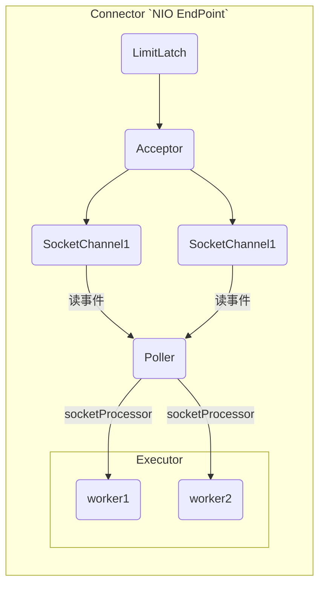

- LimitLatch 用来限流，可以控制最大连接数，类似 JUC Semaphore。

- Acceptor 负责接收新的 socket 连接。

- Poller 负责监听 socket channel 是否有可读的 IO 事件。

- 一旦有可读事件，封装一个任务对象（socketProcessor），提交给 Executor 线程池处理。

- Executor 线程池中的工作线程负责处理请求。

Tomcat 的线程数如果达到了 maximumPoolSize，并不会立即抛 RejectedExecutionException。而是会再次尝试将任务放入队列中，如果还是失败，才抛 RejectedExecutionException。

Connector 配置

| 配置项                 | 默认值 | 描述                          |
| ------------------- | --- | --------------------------- |
| acceptorThreadCount | 1   | acceptor 线程数                |
| pollerThreadCount   | 1   | poller 线程数                  |
| minSpareThreads     | 10  | 核心线程数，corePoolSize          |
| maxThreads          | 200 | 最大线程数，maximumPoolSize       |
| executor            | -   | Executor 名称，用来自定义线程池，覆盖默认配置 |

Executor 线程配置

| 配置项                     | 默认值               | 描述                    |
|:----------------------- | ----------------- | --------------------- |
| threadPriority          | 5                 | 线程优先级                 |
| daemon                  | true              | 是否守护线程                |
| minSpareThreads         | 25                | 核心线程数，corePoolSize    |
| maxThreads              | 200               | 最大线程数，maximumPoolSize |
| maxIdleTime             | 60000             | 线程存活时间，单位毫秒 ，默认1分钟    |
| maxQueueSize            | Integer.MAX_VALUE | 队列长度                  |
| prestartminSpareThreads | false             | 核心线程是否再服务器启动时启动       |

Tomcat 当提交的任务数超过核心线程数，但没超过最大线程数，Tomcat 就会创建临时线程来处理任务。当提交的任务数超过最大线程数，才会将新任务放入队列。

#### Fork/Join

JDK7 加入的新的线程池实现。体现了分治思想。适用于能够进行任务拆分的 CPU 密集型运算。所谓的任务拆分，是将一个大任务拆分为算法上相同的小任务，然后求解。

Fork/Join 可以把每个任务的分解和合并交给不同的线程来完成。提升运算效率。

Fork/Join 默认会创建与 CPU 核心数相同的线程池。

需要返回值就继承`RecursiveTask`，不需要返回值就继承`RecusiveAction`。`fork()`方法用于拆分任务，`join()`方法用于合并结果。

```java
public class Demo5 {
    public static void main(String[] args) {
        ForkJoinPool forkJoinPool=new ForkJoinPool(4);
        forkJoinPool.invoke(new AddTask(1,10));
    }
    static class AddTask extends RecursiveTask<Integer> {
        int head;
        int last;
        AddTask(int head,int last){
            this.head=head;
            this.last=last;
        }

        @Override
        protected Integer compute() {
            if(head==last){
                return head;
            }
            if (head==last-1){
                System.out.println(head+"-"+last+"相加为"+(head+last));
                return head+last;
            }
            int mid=(head+last)/2;
            AddTask addTask = new AddTask(head, mid);
            addTask.fork();
            AddTask addTask1 = new AddTask(mid + 1, last);
            addTask1.fork();
            int result=addTask.join()+addTask1.join();
            System.out.println(head+"-"+last+"相加为"+result);
            return result;
        }
    }
}
```

类似二分查找法。

### JUC 工具类

#### AQS

AbstractQueuedSynchronizer，是阻塞式锁和相关同步器工具的框架。

特点：

- 用 state 属性来表示资源的状态（独占模式和共享模式），子类需要定义如何维护这个状态，控制如何获取锁和释放锁。
  
  - `getState()` 获取 state 状态。
  
  - `setState()` 设置  state 状态。
  
  - `compareAndSetState()` cas 机制设置 state 状态。
  
  - 独占模式下（锁）只能有一个线程能够访问资源，而共享模式下可以允许多个线程访问资源。

- 提供基于 FIFO 的等待队列，类似于 Monitor EntryList。

- 支持条件变量来实现等待、唤醒机制，支持多个条件变量，类似于 Monitor WaitSet。

子类主要实现下面几个方法。（调用父类的会抛异常 `UnsupportedOperationException`）

1. tryAcquire

2. tryRelease

3. tryAcquireShared

4. tryReleaseShared

5. isHeldExclusively

```java
// 如果获取锁失败
if (!tryAcquire(arg)) {
    // 可以选择阻塞当前线程。加入阻塞队列，park()
}

// 如果释放锁成功
if (tryRelease(arg)) {
    // 让阻塞线程恢复运行，unpark()
}
```

##### 自定义锁

```java
@Slf4j
public class App {

    public static void main(String[] args) {
        MyLock lock = new MyLock();
        new Thread(() -> {
            lock.lock();
            try {
                log.debug("加锁成功");
            } finally {
                lock.unlock();
            }
        }, "t1").start();

        new Thread(() -> {
            lock.lock();
            try {
                log.debug("加锁成功");
            } finally {
                lock.unlock();
            }
        }, "t2").start();
    }

    /**
     * 自定义锁，不可重入锁
     */
    static class MyLock implements Lock {
        /**
         * 独占锁，同步器类
         */
        @Slf4j
        static class MySync extends AbstractQueuedSynchronizer {
            @Override
            protected boolean tryAcquire(int arg) {
                boolean flag;
                if ((flag = compareAndSetState(0, 1))) {
                    // 加锁成功，并设置 owner  为当前线程
                    setExclusiveOwnerThread(Thread.currentThread());
                }
                log.debug("{}", flag);
                return flag;
            }

            @Override
            protected boolean tryRelease(int arg) {
                setExclusiveOwnerThread(null);
                setState(0);
                return true;
            }

            /**
             * 是否持有独占锁
             *
             * @return
             */
            @Override
            protected boolean isHeldExclusively() {
                return getState() == 1;
            }

            public Condition newCondition() {
                return new ConditionObject();
            }
        }

        private MySync sync = new MySync();

        @Override
        public void lock() {
            sync.acquire(1);
        }

        @Override
        public void lockInterruptibly() throws InterruptedException {
            sync.acquireInterruptibly(1);
        }

        @Override
        public boolean tryLock() {
            return sync.tryAcquire(1);
        }

        @Override
        public boolean tryLock(long time, TimeUnit unit) throws InterruptedException {
            return sync.tryAcquireNanos(1, unit.toNanos(time));
        }

        @Override
        public void unlock() {
            sync.release(1);
        }

        @Override
        public Condition newCondition() {
            return sync.newCondition();
        }
    }
}
```

#### ReentrantLock

##### 加锁成功

```java
private final Sync sync;

// 默认构造
public ReentrantLock() {
    sync = new NonfairSync();
}

public void lock() {
    // lock() 是抽象方法，由子类 NonfairSync、FairSync 实现 
    sync.lock();
}

static final class NonfairSync extends Sync {
    private static final long serialVersionUID = 7316153563782823691L;

    /**
     * Performs lock.  Try immediate barge, backing up to normal
     * acquire on failure.
     */
    final void lock() {
        // 是不是很熟悉，和上面自定义锁使用方式一样
        if (compareAndSetState(0, 1))
            setExclusiveOwnerThread(Thread.currentThread());
        else
            acquire(1);
    }

    protected final boolean tryAcquire(int acquires) {
        return nonfairTryAcquire(acquires);
    }
}
```

#### 读写锁

#### Semaphore

#### CountdownLatch

#### CyclicBarrier

#### ConcurrentHashMap

#### ConcurrentLinkedQueue

#### BlockingQueue

### disruptor

### guava

#### RateLimiter

原理部分先不看了，平时工作没有应用场景，很难理解，后面有并发工作场景后再来补全这部分吧。