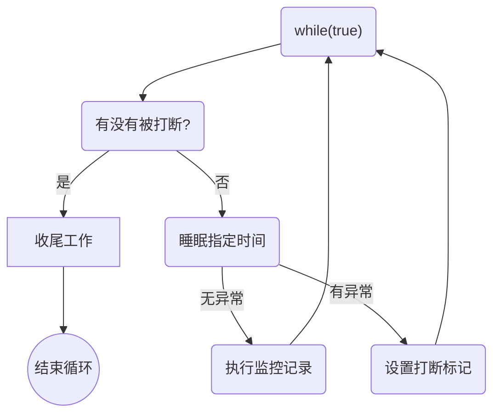
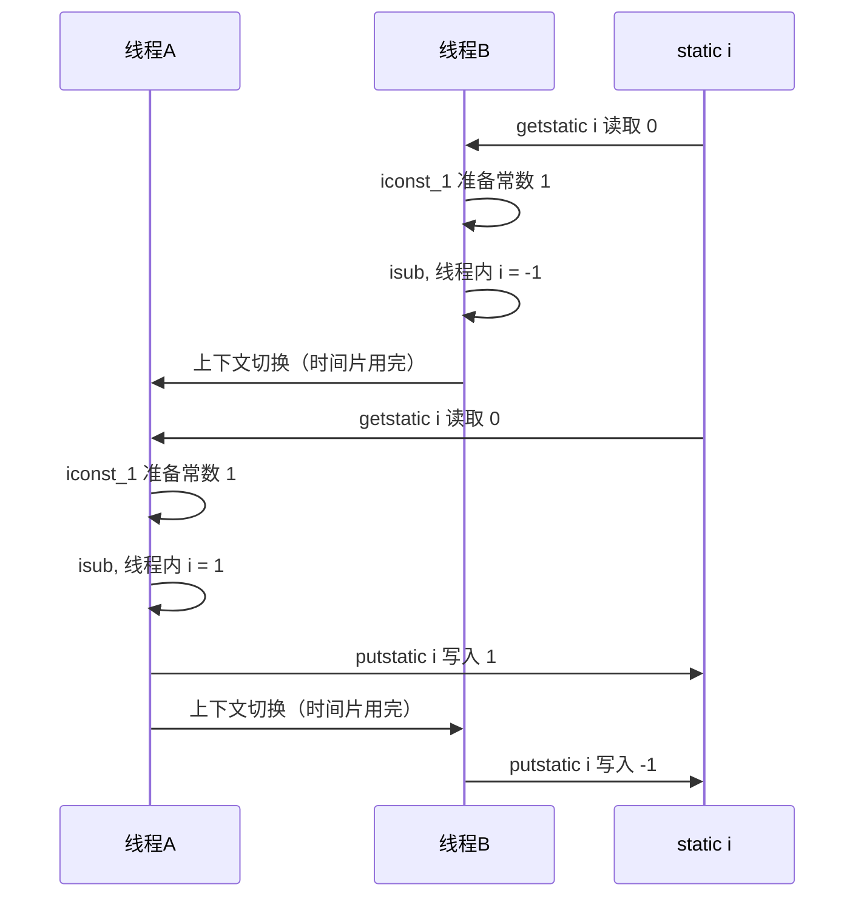

# JUC
## 进程与线程
### 进程与线程
#### 进程
* 程序是由指令和数据组成的，但这些指令要运行起来，数据要读写，就必须将指令加载至 CPU，数据加载至内存。再指令运行过程中还需要用到磁盘、网络等设备。而进程就是用来加载指令、管理内存、管理IO的。
* 当一个程序被运行，从磁盘加载这个程序的代码到内存，这时就开启了一个进程。
* 进程可以视为程序的一个实例。有些程序可以同时运行多个实例进程（记事本、画图、浏览器等），有的程序只能启动一盒实例进程（360、网易云等）
#### 线程
* 一个进程中可以分为一到多个线程。
* 一个线程就是一个指令流，将指令流中的一条条指令以一定的顺序交给CPU执行。
* 在 Java 中，线程作为最小调度单位，进程作为资源分配的最小单位。在 Windows 中进程是不活动的，只是作为线程的容器。
#### 线程和进程的区别
* 进程基本上相互独立，而线程存在于进程内，是进程的子集。
* 进程拥有共享的资源 ，如内存空间等，供其内部的线程共享。
* 进程间通信较为复杂
    * 同一台计算机的进程通信称为 IPC（Inter process communication）
    * 不同计算机之间的进程通信，需要通过网络，并遵守协议，如 HTTP等。
* 线程通信相对简单，因为它们共享进程内的内存（比如多个线程可以访问到同一个共享变量）
* 线程更轻量，线程上下文（CPU时间片）切换成本一般要比进程上下切换低。
#### 并行与并发
并行：同一时刻执行。

并发：同一时间段执行。
    * 涉及到线程上下文切换，将 cpu时间片 分给不同的线程使用。（Windows 时间片最小约为15毫秒）
    * 假设8核cpu开启了16个线程，但不足以同时满足1000人秒杀，这种情况操作系统的任务调度器就会让线程轮流使用cpu。
#### 同步和异步
从方法调用的角度看：
* 方法的调用者需要等待结果返回，才能继续运行即是同步。
* 方法的调用者不需要等待结果返回，发起方法调用后，就可以返回，继续运行即是异步。
## Java 线程
### 创建和运行线程
#### Thread
```java
Thread t = new Thread("t1") {
    @Override
    public void run() {
        log.debug("new Thread");
    }
};
// 启动线程
t.start();
log.debug("main...");
```
#### Runnable
```java
new Thread(() ->{
    log.debug("Runnable...");
}, "t1").start();

log.debug("main...");
```
#### FutureTask
```java
FutureTask<Integer> future = new FutureTask<>(() -> {
    log.debug("FutureTask...");
    return 100;
});
new Thread(future, "t1").start();

// get() 阻塞同步等待 task 执行的结果
log.debug("result: {}", future.get());
```
FutureTask 能够接收 Callable 类型的参数，用来处理有返回结果的情况。
### 查看进程线程的命令
#### Windows
* 任务管理器可以查看进程和线程数，也可以 kill 进程。
* `tasklist` 查看进程。
* `taskkill /F /PID <PID>` kill 线程。
#### Linux
* `ps -fe` 查看 Java 进程。
* `ps -fT -p <PID>` 查看指定进程。
* `kill -9 <PID>` kill 进程。
* `top` 查看进程，按 H 切换显示线程。
* `top -H -p <PID>` 查看指定进程的所以线程。
#### Java
* `jps` 查看所以 Java 进程。
* `jstack <PID>`查看指定 Java 进程的所以线程状态
* `jconsole`查看指定 Java 进程中线程的运行情况（可视化界面）

jconsole 远程监控配置：
* 需要以如下配置运行 Java 类或 jar（java -jar）。
```txt
java -Djava.rmi.server.hostname=ip地址 -Dcom.sun.management.jmxremote -Dcom.sun.management.jmxremote.port=连接端口 -Dcom.sun.management.jmxremote.ssl=是否安全连接 -Dcom.sun.management.jmxremote.authenticate=是否认证 Java类或jar
```
* 修改 /etc/hosts 文件将 127.0.0.1 映射至主机名
* 如果需要认证访问，还需要几个步骤（具体Google，就不再赘述）
### 线程 API
1. `start()`：启动一个新线程，在新的线程中运行 run 方法，但是 start 只是让线程进入就绪状态，并不是立刻执行，CPU的时间片还没分给它。每个线程对象的 start 方法只能调用一次，多次调用会出现 IllegalThreadStateException。
2. `run()`：新线程启动后会调用的方法。如果在Thread对象中传递了 Runnable 参数，那么线程启动后会调用 Runnable 中的 run 方法。否则默认不执行任何操作。但可以创建 Thread 的子类，来覆盖默认行为。
3. `join()`：等待线程运行结束。
4. `join(long n)`：等待线程运行结束，最多等待 n 毫秒。
5. `getId()`：获取线程的长整型id，id唯一。
6. `getPriority()`：获取线程优先级。
7. `setPriority()`：设置线程优先级。Java中线程优先级是1~10的整数，默认优先级5，较大的优先级能提高该线程被CPU调度的几率。
8. `getState()`：获取线程状态。Java中线程状态使用枚举类表示的。分别为 NEW、RUNNABLE、BLOCKED、WAITING、TIMED_WAITING、TERMINATED。
9. `isInterrupted()`：判断是否被中断，不会清除中断标记。
10. `isAlive()`：线程是否存活，表示还没有执行完任务。
11. `interrupt()`：中断线程，如果被中断的线程正在 sleep、wait、join 会导致被中断的线程抛出 InterruptedException，并清除中断标记；如果中断正在运行的线程，则会设置中断标记；park（LockSupport） 的线程被中断，也会设置中断标记。
12. `interrupted()`：判断当前线程是否被中断，会清除中断标记。
13. `sleep(long n)`：让当前指执行的线程休眠 n 毫秒，休眠期间会让出 cpu 的时间片（休眠期间不会占用cpu）。
### sleep & yield
14. `yield()`：通知线程调度器让出当前线程对 cpu 的使用。
#### sleep
1. 调用 sleep 会让当前线程从 Running 进入 Timed Waiting 状态（阻塞）。
2. 其它线程可以使用 interrupt() 方法中断正在睡眠的线程，这时 sleep 方法会抛出 InterruptedException。
3. 所谓的中断，就是把正在睡眠的线程"叫醒"。
4. 睡眠结束后的线程未必会立即得到执行（等待分配CPU时间片）。
5. 建议使用 TimeUnit 的 sleep 替代 Thread 的 sleep 来获得更好的可读性。
#### yield
1. 调用 yield 会让当前线程从 Running 进入 Runnable 状态（就绪）。然后调度器执行其它线程。（本身可能也会继续得到）
2. 具体的实现依赖操作系统的任务调度器。
### join
`join` 方法是同步的。

`join(long n)`：等待线程运行结束，最多等待 n 毫秒。限时同步。但是如果线程提前执行完了，会导致 join 结束。（如果 join 等待3秒，但是线程两秒就执行完业务了，那么 join 会提前结束，这时等价于 无参 join）
### interrupt
中断正在睡眠（sleep、wait、join）的线程，会清空中断标记（false）。

如果中断正常执行的线程，则不会InterruptException，会将中断标记置为true。被中断的线程可以用`Thread.currentThread().isInterrupted()`判断是否被中断，然后执行对应的逻辑。可以用来停止线程。
#### 两阶段终止

#### 终止线程的错误思路
1. 使用线程对象的 stop() 方法停止线程
    * stop 方法会 kill 线程，如果这时线程锁住了共享资源，那么当它被 kill 后就没有机会释放锁了，其它线程也将无法获取锁。
2. 使用 `System.exit(int n)` 方法停止线程
    * 目的是仅停止一个线程。但这种做法会让整个程序都停止。
### 主线程和守护线程
默认情况下，Java 进程需要等待所以线程都运行结束，才会结束。

守护（Daemon）线程：只要其它非守护线程运行结束了，即时守护线程的代码没有执行完，也会被强制结束。

* 垃圾回收器线程就是一个守护线程。
* Tomcat 中的 Acceptor 和 Poller 线程都是守护线程，所以当年那个 Tomcat 接收到 shutdown 命令后，不会等待 Acceptor 和 Poller 处理完当前请求。
### 线程状态
#### 五种状态


这是从操作系统层面来描述的：
* 初始状态：仅仅创建了线程对象，还没有和操作系统线程关联。
* 可运行状态：（就绪状态，yield）与操作系统线程关联，可以被 CPU 调度执行。
* 运行状态：获得了 CPU 时间片。当CPU时间片用完，会从运行状态转换中可运行状态，会导致线程的上下文切换。
* 阻塞状态：调用了阻塞 API，如 BIO 读写文件，这时该线程实际不会用到CPU，会导致线程上下文切换，进入阻塞状态。当BIO操作完成，会由操作系统唤醒阻塞的线程，转换至可运行状态。
* 终止状态：生命周期结束，线程任务执行完了。
#### 六种状态
Java API 层面描述。
* `NEW`：创建线程对象。
* `RUNNABLE`：调用了 start() 方法。RUNNABLE状态涵盖了操作系统层面的可运行状态、运行状态以及阻塞状态（BIO操作、阻塞API）。
* `BLOCKED`：synchronized
* `WAITING`：join()
* `TIMED_WAITING`：sleep()
* `TERMINATED`：
### 线程运行基础
虚拟机栈、栈帧、程序计数器、局部变量表、返回地址 ...
## 共享模型之管程

管程：Monitor

### 共享问题

`i++`不是原子操作，在字节码上对应四条指令：
```txt
getstatic   i   // 获取静态变量 i 的值
iconst_1        // 把数字1放到操作数栈中
iadd            // 自增
putstatic   i   // 将修改后的值存入静态变量 i
```
如果此时有A、B两个线程在多线程下修改静态变量 i 的值，因为两个线程在字节码种都会有`putstatic`（将值写入内存（方法区，JDK8是元空间，在直接内存中存储）），此时 i 的值就会有两种可能。

#### 错乱情况



如果是正数的情况，则线程A、B执行顺序调换即可。这是由于指令交错执行造成的线程不安全。
#### 临界区（Critical Section）
在多线程对共享资源读写操作时会发生指令交错，这时就会出现问题（并发问题）。

一段代码块内如果存在对共享资源的多线程读写操作，则称这段代码块为临界区。
#### 竞态条件（Race Condition）
多个线程在临界区内执行，由于代码的执行序列不同而导致结果无法预测，则称之为发生了竞态条件。
### synchronized
避免临界区的竞态条件发生。
* 阻塞式：synchronized、Lock
* 非阻塞式：原子变量

synchronized，俗称对象锁，采用互斥的方式让同一时刻只能有一个线程可以持有对象锁。即时被 synchronized 锁住，线程也不可能一直执行，如果CPU时间片用完了，再去等待获取CPU时间片，期间是不会释放锁的。

synchronized 用对象锁保证了临界区内代码的原子性，临界区内的代码不会被线程切换打断。
#### 方法上的 synchronized
```java
// 成员方法
class Test {
    public synchronized void test() {}
}
// 等价于
class Test {
    public void test() {
        synchronized(this) {}
    }
}

// 静态方法
class Test {
    public synchronized static void test() {}
}
// 等价于
class Test {
    public static void test() {
        synchronized(Test.class) {}
    }
}
```
### Monitor
#### 对象头
以32位虚拟机为例，32位虚拟机空对象头占8字节，64位占16字节。
##### 普通对象
```ruby
|----------------------------------------------------------------|
|                 Object Header (64 bits)                        |
|-------------------------------|--------------------------------|
|      Mark Word (32 bits)      |      Klass Word (32 bits)      |
|-------------------------------|--------------------------------|
```
##### 数组对象
```ruby
|---------------------------------------------------------------------------------------------------|
|                               Object Header (96 bits)                                             |
|-------------------------------|--------------------------------|----------------------------------|
|      Mark Word (32 bits)      |      Klass Word (32 bits)      |      array length (32 bits)      |   
|-------------------------------|--------------------------------|----------------------------------|
```
##### Mark Word 
```ruby
|----------------------------------------------------------------------|------------------------|
|           Mark Word (32 bits)                                        |   State                |
|----------------------------------------------------------------------|------------------------|
|   hashcode:25               |   age:4   |   biased_lock:0   |   01   |   Normal               |
|----------------------------------------------------------------------|------------------------|
|   thread:23   |   epoch:2   |   age:4   |   biased_lock:1   |   01   |   Biased               |
|----------------------------------------------------------------------|------------------------|
|              ptr_to_lock_record:30                          |   00   |   Lightweight Locked   |
|----------------------------------------------------------------------|------------------------|
|              ptr_to_heavyweight_monitor:30                  |   10   |   Heavyweight Locked   |
|----------------------------------------------------------------------|------------------------|
|                                                             |   11   |   Marked for GC        |
|----------------------------------------------------------------------|------------------------|
```
`biased_lock:0`：是不是偏向锁，紧接着最后2位`01`表示加锁状态。

64 位虚拟机 Mark Word：
```ruby
|--------------------------------------------------------------------------------------------------------------|
|                 Mark Word (64 bits)                                                 |   State                |
|-------------------------------------------------------------------------------------|------------------------|
|   unused:25   |hashcode:25  |   unused:1   |   age:4   |   biased_lock:0   |   01   |   Normal               |
|-------------------------------------------------------------------------------------|------------------------|
|   thread:54   |   epoch:2   |   unused:1   |   age:4   |   biased_lock:1   |   01   |   Biased               |
|-------------------------------------------------------------------------------------|------------------------|
|              ptr_to_lock_record:62                                         |   00   |   Lightweight Locked   |
|-------------------------------------------------------------------------------------|------------------------|
|              ptr_to_heavyweight_monitor:62                                 |   10   |   Heavyweight Locked   |
|-------------------------------------------------------------------------------------|------------------------|
|                                                                            |   11   |   Marked for GC        |
|-------------------------------------------------------------------------------------|------------------------|
```
#### Monitor
Monitor：监视器。

每个 Java 对象都可以关联一个 Monitor（操作系统提供的对象） 对象，如果使用 synchronized 给对象加锁（重量级）之后，该对象头的 Mark Word 中就会被设置指向 Monitor 对象的指针。

Monitor 结构如下：


* 刚开始 Monitor 中 Owner 为 null。
* 当 Thread-2 执行 synchronized(obj) 就会将 Monitor 的所有者 Owner 设置为 Thread-2，Monitor 中只能同时存在一个 Owner。
* 在 Thread-2 加锁的过程中，如果 Thread-3、Thread-4、Thread-5 也执行到 synchronized(obj)，就会进入 EntryList BLOCKED。
* 等待 Thread-2 执行完同步代码块中的逻辑后，然后唤醒 EntryList 中等待的线程来竞争锁，竞争锁时是非公平的。
* WaitSet 中的 Thread-0、Thread-1 是之前获得过锁，但条件不满足进入 WAITING 状态的线程。

synchronized 必须是获取到同一个对象的 monitor 才有上述的效果。
### wait/notify
### 线程状态转换
### Lock


