# JVM
> 参考了 https://javaguide.cn/java/jvm/jvm-garbage-collection.html#%E5%A4%8D%E5%88%B6%E7%AE%97%E6%B3%95
## JVM内存模型


Java 虚拟机在执行 Java 程序的过程中会把它管理的内存划分成若干个不同的 数据区域。JDK1.8和以前的版本略有不同。

JDK1.8与1.7最大的区别是1.8将永久代取消，取而代之的是元空间，既然方法区是由永久代实现的，取消了永久代，那么方法区由谁来实现呢，在1.8中方法区是由元空间来实现，所以原来属于方法区的运行时常量池就属于元空间了。

在JDK1.7 字符串常量池被从方法区拿到了堆中, 这里没有提到运行时常量池,也就是说字符串常量池被单独拿到堆,运行时常量池剩下的东西还在方法区, 也就是hotspot中的永久代

### 程序计数器
```txt
 0: getstatic     #2                  // Field java/lang/System.out:Ljava/io/PrintStream;
 3: astore_1
 4: aload_1
 5: iconst_1
 6: invokevirtual #3                  // Method java/io/PrintStream.println:(I)V
 9: aload_1
10: iconst_2
11: invokevirtual #3                  // Method java/io/PrintStream.println:(I)V
14: aload_1
15: iconst_3
16: invokevirtual #3                  // Method java/io/PrintStream.println:(I)V
19: aload_1
20: iconst_4
21: invokevirtual #3                  // Method java/io/PrintStream.println:(I)V
24: aload_1
25: iconst_5
26: invokevirtual #3                  // Method java/io/PrintStream.println:(I)V
29: return
```
程序计数器可以看作是当前线程所执行的字节码的行号指示器。字节码解释器工作时通过改变这个计数器的值来选取下一条需要执行的字节码指令。例如上述字节码文件最左边的数字可以看作是程序计数器。（记录下一条JVM指令的执行地址）

在物理上是通过寄存器实现的。（寄存器是CPU组件中读取速度最快的单元）。

特点：1、线程私有。2、程序计数器是唯一一个不会出现 OutOfMemoryError 的内存区域，它的生命周期随着线程的创建而创建，随着线程的结束而死亡。


### 栈
#### 虚拟机栈
与程序计数器一样，Java 虚拟机栈也是线程私有的，它的生命周期和线程相同，随着线程的创建而创建，随着线程的死亡而死亡。

* 栈：线程运行需要的内存空间，称为虚拟机栈。
* 栈帧（Frame）：每个方法运行时需要的内存。
* 栈由一个个栈帧组成，一个栈帧就对应一次方法的调用。而每个栈帧中都拥有：局部变量表、操作数栈、动态链接、方法返回地址。
* 每个线程只能有一个活动栈帧，对应着当前正在执行的那个方法。

演示：


说明：在栈顶部的栈帧就称为活动栈帧。

问题分析：
1. 垃圾回收是否设计栈内存？
```txt
栈帧内存在每一次方法调用后，都会被弹出栈，即自动被回收，不需要垃圾回收进行管理栈内存。

垃圾回收针对是堆内存中的无用对象。
```
2. 栈内存分配越大越好吗？
```txt
使用 -Xss size 寻虚拟机参数指定栈内存
-Xss1m 
-Xss1024k
-Xss1048576

栈内存分配越大只是能够进行更多次的方法递归调用，并不能提升程序执行速度。反而还会降低线程运行数。
```
3. 方法内的局部变量是否线程安全？
```txt
是线程安全
一个线程对应一个栈，线程内每一次方法调用都会产生一个新的栈帧。多个线程就会有多个私有的局部变量。
```
判断一个变量是不是线程安全，不仅要考虑是不是方法内的局部变量，还要考虑方法内局部变量（引用类型）逃离了方法的作用范围。如果逃离了方法的作用范围，那么有可能被其他线程访问到。则需要考虑线程安全。

##### 栈内存溢出
栈空间固定，栈帧过多导致栈内存移除（栈容纳不下栈帧了，典型的有递归调用且没有结束条件）。

`java.lang.StackOverflowError`

##### 线程运行诊断
1. 案例1：CPU 占用过多
```txt
定位：
   1、用`top`命令定位哪个进程堆CPU的占用过高。（PID（进程id））
   2、`ps H -eo pid,tid,%cpu | grep PID`（H：展示详细信息，-eo 输出指定信息）
       用ps命令进一步定位是哪个线程引起的CPU占用过高
   3、jstack PID，根据线程id找到有问题的线程，进一步定位到问题代码的行数
   
jstack 命令输出的线程编号（nid）是16进制，需要将ps命令打印的tid列的参数转换为16进制。
通过 jstack 命令排查出是哪个线程出现问题后，就可以去对应类检查问题。（jstack 也会打印出现问题的代码行数）
```
2. 案例2：程序运行很长事件没有结果
```txt
死锁案例，定位：
   1、使用`jps -1`命令查找Java进程，并定位到是哪个类迟迟没有结果
   2、jstack PID
```
执行`jstack 1842`命令后会输出如下信息
```txt
[root@server7 ~]# jstack 1842
2023-06-25 22:47:40
Full thread dump Java HotSpot(TM) 64-Bit Server VM (25.271-b09 mixed mode):

"Attach Listener" #12 daemon prio=9 os_prio=0 tid=0x00007ff0e8001000 nid=0x767 waiting on condition [0x0000000000000000]
   java.lang.Thread.State: RUNNABLE

"DestroyJavaVM" #11 prio=5 os_prio=0 tid=0x00007ff128009800 nid=0x733 waiting on condition [0x0000000000000000]
   java.lang.Thread.State: RUNNABLE

"Thread-1" #10 prio=5 os_prio=0 tid=0x00007ff12817b800 nid=0x742 waiting for monitor entry [0x00007ff102508000]
   java.lang.Thread.State: BLOCKED (on object monitor)
	at Test.lambda$main$1(Test.java:24)
	- waiting to lock <0x00000000d685d2e0> (a A)
	- locked <0x00000000d685dd28> (a B)
	at Test$$Lambda$2/303563356.run(Unknown Source)
	at java.lang.Thread.run(Thread.java:748)

"Thread-0" #9 prio=5 os_prio=0 tid=0x00007ff128179800 nid=0x741 waiting for monitor entry [0x00007ff102609000]
   java.lang.Thread.State: BLOCKED (on object monitor)
	at Test.lambda$main$0(Test.java:16)
	- waiting to lock <0x00000000d685dd28> (a B)
	- locked <0x00000000d685d2e0> (a A)
	at Test$$Lambda$1/471910020.run(Unknown Source)
	at java.lang.Thread.run(Thread.java:748)

"Service Thread" #8 daemon prio=9 os_prio=0 tid=0x00007ff1280d0800 nid=0x73f runnable [0x0000000000000000]
   java.lang.Thread.State: RUNNABLE

"C1 CompilerThread2" #7 daemon prio=9 os_prio=0 tid=0x00007ff1280bd800 nid=0x73e waiting on condition [0x0000000000000000]
   java.lang.Thread.State: RUNNABLE

"C2 CompilerThread1" #6 daemon prio=9 os_prio=0 tid=0x00007ff1280bb800 nid=0x73d waiting on condition [0x0000000000000000]
   java.lang.Thread.State: RUNNABLE

"C2 CompilerThread0" #5 daemon prio=9 os_prio=0 tid=0x00007ff1280b8800 nid=0x73c waiting on condition [0x0000000000000000]
   java.lang.Thread.State: RUNNABLE

"Signal Dispatcher" #4 daemon prio=9 os_prio=0 tid=0x00007ff1280b7000 nid=0x73b runnable [0x0000000000000000]
   java.lang.Thread.State: RUNNABLE

"Finalizer" #3 daemon prio=8 os_prio=0 tid=0x00007ff128086000 nid=0x73a in Object.wait() [0x00007ff102d10000]
   java.lang.Thread.State: WAITING (on object monitor)
	at java.lang.Object.wait(Native Method)
	- waiting on <0x00000000d6808ee0> (a java.lang.ref.ReferenceQueue$Lock)
	at java.lang.ref.ReferenceQueue.remove(ReferenceQueue.java:144)
	- locked <0x00000000d6808ee0> (a java.lang.ref.ReferenceQueue$Lock)
	at java.lang.ref.ReferenceQueue.remove(ReferenceQueue.java:165)
	at java.lang.ref.Finalizer$FinalizerThread.run(Finalizer.java:216)

"Reference Handler" #2 daemon prio=10 os_prio=0 tid=0x00007ff128081800 nid=0x739 in Object.wait() [0x00007ff102e11000]
   java.lang.Thread.State: WAITING (on object monitor)
	at java.lang.Object.wait(Native Method)
	- waiting on <0x00000000d6806c00> (a java.lang.ref.Reference$Lock)
	at java.lang.Object.wait(Object.java:502)
	at java.lang.ref.Reference.tryHandlePending(Reference.java:191)
	- locked <0x00000000d6806c00> (a java.lang.ref.Reference$Lock)
	at java.lang.ref.Reference$ReferenceHandler.run(Reference.java:153)

"VM Thread" os_prio=0 tid=0x00007ff128078000 nid=0x738 runnable 

"GC task thread#0 (ParallelGC)" os_prio=0 tid=0x00007ff12801e800 nid=0x734 runnable 

"GC task thread#1 (ParallelGC)" os_prio=0 tid=0x00007ff128020800 nid=0x735 runnable 

"GC task thread#2 (ParallelGC)" os_prio=0 tid=0x00007ff128022800 nid=0x736 runnable 

"GC task thread#3 (ParallelGC)" os_prio=0 tid=0x00007ff128024000 nid=0x737 runnable 

"VM Periodic Task Thread" os_prio=0 tid=0x00007ff1280d3800 nid=0x740 waiting on condition 

JNI global references: 310


Found one Java-level deadlock:
=============================
"Thread-1":
  waiting to lock monitor 0x00007ff0f4002178 (object 0x00000000d685d2e0, a A),
  which is held by "Thread-0"
"Thread-0":
  waiting to lock monitor 0x00007ff0f4006218 (object 0x00000000d685dd28, a B),
  which is held by "Thread-1"

Java stack information for the threads listed above:
===================================================

// 看下面这段信息，问题出现在 Test.java 24行，Test.java 16行，waiting to lock
"Thread-1":
	at Test.lambda$main$1(Test.java:24)
	- waiting to lock <0x00000000d685d2e0> (a A)
	- locked <0x00000000d685dd28> (a B)
	at Test$$Lambda$2/303563356.run(Unknown Source)
	at java.lang.Thread.run(Thread.java:748)
"Thread-0":
	at Test.lambda$main$0(Test.java:16)
	- waiting to lock <0x00000000d685dd28> (a B)
	- locked <0x00000000d685d2e0> (a A)
	at Test$$Lambda$1/471910020.run(Unknown Source)
	at java.lang.Thread.run(Thread.java:748)

Found 1 deadlock.
```
可以看到输出内容的底部有`Found one Java-level deadlock`字样，说明出现了死锁。并且输出内容的底部也说明了问题出现的类和行数。

#### 本地方法栈
调用本地方法时给本地方法提供的内存空间。
### 堆
此内存区域的唯一目的就是存放对象实例（new），几乎所有的对象实例以及数组都在这里分配内存（逃逸分析可以在栈上分配内存）。

特点：线程共享，堆中对象需要考虑线程安全，有垃圾回收机制。

#### 堆内存溢出
堆内存中的空间不足以存放新创建的对象，就会引发`java.lang.OutOfMemoryErrot: Java heap space`错误，可通过设置虚拟机参数`-Xmx`修改堆内存大小。
```txt
eg:
   -Xmx8m
   -Xmx256m
```
#### 堆内存诊断
* jps：查看当前系统中有哪些 Java 进程。
* jmap：查看堆内存占用情况（某一时刻）。（`jmap -heap 进程id`）
* jconsole：图形界面，多功能检测工具（还可以检测线程、CPU..），可以连续检测。

案例
```java
public class Application {

    public static void main(String[] args) throws Exception {
        System.out.println("1...");
        Thread.sleep(30000);
        byte[] b = new byte[1024 * 1024 * 10]; // 10M
        System.out.println("2...");
        Thread.sleep(30000);
        b = null;
        System.gc();
        System.out.println("3...");
        Thread.sleep(3000000L);
    }
}
```
- jmap

将上面这段程序运行，并且在分别输出打印内容后执行`jmap`命令。（在IDEA中Terminal终端执行命令）
```txt
> jps
14832
2896
4448 Jps
4912 Application
12024 Launcher

# 第一次Thread.sleep时执行
> jmap -heap 4912
Attaching to process ID 4912, please wait...
Debugger attached successfully.
Server compiler detected.
JVM version is 25.271-b09
using thread-local object allocation.
Parallel GC with 4 thread(s)
Heap Configuration:
   MinHeapFreeRatio         = 0
   MaxHeapFreeRatio         = 100
   MaxHeapSize              = 4219469824 (4024.0MB)
   NewSize                  = 88080384 (84.0MB)
   MaxNewSize               = 1406140416 (1341.0MB)
   OldSize                  = 176160768 (168.0MB)
   NewRatio                 = 2
   SurvivorRatio            = 8
   MetaspaceSize            = 21807104 (20.796875MB)
   CompressedClassSpaceSize = 1073741824 (1024.0MB)
   MaxMetaspaceSize         = 17592186044415 MB
   G1HeapRegionSize         = 0 (0.0MB)

Heap Usage:
PS Young Generation
Eden Space:
   capacity = 66060288 (63.0MB)
   used     = 6606184 (6.300148010253906MB)
   free     = 59454104 (56.699851989746094MB)
   10.000234936910962% used
From Space:
   capacity = 11010048 (10.5MB)
   used     = 0 (0.0MB)
   free     = 11010048 (10.5MB)
   0.0% used
To Space:
   capacity = 11010048 (10.5MB)
   used     = 0 (0.0MB)
   free     = 11010048 (10.5MB)
   0.0% used
PS Old Generation
   capacity = 176160768 (168.0MB)
   used     = 0 (0.0MB)
   free     = 176160768 (168.0MB)
   0.0% used

3173 interned Strings occupying 260344 bytes.

# 第二次Thread.sleep时执行
> jmap -heap 4912
Attaching to process ID 4912, please wait...
Debugger attached successfully.
Server compiler detected.
JVM version is 25.271-b09

using thread-local object allocation.
Parallel GC with 4 thread(s)

Heap Configuration:
   MinHeapFreeRatio         = 0
   MaxHeapFreeRatio         = 100
   MaxHeapSize              = 4219469824 (4024.0MB)
   NewSize                  = 88080384 (84.0MB)
   MaxNewSize               = 1406140416 (1341.0MB)
   OldSize                  = 176160768 (168.0MB)
   NewRatio                 = 2
   SurvivorRatio            = 8
   MetaspaceSize            = 21807104 (20.796875MB)
   CompressedClassSpaceSize = 1073741824 (1024.0MB)
   MaxMetaspaceSize         = 17592186044415 MB
   G1HeapRegionSize         = 0 (0.0MB)

Heap Usage:
PS Young Generation
Eden Space:
   capacity = 66060288 (63.0MB)
   used     = 17091960 (16.30016326904297MB)
   free     = 48968328 (46.69983673095703MB)
   25.873275030226935% used
From Space:
   capacity = 11010048 (10.5MB)
   used     = 0 (0.0MB)
   free     = 11010048 (10.5MB)
   0.0% used
To Space:
   capacity = 11010048 (10.5MB)
   used     = 0 (0.0MB)
   free     = 11010048 (10.5MB)
   0.0% used
PS Old Generation
   capacity = 176160768 (168.0MB)
   used     = 0 (0.0MB)
   free     = 176160768 (168.0MB)
   0.0% used

3174 interned Strings occupying 260392 bytes.

# 第三次Thread.sleep时执行
> jmap -heap 4912
Attaching to process ID 4912, please wait...
Debugger attached successfully.
Server compiler detected.
JVM version is 25.271-b09

using thread-local object allocation.
Parallel GC with 4 thread(s)

Heap Configuration:
   MinHeapFreeRatio         = 0
   MaxHeapFreeRatio         = 100
   MaxHeapSize              = 4219469824 (4024.0MB)
   NewSize                  = 88080384 (84.0MB)
   MaxNewSize               = 1406140416 (1341.0MB)
   OldSize                  = 176160768 (168.0MB)
   NewRatio                 = 2
   SurvivorRatio            = 8
   MetaspaceSize            = 21807104 (20.796875MB)
   CompressedClassSpaceSize = 1073741824 (1024.0MB)
   MaxMetaspaceSize         = 17592186044415 MB
   G1HeapRegionSize         = 0 (0.0MB)

Heap Usage:
PS Young Generation
Eden Space:
   capacity = 66060288 (63.0MB)
   used     = 1321224 (1.2600173950195312MB)
   free     = 64739064 (61.73998260498047MB)
   2.000027611142113% used
From Space:
   capacity = 11010048 (10.5MB)
   used     = 0 (0.0MB)
   free     = 11010048 (10.5MB)
   0.0% used
To Space:
   capacity = 11010048 (10.5MB)
   used     = 0 (0.0MB)
   free     = 11010048 (10.5MB)
   0.0% used
PS Old Generation
   capacity = 176160768 (168.0MB)
   used     = 990960 (0.9450531005859375MB)
   free     = 175169808 (167.05494689941406MB)
   0.5625316074916294% used

3160 interned Strings occupying 259400 bytes.
```
观察`Heap Usage`，第一次执行`jmap`堆内存使用了6M，而第二次执行`jmap`堆内存使用了16M，原因是创建10M的大小的byte数组，最后第三次执行`jmap`堆内存使用了1M，因为执行了一次垃圾回收（将byte数组指向null，表示byte不会被使用了，可以被垃圾回收）

- jconsole

重新运行案例，使用`jconsole`命令


- jvirsualvm

案例：垃圾回收后，内存占用仍然很高。

```java
public class Application {

    public static void main(String[] args) throws Exception {
        ArrayList<Person> list = new ArrayList<>(200);
        for (int i = 0; i < 200; i++) {
            list.add(new Person());
        }
        System.in.read();
    }
}
class Person{
    private byte[] b = new byte[1024 * 1024];
}
```
通过`jps、jmap -heap`等命令查看了内存占用后，使用`jconsole`执行一次GC，发现内存还是居高不下。只清理了30Mb左右的内存。


接着使用`jvirsualvm`命令，也是图形化界面，和`jconsole`功能类似，也能连续检测，但`jvirsualvm`能够抓取堆内存的快照（堆 dump），这是其他两个工具所不具备的。


发现有200个对象还在使用且在生命周期内未被回收，导致内存占用高的原因。

#### StringTable
在JDK1.8中，字符串`+`拼接使用`StringBuilder.append()`实现的，而到了JDK9中，字符串相加`+`改为了用动态方法`makeConcatWithConstants()`来实现。

案例
```java
public class Application {

    public static void main(String[] args) throws Exception {
    
        // 字面量会被放到字符串常量池中 `ldc`
        String s1 = "a";
        String s2 = "b";
        
        // 字符串常量拼接，编译期优化，结果已经固定，会变为 "ab"
        String s3 = "a" + "b";
        
        // 变量做+运算，会使用 SpringBuilder 进行 append() 拼接，并调用 toString()，产生新的String对象
        String s4 = s1 + s2;
        String s5 = "ab";
        
        // 将字符串对象 放入字符串常量池中，如果不存在则将当前字符串对象放入并返回字符串常量池中引用的地址，如果存在则返回字符串常量池中引用的地址
        String s6 = s4.intern();

        // false
        System.out.println(s3 == s4);

        // true
        System.out.println(s3 == s5);

        // true
        System.out.println(s3 == s6);

        String x2 = new String("c") + new String("d");
        String x1 = "cd";
        x2.intern();

        // false
        System.out.println(x1 == x2);

        String x4 = new String("e") + new String("f");
        x4.intern();
        String x3 = "ef";

        // true
        System.out.println(x3 == x4);
    }
}
```
字符串延迟加载，只有当执行到这一行字符串代码时，才会进行入池的操作。

`intern()`主动将串池中还没有的字符串对象放入串池。
* 1.8：将这个字符串对象尝试放入串池，如果有则不会放入，如果没有则放入串池，并把串池中的对象返回。
* 1.7：将这个字符串对象尝试放入串池，如果有则不会放入，如果没有则会把此字符串对象拷贝一份，放入串池，并把串池中的对象返回。（两个对象不相等）


JDK1.7 之前，字符串常量池存放在永久代。JDK1.7 字符串常量池和静态变量从永久代移动了 Java 堆中。

HotSpot 虚拟机中字符串常量池的实现是 `src/hotspot/share/classfile/stringTable.cpp` ,`StringTable` 可以简单理解为一个固定大小的`HashTable` ，容量为 `StringTableSize`（可以通过 `-XX:StringTableSize` 参数来设置），保存的是字符串（key）和 字符串对象的引用（value）的映射关系，字符串对象的引用指向堆中的字符串对象。

JDK1.7将字符串常量池移动到堆中主要是因为永久代（方法区实现）的 GC 回收效率太低，只有在整堆收集 (Full GC)的时候才会被执行 GC。Java 程序中通常会有大量的被创建的字符串等待回收，将字符串常量池放到堆中，能够更高效及时地回收字符串内存。

##### StringTable 位置
```txt
演示 StringTable 位置
JDK8：-Xmx10m -XX:-UseGCOverheadLimit
JDK7：-XX:MaxPermSize=10m

JDK8出现异常：java.lang.OutOfMemoryError: Java heap space
JDK7出现异常：java.lang.OutOfMemoryError: PermGen space
```
##### StringTable 垃圾回收
`StringTable`也会触发垃圾回收。

`-Xmx10m -XX:+PrintStringTableStatistics -XX:+PrintGCDetails`打印垃圾回收的日志。
```java
public class Application {

    public static void main(String[] args) throws Exception {
        for (int i = 0; i < 10000; i++) {
            String.valueOf(i).intern();
        }
    }
}

========================================================================
[GC (Allocation Failure) [PSYoungGen: 2048K->488K(2560K)] 2048K->664K(9728K), 0.0015102 secs] [Times: user=0.00 sys=0.00, real=0.00 secs] 
Heap
 PSYoungGen      total 2560K, used 696K [0x00000000ffd00000, 0x0000000100000000, 0x0000000100000000)
  eden space 2048K, 10% used [0x00000000ffd00000,0x00000000ffd343d0,0x00000000fff00000)
  from space 512K, 95% used [0x00000000fff00000,0x00000000fff7a020,0x00000000fff80000)
  to   space 512K, 0% used [0x00000000fff80000,0x00000000fff80000,0x0000000100000000)
 ParOldGen       total 7168K, used 176K [0x00000000ff600000, 0x00000000ffd00000, 0x00000000ffd00000)
  object space 7168K, 2% used [0x00000000ff600000,0x00000000ff62c000,0x00000000ffd00000)
 Metaspace       used 3302K, capacity 4496K, committed 4864K, reserved 1056768K
  class space    used 359K, capacity 388K, committed 512K, reserved 1048576K
SymbolTable statistics:
Number of buckets       :     20011 =    160088 bytes, avg   8.000
Number of entries       :     13549 =    325176 bytes, avg  24.000
Number of literals      :     13549 =    577392 bytes, avg  42.615
Total footprint         :           =   1062656 bytes
Average bucket size     :     0.677
Variance of bucket size :     0.679
Std. dev. of bucket size:     0.824
Maximum bucket size     :         6
StringTable statistics:
Number of buckets       :     60013 =    480104 bytes, avg   8.000
Number of entries       :      4998 =    119952 bytes, avg  24.000
Number of literals      :      4998 =    313544 bytes, avg  62.734
Total footprint         :           =    913600 bytes
Average bucket size     :     0.083
Variance of bucket size :     0.080
Std. dev. of bucket size:     0.284
Maximum bucket size     :         3
```
##### StringTable 调优
* 使用虚拟机参数`-XX:StringTableSize=200000`指定`StringTable`默认大小。指定了`StringTable`桶个数为`200000`。
* 考虑将字符串对象是否入池。
### 方法区
>  JVM规范: https://docs.oracle.com/javase/specs/jvms/se8/html/jvms-2.html#jvms-2.5.4

方法区是概念，永久代和元空间是实现。方法区存储每个类的结构，如运行时常量池、字段和方法数据，以及方法和构造函数的代码，包括在类和实例初始化和接口初始化中使用的特殊方法（类的构造器）。方法区是线程共享的。在虚拟机启动时被创建，方法区域在逻辑上是堆的一部分。具体实现由JVM厂商决定。
#### 内存溢出
使用虚拟机参数`-XX:MaxMetaspaceSize=8m`指定元空间最大内存空间。会出现内存溢出异常`java.lang.OutOfMemoryError: Metaspace`。

如果是jdk1.7则需要修改虚拟机参数`-XX:MaxPermSize=8m`（永久代），会出现内存溢出异常`java.lang.OutOfMemoryError: PermGen  space`。
#### 运行时常量池
在JDK1.6中，StringTable是存放在常量池中，到了JDK1.7&1.8中，StringTable被存放到了堆中。

二进制字节码：类基本信息、常量池、类方法定义，包含了虚拟机指令。
```java
public class Application {

    public static void main(String[] args) throws Exception {
        System.out.println("Hello World");
    }
}
```
执行`javap -v Application.class`反解析字节码。`-v`输出详细信息
```txt
==============================================类基本信息==================================================================
Classfile /A:/etc/Java/test_spring_annotation/target/classes/cn/forbearance/spring/Application.class
  Last modified 2023-6-26; size 628 bytes
  MD5 checksum 54f95afabf9f2839f78c5e6fa1e77cc5
  Compiled from "Application.java"
public class cn.forbearance.spring.Application
  minor version: 0
  major version: 52
  flags: ACC_PUBLIC, ACC_SUPER
  
=============================================常量池======================================================================
Constant pool:
   #1 = Methodref          #6.#22         // java/lang/Object."<init>":()V
   #2 = Fieldref           #23.#24        // java/lang/System.out:Ljava/io/PrintStream;
   #3 = String             #25            // Hello World
   #4 = Methodref          #26.#27        // java/io/PrintStream.println:(Ljava/lang/String;)V
   #5 = Class              #28            // cn/forbearance/spring/Application
   #6 = Class              #29            // java/lang/Object
   #7 = Utf8               <init>
   #8 = Utf8               ()V
   #9 = Utf8               Code
  #10 = Utf8               LineNumberTable
  #11 = Utf8               LocalVariableTable
  #12 = Utf8               this
  #13 = Utf8               Lcn/forbearance/spring/Application;
  #14 = Utf8               main
  #15 = Utf8               ([Ljava/lang/String;)V
  #16 = Utf8               args
  #17 = Utf8               [Ljava/lang/String;
  #18 = Utf8               Exceptions
  #19 = Class              #30            // java/lang/Exception
  #20 = Utf8               SourceFile
  #21 = Utf8               Application.java
  #22 = NameAndType        #7:#8          // "<init>":()V
  #23 = Class              #31            // java/lang/System
  #24 = NameAndType        #32:#33        // out:Ljava/io/PrintStream;
  #25 = Utf8               Hello World
  #26 = Class              #34            // java/io/PrintStream
  #27 = NameAndType        #35:#36        // println:(Ljava/lang/String;)V
  #28 = Utf8               cn/forbearance/spring/Application
  #29 = Utf8               java/lang/Object
  #30 = Utf8               java/lang/Exception
  #31 = Utf8               java/lang/System
  #32 = Utf8               out
  #33 = Utf8               Ljava/io/PrintStream;
  #34 = Utf8               java/io/PrintStream
  #35 = Utf8               println
  #36 = Utf8               (Ljava/lang/String;)V
  
=============================================类方法定义===================================================================
{
  public cn.forbearance.spring.Application();
    descriptor: ()V
    flags: ACC_PUBLIC
    Code:
      stack=1, locals=1, args_size=1
         0: aload_0
         1: invokespecial #1                  // Method java/lang/Object."<init>":()V
         4: return
      LineNumberTable:
        line 7: 0
      LocalVariableTable:
        Start  Length  Slot  Name   Signature
            0       5     0  this   Lcn/forbearance/spring/Application;

  public static void main(java.lang.String[]) throws java.lang.Exception;
    descriptor: ([Ljava/lang/String;)V
    flags: ACC_PUBLIC, ACC_STATIC
    Code:
      stack=2, locals=1, args_size=1
         0: getstatic     #2                  // Field java/lang/System.out:Ljava/io/PrintStream;
         3: ldc           #3                  // String Hello World
         5: invokevirtual #4                  // Method java/io/PrintStream.println:(Ljava/lang/String;)V
         8: return
      LineNumberTable:
        line 10: 0
        line 11: 8
      LocalVariableTable:
        Start  Length  Slot  Name   Signature
            0       9     0  args   [Ljava/lang/String;
    Exceptions:
      throws java.lang.Exception
}
SourceFile: "Application.java"
```
常量池可以理解为符号表，给虚拟机指令提供常量符号，根据常量符号查表找到要执行的类名、方法名、参数类型、字面量等信息。

常量池表会在类加载后存放到方法区的运行时常量池中。并把常量池中的符号地址转变为真实地址。（即内存中的常量池称为运行时常量池）
### 直接内存
直接内存（Direct Memory）
* 常见于`NIO`操作时，用于数据缓冲区。
* 分配回收成本较高，但读写性能高
* 不受JVM内存回收管理。

#### 内存溢出
* 直接内存也会发生内存溢出溢出：`java.lang.OutOfMemoryError: Direct buffer memory`。
#### 内存释放
* 直接内存使用了`Unsafe`对象完成内存的分配和回收，并且回收时需要主动调用`freeMemory()`方法。
* `ByteBuffer`的实现内部，使用了`Cleaner`（虚引用）来监测`ByteBuffer`对象，一旦`ByteBuffer`对象被垃圾回收，那么就会由`ReferenceHandler`线程（守护线程）通过`Cleaner`对象的`clean()`方法调用`freeMemory()`来释放直接内存。
#### 禁用显式回收对直接内存的影响
* `System.gc()`就是显式的垃圾回收，是`Full GC`，不仅要回收新生代，还要回收老年代，性能较低。可以添加虚拟机参数`-XX:+DisableExplicitGC`禁用显式的垃圾回收。但是这又导致直接内存没有得到释放，可以手动使用`Unsafe`完成直接内存的回收。
* `-XX:+DisableExplicitGC`一般在调优时都会加上在这个参数，防止手动调用`System.gc()`触发 FUll GC。
## 垃圾回收
### 如何判断对象可以回收
#### 引用计数
引用计数：对象被引用一次就+1，某一个变量不再引用其对象，则让其对象计数器-1。当计数为0时就可以被垃圾回收。但是在对象之间的循环引用中，A引用B，B引用A，没有变量引用这两个对象，而这两个对象的计数器都为1，不能进行垃圾回收。


```java
public class ReferenceCountingGc {
    Object instance = null;
    public static void main(String[] args) {
        ReferenceCountingGc objA = new ReferenceCountingGc();
        ReferenceCountingGc objB = new ReferenceCountingGc();
        objA.instance = objB;
        objB.instance = objA;
        objA = null;
        objB = null;
    }
}
```
#### 可达性分析
这个算法的基本思想就是通过一系列的称为`GC Roots`的对象作为起点，从这些节点开始向下搜索，节点所走过的路径称为引用链，当一个对象到`GC Roots`没有任何引用链相连的话，则证明此对象是不可用的，需要被回收。

下图中的 `Object 6 ~ Object 10` 之间虽有引用关系，但它们到 GC Roots 不可达，因此为需要被回收的对象。


哪些对象可以作为 GC Roots 呢？
* 虚拟机栈(栈帧中的本地变量表)中引用的对象
* 本地方法栈(Native 方法)中引用的对象
* 方法区中类静态属性引用的对象
* 方法区中常量引用的对象
* 所有被同步锁持有的对象
#### 四种引用


1. 强引用

   * 我们使用的大部分引用实际上都是强引用，这是使用最普遍的引用。只有当所以`GC Roots`对象都不通过`强引用`引用该对象，该对象才能被垃圾回收。当内存空间不足，Java 虚拟机宁愿抛出 OutOfMemoryError 错误，使程序异常终止，也不会靠随意回收具有强引用的对象来解决内存不足问题。
2. 软引用（SoftReference）

   * 仅有软引用引用该对象时，在垃圾回收，内存仍不足时会再次触发垃圾回收，回收软引用对象。
   * 可以配合引用队列来释放软引用自身。
3. 弱引用（WeakReference）

   * 仅有弱引用引用该对象时，在垃圾回收时，无论内存是否充足，都会回收弱引用对象。
   * 可以配合引用队列来释放弱引用自身。
4. 虚引用（PhantomReference）

   * 必须配合引用队列使用，主要配合`ByteBuffer`使用，被引用对象回收时，会将虚引用入队，由`ReferenceHandler`线程调用虚引用相关方法释放直接内存。
5. 终结器引用（FinalReference）
   
   * 无需手动编码，但其内部配合引用队列使用。在垃圾回收时，终结器引用入队（被引用对象暂时不会被回收），再由`Finalizer`线程通过终结器引用找到被引用对象并调用其`finalize()`方法，第二次`GC`时才能回收被引用对象。
##### 软引用应用
当需要读取大文件时，如图片等，可以使用软引用。如果使用强引用，在读取图片时会因为堆内存不足出现内存溢出。软引用可用来实现内存敏感的高速缓存。

`list --> SoftReference --> byte[]`，list强引用SoftReference，SoftReference软引用byte数组，list间接引用（软引用）byte数组。
```java
public class Application {
    private static final int _4MB = 4 * 1024 * 1024;

    public static void main(String[] args) throws Exception {
        softReference();
    }

    public static void softReference() {
        ArrayList<SoftReference<byte[]>> list = new ArrayList<>();
        for (int i = 0; i < 5; i++) {
            SoftReference<byte[]> ref = new SoftReference<>(new byte[_4MB]);
            System.out.println(ref.get());
            list.add(ref);
            System.out.println(list.size());
        }
        System.out.println("------------");
        for (SoftReference<byte[]> ref : list) {
            System.out.println(ref.get());
        }
    }
}
```
`-Xmx20m -XX:+PrintGCDetails`添加虚拟机参数进行测试。限制堆内存大小并打印GC详情。
```txt
[B@1b6d3586
1
[B@4554617c
2
[B@74a14482
3
[GC (Allocation Failure) [PSYoungGen: 1817K->488K(6144K)] 14105K->12960K(19968K), 0.0011583 secs] [Times: user=0.00 sys=0.00, real=0.00 secs] 
[B@1540e19d
4
[GC (Allocation Failure) --[PSYoungGen: 4696K->4696K(6144K)] 17168K->17184K(19968K), 0.0007493 secs] [Times: user=0.00 sys=0.00, real=0.00 secs] 
[Full GC (Ergonomics) [PSYoungGen: 4696K->4556K(6144K)] [ParOldGen: 12488K->12457K(13824K)] 17184K->17013K(19968K), [Metaspace: 3296K->3296K(1056768K)], 0.0046206 secs] [Times: user=0.00 sys=0.00, real=0.00 secs] 
[GC (Allocation Failure) --[PSYoungGen: 4556K->4556K(6144K)] 17013K->17013K(19968K), 0.0011517 secs] [Times: user=0.00 sys=0.00, real=0.00 secs] 
[Full GC (Allocation Failure) [PSYoungGen: 4556K->0K(6144K)] [ParOldGen: 12457K->611K(8704K)] 17013K->611K(14848K), [Metaspace: 3296K->3296K(1056768K)], 0.0056837 secs] [Times: user=0.02 sys=0.00, real=0.01 secs] 
[B@677327b6
5
------------
null
null
null
null
[B@677327b6
Heap
 PSYoungGen      total 6144K, used 4377K [0x00000000ff980000, 0x0000000100000000, 0x0000000100000000)
  eden space 5632K, 77% used [0x00000000ff980000,0x00000000ffdc67d0,0x00000000fff00000)
  from space 512K, 0% used [0x00000000fff00000,0x00000000fff00000,0x00000000fff80000)
  to   space 512K, 0% used [0x00000000fff80000,0x00000000fff80000,0x0000000100000000)
 ParOldGen       total 8704K, used 611K [0x00000000fec00000, 0x00000000ff480000, 0x00000000ff980000)
  object space 8704K, 7% used [0x00000000fec00000,0x00000000fec98d30,0x00000000ff480000)
 Metaspace       used 3303K, capacity 4500K, committed 4864K, reserved 1056768K
  class space    used 359K, capacity 388K, committed 512K, reserved 1048576K
```
从日志中发现，第四次循环内存开始紧张了，触发了一次`Minor GC`，而当第五次循环，触发了一次`Minor GC`内存还是不足，又执行了`Full GC`发现内存还是不够，这个时候就会回收软引用所引用的对象，又触发了一次新的垃圾回收。

##### 软引用&引用队列
清理无用的软引用本身。配合引用队列使用。
```java
public class Application {
    private static final int _4MB = 4 * 1024 * 1024;

    public static void main(String[] args) throws Exception {
        softReference();
    }

    public static void softReference() {
        ArrayList<SoftReference<byte[]>> list = new ArrayList<>();
        // 软引用队列
        ReferenceQueue<byte[]> queue = new ReferenceQueue<>();
        for (int i = 0; i < 5; i++) {
            // 关联引用队列
            SoftReference<byte[]> ref = new SoftReference<>(new byte[_4MB], queue);
            System.out.println(ref.get());
            list.add(ref);
            System.out.println(list.size());
        }
        Reference<? extends byte[]> refQue = queue.poll();
        while (refQue != null) {
            list.remove(refQue);
            refQue = queue.poll();
        }
        System.out.println("------------");
        for (SoftReference<byte[]> ref : list) {
            System.out.println(ref.get());
        }
    }
}
```
软引用关联了引用队列，当软引用所关联的`byte[]`被回收时，软引用会加入到引用队列中，队列不为空，说明软引用本身可以被垃圾回收。将软引用从引用队列中弹出即可。
```txt
[B@1b6d3586
1
[B@4554617c
2
[B@74a14482
3
[B@1540e19d
4
[B@677327b6
5
------------
[B@677327b6
```
##### 弱引用应用
```java
public class Application {
    private static final int _4MB = 4 * 1024 * 1024;

    public static void main(String[] args) throws Exception {
        weakReference();
    }

    public static void weakReference() {
        ArrayList<WeakReference<byte[]>> list = new ArrayList<>();
        ReferenceQueue<byte[]> queue = new ReferenceQueue<>();
        for (int i = 0; i < 5; i++) {
            WeakReference<byte[]> ref = new WeakReference<>(new byte[_4MB], queue);
            list.add(ref);
            for (WeakReference<byte[]> w : list) {
                System.out.print(w.get() + " ");
            }
            System.out.println();
        }
        System.out.println("循环结束: " + list.size());
    }
}
```
添加虚拟机参数`-Xmx20m -XX:+PrintGCDetails`并运行程序。
```txt
[B@1b6d3586 
[B@1b6d3586 [B@4554617c 
[B@1b6d3586 [B@4554617c [B@74a14482 
[GC (Allocation Failure) [PSYoungGen: 1816K->488K(6144K)] 14105K->12960K(19968K), 0.0013096 secs] [Times: user=0.00 sys=0.00, real=0.00 secs] 
[B@1b6d3586 [B@4554617c [B@74a14482 [B@1540e19d 
[GC (Allocation Failure) [PSYoungGen: 4696K->504K(6144K)] 17168K->12992K(19968K), 0.0008834 secs] [Times: user=0.00 sys=0.00, real=0.00 secs] 
[B@1b6d3586 [B@4554617c [B@74a14482 null [B@677327b6 
循环结束: 5
Heap
 PSYoungGen      total 6144K, used 4769K [0x00000000ff980000, 0x0000000100000000, 0x0000000100000000)
  eden space 5632K, 75% used [0x00000000ff980000,0x00000000ffdaa550,0x00000000fff00000)
  from space 512K, 98% used [0x00000000fff80000,0x00000000ffffe030,0x0000000100000000)
  to   space 512K, 0% used [0x00000000fff00000,0x00000000fff00000,0x00000000fff80000)
 ParOldGen       total 13824K, used 12488K [0x00000000fec00000, 0x00000000ff980000, 0x00000000ff980000)
  object space 13824K, 90% used [0x00000000fec00000,0x00000000ff832030,0x00000000ff980000)
 Metaspace       used 3304K, capacity 4500K, committed 4864K, reserved 1056768K
  class space    used 359K, capacity 388K, committed 512K, reserved 1048576K
```
如果也需要回收弱引用自身，配合引用队列使用，和软引用使用方法类似。
### 垃圾回收算法
#### 标记清除
标记-清除（Mark-and-Sweep）算法分为`标记（Mark）`和`清除（Sweep）`阶段：首先标记出所以需要回收的对象，在标记完成后统一回收掉所有被标记的对象。

这种垃圾收集算法会带来两个明显的问题：
1. 效率问题：标记和清除两个过程效率都不高。
2. 空间问题：标记清除后会产生大量不连续的内存碎片。


1. 当一个对象被创建时，给一个标记位，假设为 0 (false)；
2. 在标记阶段，我们将所有可达对象（或用户可以引用的对象）的标记位设置为 1 (true)；
3. 扫描阶段清除的就是标记位为 0 (false)的对象。

#### 标记整理
标记-整理（Mark-and-Compact）算法是根据老年代的特点提出的一种标记算法，标记过程仍然与`标记-清除`算法一样，但后续步骤不是直接对可回收对象回收，而是让所有存活的对象向一端移动，然后直接清理掉端边界以外的内存。


由于多了整理这一步，因此效率也不高，适合老年代这种垃圾回收频率不是很高的场景。
#### 复制
为了解决标记-清除算法的效率和内存碎片问题，复制（Copying）收集算法出现了。它可以将内存分为大小相同的两块，每次使用其中的一块。当这一块的内存使用完后，就将还存活的对象复制到另一块去，然后再把使用的空间一次清理掉。这样就使每次的内存回收都是对内存区间的一半进行回收。


虽然改进了标记-清除算法，但依然存在下面这些问题：
* 可用内存变小：可用内存缩小为原来的一半。
* 不适合老年代：如果存活对象数量比较大，复制性能会变得很差。
### 分代垃圾回收
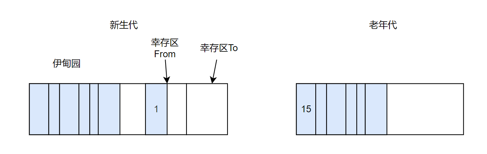

* 对象首先会被分配在伊甸园区域。
* 当新生代空间不足时，会触发`Minor GC`，伊甸园和 from 存活 的对象使用复制（Copying）收集算法复制到 to 中，存活的对象年龄加1并且交换 from to 的位置。
* `Minor GC`会引发 stop the world，暂停其他用户的线程，等待垃圾回收结束，用户线程才能恢复运行。
* 当对象年龄超过阈值时，会晋升至老年代，最大年龄时15（4bit）。
* 当老年代空间不足时，会先尝试触发`Minor GC`，如果空间仍不足，那么触发`Full GC`，STW的时间更长。

#### 相关JVM参数
| 说明                      | 参数                                                      |
| ------------------------- | --------------------------------------------------------- |
| 堆初始内存                | -Xms                                                      |
| 堆最大内存                | -Xmx 或 -XX:MaxHeapSize=size                              |
| 新生代内存                | -Xmn 或（-XX:NewSize=size -XX:MaxNewSize=size）           |
| 幸存区比例（动态）        | -XX:InitialSurvivorRatio=ratio -XX:+UseAdaptiveSizePolicy |
| 幸存区比例                | -XX:SurvivorRatio=ratio (ratio是伊甸园的占比，剩下的from-to平分，默认8)                                  |
| 晋升阈值                  | -XX:MaxTenuringThreshold=threshold                        |
| 晋升详情                  | -XX:+PrintTenuringDistribution                            |
| GC详情                    | -XX:PrintGCDetails                                        |
| FUll GC 前先执行 Minor GC | -XX:+ScavengeBeforeFullGC                                 |

#### GC分析
GC信息的含义：
```txt
Heap
 
 /*
   新生代
      total：总大小（幸存区 to 的内存是不能用的，所以是9M）
      used：已使用
 */
 def new generation   total 9216K, used 2179K [0x00000000fec00000, 0x00000000ff600000, 0x00000000ff600000)
  eden space 8192K,  26% used [0x00000000fec00000, 0x00000000fee20d50, 0x00000000ff400000)
  from space 1024K,   0% used [0x00000000ff400000, 0x00000000ff400000, 0x00000000ff500000)
  to   space 1024K,   0% used [0x00000000ff500000, 0x00000000ff500000, 0x00000000ff600000)
 
 // 老年代 
 tenured generation   total 10240K, used 0K [0x00000000ff600000, 0x0000000100000000, 0x0000000100000000)
   the space 10240K,   0% used [0x00000000ff600000, 0x00000000ff600000, 0x00000000ff600200, 0x0000000100000000)
 Metaspace       used 3300K, capacity 4496K, committed 4864K, reserved 1056768K
  class space    used 359K, capacity 388K, committed 512K, reserved 1048576K
```
##### GC分析1
```java
public class Application {
    private static final int _512KB = 512 * 1024;
    private static final int _1MB = 1024 * 1024;
    private static final int _6MB = 6 * 1024 * 1024;
    private static final int _7MB = 7 * 1024 * 1024;
    private static final int _8MB = 8 * 1024 * 1024;
    
    /**
     * -Xms20m -Xmx20m -Xmn10m -XX:+UseSerialGC -XX:+PrintGCDetails
     * @param args
     * @throws Exception
     */
    public static void main(String[] args) throws Exception {
        ArrayList<byte[]> list = new ArrayList<>();
        list.add(new byte[_7MB]);
    }
}
```
输出结果：
```txt
/*
   [GC (Allocation Failure) ：Minor GC
   [DefNew: 2015K->633K(9216K), 0.0164374 secs] ：新生代：回收前占用 -> 回收后占用(新生代总大小) 回收用时
   2015K->633K(19456K), 0.0164996 secs] ：整个堆回收前占用 -> 整个堆回收后占用(堆总大小)  回收用时
   [Times: user=0.01 sys=0.00, real=0.02 secs] 
*/
[GC (Allocation Failure) [DefNew: 2015K->633K(9216K), 0.0164374 secs] 2015K->633K(19456K), 0.0164996 secs] [Times: user=0.01 sys=0.00, real=0.02 secs] 
Heap
 def new generation   total 9216K, used 8047K [0x00000000fec00000, 0x00000000ff600000, 0x00000000ff600000)
  eden space 8192K,  90% used [0x00000000fec00000, 0x00000000ff33d8c0, 0x00000000ff400000)
  from space 1024K,  61% used [0x00000000ff500000, 0x00000000ff59e5b8, 0x00000000ff600000)
  to   space 1024K,   0% used [0x00000000ff400000, 0x00000000ff400000, 0x00000000ff500000)
 tenured generation   total 10240K, used 0K [0x00000000ff600000, 0x0000000100000000, 0x0000000100000000)
   the space 10240K,   0% used [0x00000000ff600000, 0x00000000ff600000, 0x00000000ff600200, 0x0000000100000000)
 Metaspace       used 3301K, capacity 4496K, committed 4864K, reserved 1056768K
  class space    used 359K, capacity 388K, committed 512K, reserved 1048576K
```
##### GC分析2
```java
public class Application {
    private static final int _512KB = 512 * 1024;
    private static final int _1MB = 1024 * 1024;
    private static final int _6MB = 6 * 1024 * 1024;
    private static final int _7MB = 7 * 1024 * 1024;
    private static final int _8MB = 8 * 1024 * 1024;

    /**
     * -Xms20m -Xmx20m -Xmn10m -XX:+UseSerialGC -XX:+PrintGCDetails
     * @param args
     * @throws Exception
     */
    public static void main(String[] args) throws Exception {
        ArrayList<byte[]> list = new ArrayList<>();
        list.add(new byte[_7MB]);
        list.add(new byte[_512KB]);
        list.add(new byte[_512KB]);
    }
}
```
输出结果：
```txt
[GC (Allocation Failure) [DefNew: 2015K->633K(9216K), 0.0017179 secs] 2015K->633K(19456K), 0.0017712 secs] [Times: user=0.00 sys=0.00, real=0.00 secs] 
[GC (Allocation Failure) [DefNew: 8477K->512K(9216K), 0.0065384 secs] 8477K->8309K(19456K), 0.0065718 secs] [Times: user=0.00 sys=0.00, real=0.01 secs] 
Heap
 def new generation   total 9216K, used 1106K [0x00000000fec00000, 0x00000000ff600000, 0x00000000ff600000)
  eden space 8192K,   7% used [0x00000000fec00000, 0x00000000fec94930, 0x00000000ff400000)
  from space 1024K,  50% used [0x00000000ff400000, 0x00000000ff480048, 0x00000000ff500000)
  to   space 1024K,   0% used [0x00000000ff500000, 0x00000000ff500000, 0x00000000ff600000)
 tenured generation   total 10240K, used 7797K [0x00000000ff600000, 0x0000000100000000, 0x0000000100000000)
   the space 10240K,  76% used [0x00000000ff600000, 0x00000000ffd9d740, 0x00000000ffd9d800, 0x0000000100000000)
 Metaspace       used 3301K, capacity 4496K, committed 4864K, reserved 1056768K
  class space    used 359K, capacity 388K, committed 512K, reserved 1048576K
```
##### GC分析3
```java
public class Application {
    private static final int _512KB = 512 * 1024;
    private static final int _1MB = 1024 * 1024;
    private static final int _6MB = 6 * 1024 * 1024;
    private static final int _7MB = 7 * 1024 * 1024;
    private static final int _8MB = 8 * 1024 * 1024;

    /**
     * -Xms20m -Xmx20m -Xmn10m -XX:+UseSerialGC -XX:+PrintGCDetails
     * @param args
     * @throws Exception
     */
    public static void main(String[] args) throws Exception {
        ArrayList<byte[]> list = new ArrayList<>();
        list.add(new byte[_8MB]);
    }
}
```
输出结果：
```txt
Heap
 def new generation   total 9216K, used 2179K [0x00000000fec00000, 0x00000000ff600000, 0x00000000ff600000)
  eden space 8192K,  26% used [0x00000000fec00000, 0x00000000fee20d50, 0x00000000ff400000)
  from space 1024K,   0% used [0x00000000ff400000, 0x00000000ff400000, 0x00000000ff500000)
  to   space 1024K,   0% used [0x00000000ff500000, 0x00000000ff500000, 0x00000000ff600000)
 tenured generation   total 10240K, used 8192K [0x00000000ff600000, 0x0000000100000000, 0x0000000100000000)
   the space 10240K,  80% used [0x00000000ff600000, 0x00000000ffe00010, 0x00000000ffe00200, 0x0000000100000000)
 Metaspace       used 3300K, capacity 4496K, committed 4864K, reserved 1056768K
  class space    used 359K, capacity 388K, committed 512K, reserved 1048576K
```
* 如果新生代不足以容纳大对象，会直接放入老年代。

##### GC分析4
```java
public class Application {
    private static final int _512KB = 512 * 1024;
    private static final int _1MB = 1024 * 1024;
    private static final int _6MB = 6 * 1024 * 1024;
    private static final int _7MB = 7 * 1024 * 1024;
    private static final int _8MB = 8 * 1024 * 1024;

    /**
     * -Xms20m -Xmx20m -Xmn10m -XX:+UseSerialGC -XX:+PrintGCDetails
     * @param args
     * @throws Exception
     */
    public static void main(String[] args) throws Exception {
        new Thread(()-> {
            ArrayList<byte[]> list = new ArrayList<>();
            list.add(new byte[_8MB]);
            list.add(new byte[_8MB]);
        }).start();

        System.out.println("主线程");
        Thread.sleep(1000L);
    }
}
```
输出结果：
```txt
主线程
[GC (Allocation Failure) [DefNew: 3991K->838K(9216K), 0.0022727 secs][Tenured: 8192K->9028K(10240K), 0.0032998 secs] 12183K->9028K(19456K), [Metaspace: 4195K->4195K(1056768K)], 0.0224217 secs] [Times: user=0.00 sys=0.01, real=0.02 secs] 
[Full GC (Allocation Failure) [Tenured: 9028K->8972K(10240K), 0.0029273 secs] 9028K->8972K(19456K), [Metaspace: 4195K->4195K(1056768K)], 0.0029738 secs] [Times: user=0.00 sys=0.00, real=0.00 secs] 
Exception in thread "Thread-0" java.lang.OutOfMemoryError: Java heap space
	at cn.forbearance.spring.Application.lambda$main$0(Application.java:25)
	at cn.forbearance.spring.Application$$Lambda$1/1324119927.run(Unknown Source)
	at java.lang.Thread.run(Thread.java:748)
Heap
 def new generation   total 9216K, used 1375K [0x00000000fec00000, 0x00000000ff600000, 0x00000000ff600000)
  eden space 8192K,  16% used [0x00000000fec00000, 0x00000000fed57cf8, 0x00000000ff400000)
  from space 1024K,   0% used [0x00000000ff500000, 0x00000000ff500000, 0x00000000ff600000)
  to   space 1024K,   0% used [0x00000000ff400000, 0x00000000ff400000, 0x00000000ff500000)
 tenured generation   total 10240K, used 8972K [0x00000000ff600000, 0x0000000100000000, 0x0000000100000000)
   the space 10240K,  87% used [0x00000000ff600000, 0x00000000ffec31e8, 0x00000000ffec3200, 0x0000000100000000)
 Metaspace       used 4730K, capacity 4804K, committed 4992K, reserved 1056768K
  class space    used 526K, capacity 560K, committed 640K, reserved 1048576K
```
* 子线程的`OutOfMemory`不会影响主线程的程序，

### 垃圾回收器
1. 串行
   * 单线程。
   * 堆内存较小，适合个人电脑。
2. 吞吐量优先
   * 多线程。
   * 堆内存较大，多核CPU。
   * 尽可能让单位时间内，STW的时间最短。（一个小时触发了2次GC，每次0.2秒，0.4秒）
3. 响应时间优先
   * 多线程。
   * 堆内存较大，多核CPU。
   * 尽可能让单次STW的时间最短。（一个小时触发了5次GC，每次0.1秒，0.5秒）
   
#### 串行
使用串行的GC虚拟机参数：`-XX:+UseSerialGC`，等同于使用`Serial`（复制，新生代Minor CG）和`SerialOld`（标记整理，老年代Full GC）。

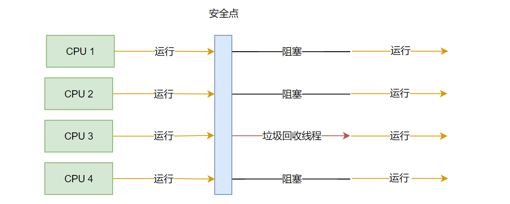
#### 吞吐量优先
使用吞吐量优先的GC虚拟机参数：`-XX:+UseParallelGC -XX:+UseParallelOldGC`，前者是新生代GC（复制），后者是老年代GC（标记整理）。只用开启一个，默认会把另一个也开启。（Java8默认是开启的）。Parallel（并行）
```txt
-XX:+UseAdaptiveSizePolicy    // 自适应调整新生代内存大小
-XX:GCTimeRatio=ratio         // 垃圾回收时间和总时间的占比（默认ratio=99）
-XX:MaxGCPauseMillis=ms       // 最大暂停毫秒数（默认200ms）
-XX:ParallelGCThreads=n       // 指定垃圾回收线程数

// -XX:GCTimeRatio=ratio：公式为（1/1+ratio），通常会设置ratio=19，（1/1+19 =  0.05，100分钟允许5分钟用于垃圾回收 100*0.05=5 ）。
// 99一般很难达到，100分钟只能有一分钟用于垃圾回收。
```
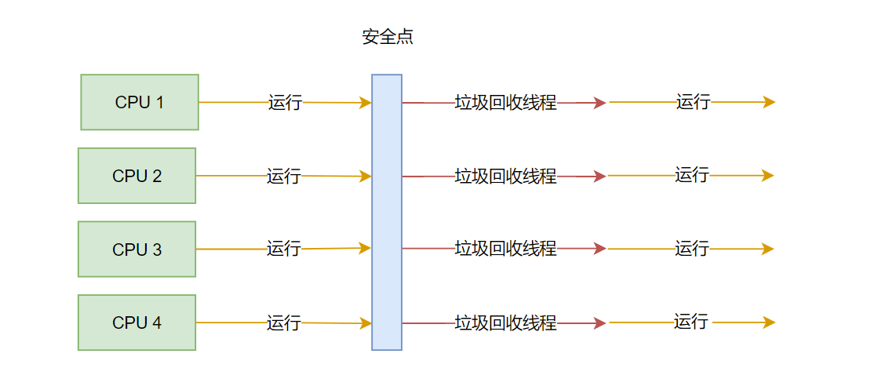
#### 响应时间优先
使用响应时间优先的GC虚拟机参数：`-XX:+UserConcMarkSweepGC -XX:+UseParNewGC`，当`ConcMarkSweepGC`（标记清除,老年代GC，产生过多的内存碎片）并发失败的时候，老年代GC会从 CMS 会退化为 SerialOld（串行，标记整理，老年代Full GC）
```txt
-XX:ParallelGCThreads=n ~ -XX:ConcGCThreads=threads   // 控制线程数（ConcGCThreads设置为ParallelGCThreads的四分之一）
-XX:CMSInitiatingOccupancyFraction=percent   // 执行 CMS 的内存占比，比如 percen=80（80%），当老年代内存占用达到80%时就执行一次垃圾回收。预留一些空间给浮动垃圾
-XX:+CMSScavengeBeforeRemark  // 重新标记之前，先执行一次新生代垃圾回收
```
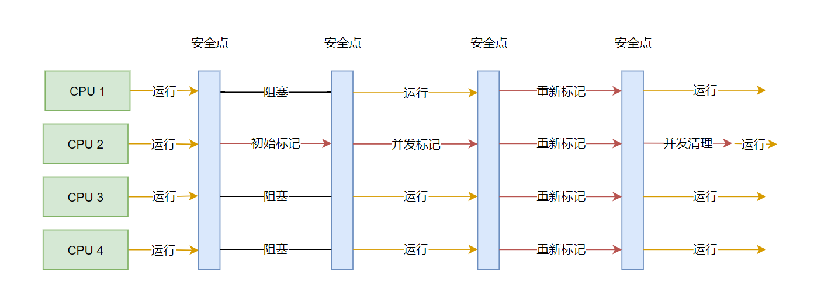

CMS 问题：使用的是标记-清除算法，会产生内存碎片，内存碎片过多，容纳不下对象了，那么在并发垃圾回收失败时就会退化为 SerialOld（串行，标记整理，老年代Full GC）。那么这个响应时间就会一下子飙升。
#### G1
JDK9默认。

适用场景：
* 同时注重吞吐量和低延迟，默认的暂停目标是200ms。
* 超大堆内存，会将堆划分为多个大小相等的 Region（区域）。（Region：每个区域都能独立作为伊甸园、幸存区、老年代）
* 整体上是标记+整理算法，但两个区域之间是复制算法。

相关JVM参数：
```txt
-XX:+UseG1GC
-XX:G1HeapRegionSize=size  // 指定每个区域堆的大小
-XX:MaxGCPauseMillis=time  // 指定暂停时间（毫秒）
```
##### G1回收阶段
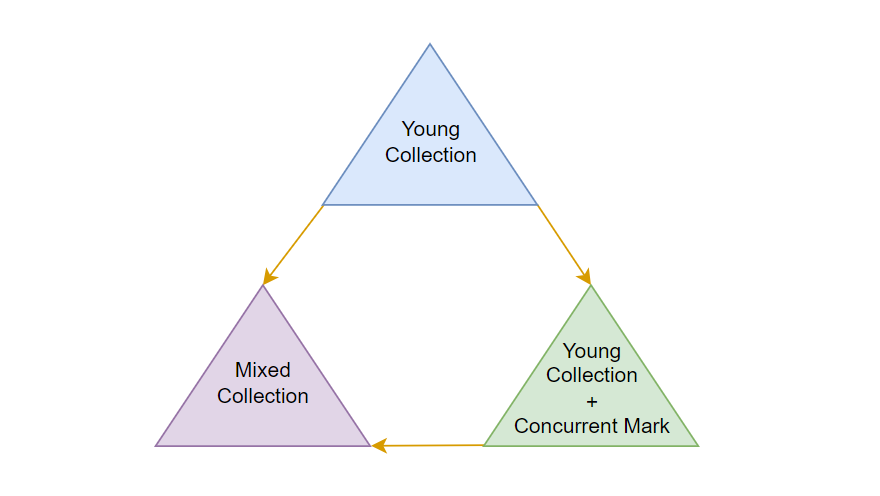

G1垃圾收集器的回收过程包括多个阶段，其中回收阶段是其中的一部分。下面是G1垃圾收集器的回收阶段：
1. 初始标记（Initial Mark）：在初始标记阶段，G1垃圾收集器会暂停所有应用线程，然后标记出根对象直接关联的对象，并记录下这些对象的存活状态。
2. 并发标记（Concurrent Mark）：在并发标记阶段，G1垃圾收集器会启动多个线程，并行地对剩余的对象进行标记。这个过程是与应用程序并发执行的，不会暂停应用线程。
3. 最终标记（Final Mark）：在并发标记阶段完成后，G1垃圾收集器会再次暂停所有应用线程，执行最终标记。这个阶段的目的是标记在并发标记阶段发生变化的对象，确保标记的准确性。
4. 筛选回收（Live Data Counting）：在最终标记阶段完成后，G1垃圾收集器会对各个区域的存活对象进行统计，并根据回收目标进行筛选。筛选出存活对象数量最少的区域进行回收。
5. 复制（Evacuation）：在筛选回收阶段完成后，G1垃圾收集器会将选中的区域中的存活对象复制到空闲的区域中，并更新对象引用。
6. 清理（Cleanup）：在复制阶段完成后，G1垃圾收集器会对已复制的区域进行清理，回收无效的对象所占用的内存空间。
7. 混合收集（Mixed Collection）：在清理阶段完成后，G1垃圾收集器可能会执行混合收集。混合收集是对整个堆内存进行回收的过程，包括年轻代和老年代。它的目的是收集那些在Young Collection期间晋升为老年代的对象，以确保整个堆内存的回收。


##### Young Collection
会 STW。

在Young GC阶段，G1垃圾收集器会对年轻代进行回收。它首先标记年轻代中的存活对象，然后将存活对象复制到Survivor（幸存区）区域或老年代中，并清理年轻代的垃圾对象。Young GC是一个短暂的暂停，只涉及年轻代的部分内存区域。

##### Young Collection + CM
* 在 Young GC 时会进行 GC Roots 的初始标记。
* 老年代占用空间比例达到阈值时，会进行并发标记（不会STW）。由`-XX:InitiatingHeapOccupancyPercent=percent`JVM参数控制。（默认45%）
##### Mined Collection
会对Eden、Survivor以及Old区域进行全面的垃圾回收。
* 最终标记（Remark）会 STW。
* 拷贝存活（Evacuation）会 STW。

使用JVM参数`-XX:MaxGCPauseMillis=ms`设置最大暂停时间。

G1 收集器在后台维护了一个优先列表，每次根据允许的收集时间（最大暂停时间），优先选择回收价值最大的 Region(这也就是它的名字 Garbage-First 的由来) 。这种使用 Region 划分内存空间以及有优先级的区域回收方式，保证了 G1 收集器在有限时间内可以尽可能高的收集效率（把内存化整为零）。主要目的就是达到最大暂停时间的目标。
##### Full GC 概念辨析
* Serial GC
   * 新生代内存不足发生的垃圾收集（Minor GC）
   * 老年代内存不足发生的垃圾收集（Full GC）
* Parallel GC
   * 新生代内存不足发生的垃圾收集（Minor GC）
   * 老年代内存不足发生的垃圾收集（Full GC）
* CMS
   * 新生代内存不足发生的垃圾收集（Minor GC）
   * 老年代内存不足
* G1
   * 新生代内存不足发生的垃圾收集（Minor GC）
   * 老年代内存不足

G1垃圾回收器在回收速度高于垃圾产生的速度则不会产生 Full GC，还是一个并发标记，并发回收的GC。只有当回收速度低于垃圾产生的速度才会引发FUll GC。出现并发失败就会FUll GC。（G1即使Full GC 也是多线程的）
##### Young Collection 跨代引用
在G1垃圾收集器的Young Collection（年轻代收集）阶段中，可能会出现跨代引用的情况，即年轻代对象引用了老年代对象。

在垃圾收集器的新生代回收过程中，通常采用的是复制算法。年轻代被分为Eden区和两个Survivor区（通常是From和To），对象首先被分配到Eden区，经过一次或多次垃圾回收后，仍然存活的对象会被复制到Survivor区，然后在下一次垃圾回收中，从From区复制到To区，最终存活的对象会被晋升到老年代。

在这个过程中（查找根对象 GC Root），如果年轻代的对象引用了老年代中的对象，就出现了跨代引用的情况。这种跨代引用可能导致问题，因为在新生代回收时，无法直接判断被引用的老年代对象是否仍然存活，从而影响垃圾回收的准确性和效率。

在Java垃圾回收中，Remembered Sets和卡表（Card Table）都是用于解决跨代引用问题的机制。
* Remembered Sets 是用于标记年轻代对象对老年代对象的引用关系的数据结构。它的作用是在新生代回收过程中快速定位年轻代对象中引用了老年代对象的部分。Remembered Sets通常是一种位图或类似的数据结构，每个位表示一个引用关系。当发生新生代回收时，只需扫描Remembered Sets中被标记的位，而不是全局扫描整个老年代，从而大大减少了扫描的开销。
* 卡表（Card Table）是用于记录老年代中引用了新生代对象的卡片的数据结构。卡表将老年代划分为一组固定大小的卡片，每个卡片对应一块内存区域。当新生代对象晋升到老年代时，会更新卡表中相应的卡片，标记该卡片内的内存区域引用了新生代对象（脏卡）。在新生代回收过程中，只需扫描被标记的卡片，而不需要扫描整个老年代，从而减少了扫描的范围。

这两个机制都是为了在新生代回收时快速定位和处理跨代引用的问题，提高垃圾回收的效率。Remembered Sets主要应用于标记-复制（Mark-Compact）算法的垃圾收集器，而卡表主要应用于分代收集算法中的增量更新和并发标记清除算法。

`Post-write barrier`（写屏障）是一段特殊的代码，它会在Java程序中进行引用写入操作后执行。当有一个引用变更时，该代码会检测变更的位置和范围，并将受影响的卡片标记为"需要更新"（脏卡）的状态。

`Dirty card queue`是一个队列，用于保存所有被标记为"需要更新"（脏卡）的卡片。这些卡片记录了老年代中引用了新生代对象的位置信息。

Remembered Set的更新是通过并发细化线程（`concurrent refinement threads`）来完成的。这些线程负责在应用程序运行的同时，异步地扫描新生代对象中的引用，并将跨代引用信息添加到Remembered Set中。
##### Remark
在G1垃圾收集器中，G1 Remark（G1重新标记）是垃圾回收的一个重要阶段。它是G1垃圾收集器在并发标记完成后的一个短暂停顿阶段（最终标记），用于完成对新生代与老年代之间的引用关系进行最终确认。

G1 Remark的主要目的是处理在并发标记期间可能发生的引用变化。由于并发标记是并发进行的，应用程序仍然在运行，因此可能存在引用关系的变化。G1 Remark会检查并修正这些变化，以确保垃圾回收的准确性。G1 Remark的停顿时间相对较短。

如果发生引用变更，会将引用变化的对象放到稳定标记队列中（`stab_mark_queue`）。

`stab_mark_queue`就是用来存储需要进行稳定标记的对象的队列。当应用程序在并发标记期间进行引用变更时，相关的对象会被添加到`stab_mark_queue`中。然后，在G1 Remark阶段的稳定标记过程中，垃圾收集器会遍历`stab_mark_queue`中的对象，并对其进行稳定标记。

`stab_mark_queue`只在G1 Remark阶段使用，用于临时存储引用变更的对象，并不是持久性的数据结构。在G1 Remark阶段结束后，`stab_mark_queue`会被清空，为下一次垃圾回收做准备。

具体的G1 Remark流程如下：
1. 暂停应用线程：G1 Remark会暂停应用程序的执行，以便进行标记的更新。
2. 重新扫描根区域：G1 Remark会重新扫描根区域，包括根对象和根区域中的引用。
3. 跨区扫描：G1 Remark会从根区域出发，逐一扫描所有与根区域相关的区域。它会检查引用关系的变化，并修正之前的标记信息。
4. 完成重新标记：完成重新标记后，G1 Remark会更新各个区域的标记状态，并生成一个最终的标记快照。
5. 重新启动应用线程：完成G1 Remark后，应用线程会重新启动，继续执行应用程序。

在Java G1垃圾收集器中，G1 Remark阶段通过写屏障（Write Barrier）来保证并发标记期间的引用变更不会被遗漏。写屏障是一种机制，用于在引用发生变更时通知垃圾收集器进行相应的处理。

具体到G1 Remark阶段，写屏障主要有以下几个作用：
1. 保证引用变更的可见性：当应用程序对引用进行写操作时，写屏障会确保这个变更对垃圾收集器可见。这样，在G1 Remark阶段时，垃圾收集器能够获取到最新的引用信息，避免遗漏或错误地处理引用变更。
2. 更新Remembered Set：G1 Remark阶段会重新扫描根区域以及与根区域相关的区域。写屏障会在应用程序对引用进行写操作时，将发生变更的引用添加到相应的Remembered Set中。Remembered Set是用于记录新生代与老年代之间引用关系的数据结构，它帮助G1垃圾收集器准确地追踪引用关系。
3. 触发卡表更新：G1垃圾收集器使用卡表（Card Table）来跟踪老年代中与新生代之间的引用关系。写屏障会触发卡表的更新，将引用变更的信息记录到相应的卡表项中。这样，在G1 Remark阶段时，垃圾收集器可以遍历卡表来检查引用的变化，并进行相应的修正。

写屏障的应用也会带来一定的性能开销，但这是为了保证垃圾收集的正确性和一致性而必要的代价。
##### JDK 8u20 字符串去重&G1优化
```java
String s1 = new String("hello");    // char[]{'h', 'e', 'l', 'l', 'o'}
String s2 = new String("hello");    // char[]{'h', 'e', 'l', 'l', 'o'}
```
使用虚拟机参数`-XX:+UseStringDeduplication`开启String去重功能，默认是开启的。

* 将所有新分配的字符串方法一个队列中。
* 当新生代回收时，G1并发检查是否有字符串重复。
* 如果有字符串重复（值一样），则让它们引用同一个`char[]`。
* 与 `String.intern()` 不一样
   * `String.intern()`关注的是字符串对象。
   * 而字符串去重关注的是 `char[]`。
   * 在 JVM 内部，是用来不同的字符串表。

- 优点：节省大量内存。
- 缺点，略微多占用了 CPU 时间，新生代回收时间略微增加。
##### JDK 8u40 并发标记类卸载&G1优化
所有对象都经过并发标记后，就能知道哪些类不再被使用，当一个类加载器所加载的类都不再使用，则卸载它所加载的全部类。

使用JVM参数`-XX:+ClassUnloadingWithConcurrentMark`开启，默认是开启的。
##### JDK 8u60 回收巨型对象&G1优化
一个对象大于 Region 的一半时，称之为巨型对象。
* G1不会对巨型对象进行拷贝。
* 回收时优先被考虑
* G1会跟踪老年代所有 incoming 引用，这样老年代 incoming 引用为0的巨型对象就可以在新生代垃圾回收时处理掉。（也就是巨型对象不被任何老年代对象所引用了，可以回收）
##### JDK9 并发标记动态起始时间的调整
* 并发标记必须在堆空间占满前完成，否则会退化为 FullGC。
* JDK9 之前需要使用`-XX:InitialingHeapOccupancyPercent`来指定堆空间占比。堆内存占用超过占比就会触发 GC。
* JDK9 可以动态调整
   * `-XX:InitialingHeapOccupancyPercent`只是用来设置初始值
   * G1 会进行数据采样并动态调整（动态设置堆空间占比）。
   * 总会添加一个安全的空档空间。

#### JDK9及之后的调优

> 官网：https://docs.oracle.com/en/java/javase/12/gctuning/

#### ZGC

Java11 的时候推出的一款垃圾收集器。在 ZGC 中出现 Stop The World 的情况会更少！

### 垃圾回收调优
> Java 命令及参数_官网：https://docs.oracle.com/en/java/javase/11/tools/java.html#GUID-3B1CE181-CD30-4178-9602-230B800D4FAE

如果想熟练JVM调优的话：
* 掌握`GC`相关的`VM`参数，会基本的空间调整。
* 掌握相关工具
* 调优跟应用、环境有关，没有放之四海而皆准的法则。

查看虚拟机运行参数（默认值，Windows系统）
```txt
A:\etc\guide>"A:\usr\Software\Java\jdk1.8.0_271\bin\java" -XX:+PrintFlagsFinal -version | findstr "GC"
    uintx AdaptiveSizeMajorGCDecayTimeScale         = 10                                  {product}
    uintx AutoGCSelectPauseMillis                   = 5000                                {product}
     bool BindGCTaskThreadsToCPUs                   = false                               {product}
    uintx CMSFullGCsBeforeCompaction                = 0                                   {product}
    uintx ConcGCThreads                             = 0                                   {product}
     bool DisableExplicitGC                         = false                               {product}
     bool ExplicitGCInvokesConcurrent               = false                               {product}
     bool ExplicitGCInvokesConcurrentAndUnloadsClasses  = false                               {product}
    uintx G1MixedGCCountTarget                      = 8                                   {product}
    uintx GCDrainStackTargetSize                    = 64                                  {product}
    uintx GCHeapFreeLimit                           = 2                                   {product}
    uintx GCLockerEdenExpansionPercent              = 5                                   {product}
     bool GCLockerInvokesConcurrent                 = false                               {product}
    uintx GCLogFileSize                             = 8192                                {product}
    uintx GCPauseIntervalMillis                     = 0                                   {product}
    uintx GCTaskTimeStampEntries                    = 200                                 {product}
    uintx GCTimeLimit                               = 98                                  {product}
    uintx GCTimeRatio                               = 99                                  {product}
     bool HeapDumpAfterFullGC                       = false                               {manageable}
     bool HeapDumpBeforeFullGC                      = false                               {manageable}
    uintx HeapSizePerGCThread                       = 87241520                            {product}
    uintx MaxGCMinorPauseMillis                     = 4294967295                          {product}
    uintx MaxGCPauseMillis                          = 4294967295                          {product}
    uintx NumberOfGCLogFiles                        = 0                                   {product}
     intx ParGCArrayScanChunk                       = 50                                  {product}
    uintx ParGCDesiredObjsFromOverflowList          = 20                                  {product}
     bool ParGCTrimOverflow                         = true                                {product}
     bool ParGCUseLocalOverflow                     = false                               {product}
    uintx ParallelGCBufferWastePct                  = 10                                  {product}
    uintx ParallelGCThreads                         = 4                                   {product}
     bool ParallelGCVerbose                         = false                               {product}
     bool PrintClassHistogramAfterFullGC            = false                               {manageable}
     bool PrintClassHistogramBeforeFullGC           = false                               {manageable}
     bool PrintGC                                   = false                               {manageable}
     bool PrintGCApplicationConcurrentTime          = false                               {product}
     bool PrintGCApplicationStoppedTime             = false                               {product}
     bool PrintGCCause                              = true                                {product}
     bool PrintGCDateStamps                         = false                               {manageable}
     bool PrintGCDetails                            = false                               {manageable}
     bool PrintGCID                                 = false                               {manageable}
     bool PrintGCTaskTimeStamps                     = false                               {product}
     bool PrintGCTimeStamps                         = false                               {manageable}
     bool PrintHeapAtGC                             = false                               {product rw}
     bool PrintHeapAtGCExtended                     = false                               {product rw}
     bool PrintJNIGCStalls                          = false                               {product}
     bool PrintParallelOldGCPhaseTimes              = false                               {product}
     bool PrintReferenceGC                          = false                               {product}
     bool ScavengeBeforeFullGC                      = true                                {product}
     bool TraceDynamicGCThreads                     = false                               {product}
     bool TraceParallelOldGCTasks                   = false                               {product}
     bool UseAdaptiveGCBoundary                     = false                               {product}
     bool UseAdaptiveSizeDecayMajorGCCost           = true                                {product}
     bool UseAdaptiveSizePolicyWithSystemGC         = false                               {product}
     bool UseAutoGCSelectPolicy                     = false                               {product}
     bool UseConcMarkSweepGC                        = false                               {product}
     bool UseDynamicNumberOfGCThreads               = false                               {product}
     bool UseG1GC                                   = false                               {product}
     bool UseGCLogFileRotation                      = false                               {product}
     bool UseGCOverheadLimit                        = true                                {product}
     bool UseGCTaskAffinity                         = false                               {product}
     bool UseMaximumCompactionOnSystemGC            = true                                {product}
     bool UseParNewGC                               = false                               {product}
     bool UseParallelGC                            := true                                {product}
     bool UseParallelOldGC                          = true                                {product}
     bool UseSerialGC                               = false                               {product}
java version "1.8.0_271"
Java(TM) SE Runtime Environment (build 1.8.0_271-b09)
Java HotSpot(TM) 64-Bit Server VM (build 25.271-b09, mixed mode)
```

#### 确定目标
【低延迟】还是【高吞吐量】，选择合适的回收器。
* 响应时间优先【低延时】：CMS、G1、ZGC
* 【高吞吐量】：ParallelGC

#### 最快的GC是不发生GC
查看`Full GC`前后的内存占用，考虑下面几个问题
1. 数据是不是太多？
2. 数据表示是否台臃肿？
   * 对象图
   * 对象大小
3. 是否存在内存泄露？

#### 新生代调优
- 新生代特点
   * 所有的 new 操作的内存分配非常廉价。原因是基于 `TLAB thread-local- allocation buffer`。
   * 不被引用的对象的回收代价是零。
   * 大部分对象用过就会被回收。
   * Minor GC 的 时间远远低于 FUll GC。

- （`-Xmn`）新生代内存空间应在堆内存的`25%-50%`之间。

- 那么到底新生代内存设置多大合适呢？
   * 有一个估算公式：理想情况下，新生代能容纳所有（并发量 * (请求-响应)（请求、响应的占用内存））的数据。

- 幸存区要大到能容纳（当前活跃对象 + 需要晋升对象）
- 幸存区晋升阈值配置得当，让长时间存活的对象尽快晋升
```txt
# 设置最大年龄晋升阈值
-XX:MaxTenuringThreshold=threshold

# 打印幸存区信息
-XX:PrintTenuringDistribution
```
#### 老年代调优
以 CMS 为例
- CMS 的老年代内存越大越好
- 先尝试不做调优，如果没有FullGC就不用调优，否则先尝试调优新生代。
- 如果还是经常发生FullGC，观察发生FUllGC时老年代内存占用，将老年代内存预设调大 1/4 ~ 1/3。
```txt
# 执行 CMS 的内存占比，比如 percen=80（80%），当老年代内存占用达到80%时就执行一次垃圾回收
-XX:CMSInitiatingOccupancyFraction=percent
```
- 一般设置为`75% ~ 80%`，预留一些空间给浮动垃圾
#### 案例
##### 案例1
- FUll GC 和 Minor GC 频繁。
##### 案例2
- 请求高峰期发生 FUll GC，单词暂停时间特别长（CMS）

```txt
# 在CMS重新标记前，执行一次 Minor GC
-XX:CMSScavengeBeforeRemark
```
##### 案例3
- 老年代充裕情况下，发生 FUll GC（CMS 1.7）

1.7 是永久代，在堆中，1.8 是元空间，在堆外内存中。

## 类加载与字节码
### 类文件结构
```java
/**
 * @author cristina
 */
public class HelloWorld {
    public static void main(String[] args) throws Exception {
        System.out.println("Hello World");
    }
}
```
1. 执行编译命令`javac -parameters -d . HelloWorld.java`
2. 编译后的字节码：`od -t xC HelloWorld.class`，16进制。

```txt
[root@server7 ~]# od -t xC HelloWorld.class 
0000000 ca fe ba be 00 00 00 34 00 22 0a 00 06 00 13 09
0000020 00 14 00 15 08 00 16 0a 00 17 00 18 07 00 19 07
0000040 00 1a 01 00 06 3c 69 6e 69 74 3e 01 00 03 28 29
0000060 56 01 00 04 43 6f 64 65 01 00 0f 4c 69 6e 65 4e
0000100 75 6d 62 65 72 54 61 62 6c 65 01 00 04 6d 61 69
0000120 6e 01 00 16 28 5b 4c 6a 61 76 61 2f 6c 61 6e 67
0000140 2f 53 74 72 69 6e 67 3b 29 56 01 00 0a 45 78 63
0000160 65 70 74 69 6f 6e 73 07 00 1b 01 00 10 4d 65 74
0000200 68 6f 64 50 61 72 61 6d 65 74 65 72 73 01 00 04
0000220 61 72 67 73 01 00 0a 53 6f 75 72 63 65 46 69 6c
0000240 65 01 00 0f 48 65 6c 6c 6f 57 6f 72 6c 64 2e 6a
0000260 61 76 61 0c 00 07 00 08 07 00 1c 0c 00 1d 00 1e
0000300 01 00 0b 48 65 6c 6c 6f 20 57 6f 72 6c 64 07 00
0000320 1f 0c 00 20 00 21 01 00 0a 48 65 6c 6c 6f 57 6f
0000340 72 6c 64 01 00 10 6a 61 76 61 2f 6c 61 6e 67 2f
0000360 4f 62 6a 65 63 74 01 00 13 6a 61 76 61 2f 6c 61
0000400 6e 67 2f 45 78 63 65 70 74 69 6f 6e 01 00 10 6a
0000420 61 76 61 2f 6c 61 6e 67 2f 53 79 73 74 65 6d 01
0000440 00 03 6f 75 74 01 00 15 4c 6a 61 76 61 2f 69 6f
0000460 2f 50 72 69 6e 74 53 74 72 65 61 6d 3b 01 00 13
0000500 6a 61 76 61 2f 69 6f 2f 50 72 69 6e 74 53 74 72
0000520 65 61 6d 01 00 07 70 72 69 6e 74 6c 6e 01 00 15
0000540 28 4c 6a 61 76 61 2f 6c 61 6e 67 2f 53 74 72 69
0000560 6e 67 3b 29 56 00 21 00 05 00 06 00 00 00 00 00
0000600 02 00 01 00 07 00 08 00 01 00 09 00 00 00 1d 00
0000620 01 00 01 00 00 00 05 2a b7 00 01 b1 00 00 00 01
0000640 00 0a 00 00 00 06 00 01 00 00 00 04 00 09 00 0b
0000660 00 0c 00 03 00 09 00 00 00 25 00 02 00 01 00 00
0000700 00 09 b2 00 02 12 03 b6 00 04 b1 00 00 00 01 00
0000720 0a 00 00 00 0a 00 02 00 00 00 06 00 08 00 07 00
0000740 0d 00 00 00 04 00 01 00 0e 00 0f 00 00 00 05 01
0000760 00 10 00 00 00 01 00 11 00 00 00 02 00 12
0000776
```
根据JVM规范，类文件结构如下
```java
ClassFile {
   u4             magic;
   u2             minor_version;
   u2             major_version;
   u2             constant_pool_count;
   cp_info        constant_pool[constant_pool_count-1];
   u2             access_flags;
   u2             this_class;
   u2             super_class;
   u2             interfaces_count
   u2             interfaces[interfaces_count];
   u2             fields_count;
   field_info     fields[fields_count];
   u2             methods_count;
   method_info    methods[methods_count];
   u2             attributes_count;
   attribute_info attributes[attributes_count];
}
```
`u4、u2`表示字节数。

通过分析 ClassFile 的内容，我们便可以知道 class 文件的组成。


#### 魔数
- 0~3字节，表示它是否是`class`类型的文件

0000000 `ca fe ba be` 00 00 00 34 00 22 0a 00 06 00 13 09
#### 版本
- 4~7字节，表示类的版本`00 34`（52），表示是 Java 8，小版本没有体现。
  0000000 ca fe ba be `00 00 00 34` 00 22 0a 00 06 00 13 09
#### 常量池
开始的第一位是一个 u1 类型的标志位（Value）来标识常量的类型，代表当前这个常量属于哪种常量类型
| Constant Type                    | Value | 描述                   |
| -------------------------------- | ----- | ---------------------- |
| CONSTANT_utf8_info               | 1     | UTF-8 编码的字符串     |
| CONSTANT_Integer_info            | 3     | 整形字面量             |
| CONSTANT_Float_info              | 4     | 浮点型字面量           |
| CONSTANT_Long_info               | ５    | 长整型字面量           |
| CONSTANT_Double_info             | ６    | 双精度浮点型字面量     |
| CONSTANT_Class_info              | ７    | 类或接口的符号引用     |
| CONSTANT_String_info             | ８    | 字符串类型字面量       |
| CONSTANT_FieldRef_info           | ９    | 字段的符号引用         |
| CONSTANT_MethodRef_info          | 10    | 类中方法的符号引用     |
| CONSTANT_InterfaceMethodRef_info | 11    | 接口中方法的符号引用   |
| CONSTANT_NameAndType_info        | 12    | 字段或方法的符号引用   |
| CONSTANT_MethodType_info         | 16    | 标志方法类型           |
| CONSTANT_MethodHandle_info       | 15    | 表示方法句柄           |
| CONSTANT_InvokeDynamic_info      | 18    | 表示一个动态方法调用点 |
- 8~9字节，表示常量池长度`00 22`（34），表示常量池有 #1~#33 项，#0项不计入，也没有值，索引值为 0 代表“不引用任何一个常量池项”

0000000 ca fe ba be 00 00 00 34 `00 22` 0a 00 06 00 13 09
- 第#1项 `0a`表示一个 Method 信息（方法引用），`00 06`和`00 13`（19）表示引用了常量池中#6和#19项来获得这个方法的所属类和方法名。

0000000 ca fe ba be 00 00 00 34 00 22 `0a 00 06 00 13` 09

剩余部分不再分析了，节省时间进入下一章节的复习。附上反汇编的结果。
```txt
[root@server7 ~]# javap -v HelloWorld.class 
Classfile /root/HelloWorld.class
  Last modified 2023-6-28; size 510 bytes
  MD5 checksum 03f7f4cfbfe1dd1d273f73655465dffc
  Compiled from "HelloWorld.java"
public class HelloWorld
  minor version: 0
  major version: 52
  flags: ACC_PUBLIC, ACC_SUPER
Constant pool:
   #1 = Methodref          #6.#19         // java/lang/Object."<init>":()V
   #2 = Fieldref           #20.#21        // java/lang/System.out:Ljava/io/PrintStream;
   #3 = String             #22            // Hello World
   #4 = Methodref          #23.#24        // java/io/PrintStream.println:(Ljava/lang/String;)V
   #5 = Class              #25            // HelloWorld
   #6 = Class              #26            // java/lang/Object
   #7 = Utf8               <init>
   #8 = Utf8               ()V
   #9 = Utf8               Code
  #10 = Utf8               LineNumberTable
  #11 = Utf8               main
  #12 = Utf8               ([Ljava/lang/String;)V
  #13 = Utf8               Exceptions
  #14 = Class              #27            // java/lang/Exception
  #15 = Utf8               MethodParameters
  #16 = Utf8               args
  #17 = Utf8               SourceFile
  #18 = Utf8               HelloWorld.java
  #19 = NameAndType        #7:#8          // "<init>":()V
  #20 = Class              #28            // java/lang/System
  #21 = NameAndType        #29:#30        // out:Ljava/io/PrintStream;
  #22 = Utf8               Hello World
  #23 = Class              #31            // java/io/PrintStream
  #24 = NameAndType        #32:#33        // println:(Ljava/lang/String;)V
  #25 = Utf8               HelloWorld
  #26 = Utf8               java/lang/Object
  #27 = Utf8               java/lang/Exception
  #28 = Utf8               java/lang/System
  #29 = Utf8               out
  #30 = Utf8               Ljava/io/PrintStream;
  #31 = Utf8               java/io/PrintStream
  #32 = Utf8               println
  #33 = Utf8               (Ljava/lang/String;)V
{
  public HelloWorld();
    descriptor: ()V
    flags: ACC_PUBLIC
    Code:
      stack=1, locals=1, args_size=1
         0: aload_0
         1: invokespecial #1                  // Method java/lang/Object."<init>":()V
         4: return
      LineNumberTable:
        line 4: 0

  public static void main(java.lang.String[]) throws java.lang.Exception;
    descriptor: ([Ljava/lang/String;)V
    flags: ACC_PUBLIC, ACC_STATIC
    Code:
      stack=2, locals=1, args_size=1
         0: getstatic     #2                  // Field java/lang/System.out:Ljava/io/PrintStream;
         3: ldc           #3                  // String Hello World
         5: invokevirtual #4                  // Method java/io/PrintStream.println:(Ljava/lang/String;)V
         8: return
      LineNumberTable:
        line 6: 0
        line 7: 8
    Exceptions:
      throws java.lang.Exception
    MethodParameters:
      Name                           Flags
      args
}
SourceFile: "HelloWorld.java"
```
#### 访问标识和继承信息
#### field
#### method-init
#### method-main
#### 附加属性

### 字节码指令
#### 入门
> 指令集：https://docs.oracle.com/javase/specs/jvms/se8/html/jvms-6.html

接着上一节，研究两组字节码指令

- 构造方法的字节码指令`public HelloWorld()`

0000620 01 00 01 00 00 00 05 `2a b7 00 01 b1` 00 00 00 01
1. `2a`表示 aload_0 加载 slot0 的局部变量，即this，作为下面的 invokespecial 构造方法调用的参数。
2. `b7`表示 invokespecial 预备调用构造方法，哪个方法呢？
3. `00 01`表示引用常量池中#1项，即 `Method java/lang/Object."<init>":()V`。
4. `b1`表示返回。
- 主方法的字节码指令`public static void main(String[] args)`

0000700 00 09 `b2 00 02 12 03 b6 00 04 b1` 00 00 00 01 00
1. `b2`表示 getstatic 用来加载静态变量，哪个变量呢？
2. `00 02`表示引用常量池中#2项，即`Field java/lang/System.out:Ljava/io/PrintStream;`
3. `12`表示 ldc 加载参数，哪个参数呢？
4. `03`表示引用常量池中#3项，即`String Hello World`
5. `b6`表示 invokevirtual 预备调用成员方法，哪个方法呢？
6. `00 04`表示引用常量池中#4项，即`Method java/io/PrintStream.println:(Ljava/lang/String;)V`
7. `b1`表示返回
#### javap 工具

javap是jdk自带的反解析工具。它的作用就是根据class字节码文件，反解析出当前类对应的code区 （字节码指令）、局部变量表、异常表和代码行偏移量映射表、常量池等信息。

```txt
[root@server7 ~]# javap -v HelloWorld.class 
Classfile /root/HelloWorld.class
  Last modified 2023-6-28; size 510 bytes
  MD5 checksum 03f7f4cfbfe1dd1d273f73655465dffc
  Compiled from "HelloWorld.java"
public class HelloWorld
  minor version: 0
  major version: 52
  flags: ACC_PUBLIC, ACC_SUPER
Constant pool:
   #1 = Methodref          #6.#19         // java/lang/Object."<init>":()V
   #2 = Fieldref           #20.#21        // java/lang/System.out:Ljava/io/PrintStream;
   #3 = String             #22            // Hello World
   #4 = Methodref          #23.#24        // java/io/PrintStream.println:(Ljava/lang/String;)V
   #5 = Class              #25            // HelloWorld
   #6 = Class              #26            // java/lang/Object
   #7 = Utf8               <init>
   #8 = Utf8               ()V
   #9 = Utf8               Code
  #10 = Utf8               LineNumberTable
  #11 = Utf8               main
  #12 = Utf8               ([Ljava/lang/String;)V
  #13 = Utf8               Exceptions
  #14 = Class              #27            // java/lang/Exception
  #15 = Utf8               MethodParameters
  #16 = Utf8               args
  #17 = Utf8               SourceFile
  #18 = Utf8               HelloWorld.java
  #19 = NameAndType        #7:#8          // "<init>":()V
  #20 = Class              #28            // java/lang/System
  #21 = NameAndType        #29:#30        // out:Ljava/io/PrintStream;
  #22 = Utf8               Hello World
  #23 = Class              #31            // java/io/PrintStream
  #24 = NameAndType        #32:#33        // println:(Ljava/lang/String;)V
  #25 = Utf8               HelloWorld
  #26 = Utf8               java/lang/Object
  #27 = Utf8               java/lang/Exception
  #28 = Utf8               java/lang/System
  #29 = Utf8               out
  #30 = Utf8               Ljava/io/PrintStream;
  #31 = Utf8               java/io/PrintStream
  #32 = Utf8               println
  #33 = Utf8               (Ljava/lang/String;)V
{
  public HelloWorld();
    descriptor: ()V
    flags: ACC_PUBLIC
    Code:
      stack=1, locals=1, args_size=1
         0: aload_0
         1: invokespecial #1                  // Method java/lang/Object."<init>":()V
         4: return
      LineNumberTable:
        line 4: 0

  public static void main(java.lang.String[]) throws java.lang.Exception;
    descriptor: ([Ljava/lang/String;)V
    flags: ACC_PUBLIC, ACC_STATIC
    Code:
      stack=2, locals=1, args_size=1
         0: getstatic     #2                  // Field java/lang/System.out:Ljava/io/PrintStream;
         3: ldc           #3                  // String Hello World
         5: invokevirtual #4                  // Method java/io/PrintStream.println:(Ljava/lang/String;)V
         8: return
      LineNumberTable:
        line 6: 0
        line 7: 8
    Exceptions:
      throws java.lang.Exception
    MethodParameters:
      Name                           Flags
      args
}
SourceFile: "HelloWorld.java"
```
#### 图解运行流程
##### 演示：字节码指令和操作数栈、常量池的关系
```java
public class Test01 {
    public static void main(String[] args) throws Exception {
        int a = 10;
        int b = Short.MAX_VALUE + 1;
        int c = a + b;
        System.out.println(c);
    }
}
```
使用`javap`反解析后的文件
```txt
[root@server7 ~]# javap -v Test01.class 
Classfile /root/Test01.class
  Last modified 2023-6-28; size 430 bytes
  MD5 checksum 9c23888c3f753d31bc2eba3913afb32f
  Compiled from "Test01.java"
public class Test01
  minor version: 0
  major version: 52
  flags: ACC_PUBLIC, ACC_SUPER
Constant pool:
   #1 = Methodref          #7.#16         // java/lang/Object."<init>":()V
   #2 = Class              #17            // java/lang/Short
   #3 = Integer            32768
   #4 = Fieldref           #18.#19        // java/lang/System.out:Ljava/io/PrintStream;
   #5 = Methodref          #20.#21        // java/io/PrintStream.println:(I)V
   #6 = Class              #22            // Test01
   #7 = Class              #23            // java/lang/Object
   #8 = Utf8               <init>
   #9 = Utf8               ()V
  #10 = Utf8               Code
  #11 = Utf8               LineNumberTable
  #12 = Utf8               main
  #13 = Utf8               ([Ljava/lang/String;)V
  #14 = Utf8               SourceFile
  #15 = Utf8               Test01.java
  #16 = NameAndType        #8:#9          // "<init>":()V
  #17 = Utf8               java/lang/Short
  #18 = Class              #24            // java/lang/System
  #19 = NameAndType        #25:#26        // out:Ljava/io/PrintStream;
  #20 = Class              #27            // java/io/PrintStream
  #21 = NameAndType        #28:#29        // println:(I)V
  #22 = Utf8               Test01
  #23 = Utf8               java/lang/Object
  #24 = Utf8               java/lang/System
  #25 = Utf8               out
  #26 = Utf8               Ljava/io/PrintStream;
  #27 = Utf8               java/io/PrintStream
  #28 = Utf8               println
  #29 = Utf8               (I)V
{
  public Test01();
    descriptor: ()V
    flags: ACC_PUBLIC
    Code:
      stack=1, locals=1, args_size=1
         0: aload_0
         1: invokespecial #1                  // Method java/lang/Object."<init>":()V
         4: return
      LineNumberTable:
        line 1: 0

  public static void main(java.lang.String[]);
    descriptor: ([Ljava/lang/String;)V
    flags: ACC_PUBLIC, ACC_STATIC
    Code:
      stack=2, locals=4, args_size=1
         0: bipush        10
         2: istore_1
         3: ldc           #3                  // int 32768
         5: istore_2
         6: iload_1
         7: iload_2
         8: iadd
         9: istore_3
        10: getstatic     #4                  // Field java/lang/System.out:Ljava/io/PrintStream;
        13: iload_3
        14: invokevirtual #5                  // Method java/io/PrintStream.println:(I)V
        17: return
      LineNumberTable:
        line 3: 0
        line 4: 3
        line 5: 6
        line 6: 10
        line 7: 17
}
SourceFile: "Test01.java"
```
##### 1、常量池载入运行时常量池

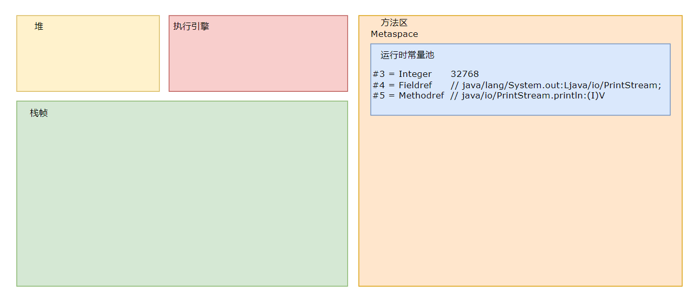

##### 2、方法字节码载入方法区

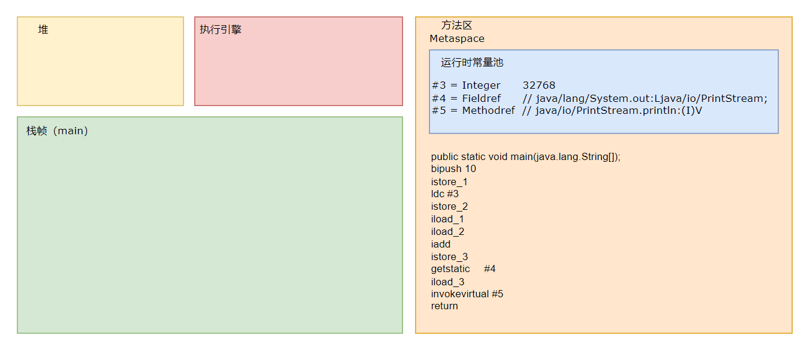

##### 3、main 线程开始运行，分配栈帧内存。

`stack=2（操作数栈）, locals=4（局部变量表）`

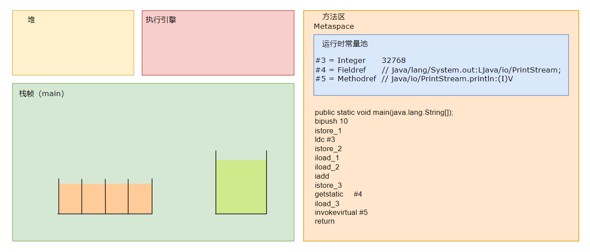

##### 4、执行引擎开始执行字节码

###### bipush 10

* `bipush 10`表示将一个 byte 压入操作数栈（byte是一个字节，操作数栈的宽度是4个字节，其长度会补齐4个字节），类似的指令还有：
* `sipush` 将一个 short 压入操作数栈（其长度会补齐4个字节）
* `ldc`将一个 int 压入操作数栈
* `ldc2_w`将一个 long 压入操作数栈（分两次压入，long 是8个字节）
* 这里小的数字都是和字节码指令存在一起，超过 short 范围的数组会存入常量池。

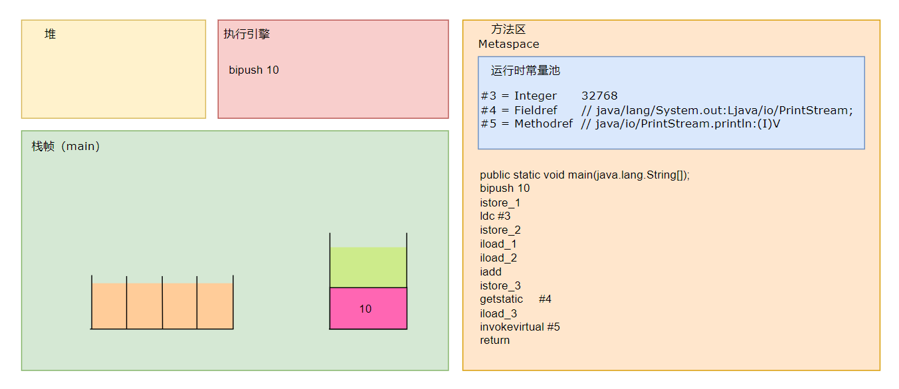

###### istore_1

将操作数栈顶数据弹出，存入局部变量表的 slot 1。

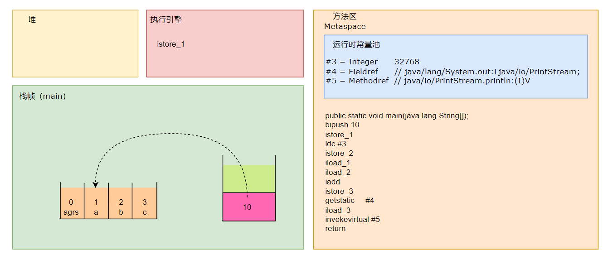

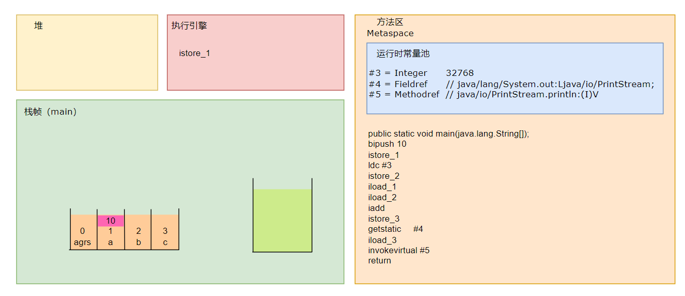

`bipush istore`对应着 Java 源代码`a = 10`；

###### ldc #3

从常量池加载 #3 数据到操作数栈

`Short.MAX_VALUE` 是 32767，所以 `32768 = Short.MAX_VALUE + 1` 实际上是在编译期间就计算好的。

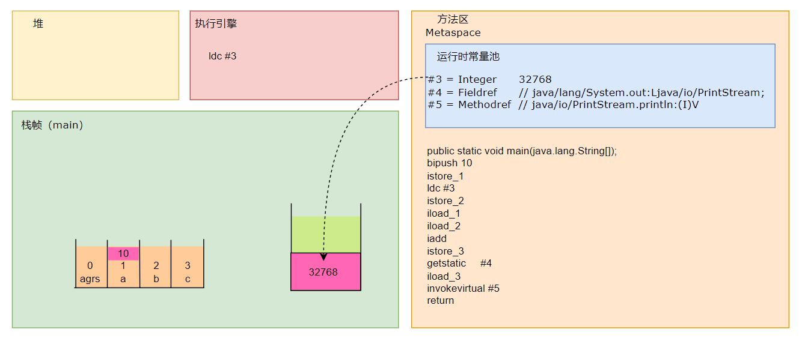

###### istore_2

将操作数栈顶数据弹出，存入局部变量表的 slot 2。

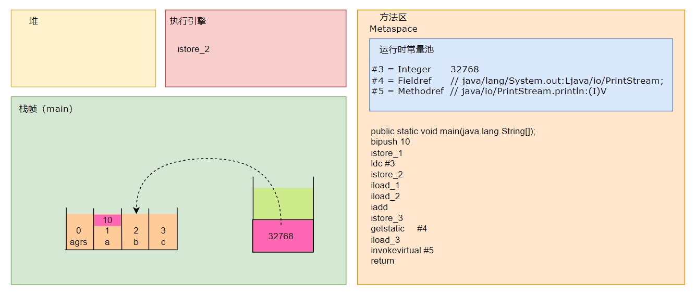

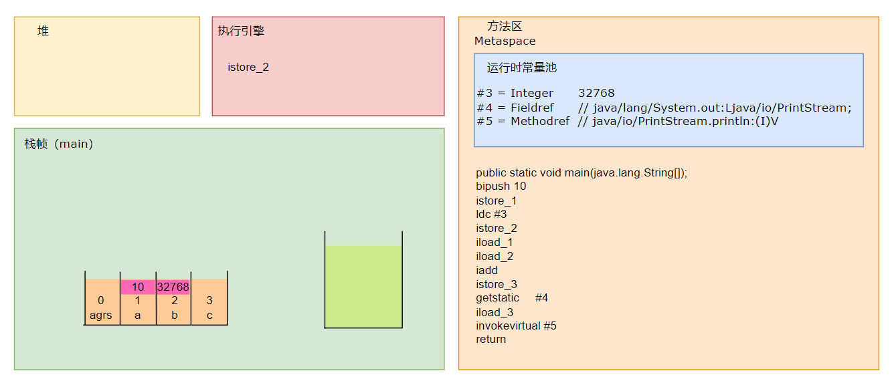

###### iload

* `iload_1`把局部变量1槽位的值读取到操作数栈中。
* `iload_2`把局部变量2槽位的值读取到操作数栈中。

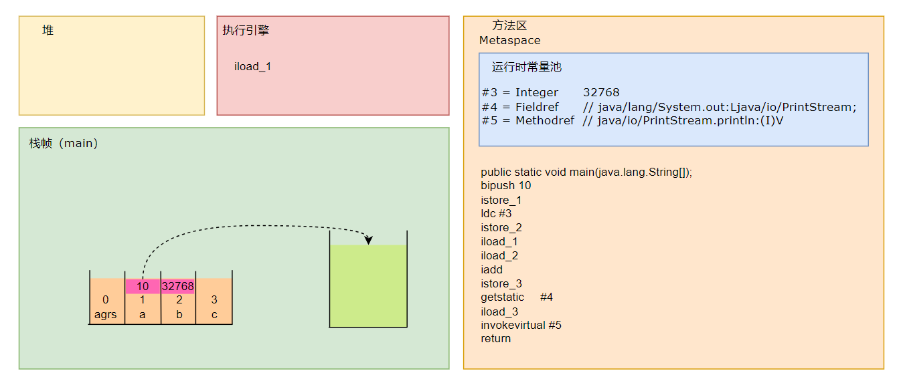

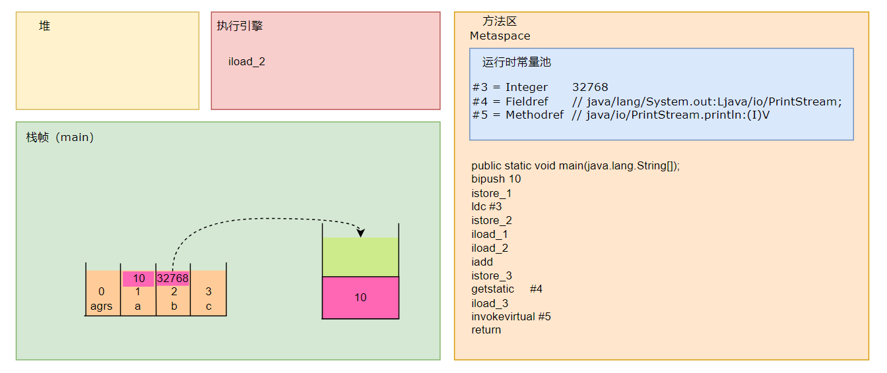

###### iadd

`iadd`用于对两个操作数栈上的值进行int类型的加法运算（会把操作数栈的两个值弹出栈），并把结果重新存入到操作栈顶。

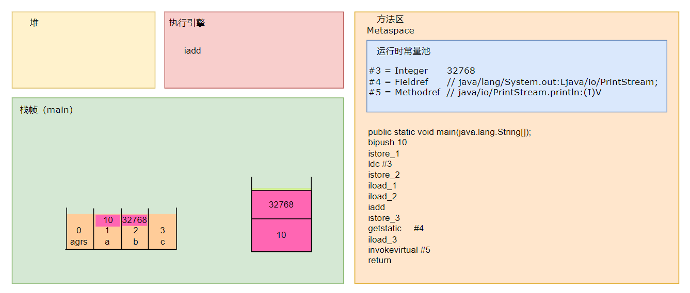

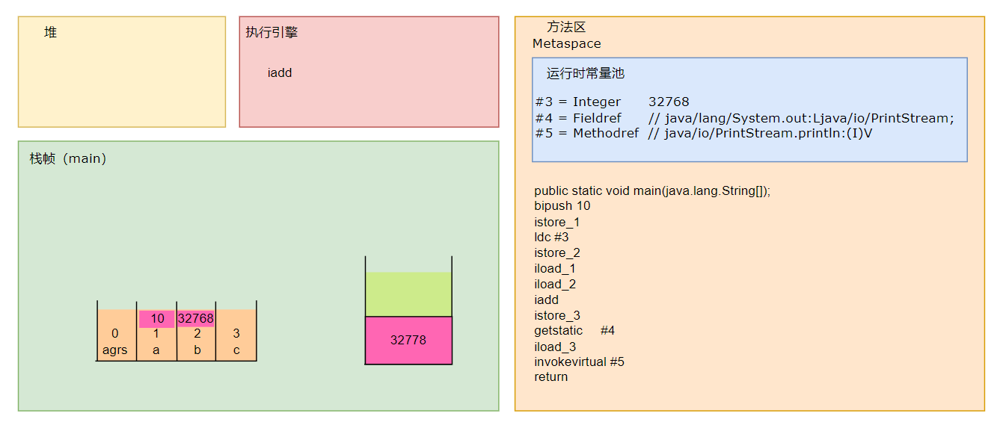

###### istore_3

将操作数栈顶数据弹出，存入局部变量表的 slot 3。

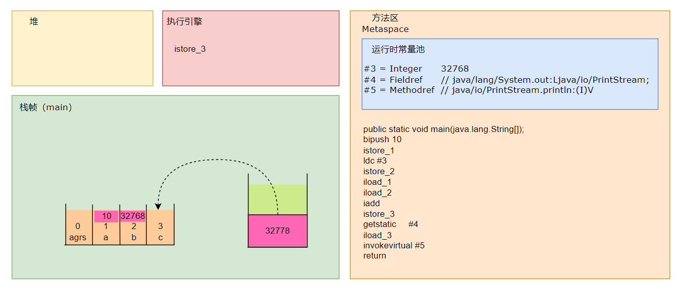

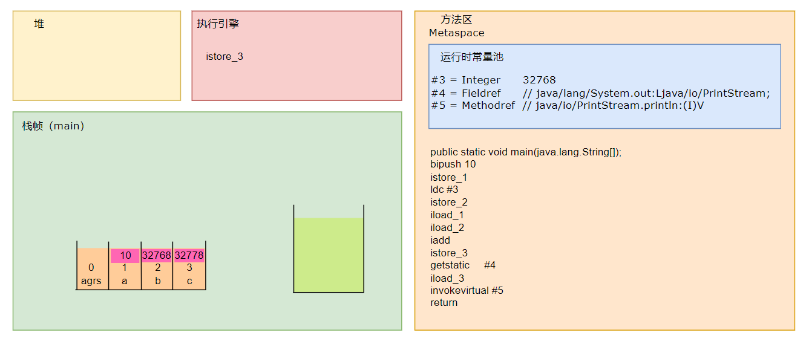

###### getstatic #4

- `getstatic `从常量池  #4 项获取类中静态字段

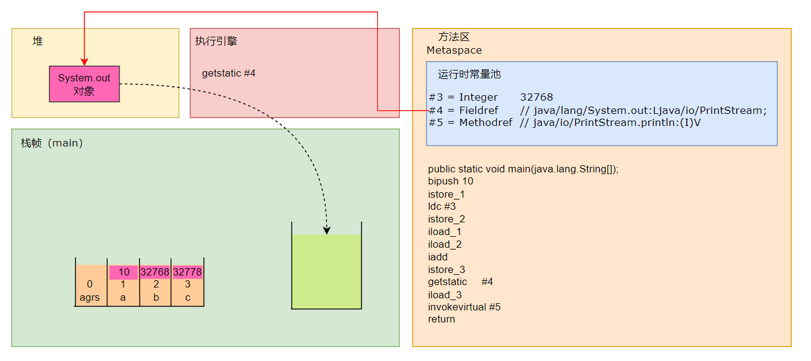

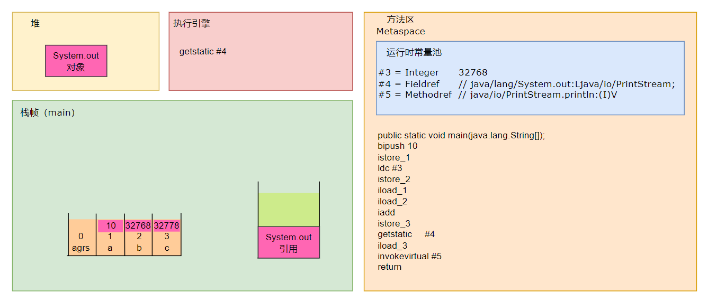

###### iload_3

- `iload_3` 从局部变量3中装载int类型值到操作数栈。

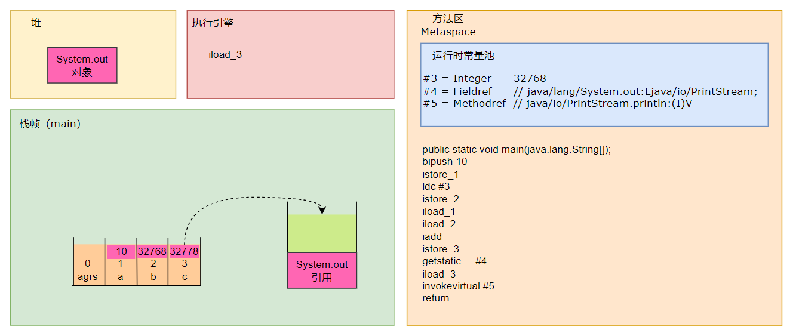

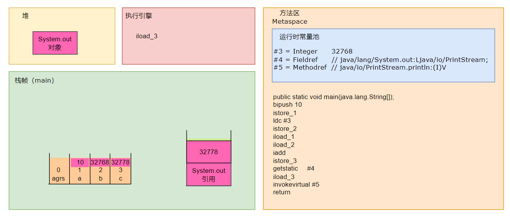

###### invokevirtual #5

1. invokestatic：该指令用于调用静态方法，即使用 static 关键字修饰的方法；
2. invokespecial：该指令用于三种场景：调用实例构造方法，调用私有方法（即private关键字修饰的方法）和父类方法（即super关键字调用的方法）；
3. invokeinterface：该指令用于调用接口方法，在运行时再确定一个实现此接口的对象；

4. invokevirtual：该指令用于调用虚方法（除了上述三种情况之外的方法）

* 找到常量池 #5 项。
* 定位到方法区`java/io/PrintStream.println:(I)V`方法。
* 生成新的栈帧（分配 locals、stack等）
* 传递参数，执行新栈帧中的字节码。

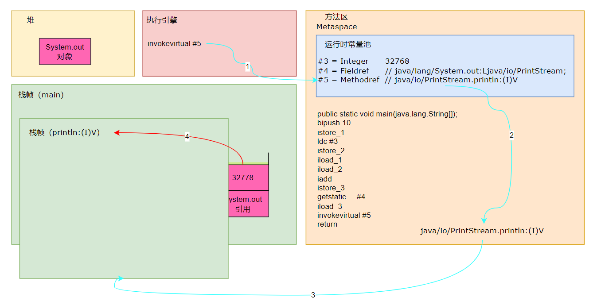

###### 执行完毕，弹出栈帧

* 清除 main 操作数栈内容。

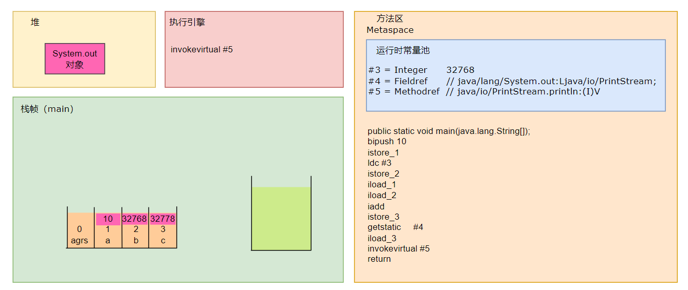

###### return

* 完成 main 方法调用，弹出 main 栈帧。
* 程序结束。

#### 分析 a++
```java
public class Test01 {
    public static void main(String[] args) throws Exception {
        int a = 10;
        int b = a++ + ++a + a--;
        System.out.println(a);
        System.out.println(b);
    }
}
```
使用`javap`命令反解析字节码文件
```txt
[root@server7 ~]# javap -v Test01.class 
Classfile /root/Test01.class
  Last modified 2023-6-28; size 419 bytes
  MD5 checksum 0521b3e1b1667f518c711d0366246347
  Compiled from "Test01.java"
public class Test01
  minor version: 0
  major version: 52
  flags: ACC_PUBLIC, ACC_SUPER
Constant pool:
   #1 = Methodref          #5.#14         // java/lang/Object."<init>":()V
   #2 = Fieldref           #15.#16        // java/lang/System.out:Ljava/io/PrintStream;
   #3 = Methodref          #17.#18        // java/io/PrintStream.println:(I)V
   #4 = Class              #19            // Test01
   #5 = Class              #20            // java/lang/Object
   #6 = Utf8               <init>
   #7 = Utf8               ()V
   #8 = Utf8               Code
   #9 = Utf8               LineNumberTable
  #10 = Utf8               main
  #11 = Utf8               ([Ljava/lang/String;)V
  #12 = Utf8               SourceFile
  #13 = Utf8               Test01.java
  #14 = NameAndType        #6:#7          // "<init>":()V
  #15 = Class              #21            // java/lang/System
  #16 = NameAndType        #22:#23        // out:Ljava/io/PrintStream;
  #17 = Class              #24            // java/io/PrintStream
  #18 = NameAndType        #25:#26        // println:(I)V
  #19 = Utf8               Test01
  #20 = Utf8               java/lang/Object
  #21 = Utf8               java/lang/System
  #22 = Utf8               out
  #23 = Utf8               Ljava/io/PrintStream;
  #24 = Utf8               java/io/PrintStream
  #25 = Utf8               println
  #26 = Utf8               (I)V
{
  public Test01();
    descriptor: ()V
    flags: ACC_PUBLIC
    Code:
      stack=1, locals=1, args_size=1
         0: aload_0
         1: invokespecial #1                  // Method java/lang/Object."<init>":()V
         4: return
      LineNumberTable:
        line 1: 0

  public static void main(java.lang.String[]);
    descriptor: ([Ljava/lang/String;)V
    flags: ACC_PUBLIC, ACC_STATIC
    Code:
      stack=2, locals=3, args_size=1
         0: bipush        10
         2: istore_1
         3: iload_1
         4: iinc          1, 1
         7: iinc          1, 1
        10: iload_1
        11: iadd
        12: iload_1
        13: iinc          1, -1
        16: iadd
        17: istore_2
        18: getstatic     #2                  // Field java/lang/System.out:Ljava/io/PrintStream;
        21: iload_1
        22: invokevirtual #3                  // Method java/io/PrintStream.println:(I)V
        25: getstatic     #2                  // Field java/lang/System.out:Ljava/io/PrintStream;
        28: iload_2
        29: invokevirtual #3                  // Method java/io/PrintStream.println:(I)V
        32: return
      LineNumberTable:
        line 3: 0
        line 4: 3
        line 5: 18
        line 6: 25
        line 7: 32
}
SourceFile: "Test01.java"
```
* `iinc`指令是直接在局部变量 slot 上进行运算。
* a++ 和 ++a 的区别是先执行`iload`还是先执行`iinc`。
    * a++：先`iload`再`iinc`。
    * ++a：先`iinc`再`iload`。
    
```txt
 0: bipush        10      // 将 10 压入操作数栈
 2: istore_1              // 将操作数栈顶数据弹出，存入局部变量表的 slot 1。将 10 放入局部变量表（a = 10）
 3: iload_1               // 将局部变量表槽位1的数值读取到操作数栈中 （a=10）
 4: iinc          1, 1    // 局部变量表1槽位自增1，（a=11）
 7: iinc          1, 1    // 局部变量表1槽位自增1，（a=12）
10: iload_1               // 将局部变量表槽位1的数值读取到操作数栈中 （a=12）
11: iadd                  // 此时操作数栈中有两个数值，进行加法运算（10 + 22 = 22）
12: iload_1               // 将局部变量表槽位1的数值读取到操作数栈中 （a=12）
13: iinc          1, -1   // 局部变量表1槽位自减1，（a=11）
16: iadd                  // 此时操作数栈中有两个数值，进行加法运算（22 + 12 = 34）
17: istore_2              // 将操作数栈顶数据弹出，存入局部变量表的 slot 2。将 34 放入局部变量表（b = 34）
```

> 图解 a++ 原理：https://www.bilibili.com/video/BV1yE411Z7AP?p=112

#### 条件判断指令
* byte、short、char 都会按 int 比较，因为操作数栈宽度是 4 个字节。
* goto 是用来进行跳转到指定行号的字节码。
* 从`-1 ~ 5`之间的数用`iconst`表示。`lconst_0、fconst_0 ...`
* ldc2_w 把常量池中long类型或者double类型的项压入栈。
#### 循环控制指令
while 和 for 的字节码是一样的。
#### 构造方法
##### <cinit\>()V
```java
public class Application {
    static int i = 10;

    static {
        i = 20;
    }

    static {
        i = 30;
    }
}
```
编译器会按从上到下的顺序，收集所有 static 静态代码块和静态成员赋值的代码，合并为一个特殊的方法`<cinit()V>`。
```txt
 0: bipush        10
 2: putstatic     #2                  // Field i:I
 5: bipush        20
 7: putstatic     #2                  // Field i:I
10: bipush        30
12: putstatic     #2                  // Field i:I
15: return
```
`<cinit()V>`方法会在类加载的初始化阶段被调用。（`<cinit()V>`是类构造方法）
##### <init\>()V
`<init>()V`是每个实例对象的构造方法。
```java
public class Application {

    private String a = "s1";

    {
        b = 20;
    }

    private int b = 10;

    {
        a = "s2";
    }

    public Application() {
    }

    public Application(String a, int b) {
        this.a = a;
        this.b = b;
    }

    public static void main(String[] args) {
        Application application = new Application("s3", 30);
        System.out.println(application.a);
        System.out.println(application.b);
    }
}
```
编译器会按从上至下的顺序，收集所有`{}`代码块和成员变量赋值的代码，形成新的构造方法，但原始构造方法内的代码总是再最后。
```txt
public cn.forbearance.spring.Application(java.lang.String, int);
    descriptor: (Ljava/lang/String;I)V
    flags: ACC_PUBLIC
    Code:
      stack=2, locals=3, args_size=3
         0: aload_0
         1: invokespecial #1                  // super."<init>":()V
         4: aload_0
         5: ldc           #2                  // String s1
         7: putfield      #3                  // this.a
        10: aload_0
        11: bipush        20
        13: putfield      #4                  // this.b
        16: aload_0
        17: bipush        10
        19: putfield      #4                  // this.b
        22: aload_0
        23: ldc           #5                  // String s2
        25: putfield      #3                  // this.a
        28: aload_0                           // --------原始构造---------
        29: aload_1                           // slot 1(a)  "s3"        |
        30: putfield      #3                  // this.a                 |
        33: aload_0                                                     |
        34: iload_2                           // slot 2(b)  30          |
        35: putfield      #4                  // this.b -----------------
        38: return
      LineNumberTable: ...
      LocalVariableTable:
        Start  Length  Slot  Name   Signature
            0      39     0  this   Lcn/forbearance/spring/Application;
            0      39     1     a   Ljava/lang/String;
            0      39     2     b   I
```
#### 方法调用
```java
public class Application {

    public Application() {}

    private void test1() {}

    private final void test2() {}

    public void test3() {}

    public static void test4() {}

    public static void main(String[] args) {
        Application application = new Application();
        application.test1();
        application.test2();
        application.test3();
        application.test4();
        Application.test4();
    }
}
```
字节码：
```txt
 0: new           #2                  // class cn/forbearance/spring/Application
 3: dup
 4: invokespecial #3                  // Method "<init>":()V
 7: astore_1
 8: aload_1
 9: invokespecial #4                  // Method test1:()V
12: aload_1
13: invokespecial #5                  // Method test2:()V
16: aload_1
17: invokevirtual #6                  // Method test3:()V
20: aload_1
21: pop
22: invokestatic  #7                  // Method test4:()V
25: invokestatic  #7                  // Method test4:()V
28: return
```
* `invokevirtual`称为动态绑定，需要在运行时确定。（实现一个方法的多态调用）
* `new`在堆空间分配内存，分配成功会将对象的引用放入操作数栈。
* `dup`在操作数栈复制了一份对象引用。（原因是main方法的操作数栈调用构造函数后，栈顶元素出栈。栈不能为空 空了就结束了）
* 通过对象调用静态方法会产生两条不必要的指令。`aload_1，pop`一入栈就出栈了。

#### 多态的原理
演示多态原理，需要加上JVM参数`-XX:-UseCompressedOops -XX:-UseCompressedClassPointers`，禁用指针压缩。
```java
public class Application {

    public static void test(Animal animal) {
        animal.eat();
        System.out.println(animal.toString());
    }

    public static void main(String[] args) throws Exception {
        test(new Dog());
        test(new Cat());
        System.in.read();
    }

}
abstract class Animal {
    public abstract void eat();

    @Override
    public String toString() {
        return "" + this.getClass().getSimpleName();
    }
}

class Dog extends Animal {

    @Override
    public void eat() {
        System.out.println("吃骨头");
    }
}

class Cat extends Animal {

    @Override
    public void eat() {
        System.out.println("吃鱼");
    }
}
```
1. 运行 Java 程序。使用`jps`获取进行id。
2. 运行 HSDB 工具，进入 JDK 安装目录，执行`java -classpath "%JAVA_HOME%/lib/sa-jdi.jar" sun.jvm.hotspot.HSDB`。
##### HSDB
###### 查找某个对象
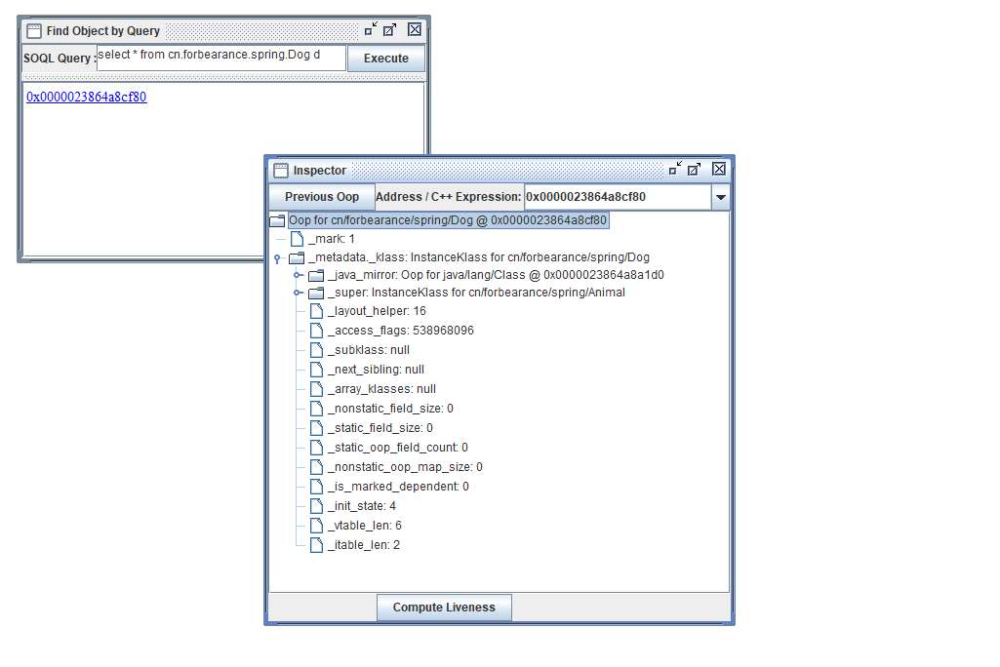
* 对象头一共 16 个字节，前8个字节（Mark Word）包含对象的 hash 码，以及对象加锁时的锁标记。
* 后8个字节（Klass Word）是对象的类型指针，根据类型指针可以找到对象的Class类。
* 如果是数组对象则：对象头 = Mark Word + Klass Word + 数组长度
###### 查找对象内存结构
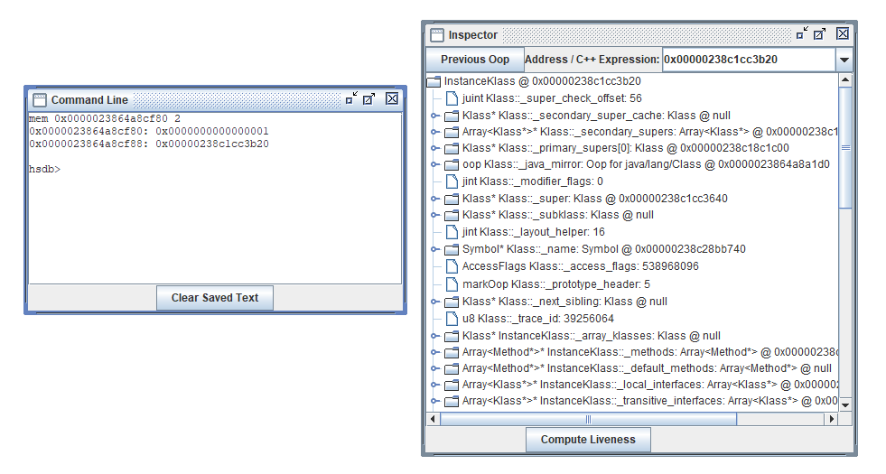
###### 查找对象Class的内存地址
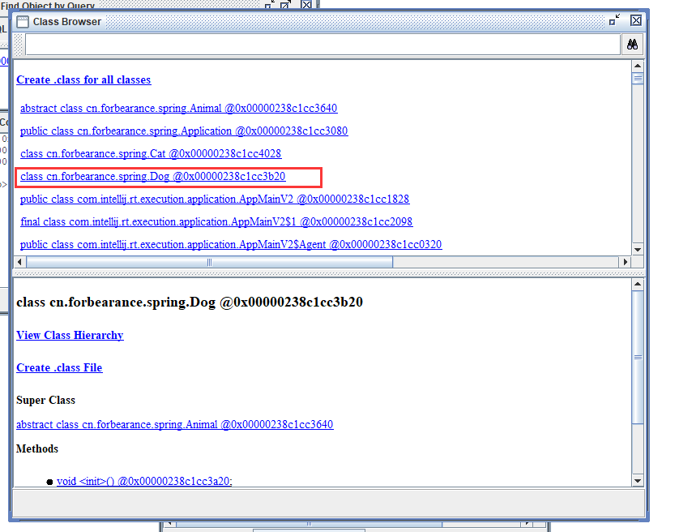
###### 查找类的 vtable
vtable 地址和 Class 地址偏移 `1B8`，在 Class 地址加上`1B8`就得到 vtable 地址。

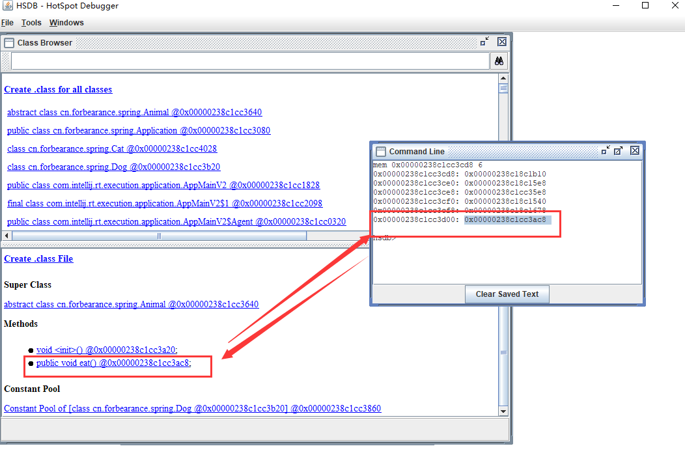

通过对象找到Class类，通过Class类能够知道虚方法表，确定方法的实际物理地址。虚方法表在类加载的链接阶段生成的。
##### 小结
当执行 invokevirtual 指令时
1. 先通过栈帧中的对象引用找到对象（在JVM中的地址）。
2. 分析对象头，找到对象的实际 Class。
3. Class 结构中有 vtable（虚方法表），它在类加载的链接阶段就已经根据方法的重写规则生成好了。
4. 查 vtable 得到方法的具体地址。
5. 执行方法的字节码。
### 编译期处理
### 类加载阶段
### 类加载器
### 运行期优化

## Java内存模型

## 附录
### String a = new String("a") 创建了几个对象？
首先可以肯定的是字符串字面量才会添加到字符串常量池中，或者调用`intern()`方法将字符串添加到字符串常量池中。

1. 字符串常量池中的对象："a"
    - 在 Java 中，字符串常量池时存储字符串常量的特殊区域。
    - 当编译器遇到字符串字面量时，会将其存储在字符串常量池中。
    - 所以，在字符串常量池中会存在一个值为 "a" 的对象。
    - 在堆中创建字符串对象 "a" 并在字符串常量池中保存对应的引用。（也需要分配内存空间进行存储）
2. 堆中的对象：`new String`
    - 使用`new`关键字创建了一个新的`String`对象。
    - 在堆中分配了内存空间来存储该对象。
    - 这个对象是通过拷贝字符串常量池中的值创建的。
    

因此，总共创建了两个对象：一个在字符串常量池中的对象和一个在堆中的对象。

需参照字节码进行理解：
```java
String s1 = new String("abc");
```


`ldc`命令用于判断字符串常量池中是否保存了对应的字符串对象的引用，如果保存了的话直接返回，如果没有保存的话，会在堆中创建对应的字符串对象并将该字符串对象的引用保存到字符串常量池中。

### JVM 常量池中存储的是对象还是引用呢？

### 如何判断一个类是无用的类？
方法区主要回收的是无用的类，判定一个常量是否是“废弃常量”比较简单，而要判定一个类是否是“无用的类”的条件则相对苛刻许多。类需要同时满足下面 3 个条件才能算是 “无用的类”：
* 该类所有的实例都已经被回收，也就是 Java 堆中不存在该类的任何实例。
* 加载该类的 ClassLoader 已经被回收。
* 该类对应的 java.lang.Class 对象没有在任何地方被引用，无法在任何地方通过反射访问该类的方法。

虚拟机可以对满足上述 3 个条件的无用类进行回收，这里说的仅仅是“可以”，而并不是和对象一样不使用了就会必然被回收。

### JIT 编译器&逃逸分析


```txt
工作中需要做jvm调优的人，在公司里也算得上核心骨干了
```

### JVM指令注记符
> https://blog.csdn.net/A598853607/article/details/125026953

### 讲讲什么是多态，底层原理是啥