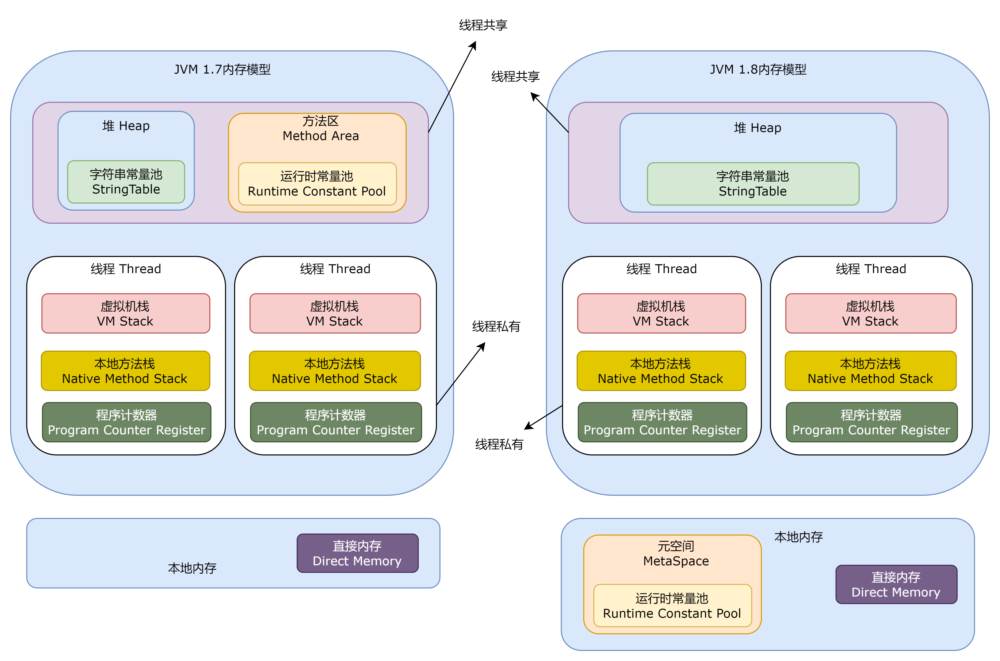
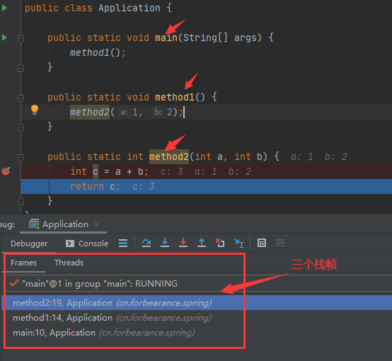
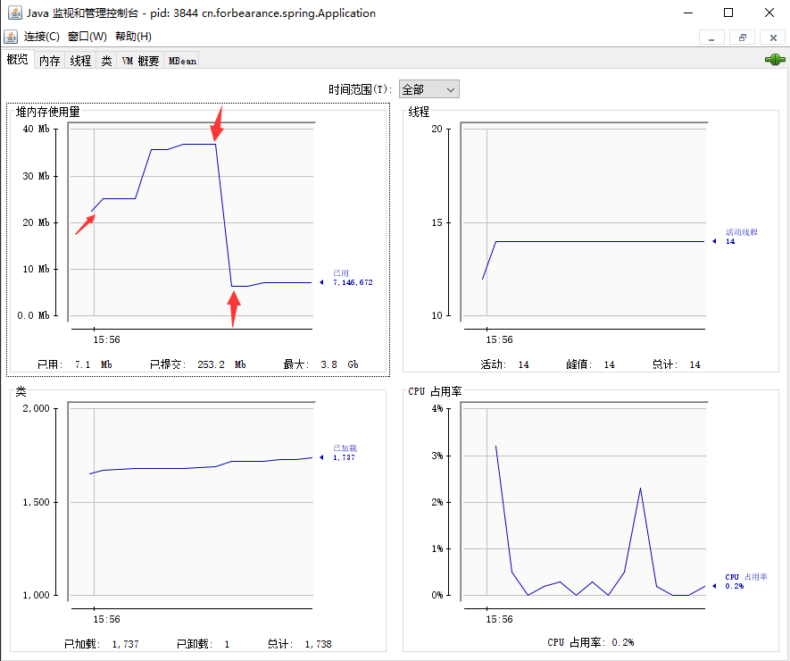

# JVM
## JVM内存模型


Java 虚拟机在执行 Java 程序的过程中会把它管理的内存划分成若干个不同的 数据区域。JDK1.8和以前的版本略有不同。

### 程序计数器
```txt
 0: getstatic     #2                  // Field java/lang/System.out:Ljava/io/PrintStream;
 3: astore_1
 4: aload_1
 5: iconst_1
 6: invokevirtual #3                  // Method java/io/PrintStream.println:(I)V
 9: aload_1
10: iconst_2
11: invokevirtual #3                  // Method java/io/PrintStream.println:(I)V
14: aload_1
15: iconst_3
16: invokevirtual #3                  // Method java/io/PrintStream.println:(I)V
19: aload_1
20: iconst_4
21: invokevirtual #3                  // Method java/io/PrintStream.println:(I)V
24: aload_1
25: iconst_5
26: invokevirtual #3                  // Method java/io/PrintStream.println:(I)V
29: return
```
程序计数器可以看作是当前线程所执行的字节码的行号指示器。字节码解释器工作时通过改变这个计数器的值来选取下一条需要执行的字节码指令。例如上述字节码文件最左边的数字可以看作是程序计数器。（记录下一条JVM指令的执行地址）

在物理上是通过寄存器实现的。（寄存器是CPU组件中读取速度最快的单元）。

特点：1、线程私有。2、程序计数器是唯一一个不会出现 OutOfMemoryError 的内存区域，它的生命周期随着线程的创建而创建，随着线程的结束而死亡。


### 栈
#### 虚拟机栈
与程序计数器一样，Java 虚拟机栈也是线程私有的，它的生命周期和线程相同，随着线程的创建而创建，随着线程的死亡而死亡。

* 栈：线程运行需要的内存空间，称为虚拟机栈。
* 栈帧（Frame）：每个方法运行时需要的内存。
* 栈由一个个栈帧组成，一个栈帧就对应一次方法的调用。而每个栈帧中都拥有：局部变量表、操作数栈、动态链接、方法返回地址。
* 每个线程只能有一个活动栈帧，对应着当前正在执行的那个方法。

演示：



说明：在栈顶部的栈帧就称为活动栈帧。

问题分析：
1. 垃圾回收是否设计栈内存？
```txt
栈帧内存在每一次方法调用后，都会被弹出栈，即自动被回收，不需要垃圾回收进行管理栈内存。

垃圾回收针对是堆内存中的无用对象。
```
2. 栈内存分配越大越好吗？
```txt
使用 -Xss size 寻虚拟机参数指定栈内存
-Xss1m 
-Xss1024k
-Xss1048576

栈内存分配越大只是能够进行更多次的方法递归调用，并不能提升程序执行速度。反而还会降低线程运行数。
```
3. 方法内的局部变量是否线程安全？
```txt
是线程安全
一个线程对应一个栈，线程内每一次方法调用都会产生一个新的栈帧。多个线程就会有多个私有的局部变量。
```
判断一个变量是不是线程安全，不仅要考虑是不是方法内的局部变量，还要考虑方法内局部变量（引用类型）逃离了方法的作用范围。如果逃离了方法的作用范围，那么有可能被其他线程访问到。则需要考虑线程安全。

##### 栈内存溢出
栈空间固定，栈帧过多导致栈内存移除（栈容纳不下栈帧了，典型的有递归调用且没有结束条件）。

`java.lang.StackOverflowError`

##### 线程运行诊断
1. 案例1：CPU 占用过多
```txt
定位：
   1、用`top`命令定位哪个进程堆CPU的占用过高。（PID（进程id））
   2、`ps H -eo pid,tid,%cpu | grep PID`（H：展示详细信息，-eo 输出指定信息）
       用ps命令进一步定位是哪个线程引起的CPU占用过高
   3、jstack PID，根据线程id找到有问题的线程，进一步定位到问题代码的行数
   
jstack 命令输出的线程编号（nid）是16进制，需要将ps命令打印的tid列的参数转换为16进制。
通过 jstack 命令排查出是哪个线程出现问题后，就可以去对应类检查问题。（jstack 也会打印出现问题的代码行数）
```
2. 案例2：程序运行很长事件没有结果
```txt
死锁案例，定位：
   1、使用`jps -1`命令查找Java进程，并定位到是哪个类迟迟没有结果
   2、jstack PID
```
执行`jstack 1842`命令后会输出如下信息
```txt
[root@server7 ~]# jstack 1842
2023-06-25 22:47:40
Full thread dump Java HotSpot(TM) 64-Bit Server VM (25.271-b09 mixed mode):

"Attach Listener" #12 daemon prio=9 os_prio=0 tid=0x00007ff0e8001000 nid=0x767 waiting on condition [0x0000000000000000]
   java.lang.Thread.State: RUNNABLE

"DestroyJavaVM" #11 prio=5 os_prio=0 tid=0x00007ff128009800 nid=0x733 waiting on condition [0x0000000000000000]
   java.lang.Thread.State: RUNNABLE

"Thread-1" #10 prio=5 os_prio=0 tid=0x00007ff12817b800 nid=0x742 waiting for monitor entry [0x00007ff102508000]
   java.lang.Thread.State: BLOCKED (on object monitor)
	at Test.lambda$main$1(Test.java:24)
	- waiting to lock <0x00000000d685d2e0> (a A)
	- locked <0x00000000d685dd28> (a B)
	at Test$$Lambda$2/303563356.run(Unknown Source)
	at java.lang.Thread.run(Thread.java:748)

"Thread-0" #9 prio=5 os_prio=0 tid=0x00007ff128179800 nid=0x741 waiting for monitor entry [0x00007ff102609000]
   java.lang.Thread.State: BLOCKED (on object monitor)
	at Test.lambda$main$0(Test.java:16)
	- waiting to lock <0x00000000d685dd28> (a B)
	- locked <0x00000000d685d2e0> (a A)
	at Test$$Lambda$1/471910020.run(Unknown Source)
	at java.lang.Thread.run(Thread.java:748)

"Service Thread" #8 daemon prio=9 os_prio=0 tid=0x00007ff1280d0800 nid=0x73f runnable [0x0000000000000000]
   java.lang.Thread.State: RUNNABLE

"C1 CompilerThread2" #7 daemon prio=9 os_prio=0 tid=0x00007ff1280bd800 nid=0x73e waiting on condition [0x0000000000000000]
   java.lang.Thread.State: RUNNABLE

"C2 CompilerThread1" #6 daemon prio=9 os_prio=0 tid=0x00007ff1280bb800 nid=0x73d waiting on condition [0x0000000000000000]
   java.lang.Thread.State: RUNNABLE

"C2 CompilerThread0" #5 daemon prio=9 os_prio=0 tid=0x00007ff1280b8800 nid=0x73c waiting on condition [0x0000000000000000]
   java.lang.Thread.State: RUNNABLE

"Signal Dispatcher" #4 daemon prio=9 os_prio=0 tid=0x00007ff1280b7000 nid=0x73b runnable [0x0000000000000000]
   java.lang.Thread.State: RUNNABLE

"Finalizer" #3 daemon prio=8 os_prio=0 tid=0x00007ff128086000 nid=0x73a in Object.wait() [0x00007ff102d10000]
   java.lang.Thread.State: WAITING (on object monitor)
	at java.lang.Object.wait(Native Method)
	- waiting on <0x00000000d6808ee0> (a java.lang.ref.ReferenceQueue$Lock)
	at java.lang.ref.ReferenceQueue.remove(ReferenceQueue.java:144)
	- locked <0x00000000d6808ee0> (a java.lang.ref.ReferenceQueue$Lock)
	at java.lang.ref.ReferenceQueue.remove(ReferenceQueue.java:165)
	at java.lang.ref.Finalizer$FinalizerThread.run(Finalizer.java:216)

"Reference Handler" #2 daemon prio=10 os_prio=0 tid=0x00007ff128081800 nid=0x739 in Object.wait() [0x00007ff102e11000]
   java.lang.Thread.State: WAITING (on object monitor)
	at java.lang.Object.wait(Native Method)
	- waiting on <0x00000000d6806c00> (a java.lang.ref.Reference$Lock)
	at java.lang.Object.wait(Object.java:502)
	at java.lang.ref.Reference.tryHandlePending(Reference.java:191)
	- locked <0x00000000d6806c00> (a java.lang.ref.Reference$Lock)
	at java.lang.ref.Reference$ReferenceHandler.run(Reference.java:153)

"VM Thread" os_prio=0 tid=0x00007ff128078000 nid=0x738 runnable 

"GC task thread#0 (ParallelGC)" os_prio=0 tid=0x00007ff12801e800 nid=0x734 runnable 

"GC task thread#1 (ParallelGC)" os_prio=0 tid=0x00007ff128020800 nid=0x735 runnable 

"GC task thread#2 (ParallelGC)" os_prio=0 tid=0x00007ff128022800 nid=0x736 runnable 

"GC task thread#3 (ParallelGC)" os_prio=0 tid=0x00007ff128024000 nid=0x737 runnable 

"VM Periodic Task Thread" os_prio=0 tid=0x00007ff1280d3800 nid=0x740 waiting on condition 

JNI global references: 310


Found one Java-level deadlock:
=============================
"Thread-1":
  waiting to lock monitor 0x00007ff0f4002178 (object 0x00000000d685d2e0, a A),
  which is held by "Thread-0"
"Thread-0":
  waiting to lock monitor 0x00007ff0f4006218 (object 0x00000000d685dd28, a B),
  which is held by "Thread-1"

Java stack information for the threads listed above:
===================================================

// 看下面这段信息，问题出现在 Test.java 24行，Test.java 16行，waiting to lock
"Thread-1":
	at Test.lambda$main$1(Test.java:24)
	- waiting to lock <0x00000000d685d2e0> (a A)
	- locked <0x00000000d685dd28> (a B)
	at Test$$Lambda$2/303563356.run(Unknown Source)
	at java.lang.Thread.run(Thread.java:748)
"Thread-0":
	at Test.lambda$main$0(Test.java:16)
	- waiting to lock <0x00000000d685dd28> (a B)
	- locked <0x00000000d685d2e0> (a A)
	at Test$$Lambda$1/471910020.run(Unknown Source)
	at java.lang.Thread.run(Thread.java:748)

Found 1 deadlock.
```
可以看到输出内容的底部有`Found one Java-level deadlock`字样，说明出现了死锁。并且输出内容的底部也说明了问题出现的类和行数。

#### 本地方法栈
调用本地方法时给本地方法提供的内存空间。
### 堆
此内存区域的唯一目的就是存放对象实例（new），几乎所有的对象实例以及数组都在这里分配内存（逃逸分析可以在栈上分配内存）。

特点：线程共享，堆中对象需要考虑线程安全，有垃圾回收机制。

#### 堆内存溢出
堆内存中的空间不足以存放新创建的对象，就会引发`java.lang.OutOfMemoryErrot: Java heap space`错误，可通过设置虚拟机参数`-Xmx`修改堆内存大小。
```txt
eg:
   -Xmx8m
   -Xmx256m
```
#### 堆内存诊断
* jps：查看当前系统中有哪些 Java 进程。
* jmap：查看堆内存占用情况（某一时刻）。（`jmap -heap 进程id`）
* jconsole：图形界面，多功能检测工具（还可以检测线程、CPU..），可以连续检测。

案例
```java
public class Application {

    public static void main(String[] args) throws Exception {
        System.out.println("1...");
        Thread.sleep(30000);
        byte[] b = new byte[1024 * 1024 * 10]; // 10M
        System.out.println("2...");
        Thread.sleep(30000);
        b = null;
        System.gc();
        System.out.println("3...");
        Thread.sleep(3000000L);
    }
}
```
- jmap

将上面这段程序运行，并且在分别输出打印内容后执行`jmap`命令。（在IDEA中Terminal终端执行命令）
```txt
> jps
14832
2896
4448 Jps
4912 Application
12024 Launcher

# 第一次Thread.sleep时执行
> jmap -heap 4912
Attaching to process ID 4912, please wait...
Debugger attached successfully.
Server compiler detected.
JVM version is 25.271-b09
using thread-local object allocation.
Parallel GC with 4 thread(s)
Heap Configuration:
   MinHeapFreeRatio         = 0
   MaxHeapFreeRatio         = 100
   MaxHeapSize              = 4219469824 (4024.0MB)
   NewSize                  = 88080384 (84.0MB)
   MaxNewSize               = 1406140416 (1341.0MB)
   OldSize                  = 176160768 (168.0MB)
   NewRatio                 = 2
   SurvivorRatio            = 8
   MetaspaceSize            = 21807104 (20.796875MB)
   CompressedClassSpaceSize = 1073741824 (1024.0MB)
   MaxMetaspaceSize         = 17592186044415 MB
   G1HeapRegionSize         = 0 (0.0MB)

Heap Usage:
PS Young Generation
Eden Space:
   capacity = 66060288 (63.0MB)
   used     = 6606184 (6.300148010253906MB)
   free     = 59454104 (56.699851989746094MB)
   10.000234936910962% used
From Space:
   capacity = 11010048 (10.5MB)
   used     = 0 (0.0MB)
   free     = 11010048 (10.5MB)
   0.0% used
To Space:
   capacity = 11010048 (10.5MB)
   used     = 0 (0.0MB)
   free     = 11010048 (10.5MB)
   0.0% used
PS Old Generation
   capacity = 176160768 (168.0MB)
   used     = 0 (0.0MB)
   free     = 176160768 (168.0MB)
   0.0% used

3173 interned Strings occupying 260344 bytes.

# 第二次Thread.sleep时执行
> jmap -heap 4912
Attaching to process ID 4912, please wait...
Debugger attached successfully.
Server compiler detected.
JVM version is 25.271-b09

using thread-local object allocation.
Parallel GC with 4 thread(s)

Heap Configuration:
   MinHeapFreeRatio         = 0
   MaxHeapFreeRatio         = 100
   MaxHeapSize              = 4219469824 (4024.0MB)
   NewSize                  = 88080384 (84.0MB)
   MaxNewSize               = 1406140416 (1341.0MB)
   OldSize                  = 176160768 (168.0MB)
   NewRatio                 = 2
   SurvivorRatio            = 8
   MetaspaceSize            = 21807104 (20.796875MB)
   CompressedClassSpaceSize = 1073741824 (1024.0MB)
   MaxMetaspaceSize         = 17592186044415 MB
   G1HeapRegionSize         = 0 (0.0MB)

Heap Usage:
PS Young Generation
Eden Space:
   capacity = 66060288 (63.0MB)
   used     = 17091960 (16.30016326904297MB)
   free     = 48968328 (46.69983673095703MB)
   25.873275030226935% used
From Space:
   capacity = 11010048 (10.5MB)
   used     = 0 (0.0MB)
   free     = 11010048 (10.5MB)
   0.0% used
To Space:
   capacity = 11010048 (10.5MB)
   used     = 0 (0.0MB)
   free     = 11010048 (10.5MB)
   0.0% used
PS Old Generation
   capacity = 176160768 (168.0MB)
   used     = 0 (0.0MB)
   free     = 176160768 (168.0MB)
   0.0% used

3174 interned Strings occupying 260392 bytes.

# 第三次Thread.sleep时执行
> jmap -heap 4912
Attaching to process ID 4912, please wait...
Debugger attached successfully.
Server compiler detected.
JVM version is 25.271-b09

using thread-local object allocation.
Parallel GC with 4 thread(s)

Heap Configuration:
   MinHeapFreeRatio         = 0
   MaxHeapFreeRatio         = 100
   MaxHeapSize              = 4219469824 (4024.0MB)
   NewSize                  = 88080384 (84.0MB)
   MaxNewSize               = 1406140416 (1341.0MB)
   OldSize                  = 176160768 (168.0MB)
   NewRatio                 = 2
   SurvivorRatio            = 8
   MetaspaceSize            = 21807104 (20.796875MB)
   CompressedClassSpaceSize = 1073741824 (1024.0MB)
   MaxMetaspaceSize         = 17592186044415 MB
   G1HeapRegionSize         = 0 (0.0MB)

Heap Usage:
PS Young Generation
Eden Space:
   capacity = 66060288 (63.0MB)
   used     = 1321224 (1.2600173950195312MB)
   free     = 64739064 (61.73998260498047MB)
   2.000027611142113% used
From Space:
   capacity = 11010048 (10.5MB)
   used     = 0 (0.0MB)
   free     = 11010048 (10.5MB)
   0.0% used
To Space:
   capacity = 11010048 (10.5MB)
   used     = 0 (0.0MB)
   free     = 11010048 (10.5MB)
   0.0% used
PS Old Generation
   capacity = 176160768 (168.0MB)
   used     = 990960 (0.9450531005859375MB)
   free     = 175169808 (167.05494689941406MB)
   0.5625316074916294% used

3160 interned Strings occupying 259400 bytes.
```
观察`Heap Usage`，第一次执行`jmap`堆内存使用了6M，而第二次执行`jmap`堆内存使用了16M，原因是创建10M的大小的byte数组，最后第三次执行`jmap`堆内存使用了1M，因为执行了一次垃圾回收（将byte数组指向null，表示byte不会被使用了，可以被垃圾回收）

- jconsole

重新运行案例，使用`jconsole`命令



- jvirsualvm


#### StringTable
### 方法区
#### 运行时常量池
### 直接内存


## 附录
### String a = new String("a") 创建了几个对象？
1. 字符串常量池中的对象："a"
    - 在 Java 中，字符串常量池时存储字符串常量的特殊区域。
    - 当编译器遇到字符串字面量时，会将其存储在字符串常量池中。
    - 所以，在字符串常量池中会存在一个值为 "a" 的对象。
    - 在堆中创建字符串对象 "a" 并在字符串常量池中保存对应的引用。（也需要分配内存空间进行存储）
2. 堆中的对象：`new String`
    - 使用`new`关键字创建了一个新的`String`对象。
    - 在堆中分配了内存空间来存储该对象。
    - 这个对象是通过拷贝字符串常量池中的值创建的。
    
因此，总共创建了两个对象：一个在字符串常量池中的对象和一个在堆中的对象。

需参照字节码进行理解：