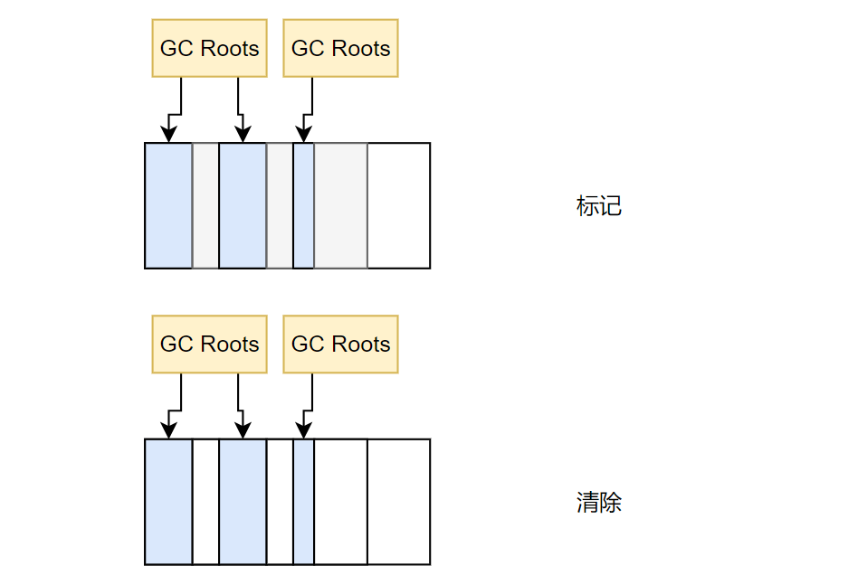

# JVM
> 参考了 https://javaguide.cn/java/jvm/jvm-garbage-collection.html#%E5%A4%8D%E5%88%B6%E7%AE%97%E6%B3%95
## JVM内存模型


Java 虚拟机在执行 Java 程序的过程中会把它管理的内存划分成若干个不同的 数据区域。JDK1.8和以前的版本略有不同。

JDK1.8与1.7最大的区别是1.8将永久代取消，取而代之的是元空间，既然方法区是由永久代实现的，取消了永久代，那么方法区由谁来实现呢，在1.8中方法区是由元空间来实现，所以原来属于方法区的运行时常量池就属于元空间了。

在JDK1.7 字符串常量池被从方法区拿到了堆中, 这里没有提到运行时常量池,也就是说字符串常量池被单独拿到堆,运行时常量池剩下的东西还在方法区, 也就是hotspot中的永久代

### 程序计数器
```txt
 0: getstatic     #2                  // Field java/lang/System.out:Ljava/io/PrintStream;
 3: astore_1
 4: aload_1
 5: iconst_1
 6: invokevirtual #3                  // Method java/io/PrintStream.println:(I)V
 9: aload_1
10: iconst_2
11: invokevirtual #3                  // Method java/io/PrintStream.println:(I)V
14: aload_1
15: iconst_3
16: invokevirtual #3                  // Method java/io/PrintStream.println:(I)V
19: aload_1
20: iconst_4
21: invokevirtual #3                  // Method java/io/PrintStream.println:(I)V
24: aload_1
25: iconst_5
26: invokevirtual #3                  // Method java/io/PrintStream.println:(I)V
29: return
```
程序计数器可以看作是当前线程所执行的字节码的行号指示器。字节码解释器工作时通过改变这个计数器的值来选取下一条需要执行的字节码指令。例如上述字节码文件最左边的数字可以看作是程序计数器。（记录下一条JVM指令的执行地址）

在物理上是通过寄存器实现的。（寄存器是CPU组件中读取速度最快的单元）。

特点：1、线程私有。2、程序计数器是唯一一个不会出现 OutOfMemoryError 的内存区域，它的生命周期随着线程的创建而创建，随着线程的结束而死亡。


### 栈
#### 虚拟机栈
与程序计数器一样，Java 虚拟机栈也是线程私有的，它的生命周期和线程相同，随着线程的创建而创建，随着线程的死亡而死亡。

* 栈：线程运行需要的内存空间，称为虚拟机栈。
* 栈帧（Frame）：每个方法运行时需要的内存。
* 栈由一个个栈帧组成，一个栈帧就对应一次方法的调用。而每个栈帧中都拥有：局部变量表、操作数栈、动态链接、方法返回地址。
* 每个线程只能有一个活动栈帧，对应着当前正在执行的那个方法。

演示：


说明：在栈顶部的栈帧就称为活动栈帧。

问题分析：
1. 垃圾回收是否设计栈内存？
```txt
栈帧内存在每一次方法调用后，都会被弹出栈，即自动被回收，不需要垃圾回收进行管理栈内存。

垃圾回收针对是堆内存中的无用对象。
```
2. 栈内存分配越大越好吗？
```txt
使用 -Xss size 寻虚拟机参数指定栈内存
-Xss1m 
-Xss1024k
-Xss1048576

栈内存分配越大只是能够进行更多次的方法递归调用，并不能提升程序执行速度。反而还会降低线程运行数。
```
3. 方法内的局部变量是否线程安全？
```txt
是线程安全
一个线程对应一个栈，线程内每一次方法调用都会产生一个新的栈帧。多个线程就会有多个私有的局部变量。
```
判断一个变量是不是线程安全，不仅要考虑是不是方法内的局部变量，还要考虑方法内局部变量（引用类型）逃离了方法的作用范围。如果逃离了方法的作用范围，那么有可能被其他线程访问到。则需要考虑线程安全。

##### 栈内存溢出
栈空间固定，栈帧过多导致栈内存移除（栈容纳不下栈帧了，典型的有递归调用且没有结束条件）。

`java.lang.StackOverflowError`

##### 线程运行诊断
1. 案例1：CPU 占用过多
```txt
定位：
   1、用`top`命令定位哪个进程堆CPU的占用过高。（PID（进程id））
   2、`ps H -eo pid,tid,%cpu | grep PID`（H：展示详细信息，-eo 输出指定信息）
       用ps命令进一步定位是哪个线程引起的CPU占用过高
   3、jstack PID，根据线程id找到有问题的线程，进一步定位到问题代码的行数
   
jstack 命令输出的线程编号（nid）是16进制，需要将ps命令打印的tid列的参数转换为16进制。
通过 jstack 命令排查出是哪个线程出现问题后，就可以去对应类检查问题。（jstack 也会打印出现问题的代码行数）
```
2. 案例2：程序运行很长事件没有结果
```txt
死锁案例，定位：
   1、使用`jps -1`命令查找Java进程，并定位到是哪个类迟迟没有结果
   2、jstack PID
```
执行`jstack 1842`命令后会输出如下信息
```txt
[root@server7 ~]# jstack 1842
2023-06-25 22:47:40
Full thread dump Java HotSpot(TM) 64-Bit Server VM (25.271-b09 mixed mode):

"Attach Listener" #12 daemon prio=9 os_prio=0 tid=0x00007ff0e8001000 nid=0x767 waiting on condition [0x0000000000000000]
   java.lang.Thread.State: RUNNABLE

"DestroyJavaVM" #11 prio=5 os_prio=0 tid=0x00007ff128009800 nid=0x733 waiting on condition [0x0000000000000000]
   java.lang.Thread.State: RUNNABLE

"Thread-1" #10 prio=5 os_prio=0 tid=0x00007ff12817b800 nid=0x742 waiting for monitor entry [0x00007ff102508000]
   java.lang.Thread.State: BLOCKED (on object monitor)
	at Test.lambda$main$1(Test.java:24)
	- waiting to lock <0x00000000d685d2e0> (a A)
	- locked <0x00000000d685dd28> (a B)
	at Test$$Lambda$2/303563356.run(Unknown Source)
	at java.lang.Thread.run(Thread.java:748)

"Thread-0" #9 prio=5 os_prio=0 tid=0x00007ff128179800 nid=0x741 waiting for monitor entry [0x00007ff102609000]
   java.lang.Thread.State: BLOCKED (on object monitor)
	at Test.lambda$main$0(Test.java:16)
	- waiting to lock <0x00000000d685dd28> (a B)
	- locked <0x00000000d685d2e0> (a A)
	at Test$$Lambda$1/471910020.run(Unknown Source)
	at java.lang.Thread.run(Thread.java:748)

"Service Thread" #8 daemon prio=9 os_prio=0 tid=0x00007ff1280d0800 nid=0x73f runnable [0x0000000000000000]
   java.lang.Thread.State: RUNNABLE

"C1 CompilerThread2" #7 daemon prio=9 os_prio=0 tid=0x00007ff1280bd800 nid=0x73e waiting on condition [0x0000000000000000]
   java.lang.Thread.State: RUNNABLE

"C2 CompilerThread1" #6 daemon prio=9 os_prio=0 tid=0x00007ff1280bb800 nid=0x73d waiting on condition [0x0000000000000000]
   java.lang.Thread.State: RUNNABLE

"C2 CompilerThread0" #5 daemon prio=9 os_prio=0 tid=0x00007ff1280b8800 nid=0x73c waiting on condition [0x0000000000000000]
   java.lang.Thread.State: RUNNABLE

"Signal Dispatcher" #4 daemon prio=9 os_prio=0 tid=0x00007ff1280b7000 nid=0x73b runnable [0x0000000000000000]
   java.lang.Thread.State: RUNNABLE

"Finalizer" #3 daemon prio=8 os_prio=0 tid=0x00007ff128086000 nid=0x73a in Object.wait() [0x00007ff102d10000]
   java.lang.Thread.State: WAITING (on object monitor)
	at java.lang.Object.wait(Native Method)
	- waiting on <0x00000000d6808ee0> (a java.lang.ref.ReferenceQueue$Lock)
	at java.lang.ref.ReferenceQueue.remove(ReferenceQueue.java:144)
	- locked <0x00000000d6808ee0> (a java.lang.ref.ReferenceQueue$Lock)
	at java.lang.ref.ReferenceQueue.remove(ReferenceQueue.java:165)
	at java.lang.ref.Finalizer$FinalizerThread.run(Finalizer.java:216)

"Reference Handler" #2 daemon prio=10 os_prio=0 tid=0x00007ff128081800 nid=0x739 in Object.wait() [0x00007ff102e11000]
   java.lang.Thread.State: WAITING (on object monitor)
	at java.lang.Object.wait(Native Method)
	- waiting on <0x00000000d6806c00> (a java.lang.ref.Reference$Lock)
	at java.lang.Object.wait(Object.java:502)
	at java.lang.ref.Reference.tryHandlePending(Reference.java:191)
	- locked <0x00000000d6806c00> (a java.lang.ref.Reference$Lock)
	at java.lang.ref.Reference$ReferenceHandler.run(Reference.java:153)

"VM Thread" os_prio=0 tid=0x00007ff128078000 nid=0x738 runnable 

"GC task thread#0 (ParallelGC)" os_prio=0 tid=0x00007ff12801e800 nid=0x734 runnable 

"GC task thread#1 (ParallelGC)" os_prio=0 tid=0x00007ff128020800 nid=0x735 runnable 

"GC task thread#2 (ParallelGC)" os_prio=0 tid=0x00007ff128022800 nid=0x736 runnable 

"GC task thread#3 (ParallelGC)" os_prio=0 tid=0x00007ff128024000 nid=0x737 runnable 

"VM Periodic Task Thread" os_prio=0 tid=0x00007ff1280d3800 nid=0x740 waiting on condition 

JNI global references: 310


Found one Java-level deadlock:
=============================
"Thread-1":
  waiting to lock monitor 0x00007ff0f4002178 (object 0x00000000d685d2e0, a A),
  which is held by "Thread-0"
"Thread-0":
  waiting to lock monitor 0x00007ff0f4006218 (object 0x00000000d685dd28, a B),
  which is held by "Thread-1"

Java stack information for the threads listed above:
===================================================

// 看下面这段信息，问题出现在 Test.java 24行，Test.java 16行，waiting to lock
"Thread-1":
	at Test.lambda$main$1(Test.java:24)
	- waiting to lock <0x00000000d685d2e0> (a A)
	- locked <0x00000000d685dd28> (a B)
	at Test$$Lambda$2/303563356.run(Unknown Source)
	at java.lang.Thread.run(Thread.java:748)
"Thread-0":
	at Test.lambda$main$0(Test.java:16)
	- waiting to lock <0x00000000d685dd28> (a B)
	- locked <0x00000000d685d2e0> (a A)
	at Test$$Lambda$1/471910020.run(Unknown Source)
	at java.lang.Thread.run(Thread.java:748)

Found 1 deadlock.
```
可以看到输出内容的底部有`Found one Java-level deadlock`字样，说明出现了死锁。并且输出内容的底部也说明了问题出现的类和行数。

#### 本地方法栈
调用本地方法时给本地方法提供的内存空间。
### 堆
此内存区域的唯一目的就是存放对象实例（new），几乎所有的对象实例以及数组都在这里分配内存（逃逸分析可以在栈上分配内存）。

特点：线程共享，堆中对象需要考虑线程安全，有垃圾回收机制。

#### 堆内存溢出
堆内存中的空间不足以存放新创建的对象，就会引发`java.lang.OutOfMemoryErrot: Java heap space`错误，可通过设置虚拟机参数`-Xmx`修改堆内存大小。
```txt
eg:
   -Xmx8m
   -Xmx256m
```
#### 堆内存诊断
* jps：查看当前系统中有哪些 Java 进程。
* jmap：查看堆内存占用情况（某一时刻）。（`jmap -heap 进程id`）
* jconsole：图形界面，多功能检测工具（还可以检测线程、CPU..），可以连续检测。

案例
```java
public class Application {

    public static void main(String[] args) throws Exception {
        System.out.println("1...");
        Thread.sleep(30000);
        byte[] b = new byte[1024 * 1024 * 10]; // 10M
        System.out.println("2...");
        Thread.sleep(30000);
        b = null;
        System.gc();
        System.out.println("3...");
        Thread.sleep(3000000L);
    }
}
```
- jmap

将上面这段程序运行，并且在分别输出打印内容后执行`jmap`命令。（在IDEA中Terminal终端执行命令）
```txt
> jps
14832
2896
4448 Jps
4912 Application
12024 Launcher

# 第一次Thread.sleep时执行
> jmap -heap 4912
Attaching to process ID 4912, please wait...
Debugger attached successfully.
Server compiler detected.
JVM version is 25.271-b09
using thread-local object allocation.
Parallel GC with 4 thread(s)
Heap Configuration:
   MinHeapFreeRatio         = 0
   MaxHeapFreeRatio         = 100
   MaxHeapSize              = 4219469824 (4024.0MB)
   NewSize                  = 88080384 (84.0MB)
   MaxNewSize               = 1406140416 (1341.0MB)
   OldSize                  = 176160768 (168.0MB)
   NewRatio                 = 2
   SurvivorRatio            = 8
   MetaspaceSize            = 21807104 (20.796875MB)
   CompressedClassSpaceSize = 1073741824 (1024.0MB)
   MaxMetaspaceSize         = 17592186044415 MB
   G1HeapRegionSize         = 0 (0.0MB)

Heap Usage:
PS Young Generation
Eden Space:
   capacity = 66060288 (63.0MB)
   used     = 6606184 (6.300148010253906MB)
   free     = 59454104 (56.699851989746094MB)
   10.000234936910962% used
From Space:
   capacity = 11010048 (10.5MB)
   used     = 0 (0.0MB)
   free     = 11010048 (10.5MB)
   0.0% used
To Space:
   capacity = 11010048 (10.5MB)
   used     = 0 (0.0MB)
   free     = 11010048 (10.5MB)
   0.0% used
PS Old Generation
   capacity = 176160768 (168.0MB)
   used     = 0 (0.0MB)
   free     = 176160768 (168.0MB)
   0.0% used

3173 interned Strings occupying 260344 bytes.

# 第二次Thread.sleep时执行
> jmap -heap 4912
Attaching to process ID 4912, please wait...
Debugger attached successfully.
Server compiler detected.
JVM version is 25.271-b09

using thread-local object allocation.
Parallel GC with 4 thread(s)

Heap Configuration:
   MinHeapFreeRatio         = 0
   MaxHeapFreeRatio         = 100
   MaxHeapSize              = 4219469824 (4024.0MB)
   NewSize                  = 88080384 (84.0MB)
   MaxNewSize               = 1406140416 (1341.0MB)
   OldSize                  = 176160768 (168.0MB)
   NewRatio                 = 2
   SurvivorRatio            = 8
   MetaspaceSize            = 21807104 (20.796875MB)
   CompressedClassSpaceSize = 1073741824 (1024.0MB)
   MaxMetaspaceSize         = 17592186044415 MB
   G1HeapRegionSize         = 0 (0.0MB)

Heap Usage:
PS Young Generation
Eden Space:
   capacity = 66060288 (63.0MB)
   used     = 17091960 (16.30016326904297MB)
   free     = 48968328 (46.69983673095703MB)
   25.873275030226935% used
From Space:
   capacity = 11010048 (10.5MB)
   used     = 0 (0.0MB)
   free     = 11010048 (10.5MB)
   0.0% used
To Space:
   capacity = 11010048 (10.5MB)
   used     = 0 (0.0MB)
   free     = 11010048 (10.5MB)
   0.0% used
PS Old Generation
   capacity = 176160768 (168.0MB)
   used     = 0 (0.0MB)
   free     = 176160768 (168.0MB)
   0.0% used

3174 interned Strings occupying 260392 bytes.

# 第三次Thread.sleep时执行
> jmap -heap 4912
Attaching to process ID 4912, please wait...
Debugger attached successfully.
Server compiler detected.
JVM version is 25.271-b09

using thread-local object allocation.
Parallel GC with 4 thread(s)

Heap Configuration:
   MinHeapFreeRatio         = 0
   MaxHeapFreeRatio         = 100
   MaxHeapSize              = 4219469824 (4024.0MB)
   NewSize                  = 88080384 (84.0MB)
   MaxNewSize               = 1406140416 (1341.0MB)
   OldSize                  = 176160768 (168.0MB)
   NewRatio                 = 2
   SurvivorRatio            = 8
   MetaspaceSize            = 21807104 (20.796875MB)
   CompressedClassSpaceSize = 1073741824 (1024.0MB)
   MaxMetaspaceSize         = 17592186044415 MB
   G1HeapRegionSize         = 0 (0.0MB)

Heap Usage:
PS Young Generation
Eden Space:
   capacity = 66060288 (63.0MB)
   used     = 1321224 (1.2600173950195312MB)
   free     = 64739064 (61.73998260498047MB)
   2.000027611142113% used
From Space:
   capacity = 11010048 (10.5MB)
   used     = 0 (0.0MB)
   free     = 11010048 (10.5MB)
   0.0% used
To Space:
   capacity = 11010048 (10.5MB)
   used     = 0 (0.0MB)
   free     = 11010048 (10.5MB)
   0.0% used
PS Old Generation
   capacity = 176160768 (168.0MB)
   used     = 990960 (0.9450531005859375MB)
   free     = 175169808 (167.05494689941406MB)
   0.5625316074916294% used

3160 interned Strings occupying 259400 bytes.
```
观察`Heap Usage`，第一次执行`jmap`堆内存使用了6M，而第二次执行`jmap`堆内存使用了16M，原因是创建10M的大小的byte数组，最后第三次执行`jmap`堆内存使用了1M，因为执行了一次垃圾回收（将byte数组指向null，表示byte不会被使用了，可以被垃圾回收）

- jconsole

重新运行案例，使用`jconsole`命令


- jvirsualvm

案例：垃圾回收后，内存占用仍然很高。

```java
public class Application {

    public static void main(String[] args) throws Exception {
        ArrayList<Person> list = new ArrayList<>(200);
        for (int i = 0; i < 200; i++) {
            list.add(new Person());
        }
        System.in.read();
    }
}
class Person{
    private byte[] b = new byte[1024 * 1024];
}
```
通过`jps、jmap -heap`等命令查看了内存占用后，使用`jconsole`执行一次GC，发现内存还是居高不下。只清理了30Mb左右的内存。


接着使用`jvirsualvm`命令，也是图形化界面，和`jconsole`功能类似，也能连续检测，但`jvirsualvm`能够抓取堆内存的快照（堆 dump），这是其他两个工具所不具备的。


发现有200个对象还在使用且在生命周期内未被回收，导致内存占用高的原因。

#### StringTable
在JDK1.8中，字符串`+`拼接使用`StringBuilder.append()`实现的，而到了JDK9中，字符串相加`+`改为了用动态方法`makeConcatWithConstants()`来实现。

案例
```java
public class Application {

    public static void main(String[] args) throws Exception {
    
        // 字面量会被放到字符串常量池中 `ldc`
        String s1 = "a";
        String s2 = "b";
        
        // 字符串常量拼接，编译期优化，结果已经固定，会变为 "ab"
        String s3 = "a" + "b";
        
        // 变量做+运算，会使用 SpringBuilder 进行 append() 拼接，并调用 toString()，产生新的String对象
        String s4 = s1 + s2;
        String s5 = "ab";
        
        // 将字符串对象 放入字符串常量池中，如果不存在则将当前字符串对象放入并返回字符串常量池中引用的地址，如果存在则返回字符串常量池中引用的地址
        String s6 = s4.intern();

        // false
        System.out.println(s3 == s4);

        // true
        System.out.println(s3 == s5);

        // true
        System.out.println(s3 == s6);

        String x2 = new String("c") + new String("d");
        String x1 = "cd";
        x2.intern();

        // false
        System.out.println(x1 == x2);

        String x4 = new String("e") + new String("f");
        x4.intern();
        String x3 = "ef";

        // true
        System.out.println(x3 == x4);
    }
}
```
字符串延迟加载，只有当执行到这一行字符串代码时，才会进行入池的操作。

`intern()`主动将串池中还没有的字符串对象放入串池。
* 1.8：将这个字符串对象尝试放入串池，如果有则不会放入，如果没有则放入串池，并把串池中的对象返回。
* 1.7：将这个字符串对象尝试放入串池，如果有则不会放入，如果没有则会把此字符串对象拷贝一份，放入串池，并把串池中的对象返回。（两个对象不相等）


JDK1.7 之前，字符串常量池存放在永久代。JDK1.7 字符串常量池和静态变量从永久代移动了 Java 堆中。

HotSpot 虚拟机中字符串常量池的实现是 `src/hotspot/share/classfile/stringTable.cpp` ,`StringTable` 可以简单理解为一个固定大小的`HashTable` ，容量为 `StringTableSize`（可以通过 `-XX:StringTableSize` 参数来设置），保存的是字符串（key）和 字符串对象的引用（value）的映射关系，字符串对象的引用指向堆中的字符串对象。

JDK1.7将字符串常量池移动到堆中主要是因为永久代（方法区实现）的 GC 回收效率太低，只有在整堆收集 (Full GC)的时候才会被执行 GC。Java 程序中通常会有大量的被创建的字符串等待回收，将字符串常量池放到堆中，能够更高效及时地回收字符串内存。

##### StringTable 位置
```txt
演示 StringTable 位置
JDK8：-Xmx10m -XX:-UseGCOverheadLimit
JDK7：-XX:MaxPermSize=10m

JDK8出现异常：java.lang.OutOfMemoryError: Java heap space
JDK7出现异常：java.lang.OutOfMemoryError: PermGen space
```
##### StringTable 垃圾回收
`StringTable`也会触发垃圾回收。

`-Xmx10m -XX:+PrintStringTableStatistics -XX:+PrintGCDetails`打印垃圾回收的日志。
```java
public class Application {

    public static void main(String[] args) throws Exception {
        for (int i = 0; i < 10000; i++) {
            String.valueOf(i).intern();
        }
    }
}

========================================================================
[GC (Allocation Failure) [PSYoungGen: 2048K->488K(2560K)] 2048K->664K(9728K), 0.0015102 secs] [Times: user=0.00 sys=0.00, real=0.00 secs] 
Heap
 PSYoungGen      total 2560K, used 696K [0x00000000ffd00000, 0x0000000100000000, 0x0000000100000000)
  eden space 2048K, 10% used [0x00000000ffd00000,0x00000000ffd343d0,0x00000000fff00000)
  from space 512K, 95% used [0x00000000fff00000,0x00000000fff7a020,0x00000000fff80000)
  to   space 512K, 0% used [0x00000000fff80000,0x00000000fff80000,0x0000000100000000)
 ParOldGen       total 7168K, used 176K [0x00000000ff600000, 0x00000000ffd00000, 0x00000000ffd00000)
  object space 7168K, 2% used [0x00000000ff600000,0x00000000ff62c000,0x00000000ffd00000)
 Metaspace       used 3302K, capacity 4496K, committed 4864K, reserved 1056768K
  class space    used 359K, capacity 388K, committed 512K, reserved 1048576K
SymbolTable statistics:
Number of buckets       :     20011 =    160088 bytes, avg   8.000
Number of entries       :     13549 =    325176 bytes, avg  24.000
Number of literals      :     13549 =    577392 bytes, avg  42.615
Total footprint         :           =   1062656 bytes
Average bucket size     :     0.677
Variance of bucket size :     0.679
Std. dev. of bucket size:     0.824
Maximum bucket size     :         6
StringTable statistics:
Number of buckets       :     60013 =    480104 bytes, avg   8.000
Number of entries       :      4998 =    119952 bytes, avg  24.000
Number of literals      :      4998 =    313544 bytes, avg  62.734
Total footprint         :           =    913600 bytes
Average bucket size     :     0.083
Variance of bucket size :     0.080
Std. dev. of bucket size:     0.284
Maximum bucket size     :         3
```
##### StringTable 调优
* 使用虚拟机参数`-XX:StringTableSize=200000`指定`StringTable`默认大小。指定了`StringTable`桶个数为`200000`。
* 考虑将字符串对象是否入池。
### 方法区
>  JVM规范: https://docs.oracle.com/javase/specs/jvms/se8/html/jvms-2.html#jvms-2.5.4

方法区是概念，永久代和元空间是实现。方法区存储每个类的结构，如运行时常量池、字段和方法数据，以及方法和构造函数的代码，包括在类和实例初始化和接口初始化中使用的特殊方法（类的构造器）。方法区是线程共享的。在虚拟机启动时被创建，方法区域在逻辑上是堆的一部分。具体实现由JVM厂商决定。
#### 内存溢出
使用虚拟机参数`-XX:MaxMetaspaceSize=8m`指定元空间最大内存空间。会出现内存溢出异常`java.lang.OutOfMemoryError: Metaspace`。

如果是jdk1.7则需要修改虚拟机参数`-XX:MaxPermSize=8m`（永久代），会出现内存溢出异常`java.lang.OutOfMemoryError: PermGen  space`。
#### 运行时常量池
在JDK1.6中，StringTable是存放在常量池中，到了JDK1.7&1.8中，StringTable被存放到了堆中。

二进制字节码：类基本信息、常量池、类方法定义，包含了虚拟机指令。
```java
public class Application {

    public static void main(String[] args) throws Exception {
        System.out.println("Hello World");
    }
}
```
执行`javap -v Application.class`反汇编字节码。`-v`输出详细信息
```txt
==============================================类基本信息==================================================================
Classfile /A:/etc/Java/test_spring_annotation/target/classes/cn/forbearance/spring/Application.class
  Last modified 2023-6-26; size 628 bytes
  MD5 checksum 54f95afabf9f2839f78c5e6fa1e77cc5
  Compiled from "Application.java"
public class cn.forbearance.spring.Application
  minor version: 0
  major version: 52
  flags: ACC_PUBLIC, ACC_SUPER
  
=============================================常量池======================================================================
Constant pool:
   #1 = Methodref          #6.#22         // java/lang/Object."<init>":()V
   #2 = Fieldref           #23.#24        // java/lang/System.out:Ljava/io/PrintStream;
   #3 = String             #25            // Hello World
   #4 = Methodref          #26.#27        // java/io/PrintStream.println:(Ljava/lang/String;)V
   #5 = Class              #28            // cn/forbearance/spring/Application
   #6 = Class              #29            // java/lang/Object
   #7 = Utf8               <init>
   #8 = Utf8               ()V
   #9 = Utf8               Code
  #10 = Utf8               LineNumberTable
  #11 = Utf8               LocalVariableTable
  #12 = Utf8               this
  #13 = Utf8               Lcn/forbearance/spring/Application;
  #14 = Utf8               main
  #15 = Utf8               ([Ljava/lang/String;)V
  #16 = Utf8               args
  #17 = Utf8               [Ljava/lang/String;
  #18 = Utf8               Exceptions
  #19 = Class              #30            // java/lang/Exception
  #20 = Utf8               SourceFile
  #21 = Utf8               Application.java
  #22 = NameAndType        #7:#8          // "<init>":()V
  #23 = Class              #31            // java/lang/System
  #24 = NameAndType        #32:#33        // out:Ljava/io/PrintStream;
  #25 = Utf8               Hello World
  #26 = Class              #34            // java/io/PrintStream
  #27 = NameAndType        #35:#36        // println:(Ljava/lang/String;)V
  #28 = Utf8               cn/forbearance/spring/Application
  #29 = Utf8               java/lang/Object
  #30 = Utf8               java/lang/Exception
  #31 = Utf8               java/lang/System
  #32 = Utf8               out
  #33 = Utf8               Ljava/io/PrintStream;
  #34 = Utf8               java/io/PrintStream
  #35 = Utf8               println
  #36 = Utf8               (Ljava/lang/String;)V
  
=============================================类方法定义===================================================================
{
  public cn.forbearance.spring.Application();
    descriptor: ()V
    flags: ACC_PUBLIC
    Code:
      stack=1, locals=1, args_size=1
         0: aload_0
         1: invokespecial #1                  // Method java/lang/Object."<init>":()V
         4: return
      LineNumberTable:
        line 7: 0
      LocalVariableTable:
        Start  Length  Slot  Name   Signature
            0       5     0  this   Lcn/forbearance/spring/Application;

  public static void main(java.lang.String[]) throws java.lang.Exception;
    descriptor: ([Ljava/lang/String;)V
    flags: ACC_PUBLIC, ACC_STATIC
    Code:
      stack=2, locals=1, args_size=1
         0: getstatic     #2                  // Field java/lang/System.out:Ljava/io/PrintStream;
         3: ldc           #3                  // String Hello World
         5: invokevirtual #4                  // Method java/io/PrintStream.println:(Ljava/lang/String;)V
         8: return
      LineNumberTable:
        line 10: 0
        line 11: 8
      LocalVariableTable:
        Start  Length  Slot  Name   Signature
            0       9     0  args   [Ljava/lang/String;
    Exceptions:
      throws java.lang.Exception
}
SourceFile: "Application.java"
```
常量池可以理解为符号表，给虚拟机指令提供常量符号，根据常量符号查表找到要执行的类名、方法名、参数类型、字面量等信息。

常量池表会在类加载后存放到方法区的运行时常量池中。并把常量池中的符号地址转变为真实地址。（即内存中的常量池称为运行时常量池）
### 直接内存
直接内存（Direct Memory）
* 常见于`NIO`操作时，用于数据缓冲区。
* 分配回收成本较高，但读写性能高
* 不受JVM内存回收管理。

#### 内存溢出
* 直接内存也会发生内存溢出溢出：`java.lang.OutOfMemoryError: Direct buffer memory`。
#### 内存释放
* 直接内存使用了`Unsafe`对象完成内存的分配和回收，并且回收时需要主动调用`freeMemory()`方法。
* `ByteBuffer`的实现内部，使用了`Cleaner`（虚引用）来监测`ByteBuffer`对象，一旦`ByteBuffer`对象被垃圾回收，那么就会由`ReferenceHandler`线程（守护线程）通过`Cleaner`对象的`clean()`方法调用`freeMemory()`来释放直接内存。
#### 禁用显式回收对直接内存的影响
* `System.gc()`就是显式的垃圾回收，是`Full GC`，不仅要回收新生代，还要回收老年代，性能较低。可以添加虚拟机参数`-XX:+DisableExplicitGC`禁用显式的垃圾回收。但是这又导致直接内存没有得到释放，可以手动使用`Unsafe`完成直接内存的回收。
* `-XX:+DisableExplicitGC`一般在调优时都会加上在这个参数，防止手动调用`System.gc()`触发 FUll GC。
## 垃圾回收
### 如何判断对象可以回收
#### 引用计数
引用计数：对象被引用一次就+1，某一个变量不再引用其对象，则让其对象计数器-1。当计数为0时就可以被垃圾回收。但是在对象之间的循环引用中，A引用B，B引用A，没有变量引用这两个对象，而这两个对象的计数器都为1，不能进行垃圾回收。


```java
public class ReferenceCountingGc {
    Object instance = null;
    public static void main(String[] args) {
        ReferenceCountingGc objA = new ReferenceCountingGc();
        ReferenceCountingGc objB = new ReferenceCountingGc();
        objA.instance = objB;
        objB.instance = objA;
        objA = null;
        objB = null;
    }
}
```
#### 可达性分析
这个算法的基本思想就是通过一系列的称为`GC Roots`的对象作为起点，从这些节点开始向下搜索，节点所走过的路径称为引用链，当一个对象到`GC Roots`没有任何引用链相连的话，则证明此对象是不可用的，需要被回收。

下图中的 `Object 6 ~ Object 10` 之间虽有引用关系，但它们到 GC Roots 不可达，因此为需要被回收的对象。


哪些对象可以作为 GC Roots 呢？
* 虚拟机栈(栈帧中的本地变量表)中引用的对象
* 本地方法栈(Native 方法)中引用的对象
* 方法区中类静态属性引用的对象
* 方法区中常量引用的对象
* 所有被同步锁持有的对象
#### 四种引用


1. 强引用

   * 我们使用的大部分引用实际上都是强引用，这是使用最普遍的引用。只有当所以`GC Roots`对象都不通过`强引用`引用该对象，该对象才能被垃圾回收。当内存空间不足，Java 虚拟机宁愿抛出 OutOfMemoryError 错误，使程序异常终止，也不会靠随意回收具有强引用的对象来解决内存不足问题。
2. 软引用（SoftReference）

   * 仅有软引用引用该对象时，在垃圾回收，内存仍不足时会再次触发垃圾回收，回收软引用对象。
   * 可以配合引用队列来释放软引用自身。
3. 弱引用（WeakReference）

   * 仅有弱引用引用该对象时，在垃圾回收时，无论内存是否充足，都会回收弱引用对象。
   * 可以配合引用队列来释放弱引用自身。
4. 虚引用（PhantomReference）

   * 必须配合引用队列使用，主要配合`ByteBuffer`使用，被引用对象回收时，会将虚引用入队，由`ReferenceHandler`线程调用虚引用相关方法释放直接内存。
5. 终结器引用（FinalReference）
   
   * 无需手动编码，但其内部配合引用队列使用。在垃圾回收时，终结器引用入队（被引用对象暂时不会被回收），再由`Finalizer`线程通过终结器引用找到被引用对象并调用其`finalize()`方法，第二次`GC`时才能回收被引用对象。
##### 软引用应用
当需要读取大文件时，如图片等，可以使用软引用。如果使用强引用，在读取图片时会因为堆内存不足出现内存溢出。软引用可用来实现内存敏感的高速缓存。

`list --> SoftReference --> byte[]`，list强引用SoftReference，SoftReference软引用byte数组，list间接引用（软引用）byte数组。
```java
public class Application {
    private static final int _4MB = 4 * 1024 * 1024;

    public static void main(String[] args) throws Exception {
        softReference();
    }

    public static void softReference() {
        ArrayList<SoftReference<byte[]>> list = new ArrayList<>();
        for (int i = 0; i < 5; i++) {
            SoftReference<byte[]> ref = new SoftReference<>(new byte[_4MB]);
            System.out.println(ref.get());
            list.add(ref);
            System.out.println(list.size());
        }
        System.out.println("------------");
        for (SoftReference<byte[]> ref : list) {
            System.out.println(ref.get());
        }
    }
}
```
`-Xmx20m -XX:+PrintGCDetails`添加虚拟机参数进行测试。限制堆内存大小并打印GC详情。
```txt
[B@1b6d3586
1
[B@4554617c
2
[B@74a14482
3
[GC (Allocation Failure) [PSYoungGen: 1817K->488K(6144K)] 14105K->12960K(19968K), 0.0011583 secs] [Times: user=0.00 sys=0.00, real=0.00 secs] 
[B@1540e19d
4
[GC (Allocation Failure) --[PSYoungGen: 4696K->4696K(6144K)] 17168K->17184K(19968K), 0.0007493 secs] [Times: user=0.00 sys=0.00, real=0.00 secs] 
[Full GC (Ergonomics) [PSYoungGen: 4696K->4556K(6144K)] [ParOldGen: 12488K->12457K(13824K)] 17184K->17013K(19968K), [Metaspace: 3296K->3296K(1056768K)], 0.0046206 secs] [Times: user=0.00 sys=0.00, real=0.00 secs] 
[GC (Allocation Failure) --[PSYoungGen: 4556K->4556K(6144K)] 17013K->17013K(19968K), 0.0011517 secs] [Times: user=0.00 sys=0.00, real=0.00 secs] 
[Full GC (Allocation Failure) [PSYoungGen: 4556K->0K(6144K)] [ParOldGen: 12457K->611K(8704K)] 17013K->611K(14848K), [Metaspace: 3296K->3296K(1056768K)], 0.0056837 secs] [Times: user=0.02 sys=0.00, real=0.01 secs] 
[B@677327b6
5
------------
null
null
null
null
[B@677327b6
Heap
 PSYoungGen      total 6144K, used 4377K [0x00000000ff980000, 0x0000000100000000, 0x0000000100000000)
  eden space 5632K, 77% used [0x00000000ff980000,0x00000000ffdc67d0,0x00000000fff00000)
  from space 512K, 0% used [0x00000000fff00000,0x00000000fff00000,0x00000000fff80000)
  to   space 512K, 0% used [0x00000000fff80000,0x00000000fff80000,0x0000000100000000)
 ParOldGen       total 8704K, used 611K [0x00000000fec00000, 0x00000000ff480000, 0x00000000ff980000)
  object space 8704K, 7% used [0x00000000fec00000,0x00000000fec98d30,0x00000000ff480000)
 Metaspace       used 3303K, capacity 4500K, committed 4864K, reserved 1056768K
  class space    used 359K, capacity 388K, committed 512K, reserved 1048576K
```
从日志中发现，第四次循环内存开始紧张了，触发了一次`Minor GC`，而当第五次循环，触发了一次`Minor GC`内存还是不足，又执行了`Full GC`发现内存还是不够，这个时候就会回收软引用所引用的对象，又触发了一次新的垃圾回收。

##### 软引用&引用队列
清理无用的软引用本身。配合引用队列使用。
```java
public class Application {
    private static final int _4MB = 4 * 1024 * 1024;

    public static void main(String[] args) throws Exception {
        softReference();
    }

    public static void softReference() {
        ArrayList<SoftReference<byte[]>> list = new ArrayList<>();
        // 软引用队列
        ReferenceQueue<byte[]> queue = new ReferenceQueue<>();
        for (int i = 0; i < 5; i++) {
            // 关联引用队列
            SoftReference<byte[]> ref = new SoftReference<>(new byte[_4MB], queue);
            System.out.println(ref.get());
            list.add(ref);
            System.out.println(list.size());
        }
        Reference<? extends byte[]> refQue = queue.poll();
        while (refQue != null) {
            list.remove(refQue);
            refQue = queue.poll();
        }
        System.out.println("------------");
        for (SoftReference<byte[]> ref : list) {
            System.out.println(ref.get());
        }
    }
}
```
软引用关联了引用队列，当软引用所关联的`byte[]`被回收时，软引用会加入到引用队列中，队列不为空，说明软引用本身可以被垃圾回收。将软引用从引用队列中弹出即可。
```txt
[B@1b6d3586
1
[B@4554617c
2
[B@74a14482
3
[B@1540e19d
4
[B@677327b6
5
------------
[B@677327b6
```
##### 弱引用应用
```java
public class Application {
    private static final int _4MB = 4 * 1024 * 1024;

    public static void main(String[] args) throws Exception {
        weakReference();
    }

    public static void weakReference() {
        ArrayList<WeakReference<byte[]>> list = new ArrayList<>();
        ReferenceQueue<byte[]> queue = new ReferenceQueue<>();
        for (int i = 0; i < 5; i++) {
            WeakReference<byte[]> ref = new WeakReference<>(new byte[_4MB], queue);
            list.add(ref);
            for (WeakReference<byte[]> w : list) {
                System.out.print(w.get() + " ");
            }
            System.out.println();
        }
        System.out.println("循环结束: " + list.size());
    }
}
```
添加虚拟机参数`-Xmx20m -XX:+PrintGCDetails`并运行程序。
```txt
[B@1b6d3586 
[B@1b6d3586 [B@4554617c 
[B@1b6d3586 [B@4554617c [B@74a14482 
[GC (Allocation Failure) [PSYoungGen: 1816K->488K(6144K)] 14105K->12960K(19968K), 0.0013096 secs] [Times: user=0.00 sys=0.00, real=0.00 secs] 
[B@1b6d3586 [B@4554617c [B@74a14482 [B@1540e19d 
[GC (Allocation Failure) [PSYoungGen: 4696K->504K(6144K)] 17168K->12992K(19968K), 0.0008834 secs] [Times: user=0.00 sys=0.00, real=0.00 secs] 
[B@1b6d3586 [B@4554617c [B@74a14482 null [B@677327b6 
循环结束: 5
Heap
 PSYoungGen      total 6144K, used 4769K [0x00000000ff980000, 0x0000000100000000, 0x0000000100000000)
  eden space 5632K, 75% used [0x00000000ff980000,0x00000000ffdaa550,0x00000000fff00000)
  from space 512K, 98% used [0x00000000fff80000,0x00000000ffffe030,0x0000000100000000)
  to   space 512K, 0% used [0x00000000fff00000,0x00000000fff00000,0x00000000fff80000)
 ParOldGen       total 13824K, used 12488K [0x00000000fec00000, 0x00000000ff980000, 0x00000000ff980000)
  object space 13824K, 90% used [0x00000000fec00000,0x00000000ff832030,0x00000000ff980000)
 Metaspace       used 3304K, capacity 4500K, committed 4864K, reserved 1056768K
  class space    used 359K, capacity 388K, committed 512K, reserved 1048576K
```
如果也需要回收弱引用自身，配合引用队列使用，和软引用使用方法类似。
### 垃圾回收算法
#### 标记清除
标记-清除（Mark-and-Sweep）算法分为`标记（Mark）`和`清除（Sweep）`阶段：首先标记出所以需要回收的对象，在标记完成后统一回收掉所有被标记的对象。

这种垃圾收集算法会带来两个明显的问题：
1. 效率问题：标记和清除两个过程效率都不高。
2. 空间问题：标记清除后会产生大量不连续的内存碎片。



1. 当一个对象被创建时，给一个标记位，假设为 0 (false)；
2. 在标记阶段，我们将所有可达对象（或用户可以引用的对象）的标记位设置为 1 (true)；
3. 扫描阶段清除的就是标记位为 0 (false)的对象。

#### 标记整理
标记-整理（Mark-and-Compact）算法是根据老年代的特点提出的一种标记算法，标记过程仍然与`标记-清除`算法一样，但后续步骤不是直接对可回收对象回收，而是让所有存活的对象向一端移动，然后直接清理掉端边界以外的内存。


由于多了整理这一步，因此效率也不高，适合老年代这种垃圾回收频率不是很高的场景。
#### 复制
为了解决标记-清除算法的效率和内存碎片问题，复制（Copying）收集算法出现了。它可以将内存分为大小相同的两块，每次使用其中的一块。当这一块的内存使用完后，就将还存活的对象复制到另一块去，然后再把使用的空间一次清理掉。这样就使每次的内存回收都是对内存区间的一半进行回收。


虽然改进了标记-清除算法，但依然存在下面这些问题：
* 可用内存变小：可用内存缩小为原来的一半。
* 不适合老年代：如果存活对象数量比较大，复制性能会变得很差。

### 分代垃圾回收
### 垃圾回收器
#### 吞吐量优先
#### 响应时间优先

### 垃圾回收调优

## 类加载与字节码

## Java内存模型

## 附录
### String a = new String("a") 创建了几个对象？
首先可以肯定的是字符串字面量才会添加到字符串常量池中，或者调用`intern()`方法将字符串添加到字符串常量池中。

1. 字符串常量池中的对象："a"
    - 在 Java 中，字符串常量池时存储字符串常量的特殊区域。
    - 当编译器遇到字符串字面量时，会将其存储在字符串常量池中。
    - 所以，在字符串常量池中会存在一个值为 "a" 的对象。
    - 在堆中创建字符串对象 "a" 并在字符串常量池中保存对应的引用。（也需要分配内存空间进行存储）
2. 堆中的对象：`new String`
    - 使用`new`关键字创建了一个新的`String`对象。
    - 在堆中分配了内存空间来存储该对象。
    - 这个对象是通过拷贝字符串常量池中的值创建的。
    

因此，总共创建了两个对象：一个在字符串常量池中的对象和一个在堆中的对象。

需参照字节码进行理解：
```java
String s1 = new String("abc");
```


`ldc`命令用于判断字符串常量池中是否保存了对应的字符串对象的引用，如果保存了的话直接返回，如果没有保存的话，会在堆中创建对应的字符串对象并将该字符串对象的引用保存到字符串常量池中。

### JVM 常量池中存储的是对象还是引用呢？