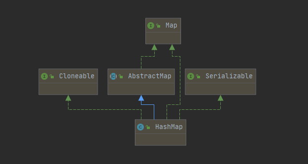
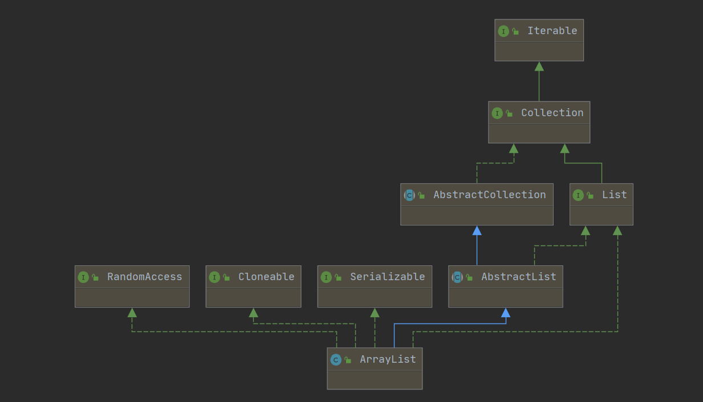
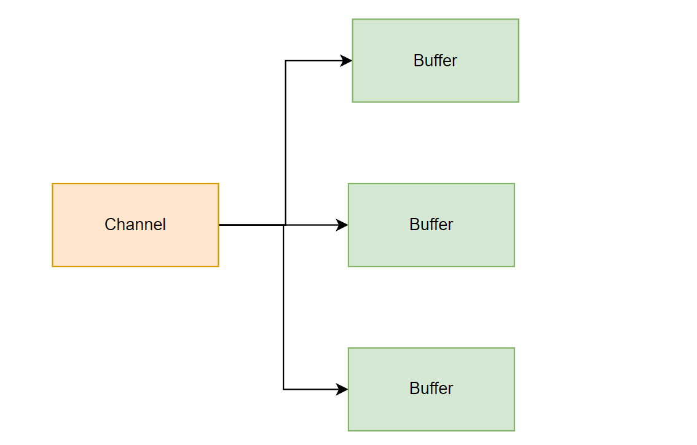
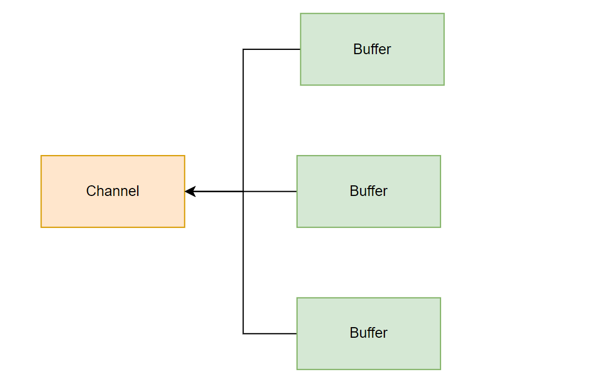
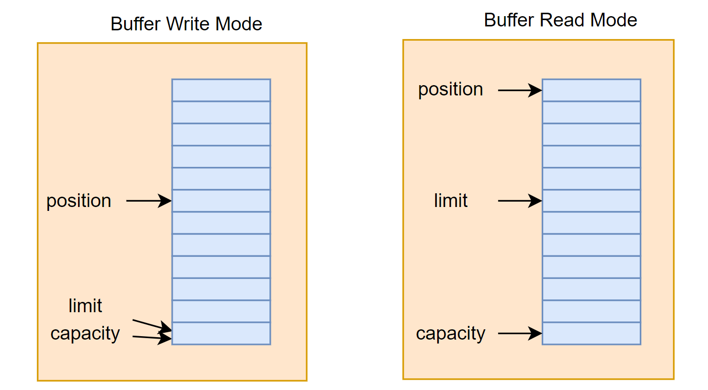
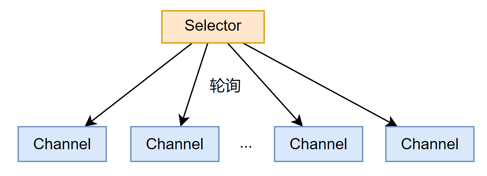
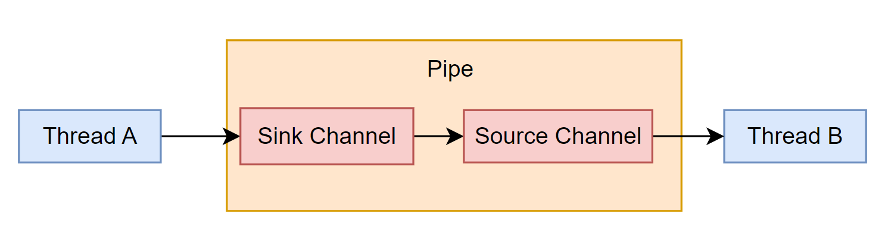

# JavaGuide

## HashMap

### 继承关系


### 常见成员变量
#### DEFAULT_INITIAL_CAPACITY
默认初始化容量
```java
/**
 * The default initial capacity - MUST be a power of two.
 */
static final int DEFAULT_INITIAL_CAPACITY = 1 << 4; // aka 16
```
##### 问题1：MUST be a power of two？
```txt
    DEFAULT_INITIAL_CAPACITY 必须是2的幂的原因是为了实现高效的哈希算法和均匀的散列分布。
    在HashMap中，当元素被插入时，会通过哈希算法计算元素的哈希值，并根据哈希值将元素放置在数组中的一个特定位置，这个位置被称为桶（bucket）。桶的数量由DEFAULT_INITIAL_CAPACITY决定。
    当桶的数量是2的幂时，可以通过位运算替代取模操作，从而实现高效的哈希算法。具体来说，计算元素的哈希值后，使用哈希值与桶的数量进行位与运算 `hash & (capacity - 1)`，可以得到桶的索引，将元素放置在对应的桶中。
    另外，桶的数量为2的幂也有利于实现均匀的散列分布。当桶的数量是2的幂时，对于一个给定的哈希值，通过哈希与运算后得到的索引值的低位与高位信息都能够得到充分利用，减少了哈希冲突的可能性，提高了散列性能。
    2的幂其实就是1后面多个0，2的幂-1就是n个1。且当容量是2的幂时，`hash & (capacity - 1)`等同于 `hash%length`
    
按位与运算，都是1的时候，结果为1，否则为0；

容量是2的幂的情况：
    hash=3, capacity=8
    3 & (8-1)
    00000011    3
    00000111    7
    -------------
    00000011    3   数组索引
   
    hash=2, capacity=8
    3 & (8-1)
    00000010    2
    00000111    7
    -------------
    00000010    2   数组索引
    
容量不是2的幂的情况：
    hash=3, capacity=9
    3 & (9-1)
    00000011    3
    00001000    8
    -------------
    00000000    0
    
    hash=2, capacity=9
    3 & (9-1)
    00000010    2
    00001000    8
    -------------
    00000000    0
```
##### 问题2：指定的初始容量不是2的幂会怎么样？
```java
/**
    返回给定目标容量的2次幂大小。
 * Returns a power of two size for the given target capacity.
 */
static final int tableSizeFor(int cap) {
    int n = cap - 1;
    n |= n >>> 1;
    n |= n >>> 2;
    n |= n >>> 4;
    n |= n >>> 8;
    n |= n >>> 16;
    return (n < 0) ? 1 : (n >= MAXIMUM_CAPACITY) ? MAXIMUM_CAPACITY : n + 1;
}

使用`int n = cap - 1`的目的是为了计算出大于等于给定容量cap的最小2的幂。
假设 cap 已经是 2 的幂了，如果没有执行`int n = cap - 1`，那么最终容量会是 cap 的两倍，如果 cap 给定16，最后容量为32，其实 16 已经是大于等于给定容量cap的最小2的幂了，没必要给32浪费空间。

| 运算，都是0的时候结果为0，否则为1.

假定`cap`=10
int n = cap - 1; > 9
n |= n >>> 1;
00000000 00000000 00000000 00001001     9
00000000 00000000 00000000 00000100     9 >>> 1     无符号右移1位
---------------------------------------------
00000000 00000000 00000000 00001101     |= 或运算  13

n = 13
n |= n >>> 2;
00000000 00000000 00000000 00001101     13
00000000 00000000 00000000 00000011     n >>> 2
---------------------------------------------
00000000 00000000 00000000 00001111     |= 或运算  15

n = 15
n |= n >>> 4;
00000000 00000000 00000000 00001111     15
00000000 00000000 00000000 00000000     n >>> 4
---------------------------------------------
00000000 00000000 00000000 00001111     |= 或运算  15
... ...

执行完或运算，左后 return (n < 0) ? 1 : (n >= MAXIMUM_CAPACITY) ? MAXIMUM_CAPACITY : n + 1;
```

#### DEFAULT_LOAD_FACTOR
```java
/**
 * The load factor used when none specified in constructor.
 */
static final float DEFAULT_LOAD_FACTOR = 0.75f;

// 0.75被认为是一个在内存消耗和性能之间平衡的合理值。它提供了较好的性能和空间利用率，使得哈希表在元素数量达到当前容量的75%时触发扩容，从而维持了较低的冲突率和较高的查询效率。
```

#### MAXIMUM_CAPACITY
```java
/**
 * The maximum capacity, used if a higher value is implicitly specified
 * by either of the constructors with arguments.
 * MUST be a power of two <= 1<<30.
 */
static final int MAXIMUM_CAPACITY = 1 << 30;
```
HashMap 集合最大容量，2的30次幂。

#### TREEIFY_THRESHOLD & UNTREEIFY_THRESHOLD & MIN_TREEIFY_CAPACITY
当链表的值超过8则会优化为红黑树（1.8新增的变量）。
```java
/**
 * The bin count threshold for using a tree rather than list for a
 * bin.  Bins are converted to trees when adding an element to a
 * bin with at least this many nodes. The value must be greater
 * than 2 and should be at least 8 to mesh with assumptions in
 * tree removal about conversion back to plain bins upon
 * shrinkage.
 */
static final int TREEIFY_THRESHOLD = 8;
// 链表长度必须大于2，并且应该至少为8。

/**
 * The bin count threshold for untreeifying a (split) bin during a
 * resize operation. Should be less than TREEIFY_THRESHOLD, and at
 * most 6 to mesh with shrinkage detection under removal.
 */
static final int UNTREEIFY_THRESHOLD = 6;
// 当某个桶（bucket）中的链表长度达到阈值（默认为8）时，会将链表转换为红黑树。而当红黑树中的节点数量减少到6以下时，会将红黑树转换回链表。

/**
 * The smallest table capacity for which bins may be treeified.
 * (Otherwise the table is resized if too many nodes in a bin.)
 * Should be at least 4 * TREEIFY_THRESHOLD to avoid conflicts
 * between resizing and treeification thresholds.
 */
static final int MIN_TREEIFY_CAPACITY = 64;
// 链表转红黑树的条件阈值，数组容量最小长度64
```
选择8是因为符合泊松分布，超过8的时候，概率已经非常小了。空间和事件的权衡。

#### table 存储元素的数组
```java
/**
 * The table, initialized on first use, and resized as
 * necessary. When allocated, length is always a power of two.
 * (We also tolerate length zero in some operations to allow
 * bootstrapping mechanics that are currently not needed.)
 */
transient Node<K,V>[] table;
```
- JDK1.7是 `Entry<K,V>[] table`，在构造函数中创建这个数组。
- JDK1.8是 `Node<K,V>[] table`，在第一次`put()`时创建这个数组。

都实现的是`Map.Entry<K,V>`接口。

#### entrySet 存放元素数组的集合
```java
/**
 * Holds cached entrySet(). Note that AbstractMap fields are used
 * for keySet() and values().
 */
transient Set<Map.Entry<K,V>> entrySet;
```
用法：
```java
for (Map.Entry<Object, Object> objectObjectEntry : map.entrySet()) {
    objectObjectEntry.getKey();
    objectObjectEntry.getValue();
}
```

#### size
```java
/**
 * The number of key-value mappings contained in this map.
 */
transient int size;
```
存放元素的个数，不是数组长度。

#### modCount 记录HashMap的修改次数
```java
/**
 * The number of times this HashMap has been structurally modified
 * Structural modifications are those that change the number of mappings in
 * the HashMap or otherwise modify its internal structure (e.g.,
 * rehash).  This field is used to make iterators on Collection-views of
 * the HashMap fail-fast.  (See ConcurrentModificationException).
 */
transient int modCount;
```
每次扩容和put都会自增。该字段用于使HashMap的集合视图上的迭代器快速失败。（ConcurrentModificationException）并发修改异常。

#### threshold 扩容临界值
```java
/**
 * The next size value at which to resize (capacity * load factor).
 *
 * @serial
 */
// (The javadoc description is true upon serialization.
// Additionally, if the table array has not been allocated, this
// field holds the initial array capacity, or zero signifying
// DEFAULT_INITIAL_CAPACITY.)
int threshold;
```
threshold = (cap * DEFAULT_LOAD_FACTOR)，当实际大小超过临界值时，会进行阔偶然那个

#### loadFactor 加载因子
```java
/**
 * The load factor for the hash table.
 *
 * @serial
 */
final float loadFactor;
```
等同于`DEFAULT_LOAD_FACTOR`。

### put()
`put()`方法实现步骤大致如下：
1. 通过 `hash` 值计算出 `key` 映射到哪个桶（数组索引）。
2. 如果桶（数组索引）没有碰撞冲突，则直接插入。
3. 如果出现碰撞冲突了，则需要处理冲突。
   1. 如果该桶（数组索引）使用红黑树处理冲突，则调用红黑树的方法插入数据。
   2. 否则采用传统的链表方式插入。如果链表的长度达到临界值，则链表转为红黑树。
4. 如果桶（数组索引）存在重复的键，则将该键替换为新值 value。
5. 如果 size 大于阈值 threshold，则进行扩容。

```java
public V put(K key, V value) {
    return putVal(hash(key), key, value, false, true);
}
```

```java
/*
参数说明：
    int hash：hash(key)，计算出来的 hash 值
    K key：要存储的 key
    V value：要存储的 value
    boolean onlyIfAbsent：为 true 表示不更改现有的值
    boolean evict：为 false 表示 table 为创建状态
*/
final V putVal(int hash, K key, V value, boolean onlyIfAbsent, boolean evict) {
    Node<K,V>[] tab; Node<K,V> p; int n, i;
    
    // 第一次put则会进入这个if判断，在 resize() 中执行数组扩容（初始化数组）。
    if ((tab = table) == null || (n = tab.length) == 0)
        n = (tab = resize()).length;
        
    /*
    数组索引处为空的情况
        通过 `hash` 值计算出 `key` 映射到哪个桶（数组索引）。(n - 1) & hash
        这里 n 表示数组长度
    */
    if ((p = tab[i = (n - 1) & hash]) == null)
        tab[i] = newNode(hash, key, value, null);
        
    // 数组索引处不为空的情况，hash 碰撞冲突
    else {
        Node<K,V> e; K k;
        
        // 数组索引处只有一个元素，不存在链表，且正好新存入的 key 和 old key hash碰撞冲突，则将old value 替换为 new value。
        if (p.hash == hash &&
            ((k = p.key) == key || (key != null && key.equals(k))))
            e = p;
            
        // 已经是红黑树的情况
        else if (p instanceof TreeNode)
            e = ((TreeNode<K,V>)p).putTreeVal(this, tab, hash, key, value);
            
        // 还没有优化为红黑树
        else {
            for (int binCount = 0; ; ++binCount) {
                if ((e = p.next) == null) {
                    
                    // 链表处理 hash 碰撞冲突
                    p.next = newNode(hash, key, value, null);
                    
                    if (binCount >= TREEIFY_THRESHOLD - 1) // -1 for 1st
                    
                        // 将链表优化为 红黑树
                        treeifyBin(tab, hash);
                    break;
                }
                
                // hash 相同、key 相同的情况
                if (e.hash == hash &&
                    ((k = e.key) == key || (key != null && key.equals(k))))
                    break;
                    
                /*
                解释 【if ((e = p.next) == null) ... p = e;】
                现有一个 HashMap，在数组索引3处，有一个链表：
                Node1.next = Node2, Node2.next = Node3 Node3.next = null 
                第一次循环的时候 p = Node1；在 (p = tab[i = (n - 1) & hash]) 的时候赋值
                    第一次 for 循环 ((e = p.next) == null)，(p.next)是Node2，将 p.next 赋值给 e，e = Node2，e 不等于 null；（p = e;）将 Node2 赋值给 p；
                    第二次 for 循环 ((e = p.next) == null)，(p.next)是Node3，将 p.next 赋值给 e，e = Node3，e 不等于 null；（p = e;）将 Node3 赋值给 p；
                    第三次 for 循环 ((e = p.next) == null)，(Node3.next)是nul，e 等于 null，在链表尾部插入新节点；
                p = e; 可以理解为是循环条件
                */
                p = e;
            }
        }
        
        // old value 替换为 new value
        if (e != null) { // existing mapping for key
            V oldValue = e.value;
            if (!onlyIfAbsent || oldValue == null)
                e.value = value;
            afterNodeAccess(e);
            return oldValue;
        }
    }
    
    // 记录HashMap的修改次数
    ++modCount;
    
    // 扩容
    if (++size > threshold)
        resize();
    afterNodeInsertion(evict);
    return null;
}
```

### treeifyBin()
```java
/**
 * Replaces all linked nodes in bin at index for given hash unless
 * table is too small, in which case resizes instead.
 */
final void treeifyBin(Node<K,V>[] tab, int hash) {
    int n, index; Node<K,V> e;
    if (tab == null || (n = tab.length) < MIN_TREEIFY_CAPACITY)
        resize();
    else if ((e = tab[index = (n - 1) & hash]) != null) {
        TreeNode<K,V> hd = null, tl = null;
        do {
            TreeNode<K,V> p = replacementTreeNode(e, null);
            if (tl == null)
                hd = p;
            else {
                p.prev = tl;
                tl.next = p;
            }
            tl = p;
        } while ((e = e.next) != null);
        if ((tab[index] = hd) != null)
            hd.treeify(tab);
    }
}
```
1. 根据哈希表中元素个数确定是扩容还是树化。
2. 如果是树化怎遍历链表，创建相同个数的树形节点，构成一个双向链表。
3. 所在数组索引的第一个元素指向新创建的树根节点，链表替换为树化。
4. `treeify()`左旋右旋调整节点为红黑树。

### resize()
```java
/**
 * Initializes or doubles table size.  If null, allocates in
 * accord with initial capacity target held in field threshold.
 * Otherwise, because we are using power-of-two expansion, the
 * elements from each bin must either stay at same index, or move
 * with a power of two offset in the new table.
 *
 * @return the table
 */
final Node<K,V>[] resize() {
    // 获取 old 数组
    Node<K,V>[] oldTab = table;
    
    // 获取 old 数组长度
    int oldCap = (oldTab == null) ? 0 : oldTab.length;
    
    // 假定这是第一次扩容，oldThr = threshold = 12
    int oldThr = threshold;
    int newCap, newThr = 0;
    
    // oldCap = 16
    if (oldCap > 0) {
        if (oldCap >= MAXIMUM_CAPACITY) {
            threshold = Integer.MAX_VALUE;
            return oldTab;
        }
        
        // oldCap << 1 == oldCap*2；newCap = 32
        else if ((newCap = oldCap << 1) < MAXIMUM_CAPACITY &&
                 oldCap >= DEFAULT_INITIAL_CAPACITY)
            
            // 第一次扩容，newThr = 24
            newThr = oldThr << 1; // double threshold
    }
    else if (oldThr > 0) // initial capacity was placed in threshold
        newCap = oldThr;
    else {               // zero initial threshold signifies using defaults
        newCap = DEFAULT_INITIAL_CAPACITY;
        newThr = (int)(DEFAULT_LOAD_FACTOR * DEFAULT_INITIAL_CAPACITY);
    }
    
    // 不是第一次扩容，则重新计算 newThr 扩容临界值
    if (newThr == 0) {
        float ft = (float)newCap * loadFactor;
        newThr = (newCap < MAXIMUM_CAPACITY && ft < (float)MAXIMUM_CAPACITY ?
                  (int)ft : Integer.MAX_VALUE);
    }
    threshold = newThr;
    @SuppressWarnings({"rawtypes","unchecked"})
    Node<K,V>[] newTab = (Node<K,V>[])new Node[newCap];
    table = newTab;
    
    // 将 old 数组依次遍历到 new 数组中
    if (oldTab != null) {
        for (int j = 0; j < oldCap; ++j) {
            Node<K,V> e;
            
            // 不等于 null，说明 old 数组索引有数据
            if ((e = oldTab[j]) != null) {
            
                // 将原数组索引处设置 null，预FULL GC
                oldTab[j] = null;
                
                // 原数组索引处只有一个元素，不是链表，直接计算新索引添加即可
                if (e.next == null)
                    newTab[e.hash & (newCap - 1)] = e;
                else if (e instanceof TreeNode)
                
                    // 如果是红黑树情况，节点拆分
                    ((TreeNode<K,V>)e).split(this, newTab, j, oldCap);
                    
                // 链表
                else { // preserve order
                    Node<K,V> loHead = null, loTail = null;
                    Node<K,V> hiHead = null, hiTail = null;
                    Node<K,V> next;
                    do {
                        
                        /*
                        假定现在是链表：Node1.next = Node2, Node2.next = Node3 Node3.next = null ，最开始的时候是 e = oldTab[j] = Node1
                            第一次循环：(next = e.next) = (next = Node1.next)，next = Node2；（假设第一次循环计算的索引是原索引）
                                第一次循环 (loTail == null) 为 true
                                    (loHead = e) = (loHead = Node1)；
                                    (loTail = e) = (loTail = Node1)；
                                    ((e = next) = (e = Node2))；循环条件
                            第二次循环：(next = e.next) = (next = Node2.next)，next = Node3；（假设第二次循环计算的索引是 原索引+原数组长度）
                                第二次循环 (hiTail == null) 为 true
                                    (hiHead = e) = (hiHead = Node2)；
                                    (hiTail = e) = (hiTail = Node2)；
                                    ((e = next) = (e = Node3))；循环条件
                            第三次循环：(next = e.next) = (next = Node3.next)，next = null；（假设第三次循环计算的索引是是原索引），loTail在第一次循环赋值中为 Node1
                                第三次循环 (loTail == null) 为 false
                                (loTail.next = e) = (loHead.next = Node3)；
                                (loTail = e) = (loTail = Node3)
                                ((e = next) = (e = null))；结束循环
                        loHead：Node1 -> Node3
                        hiHead：Node2
                        */
                        next = e.next;
                        
                        // 高位是0，放置在原索引处
                        if ((e.hash & oldCap) == 0) {
                            if (loTail == null)
                                loHead = e;
                            else
                                loTail.next = e;
                            loTail = e;
                        }
                        
                        // 高位是1，放置在(原索引 + 旧的容量)处
                        else {
                            if (hiTail == null)
                                hiHead = e;
                            else
                                hiTail.next = e;
                            hiTail = e;
                        }
                    } while ((e = next) != null);
                    
                    // 在新数组索引处挂载链表，loHead，hiHead
                    if (loTail != null) {
                        loTail.next = null;
                        newTab[j] = loHead;
                    }
                    if (hiTail != null) {
                        hiTail.next = null;
                        newTab[j + oldCap] = hiHead;
                    }
                }
            }
        }
    }
    return newTab;
}
```

### remove()
删除操作首先找到元素的位置，如果是链表旧遍历链表找到元素之后删除。如果是红黑树旧遍历红黑树找到元素之后删除，如果树小于6的时候要转链表。
```java
public V remove(Object key) {
    Node<K,V> e;
    return (e = removeNode(hash(key), key, null, false, true)) == null ?
        null : e.value;
}
```
```java
final Node<K,V> removeNode(int hash, Object key, Object value, boolean matchValue, boolean movable) {
    Node<K,V>[] tab; Node<K,V> p; int n, index;
    
    // 判断数组不为空，根据 hash 计算出数组所在的索引
    if ((tab = table) != null && (n = tab.length) > 0 && (p = tab[index = (n - 1) & hash]) != null) {
        Node<K,V> node = null, e; K k; V v;
        
        // 如果数组索引处的节点就是要删除的key，则将 node 指向该节点
        if (p.hash == hash && ((k = p.key) == key || (key != null && key.equals(k))))
            node = p;
            
        // 第一个数组索引元素不是要删除的key，需要遍历链表
        else if ((e = p.next) != null) {
            
            // 遍历红黑树
            if (p instanceof TreeNode)
                node = ((TreeNode<K,V>)p).getTreeNode(hash, key);
                
            // 遍历链表
            else {
                do {
                    if (e.hash == hash && ((k = e.key) == key || (key != null && key.equals(k)))) {
                        node = e;
                        break;
                    }
                    
                    // p 指向的是上一个节点（主要应用于 p.next = node.next; 取消挂载要删除的 key）
                    p = e;
                } while ((e = e.next) != null);
            }
        }
        if (node != null && (!matchValue || (v = node.value) == value || (value != null && value.equals(v)))) {
        
            // 红黑树情况
            if (node instanceof TreeNode)
                ((TreeNode<K,V>)node).removeTreeNode(this, tab, movable);
                
            // 数组索引处只有一个元素的情况，不存在链表，相当于 tab[index] = null
            else if (node == p)
                tab[index] = node.next;
            
            // 链表情况
            else
                p.next = node.next;
            ++modCount;
            --size;
            afterNodeRemoval(node);
            return node;
        }
    }
    return null;
}
```

### get()
```java
public V get(Object key) {
    Node<K,V> e;
    return (e = getNode(hash(key), key)) == null ? null : e.value;
}
```
```java
final Node<K,V> getNode(int hash, Object key) {
    Node<K,V>[] tab; Node<K,V> first, e; int n; K k;
    
    // 判断数组不为空，根据 hash 计算出数组所在的索引
    if ((tab = table) != null && (n = tab.length) > 0 && (first = tab[(n - 1) & hash]) != null) {
        // first.hash == hash：always check first node
        
        // 判断数组元素是否相等，总是检查第一个元素
        if (first.hash == hash && ((k = first.key) == key || (key != null && key.equals(k))))
            return first;
            
        // 如果不是第一个元素，判断是否有后续节点，链表情况
        if ((e = first.next) != null) {
        
            // 红黑树情况
            if (first instanceof TreeNode)
                return ((TreeNode<K,V>)first).getTreeNode(hash, key);
                
            // 链表情况
            do {
                if (e.hash == hash && ((k = e.key) == key || (key != null && key.equals(k))))
                    return e;
            } while ((e = e.next) != null);
        }
    }
    return null;
}
```
`get()`大致步骤：
1. 通过 hash 值获取该 key 映射到的桶（数组索引）。
2. 如果桶（数组索引）上的 key 就是要查找的 key，直接返回。
3. 桶（数组索引）上的 key 不是要找的 key，则查看后续节点。
   1. 如果后续节点是红黑树节点，调用红黑树的方法根据 key 获取 value。
   2. 如果后续节点是链表节点，则通过遍历链表根据 key 获取 value。

## ArrayList
### 继承关系


### 常见成员变量
#### DEFAULT_CAPACITY 初始容量
```java
/**
* Default initial capacity.
*/
private static final int DEFAULT_CAPACITY = 10;
```

#### EMPTY_ELEMENTDATA
指定大小的构造函数里可能使用到的空数组。
```java
/**
* Shared empty array instance used for empty instances.
*/
private static final Object[] EMPTY_ELEMENTDATA = {};
```

#### DEFAULTCAPACITY_EMPTY_ELEMENTDATA
默认构造函数的空数组。
```java
/**
* Shared empty array instance used for default sized empty instances. We
* distinguish this from EMPTY_ELEMENTDATA to know how much to inflate when
* first element is added.
*/
private static final Object[] DEFAULTCAPACITY_EMPTY_ELEMENTDATA = {};
```

#### elementData
真正存放元素的数组。
```java
/**
  * The array buffer into which the elements of the ArrayList are stored.
  * The capacity of the ArrayList is the length of this array buffer. Any
  * empty ArrayList with elementData == DEFAULTCAPACITY_EMPTY_ELEMENTDATA
  * will be expanded to DEFAULT_CAPACITY when the first element is added.
  */
transient Object[] elementData; // non-private to simplify nested class access
```

#### size
数组中包含元素的个数。
```java
/**
  * The size of the ArrayList (the number of elements it contains).
  *
  * @serial
  */
private int size;
```

#### MAX_ARRAY_SIZE 数组最大容量
```java
/**
 * The maximum size of array to allocate.
 * Some VMs reserve some header words in an array.
 * Attempts to allocate larger arrays may result in
 * OutOfMemoryError: Requested array size exceeds VM limit
 */
private static final int MAX_ARRAY_SIZE = Integer.MAX_VALUE - 8;
```

### add()
```java
/**
 * Appends the specified element to the end of this list.
 *
 * @param e element to be appended to this list
 * @return <tt>true</tt> (as specified by {@link Collection#add})
 */
public boolean add(E e) {

    // 判断添加元素后的数组长度是否需要扩容
    ensureCapacityInternal(size + 1);  // Increments modCount!!
    elementData[size++] = e;
    return true;
}

private void ensureCapacityInternal(int minCapacity) {
    ensureExplicitCapacity(calculateCapacity(elementData, minCapacity));
}

private static int calculateCapacity(Object[] elementData, int minCapacity) {
    
    // 判断是不是第一次初始化数组
    if (elementData == DEFAULTCAPACITY_EMPTY_ELEMENTDATA) {
        return Math.max(DEFAULT_CAPACITY, minCapacity);
    }
    return minCapacity;
}

// 判断扩容的方法
private void ensureExplicitCapacity(int minCapacity) {
    
    // 当前列表结构被修改的次数，扩容就会modCount++;
    modCount++;

    // overflow-conscious code
    
    // 判断当前数据量是否大于数组的长度
    if (minCapacity - elementData.length > 0)
    
        // 如果大于则进行扩容操作
        grow(minCapacity);
}
```

add(index, element)：指定索引添加的方法，和普通添加方法本质上没有区别，只是多了一个元素拷贝的过程，以及 index check 的逻辑。
```java
public void add(int index, E element) {
    rangeCheckForAdd(index);

    // 是否需要扩容，同add(element)方法一样
    ensureCapacityInternal(size + 1);  // Increments modCount!!
    
    // 拷贝数组，将下标后面的元素全部向后移动一位
    System.arraycopy(elementData, index, elementData, index + 1,
                     size - index);
    elementData[index] = element;
    size++;
}

private void rangeCheckForAdd(int index) {
    if (index > size || index < 0)
        throw new IndexOutOfBoundsException(outOfBoundsMsg(index));
}
```
`addAll(Collection<? extends E> c)`和`addAll(int index, Collection<? extends E> c)`在逻辑上和普通`add()`方法没有区别。拷贝数组移动的次数就是需要添加集合的length。

### grow()
```java
/**
 * Increases the capacity to ensure that it can hold at least the
 * number of elements specified by the minimum capacity argument.
 *
 * @param minCapacity the desired minimum capacity
 */
private void grow(int minCapacity) {
    // overflow-conscious code
    // 记录扩容前的数组长度
    int oldCapacity = elementData.length;
    
    // 将原数组的长度扩大1.5倍作为扩容后新数组的长度（若扩容器容量为 10，扩容后就是15，右移1位等同于 10/2）
    int newCapacity = oldCapacity + (oldCapacity >> 1);
    
    // 如果扩容后的长度小于当前数据量，则将当前数据量作为本次扩容的长度
    if (newCapacity - minCapacity < 0)
        newCapacity = minCapacity;
        
    // 如果新扩容长度大于可分配数组的最大容量
    if (newCapacity - MAX_ARRAY_SIZE > 0)
        
        // 如果当前数据量大于数组最大容量，则设置为Integer最大值，否则设置为当前数据量
        newCapacity = hugeCapacity(minCapacity);
    // minCapacity is usually close to size, so this is a win:
    
    // 构建一个新的数组，拷贝原数组元素
    elementData = Arrays.copyOf(elementData, newCapacity);
}

private static int hugeCapacity(int minCapacity) {
    if (minCapacity < 0) // overflow
        throw new OutOfMemoryError();
    return (minCapacity > MAX_ARRAY_SIZE) ? Integer.MAX_VALUE : MAX_ARRAY_SIZE;
}
```
### remove()
删除指定索引。
```java
public E remove(int index) {

    // 判断索引下标是否越界
    rangeCheck(index);

    modCount++;
    
    // 获取要删除的值
    E oldValue = elementData(index);

    // 计算要移动的元素数量
    int numMoved = size - index - 1;
    if (numMoved > 0)
    
        // 拷贝数组，覆盖数组数据
        System.arraycopy(elementData, index+1, elementData, index,
                         numMoved);
                         
    // 置空原尾部数据 不再强引用， 可以GC掉
    elementData[--size] = null; // clear to let GC do its work

    return oldValue;
}
```
remove(Object)删除指定对象，删除该元素在数组中第一次出现的位置上的数据。 如果有该元素返回true，如果false。
```java
public boolean remove(Object o) {
    if (o == null) {
        for (int index = 0; index < size; index++)
            if (elementData[index] == null) {
                fastRemove(index);
                return true;
            }
    } else {
        for (int index = 0; index < size; index++)
            if (o.equals(elementData[index])) {
                fastRemove(index);
                return true;
            }
    }
    return false;
}

// 不会越界 不用判断 ，也不需要取出该元素
private void fastRemove(int index) {
    modCount++;
    
    // 计算要移动的元素数量
    int numMoved = size - index - 1;
    if (numMoved > 0)
    
        // 以复制覆盖元素 完成删除
        System.arraycopy(elementData, index+1, elementData, index,
                         numMoved);
     
    // 置空 不再强引用
    elementData[--size] = null; // clear to let GC do its work
}
```

### get()
```java
public E get(int index) {
    
    // 检查索引
    rangeCheck(index);

    return elementData(index);
}

E elementData(int index) {
    return (E) elementData[index];
}
```
### set()
替换index位置的元素值，并返回该位置上的旧值。
```java
public E set(int index, E element) {
    rangeCheck(index);

    E oldValue = elementData(index);
    elementData[index] = element;
    return oldValue;
}
```

总结：
1. ArrayList内部基于动态数组实现，所以可以进行扩容操作，每一次扩容增量都是50%，即原数组的1.5倍。
2. 基于数组实现的，所以内部多个API都避免不了对数组的copy操作，比如set和remove操作，所以导致ArrayList插入和删除效率低下
3. 基于数组实现，并且实现了RandomAccess，所以可以随机访问，根据index来找到元素的值，所以ArrayList获取元素的效率很高
4. 提供了多个迭代器，都是基于内部类实现的
5. 底层源码中没有做同步处理，所以是线程不安全的，之前的版本Vector原理基本一直，但是Vector在方法的实现上都会加上synchronized关键字
6. modeCount会在适当的时候进行++操作，可以实现快速失败

## NIO
### Channel
`DatagramChannel`和`SocketChannel`实现定义读和写功能的接口，而`ServerSocketChannel`不实现。`ServerSocketChannel`负责监听传入的连接和创建新的`SocketChannel`对象，`ServerSocketChannel`本身不传输数据。

`java.nio.channels.SelectableChannel#configureBlocking`方法可以设置通道的阻塞模式，传参值为true则为阻塞模式，值为false设为非阻塞模式。
#### FileChannel 从文件中读写数据。
##### 案例
Buffer 通常的操作：
1. 将数据写入缓冲区。
2. 调用 `buffer.flip()` 反转读写模式。
3. 从换成工区读取数据。
4. 调用 `buffer.clear()` 或 `buffer.compact()` 清除缓冲区内容。

- 示例一：FileChannel 读取数据到 buffer 中，`channel.read`
```java
public class Main {

    public static void main(String[] args) throws Exception {
        // 示例：FileChannel 读取数据到 buffer 中
        fileChannelRead();
    }

    public static void fileChannelRead() throws Exception {
        StringBuilder append = new StringBuilder();
        
        // 1. 在使用`FileChannel`之前，需要通过一个`InputStream`、`OutputStream`或`RandomAccessFile`来获取一个`FileChannel`实例。
        RandomAccessFile file = new RandomAccessFile("A:\\dist\\test01.txt", "rw");
        FileChannel channel = file.getChannel();
        
        // 2. 首先分配一个 buffer，从 FileChannel 读取的数据将分配到 buffer 中
        ByteBuffer buffer = ByteBuffer.allocate(1024);
        
        // 3. FileChannel 读取数据到 buffer，返回读取的字节数，如果为 -1，则读取到文件末尾 
        int bytesRead = channel.read(buffer);
        while (bytesRead != -1) {
            buffer.flip();
            while (buffer.hasRemaining()) {
                append.append((char) buffer.get());
            }
            buffer.clear();
            bytesRead = channel.read(buffer);
        }
        file.close();

        System.out.println("------------------------------ fileChannel01 start ------------------------------");
        System.out.println(append.toString());
        System.out.println("------------------------------ fileChannel01 end --------------------------------");
    }
}
```

- 示例二：FileChannel 写数据，`channel.write`
```java
public class Main {

    public static void main(String[] args) throws Exception {
        // 示例：FileChannel 写数据
        fileChannelWrite();
    }

    public static void fileChannelWrite() throws Exception {
        RandomAccessFile file = new RandomAccessFile("A:\\dist\\test01.txt", "rw");
        FileChannel channel = file.getChannel();
        ByteBuffer buffer = ByteBuffer.allocate(1024);

        String writeData = "刘亦菲最美";
        buffer.clear();
        buffer.put(writeData.getBytes());

        buffer.flip();
        while (buffer.hasRemaining()) {
            channel.write(buffer);
        }

        file.close();
    }
}
```
##### position()
在某个特定位置进行数据的读写操作。操作不当会产生"文件空洞"。文件间隙。
```java
// 获取 FileChannel 当前位置
long pos = channel.position();

// 设置 FileChannel 当前位置
channel.position(pos + 1);
```

##### size()
返回 FileChannel 实例所关联文件的大小。返回字节数。

##### truncate()
可以使用`FileChannel#truncate()`方法截取一个文件，截取文件时，指定长度后面的部分将被删除。
```java
channel.truncate(1024);
```
截取文件的前 1024 个字节。

##### force()
`FileChannel#force()`方法将通道中尚未写入磁盘的数据强制写到磁盘上。处于性能方面的考虑，操作系统会将数据缓存在内存中，所以无法保证写入到 FileChannel 中的数据一定会即时写到磁盘上。要保证这一点，需要调用`force()`方法。

`public abstract void force(boolean metaData)`，指明是否同时将文件元数据（权限信息等）写到磁盘上。

##### transferTo() & transferFrom()
通道之间的数据传输。

如果 两个通道中有一个是 FileChannel，那么可以将数据从一个 channel 传输到另外一个 channel。

`transferFrom()`是从另一个通道拿数据到当前通道。
```java
/* 
    channelTo.transferFrom(channelFrom, 0, channelFrom.size());
    
    从另一个通道 channelFrom 拿数据到当前通道 channelTo，根据业务常见自行替换通道顺序。
*/

public class Main {

    public static void main(String[] args) throws Exception {
        fileChannelTransferFrom();
    }
    
    public static void fileChannelTransferFrom() throws Exception {
        RandomAccessFile fileFrom = new RandomAccessFile("A:\\dist\\test01.txt", "rw");
        FileChannel channelFrom = fileFrom.getChannel();

        RandomAccessFile fileTo = new RandomAccessFile("A:\\dist\\test02.txt", "rw");
        FileChannel channelTo = fileTo.getChannel();

        channelTo.transferFrom(channelFrom, 0, channelFrom.size());

        fileTo.close();
        fileFrom.close();
    }
}
```
`public abstract long transferFrom(ReadableByteChannel src, long position, long count)`，position表示从position处开始向目标写入数据，count表示最多传输的字节数。

`transferTo()`是将当前通道数据写到另一个通道。
```java
/* 
    channelFrom.transferTo(0, channelFrom.size(), channelTo);
    
    将当前通道 channelFrom 数据写到另一个通道 channelTo，根据业务常见自行替换通道顺序。
*/

public class Main {

    public static void main(String[] args) throws Exception {
        fileChannelTransferTo();
    }

    public static void fileChannelTransferTo() throws Exception {
        RandomAccessFile fileFrom = new RandomAccessFile("A:\\dist\\test01.txt", "rw");
        FileChannel channelFrom = fileFrom.getChannel();

        RandomAccessFile fileTo = new RandomAccessFile("A:\\dist\\test02.txt", "rw");
        FileChannel channelTo = fileTo.getChannel();

        channelFrom.transferTo(0, channelFrom.size(), channelTo);

        fileFrom.close();
        fileTo.close();
    }
}
```

#### DatagramChannel
通过 UDP 读写网络中的数据。

```java
DatagramChannel server = DatagramChannel.open();
server.socket().bind(new InetSocketAddress(10086));

ByteBuffer receiveBuffer = ByteBuffer.allocate(1024);
receiveBuffer.clear();

// 接受
SocketAddress receiveAddress = server.receive(receiveBuffer);
receiveBuffer.flip();

// 发送
ByteBuffer sendBuffer = ByteBuffer.wrap("刘亦菲最美".getBytes());
server.send(sendBuffer, new InetSocketAddress("127.0.0.1", 10010));
```
UDP 不存在真正意义上的连接，这里的连接是向特定服务地址 read 和 write 接受发送数据包。

read 和 write只有在`client.connect(new InetSocketAddress("127.0.0.1", 10086"))`后才能使用，否则会抛异常。

#### SocketChannel
通过 TCP 读写网络中的数据。面向缓冲区。
- 基于 TCP 连接传输。
- 实现了可选择通道，可以被多路复用。
- 主要用于处理网络 IO 的通道。

最基本的 SocketChannel 程序。
```java
// 创建方式一
SocketChannel channel1 = SocketChannel.open(new InetSocketAddress("www.baidu.com", 80));

// 创建方式二
SocketChannel channel2 = SocketChannel.open();
channel2.connect(new InetSocketAddress("www.baidu.com", 80));

channel1.configureBlocking(false);

ByteBuffer buffer = ByteBuffer.allocate(1024);
channel1.read(buffer);
channel1.close();
```

#### ServerSocketChannel
可以监听 TCP 连接，对于每一个 TCP 连接都会创建一个 SocketChannel。

示例：
```java
public class Main {

    public static void main(String[] args) throws Exception {
        serverSocketChannel();
    }
    
    public static void serverSocketChannel() throws Exception {
        ByteBuffer buffer = ByteBuffer.wrap("hello world".getBytes());

        //打开一个 ServerSocketChannel 通道
        ServerSocketChannel ssc = ServerSocketChannel.open();
        ssc.socket().bind(new InetSocketAddress(8888));
        ssc.configureBlocking(false);
        while (true) {
            System.out.println("waiting...");
            
            // 如果 ssc.configureBlocking(true)，ssc.accept() 会一致阻塞，直到有连接链接，为false是非阻塞，程序可以继续执行
            // 监听新的连接，通常不会只监听一个连接，所以放在while循环中
            SocketChannel channel = ssc.accept();
            if (channel == null) {
                Thread.sleep(2000);
            } else {
                System.out.println(channel.socket().getRemoteSocketAddress());
                // 指针
                buffer.rewind();
                channel.write(buffer);
                
                // 关闭通道
                channel.close();
            }
        }
    }
}
```

#### Scatter/Gather 分散/聚集
Scatter/Gather 用于描述从 Channel 中读取或写入到 Channel 的操作。

- Scatter（分散）：从 Channel 中读取是指在读操作时将读取的数据写入多个 buffer 中。因此 Channel 将从 Channel 中读取的数据分散到多个 Buffer 中。
- Gather（聚集）：写入 Channel 是指在写操作时将多个 buffer 的数据写入同一个 Channel。因此 Channel 将多个 Buffer 中的数据聚集后发送到 Channel。

Scatter/Gather 常用于需要将传输的数据分开处理的场景。比如传输一个由消息头和消息体组成的数据，将消息体和消息头分散到不同的 buffer 中，可以方便的处理消息头和消息体。

Scattering Reads：指将数据从一个 channel 读取到多个 buffer 中。



```java
ByteBuffer header = ByteBuffer.allocate(128);
ByteBuffer body = ByteBuffer.allocate(1024);

ByteBuffer[] buffers = {header, body};
channel.read(buffers);
```
当一个 buffer 被写满后，channel 会移动到另一个 buffer 中继续写。不适用于消息大小不固定。Scattering Reads在移动下一个 buffer 前，必须填满当前的 buffer。

Gathering Writes：指数据从多个 buffer 写入到同一个 channel。



```java
ByteBuffer header = ByteBuffer.allocate(128);
ByteBuffer body = ByteBuffer.allocate(1024);

ByteBuffer[] buffers = {header, body};
channel.write(buffers);
```
Gathering Writes 能较好的处理消息大小不固定。write 方法会按照 buffer 在数组中的顺序将数据写入到 channel。

### Buffer
使用 Buffer 读写数据，一般遵循如下四个步骤：
1. 写入数据到 Buffer。
2. 调用 flip()。
3. 从 Buffer 中读取数据。
4. 调用 clear() 或者 compact()。

通过 flip() 方法将 Buffer 从写模式切换到读模式。clear() 会清空整个缓冲区，compact() 只会清除已读数据，未读数据会被移到缓冲区的起始处。新写入的数据将放到缓冲区未读数据的后面。

#### capacity & position & limit
position 和 limit 的含义取决于 Buffer 处在读模式还是写模式，而 capacity 在任何模式下的含义都是一样的。



1. capacity
    1. 作为一个内存块，Buffer 有一个固定的大小值，也称 capacity（容量），只能往 Buffer 中写入 capacity 个 byte、ling、char 等类型数据，一旦 Buffer 满了，需要将其清空（通过读数据或者清除数据）才能继续往 Buffer 中写数据。
2. position
    1. Write：position 表示写入数据的当前位置，position 初始值为0，当一个 byte、long 等数据写到 Buffer 后，position 会移动到下一个可插入数据的 Buffer 单元。position 最大为 capacity - 1， 
    2. Read：position 表示读入数据的当前位置，比如 position=2 表示已经读取了3个byte，或从第3个byte开始读取。通过`Byffer.flip()`切换到读模式时，position 会被重置为0，当 Buffer 从 position 读取数据后，position 会移到下一个可读取的数据 Buffer 单元。
3. limit
    1. Write：limit 表示可对 Buffer 最多写入多少个数据。写模式下，limit 等于 capacity。
    2. Read：limit 表示 Buffer 中有多少可读数据（not null 的数据）。从写模式切换读模式后，执行了两个操作 `limit = position; position = 0;`。

#### Buffer 分配和写数据
获取 Buffer 对象之前需要进行分配。使用`ByteBuffer.allocate()`进行内存分配。
```java
ByteBuffer buf = ByteBuffer.allocate(1024);

CharBuffer buf = CharBuffer.allocate(1024);
```
分配一个可存储 1024 个字节的 ByteBuffer 或 CharBuffer。

写数据到 Buffer 有两种方式：
```java
int bytesRead = channel.read(buf);

buffer.put("A".getBytes());
```
`put()` 方法有多个重载方法，允许写到指定位置，或写入一个字节数组等。

`flip()` 将 Buffer 从写模式切换到读模式。调用`flip()`会将 limit 设置为 position 的指，并将 position 置为0。读模式下 position 用于标记读的位置，limit 表示切换模式前写入多少个字节，切换模式后表示能读取多少个字节。

`clear()` 从读模式切换到写模式。

#### 从 Buffer 中读取数据
```java
int bytesRead = channel.write(buf);

byte b  = buffer.get()
```
`buffer.get()`有多个重载方法，允许从指定 position 读取，或从 Buffer 中去读数据到字节数组。

#### 常用方法
##### rewind()
将 position 置为 0，可以重新读取 Buffer 中的数据，limit 保持不变，仍表示能从 Buffer 中读取多少个元素。

##### clear() & compact()
如果调用 clear()，position 置为 0，limit 设置为 capacity 的值，Buffer 被清空，但 Buffer 中的数据并未被清除，只是标记可以从哪里开始向 Buffer 中写数据。

如果调用 compact()，将所有未读的数据拷贝到 Buffer 起始处。然后将 position 设置到最后一个未读元素+1处，limit=capacity。现在 Buffer 准备号写数据了，但不会覆盖未读的数据。

```java
public final Buffer clear() {
    position = 0;
    limit = capacity;
    mark = -1;
    return this;
}
```

##### mark() & reset()
`mark()` 表示标记 Buffer 中的一个特定 position，后续可以通过 `reset()` 方法恢复到这个 position。（和Java中有点类似）
```java
buffer.mark();
...
buffer.reset();
```

#### 缓冲区操作
##### 缓冲区分片
根据现有的缓冲区对象创建子缓冲区。现有的缓冲区与子缓冲区在底层数组层面时数据共享的。调用`slice()`方法创建子缓冲区。
```java
public static void bufferSlice() {
    ByteBuffer buffer = ByteBuffer.allocate(10);
    for (int i = 0; i < 10; i++) {
        buffer.put((byte) i);
    }
    // 子缓冲区，包含 position，不包含 limit
    buffer.position(3);
    buffer.limit(7);
    
    ByteBuffer slice = buffer.slice();
    for (int i = 0; i < slice.capacity(); i++) {
        byte b = slice.get(i);
        b *= 10;
        slice.put(i, b);
    }

    buffer.position(0);
    buffer.limit(buffer.capacity());
    while (buffer.remaining() > 0) {
        System.out.println(buffer.get());
    }
}
```

##### 只读缓冲区
通过调用`buffer.asReadOnlyBuffer()`设置为只读缓冲区，将任何常规缓冲区转换为只读缓冲区。这个方法返回的缓冲区与原缓冲区共享数据。如果原缓冲区的数据发生变化，只读缓冲区的内容也会发生变化。
```java
public static void bufferOnlyRead() {
    ByteBuffer buffer = ByteBuffer.allocate(10);
    for (int i = 0; i < 10; i++) {
        buffer.put((byte) i);
    }

    ByteBuffer readOnlyBuffer = buffer.asReadOnlyBuffer();
    for (int i = 0; i < buffer.capacity(); i++) {
        byte b = buffer.get(i);
        b *= 10;
        buffer.put(i, b);
    }
    readOnlyBuffer.position(0);
    readOnlyBuffer.limit(buffer.capacity());

    while (readOnlyBuffer.remaining() > 0) {
        System.out.println(readOnlyBuffer.get());
    }
}
```
##### 直接缓冲区
将缓冲区建立在物理内存中，即在JVM内存外开辟内存，缓冲区的内容驻留在物理内存内，会少一次复制过程（在每次调用基础操作系统的一个本机IO之前或者之后，虚拟机都会避免将缓冲区的内容复制到中间缓冲区（或者从中间缓冲区复制内容）），如果需要循环使用缓冲区，用直接缓冲区可以很大地提高性能。但它使用的内存是操作系统分配的，绕过了JVM堆栈，建立和销毁比堆栈上的缓冲区要更大的开销。通过`allocateDirect()`创建直接缓冲区。

相比于非直接缓冲区，应用程序与物理磁盘之间只隔着一个物理内存缓冲区，省去了复制一份一模一样的数据的过程。
```java
// 文件复制

public static void bufferAllocateDirect() throws Exception {
    FileInputStream fin1 = new FileInputStream("A:\\dist\\test01.txt");
    FileChannel inChannel = fin1.getChannel();

    FileOutputStream fin2 = new FileOutputStream("A:\\dist\\test02.txt");
    FileChannel outChannel = fin2.getChannel();

    ByteBuffer byteBuffer = ByteBuffer.allocateDirect(1024);

    while (true) {
        byteBuffer.clear();
        int readBytes = inChannel.read(byteBuffer);
        if (readBytes == -1) {
            break;
        }
        byteBuffer.flip();
        outChannel.write(byteBuffer);
    }
}
```

##### 内存映射文件IO
内存映射文件是一种允许程序直接从内存访问的特殊文件。只有文件中实际读取或者写入的部分才会映射到内存中。

通过将整个文件或者文件的一部分映射到内存中、操作系统负责获取页面请求和写入文件，应用程序就只需要处理内存数据，这样可以实现非常快速的 IO 操作。

用于内存映射文件的内存在 Java 的堆空间以外。Java 中的 java.nio 包支持内存映射文件，可以使用 MappedByteBuffer 来读写内存。
```java
public static void bufferMap() throws Exception {
    RandomAccessFile file = new RandomAccessFile("A:\\dist\\test01.txt", "rw");
    FileChannel fileChannel = file.getChannel();
    MappedByteBuffer buffer = fileChannel.map(FileChannel.MapMode.READ_WRITE, 0, 1024);

    buffer.put(0, (byte) 97);
    buffer.put(1023, (byte) 122);

    fileChannel.close();
}
```


### Selector

Selector 一般被称为选择器，也可以称为多路复用器。用于检查一个或多个 Channel 的状态石佛偶处于可读、可写。如此可以实现单线程管理多个 channels。管理多个网络连接。

继承了`SelectableChannel`才可以被复用。

一个通道可以被注册到多个选择器上，但对每个选择器而言只能被注册一次。

使用`Channel.register(Selector sel, int ops)`将一个通道注册到一个选择器。第一个参数是指定通道要注册的选择器，第二个参数是指定选择器需要查询的通道操作（可读、可写、连接、接收）。选择器查询的不是通道的操作，是通道的某个操作的就绪状态。一旦通道具备完成某个操作的条件，表示该通道的某个操作已经就绪，就可以被 Selector 查询到，程序就可以对通道进行对应的操作。

比如，某个 SocketChannel 通道可以连接到一个服务器，则处于就绪状态（OP_CONNECT）。或者一个 ServerSocketChannel 服务器通道准备好接收新的连接，则处于接收就绪（OP_ACCEPT）。可读可写的通道就对应于读就绪（OP_READ）和写就绪（OP_WRITE）；

Channel 注册之后，使用选择器`Selector.select()`对就绪状态的查询。一旦通道有操作的就绪状态达成，并且是 Selector 感兴趣的操作，就会被 Selector 选中，放入选择键集合中（SelectionKey）。

一个选择键（SelectionKey），包含了注册在 Selector 的通道操作的类型，如`SelectionKey.OP_READ`，也包含了特定的通道与特定的选择器之间的注册关系。

NIO 的编程，就是根据对应的选择键，进行不同的业务逻辑处理。

服务端示例代码：
```java
public void server() throws Exception {
  // 获取通道
  ServerSocketChannel serverSocketChannel = ServerSocketChannel.open();
  // 设置非阻塞
  serverSocketChannel.configureBlocking(false);
  // 绑定连接
  serverSocketChannel.bind(new InetSocketAddress("127.0.0.1", 12020));

  // 创建 Selector
  Selector selector = Selector.open();
  // 将通道注册到选择器中，并监听感兴趣的操作为`接收就绪`
  serverSocketChannel.register(selector, SelectionKey.OP_ACCEPT);

  ByteBuffer readBuffer = ByteBuffer.allocate(1024);
  ByteBuffer writeBuffer = ByteBuffer.allocate(1024);

  while (true) {
      int select = selector.select();
      if (select > 0) {
          Set<SelectionKey> selectionKeys = selector.selectedKeys();
          Iterator<SelectionKey> iterator = selectionKeys.iterator();
          while (iterator.hasNext()) {
              SelectionKey selectionKey = iterator.next();

              if (selectionKey.isAcceptable()) {
                  // 获取连接
                  ServerSocketChannel channel = (ServerSocketChannel) selectionKey.channel();
                  SocketChannel socketChannel = channel.accept();
                  // 非阻塞
                  socketChannel.configureBlocking(false);
                  // 注册
                  socketChannel.register(selector, SelectionKey.OP_READ);

              } else if (selectionKey.isReadable()) {
                  // 可读事件
                  SocketChannel channel = (SocketChannel) selectionKey.channel();
                  readBuffer.clear();
                  channel.read(readBuffer);
                  readBuffer.flip();
                  System.out.println("receive: " + new String(readBuffer.array()));
                  selectionKey.interestOps(SelectionKey.OP_WRITE);

              } else if (selectionKey.isWritable()) {
                  // 可写事件
                  writeBuffer.rewind();
                  SocketChannel channel = (SocketChannel) selectionKey.channel();
                  channel.write(writeBuffer);
                  selectionKey.interestOps(SelectionKey.OP_READ);
              }
              iterator.remove();
          }
      }
  }
}
```

客户端示例代码：
```java
public void client() throws Exception {
  // 1、获取通道，绑定主机端口号
  SocketChannel socketChannel = SocketChannel.open(new InetSocketAddress("127.0.0.1", 12020));

  // 2、非阻塞模式
  socketChannel.configureBlocking(false);

  // 3、创建 buffer
  ByteBuffer buffer = ByteBuffer.allocate(1024);

  // 4、写入 buffer 数据
  buffer.put(new Date().toString().getBytes());

  // 5、flip() 模式切换
  buffer.flip();

  // 6、写入通道
  socketChannel.write(buffer);

  buffer.clear();
}
```
NIO编程大致步骤：
1. 创建`ServerSocketChannel`通道，绑定监听端口。
2. 设置通道为非阻塞模式。
3. 创建`Selector`选择器。
4. 将`Channel`注册到`Selector`选择器上，监听感兴趣的就绪状态（可读、可写、连接、接收）。
5. 调用`Selector.select()`，监听通道的就绪情况。
6. 调用`selectedKeys()`获取就绪`Channel`集合。
7. 遍历就绪`Channel`集合，判断就绪事件类型，实现具体的业务操作。
8. 根据业务，是否需要再次注册选择键，重复执行第三步。

### Pipe & FileLock
#### Pipe
管道（Pipe）是两个线程之间的单向数据连接。`Pipe`有一个`source`通道和一个`sink`通道，数据会被写到`sink`通道，从`source`通道读取。



```java
public void pipe() throws Exception {
  String newData = "send: " + System.currentTimeMillis();
  Pipe pipe = Pipe.open();
  Pipe.SinkChannel sinkChannel = pipe.sink();
  ByteBuffer sinkBuffer = ByteBuffer.allocate(50);
  sinkBuffer.clear();
  sinkBuffer.put(newData.getBytes());
  sinkBuffer.flip();
  while (sinkBuffer.hasRemaining()) {
      sinkChannel.write(sinkBuffer);
  }

  Pipe.SourceChannel sourceChannel = pipe.source();
  ByteBuffer sourceBuffer = ByteBuffer.allocate(50);
  sourceChannel.read(sourceBuffer);

  System.out.println(new String(sourceBuffer.array()));
}
```
简单方法并不常用，使用Pipe类一般都会用到选择器实现一个线程处理多组IO请求。一般就是使用选择器同时处理网络套接字IO请求与管道IO请求。

#### FileLock
文件锁，给文件加锁，同一时间，只能有一个程序修改此文件。

文件锁分类：
- 排它锁：对文件加排它锁后，当前进程可以对此文件进行读写，其他进程不能读写此文件。直到当前进行释放文件锁。
- 共享锁：其他进程也能访问此文件，但这些进程只能读不能写。

```java
public void fileLock() throws Exception {
  FileChannel fileChannel = new FileOutputStream("A:\\test.txt").getChannel();
  // 加锁
  FileLock fileLock = fileChannel.lock();
  
  // 释放锁
  fileLock.release();
}
```
1. `lock()`：排它锁。
2. `lock(long position, long size, boolean shared)`：自定义加锁方式，前两个参数指定要加锁的部分（可以只对文件的部分内容加锁），第三个参数指定是否是共享锁（true 是共享锁）。
3. `tryLock()`：排它锁。
4. `tryLock(long position, long size, boolean shared)`：自定义加锁方式，如果指定为共享锁，若某进程视图对此文件进行写操作，会抛异常。

`lock`是阻塞的，如果未获取到文件锁，会一直阻塞当前线程 ，直到获取文件锁。`tryLock`是非阻塞的，如果尝试获取不到则返回null，不会阻塞当前线程。

`isShared()`判断此文件锁是否是共享锁。`isValid()`判断此文件锁是否有效。
## BIO


## AIO


## 附录
### hash()
```java
static final int hash(Object key) {
    int h;
    return (key == null) ? 0 : (h = key.hashCode()) ^ (h >>> 16);
}
```
1. 如果 key 为 null，则哈希值是0。这与 Hashtable 是有区别的，Hashtable 不允许 null 值，没有 key == null 的判断。所以会有空指针异常。
2. 如果 key 不等于 null，计算 key 的 hashCode 值赋值给 h，然后与 h 无符号右移16位后的二进制按位异或得到最终的 hash 值。

`^`按位异或运算：数字相同，结果为0，不同为1。

`&`按位与运算：都为1时结果为1，否则为0。

### 链表插入方式
在JDK 7的HashMap实现中，采用的是头插法。当发生哈希冲突时，新的节点会插入到链表的头部。

而JDK8中，是在链表的尾部进行插入。

### 遍历 HashMap 的方式
#### 分别遍历 key 和 value
```java
for (String key: map.keySet()) {
    System.out.println(key);
}

for (String key: map.values()) {
    System.out.println(key);
}
```

#### 迭代器遍历
```java
Iterator<Map.Entry<String, String>> iterator = map.entrySet().iterator();
while (iterator.hasNext()) {
    Map.Entry<String, String> entry = iterator.next();
    System.out.println(entry.getKey() + entry.getValue());
}
```

#### JDK8 forEach lambda
```java
map.forEach((k, v)-> System.out.println(k + v););
```

### jdk7&jdk8HashMap的差别
```txt
1. 底层数据结构：
    在JDK 7中，HashMap使用数组加链表的方式来存储数据，即使用拉链法解决哈希冲突。
    在JDK 8中，当链表长度达到一定阈值（默认为8）时，会将链表转换为红黑树，以提高查找、插入和删除的性能。
2. 扩容机制：
    在 JDK 7 中，HashMap 的扩容是在数组长度达到阈值时进行的，不考虑链表长度。当进行扩容时，HashMap 会创建一个新的两倍大小的数组，并将原来数组中的元素重新插入到新数组中，重新计算它们在新数组中的位置。
    在JDK 8中，HashMap的扩容机制改进为在数组长度达到阈值并且链表长度超过一定阈值时进行扩容，且负载因子必须大于等于0.75。
3. 迭代顺序：
    在JDK 7中，HashMap的迭代顺序是不确定的，即不保证插入顺序。
    在JDK 8中，HashMap保持了插入顺序，即在迭代时按照元素插入的先后顺序进行遍历。

在创建HashMap实例时，jdk7是直接创建数组，而jdk8是将负载因子赋给当前实例，没有创建数组，在第一次调用put时才会创建数组。
新节点插入顺序：jdk7在头部插入，jdk8在尾部插入

在7中是*2，在8中是左移一位，移位效率更高
```

### jdk7&jdk8ArrayList的差别

```txt
针对于jdk7和jdk8的对比，主要是针对于构造器和add方法进行的提升。由jdk7的在构造函数中进行初始化容量，优化为jdk8在第一次add时进行初始化容量。
```

### 集合有序性
```txt
list 一定有序，set不一定有序。有序的指的就是最后集合中的元素顺序就是按照添加时候的顺序排列的
即插入的是：1，2，3，4，5；打印的也是：1，2，3，4，5；

LinkedList尽管有使用索引获取元素的方法，内部实现是从起始点开始遍历，遍历到索引的节点然后返回元素。

Set 所谓的无序就是在 HashSet 这个实现类中才会出现的这种情况

而 LinkedHashSet 已经和 List 的结果相同

TreeSet 实现的功能是根据元素的自然顺序排列
```


### NIO AsynchronousFileChannel

异步FileChannel。
### NIO Charset 字符编码

### NIO Selector 底层实现原理
#### Selector#open
```java
// java.nio.channels.Selector#open

public static Selector open() throws IOException {
  return SelectorProvider.provider().openSelector();
}
// SelectorProvider的实现类有两个：SelectorProviderImpl、WindowsSelectorProvider

public class WindowsSelectorProvider extends SelectorProviderImpl {
    public WindowsSelectorProvider() {
    }

    public AbstractSelector openSelector() throws IOException {
        return new WindowsSelectorImpl(this);
    }
}
```
1. `sun.nio.ch.WindowsSelectorImpl#WindowsSelectorImpl`
```java
/* 
   创建PollArrayWrapper对象，创建对象时会分配一块堆外虚拟内存，用来存放感兴趣事件掩码和文件描述符。
   通常是当向Selector注册Channel及感兴趣事件后，将其对应socket的文件描述符和感兴趣掩码存入pollWrapper。
*/
private PollArrayWrapper pollWrapper = new PollArrayWrapper(8);

// 创建nio管道，并保存该管道的source和sink通道的文件描述符，wakeupPipe主要用于唤醒seletor.select()所在的线程
private final Pipe wakeupPipe = Pipe.open();

WindowsSelectorImpl(SelectorProvider var1) throws IOException {
  //  创建父类 SelectorImpl
  super(var1);
  this.wakeupSourceFd = ((SelChImpl)this.wakeupPipe.source()).getFDVal();
  SinkChannelImpl var2 = (SinkChannelImpl)this.wakeupPipe.sink();
  
  /* 
      sink管道禁用Nagle算法，使算法更加即时
      禁用Nagle算法，当sink端写入1字节数据时，将立即发送，而不必等到将较小的包组合成较大的包再发送，这样source端就可以立即读取数据
  */
  var2.sc.socket().setTcpNoDelay(true);
  this.wakeupSinkFd = var2.getFDVal();
  
  /*
      将source通道的文件描述符和感兴趣读事件（Net.POLLIN）保存到pollWrapper中
      第二个参数为0，说明wakeupSourceFd时第一个被放到pollWrapper中的，后面用于唤醒selector
  */
  this.pollWrapper.addWakeupSocket(this.wakeupSourceFd, 0);
}
```
2. `sun.nio.ch.SelectorImpl#SelectorImpl`
```java
public abstract class SelectorImpl extends AbstractSelector {

    // 注册到selector中的SelectionKey
    protected Set<SelectionKey> selectedKeys = new HashSet();
    
    // 已准备就绪的SelectionKey，即可以被selector.select()获取到的SelectionKey
    protected HashSet<SelectionKey> keys = new HashSet();
    
    // 将keys包装成不可修改的set，即既不能添加也不能删除
    private Set<SelectionKey> publicKeys;
    
    // 将selectedKeys包装成只可移除不能添加的set
    private Set<SelectionKey> publicSelectedKeys;

   // 创建SelectorImpl，初始化变量
    protected SelectorImpl(SelectorProvider var1) {
        super(var1);
        if (Util.atBugLevel("1.4")) {
            this.publicKeys = this.keys;
            this.publicSelectedKeys = this.selectedKeys;
        } else {
        
            // 将Keys包装成不可修改的set
            this.publicKeys = Collections.unmodifiableSet(this.keys);
            
            // 对SelectedKeys简单封装，内部封装的方法都是间接调用selectedKeys的方法，迭代、判空等，但不能add
            this.publicSelectedKeys = Util.ungrowableSet(this.selectedKeys);
        }

    }
}
```
3. `sun.nio.ch.PollArrayWrapper#PollArrayWrapper`
```java
class PollArrayWrapper {
    // 创建AllocatedNativeObject，用于分配堆外（native）内存，底层内存空间
    private AllocatedNativeObject pollArray;
    
    // pollArray对象持有的分配的堆外虚拟内存的地址。内存空间起始位置
    long pollArrayAddress;
    
    // 文件描述id开始位置
    private static final short FD_OFFSET = 0;
    
    // 兴趣事件开始位置
    private static final short EVENT_OFFSET = 4;
    
    // 文件描述id的长度int（4）+操作事件长度4 
    static short SIZE_POLLFD = 8;
    
    // 文件描述管理器容量
    private int size;

    PollArrayWrapper(int var1) {
        // 内存大小，默认 8*8
        int var2 = var1 * SIZE_POLLFD;
        
        /*
            创建AllocatedNativeObject，该类继承NativeObject
            创建NativeObject主要利用`unsafe.allocateMemory(size + pageSize)`分配一块堆外虚拟内存
            内存大小为：allocationSize + 系统默认一页的大小
            若想释放这部分内存，需要调用`unsafe.freeMemory`或者`unsafe.reallocateMemory`
        */
        this.pollArray = new AllocatedNativeObject(var2, true);
        
        // 分配的内存地址
        this.pollArrayAddress = this.pollArray.address();
        this.size = var1;
    }
    
    /*
      创建对象时分配的内存主要用于存放文件描述符和事件掩码
      通常是当向selector注册channel及感兴趣事件时，将其对应的socket的文件描述符和感兴趣掩码调用下面两个方法将其存入pollArray
    */
    void putDescriptor(int var1, int var2) {
        this.pollArray.putInt(SIZE_POLLFD * var1 + 0, var2);
    }

    void putEventOps(int var1, int var2) {
        this.pollArray.putShort(SIZE_POLLFD * var1 + 4, (short)var2);
    }
}
```

#### channel#register()
```txt
java.nio.channels.SelectableChannel#register(java.nio.channels.Selector, int)
   ➡ java.nio.channels.spi.AbstractSelectableChannel#register
      ➡ sun.nio.ch.SelectorImpl#register
```
1. `sun.nio.ch.SelectorImpl#register`
```java
protected final SelectionKey register(AbstractSelectableChannel var1, int var2, Object var3) {
  if (!(var1 instanceof SelChImpl)) {
      throw new IllegalSelectorException();
  } else {
      
      // 创建SelectionKey，持有selector和channel信息
      SelectionKeyImpl var4 = new SelectionKeyImpl((SelChImpl)var1, this);
      
      // 设置附件
      var4.attach(var3);
      synchronized(this.publicKeys) {
          this.implRegister(var4);
      }

      // 设置感兴趣事件
      var4.interestOps(var2);
      return var4;
  }
}
```
创建selectionKey，selectionKey可以看成是channel、事件、selector的映射。

会将创建的selectionKey放入`java.nio.channels.spi.AbstractSelectableChannel#keys`数组中，提供给`selector.select()`使用。

#### Selector#select()
```java
// sun.nio.ch.SelectorImpl#select()

public int select() throws IOException {
  return this.select(0L);
}

public int select(long var1) throws IOException {
  if (var1 < 0L) {
      throw new IllegalArgumentException("Negative timeout");
  } else {
  
      // 默认timeout=-1，阻塞执行
      return this.lockAndDoSelect(var1 == 0L ? -1L : var1);
  }
}

private int lockAndDoSelect(long var1) throws IOException {
  synchronized(this) {
      
      // 确保selector时open状态，即selectorOpen变量为true，调用selector.close()会设置为false，初始值为true
      if (!this.isOpen()) {
          throw new ClosedSelectorException();
      } else {
          int var10000;
          
          // synchronized 保证只有一个线程在执行selector.selector()
          synchronized(this.publicKeys) {
              synchronized(this.publicSelectedKeys) {
              
                  // 阻塞执行select
                  var10000 = this.doSelect(var1);
              }
          }

          return var10000;
      }
  }
}
```
1. `sun.nio.ch.WindowsSelectorImpl#doSelect`
```java
/* 
class WindowsSelectorImpl extends SelectorImpl
   abstract class SelectorImpl extends AbstractSelector
      abstract class AbstractSelector extends Selector
         abstract class Selector implements Closeable
*/       

final class WindowsSelectorImpl extends SelectorImpl {
   
   // channelArray 初始容量
   private final int INIT_CAP = 8;
   
   /* 
      保存每次需要被select的selecttionkey，
      即每次select时 拉取到的注册到seletor上的selectionKey的有效selectionKey，下次select会覆盖掉上次的selectionKey
   */
   private SelectionKeyImpl[] channelArray = new SelectionKeyImpl[8];
   
   // 保存 注册到selector上的channel对应的文件描述符及感兴趣事件
   private PollArrayWrapper pollWrapper = new PollArrayWrapper(8);
   
   // 保存每次需要被select的channel数，即注册到selector上的有效channel数量，初始值为1即wakeupChannel
   private int totalChannels = 1;

   // 保存文件描述符和SelectionKey的映射关系
   private final WindowsSelectorImpl.FdMap fdMap = new WindowsSelectorImpl.FdMap();
   
   // 标识是否执行唤醒，即向wakeupSink中写入数据
   private volatile boolean interruptTriggered = false;
   
   protected int doSelect(long var1) throws IOException {
        if (this.channelArray == null) {
            throw new ClosedSelectorException();
        } else {
        
            // 保存超时时间
            this.timeout = var1;
            
            // 处理被取消的 selectionKey
            this.processDeregisterQueue();
            
            /* 
               如果是中断标志，调用本地方法resetWakeupSocket0读取wakeupSink向wakeupSource发送的数据
               并将interruptTriggered设置为false，方法直接返回，不再执行真正的poll
            */
            if (this.interruptTriggered) {
                this.resetWakeupSocket();
                return 0;
            } else {
               
                // 判断辅助线程数（守护线程），少则添加多则移除，添加的同时并start()，即SelectThread.start()
                this.adjustThreadsCount();
                
                // 重置 WindowsSelectorImpl.FinishLock 数为辅助线程数
                this.finishLock.reset();
                
                // 唤醒所有的辅助线程，所有的辅助线程开始等待分配的selectionKey有事件发生
                this.startLock.startThreads();

                try {
                    // 设置主线程中断的回调函数，从这里开始进行 poll 拉取事件，轮询各组负责的部分 pollWrapper 中的FD（文件描述符）
                    this.begin();

                    try {
                        
                        // 主线程开始 poll，阻塞等待有事件发生。poll0本地方法
                        this.subSelector.poll();
                    } catch (IOException var7) {
                        this.finishLock.setException(var7);
                    }

                    // 如果有辅助线程执行，主线程执行完，唤醒并等待所有未执行完的辅助线程完成
                    if (this.threads.size() > 0) {
                        this.finishLock.waitForHelperThreads();
                    }
                } finally {
                    this.end();
                }

                this.finishLock.checkForException();
                this.processDeregisterQueue();
                
                // 获取所有感兴趣事件发生的 SelectedKey 数量
                int var3 = this.updateSelectedKeys();
                
                // 本轮poll完成，重置 WakeupSocket
                this.resetWakeupSocket();
                return var3;
            }
        }
    }
    
   // sun.nio.ch.SelectorImpl#processDeregisterQueue
   // 处理被取消的selectionKey，调用selectionKey.cannel()时selectionkey就会被加入cancelledKeys
   void processDeregisterQueue() throws IOException {
     Set var1 = this.cancelledKeys();
     synchronized(var1) {
         if (!var1.isEmpty()) {
             Iterator var3 = var1.iterator();
   
             while(var3.hasNext()) {
                 SelectionKeyImpl var4 = (SelectionKeyImpl)var3.next();
   
                 try {
                     
                     // 用 pollArray 中最后一个 selectionKey 相关信息替换要取消的 selectionKey
                     this.implDereg(var4);
                 } catch (SocketException var11) {
                     throw new IOException("Error deregistering key", var11);
                 } finally {

                     var3.remove();
                 }
             }
         }
   
     }
   }
   
   // sun.nio.ch.WindowsSelectorImpl#implDereg
   protected void implDereg(SelectionKeyImpl var1) throws IOException {
     int var2 = var1.getIndex();
   
     assert var2 >= 0;
   
     synchronized(this.closeLock) {
     
         // 用channelArray中最后一个selectionKey覆盖取消的这个selectionKey
         if (var2 != this.totalChannels - 1) {
            
             // 覆盖 channelArray 元素
             SelectionKeyImpl var4 = this.channelArray[this.totalChannels - 1];
             this.channelArray[var2] = var4;
             var4.setIndex(var2);
             
             // 覆盖pollWrapper中保存的对应的文件描述符及感兴趣事件
             this.pollWrapper.replaceEntry(this.pollWrapper, this.totalChannels - 1, this.pollWrapper, var2);
         }
   
         var1.setIndex(-1);
     }
   
     // 已经将最后一个元素 复制了，所以最后一个元素指null，要select的selectionKey的数量-1 
     this.channelArray[this.totalChannels - 1] = null;
     --this.totalChannels;
     
     // 说明最后一个元素正好是wakeup，不要被select，所以少启动一个辅助线程
     if (this.totalChannels != 1 && this.totalChannels % 1024 == 1) {
         --this.totalChannels;
         --this.threadsCount;
     }
   
     this.fdMap.remove(var1);
     this.keys.remove(var1);
     this.selectedKeys.remove(var1);
     this.deregister(var1);
     SelectableChannel var3 = var1.channel();
     if (!var3.isOpen() && !var3.isRegistered()) {
         ((SelChImpl)var3).kill();
     }
   
   }
    
   // java.nio.channels.spi.AbstractSelector#begin
   // 在I/O执行开始时调用，设置线程Thread中断时，selector的中断处理
   protected final void begin() {
     
     // 初始化中断对象，设置线程中断时的回调：调用selecton具体实现的wakeup()方法
     if (interruptor == null) {
         interruptor = new Interruptible() {
                 public void interrupt(Thread ignore) {
                     AbstractSelector.this.wakeup();
                 }};
     }
     
     // 设置中断处理对象保存到当前线程Thread中 
     AbstractInterruptibleChannel.blockedOn(interruptor);
     Thread me = Thread.currentThread();
     
     // 若当前线程已中断，调用中断处理对象的中断处理方法处理
     if (me.isInterrupted())
         interruptor.interrupt(me);
   }
  
   protected final void end() {
     AbstractInterruptibleChannel.blockedOn(null);
   }
}
```
1. selector.select() 阻塞执行。
2. poll()拉取逻辑：调用Selector的select()方法时，会将pollWrapper的内存地址传递给内核，由内核负责轮训pollWrapper中的FD，一旦有事件就绪，将事件就绪的FD传递回用户空间，阻塞在select()的线程就会被唤醒，即每个线程轮训pollWrapper中的自己分配的FD。
3. selector相当于持有1个主线程和多个辅助线程，这些线程才是真正阻塞拉取就绪事件的。
4. wakeup()唤醒，wakeup()间接保证了只要有任意一个线程上分配的任意一个fd有就绪事件发生时，所有线程都会被唤醒，本轮select结束。

wakeup()之所以能唤醒阻塞等待就绪事件的线程之一：每个线程无论主线程或辅助线程都会持有wakeupSourceFd，这样wakeupSink发送数据后wakeupSource发生读事件，这样线程就被唤醒了。

#### wakeup()的实现原理
> https://www.cnblogs.com/yungyu16/p/13065194.html

windows环境下wakeup()的实现原理，它通过一个可写的SinkChannel和一个可读的SourceChannel组成的pipe来实现唤醒的功能，而Linux环境则使用其本身的Pipe来实现唤醒功能。无论windows还是linux，wakeup的思想是完全一致的，只不过windows没有Pipe这种信号通知的机制，所以通过TCP来实现了Pipe，建立了一对自己和自己的loopback的TCP连接来发送信号。请注意，每创建一个Selector对象，都会创建一个Pipe实例，这会导致消耗两个文件描述符FD和两个端口号，实际开发中需注意端口号和文件描述符的限制。

pollWrapper的作用是保存当前selector对象上注册的FD，当调用Selector的select()方法时，会将pollWrapper的内存地址传递给内核，由内核负责轮训pollWrapper中的FD，一旦有事件就绪，将事件就绪的FD传递回用户空间，阻塞在select()的线程就会被唤醒。将wakeupSourceFd加入pollWrapper中，表示selector也需要关注wakeupSourceFd上发生的事件。

在Unix系统中，管道被用来连接一个进程的输出和另一个进程的输入。Java使用Pipe类实现了一个管道范例，只不过它创建的管道是进程内（JVM进程内部)而非进程间使用的。Java中Pipe实现的管道仅用于在同一个Java虚拟机内部传输数据。


