# Kafka

> 官网：https://kafka.apache.org/documentation/
> 
> 学习参照尚硅谷视频

## 入门

### 定义

- Kafka 是一个分布式事件流平台，分布的基于发布/订阅模式的消息队列，主要应用于实时处理领域。

应用场景：

- 缓存/消峰、解耦、异步通信等。

- 点对点模式：消费者主动拉取消息，消费者收到消息后，会 ack 消息队列，消息队列会删除消息。

- 发布/订阅模式：不会删除消息，每个消费者相互独立。

### 生产者

#### 发送原理

在消息发送的过程中，涉及到了两个线程：main 线程和 Sender 线程。在 main 线程中创建了一个双端队列 RecordAccumulator。main 线程将消息发送给 RecordAccumulator，Sender 线程不断从 RecordAccumulator 中拉取消息发送到 Kafka Broker。

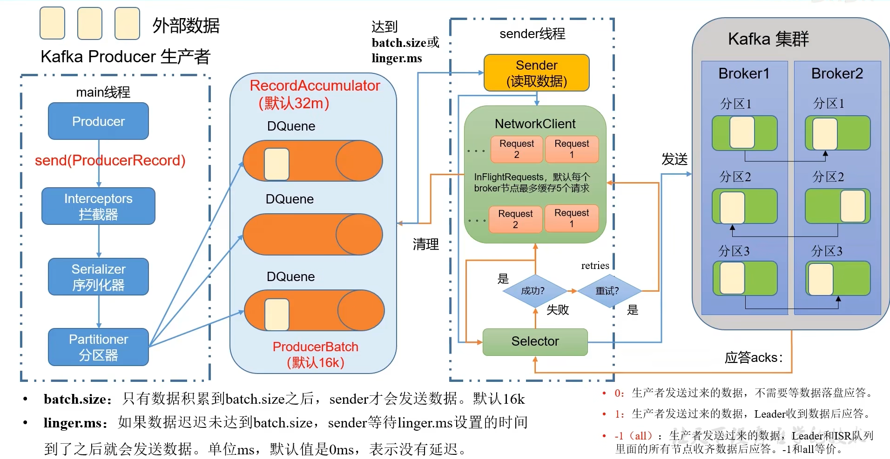

重试次数默认是 Integer 最大值。

#### 生产者重要配置参数列表

| 参数名称                                  | 描述                                                                                                                                                   |
| ------------------------------------- | ---------------------------------------------------------------------------------------------------------------------------------------------------- |
| bootstrap.servers                     | 生产者连接集群所需的 broker 地址。可以设置 1 个或者多个，中间用逗号隔开。不用指定所有的Broker地址，因为生产者可以从给定的 broker中查找到其他 broker 信息。                                                        |
| key.serializer 和 value.serializer     | 指定发送消息的 key 和 value 的序列化类型。一定要写全类名。                                                                                                                  |
| buffer.memory                         | RecordAccumulator 缓冲区总大小，默认 32m。                                                                                                                     |
| batch.size                            | 缓冲区一批数据最大值，默认 16k。适当增加该值，可以提高吞吐量，但是如果该值设置太大，会导致数据传输延迟增加。                                                                                             |
| linger.ms                             | 如果数据迟迟未达到 batch.size，sender 等待 linger.time 之后就会发送数据。单位 ms，默认值是 0ms，表示没有延迟。生产环境建议该值大小为 5-100ms 之间。                                                    |
| acks                                  | 0：生产者发送过来的数据，不需要等数据落盘应答。<br/>1：生产者发送过来的数据，Leader 收到数据后应答。<br/>-1（all）：生产者发送过来的数据，Leader和 isr 队列里面的所有节点收齐数据后应答。默认值是-1，-1 和all 是等价的。                   |
| max.in.flight.requests.per.connection | 允许最多没有返回 ack 的次数，默认为 5，开启幂等性时要保证该值是 1-5 的数字。                                                                                                         |
| retries                               | 当消息发送出现错误的时候，系统会重发消息。retries表示重试次数。默认是 int 最大值，2147483647。如果设置了重试，还想保证消息的有序性，需要设置MAX_IN_FLIGHT_REQUESTS_PER_CONNECTION=1 否则在重试此失败消息的时候，其他的消息可能发送成功了。 |
| retry.backoff.ms                      | 两次重试之间的时间间隔，默认是 100ms。                                                                                                                               |
| enable.idempotence                    | 是否开启幂等性，默认 true，开启幂等性。                                                                                                                               |
| compression.type                      | 生产者发送的所有数据的压缩方式。默认是 none，也就是不压缩。支持压缩类型：none、gzip、snappy、lz4 和 zstd。                                                                                  |

#### 分区

Kafka可以将主题划分为多个分区（Partition），会根据分区规则选择把消息存储到哪个分区中，只要 如果分区规则设置的合理，那么所有的消息将会被均匀的分布到不同的分区中，这样就实现了负载均衡 和水平扩展。另外，多个订阅者可以从一个或者多个分区中同时消费数据，以支撑海量数据处理能力。

分区写入策略：所谓分区写入策略，即是生产者将数据写入到kafka主题后，kafka如何将数据分配到不同分区中的策略。

常见的有三种策略，轮询策略，随机策略，和按键hash取模保存策略。其中轮询策略是默认的分区策略。

##### 自定义分区器

1. 自定义类实现 `Partitioner` 接口。

2. 重写 `Partitioner` 接口方法，重点是 `partition()` 方法。

3. 修改默认分区器为自定义类。

```java
Properties properties = new Properties();
properties.put(ProducerConfig.PARTITIONER_CLASS_CONFIG, MyPartitioner.class.getName());
KafkaProducer<String, String> producer = new KafkaProducer<>(properties);
```

#### 提高生产者吞吐量

以下配置根据实际业务场景灵活调整。

* `batch.size`：批量发送，默认16k。（等待达到16k再发送，）

* `linger.ms`：等待时间，默认0ms。（修改为 5~100 ms）。

* `compression.type`：压缩类型为 snappy。

* `buffer.memory`：缓冲区大小，默认 32m（修改为 64m）

#### 数据可靠性

数据完全可靠条件：ACK级别设置为 -1，分区副本大于等于2，ISR应答的最小副本数量大于等于2。

- 分区副本大于等于2：除了有一个Leader之外，至少还要有一个Follower副本。

ISR应答最小父辈梳理默认为1（`min.insync.replicas`）

如果分区父辈 设置为1，或者ISR应答副本为1，和ACK=1的效果是一样的，仍有丢数据的风险。

##### ACK

- 0：生产者发送过来的数据，不需要等待数据落盘应答。

- 1：生产者发送过来的数据，Leader收到数据后应答。

- -1（all）：生产者发送过来的数据，Leader和ISR队列中的所有节点收到数据后应答。

> ISR：所有与Leader副本保持一定同步程度的Follower Replica，包括Leader副本在内，组成ISR。即和Leader保持同步的Follower+Leader集合。

#### 数据去重

##### 幂等性

对于一些非常重要的数据，要求数据既不能重复也不能丢失。在Kafka 0.11版本以后，引入了一项重大特性：幂等性和事务。

幂等性：指Producer不论向Broker发送多少次重复数据，Broker都只会持久化一份，保证了不重复。

精确一次：幂等性 + ack=-1 + 分区副本数 >=2 + ISR最小副本数 >=2。

重复数据的判断标准：具有`<PID, Partition, SeqNumber>`相同主键的消息提交时，Broker只会持久化一条。其中PID是kafka每次重启都会分配新的；Partition表示分区号；Sequence Number序列号是单调自增的。

所以幂等性只能保证在单分区但会话内不重复。

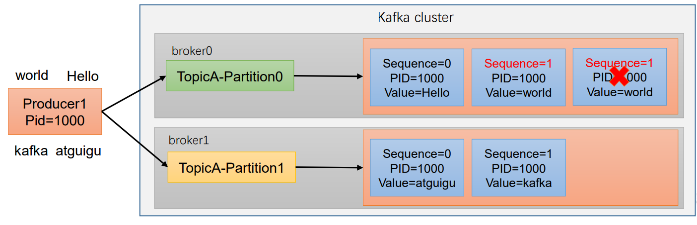

开启幂等性参数 `enable.idempotence` 默认为 true，false 关闭。

##### 事务

开启事务，必须开启幂等性。

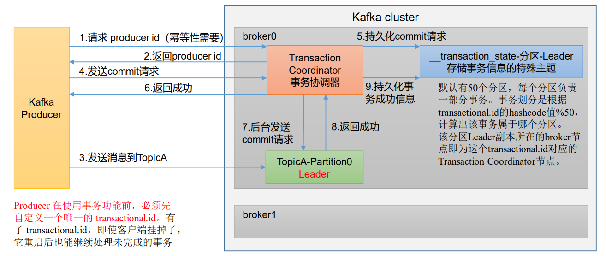

Kafka 事务API：

```java
// 1 初始化事务
void initTransactions();
// 2 开启事务
void beginTransaction() throws ProducerFencedException;
// 3 在事务内提交已经消费的偏移量（主要用于消费者）
void sendOffsetsToTransaction(Map<TopicPartition, OffsetAndMetadata> offsets, String consumerGroupId) throws ProducerFencedException;
// 4 提交事务
void commitTransaction() throws ProducerFencedException;
// 5 放弃事务（类似于回滚事务的操作）
void abortTransaction() throws ProducerFencedException;
```

测试：一个Producer，使用事务保证消息的仅一次发送

```java
public class CustomProducerTransactions {

  public static void main(String[] args) throws InterruptedException {
    // 1. 创建 kafka 生产者的配置对象
    Properties properties = new Properties();
    // 2. 给 kafka 配置对象添加配置信息
    properties.put(ProducerConfig.BOOTSTRAP_SERVERS_CONFIG, "localhost:9092");

    // key,value 序列化
    properties.put(ProducerConfig.KEY_SERIALIZER_CLASS_CONFIG, StringSerializer.class.getName());
    properties.put(ProducerConfig.VALUE_SERIALIZER_CLASS_CONFIG, StringSerializer.class.getName());

    // 设置事务 id（必须），事务 id 任意起名
    properties.put(ProducerConfig.TRANSACTIONAL_ID_CONFIG, "transaction_id_0");

    // 3. 创建 kafka 生产者对象
    KafkaProducer<String, String> kafkaProducer = new KafkaProducer<String, String>(properties);
    // 初始化事务
    kafkaProducer.initTransactions();
    // 开启事务
    kafkaProducer.beginTransaction();
    try {
      // 4. 调用 send 方法,发送消息
      for (int i = 0; i < 5; i++) {
        // 发送消息
        kafkaProducer.send(new ProducerRecord<>("first", "atguigu " + i));
      }
      // int i = 1 / 0;
      // 提交事务
      kafkaProducer.commitTransaction();
    } catch (Exception e) {
      // 终止事务
      kafkaProducer.abortTransaction();
    } finally {
      // 5. 关闭资源
      kafkaProducer.close();
    }
  }
}
```

#### 数据有序

单分区内有序。多分区无序，分区与分区之间无序。

#### 数据乱序

1. kafka在1.x版本之前保证数据单分区有序，条件如下：
- max.in.flight.requests.per.connection=1（不需要考虑是否开启幂等性）。只能缓存一个request。
2. kafka在1.x及以后版本保证数据单分区有序，条件如下：
- 未开启幂等性：max.in.flight.requests.per.connection需要设置为1。

- 开启幂等性：max.in.flight.requests.per.connection需要设置小于等于5。

开启幂等性参数 `enable.idempotence` 默认为 true，false 关闭。

原因说明：因为在kafka1.x以后，启用幂等后，kafka服务端会缓存producer发来的最近5个request的元数据，

故无论如何，都可以保证最近5个request的数据都是有序的。

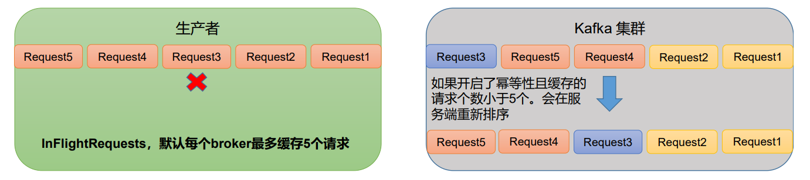

### Broker

#### Broker 工作流程

##### 存储哪些数据

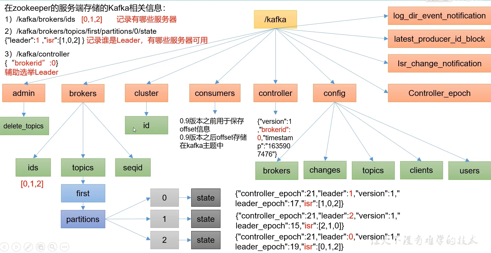

##### 工作原理流程

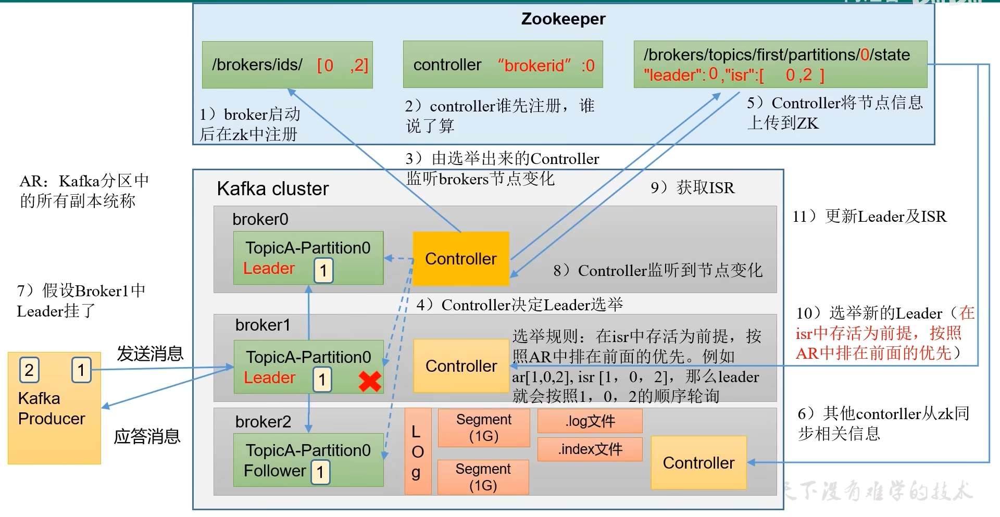

##### Broker重要配置参数列表

| 参数                                      | 描述                                                                           |
| --------------------------------------- | ---------------------------------------------------------------------------- |
| replica.lag.time.max.ms                 | ISR 中，如果 Follower 长时间未向 Leader 发送通信请求或同步数据，则该 Follower 将被踢出 ISR。该时间阈值默认 30s。 |
| auto.leader.rebalance.enable            | 默认是 true。 自动 Leader Partition 平衡。                                            |
| leader.imbalance.per.broker.percentage  | 默认是 10%。每个 broker 允许的不平衡的 leader的比率。如果每个 broker 超过了这个值，控制器会触发 leader 的平衡。    |
| leader.imbalance.check.interval.seconds | 默认值 300 秒。检查 leader 负载是否平衡的间隔时间                                              |
| log.segment.bytes                       | Kafka 中 log 日志是分成一块块存储的，此配置是指 log 日志划分 成块的大小，默认值 1G。                         |
| log.index.interval.bytes                | 默认 4kb，kafka 里面每当写入了 4kb 大小的日志（.log），然后就往 index 文件里面记录一个索引。                  |
| log.retention.hours                     | Kafka 中数据保存的时间，默认 7 天。                                                       |
| log.retention.minutes                   | Kafka 中数据保存的时间，分钟级别，默认关闭。                                                    |
| log.retention.ms                        | Kafka 中数据保存的时间，毫秒级别，默认关闭。                                                    |
| log.retention.check.interval.ms         | 检查数据是否保存超时的间隔，默认是 5 分钟。                                                      |
| log.retention.bytes                     | 默认等于-1，表示无穷大。超过设置的所有日志总大小，删除最早的 segment。                                     |
| log.cleanup.policy                      | 默认是 delete，表示所有数据启用删除策略；如果设置值为 compact，表示所有数据启用压缩策略。                         |
| num.io.threads                          | 默认是 8。负责写磁盘的线程数。                                                             |
| num.replica.fetchers                    | 副本拉取线程数，这个参数占总核数的 50%的 1/3                                                   |
| num.network.threads                     | 默认是 3。数据传输线程数，这个参数占总核数的50%的 2/3 。                                            |
| log.flush.interval.messages             | 强制页缓存刷写到磁盘的条数，默认是 long 的最大值，9223372036854775807。一般不建议修改，交给系统自己管理。            |
| log.flush.interval.ms                   | 每隔多久，刷数据到磁盘，默认是 null。一般不建议修改，交给系统自己管理。                                       |

#### 节点服役和退役

> https://kafka.apache.org/documentation/#basic_ops_cluster_expansion

##### 扩展节点-执行负载均衡操作

扩展启动一个kafka服务。`bin/kafka-server-start.sh -daemon ./config/server.properties`

1. 创建一个要均衡的主题。

```shell
[root@server7 kafka]$ vim topics-to-move.json

{
  "topics": [
    {"topic": "first"}
  ],
  "version": 1
}
```

2. 生成一个负载均衡的计划

```shell
[root@server7 kafka]$ bin/kafka-reassign-partitions.sh --bootstrap-server localhost:9092 --topics-to-move-json-file topics-to-move.json --broker-list "0,1,2,3" --generate

Current partition replica assignment

{"version":1,
"partitions":[{"topic":"first","partition":0,"replicas":[0,2,1],"log_dirs":["any","any","any"]},
              {"topic":"first","partition":1,"replicas":[2,1,0],"log_dirs":["any","any","any"]},
              {"topic":"first","partition":2,"replicas":[1,0,2],"log_dirs":["any","any","any"]}]
}

Proposed partition reassignment configuration

{"version":1,
"partitions":[{"topic":"first","partition":0,"replicas":[2,3,0],"log_dirs":["any","any","any"]},
              {"topic":"first","partition":1,"replicas":[3,0,1],"log_dirs":["any","any","any"]},
              {"topic":"first","partition":2,"replicas":[0,1,2],"log_dirs":["any","any","any"]}]
}
```

3. 创建副本存储计划（所有副本存储在 broker0、broker1、broker2、broker3 中）。

```shell
[root@server7 kafka]$ vim increase-replication-factor.json

{"version":1,
"partitions":[{"topic":"first","partition":0,"replicas":[2,3,0],"log_dirs":["any","any","any"]},
              {"topic":"first","partition":1,"replicas":[3,0,1],"log_dirs":["any","any","any"]},
              {"topic":"first","partition":2,"replicas":[0,1,2],"log_dirs":["any","any","any"]}]
}
```

4. 执行副本存储计划

```shell
[root@server7 kafka]$ bin/kafka-reassign-partitions.sh --bootstrap-server localhost:9092 --reassignment-json-file increase-replication-factor.json --execute
```

5. 验证副本存储计划

```shell
[root@server7 kafka]$ bin/kafka-reassign-partitions.sh --bootstrap-server localhost:9092 --reassignment-json-file increase-replication-factor.json --verify

Status of partition reassignment:
Reassignment of partition first-0 is complete.
Reassignment of partition first-1 is complete.
Reassignment of partition first-2 is complete.

Clearing broker-level throttles on brokers 0,1,2,3
Clearing topic-level throttles on topic first
```

##### 退役节点-执行负载均衡操作

先按照退役一台节点，生成执行计划，然后按照服役时操作流程执行负载均衡。

1. 创建一个要均衡的主题。

```shell
[root@server7 kafka]$ vim topics-to-move.json
{
  "topics": [
    {"topic": "first"}
  ],
  "version": 1
}
```

2. 创建执行计划。

```shell
[root@server7 kafka]$ bin/kafka-reassign-partitions.sh --bootstrap-server localhost:9092 --topics-to-move-json-file topics-to-move.json --broker-list "0,1,2" --generate

Current partition replica assignment

{"version":1,
"partitions":[{"topic":"first","partition":0,"replicas":[2,0,1],"log_dirs":["any","any","any"]},
              {"topic":"first","partition":1,"replicas":[3,1,2],"log_dirs":["any","any","any"]},
              {"topic":"first","partition":2,"replicas":[0,2,3],"log_dirs":["any","any","any"]}]
}

Proposed partition reassignment configuration

{"version":1,
"partitions":[{"topic":"first","partition":0,"replicas":[2,0,1],"log_dirs":["any","any","any"]},
              {"topic":"first","partition":1,"replicas":[0,1,2],"log_dirs":["any","any","any"]},
              {"topic":"first","partition":2,"replicas":[1,2,0],"log_dirs":["any","any","any"]}]
}
```

3. 创建副本存储计划（所有副本存储在 broker0、broker1、broker2 中）。

```shell
[root@server7 kafka]$ vim increase-replication-factor.json
{"version":1,
"partitions":[{"topic":"first","partition":0,"replicas":[2,0,1],"log_dirs":["any","any","any"]},
              {"topic":"first","partition":1,"replicas":[0,1,2],"log_dirs":["any","any","any"]},
              {"topic":"first","partition":2,"replicas":[1,2,0],"log_dirs":["any","any","any"]}]
}
```

4. 执行副本存储计划。

```shell
[root@server7 kafka]$ bin/kafka-reassign-partitions.sh --bootstrap-server localhost:9092 --reassignment-json-file increase-replication-factor.json --execute
```

5. 验证副本存储计划。

```shell
[root@server7 kafka]$ bin/kafka-reassign-partitions.sh --bootstrap-server localhost:9092 --reassignment-json-file increase-replication-factor.json --verify

Status of partition reassignment:
Reassignment of partition first-0 is complete.
Reassignment of partition first-1 is complete.
Reassignment of partition first-2 is complete.

Clearing broker-level throttles on brokers 0,1,2,3
Clearing topic-level throttles on topic first
```

在需要停掉kafka服务的机器上执行`kafka-server-stop.sh`。

#### 副本

##### 副本基本信息

1. Kafka 副本作用：提高数据可靠性。

2. Kafka 默认副本 1 个，生产环境一般配置为 2 个，保证数据可靠性；太多副本会增加磁盘存储空间，增加网络上数据传输，降低效率。

3. Kafka 中副本分为：Leader 和 Follower。Kafka 生产者只会把数据发往 Leader，然后 Follower 找 Leader 进行同步数据。

4. Kafka 分区中的所有副本统称为 AR（Assigned Replicas）。

AR = ISR + OSR：

- ISR（In Sync Replicas）：表示和 Leader 保持同步的 Follower 集合。如果 Follower 长时间未向 Leader 发送通信请求或同步数据，则该 Follower 将被踢出 ISR。该时间阈值由 replica.lag.time.max.ms 参数设定，默认 30s。Leader 发生故障之后，就会从 ISR 中选举新的 Leader。

- OSR（Out-of-Sync Replied）：表示 Follower 与 Leader 副本同步时，延迟过多的副本。

##### Leader 选举流程

Kafka 集群中有一个 broker 的 Controller 会被选举为 Controller Leader，负责管理集群 broker 的上下线、所有 topic 的分区副本分配和 Leader 选举等工作。

Controller 的信息同步工作是依赖于 Zookeeper 的。


##### Leader 和 Follower 故障处理细节

- LEO（Log End Offset）：每个副本的最后一个offset，LEO其实就是最新的offset + 1。

- HW（High Watermark）：所有副本中最小的LEO 。

- Follower故障处理细节

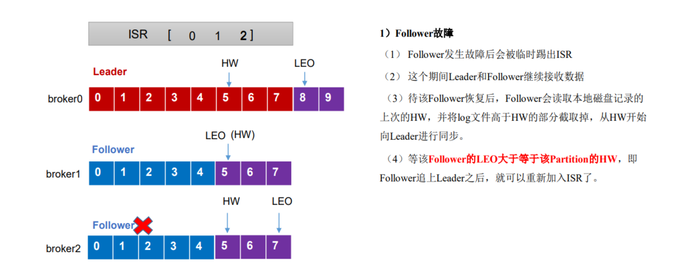

- Leader故障处理细节

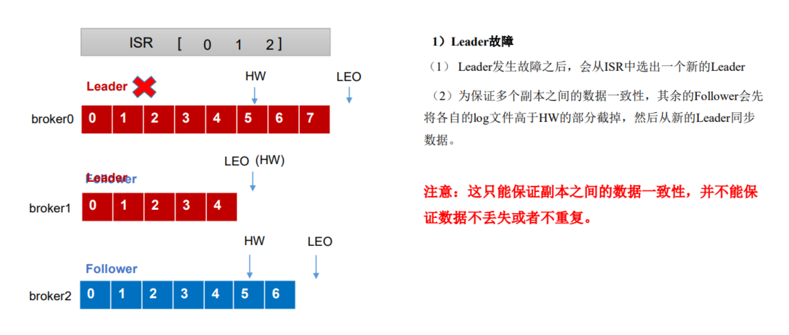

##### 分区副本分配

如果 kafka 服务器只有 4 个节点，那么设置 kafka 的分区数大于服务器台数，在 kafka 底层如何分配存储副本呢？

1. 创建一个新的 topic，名称为 second。16 分区，3 个副本

```shell
[root@server7 kafka]$ bin/kafka-topics.sh --bootstrap-server localhost:9092 --create --partitions 16 --replication-factor 3 --topic second
```

2. 查看分区和副本情况。

```shell
[root@server7 kafka]$ bin/kafka-topics.sh --bootstrap-server localhost:9092 --describe --topic second
Topic: second4 Partition: 0 Leader: 0 Replicas: 0,1,2 Isr: 0,1,2
Topic: second4 Partition: 1 Leader: 1 Replicas: 1,2,3 Isr: 1,2,3
Topic: second4 Partition: 2 Leader: 2 Replicas: 2,3,0 Isr: 2,3,0
Topic: second4 Partition: 3 Leader: 3 Replicas: 3,0,1 Isr: 3,0,1

Topic: second4 Partition: 4 Leader: 0 Replicas: 0,2,3 Isr: 0,2,3
Topic: second4 Partition: 5 Leader: 1 Replicas: 1,3,0 Isr: 1,3,0
Topic: second4 Partition: 6 Leader: 2 Replicas: 2,0,1 Isr: 2,0,1
Topic: second4 Partition: 7 Leader: 3 Replicas: 3,1,2 Isr: 3,1,2

Topic: second4 Partition: 8 Leader: 0 Replicas: 0,3,1 Isr: 0,3,1
Topic: second4 Partition: 9 Leader: 1 Replicas: 1,0,2 Isr: 1,0,2
Topic: second4 Partition: 10 Leader: 2 Replicas: 2,1,3 Isr: 2,1,3
Topic: second4 Partition: 11 Leader: 3 Replicas: 3,2,0 Isr: 3,2,0

Topic: second4 Partition: 12 Leader: 0 Replicas: 0,1,2 Isr: 0,1,2
Topic: second4 Partition: 13 Leader: 1 Replicas: 1,2,3 Isr: 1,2,3
Topic: second4 Partition: 14 Leader: 2 Replicas: 2,3,0 Isr: 2,3,0
Topic: second4 Partition: 15 Leader: 3 Replicas: 3,0,1 Isr: 3,0,1
```

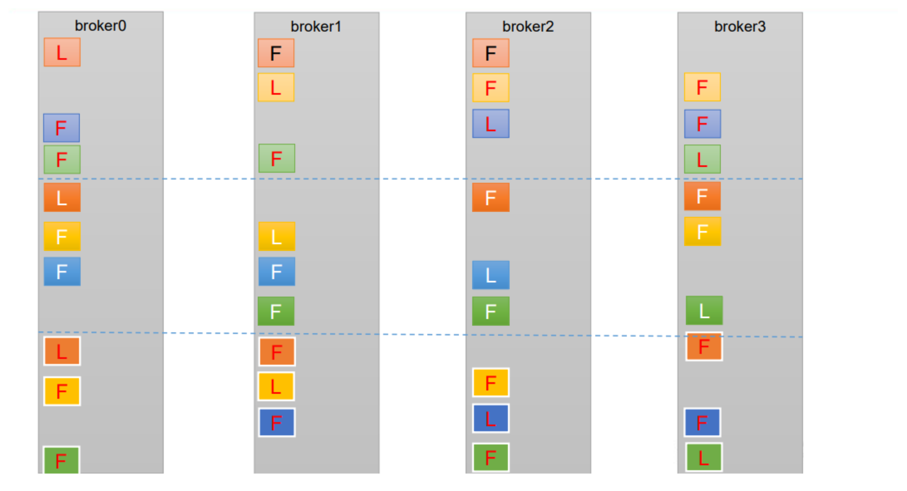

##### 手动调整分区副本存储

在生产环境中，每台服务器的配置和性能不一致，但是Kafka只会根据自己的代码规则创建对应的分区副本，就会导致个别服务器存储压力较大。所有需要手动调整分区副本的存储。

需求：创建一个新的topic，4个分区，两个副本，名称为three。将 该topic的所有副本都存储到broker0和broker1两台服务器上。

手动调整分区副本存储的步骤如下：

1. 创建一个新的 topic，名称为 three。

```shell
[root@server7 kafka]$ bin/kafka-topics.sh --bootstrap-server localhost:9092 --create --partitions 4 --replication-factor 2 --topic three
```

2. 查看分区副本存储情况。

```shell
[root@server7 kafka]$ bin/kafka-topics.sh --bootstrap-server localhost:9092 --describe --topic three
```

3. 创建副本存储计划（所有副本都指定存储在 broker0、broker1 中）。

```shell
[root@server7 kafka]$ bin/kafka-reassign-partitions.sh --bootstrap-server localhost:9092 --topics-to-move-json-file topics-to-move.json --broker-list "0,1" --generate
  Current partition replica assignment
  ...
  Proposed partition reassignment configuration
  ...

[root@server7 kafka]$ vim increase-replication-factor.json
# 填入 Proposed partition reassignment configuration 中的内容
{
  "version":1,
  "partitions":[{"topic":"three","partition":0,"replicas":[0,1]},
                {"topic":"three","partition":1,"replicas":[0,1]},
                {"topic":"three","partition":2,"replicas":[1,0]},
                {"topic":"three","partition":3,"replicas":[1,0]}]
}
```

4. 执行副本存储计划。

```shell
[root@server7 kafka]$ bin/kafka-reassign-partitions.sh --bootstrap-server localhost:9092 --reassignment-json-file increase-replication-factor.json --execute
```

5. 验证副本存储计划。

```shell
[root@server7 kafka]$ bin/kafka-reassign-partitions.sh --bootstrap-server localhost:9092 --reassignment-json-file increase-replication-factor.json --verify
```

6. 查看分区副本存储情况。

```shell
[root@server7 kafka]$ bin/kafka-topics.sh --bootstrap-server localhost:9092 --describe --topic three
```

##### Leader Partition 负载平衡

正常情况下，Kafka本身会自动把Leader Partition均匀分散在各个机器上，来保证每台机器的读写吞吐量都是均匀的。但是如果某些broker宕机，会导致Leader Partition过于集中在其他少部分几台broker上，这会导致少数几台broker的读写请求压力过高，其他宕机的broker重启之后都是follower partition，读写请求很低，造成集群负载不均衡。


Replicas中排名最靠前的就是Leader。Replicas会分布在不同的Broker中。

broker2和broker3节点和broker0不平衡率一样，需要再平衡。而Broker1的不平衡数为0，不需要再平衡。

| 参数名称                                    | 描述                                                                                |
| --------------------------------------- | --------------------------------------------------------------------------------- |
| auto.leader.rebalance.enable            | 默认是 true。 自动 Leader Partition 平衡。生产环境中，leader 重选举的代价比较大，可能会带来性能影响，建议设置为 false 关闭。 |
| leader.imbalance.per.broker.percentage  | 默认是 10%。每个 broker 允许的不平衡的 leader的比率。如果每个 broker 超过了这个值，控制器会触发 leader 的平衡。         |
| leader.imbalance.check.interval.seconds | 默认值 300 秒。检查 leader 负载是否平衡的间隔时间。                                                  |

##### 增加副本因子

在生产环境当中，由于某个主题的重要等级需要提升，我们考虑增加副本。副本数的增加需要先制定计划，然后根据计划执行。

先准备一个主题。

```shell
[root@server7 kafka]$ bin/kafka-topics.sh --bootstrap-server localhost:9092 --create --partitions 3 --replication-factor 1 --topic four
```

1. 手动增加副本存储
   
   - 创建副本存储计划（所有副本都指定存储在 broker0、broker1、broker2 中）。
   
   ```shell
   [root@server7 kafka]$ vim increase-replication-factor.json
   
   {
    "version":1,
    "partitions":[{"topic":"four","partition":0,"replicas":[0,1,2]},
                  {"topic":"four","partition":1,"replicas":[0,1,2]},
                  {"topic":"four","partition":2,"replicas":[0,1,2]}]
   }
   ```
   
   - 执行副本存储计划。
   
   ```shell
   [root@server7 kafka]$ bin/kafka-reassign-partitions.sh --bootstrap-server localhost:9092 --reassignment-json-file increase-replication-factor.json --execute
   ```

#### 文件存储

##### 文件存储机制

Topic是逻辑上的概念，而partition是物理上的概念，每个partition对应于一个log文件，该log文件中存储的就是Producer生产的数据。Producer生产的数据会被不断追加到该log文件末端，为防止log文件过大导致数据定位效率低下，Kafka采取了分片和索引机制，将每个partition分为多个segment。每个segment包括：`.index`文件、`.log`文件和`.timeindex`等文件。这些文件位于一个文件夹下，该文件夹的命名规则为：topic名称+分区序号，例如：first-0。

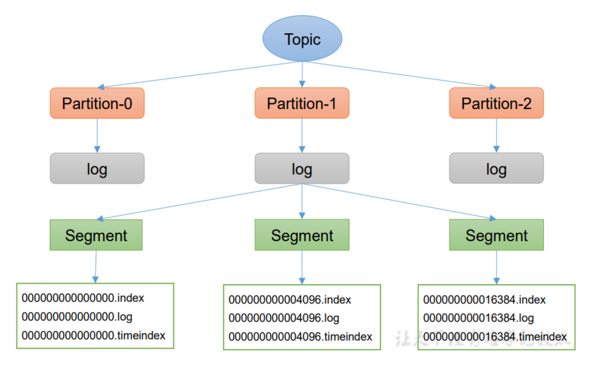

一个Topic（主题）被分为多个Partition（分区）。一个Partition被分为多个Segment。

- `.log`：日志文件。

- `.index`：偏移量索引文件。

- `.timeindex`：时间戳索引文件。

- 其它文件

index和log文件以当前segment的第一条消息的offset命名。

每一个Segment容量是1G。

###### Topic数据存储在什么位置？

1. 启动生产者并发送消息。

```shell
[root@server7 kafka]$ bin/kafka-console-producer.sh --bootstrap-server localhost:9092 --topic first
>hello world
```

2. 查看集群中任意一台服务器上的`的/opt/module/kafka/datas/first-1`（first=0、first-2）路径中的文件。

```shell
[root@server7 first-1]$ ls
00000000000000000000.index
00000000000000000000.log
00000000000000000000.snapshot
00000000000000000000.timeindex
leader-epoch-checkpoint
partition.metadata
```

3. 直接查看log日志是乱码，需通过工具查看index和log信息。

```shell
[root@server7 first-1]$ kafka-run-class.sh kafka.tools.DumpLogSegments --files ./00000000000000000000.index

Dumping ./00000000000000000000.index
offset: 3 position: 152

[root@server7 first-1]$ kafka-run-class.sh kafka.tools.DumpLogSegments --files ./00000000000000000000.log

Dumping datas/first-0/00000000000000000000.log
Starting offset: 0
baseOffset: 0 lastOffset: 1 count: 2 baseSequence: -1 lastSequence: -1 producerId: -1 producerEpoch: -1 partitionLeaderEpoch: 0 isTransactional: false isControl: false position: 0 CreateTime: 1636338440962 size: 75 magic: 2 compresscodec: none crc: 2745337109 isvalid: true
baseOffset: 2 lastOffset: 2 count: 1 baseSequence: -1 lastSequence: -1 producerId: -1 producerEpoch: -1 partitionLeaderEpoch: 0 isTransactional: false isControl: false position: 75 CreateTime: 1636351749089 size: 77 magic: 2 compresscodec: none crc: 273943004 isvalid: true
baseOffset: 3 lastOffset: 3 count: 1 baseSequence: -1 lastSequence: -1 producerId: -1 producerEpoch: -1 partitionLeaderEpoch: 0 isTransactional: false isControl: false position: 152 CreateTime: 1636351749119 size: 77 magic: 2 compresscodec: none crc: 106207379 isvalid: true
baseOffset: 4 lastOffset: 8 count: 5 baseSequence: -1 lastSequence: -1 producerId: -1 producerEpoch: -1 partitionLeaderEpoch: 0 isTransactional: false isControl: false position: 229 CreateTime: 1636353061435 size: 141 magic: 2 compresscodec: none crc: 157376877 isvalid: true
baseOffset: 9 lastOffset: 13 count: 5 baseSequence: -1 lastSequence: -1 producerId: -1 producerEpoch: -1 partitionLeaderEpoch: 0 isTransactional: false isControl: false position: 370 CreateTime: 1636353204051 size: 146 magic: 2 compresscodec: none crc: 4058582827 isvalid: true
```

###### Log文件和Index文件详解

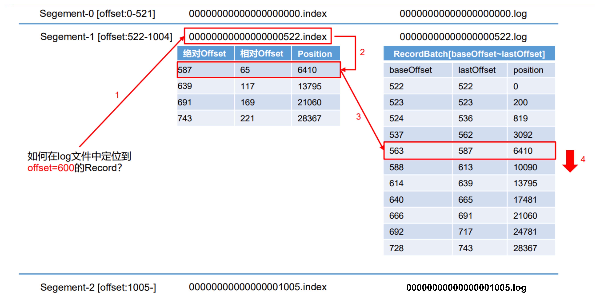

1. 根据目标offset（600）定位Segment文件。

2. 找到小于等于目标offset的最大offset对应的索引项。

3. 定位到log文件。

4. 向下遍历找到目标Record。

`.index`文件中的索引为稀疏索引，大约每往log文件写入4KB数据，会往index文件写入一条索引。由参数`log.index.interval.bytes`控制，默认4KB。

.Index文件中保存的offset为相对offset，这样能确保offset的值所占空间不会过大，因此能将offset的值控制在固定大小。

###### 日志存储参数配置

| 参数                       | 描述                                                  |
| ------------------------ | --------------------------------------------------- |
| log.segment.bytes        | Kafka 中 log 日志是分成一块块存储的，此配置是指 log 日志划分成块的大小，默认值 1G。 |
| log.index.interval.bytes | 默认 4kb，kafka 里面每当写入了 4kb 大小的日志（.log），然后就            |

##### 文件清理策略

Kafka 中默认的日志保存时间为 7 天，可以通过调整如下参数修改保存时间。

- log.retention.hours，最低优先级小时，默认 7 天。

- log.retention.minutes，分钟。

- log.retention.ms，最高优先级毫秒。

- log.retention.check.interval.ms，负责设置检查周期，默认 5 分钟。

如果日志超过了设置的时间，怎么处理呢？Kafka 中提供的日志清理策略有 delete 和 compact 两种。

- `log.cleanup.policy=delete`（default）：过期数据删除
  
  - 基于时间：默认打开。以 segment 中所有记录中的最大时间戳作为该文件时间戳（按照segment中最后一条记录的时间戳作为过期时间）。
  
  - 基于大小：默认关闭。超过设置的所有日志总大小，删除最早的 segment。由参数`log.retention.bytes`控制，默认等于-1，表示无穷大。

如果一个 segment 中有一部分数据过期，一部分没有过期，怎么处理？

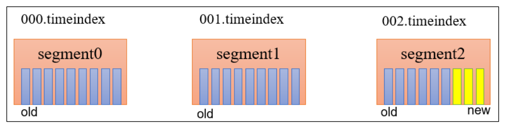

如果一个 segment 中有一部分数据过期，一部分没有过期，以最后一条记录的时间戳作为新的计算周期进行删除。即最后一条记录过期后，再删除这个segment。

- `log.cleanup.policy=compact`：日志压缩（compact日志压缩：对于相同key的不同value值，只保留最后一个版本。）

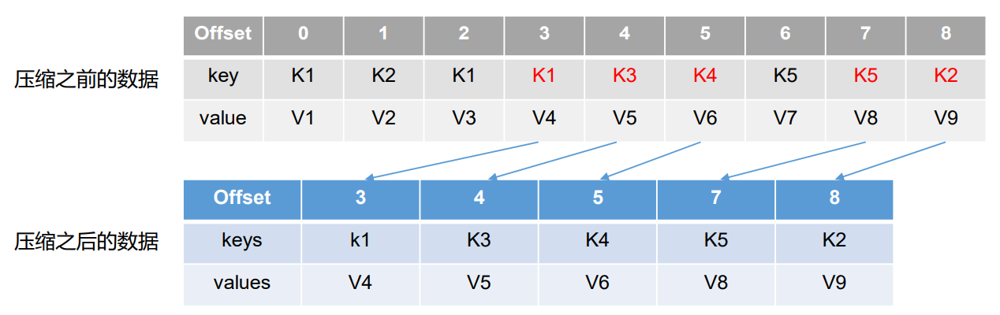

压缩后的offset可能是不连续的，比如上图中没有6，当从这些offset消费消息时，将会拿到比这个offset大的offset对应的消息，实际上会拿到offset为7的消息，并从这个位置开始消费。

这种策略只适合特殊场景，比如消息的key是用户ID，value是用户的资料，通过这种压缩策略，整个消息集里就保存了所有用户最新的资料。

#### 高效读写数据

1. Kafka 本身是分布式集群，可以采用分区技术，并行度高

2. 读数据采用稀疏索引，可以快速定位要消费的数据

3. 顺序写磁盘
   
   - Kafka 的 producer 生产数据，要写入到 log 文件中，写的过程是一直追加到文件末端，为顺序写。顺序写之所以快，是因为其省去了大量磁头寻址的时间。

4. 页缓存 + 零拷贝技术
   
   - 零拷贝：Kafka的数据加工处理操作交由Kafka生产者和Kafka消费者处理。Kafka Broker应用层不关心存储的数据，所以就不用走应用层，传输效率高。
   
   - PageCache页缓存：Kafka重度依赖底层操作系统提供的PageCache功 能。当上层有写操作时，操作系统只是将数据写入PageCache。当读操作发生时，先从PageCache中查找，如果找不到，再去磁盘中读取。实际上PageCache是把尽可能多的空闲内存 都当做了磁盘缓存来使用。

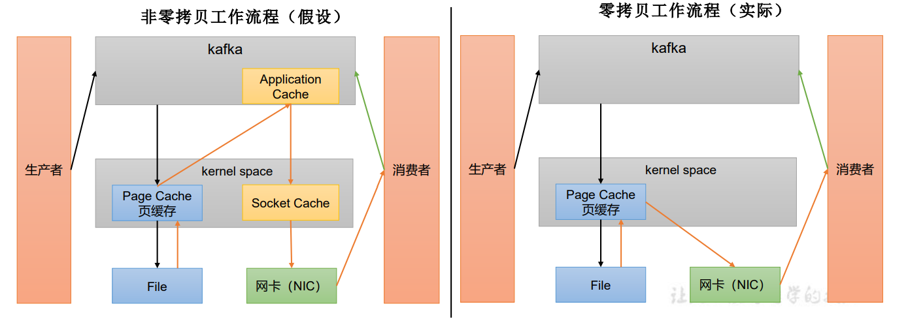

| 参数                          | 描述                                                                |
| --------------------------- | ----------------------------------------------------------------- |
| log.flush.interval.messages | 强制页缓存刷写到磁盘的条数，默认是 long 的最大值，9223372036854775807。一般不建议修改，交给系统自己管理。 |
| log.flush.interval.ms       | 每隔多久，刷数据到磁盘，默认是 null。一般不建议修改，                                     |

### 消费者

#### 消费方式

- pull（拉）模 式：consumer采用从broker中主动拉取数据。（Kafka采用这种方式）

- push（推）模式：Kafka没有采用这种方式，因为由broker决定消息发送速率，很难适应所有消费者的消费速率。

pull模式不足之处是，如 果Kafka没有数据，消费者可能会陷入循环中，一直返回空数据。

#### 消费者工作流程

##### 消费者工作流程

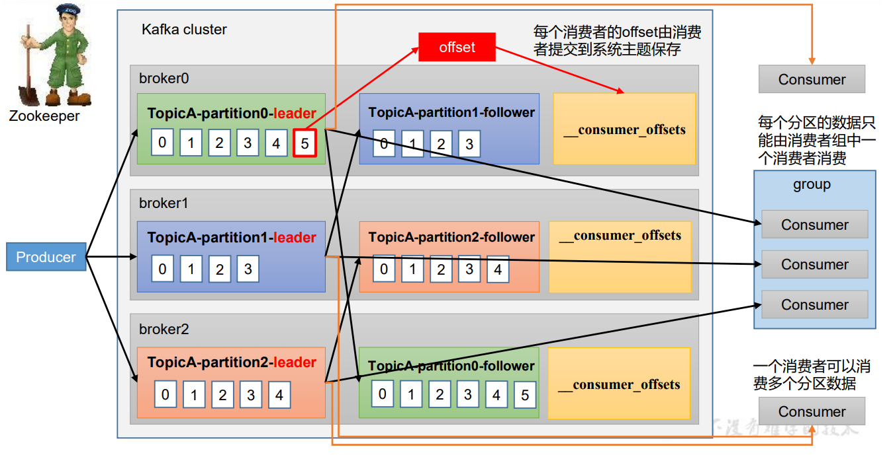

##### 消费者组原理

Consumer Group（CG）：消费者组，由多个consumer组成。形成一个消费者组的条件是所有消费者的groupid相同。

- 消费者组内每个消费者负责消费不同分区的数据，一个分区只能由一个组内消费者消费。

- 消费者组之间互不影响。所有的消费者都属于某个消费者组，即消费者组是逻辑上的一个订阅者。

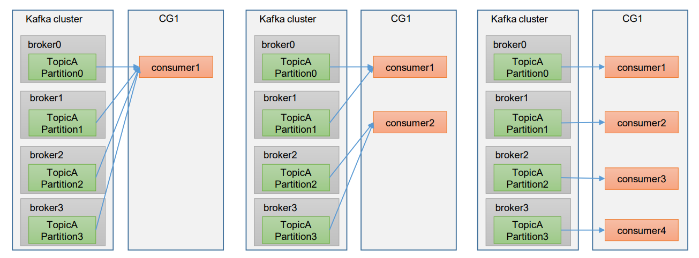

如果向消费组中添加更多的消费者，超过主题分区数量，则有一部分消费者就会闲置，不会接收任何消息。

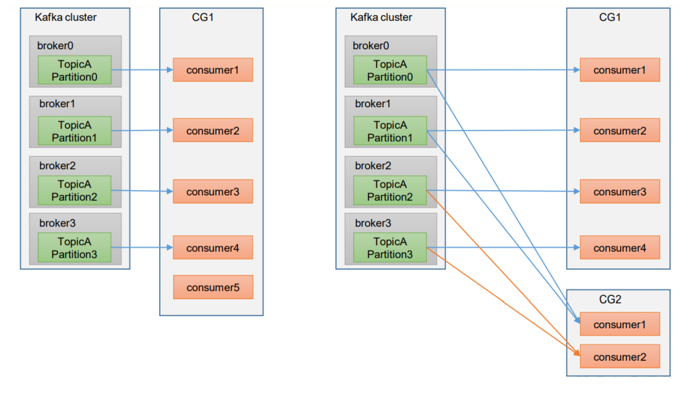

##### 消费者组初始化流程

coordinator：辅助实现消费者组的初始化和分区的分配。coordinator节点选择：groupid的hashcode值 % 50（ __consumer_offsets的分区数量，默认50）

例如： groupid的hashcode值 = 1，1% 50 = 1，那么__consumer_offsets 主题的1号分区，在哪个broker上，就选择这个节点的coordinator作为这个消费者组的老大。消费者组下的所有的消费者提交offset的时候就往这个分区去提交offset。

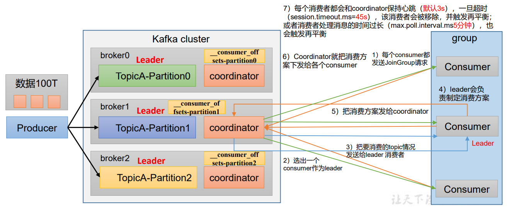

##### 消费者组详细消费流程

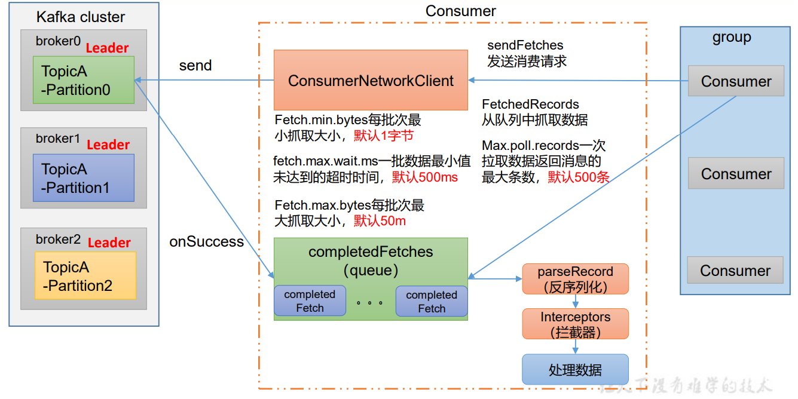

##### 消费者重要参数

| 参数                                    | 描述                                                                                                                                                                            |
| ------------------------------------- | ----------------------------------------------------------------------------------------------------------------------------------------------------------------------------- |
| bootstrap.servers                     | 向 Kafka 集群建立初始连接用到的 host/port 列表。                                                                                                                                             |
| key.deserializer 和 value.deserializer | 指定接收消息的 key 和 value 的反序列化类型。一定要写全类名。                                                                                                                                          |
| group.id                              | 标记消费者所属的消费者组。                                                                                                                                                                 |
| enable.auto.commit                    | 默认值为 true，消费者会自动周期性地向服务器提交偏移量。                                                                                                                                                |
| auto.commit.interval.ms               | 如果设置了 enable.auto.commit 的值为 true， 则该值定义了消费者偏移量向 Kafka 提交的频率，默认 5s。                                                                                                           |
| auto.offset.reset                     | 当 Kafka 中没有初始偏移量或当前偏移量在服务器中不存在（如，数据被删除了），该如何处理？<br/>earliest：自动重置偏移量到最早的偏移量。<br/>latest：默认，自动重置偏移量为最新的偏移量。<br/>none：如果消费组原来的（previous）偏移量不存在，则向消费者抛异常。<br/>anything：向消费者抛异常。  |
| heartbeat.interval.ms                 | Kafka 消费者和 coordinator 之间的心跳时间，默认 3s。该条目的值必须小于 session.timeout.ms ，也不应该高于session.timeout.ms 的 1/3。                                                                            |
| session.timeout.ms                    | Kafka 消费者和 coordinator 之间连接超时时间，默认 45s。超过该值，该消费者被移除，消费者组执行再平衡。                                                                                                                |
| max.poll.interval.ms                  | 消费者处理消息的最大时长，默认是 5 分钟。超过该值，该消费者被移除，消费者组执行再平衡。                                                                                                                                 |
| fetch.min.bytes                       | 默认 1 个字节。消费者获取服务器端一批消息最小的字节数。                                                                                                                                                 |
| fetch.max.wait.ms                     | 默认 500ms。如果没有从服务器端获取到一批数据的最小字节数。该时间到，仍然会返回数据。                                                                                                                                 |
| fetch.max.bytes                       | 默认 Default: 52428800（50 m）。消费者获取服务器端一批消息最大的字节数。如果服务器端一批次的数据大于该值（50m）仍然可以拉取回来这批数据，因此，这不是一个绝对最大值。一批次的大小受 message.max.bytes （broker config）和 max.message.bytes （topic config）影响。 |
| max.poll.records                      | 一次 poll 拉取数据返回消息的最大条数，默认是 500 条。                                                                                                                                              |

#### 分区的分配以及再平衡

一个consumer group中有多个consumer组成，一个 topic有多个partition组成，现在的问题是，到底由哪个consumer来消费哪个partition的数据?

Kafka有四种主流的分区分配策略：Range、RoundRobin、Sticky、CooperativeSticky。可以通过配置参数`partition.assignment.strategy`，修改分区的分配策略。默认策略是Range + CooperativeSticky。Kafka可以同时使用多个分区分配策略。

同时可以自定义消费分区策略：实现`org.apache.kafka.clients.consumer.ConsumerPartitionAssignor`接口。

| 参数                            | 描述                                                                                                                              |
| ----------------------------- | ------------------------------------------------------------------------------------------------------------------------------- |
| heartbeat.interval.ms         | Kafka 消费者和 coordinator 之间的心跳时间，默认 3s。该条目的值必须小于 session.timeout.ms，也不应该高于session.timeout.ms 的 1/3。                               |
| session.timeout.ms            | Kafka 消费者和 coordinator 之间连接超时时间，默认 45s。超过该值，该消费者被移除，消费者组执行再平衡。                                                                  |
| max.poll.interval.ms          | 消费者处理消息的最大时长，默认是 5 分钟。超过该值，该消费者被移除，消费者组执行再平衡。                                                                                   |
| partition.assignment.strategy | 消费者分区配策略，默认策略是 Range +CooperativeSticky。Kafka 可以同时使用多个分区分配策略。可 以 选 择 的 策 略 包 括 ： Range 、 RoundRobin 、 Sticky 、CooperativeSticky |

##### Range

###### Range 分区策略原理

Range 是对每个 topic 而言的。首先对同一个 topic 里面的分区按照序号进行排序，并对消费者按照字母顺序进行排序。

假如现在有 7 个分区，3 个消费者，排序后的分区将会是0,1,2,3,4,5,6；消费者排序完之后将会是C0,C1,C2。

通过 partitions数/consumer数 来决定每个消费者应该消费几个分区。如果除不尽，那么前面几个消费者将会多消费 1 个分区。

例如，7/3 = 2 余 1 ，除不尽，那么 消费者 C0 便会多消费 1 个分区。 8/3=2余2，除不尽，那么C0和C1分别多消费一个。

但如果只是针对 1 个 topic 而言，C0消费者多消费1个分区影响不是很大。但是如果有 N 多个 topic，那么针对每个 topic，消费者 C0都将多消费 1 个分区，topic越多，C0消费的分区会比其他消费者明显多消费 N 个分区。

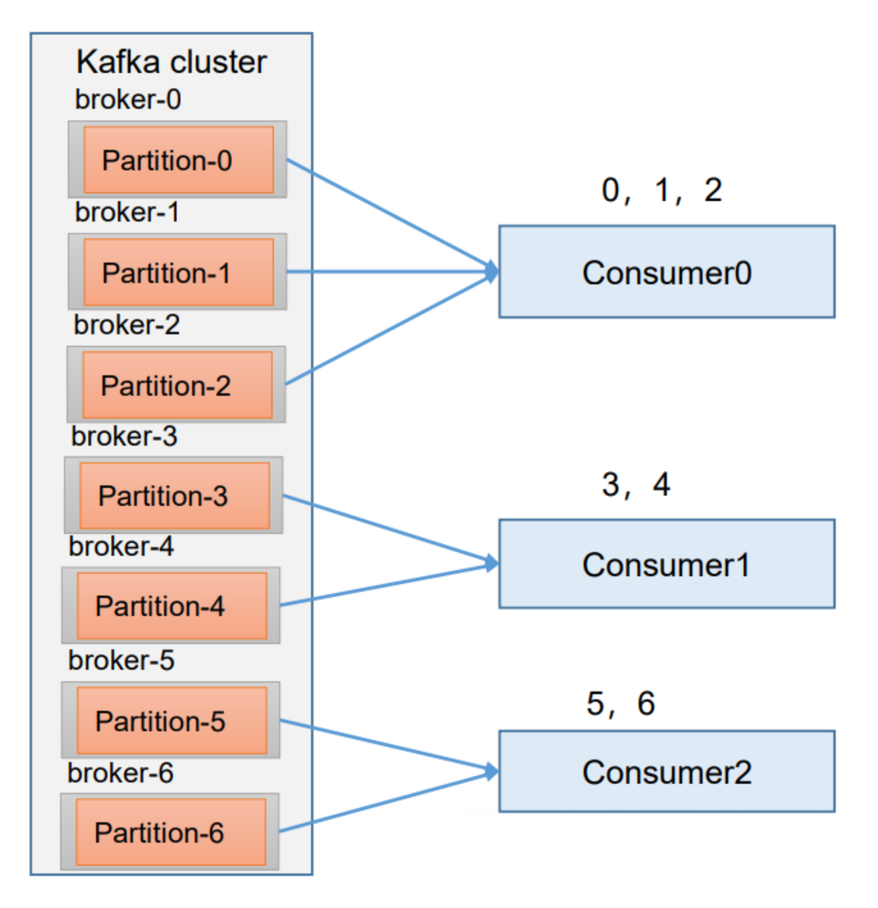

###### Range 分区分配再平衡案例

Kafka集群消费者消费说明：

- 0 号消费者：消费到 1、2 号分区数据。

- 1 号消费者：消费到 3、4 号分区数据。

- 2 号消费者：消费到 5、6 号分区数据。
1. 手动停止掉 0 号消费者，快速重新发送消息观看结果（45s 以内，越快越好）。

0 号消费者挂掉后，消费者组需要按照超时时间 45s 来判断它是否退出，所以需要等待，时间到了 45s 后，判断它真的退出就会把任务分配给其他 broker 执行。

而0号消费者的任务会整体被分配到 1 号消费者或者 2 号消费者。

2. 再次重新发送消息观看结果（45s 以后）。（分区分配再平衡）
- 1 号消费者：消费到 0、1、2、3 号分区数据。

- 2 号消费者：消费到 4、5、6 号分区数据。

消费者 0 已经被踢出消费者组，所以重新按照 range 方式分配。

##### RoundRobin

###### RoundRobin 分区策略原理

RoundRobin 是针对集群中所有Topic而言。

RoundRobin 轮询分区策略，是把所有的 partition 和所有的 consumer 都列出来，然后按照 hashcode 进行排序，最后通过轮询算法来分配 partition 给到各个消费者。

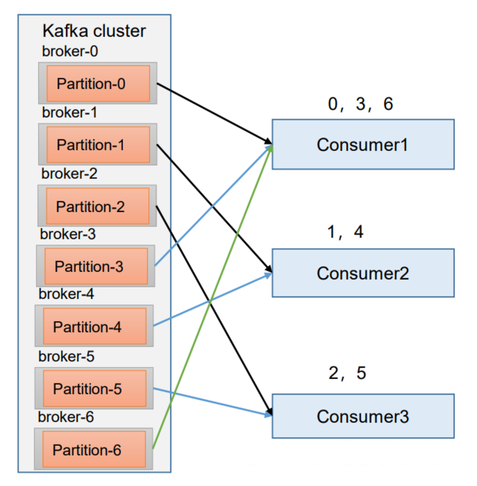

###### RoundRobin 分区分配再平衡案例

Kafka集群消费者消费说明：

- 0 号消费者：消费到 1、4、7 号分区数据。

- 1 号消费者：消费到 2、5 号分区数据。

- 2 号消费者：消费到 3、6 号分区数据。
1. 手动停止掉 0 号消费者，快速重新发送消息观看结果（45s 以内，越快越好）。

0 号消费者挂掉后，消费者组需要按照超时时间 45s 来判断它是否退出，所以需要等待，时间到了 45s 后，判断它真的退出就会把任务分配给其他 broker 执行。

而0 号消费者的任务会按照 RoundRobin 的方式，把数据轮询分成 0 、6 和 3 号分区数据，分别由 1 号消费者或者 2 号消费者消费。（Kafka分区从0开始）

2. 再次重新发送消息观看结果（45s 以后）。
- 1 号消费者：消费到 0、2、4、6 号分区数据

- 2 号消费者：消费到 1、3、5 号分区数据

消费者 0 已经被踢出消费者组，所以重新按照 RoundRobin 方式分配。

##### Sticky

Sticky 是针对集群中所有Topic而言。

粘性分区定义：可以理解为分配的结果带有`粘性的`。即在执行一次新的分配之前，考虑上一次分配的结果，尽量少的调整分配的变动，可以节省大量的开销。

粘性分区是 Kafka 从 0.11.x 版本开始引入这种分配策略，首先会尽量均衡的放置分区到消费者上面，在出现同一消费者组内消费者出现问题的时候，会尽量保持原有分配的分区不变化。

#### offset位移

##### offset默认维护position

Kafka0.9版本之前，consumer默认将offset保存在Zookeeper中。从0.9版本开始，consumer默认 将offset保存在Kafka一个内置的topic中，该topic为`__consumer_offsets`。


`__consumer_offsets` 主题里面采用 key 和 value 的方式存储数据。key 是 group.id+topic+分区号，value 就是当前 offset 的值。每隔一段时间，kafka 内部会对这个 topic 进行 compact，也就是每个 group.id+topic+分区号就保留最新数据。

如果需要消费系统主题`__consumer_offsets`，在配置文件`consumer.properties`中添加配置 `exclude.internal.topics=false`，默认是 true，表示不能消费系统主题。为了查看该系统主题数据，所以该参数修改为 false。

```shell
[root@server7 kafka]$ bin/kafka-console-consumer.sh --topic __consumer_offsets --bootstrap-server localhost:9092 --consumer.config config/consumer.properties --formatter "kafka.coordinator.group.GroupMetadataManager\$OffsetsMessageFormatter" --from-beginning
```

##### 自动提交offset

- enable.auto.commit：是否开启自动提交offset功能，默认是true

- auto.commit.interval.ms：自动提交offset的时间间隔，默认是5s

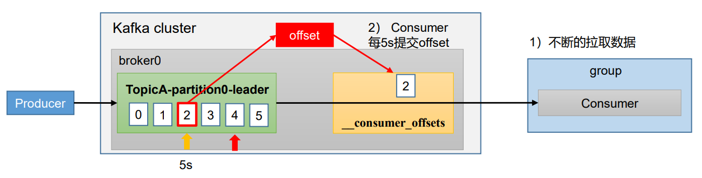

| 参数                      | 描述                                         |
| ----------------------- | ------------------------------------------ |
| enable.auto.commit      | 默认值为 true，消费者会自动周期性地向服务器提交偏移量。             |
| auto.commit.interval.ms | 如果设置了 enable.auto.commit 的值为 true， 则该值定义了消 |

##### 手动提交offset

手动提交offset的方法有两种：分别是commitSync（同步提交）和commitAsync（异步提交）。两者的相同点是，都会将本次提交的一批数据中最高的偏移量提交；不同点是，同步提交阻塞当前线程，一直到提交成功，并且会自动失败重试（由不可控因素导致，也会出现提交失败）；而异步提交则没有失败重试机制，故有可能提交失败。

- commitSync()（同步提交）：必须等待offset提交完毕，再去消费下一批数据。
  
  - 同步提交 offset 有失败重试机制，故更加可靠，但是由于一直等待提交结果，提交的效率比较低。

- commitAsync()（异步提交） ：发送完提交offset请求后，就开始消费下一批数据了。
  
  - 然同步提交 offset 更可靠一些，但是由于其会阻塞当前线程，直到提交成功。因此吞吐量会受到很大的影响。因此更多的情况下，会选用异步提交 offset 的方式。

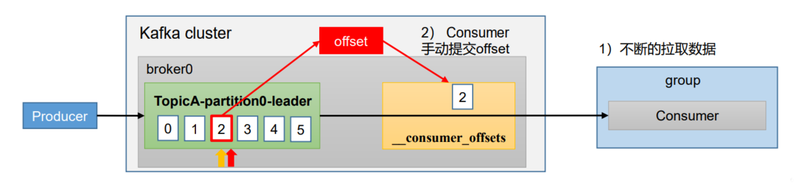

##### 指定offset消费

配置项 auto.offset.reset 取值有三种（earliest 、latest、none）默认是 latest。

当 Kafka 中没有初始偏移量（消费者组第一次消费）或服务器上不再存在当前偏移量时（例如该数据已被删除），该怎么办？

1. earliest：自动将偏移量重置为最早的偏移量。等同于命令行参数`--from-beginning`。

2. latest（默认值）：自动将偏移量重置为最新偏移量。

3. none：如果未找到消费者组的先前偏移量，则向消费者抛出异常。

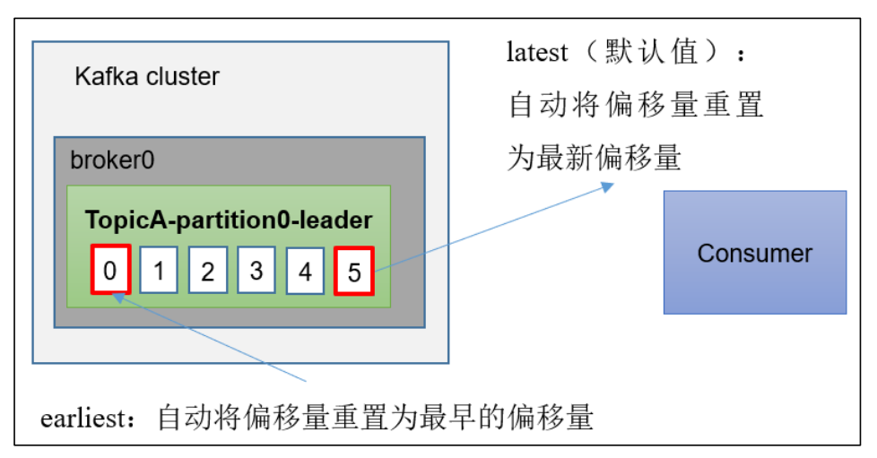

4. 任意指定 offset 位移开始消费。

```java
Set<TopicPartition> assignment= new HashSet<>();

while (assignment.size() == 0) {
    kafkaConsumer.poll(Duration.ofSeconds(1));
    // 获取消费者分区分配信息（有了分区分配信息才能开始消费）
    assignment = kafkaConsumer.assignment();
}

// 遍历所有分区，并指定 offset 从 1700 的位置开始消费
for (TopicPartition tp: assignment) {
    kafkaConsumer.seek(tp, 1700);
}
```

##### 指定时间消费

需求：在生产环境中，会遇到最近消费的几个小时数据异常，想重新按照时间消费。例如要求按照时间消费前一天的数据，怎么处理？

```java
Set<TopicPartition> assignment = new HashSet<>();

while (assignment.size() == 0) {
    kafkaConsumer.poll(Duration.ofSeconds(1));

    // 获取消费者分区分配信息（有了分区分配信息才能开始消费）
    assignment = kafkaConsumer.assignment();
}

HashMap<TopicPartition, Long> timestampToSearch = new HashMap<>();

// 封装集合存储，每个分区对应一天前的数据
for (TopicPartition topicPartition : assignment) {
    timestampToSearch.put(topicPartition, System.currentTimeMillis() - 1 * 24 * 3600 * 1000);
}

// 获取从 1 天前开始消费的每个分区的 offset
Map<TopicPartition, OffsetAndTimestamp> offsets = kafkaConsumer.offsetsForTimes(timestampToSearch);

// 遍历每个分区，对每个分区设置消费时间。
for (TopicPartition topicPartition : assignment) {
    OffsetAndTimestamp offsetAndTimestamp =
    offsets.get(topicPartition);

    // 根据时间指定开始消费的位置
    if (offsetAndTimestamp != null){
        kafkaConsumer.seek(topicPartition,
        offsetAndTimestamp.offset());
    }
}
```

##### 漏消费和重复消费

- 重复消费：已经消费了数据，但是 offset 没提交。
  
  - 自动提交offset引起。
    
    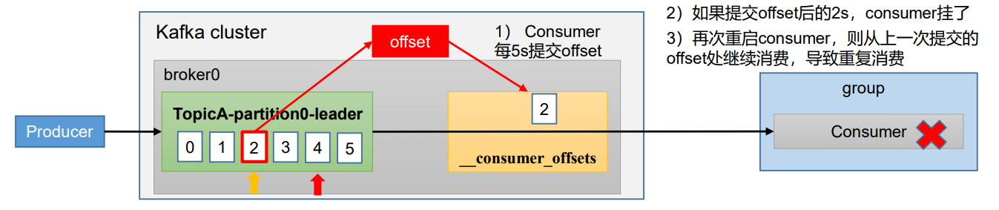

- 漏消费：先提交 offset 后消费，有可能会造成数据的漏消费。
  
  - 设置offset为手动提交，当offset被提交时，数据还在内存中未落盘，此时刚好消费者线程被kill掉，那么offset已经提交，但是数据未处理，导致这部分内存中的数据丢失。
    
    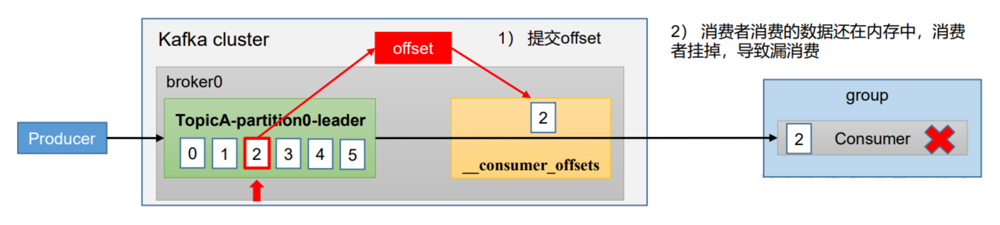

怎么能做到既不漏消费也不重复消费呢？需要用到消费者事务。

#### 消费者事务

如果想完成Consumer端的精准一次性消费，那么需要Kafka消费端将消费过程和提交offset过程做原子绑定。此时我们需要将Kafka的offset保存到支持事务的自定义介质（比如MySQL）。

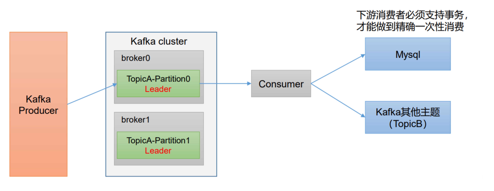

#### 数据积压（消费者如何提高吞吐量）

数据挤压原因：

1. 如果是Kafka消费能力不足，则可以考虑增加Topic的分区数，并且同时提升消费组的消费者数量，消费者数 = 分区数。（两者缺一不可）

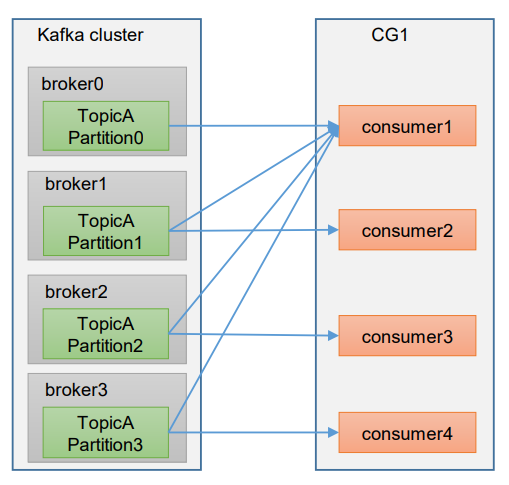

2. 如果是下游的数据处理不及时：提高每批次拉取的数量。批次拉取数据过少（拉取数据/处理时间 < 生产速度），使处理的数据小于生产的数据，也会造成数据积压。

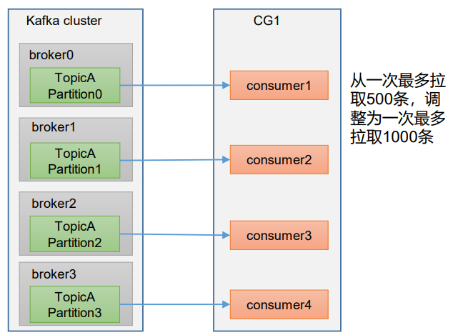

| 参数               | 描述                                                                                                                                                                            |
| ---------------- | ----------------------------------------------------------------------------------------------------------------------------------------------------------------------------- |
| fetch.max.bytes  | 默认 Default: 52428800（50 m）。消费者获取服务器端一批消息最大的字节数。如果服务器端一批次的数据大于该值（50m）仍然可以拉取回来这批数据，因此，这不是一个绝对最大值。一批次的大小受 message.max.bytes （broker config）和 max.message.bytes （topic config）影响。 |
| max.poll.records | 一次 poll 拉取数据返回消息的最大条数，默认是 500 条                                                                                                                                               |

### Eagle 监控

Kafka-Eagle 框架可以监控 Kafka 集群的整体运行情况，在生产环境中经常使用。Kafka-Eagle 的安装依赖于 MySQL，MySQL 主要用来存储可视化展示的数据。

### Kraft 模式

#### Kafka-Kraft 架构

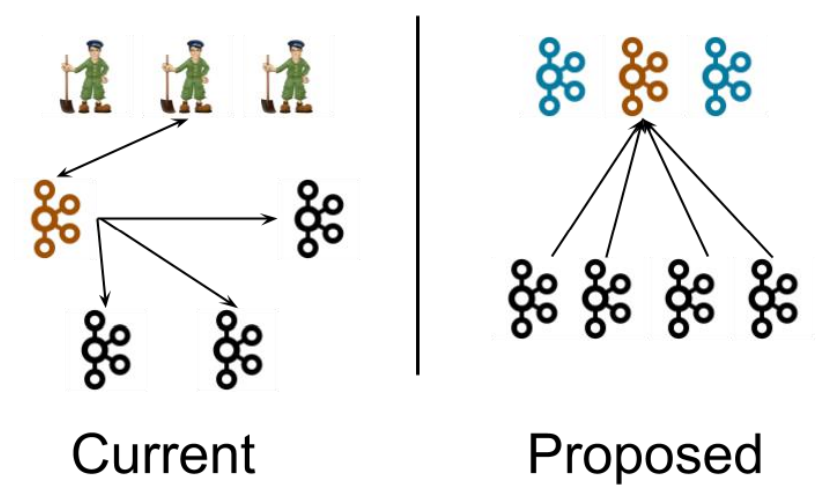

左图为 Kafka 现有架构，元数据在 zookeeper 中，运行时动态选举 controller，由 controller 进行 Kafka 集群管理。

右图为 kraft 模式架构（实验性），不再依赖 zookeeper 集群，而是用三台 controller 节点代替 zookeeper，元数据保存在 controller 中，由 controller 直接进行 Kafka 集群管理。

kraft 模式架构的优点：

- Kafka 不再依赖外部框架，而是能够独立运行；

- controller 管理集群时，不再需要从 zookeeper 中先读取数据，集群性能上升；

- 由于不依赖 zookeeper，集群扩展时不再受到 zookeeper 读写能力限制；

- controller 不再动态选举，而是由配置文件规定。这样我们可以有针对性的加强 controller 节点的配置，而不是像以前一样对随机 controller 节点的高负载束手无策。

## 源码

### 生产者源码


#### 初始化


##### 程序入口

```java
Properties properties = new Properties();
properties.put(ProducerConfig.PARTITIONER_CLASS_CONFIG, MyPartitioner.class.getName());

// 1、初始化 KafkaProducer
// 2、初始化 sender 线程；4、发送数据
KafkaProducer<String, String> producer = new KafkaProducer<>(properties);

// 3、发送数据
producer.send(new ProducerRecord("", ""));
```

##### main 线程初始化

构造器重载

```java
public KafkaProducer(Properties properties) {
    this(properties, null, null);
}
public KafkaProducer(Properties properties, Serializer<K> keySerializer, Serializer<V> valueSerializer) {
    this(Utils.propsToMap(properties), keySerializer, valueSerializer);
}
public KafkaProducer(Map<String, Object> configs, Serializer<K> keySerializer, Serializer<V> valueSerializer) {
    this(new ProducerConfig(ProducerConfig.appendSerializerToConfig(configs, keySerializer, valueSerializer)),
            keySerializer, valueSerializer, null, null, null, Time.SYSTEM);
}
```

经过几次构造方法重载后，会进入下面这个构造方法：

```java
KafkaProducer(ProducerConfig config,
                  Serializer<K> keySerializer,
                  Serializer<V> valueSerializer,
                  ProducerMetadata metadata,
                  KafkaClient kafkaClient,
                  ProducerInterceptors<K, V> interceptors,
                  Time time) {
    try {
        // 自定义配置
        this.producerConfig = config;
        // 系统当前时间
        this.time = time;

        // 获取事务id，自定义的
        String transactionalId = config.getString(ProducerConfig.TRANSACTIONAL_ID_CONFIG);

        // 获取clientId，自定义的
        this.clientId = config.getString(ProducerConfig.CLIENT_ID_CONFIG);

        LogContext logContext;
        if (transactionalId == null)
            logContext = new LogContext(String.format("[Producer clientId=%s] ", clientId));
        else
            logContext = new LogContext(String.format("[Producer clientId=%s, transactionalId=%s] ", clientId, transactionalId));
        log = logContext.logger(KafkaProducer.class);
        log.trace("Starting the Kafka producer");

        // ========== 监控指标，不用到的话可以不用管 ==========
        Map<String, String> metricTags = Collections.singletonMap("client-id", clientId);
        MetricConfig metricConfig = new MetricConfig().samples(config.getInt(ProducerConfig.METRICS_NUM_SAMPLES_CONFIG))
                .timeWindow(config.getLong(ProducerConfig.METRICS_SAMPLE_WINDOW_MS_CONFIG), TimeUnit.MILLISECONDS)
                .recordLevel(Sensor.RecordingLevel.forName(config.getString(ProducerConfig.METRICS_RECORDING_LEVEL_CONFIG)))
                .tags(metricTags);
        List<MetricsReporter> reporters = config.getConfiguredInstances(ProducerConfig.METRIC_REPORTER_CLASSES_CONFIG,
                MetricsReporter.class,
                Collections.singletonMap(ProducerConfig.CLIENT_ID_CONFIG, clientId));
        JmxReporter jmxReporter = new JmxReporter();
        jmxReporter.configure(config.originals(Collections.singletonMap(ProducerConfig.CLIENT_ID_CONFIG, clientId)));
        reporters.add(jmxReporter);
        MetricsContext metricsContext = new KafkaMetricsContext(JMX_PREFIX,
                config.originalsWithPrefix(CommonClientConfigs.METRICS_CONTEXT_PREFIX));
        this.metrics = new Metrics(metricConfig, reporters, time, metricsContext);

        // 核心组件1：分区器，用于决定消息被路由到 topic 的哪个分区
        this.partitioner = config.getConfiguredInstance(
                ProducerConfig.PARTITIONER_CLASS_CONFIG,
                Partitioner.class,
                Collections.singletonMap(ProducerConfig.CLIENT_ID_CONFIG, clientId));

        // 重试间隔，默认 100ms
        long retryBackoffMs = config.getLong(ProducerConfig.RETRY_BACKOFF_MS_CONFIG);

        // key/value 序列化
        if (keySerializer == null) {
            this.keySerializer = config.getConfiguredInstance(ProducerConfig.KEY_SERIALIZER_CLASS_CONFIG,
                                                                                     Serializer.class);
            this.keySerializer.configure(config.originals(Collections.singletonMap(ProducerConfig.CLIENT_ID_CONFIG, clientId)), true);
        } else {
            config.ignore(ProducerConfig.KEY_SERIALIZER_CLASS_CONFIG);
            this.keySerializer = keySerializer;
        }
        if (valueSerializer == null) {
            this.valueSerializer = config.getConfiguredInstance(ProducerConfig.VALUE_SERIALIZER_CLASS_CONFIG,
                                                                                       Serializer.class);
            this.valueSerializer.configure(config.originals(Collections.singletonMap(ProducerConfig.CLIENT_ID_CONFIG, clientId)), false);
        } else {
            config.ignore(ProducerConfig.VALUE_SERIALIZER_CLASS_CONFIG);
            this.valueSerializer = valueSerializer;
        }

        // 拦截器
        List<ProducerInterceptor<K, V>> interceptorList = (List) config.getConfiguredInstances(
                ProducerConfig.INTERCEPTOR_CLASSES_CONFIG,
                ProducerInterceptor.class,
                Collections.singletonMap(ProducerConfig.CLIENT_ID_CONFIG, clientId));
        if (interceptors != null)
            this.interceptors = interceptors;
        else
            this.interceptors = new ProducerInterceptors<>(interceptorList);
        ClusterResourceListeners clusterResourceListeners = configureClusterResourceListeners(keySerializer,
                valueSerializer, interceptorList, reporters);

        // 一次请求的最大大小，默认 1m。
        this.maxRequestSize = config.getInt(ProducerConfig.MAX_REQUEST_SIZE_CONFIG);

        // 缓冲区大小，默认 32M。缓冲区满了会阻塞，通过 max.block.ms 控制，默认60s
        this.totalMemorySize = config.getLong(ProducerConfig.BUFFER_MEMORY_CONFIG);
        // 压缩（压缩类型），默认为none
        this.compressionType = CompressionType.forName(config.getString(ProducerConfig.COMPRESSION_TYPE_CONFIG));

        this.maxBlockTimeMs = config.getLong(ProducerConfig.MAX_BLOCK_MS_CONFIG);
        int deliveryTimeoutMs = configureDeliveryTimeout(config, log);

        this.apiVersions = new ApiVersions();

        // 事务管理器
        this.transactionManager = configureTransactionState(config, logContext);

        /*
        核心组件2：缓冲区对象，默认 32M
        发送消息的收集器    
            同一个分区的数据会被打包成一个batch，一个broker上多个分区对应的多个batch会被打包成一个request
        */
        this.accumulator = new RecordAccumulator(logContext,

                // batch.size 批次大小，默认 16K
                config.getInt(ProducerConfig.BATCH_SIZE_CONFIG),
                this.compressionType,

                /*
                    两次 request 间隔，如果消息非常小，很久都没有积累到 batch.size，如果到了 linger 时间就直接发送出去
                    默认 0，linger.ms
                */
                lingerMs(config), 
                retryBackoffMs,
                deliveryTimeoutMs,
                metrics,
                PRODUCER_METRIC_GROUP_NAME,
                time,
                apiVersions,
                transactionManager,

                // 缓冲区大小，默认 32m
                new BufferPool(this.totalMemorySize, config.getInt(ProducerConfig.BATCH_SIZE_CONFIG), metrics, time, PRODUCER_METRIC_GROUP_NAME));

        // bootstrap.servers，连接 Kafka 集群
        List<InetSocketAddress> addresses = ClientUtils.parseAndValidateAddresses(
                config.getList(ProducerConfig.BOOTSTRAP_SERVERS_CONFIG),
                config.getString(ProducerConfig.CLIENT_DNS_LOOKUP_CONFIG));

        // 获取元数据
        if (metadata != null) {
            this.metadata = metadata;
        } else {
            /*
                metadata.max.age.ms 默认值 5 分钟。生产者每隔多久需要更新一下自己的元数据
                metadata.max.idle.ms 默认值 5 分钟。网络最多空闲时间设置，超过该阈值，就关闭该网络
            */
            this.metadata = new ProducerMetadata(retryBackoffMs,
                    config.getLong(ProducerConfig.METADATA_MAX_AGE_CONFIG),
                    config.getLong(ProducerConfig.METADATA_MAX_IDLE_CONFIG),
                    logContext,
                    clusterResourceListeners,
                    Time.SYSTEM);
            this.metadata.bootstrap(addresses);
        }
        this.errors = this.metrics.sensor("errors");

        // 核心组件3：Sender 线程，调用NetworkClient的方法进行消息发送，TCP请求
        this.sender = newSender(logContext, kafkaClient, this.metadata);
        String ioThreadName = NETWORK_THREAD_PREFIX + " | " + clientId;

        // 守护线程启动，参数一是参数名,参数二是serder,参数三设置为守护线程
        this.ioThread = new KafkaThread(ioThreadName, this.sender, true);

        // 启动发送消息线程
        this.ioThread.start();
        config.logUnused();
        AppInfoParser.registerAppInfo(JMX_PREFIX, clientId, metrics, time.milliseconds());
        log.debug("Kafka producer started");
    } catch (Throwable t) {
        // call close methods if internal objects are already constructed this is to prevent resource leak. see KAFKA-2121
        close(Duration.ofMillis(0), true);
        // now propagate the exception
        throw new KafkaException("Failed to construct kafka producer", t);
    }
}
```

##### sender 线程初始化

```java
Sender newSender(LogContext logContext, KafkaClient kafkaClient, ProducerMetadata metadata) {

    // 缓存请求的个数，默认是5个
    int maxInflightRequests = configureInflightRequests(producerConfig);

    // 请求超时时间，默认 30s
    int requestTimeoutMs = producerConfig.getInt(ProducerConfig.REQUEST_TIMEOUT_MS_CONFIG);
    ChannelBuilder channelBuilder = ClientUtils.createChannelBuilder(producerConfig, time, logContext);
    ProducerMetrics metricsRegistry = new ProducerMetrics(this.metrics);
    Sensor throttleTimeSensor = Sender.throttleTimeSensor(metricsRegistry.senderMetrics);

    /*
    核心组件4：创建 NetworkClient 对象
        clientId：客户端id
        maxInflightRequests：缓存请求个数，默认5个
        reconnect.backoff.ms：连接重试间隔，默认值 50ms
        reconnect.backoff.max.ms：总的重试时间，默认1000ms，每次重试失败时，呈指数增加重试时间，直至达到此最大值
        send.buffer.bytes：发送缓冲区大小，默认128k
        receive.buffer.bytes：接收数据缓存，默认32k
        request.timeout.ms：默认30s
        socket.connection.setup.timeout.ms：默认10s；生产者和服务器通信连接建立的时间。如果在超时之前没有建立连接，将关闭通信。
        socket.connection.setup.timeout.max.ms：默认30s；生产者和服务器通信，每次连续连接失败时，连接建立超时将呈指数增加，直至达到此最大值。
    */
    KafkaClient client = kafkaClient != null ? kafkaClient : new NetworkClient(
            new Selector(producerConfig.getLong(ProducerConfig.CONNECTIONS_MAX_IDLE_MS_CONFIG),
                    this.metrics, time, "producer", channelBuilder, logContext),
            metadata,
            clientId,
            maxInflightRequests,
            producerConfig.getLong(ProducerConfig.RECONNECT_BACKOFF_MS_CONFIG),
            producerConfig.getLong(ProducerConfig.RECONNECT_BACKOFF_MAX_MS_CONFIG),
            producerConfig.getInt(ProducerConfig.SEND_BUFFER_CONFIG),
            producerConfig.getInt(ProducerConfig.RECEIVE_BUFFER_CONFIG),
            requestTimeoutMs,
            producerConfig.getLong(ProducerConfig.SOCKET_CONNECTION_SETUP_TIMEOUT_MS_CONFIG),
            producerConfig.getLong(ProducerConfig.SOCKET_CONNECTION_SETUP_TIMEOUT_MAX_MS_CONFIG),
            time,
            true,
            apiVersions,
            throttleTimeSensor,
            logContext);

    /*
        acks 默认值是-1。
        acks=0, 生产者发送给 Kafka 服务器后，不需要应答
        acks=1，生产者发送给 Kafka 服务器后，Leader 接收后应答
        acks=-1（all），生产者发送给 Kafka 服务器后，Leader 和在 ISR 队列的所有 Follower 共同应答
    */
    short acks = configureAcks(producerConfig, log);

    /*
    创建 Sender 线程对象。
        max.request.size：一次请求最大的数据量，默认1m
        retries：重试次数，int最大值
        retry.backoff.ms：默认值 100ms。重试时间间隔
    */
    return new Sender(logContext,
            client,
            metadata,
            this.accumulator,
            maxInflightRequests == 1,
            producerConfig.getInt(ProducerConfig.MAX_REQUEST_SIZE_CONFIG),
            acks,
            producerConfig.getInt(ProducerConfig.RETRIES_CONFIG),
            metricsRegistry.senderMetrics,
            time,
            requestTimeoutMs,
            producerConfig.getLong(ProducerConfig.RETRY_BACKOFF_MS_CONFIG),
            this.transactionManager,
            apiVersions);
}
```

在初始化时会 start() Sender线程，所以分析其 run() 方法即可。在附录中可查看 run() 方法做了什么事。

##### 初始化时重要的参数

| 参数                                    | 描述                                                                                                                                                                                                |
| ------------------------------------- | ------------------------------------------------------------------------------------------------------------------------------------------------------------------------------------------------- |
| retry.backoff.ms                      | 消息发送失败的重试间隔，默认值 100ms                                                                                                                                                                             |
| metadata.max.age.ms                   | 元数据更新时间，默认是 5min，注意这个配置只是客户端定时去同步元数据(topic、partition、replica、leader、follow、isr等)，但并不是说一定是定时同步，大胆猜测一下当生产者发送消息时发现待发送的topic元数据没有缓存此时一定会去拉取一次且一定是阻塞模式；当 broker 发生变化触发元数据改变也会去拉取一次                     |
| max.request.size                      | 一次请求最大的数据量，默认值 1M；这里的数据量限制不是说单条消息的大小，而是一次请求，kafka在发送消息时会将多条消息打包成一个 RecordBatch，且一个分区生成一个 RecordBatch，因分区大概率是在不同的 broker 中，因此 kafka 会将若干个 RecordBatch 按照 broker 打包成一个 request，这里的数据量是对 request 的限制 |
| buffer.memory                         | 缓冲区大小，默认值 32M；生产者对消息有打包的过程，在没有达到打包条件时生产者会将消息缓存在缓冲区中，当缓存的数据量超过该值生产者会阻塞，直到达到阻塞时间的最大值                                                                                                                |
| compression.type                      | 生产者发送的所有数据的压缩方式。默认值 none。支持压缩类型：none、gzip、snappy、lz4 和 zstd。                                                                                                                                      |
| max.block.ms                          | 最大阻塞时间，默认值 60s。这里的时间从调用 send 方法开始一直到消息被发送的时间，包括上述说的缓冲区满产生的阻塞，以及元数据拉取时的阻塞都是包含在内，可以理解为一次完整的消息发送包含的时间                                                                                                |
| batch.size                            | 批次大小，默认值 16K；就是 RecordBatch 的大小                                                                                                                                                                   |
| linger.ms                             | 两次发送的时间间隔，默认值 0；两次发送没有间隔，即来一条发送一条，这个参数主要防止当消息过小迟迟达不到 batch.size 的打包条件，导致数据延迟；因此这个配置在生产上建议配置，默认值导致生产者没有打包的操作，而极大地影响吞吐量，但又不能过大，过大会影响数据的时效性。通常的参考标准时根据 batch.size 估算数据量达到一个 batch 的时间                |
| connections.max.idle.ms               | 连接最大空闲时间，默认值 9min；为了减轻客户端服务端的压力，对于长时间不活跃的连接会根据 lru 算法进行关闭                                                                                                                                         |
| max.in.flight.requests.per.connection | 每个连接允许没有响应的最大请求数，默认值 5；消息发送成功后得到响应前的请求会被放置在内部的 in-flight 数组中，当得到响应后(无论是成功还是失败)会被从这里移除，特别是当消息发送失败后进行重试，因为不知道服务端什么时候接收成功，当该值大于 1 时会存在消息乱序的情况(即使topic只有一个分区)。                                        |
| reconnect.backoff.ms                  | 连接重试间隔，默认值 50ms                                                                                                                                                                                   |

#### 发送数据到缓冲区

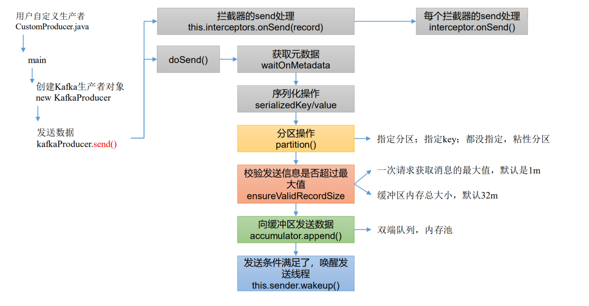

```java
Properties properties = new Properties();
properties.put(ProducerConfig.PARTITIONER_CLASS_CONFIG, MyPartitioner.class.getName());
KafkaProducer<String, String> producer = new KafkaProducer<>(properties);

producer.send(new ProducerRecord("", ""));
```

##### 发送源码流程

```java
public Future<RecordMetadata> send(ProducerRecord<K, V> record) {
    return send(record, null);
}

public Future<RecordMetadata> send(ProducerRecord<K, V> record, Callback callback) {
    // intercept the record, which can be potentially modified; this method does not throw exceptions

    // 拦截器，多个拦截器逐一拦截
    ProducerRecord<K, V> interceptedRecord = this.interceptors.onSend(record);

    // 发送消息
    return doSend(interceptedRecord, callback);
}
```

无论是同步发送还是异步发送，都会进入`send(ProducerRecord<K, V> record, Callback callback)`这个方法内。查看 doSend() 方法。实现异步地将记录发送到一个主题。

```java
private Future<RecordMetadata> doSend(ProducerRecord<K, V> record, Callback callback) {

    // 记录主题分区
    TopicPartition tp = null;
    try {
        throwIfProducerClosed();
        // first make sure the metadata for the topic is available
        long nowMs = time.milliseconds();
        ClusterAndWaitTime clusterAndWaitTime;
        try {
            /*
                从 Kafka 拉取元数据。maxBlockTimeMs 表示最多能等待多长时间
                获取 topic 的元数据，确保 topic 的元数据可用
            */
            clusterAndWaitTime = waitOnMetadata(record.topic(), record.partition(), nowMs, maxBlockTimeMs);
        } catch (KafkaException e) {
            if (metadata.isClosed())
                throw new KafkaException("Producer closed while send in progress", e);
            throw e;
        }
        nowMs += clusterAndWaitTime.waitedOnMetadataMs;

        // 剩余时间 = 最多能等待时间 - 用了多少时间；
        long remainingWaitMs = Math.max(0, maxBlockTimeMs - clusterAndWaitTime.waitedOnMetadataMs);

        // 更新集群元数据
        Cluster cluster = clusterAndWaitTime.cluster;

        // key/value 序列化操作
        byte[] serializedKey;
        try {
            serializedKey = keySerializer.serialize(record.topic(), record.headers(), record.key());
        } catch (ClassCastException cce) {
            throw new SerializationException("Can't convert key of class " + record.key().getClass().getName() +
                    " to class " + producerConfig.getClass(ProducerConfig.KEY_SERIALIZER_CLASS_CONFIG).getName() +
                    " specified in key.serializer", cce);
        }
        byte[] serializedValue;
        try {
            serializedValue = valueSerializer.serialize(record.topic(), record.headers(), record.value());
        } catch (ClassCastException cce) {
            throw new SerializationException("Can't convert value of class " + record.value().getClass().getName() +
                    " to class " + producerConfig.getClass(ProducerConfig.VALUE_SERIALIZER_CLASS_CONFIG).getName() +
                    " specified in value.serializer", cce);
        }

        /*
        分区分配操作：
            指定分区：直接返回；
            指定key：按key的hashcode对分区数取余；
            都没指定：粘性分区
            也可以自定义分区器，替换默认分区
        */
        int partition = partition(record, serializedKey, serializedValue, cluster);

        // 将消息发送到哪个主题，哪个分区
        tp = new TopicPartition(record.topic(), partition);

        // 设置头信息
        setReadOnly(record.headers());
        Header[] headers = record.headers().toArray();

        // 计算序列化后的消息大小
        int serializedSize = AbstractRecords.estimateSizeInBytesUpperBound(apiVersions.maxUsableProduceMagic(),
                compressionType, serializedKey, serializedValue, headers);

        /*
            校验发送信息是否超过最大值
            一次请求获取消息的最大值，默认是1m，缓冲区内存总大小，默认32m
        */
        ensureValidRecordSize(serializedSize);
        long timestamp = record.timestamp() == null ? nowMs : record.timestamp();
        if (log.isTraceEnabled()) {
            log.trace("Attempting to append record {} with callback {} to topic {} partition {}", record, callback, record.topic(), partition);
        }
        // producer callback will make sure to call both 'callback' and interceptor callback

        // 消息发送的回调函数，消息从 broker 确认后，要调用的拦截器
        Callback interceptCallback = new InterceptorCallback<>(callback, this.interceptors, tp);

        if (transactionManager != null && transactionManager.isTransactional()) {
            transactionManager.failIfNotReadyForSend();
        }

        /*
            将消息追加到消息累加器中的 batch 尾部
            向缓冲区发送数据，双端队列，内存默认 32m，里面是默认 16k 一个批次
        */
        RecordAccumulator.RecordAppendResult result = accumulator.append(tp, timestamp, serializedKey,
                serializedValue, headers, interceptCallback, remainingWaitMs, true, nowMs);

        if (result.abortForNewBatch) {
            int prevPartition = partition;
            partitioner.onNewBatch(record.topic(), cluster, prevPartition);
            partition = partition(record, serializedKey, serializedValue, cluster);
            tp = new TopicPartition(record.topic(), partition);
            if (log.isTraceEnabled()) {
                log.trace("Retrying append due to new batch creation for topic {} partition {}. The old partition was {}", record.topic(), partition, prevPartition);
            }
            // producer callback will make sure to call both 'callback' and interceptor callback
            interceptCallback = new InterceptorCallback<>(callback, this.interceptors, tp);

            result = accumulator.append(tp, timestamp, serializedKey,
                serializedValue, headers, interceptCallback, remainingWaitMs, false, nowMs);
        }

        // 如果是事务消息，设置事务管理器
        if (transactionManager != null && transactionManager.isTransactional())
            transactionManager.maybeAddPartitionToTransaction(tp);

        /*
        发送条件满足了（batch.size,批次大小已经满了，或者有一个新的批次创建），唤醒 sender 发送线程
            如果消息消息累加器中对应的分区满足一个批次（16k），则唤醒发送线程
            如果 linger.ms 时间到了，则需要创建新的批次，则唤醒发送线程
        */
        if (result.batchIsFull || result.newBatchCreated) {
            log.trace("Waking up the sender since topic {} partition {} is either full or getting a new batch", record.topic(), partition);
            this.sender.wakeup();
        }

        // 返回 future 对象
        return result.future;
        // handling exceptions and record the errors;
        // for API exceptions return them in the future,
        // for other exceptions throw directly
    } catch (ApiException e) {
        log.debug("Exception occurred during message send:", e);
        if (callback != null)
            callback.onCompletion(null, e);
        this.errors.record();
        this.interceptors.onSendError(record, tp, e);
        return new FutureFailure(e);
    } catch (InterruptedException e) {
        this.errors.record();
        this.interceptors.onSendError(record, tp, e);
        throw new InterruptException(e);
    } catch (KafkaException e) {
        this.errors.record();
        this.interceptors.onSendError(record, tp, e);
        throw e;
    } catch (Exception e) {
        // we notify interceptor about all exceptions, since onSend is called before anything else in this method
        this.interceptors.onSendError(record, tp, e);
        throw e;
    }
}
```

#### sender 线程发送数据

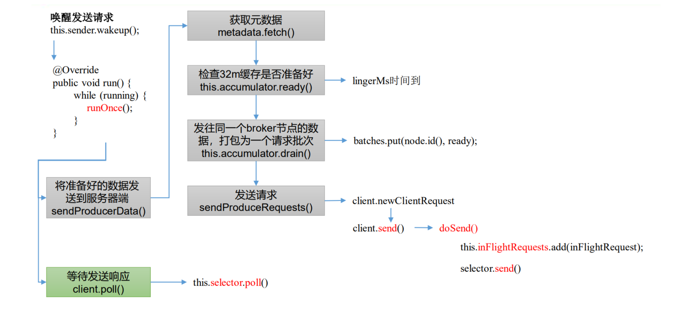

##### 源码流程

```java
public void run() {
    log.debug("Starting Kafka producer I/O thread.");

    // main loop, runs until close is called
    while (running) {
        try {
            // sender 线程从缓冲区准备拉取数据
            runOnce();
        } catch (Exception e) {
            log.error("Uncaught error in kafka producer I/O thread: ", e);
        }
    }

    // ... ...
}
```

runOnce()

```java
void runOnce() {

    // 事务相关操作，默认不开启，null
    if (transactionManager != null) {
        try {
            transactionManager.maybeResolveSequences();

            // do not continue sending if the transaction manager is in a failed state
            if (transactionManager.hasFatalError()) {
                RuntimeException lastError = transactionManager.lastError();
                if (lastError != null)
                    maybeAbortBatches(lastError);
                client.poll(retryBackoffMs, time.milliseconds());
                return;
            }

            // Check whether we need a new producerId. If so, we will enqueue an InitProducerId
            // request which will be sent below
            transactionManager.bumpIdempotentEpochAndResetIdIfNeeded();

            if (maybeSendAndPollTransactionalRequest()) {
                return;
            }
        } catch (AuthenticationException e) {
            // This is already logged as error, but propagated here to perform any clean ups.
            log.trace("Authentication exception while processing transactional request", e);
            transactionManager.authenticationFailed(e);
        }
    }

    long currentTimeMs = time.milliseconds();

    // 将准备号的数据发送到服务端
    long pollTimeout = sendProducerData(currentTimeMs);

    // 等待发送响应
    client.poll(pollTimeout, currentTimeMs);
}
```

sendProducerData()

```java
private long sendProducerData(long now) {

    // 获取集群元数据
    Cluster cluster = metadata.fetch();
    // get the list of partitions with data ready to send

    // 1、检查 32m缓存是否准备好（linger.ms 时间是否满足）
    RecordAccumulator.ReadyCheckResult result = this.accumulator.ready(cluster, now);

    // if there are any partitions whose leaders are not known yet, force metadata update

    // 如果不知道 Leader 信息，则不能发送数据
    if (!result.unknownLeaderTopics.isEmpty()) {
        // The set of topics with unknown leader contains topics with leader election pending as well as
        // topics which may have expired. Add the topic again to metadata to ensure it is included
        // and request metadata update, since there are messages to send to the topic.
        for (String topic : result.unknownLeaderTopics)
            this.metadata.add(topic, now);

        log.debug("Requesting metadata update due to unknown leader topics from the batched records: {}",
            result.unknownLeaderTopics);
        this.metadata.requestUpdate();
    }

    // remove any nodes we aren't ready to send to

    // 删除还没有准备好发送的数据
    Iterator<Node> iter = result.readyNodes.iterator();
    long notReadyTimeout = Long.MAX_VALUE;
    while (iter.hasNext()) {
        Node node = iter.next();
        if (!this.client.ready(node, now)) {
            iter.remove();
            notReadyTimeout = Math.min(notReadyTimeout, this.client.pollDelayMs(node, now));
        }
    }

    // create produce requests

    // 2、发送到同一个 broker 节点的数据，打包为一个请求批次
    Map<Integer, List<ProducerBatch>> batches = this.accumulator.drain(cluster, result.readyNodes, this.maxRequestSize, now);
    addToInflightBatches(batches);

    // 消息有序性，默认 true
    if (guaranteeMessageOrder) {
        // Mute all the partitions drained
        for (List<ProducerBatch> batchList : batches.values()) {
            for (ProducerBatch batch : batchList)
                this.accumulator.mutePartition(batch.topicPartition);
        }
    }

    accumulator.resetNextBatchExpiryTime();
    List<ProducerBatch> expiredInflightBatches = getExpiredInflightBatches(now);

    // 过期的批次
    List<ProducerBatch> expiredBatches = this.accumulator.expiredBatches(now);
    expiredBatches.addAll(expiredInflightBatches);

    // Reset the producer id if an expired batch has previously been sent to the broker. Also update the metrics
    // for expired batches. see the documentation of @TransactionState.resetIdempotentProducerId to understand why
    // we need to reset the producer id here.
    if (!expiredBatches.isEmpty())
        log.trace("Expired {} batches in accumulator", expiredBatches.size());
    for (ProducerBatch expiredBatch : expiredBatches) {
        String errorMessage = "Expiring " + expiredBatch.recordCount + " record(s) for " + expiredBatch.topicPartition
            + ":" + (now - expiredBatch.createdMs) + " ms has passed since batch creation";
        failBatch(expiredBatch, new TimeoutException(errorMessage), false);
        if (transactionManager != null && expiredBatch.inRetry()) {
            // This ensures that no new batches are drained until the current in flight batches are fully resolved.
            transactionManager.markSequenceUnresolved(expiredBatch);
        }
    }
    sensors.updateProduceRequestMetrics(batches);

    // If we have any nodes that are ready to send + have sendable data, poll with 0 timeout so this can immediately
    // loop and try sending more data. Otherwise, the timeout will be the smaller value between next batch expiry
    // time, and the delay time for checking data availability. Note that the nodes may have data that isn't yet
    // sendable due to lingering, backing off, etc. This specifically does not include nodes with sendable data
    // that aren't ready to send since they would cause busy looping.
    long pollTimeout = Math.min(result.nextReadyCheckDelayMs, notReadyTimeout);
    pollTimeout = Math.min(pollTimeout, this.accumulator.nextExpiryTimeMs() - now);
    pollTimeout = Math.max(pollTimeout, 0);
    if (!result.readyNodes.isEmpty()) {
        log.trace("Nodes with data ready to send: {}", result.readyNodes);
        // if some partitions are already ready to be sent, the select time would be 0;
        // otherwise if some partition already has some data accumulated but not ready yet,
        // the select time will be the time difference between now and its linger expiry time;
        // otherwise the select time will be the time difference between now and the metadata expiry time;
        pollTimeout = 0;
    }

    3、发送数据
    sendProduceRequests(batches, now);
    return pollTimeout;
}
```

ready()，检查32m缓存是否准备好（linger.ms 时间是否到）

```java
public ReadyCheckResult ready(Cluster cluster, long nowMs) {
    Set<Node> readyNodes = new HashSet<>();
    long nextReadyCheckDelayMs = Long.MAX_VALUE;
    Set<String> unknownLeaderTopics = new HashSet<>();

    boolean exhausted = this.free.queued() > 0;
    for (Map.Entry<TopicPartition, Deque<ProducerBatch>> entry : this.batches.entrySet()) {
        Deque<ProducerBatch> deque = entry.getValue();
        synchronized (deque) {
            // When producing to a large number of partitions, this path is hot and deques are often empty.
            // We check whether a batch exists first to avoid the more expensive checks whenever possible.
            ProducerBatch batch = deque.peekFirst();
            if (batch != null) {
                TopicPartition part = entry.getKey();
                Node leader = cluster.leaderFor(part);
                if (leader == null) {
                    // This is a partition for which leader is not known, but messages are available to send.
                    // Note that entries are currently not removed from batches when deque is empty.
                    unknownLeaderTopics.add(part.topic());
                } else if (!readyNodes.contains(leader) && !isMuted(part)) {
                    long waitedTimeMs = batch.waitedTimeMs(nowMs);

                    // 如果不是第一次拉取该批次数据，且等待时间没有超过重试时间，backingOff=true
                    boolean backingOff = batch.attempts() > 0 && waitedTimeMs < retryBackoffMs;

                    // 如果 backingOff=true，返回重试时间，如果不是重试，选择 lingerMs
                    long timeToWaitMs = backingOff ? retryBackoffMs : lingerMs;
                    boolean full = deque.size() > 1 || batch.isFull();

                    // 如果等待的时间超过了 timeToWaitMs，expired=true，表示可以发送数据
                    boolean expired = waitedTimeMs >= timeToWaitMs;
                    boolean transactionCompleting = transactionManager != null && transactionManager.isCompleting();
                    boolean sendable = full
                        || expired
                        || exhausted
                        || closed
                        || flushInProgress()
                        || transactionCompleting;
                    if (sendable && !backingOff) {
                        readyNodes.add(leader);
                    } else {
                        long timeLeftMs = Math.max(timeToWaitMs - waitedTimeMs, 0);
                        // Note that this results in a conservative estimate since an un-sendable partition may have
                        // a leader that will later be found to have sendable data. However, this is good enough
                        // since we'll just wake up and then sleep again for the remaining time.
                        nextReadyCheckDelayMs = Math.min(timeLeftMs, nextReadyCheckDelayMs);
                    }
                }
            }
        }
    }
    return new ReadyCheckResult(readyNodes, nextReadyCheckDelayMs, unknownLeaderTopics);
}
```

sendProduceRequests()，发送请求

```java
private void sendProduceRequests(Map<Integer, List<ProducerBatch>> collated, long now) {
    for (Map.Entry<Integer, List<ProducerBatch>> entry : collated.entrySet())
        sendProduceRequest(now, entry.getKey(), acks, requestTimeoutMs, entry.getValue());
}

private void sendProduceRequest(long now, int destination, short acks, int timeout, List<ProducerBatch> batches) {
    if (batches.isEmpty())
        return;

    final Map<TopicPartition, ProducerBatch> recordsByPartition = new HashMap<>(batches.size());

    // find the minimum magic version used when creating the record sets
    byte minUsedMagic = apiVersions.maxUsableProduceMagic();
    for (ProducerBatch batch : batches) {
        if (batch.magic() < minUsedMagic)
            minUsedMagic = batch.magic();
    }
    ProduceRequestData.TopicProduceDataCollection tpd = new ProduceRequestData.TopicProduceDataCollection();
    for (ProducerBatch batch : batches) {
        TopicPartition tp = batch.topicPartition;
        MemoryRecords records = batch.records();

        // down convert if necessary to the minimum magic used. In general, there can be a delay between the time
        // that the producer starts building the batch and the time that we send the request, and we may have
        // chosen the message format based on out-dated metadata. In the worst case, we optimistically chose to use
        // the new message format, but found that the broker didn't support it, so we need to down-convert on the
        // client before sending. This is intended to handle edge cases around cluster upgrades where brokers may
        // not all support the same message format version. For example, if a partition migrates from a broker
        // which is supporting the new magic version to one which doesn't, then we will need to convert.
        if (!records.hasMatchingMagic(minUsedMagic))
            records = batch.records().downConvert(minUsedMagic, 0, time).records();
        ProduceRequestData.TopicProduceData tpData = tpd.find(tp.topic());
        if (tpData == null) {
            tpData = new ProduceRequestData.TopicProduceData().setName(tp.topic());
            tpd.add(tpData);
        }
        tpData.partitionData().add(new ProduceRequestData.PartitionProduceData()
                .setIndex(tp.partition())
                .setRecords(records));
        recordsByPartition.put(tp, batch);
    }

    String transactionalId = null;
    if (transactionManager != null && transactionManager.isTransactional()) {
        transactionalId = transactionManager.transactionalId();
    }

    ProduceRequest.Builder requestBuilder = ProduceRequest.forMagic(minUsedMagic,
            new ProduceRequestData()
                    .setAcks(acks)
                    .setTimeoutMs(timeout)
                    .setTransactionalId(transactionalId)
                    .setTopicData(tpd));
    RequestCompletionHandler callback = response -> handleProduceResponse(response, recordsByPartition, time.milliseconds());

    String nodeId = Integer.toString(destination);

    // 创建发送请求对象
    ClientRequest clientRequest = client.newClientRequest(nodeId, requestBuilder, now, acks != 0,
            requestTimeoutMs, callback);

    // 发送请求
    client.send(clientRequest, now);
    log.trace("Sent produce request to {}: {}", nodeId, requestBuilder);
}
```

org.apache.kafka.clients.NetworkClient#send()

```java
public void send(ClientRequest request, long now) {
    doSend(request, false, now);
}
private void doSend(ClientRequest clientRequest, boolean isInternalRequest, long now) {
    ensureActive();
    String nodeId = clientRequest.destination();
    if (!isInternalRequest) {
        // If this request came from outside the NetworkClient, validate
        // that we can send data.  If the request is internal, we trust
        // that internal code has done this validation.  Validation
        // will be slightly different for some internal requests (for
        // example, ApiVersionsRequests can be sent prior to being in
        // READY state.)
        if (!canSendRequest(nodeId, now))
            throw new IllegalStateException("Attempt to send a request to node " + nodeId + " which is not ready.");
    }
    AbstractRequest.Builder<?> builder = clientRequest.requestBuilder();
    try {
        NodeApiVersions versionInfo = apiVersions.get(nodeId);
        short version;
        // Note: if versionInfo is null, we have no server version information. This would be
        // the case when sending the initial ApiVersionRequest which fetches the version
        // information itself.  It is also the case when discoverBrokerVersions is set to false.
        if (versionInfo == null) {
            version = builder.latestAllowedVersion();
            if (discoverBrokerVersions && log.isTraceEnabled())
                log.trace("No version information found when sending {} with correlation id {} to node {}. " +
                        "Assuming version {}.", clientRequest.apiKey(), clientRequest.correlationId(), nodeId, version);
        } else {
            version = versionInfo.latestUsableVersion(clientRequest.apiKey(), builder.oldestAllowedVersion(),
                    builder.latestAllowedVersion());
        }
        // The call to build may also throw UnsupportedVersionException, if there are essential
        // fields that cannot be represented in the chosen version.

        // 发送请求，方法重载
        doSend(clientRequest, isInternalRequest, now, builder.build(version));
    } catch (UnsupportedVersionException unsupportedVersionException) {
        ...
    }
}

private void doSend(ClientRequest clientRequest, boolean isInternalRequest, long now, AbstractRequest request) {
    String destination = clientRequest.destination();
    RequestHeader header = clientRequest.makeHeader(request.version());
    if (log.isDebugEnabled()) {
        log.debug("Sending {} request with header {} and timeout {} to node {}: {}",
            clientRequest.apiKey(), header, clientRequest.requestTimeoutMs(), destination, request);
    }
    Send send = request.toSend(header);
    InFlightRequest inFlightRequest = new InFlightRequest(
            clientRequest,
            header,
            isInternalRequest,
            request,
            send,
            now);

    // 添加请求到 inFlint
    this.inFlightRequests.add(inFlightRequest);

    // 发送数据，触发写事件
    selector.send(new NetworkSend(clientRequest.destination(), send));
}
```

消息发送之后，需要等待响应，`client.poll(pollTimeout, currentTimeMs);`

```java
public List<ClientResponse> poll(long timeout, long now) {
    ensureActive();

    if (!abortedSends.isEmpty()) {
        // If there are aborted sends because of unsupported version exceptions or disconnects,
        // handle them immediately without waiting for Selector#poll.
        List<ClientResponse> responses = new ArrayList<>();
        handleAbortedSends(responses);
        completeResponses(responses);
        return responses;
    }

    long metadataTimeout = metadataUpdater.maybeUpdate(now);
    try {
        this.selector.poll(Utils.min(timeout, metadataTimeout, defaultRequestTimeoutMs));
    } catch (IOException e) {
        log.error("Unexpected error during I/O", e);
    }

    // process completed actions

    // 获取发送后的响应
    long updatedNow = this.time.milliseconds();
    List<ClientResponse> responses = new ArrayList<>();
    handleCompletedSends(responses, updatedNow);
    handleCompletedReceives(responses, updatedNow);
    handleDisconnections(responses, updatedNow);
    handleConnections();
    handleInitiateApiVersionRequests(updatedNow);
    handleTimedOutConnections(responses, updatedNow);
    handleTimedOutRequests(responses, updatedNow);
    completeResponses(responses);

    return responses;
}
```

### 消费者源码

#### 消费者组初始化流程


#### 消费者组消费流程

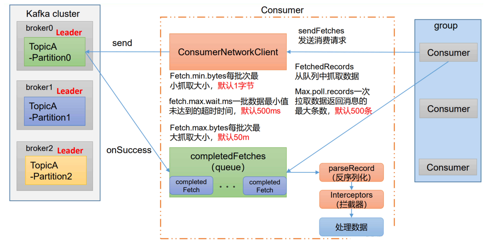

#### 初始化

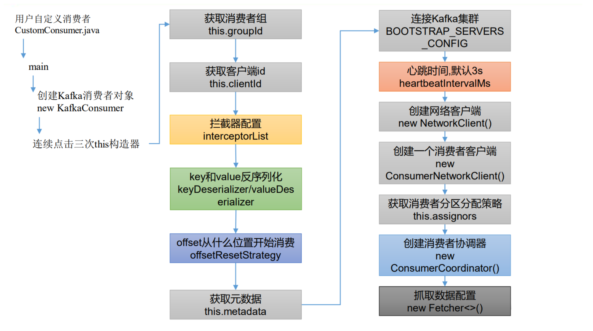

##### 程序入口

```java
// 1、创建消费者的配置对象
Properties properties = new Properties();

// 2、给消费者配置对象添加参数
properties.put(ConsumerConfig.BOOTSTRAP_SERVERS_CONFIG, "192.168.228.147:9092,192.168.228.148:9092,192.168.228.149:9092");

// 配置序列化，必须
properties.put(ConsumerConfig.KEY_DESERIALIZER_CLASS_CONFIG, StringDeserializer.class.getName());
properties.put(ConsumerConfig.VALUE_DESERIALIZER_CLASS_CONFIG, StringDeserializer.class.getName());

ArrayList<String> startegys = new ArrayList<>();
startegys.add(StickyAssignor.class.getName());
properties.put(ConsumerConfig.PARTITION_ASSIGNMENT_STRATEGY_CONFIG, startegys);

// 配置消费者组（组名任意起）必须
properties.put(ConsumerConfig.GROUP_ID_CONFIG, "test");

// 手动提交
properties.put(ConsumerConfig.ENABLE_AUTO_COMMIT_CONFIG,false);

// 创建消费者对象
KafkaConsumer<String, String> kafkaConsumer = new KafkaConsumer<String, String>(properties);

// 注册要消费的主题（可以消费多个主题）
ArrayList<String> topics = new ArrayList<>();
topics.add("first");
kafkaConsumer.subscribe(topics);

// 拉取数据打印
while (true) {
    // 设置1s中消费一批数据
    ConsumerRecords<String, String> consumerRecords = kafkaConsumer.poll(Duration.ofSeconds(1));
    // 打印消费到的数据
    for (ConsumerRecord<String, String> consumerRecord : consumerRecords) {
        System.out.println(consumerRecord);
    }
    kafkaConsumer.commitSync();
    // kafkaConsumer.commitAsync();
}
```

##### 消费者初始化

构造方法重载

```java
public KafkaConsumer(Properties properties) {
    this(properties, null, null);
}
public KafkaConsumer(Properties properties,
                     Deserializer<K> keyDeserializer,
                     Deserializer<V> valueDeserializer) {
    this(Utils.propsToMap(properties), keyDeserializer, valueDeserializer);
}
public KafkaConsumer(Map<String, Object> configs,
                     Deserializer<K> keyDeserializer,
                     Deserializer<V> valueDeserializer) {
    this(new ConsumerConfig(ConsumerConfig.appendDeserializerToConfig(configs, keyDeserializer, valueDeserializer)),
            keyDeserializer, valueDeserializer);
}

KafkaConsumer(ConsumerConfig config, Deserializer<K> keyDeserializer, Deserializer<V> valueDeserializer) {
    try {
        GroupRebalanceConfig groupRebalanceConfig = new GroupRebalanceConfig(config,
                GroupRebalanceConfig.ProtocolType.CONSUMER);

        // 消费组id
        this.groupId = Optional.ofNullable(groupRebalanceConfig.groupId);

        // 客户端id
        this.clientId = config.getString(CommonClientConfigs.CLIENT_ID_CONFIG);

        LogContext logContext;

        // If group.instance.id is set, we will append it to the log context.
        if (groupRebalanceConfig.groupInstanceId.isPresent()) {
            logContext = new LogContext("[Consumer instanceId=" + groupRebalanceConfig.groupInstanceId.get() +
                    ", clientId=" + clientId + ", groupId=" + groupId.orElse("null") + "] ");
        } else {
            logContext = new LogContext("[Consumer clientId=" + clientId + ", groupId=" + groupId.orElse("null") + "] ");
        }

        this.log = logContext.logger(getClass());
        boolean enableAutoCommit = config.maybeOverrideEnableAutoCommit();
        groupId.ifPresent(groupIdStr -> {
            if (groupIdStr.isEmpty()) {
                log.warn("Support for using the empty group id by consumers is deprecated and will be removed in the next major release.");
            }
        });

        log.debug("Initializing the Kafka consumer");

        // 等待服务端响应的最大等待时间，默认30s
        this.requestTimeoutMs = config.getInt(ConsumerConfig.REQUEST_TIMEOUT_MS_CONFIG);
        this.defaultApiTimeoutMs = config.getInt(ConsumerConfig.DEFAULT_API_TIMEOUT_MS_CONFIG);
        this.time = Time.SYSTEM;
        this.metrics = buildMetrics(config, time, clientId);

        // 重试间隔
        this.retryBackoffMs = config.getLong(ConsumerConfig.RETRY_BACKOFF_MS_CONFIG);

        // 拦截器
        List<ConsumerInterceptor<K, V>> interceptorList = (List) config.getConfiguredInstances(
                ConsumerConfig.INTERCEPTOR_CLASSES_CONFIG,
                ConsumerInterceptor.class,
                Collections.singletonMap(ConsumerConfig.CLIENT_ID_CONFIG, clientId));
        this.interceptors = new ConsumerInterceptors<>(interceptorList);

        // key的反序列化
        if (keyDeserializer == null) {
            this.keyDeserializer = config.getConfiguredInstance(ConsumerConfig.KEY_DESERIALIZER_CLASS_CONFIG, Deserializer.class);
            this.keyDeserializer.configure(config.originals(Collections.singletonMap(ConsumerConfig.CLIENT_ID_CONFIG, clientId)), true);
        } else {
            config.ignore(ConsumerConfig.KEY_DESERIALIZER_CLASS_CONFIG);
            this.keyDeserializer = keyDeserializer;
        }

        // value的反序列化
        if (valueDeserializer == null) {
            this.valueDeserializer = config.getConfiguredInstance(ConsumerConfig.VALUE_DESERIALIZER_CLASS_CONFIG, Deserializer.class);
            this.valueDeserializer.configure(config.originals(Collections.singletonMap(ConsumerConfig.CLIENT_ID_CONFIG, clientId)), false);
        } else {
            config.ignore(ConsumerConfig.VALUE_DESERIALIZER_CLASS_CONFIG);
            this.valueDeserializer = valueDeserializer;
        }

        // offset从什么为止开始消费，默认latest
        OffsetResetStrategy offsetResetStrategy = OffsetResetStrategy.valueOf(config.getString(ConsumerConfig.AUTO_OFFSET_RESET_CONFIG).toUpperCase(Locale.ROOT));

        // 创建订阅的对象，封装订阅信息
        this.subscriptions = new SubscriptionState(logContext, offsetResetStrategy);
        ClusterResourceListeners clusterResourceListeners = configureClusterResourceListeners(keyDeserializer,
                valueDeserializer, metrics.reporters(), interceptorList);

        /*
            获取集群元数据
            配置是否可以消费系统主题数据
            配置是否允许自动创建主题
        */
        this.metadata = new ConsumerMetadata(retryBackoffMs,
                config.getLong(ConsumerConfig.METADATA_MAX_AGE_CONFIG),
                !config.getBoolean(ConsumerConfig.EXCLUDE_INTERNAL_TOPICS_CONFIG),
                config.getBoolean(ConsumerConfig.ALLOW_AUTO_CREATE_TOPICS_CONFIG),
                subscriptions, logContext, clusterResourceListeners);

        // 配置连接的 kafka 集群
        List<InetSocketAddress> addresses = ClientUtils.parseAndValidateAddresses(
                config.getList(ConsumerConfig.BOOTSTRAP_SERVERS_CONFIG), config.getString(ConsumerConfig.CLIENT_DNS_LOOKUP_CONFIG));
        this.metadata.bootstrap(addresses);
        String metricGrpPrefix = "consumer";

        FetcherMetricsRegistry metricsRegistry = new FetcherMetricsRegistry(Collections.singleton(CLIENT_ID_METRIC_TAG), metricGrpPrefix);

        // 创建Channel的构建器
        ChannelBuilder channelBuilder = ClientUtils.createChannelBuilder(config, time, logContext);

        // 设置隔离级别
        this.isolationLevel = IsolationLevel.valueOf(
                config.getString(ConsumerConfig.ISOLATION_LEVEL_CONFIG).toUpperCase(Locale.ROOT));
        Sensor throttleTimeSensor = Fetcher.throttleTimeSensor(metrics, metricsRegistry);

        // 心跳时间，默认3秒
        int heartbeatIntervalMs = config.getInt(ConsumerConfig.HEARTBEAT_INTERVAL_MS_CONFIG);

        ApiVersions apiVersions = new ApiVersions();

        // 创建网络客户端
        NetworkClient netClient = new NetworkClient(
                new Selector(config.getLong(ConsumerConfig.CONNECTIONS_MAX_IDLE_MS_CONFIG), metrics, time, metricGrpPrefix, channelBuilder, logContext),
                this.metadata,
                clientId,
                100, // a fixed large enough value will suffice for max in-flight requests
                config.getLong(ConsumerConfig.RECONNECT_BACKOFF_MS_CONFIG),
                config.getLong(ConsumerConfig.RECONNECT_BACKOFF_MAX_MS_CONFIG),
                config.getInt(ConsumerConfig.SEND_BUFFER_CONFIG),
                config.getInt(ConsumerConfig.RECEIVE_BUFFER_CONFIG),
                config.getInt(ConsumerConfig.REQUEST_TIMEOUT_MS_CONFIG),
                config.getLong(ConsumerConfig.SOCKET_CONNECTION_SETUP_TIMEOUT_MS_CONFIG),
                config.getLong(ConsumerConfig.SOCKET_CONNECTION_SETUP_TIMEOUT_MAX_MS_CONFIG),
                time,
                true,
                apiVersions,
                throttleTimeSensor,
                logContext);

        // 创建消费者网络客户端
        this.client = new ConsumerNetworkClient(
                logContext,
                netClient,
                metadata,
                time,
                retryBackoffMs,
                config.getInt(ConsumerConfig.REQUEST_TIMEOUT_MS_CONFIG),
                heartbeatIntervalMs); //Will avoid blocking an extended period of time to prevent heartbeat thread starvation

        // 消费者分区的分配策略
        this.assignors = ConsumerPartitionAssignor.getAssignorInstances(
                config.getList(ConsumerConfig.PARTITION_ASSIGNMENT_STRATEGY_CONFIG),
                config.originals(Collections.singletonMap(ConsumerConfig.CLIENT_ID_CONFIG, clientId))
        );

        // no coordinator will be constructed for the default (null) group id
        // offset协调者，自动提交 offset 时间间隔，默认5s
        this.coordinator = !groupId.isPresent() ? null :
            new ConsumerCoordinator(groupRebalanceConfig,
                    logContext,
                    this.client,
                    assignors,
                    this.metadata,
                    this.subscriptions,
                    metrics,
                    metricGrpPrefix,
                    this.time,
                    enableAutoCommit,
                    config.getInt(ConsumerConfig.AUTO_COMMIT_INTERVAL_MS_CONFIG),
                    this.interceptors,
                    config.getBoolean(ConsumerConfig.THROW_ON_FETCH_STABLE_OFFSET_UNSUPPORTED));

        // 通过网络获取数据配置
        this.fetcher = new Fetcher<>(
                logContext,
                this.client,
                // 一次抓取最小值，默认 1 个字节
                config.getInt(ConsumerConfig.FETCH_MIN_BYTES_CONFIG),
                // 一次抓取最大值，默认 50m
                config.getInt(ConsumerConfig.FETCH_MAX_BYTES_CONFIG),
                // 一次抓取最大等待时间，默认 500ms
                config.getInt(ConsumerConfig.FETCH_MAX_WAIT_MS_CONFIG),
                // 每个分区抓取的最大字节数，默认 1m
                config.getInt(ConsumerConfig.MAX_PARTITION_FETCH_BYTES_CONFIG),
                // 一次 poll 拉取数据返回消息的最大条数，默认是 500 条。
                config.getInt(ConsumerConfig.MAX_POLL_RECORDS_CONFIG),
                config.getBoolean(ConsumerConfig.CHECK_CRCS_CONFIG),
                config.getString(ConsumerConfig.CLIENT_RACK_CONFIG),
                // key 和 value 的反序列化
                this.keyDeserializer,
                this.valueDeserializer,
                this.metadata,
                this.subscriptions,
                metrics,
                metricsRegistry,
                this.time,
                this.retryBackoffMs,
                this.requestTimeoutMs,
                isolationLevel,
                apiVersions);

        this.kafkaConsumerMetrics = new KafkaConsumerMetrics(metrics, metricGrpPrefix);

        config.logUnused();
        AppInfoParser.registerAppInfo(JMX_PREFIX, clientId, metrics, time.milliseconds());
        log.debug("Kafka consumer initialized");
    } catch (Throwable t) {
        ......
    }
}
```

#### 订阅主题

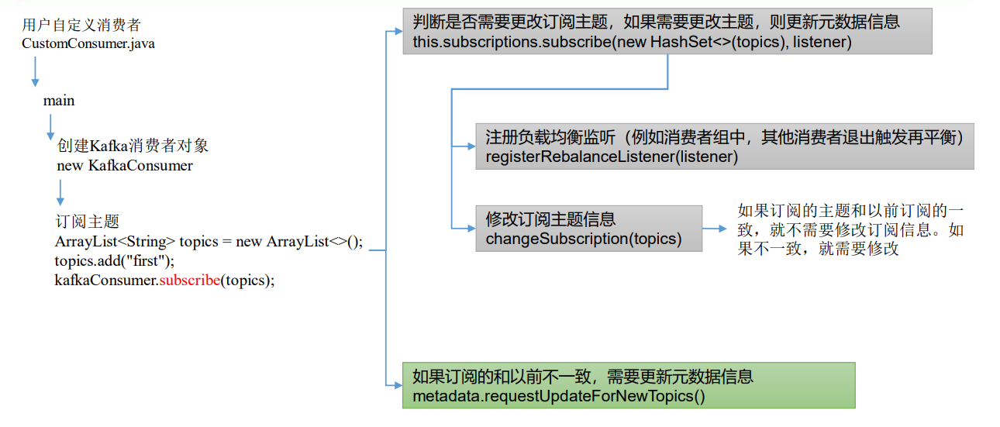

程序入口：

```java
// 订阅主题 first
ArrayList<String> topics = new ArrayList<>();
topics.add("first");
kafkaConsumer.subscribe(topics);
```

`org.apache.kafka.clients.consumer.KafkaConsumer#subscribe`：

```java
public void subscribe(Collection<String> topics) {
    subscribe(topics, new NoOpConsumerRebalanceListener());
}

public void subscribe(Collection<String> topics, ConsumerRebalanceListener listener) {
    acquireAndEnsureOpen();
    try {
        maybeThrowInvalidGroupIdException();
        if (topics == null)
            throw new IllegalArgumentException("Topic collection to subscribe to cannot be null");
        if (topics.isEmpty()) {
            // treat subscribing to empty topic list as the same as unsubscribing
            this.unsubscribe();
        } else {
            for (String topic : topics) {
                if (topic == null || topic.trim().isEmpty())
                    throw new IllegalArgumentException("Topic collection to subscribe to cannot contain null or empty topic");
            }

            throwIfNoAssignorsConfigured();

            // 情况订阅异常主题的缓存数据
            fetcher.clearBufferedDataForUnassignedTopics(topics);
            log.info("Subscribed to topic(s): {}", Utils.join(topics, ", "));

            // 判断是否需要更改订阅主题，如果需要，则更新元数据信息
            if (this.subscriptions.subscribe(new HashSet<>(topics), listener))
                metadata.requestUpdateForNewTopics();
        }
    } finally {
        release();
    }
}
```

`org.apache.kafka.clients.consumer.internals.SubscriptionState#subscribe`：

```java
public synchronized boolean subscribe(Set<String> topics, ConsumerRebalanceListener listener) {

    // 注册负载均衡监听（例如在消费组组中，其它消费者退出，触发再平衡）
    registerRebalanceListener(listener);

    // 按照设置的主题开始订阅，自动分配分区策略
    setSubscriptionType(SubscriptionType.AUTO_TOPICS);

    // 修改订阅主题信息
    return changeSubscription(topics);
}

private boolean changeSubscription(Set<String> topicsToSubscribe) {

    // 如果订阅的主题和以前订阅的一致，就不需要修改订阅信息。如果不一致，就需要修改
    if (subscription.equals(topicsToSubscribe))
        return false;

    subscription = topicsToSubscribe;
    return true;
}
```

`org.apache.kafka.clients.Metadata#requestUpdateForNewTopics`：

```java
// 如果订阅的和以前不一致，需要更新元数据信息
public synchronized int requestUpdateForNewTopics() {
    // Override the timestamp of last refresh to let immediate update.
    this.lastRefreshMs = 0;
    this.needPartialUpdate = true;
    this.requestVersion++;
    return this.updateVersion;
}
```

#### 拉取和处理数据

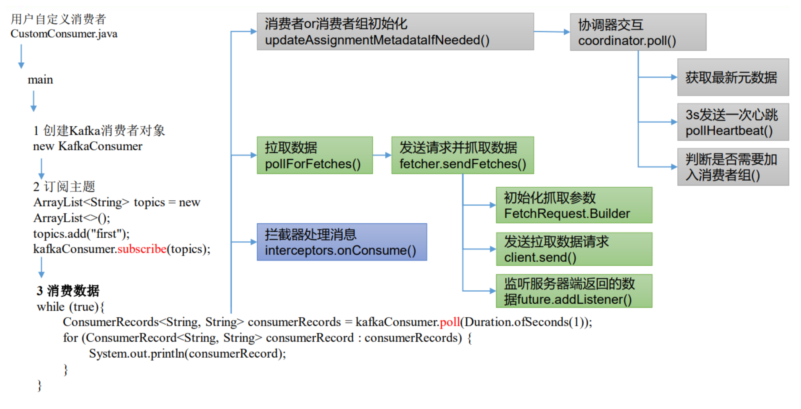

##### 消费总体流程源码

程序入口：

```java
ConsumerRecords<String, String> consumerRecords = kafkaConsumer.poll(Duration.ofSeconds(1));
```

`org.apache.kafka.clients.consumer.KafkaConsumer#poll`：

```java
public ConsumerRecords<K, V> poll(final Duration timeout) {
    return poll(time.timer(timeout), true);
}

private ConsumerRecords<K, V> poll(final Timer timer, final boolean includeMetadataInTimeout) {
    acquireAndEnsureOpen();
    try {

        // 记录开始拉取消息时间
        this.kafkaConsumerMetrics.recordPollStart(timer.currentTimeMs());

        if (this.subscriptions.hasNoSubscriptionOrUserAssignment()) {
            throw new IllegalStateException("Consumer is not subscribed to any topics or assigned any partitions");
        }

        do {
            client.maybeTriggerWakeup();

            if (includeMetadataInTimeout) {
                // try to update assignment metadata BUT do not need to block on the timer for join group

                // 1、消费者 or 消费者组初始化
                updateAssignmentMetadataIfNeeded(timer, false);
            } else {
                while (!updateAssignmentMetadataIfNeeded(time.timer(Long.MAX_VALUE), true)) {
                    log.warn("Still waiting for metadata");
                }
            }

            // 2、开始拉取数据，数据从服务器端获取后，放入集合中缓存
            final Map<TopicPartition, List<ConsumerRecord<K, V>>> records = pollForFetches(timer);
            if (!records.isEmpty()) {
                // before returning the fetched records, we can send off the next round of fetches
                // and avoid block waiting for their responses to enable pipelining while the user
                // is handling the fetched records.
                //
                // NOTE: since the consumed position has already been updated, we must not allow
                // wakeups or any other errors to be triggered prior to returning the fetched records.
                if (fetcher.sendFetches() > 0 || client.hasPendingRequests()) {
                    client.transmitSends();
                }

                // 3、拦截器处理消息，从集合中拉取数据处理，首先经过的是拦截器
                return this.interceptors.onConsume(new ConsumerRecords<>(records));
            }
        } while (timer.notExpired());

        return ConsumerRecords.empty();
    } finally {
        release();
        this.kafkaConsumerMetrics.recordPollEnd(timer.currentTimeMs());
    }
}
```

##### 消费者/消费者组初始化

`org.apache.kafka.clients.consumer.KafkaConsumer#updateAssignmentMetadataIfNeeded`：

```java
boolean updateAssignmentMetadataIfNeeded(final Timer timer, final boolean waitForJoinGroup) {
    if (coordinator != null && !coordinator.poll(timer, waitForJoinGroup)) {
        return false;
    }

    return updateFetchPositions(timer);
}
```

`org.apache.kafka.clients.consumer.internals.ConsumerCoordinator#poll`:

```java
public boolean poll(Timer timer, boolean waitForJoinGroup) {

    // 获取最新元数据
    maybeUpdateSubscriptionMetadata();

    invokeCompletedOffsetCommitCallbacks();

    if (subscriptions.hasAutoAssignedPartitions()) {
        if (protocol == null) {
            throw new IllegalStateException("User configured " + ConsumerConfig.PARTITION_ASSIGNMENT_STRATEGY_CONFIG +
                " to empty while trying to subscribe for group protocol to auto assign partitions");
        }

        // 3s 发送一次心跳
        pollHeartbeat(timer.currentTimeMs());

        // 保证和 Coordinator 正常通信（寻找服务器端的 Coordinator）
        if (coordinatorUnknown() && !ensureCoordinatorReady(timer)) {
            return false;
        }

        // 判断是否需要加入消费者组
        if (rejoinNeededOrPending()) {
            if (subscriptions.hasPatternSubscription()) {
                if (this.metadata.timeToAllowUpdate(timer.currentTimeMs()) == 0) {
                    this.metadata.requestUpdate();
                }

                if (!client.ensureFreshMetadata(timer)) {
                    return false;
                }

                maybeUpdateSubscriptionMetadata();
            }

            // if not wait for join group, we would just use a timer of 0
            if (!ensureActiveGroup(waitForJoinGroup ? timer : time.timer(0L))) {
                return false;
            }
        }
    } else {
        if (metadata.updateRequested() && !client.hasReadyNodes(timer.currentTimeMs())) {
            client.awaitMetadataUpdate(timer);
        }
    }

    // 是否自动提交 offset
    maybeAutoCommitOffsetsAsync(timer.currentTimeMs());
    return true;
}
```

`org.apache.kafka.clients.consumer.internals.AbstractCoordinator#ensureCoordinatorReady`：

```java
protected synchronized boolean ensureCoordinatorReady(final Timer timer) {

    // 如果找到 Coordinator 直接返回
    if (!coordinatorUnknown())
        return true;

    // 如果没有找到，循环给服务器端发送请求，直到找到 Coordinator
    do {
        if (findCoordinatorException != null && !(findCoordinatorException instanceof RetriableException)) {
            final RuntimeException fatalException = findCoordinatorException;
            findCoordinatorException = null;
            throw fatalException;
        }

        // 创建寻找 coordinator 的请求
        final RequestFuture<Void> future = lookupCoordinator();

        // 发送寻找 coordinator 的请求给服务器端
        client.poll(future, timer);

        if (!future.isDone()) {
            // ran out of time
            break;
        }

        if (future.failed()) {
            if (future.isRetriable()) {
                log.debug("Coordinator discovery failed, refreshing metadata");
                client.awaitMetadataUpdate(timer);
            } else
                throw future.exception();
        } else if (coordinator != null && client.isUnavailable(coordinator)) {
            // we found the coordinator, but the connection has failed, so mark
            // it dead and backoff before retrying discovery
            markCoordinatorUnknown();
            timer.sleep(rebalanceConfig.retryBackoffMs);
        }
    } while (coordinatorUnknown() && timer.notExpired());

    return !coordinatorUnknown();
}

protected synchronized RequestFuture<Void> lookupCoordinator() {
    if (findCoordinatorFuture == null) {
        // find a node to ask about the coordinator
        Node node = this.client.leastLoadedNode();
        if (node == null) {
            log.debug("No broker available to send FindCoordinator request");
            return RequestFuture.noBrokersAvailable();
        } else {

            // 向服务器端发送，查找 Coordinator 请求
            findCoordinatorFuture = sendFindCoordinatorRequest(node);
            // remember the exception even after the future is cleared so that
            // it can still be thrown by the ensureCoordinatorReady caller
            findCoordinatorFuture.addListener(new RequestFutureListener<Void>() {
                @Override
                public void onSuccess(Void value) {} // do nothing

                @Override
                public void onFailure(RuntimeException e) {
                    findCoordinatorException = e;
                }
            });
        }
    }
    return findCoordinatorFuture;
}

private RequestFuture<Void> sendFindCoordinatorRequest(Node node) {
    // initiate the group metadata request
    log.debug("Sending FindCoordinator request to broker {}", node);

    // 封装发送请求
    FindCoordinatorRequest.Builder requestBuilder =
            new FindCoordinatorRequest.Builder(
                    new FindCoordinatorRequestData()
                        .setKeyType(CoordinatorType.GROUP.id())
                        .setKey(this.rebalanceConfig.groupId));

    // 消费者向服务器端发送请求
    return client.send(node, requestBuilder)
            .compose(new FindCoordinatorResponseHandler());
}
```

##### 拉取数据

```java
private Map<TopicPartition, List<ConsumerRecord<K, V>>> pollForFetches(Timer timer) {
    long pollTimeout = coordinator == null ? timer.remainingMs() :
            Math.min(coordinator.timeToNextPoll(timer.currentTimeMs()), timer.remainingMs());

    // if data is available already, return it immediately
    final Map<TopicPartition, List<ConsumerRecord<K, V>>> records = fetcher.fetchedRecords();
    if (!records.isEmpty()) {
        return records;
    }

    // send any new fetches (won't resend pending fetches)：发送任何新的信息（不会重新发送挂起的信息）
    // 1、发送请求并抓取数据
    fetcher.sendFetches();

    // We do not want to be stuck blocking in poll if we are missing some positions
    // since the offset lookup may be backing off after a failure

    // NOTE: the use of cachedSubscriptionHashAllFetchPositions means we MUST call
    // updateAssignmentMetadataIfNeeded before this method.
    if (!cachedSubscriptionHashAllFetchPositions && pollTimeout > retryBackoffMs) {
        pollTimeout = retryBackoffMs;
    }

    Timer pollTimer = time.timer(pollTimeout);
    client.poll(pollTimer, () -> {
        // since a fetch might be completed by the background thread, we need this poll condition
        // to ensure that we do not block unnecessarily in poll()
        return !fetcher.hasAvailableFetches();
    });
    timer.update(pollTimer.currentTimeMs());

    // 2、将数据按照分区封装好后，一次处理默认 500 条数据
    return fetcher.fetchedRecords();
}
```

1. 发送请求并抓取数据：

```java
public synchronized int sendFetches() {
    // Update metrics in case there was an assignment change
    sensors.maybeUpdateAssignment(subscriptions);

    Map<Node, FetchSessionHandler.FetchRequestData> fetchRequestMap = prepareFetchRequests();
    for (Map.Entry<Node, FetchSessionHandler.FetchRequestData> entry : fetchRequestMap.entrySet()) {
        final Node fetchTarget = entry.getKey();
        final FetchSessionHandler.FetchRequestData data = entry.getValue();

        /*
            初始化抓取数据的参数：
                this.maxWaitMs：最大等待时间默认 500ms
                this.minBytes：最小抓取一个字节
                this.maxBytes：最大抓取 50m 数据
        */
        final FetchRequest.Builder request = FetchRequest.Builder
                .forConsumer(this.maxWaitMs, this.minBytes, data.toSend())
                .isolationLevel(isolationLevel)
                .setMaxBytes(this.maxBytes)
                .metadata(data.metadata())
                .toForget(data.toForget())
                .rackId(clientRackId);

        if (log.isDebugEnabled()) {
            log.debug("Sending {} {} to broker {}", isolationLevel, data.toString(), fetchTarget);
        }

        // 发送拉取数据请求
        RequestFuture<ClientResponse> future = client.send(fetchTarget, request);

        this.nodesWithPendingFetchRequests.add(entry.getKey().id());

        // 监听服务器端返回的数据
        future.addListener(new RequestFutureListener<ClientResponse>() {
            @Override
            public void onSuccess(ClientResponse resp) {
                //  成功接收服务器端数据
                synchronized (Fetcher.this) {
                    try {
                        @SuppressWarnings("unchecked")
                        // 获取服务器端响应数据
                        FetchResponse<Records> response = (FetchResponse<Records>) resp.responseBody();
                        FetchSessionHandler handler = sessionHandler(fetchTarget.id());
                        if (handler == null) {
                            log.error("Unable to find FetchSessionHandler for node {}. Ignoring fetch response.",
                                    fetchTarget.id());
                            return;
                        }
                        if (!handler.handleResponse(response)) {
                            return;
                        }

                        Set<TopicPartition> partitions = new HashSet<>(response.responseData().keySet());
                        FetchResponseMetricAggregator metricAggregator = new FetchResponseMetricAggregator(sensors, partitions);

                        for (Map.Entry<TopicPartition, FetchResponse.PartitionData<Records>> entry : response.responseData().entrySet()) {
                            TopicPartition partition = entry.getKey();
                            FetchRequest.PartitionData requestData = data.sessionPartitions().get(partition);
                            if (requestData == null) {
                                String message;
                                if (data.metadata().isFull()) {
                                    message = MessageFormatter.arrayFormat(
                                            "Response for missing full request partition: partition={}; metadata={}",
                                            new Object[]{partition, data.metadata()}).getMessage();
                                } else {
                                    message = MessageFormatter.arrayFormat(
                                            "Response for missing session request partition: partition={}; metadata={}; toSend={}; toForget={}",
                                            new Object[]{partition, data.metadata(), data.toSend(), data.toForget()}).getMessage();
                                }

                                // Received fetch response for missing session partition
                                throw new IllegalStateException(message);
                            } else {
                                long fetchOffset = requestData.fetchOffset;
                                FetchResponse.PartitionData<Records> partitionData = entry.getValue();

                                log.debug("Fetch {} at offset {} for partition {} returned fetch data {}",
                                        isolationLevel, fetchOffset, partition, partitionData);

                                Iterator<? extends RecordBatch> batches = partitionData.records.batches().iterator();
                                short responseVersion = resp.requestHeader().apiVersion();

                                /*
                                    private final ConcurrentLinkedQueue<CompletedFetch> completedFetches;
                                    将数据按照分区，添加到消息队列里面
                                */
                                completedFetches.add(new CompletedFetch(partition, partitionData,
                                        metricAggregator, batches, fetchOffset, responseVersion));
                            }
                        }

                        sensors.fetchLatency.record(resp.requestLatencyMs());
                    } finally {
                        nodesWithPendingFetchRequests.remove(fetchTarget.id());
                    }
                }
            }

            @Override
            public void onFailure(RuntimeException e) {
                synchronized (Fetcher.this) {
                    try {
                        FetchSessionHandler handler = sessionHandler(fetchTarget.id());
                        if (handler != null) {
                            handler.handleError(e);
                        }
                    } finally {
                        nodesWithPendingFetchRequests.remove(fetchTarget.id());
                    }
                }
            }
        });

    }
    return fetchRequestMap.size();
}
```

2. 将数据按照分区封装好后，一次处理默认 500 条数据：

```java
public Map<TopicPartition, List<ConsumerRecord<K, V>>> fetchedRecords() {
    Map<TopicPartition, List<ConsumerRecord<K, V>>> fetched = new HashMap<>();
    Queue<CompletedFetch> pausedCompletedFetches = new ArrayDeque<>();

    // 一次处理的最大条数，默认 500 条
    int recordsRemaining = maxPollRecords;

    try {
        // 循环处理
        while (recordsRemaining > 0) {
            if (nextInLineFetch == null || nextInLineFetch.isConsumed) {

                // 从缓存中获取数据
                CompletedFetch records = completedFetches.peek();

                //  缓存中数据为 null,直接跳出循环
                if (records == null) break;

                if (records.notInitialized()) {
                    try {
                        nextInLineFetch = initializeCompletedFetch(records);
                    } catch (Exception e) {
                        FetchResponse.PartitionData partition = records.partitionData;
                        if (fetched.isEmpty() && (partition.records == null || partition.records.sizeInBytes() == 0)) {
                            completedFetches.poll();
                        }
                        throw e;
                    }
                } else {
                    nextInLineFetch = records;
                }

                // 从缓存中拉取数据
                completedFetches.poll();
            } else if (subscriptions.isPaused(nextInLineFetch.partition)) {
                // when the partition is paused we add the records back to the completedFetches queue instead of draining
                // them so that they can be returned on a subsequent poll if the partition is resumed at that time
                log.debug("Skipping fetching records for assigned partition {} because it is paused", nextInLineFetch.partition);
                pausedCompletedFetches.add(nextInLineFetch);
                nextInLineFetch = null;
            } else {
                List<ConsumerRecord<K, V>> records = fetchRecords(nextInLineFetch, recordsRemaining);

                if (!records.isEmpty()) {
                    TopicPartition partition = nextInLineFetch.partition;
                    List<ConsumerRecord<K, V>> currentRecords = fetched.get(partition);
                    if (currentRecords == null) {
                        fetched.put(partition, records);
                    } else {
                        // this case shouldn't usually happen because we only send one fetch at a time per partition,
                        // but it might conceivably happen in some rare cases (such as partition leader changes).
                        // we have to copy to a new list because the old one may be immutable
                        List<ConsumerRecord<K, V>> newRecords = new ArrayList<>(records.size() + currentRecords.size());
                        newRecords.addAll(currentRecords);
                        newRecords.addAll(records);
                        fetched.put(partition, newRecords);
                    }
                    recordsRemaining -= records.size();
                }
            }
        }
    } catch (KafkaException e) {
        if (fetched.isEmpty())
            throw e;
    } finally {
        // add any polled completed fetches for paused partitions back to the completed fetches queue to be
        // re-evaluated in the next poll
        completedFetches.addAll(pausedCompletedFetches);
    }

    return fetched;
}
```

##### 拦截器处理数据

```java
public ConsumerRecords<K, V> onConsume(ConsumerRecords<K, V> records) {
    ConsumerRecords<K, V> interceptRecords = records;
    for (ConsumerInterceptor<K, V> interceptor : this.interceptors) {
        try {
            // 执行拦截器方法 onConsume()
            interceptRecords = interceptor.onConsume(interceptRecords);
        } catch (Exception e) {
            // do not propagate interceptor exception, log and continue calling other interceptors
            log.warn("Error executing interceptor onConsume callback", e);
        }
    }
    return interceptRecords;
}
```

#### offset提交

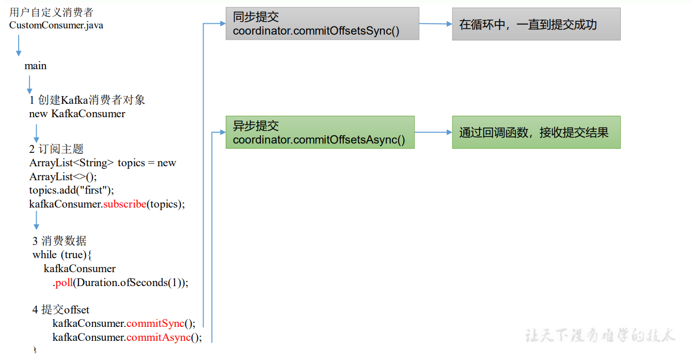

程序入口：

```java
// 手动提交
properties.put(ConsumerConfig.ENABLE_AUTO_COMMIT_CONFIG, false);

// 创建消费者对象
KafkaConsumer<String, String> kafkaConsumer = new KafkaConsumer<String, String>(properties);

// 注册要消费的主题（可以消费多个主题）
ArrayList<String> topics = new ArrayList<>();
topics.add("first");
kafkaConsumer.subscribe(topics);

// 拉取数据打印
while (true) {
    // 设置1s中消费一批数据
    ConsumerRecords<String, String> consumerRecords = kafkaConsumer.poll(Duration.ofSeconds(1));
    // 打印消费到的数据
    for (ConsumerRecord<String, String> consumerRecord : consumerRecords) {
        System.out.println(consumerRecord);
    }
    // 手动提交 offset，同步模式
    kafkaConsumer.commitSync();
    // 手动提交 offset，异步模式
    // kafkaConsumer.commitAsync();
}
```

##### offset手动同步提交

`org.apache.kafka.clients.consumer.KafkaConsumer#commitSync()`：

```java
public void commitSync() {
    commitSync(Duration.ofMillis(defaultApiTimeoutMs));
}

public void commitSync(Duration timeout) {
    acquireAndEnsureOpen();
    try {
        maybeThrowInvalidGroupIdException();

        // 同步提交
        if (!coordinator.commitOffsetsSync(subscriptions.allConsumed(), time.timer(timeout))) {
            throw new TimeoutException("Timeout of " + timeout.toMillis() + "ms expired before successfully " +
                    "committing the current consumed offsets");
        }
    } finally {
        release();
    }
}
```

`org.apache.kafka.clients.consumer.internals.ConsumerCoordinator#commitOffsetsSync`：

```java
public boolean commitOffsetsSync(Map<TopicPartition, OffsetAndMetadata> offsets, Timer timer) {
    invokeCompletedOffsetCommitCallbacks();

    if (offsets.isEmpty())
        return true;

    do {
        if (coordinatorUnknown() && !ensureCoordinatorReady(timer)) {
            return false;
        }

        // 发送提交请求 
        RequestFuture<Void> future = sendOffsetCommitRequest(offsets);
        client.poll(future, timer);

        invokeCompletedOffsetCommitCallbacks();

        // 提交成功
        if (future.succeeded()) {
            if (interceptors != null)
                interceptors.onCommit(offsets);
            return true;
        }

        if (future.failed() && !future.isRetriable())
            throw future.exception();

        timer.sleep(rebalanceConfig.retryBackoffMs);
    } while (timer.notExpired());

    return false;
}
```

##### offset手动异步提交

```java
public void commitAsync() {
    commitAsync(null);
}

public void commitAsync(OffsetCommitCallback callback) {
    commitAsync(subscriptions.allConsumed(), callback);
}

public void commitAsync(final Map<TopicPartition, OffsetAndMetadata> offsets, OffsetCommitCallback callback) {
    acquireAndEnsureOpen();
    try {
        maybeThrowInvalidGroupIdException();
        log.debug("Committing offsets: {}", offsets);
        offsets.forEach(this::updateLastSeenEpochIfNewer);

        // 提交 offset
        coordinator.commitOffsetsAsync(new HashMap<>(offsets), callback);
    } finally {
        release();
    }
}
```

`org.apache.kafka.clients.consumer.internals.ConsumerCoordinator#commitOffsetsAsync`：

```java
public void commitOffsetsAsync(final Map<TopicPartition, OffsetAndMetadata> offsets, final OffsetCommitCallback callback) {
    invokeCompletedOffsetCommitCallbacks();

    if (!coordinatorUnknown()) {
        doCommitOffsetsAsync(offsets, callback);
    } else {
        pendingAsyncCommits.incrementAndGet();

        // 监听提交 offset 的结果
        lookupCoordinator().addListener(new RequestFutureListener<Void>() {
            @Override
            public void onSuccess(Void value) {
                pendingAsyncCommits.decrementAndGet();
                doCommitOffsetsAsync(offsets, callback);
                client.pollNoWakeup();
            }

            @Override
            public void onFailure(RuntimeException e) {
                pendingAsyncCommits.decrementAndGet();
                completedOffsetCommits.add(new OffsetCommitCompletion(callback, offsets,
                        new RetriableCommitFailedException(e)));
            }
        });
    }

    client.pollNoWakeup();
}
```

### 服务器源码

#### Broker 总体工作流程


程序入口：Kafka源码包下的core包下的 Kafka.scala。

## 附录

### Kafka是pull还是push？

生产者使用push模式将消息发布到Broker，消费者使用pull模式从Broker订阅消息。

为什么是这样，首先先来看下不同模式的需要做的事情以及成本：

- Producer：
  
  - 方式一：Producer与Broker之间采用拉（pull）模式
    
    - 如果采用Broker主动拉取消息的模式，Producer就需要在本地保存消息并等待Broker的拉取。这样的设计会对Producer的可靠性提出更高的要求，因为消息的持久性和可靠性不仅取决于Broker，还依赖于每个Producer正确地保存消息。
  
  - 方式二：Producer与Broker之间采用推（push）模式
    
    - Producer将消息直接推送给Broker，这样可以降低Producer的可靠性要求。
    
    - Broker负责保存和管理消息，通过多副本等机制来保证消息的存储可靠性。
    
    - Producer将消息发送给Broker后，可以立即释放对消息的责任，不需要保持本地的日志等待Broker的拉取。

- Consumer：
  
  - 方式一：Consumer与Broker之间采用拉（pull）模式
    
    - 消费者主动发起拉取消息的请求，根据自身的情况来决定拉取消息的起始位置和数量。
    
    - 消费者可以根据自己的节奏和需求，自主决定拉取的速率和频率。
    
    - 拉模式下，Broker只需存储生产者发送的消息，消费者主动发起请求来拉取消息。
    
    - 存在消息延迟，需要消费者定期拉取并控制请求频率。
    
    - 可能出现消费者在没有有效消息的时间段进行无用功的情况。
  
  - 方式二：Consumer与Broker之间采用推（push）模式
    
    - 消息的实时性高和对消费者使用简单。
    
    - 缺点是Broker需要维护每个消费者的状态以进行推送速率的调整，难以平衡每个消费者的推送速率。
    
    - 当Broker推送速率远大于消费者消费速率时，可能导致消费者无法跟上消息的崩溃情况。
    
    - 实现消息回溯较为困难。

### 搭建集群

修改三处配置`vim config/server.properties`：

```text
broker.id=0

log.dirs=/mydata/kafka/data/logs

zookeeper.connect=192.168.44.129:2181,192.168.44.131:2181,192.168.44.132:2181/kafka
```

### Kafka 命令行

```txt
# ----------------------kafka-console-producer.sh----------------------------
# 连接 Broker，并指定要往哪个主题写数据
[root@server7 bin]# ./kafka-console-producer.sh --bootstrap-server 192.168.44.132:9092 --topic sanguo

# ----------------------kafka-topics.sh----------------------------
# 查看所有主题
[root@192 bin]# ./kafka-topics.sh --bootstrap-server 192.168.44.132:9092 --list

# 创建一个名为 sanguo 的主题，1 个分区，3 个副本
[root@192 bin]# ./kafka-topics.sh --bootstrap-server 192.168.44.132:9092 --topic sanguo --create --partitions 1 --replication-factor 3

# 查看名为 sanguo 主题的详细信息
[root@192 bin]# ./kafka-topics.sh --bootstrap-server 192.168.44.132:9092 --topic sanguo --describe
Topic: sanguo    TopicId: EJah9n4zQFSGZq4xg7HW1g    PartitionCount: 1    ReplicationFactor: 3    Configs: segment.bytes=1073741824
    Topic: sanguo    Partition: 0    Leader: 1    Replicas: 1,0,2    Isr: 1,0,2
# Partition：1 个分区，从0开始。broker.id=1 的是 Leader。Replicas：副本分散在三台服务器上

[root@192 bin]# ./kafka-topics.sh --bootstrap-server 192.168.44.132:9092 --topic sanguo --alter --partitions 3

# ----------------------kafka-console-consumer.sh----------------------------
# 连接 Broker，并指定要往哪个主题读数据，`--from-beginning`参数可以读取历史数据
[root@192 bin]# ./kafka-console-consumer.sh --bootstrap-server 192.168.44.132:9092 --topic sanguo --from-beginning


# Kafka 服务端启动
/mydata/kafka/bin/kafka-server-start.sh -daemon /mydata/kafka/config/server.properties
```

#### 主题命令行操作

```shell
[root@server7kafka]$ bin/kafka-topics.sh [option]
```

| 参数                                                 | 描述                           |
| -------------------------------------------------- | ---------------------------- |
| --bootstrap-server <String: server to connect to>  | 连接 Kafka Broker 的 ip:prot 地址 |
| --topic <String: topic>                            | 指定需要操作的 topic 名称             |
| --create                                           | 创建主题                         |
| --delete                                           | 删除主题                         |
| --alter                                            | 修改主题                         |
| --list                                             | 查看所有主题                       |
| --describe                                         | 查看 主题消息描述                    |
| --partitions <Integer: # of partitions>            | 设置分区数                        |
| --replication-factor <Integer: replication factor> | 设置分区副本                       |
| --config <String: name=value>                      | 更新系统默认的配置                    |

#### 生产者命令行操作

```shell
[root@server7kafka]$ bin/kafka-console-producer.sh [option]
```

| 参数                                               | 描述                         |
| ------------------------------------------------ | -------------------------- |
| --bootstrap-server <String: server toconnect to> | 连接的 Kafka Broker 主机名称和端口号。 |
| --topic <String: topic>                          | 操作的 topic 名称。              |

#### 消费者命令行操作

```shell
[root@server7kafka]$ bin/kafka-console-consumer.sh [option]
```

| 参数                                               | 描述                         |
| ------------------------------------------------ | -------------------------- |
| --bootstrap-server <String: server toconnect to> | 连接的 Kafka Broker 主机名称和端口号。 |
| --topic <String: topic>                          | 操作的 topic 名称。              |
| --from-beginning                                 | 从头开始消费。                    |
| --group <String: consumer group id>              | 指定消费者组名称。                  |

### 启动脚本

```shell
#!/bin/bash

kafkaServers='192.168.44.129 192.168.44.131 192.168.44.132'
case $1 in 
"start")
    for k in $kafkaServers
    do
            echo ---------- Kafka $k 启动 ----------
            ssh $k "/mydata/kafka/bin/kafka-server-start.sh -daemon /mydata/kafka/config/server.properties"
    done
;;
"stop")
    for k in $kafkaServers
    do
            echo ---------- Kafka $k 停止 ----------
            ssh $k "/mydata/kafka/bin/kafka-server-stop.sh "
    done
;;
esac
```

### 生产者

#### Sender线程run方法

```java
/**
 * The main run loop for the sender thread
 */
@Override
public void run() {
    log.debug("Starting Kafka producer I/O thread.");

    // main loop, runs until close is called
    while (running) {
        try {
            // sender 线程从缓冲区准备拉取数据，刚启动拉不到数据
            runOnce();
        } catch (Exception e) {
            log.error("Uncaught error in kafka producer I/O thread: ", e);
        }
    }

    log.debug("Beginning shutdown of Kafka producer I/O thread, sending remaining records.");

    // okay we stopped accepting requests but there may still be
    // requests in the transaction manager, accumulator or waiting for acknowledgment,
    // wait until these are completed.
    while (!forceClose && ((this.accumulator.hasUndrained() || this.client.inFlightRequestCount() > 0) || hasPendingTransactionalRequests())) {
        try {
            runOnce();
        } catch (Exception e) {
            log.error("Uncaught error in kafka producer I/O thread: ", e);
        }
    }

    // Abort the transaction if any commit or abort didn't go through the transaction manager's queue
    while (!forceClose && transactionManager != null && transactionManager.hasOngoingTransaction()) {
        if (!transactionManager.isCompleting()) {
            log.info("Aborting incomplete transaction due to shutdown");
            transactionManager.beginAbort();
        }
        try {
            runOnce();
        } catch (Exception e) {
            log.error("Uncaught error in kafka producer I/O thread: ", e);
        }
    }

    if (forceClose) {
        // We need to fail all the incomplete transactional requests and batches and wake up the threads waiting on
        // the futures.
        if (transactionManager != null) {
            log.debug("Aborting incomplete transactional requests due to forced shutdown");
            transactionManager.close();
        }
        log.debug("Aborting incomplete batches due to forced shutdown");
        this.accumulator.abortIncompleteBatches();
    }
    try {
        this.client.close();
    } catch (Exception e) {
        log.error("Failed to close network client", e);
    }

    log.debug("Shutdown of Kafka producer I/O thread has completed.");
}
```

#### 拦截器的执行

```java
public ProducerRecord<K, V> onSend(ProducerRecord<K, V> record) {
    ProducerRecord<K, V> interceptRecord = record;

    // 遍历拦截器
    for (ProducerInterceptor<K, V> interceptor : this.interceptors) {
        try {
            // 拦截器处理
            interceptRecord = interceptor.onSend(interceptRecord);
        } catch (Exception e) {
            // do not propagate interceptor exception, log and continue calling other interceptors
            // be careful not to throw exception from here
            if (record != null)
                log.warn("Error executing interceptor onSend callback for topic: {}, partition: {}", record.topic(), record.partition(), e);
            else
                log.warn("Error executing interceptor onSend callback", e);
        }
    }
    return interceptRecord;
}
```

#### 分区策略

```java
private int partition(ProducerRecord<K, V> record, byte[] serializedKey, byte[] serializedValue, Cluster cluster) {
    Integer partition = record.partition();
    return partition != null ?
            partition :
            partitioner.partition(
                    record.topic(), record.key(), serializedKey, record.value(), serializedValue, cluster);
}
```

默认分区是 DefaultPartitioner。

```java
public int partition(String topic, Object key, byte[] keyBytes, Object value, byte[] valueBytes, Cluster cluster) {
    return partition(topic, key, keyBytes, value, valueBytes, cluster, cluster.partitionsForTopic(topic).size());
}

public int partition(String topic, Object key, byte[] keyBytes, Object value, byte[] valueBytes, Cluster cluster,
                     int numPartitions) {
    // 没有指定key，按粘性分区处理
    if (keyBytes == null) {
        return stickyPartitionCache.partition(topic, cluster);
    }
    // hash the keyBytes to choose a partition

    // 执行key，按key的hashcode对分区数取余
    return Utils.toPositive(Utils.murmur2(keyBytes)) % numPartitions;
}
```

#### 校验发送消息大小

```java
private void ensureValidRecordSize(int size) {
    // 一次请求获取消息的最大值，默认是 1m
    if (size > maxRequestSize)
        throw new RecordTooLargeException("The message is " + size +
                " bytes when serialized which is larger than " + maxRequestSize + ", which is the value of the " +
                ProducerConfig.MAX_REQUEST_SIZE_CONFIG + " configuration.");

    // 缓冲区内存总大小，默认 32m
    if (size > totalMemorySize)
        throw new RecordTooLargeException("The message is " + size +
                " bytes when serialized which is larger than the total memory buffer you have configured with the " +
                ProducerConfig.BUFFER_MEMORY_CONFIG +
                " configuration.");
}
```

#### 缓冲区

向缓冲区发送数据，双端队列，内存默认 32m，默认 16k 一个批次

```java
public RecordAppendResult append(TopicPartition tp,
                                     long timestamp,
                                     byte[] key,
                                     byte[] value,
                                     Header[] headers,
                                     Callback callback,
                                     long maxTimeToBlock,
                                     boolean abortOnNewBatch,
                                     long nowMs) throws InterruptedException {
    // We keep track of the number of appending thread to make sure we do not miss batches in
    // abortIncompleteBatches().
    appendsInProgress.incrementAndGet();
    ByteBuffer buffer = null;
    if (headers == null) headers = Record.EMPTY_HEADERS;

    // 生产者是多线程的，所以下面采用加锁synchronized和双重追加数据检查机制tryAppend处理Deque
    try {
        // check if we have an in-progress batch

        // 为每个分区创建或者获取一个队列
        Deque<ProducerBatch> dq = getOrCreateDeque(tp);
        synchronized (dq) {
            if (closed)
                throw new KafkaException("Producer closed while send in progress");

            // 第一次尝试：尝试向队列中添加数据，（没有分配内存、批次对象，所以添加失败）
            RecordAppendResult appendResult = tryAppend(timestamp, key, value, headers, callback, dq, nowMs);
            if (appendResult != null)
                return appendResult;
        }

        // we don't have an in-progress record batch try to allocate a new batch
        if (abortOnNewBatch) {
            // Return a result that will cause another call to append.
            return new RecordAppendResult(null, false, false, true);
        }

        byte maxUsableMagic = apiVersions.maxUsableProduceMagic();

        // batchSize和一次请求的大小比较，返回较大的。（可能一条请求的大小大于批次大小。）
        int size = Math.max(this.batchSize, AbstractRecords.estimateSizeInBytesUpperBound(maxUsableMagic, compression, key, value, headers));
        log.trace("Allocating a new {} byte message buffer for topic {} partition {} with remaining timeout {}ms", size, tp.topic(), tp.partition(), maxTimeToBlock);

        // 分配内存
        buffer = free.allocate(size, maxTimeToBlock);

        // Update the current time in case the buffer allocation blocked above.
        nowMs = time.milliseconds();
        synchronized (dq) {
            // Need to check if producer is closed again after grabbing the dequeue lock.
            if (closed)
                throw new KafkaException("Producer closed while send in progress");

            // 第二次尝试：尝试向队列中添加数据，已分配内存，但是没有批次对象
            RecordAppendResult appendResult = tryAppend(timestamp, key, value, headers, callback, dq, nowMs);
            if (appendResult != null) {
                // Somebody else found us a batch, return the one we waited for! Hopefully this doesn't happen often...
                return appendResult;
            }

            // 根据内存大小封装批次（有内存，有批次对象）
            MemoryRecordsBuilder recordsBuilder = recordsBuilder(buffer, maxUsableMagic);

            // 尝试向队列中添加数据
            ProducerBatch batch = new ProducerBatch(tp, recordsBuilder, nowMs);
            FutureRecordMetadata future = Objects.requireNonNull(batch.tryAppend(timestamp, key, value, headers,
                    callback, nowMs));

            // 将新创建的批次放入队列末尾
            dq.addLast(batch);
            incomplete.add(batch);

            // Don't deallocate this buffer in the finally block as it's being used in the record batch
            buffer = null;

            // 更新是否批的状态，检查是否需要发送
            return new RecordAppendResult(future, dq.size() > 1 || batch.isFull(), true, false);
        }
    } finally {
        // 使用完毕释放掉buffer，进入bufferpool循环使用
        if (buffer != null)
            free.deallocate(buffer);
        appendsInProgress.decrementAndGet();
    }
}
```

`tryAppend`方法

```java
public FutureRecordMetadata tryAppend(long timestamp, byte[] key, byte[] value, Header[] headers, Callback callback, long now) {

    if (!recordsBuilder.hasRoomFor(timestamp, key, value, headers)) {
        return null;
    } else {
        this.recordsBuilder.append(timestamp, key, value, headers);
        this.maxRecordSize = Math.max(this.maxRecordSize, AbstractRecords.estimateSizeInBytesUpperBound(magic(),
                                                                                                        recordsBuilder.compressionType(), key, value, headers));
        this.lastAppendTime = now;
        FutureRecordMetadata future = new FutureRecordMetadata(this.produceFuture, this.recordCount,
                                                               timestamp,
                                                               key == null ? -1 : key.length,
                                                               value == null ? -1 : value.length,
                                                               Time.SYSTEM);
        // we have to keep every future returned to the users in case the batch needs to be
        // split to several new batches and resent.
        thunks.add(new Thunk(callback, future));
        this.recordCount++;
        return future;
    }
}
```