## 基础篇

### SQL

### 函数

### 约束

### 多表查询

### 事务

## 进阶篇

### 存储引擎

#### MySQL 体系结构

`index`索引是在引擎层实现的，所以不同的存储引擎的索引实现是不一样的。


- 连接层

最上层的是一些客户端和连接服务，主要完成一些连接处理、授权认证以及相关的安全方案。服务器也会为安全接入的客户端验证它所具有的操作权限。

- 服务层

服务层架构主要完成大多数的核心服务功能，如 SQL 接口、完成缓存的查询、SQL 的分析和优化、部分内置函数的执行。所有跨存储引擎的功能也在这一层实现。如存储过程、函数等。

- 引擎层

存储引擎真正的负责了 MySQL 中数据的存储和提取，服务器通过 API 和存储引擎进行通信。不同的存储引擎具有不同的功能。我们可以根据自己的需求，来选择合适的存储引擎。

- 存储层

主要是将数据存储再文件系统之上，并完成与存储引擎的交互。【持久化】

#### 存储引擎简介

`存储引擎`就是存储数据、建立索引、更新/查询数据等技术的实现方式。存储引擎是基于表的，而不是基于库的，所以存储引擎也被称为表类型。【一个库下的多张表，可以指定使用不同的存储引擎】。

- 在创建表时，指定存储引擎

```SQL
CREATE TABLE `表名` (                                                                                                                                                                                                                                                                                                                                                                                       
          `id` bigint(1) NOT NULL,                                                                                                                                                                                                                                                                                                                                                                                 
           ...
           字段n 类型 [comment 字段注释]                                                                                                                                                                                                                                                                                                                                                                 
          PRIMARY KEY (`id`)                                                                                                                                                                                                                                                                                                                                                                                       
        ) ENGINE=InnoDB DEFAULT CHARSET=utf8mb4 COLLATE=utf8mb4_0900_ai_ci [comment 表注释]
-- ENGINE：指定存储引擎，CHARSET：字符集，COLLATE：数据编码
```

如果不指定存储引擎，MySQL5.5之后默认是`InnoDB`。

- 查询当前数据库支持的存储引擎

```SQL
SHOW ENGINES;

-- 执行结果如下：
Engine              Support  Comment                                                         Transactions  XA      Savepoints  
------------------  -------  --------------------------------------------------------------  ------------  ------  ------------
MEMORY              YES      Hash based, stored in memory, useful for temporary tables       NO            NO      NO          
MRG_MYISAM          YES      Collection of identical MyISAM tables                           NO            NO      NO          
CSV                 YES      CSV storage engine                                              NO            NO      NO          
FEDERATED           NO       Federated MySQL storage engine                                  (NULL)        (NULL)  (NULL)      
PERFORMANCE_SCHEMA  YES      Performance Schema                                              NO            NO      NO          
MyISAM              YES      MyISAM storage engine                                           NO            NO      NO          
InnoDB              DEFAULT  Supports transactions, row-level locking, and foreign keys      YES           YES     YES         
BLACKHOLE           YES      /dev/null storage engine (anything you write to it disappears)  NO            NO      NO          
ARCHIVE             YES      Archive storage engine                                          NO            NO      NO          
```

需要留意`MyISAM`是 MySQL 早期版本的默认存储引擎。

- 案例一：创建表，并指定为`MyISAM`存储引擎

```sql
CREATE TABLE my_myisam(
	id INT,
	NAME VARCHAR(10)
)ENGINE=MYISAM;
```

- 案例二：创建表，并指定为`MEMORY`存储引擎

```sql
CREATE TABLE my_memory(
	id INT,
	NAME VARCHAR(10)
)ENGINE=MEMORY;
```

#### 存储引擎的特点

- InnoDB
    - 介绍
        - InnoDB 是一种兼顾高可靠性和高性能的通用存储引擎，在 MySQL 5.5 之后，InnoDB 是默认的 MySQL 存储引擎。
    - 特点【主要介绍三种】
        - DML 操作遵循 ACID 模型，支持`事务`；
        - `行级锁`，提供并发访问性能；
        - 支持`外键` foreign key 约束，保证数据的完整性和正确性；
    - 磁盘文件
        - xxx.ibd：xxx代表的是表名，InnoDB 引擎的每张表都会对应这样一个表空间文件，存储该表的表结构（frm、sdi）、数据和索引；
        - 早期有个文件`frm`，但是在8.0之后表结构都存储到了`sdi`，而`sdi`文件又融入到了`ibd`表空间文件中。
        - 参数：`innodb_file_per_table`【多张表共享一个表空间，还是一张表对应一个表空间，8.0默认开启(即每一张表都对应一个表空间)】
        ```sql
        -- 查看系统变量
        SHOW VARIABLES LIKE 'innodb_file_per_table';
      
        -- 执行结果：
        Variable_name          Value   
        ---------------------  --------
        innodb_file_per_table  ON  
        ```
- MyISAM
    - MyISAM 是 MySQL 早期的默认存储引擎。
    - 不支持事务，不支持外键
    - 支持表锁，不支持行锁
    - 访问速度快
    - 磁盘文件
        - 
        - .sdi：存储表结构信息【是文本文件，可直接打开】
        - .MYD：存储数据
        - .MYI：存储索引
- Memory
    - Memory 引擎的表数据存储在内存中，会受到硬件问题、或断电问题的影响，只能将这些表作为临时表或缓存使用。
    - hash索引【默认】
    - 访问速度快
    - .sdi：存储表结构信息

#### 存储引擎的选择

在选择存储引擎时，应该根据应用系统的特点选择合适的存储引擎。对于复杂的应用系统，还可以根据实际情况选择多种存储引擎进行组合。

- InnoDB：MySLQ 默认的存储引擎，支持事务、外键。如果应用对事务的完整性有较高的要求，在并发条件下要求数据的一致性，数据操作除了插入和查询之外，还包含很多的更新、删除操作。那么 InnoDB 存储引擎是比较合适的选择。
- MyISAM：如果应用以读操作和插入操作为主，很少的更新和删除操作，并且对事务的完整性、并发性要求不是很高，那么选择 MyISAM 是非常合适的。【MongoDB替代】
- MEMORY：将所有数据保存在内存中，访问速度快，通常用于临时表及缓存。MEMORY 的缺陷就是对表的大小有限制，太大的表无法缓存在内存中，且无法保证数据的安全性。【Redis替代】

### 索引

#### 概述

索引（index）是帮助 MySQL 高效获取数据的数据结构（有序）。在数据之外，数据库系统还维护着满足特定查找算法的数据结构，这些数据结构以某种方式引用（指向）数据。这种数据结构就是索引

- 优：提高数据检索效率，降低数据库的IO成本；通过索引列对数据进行排序，降低数据排序的成本，降低CPU消耗；

- 缺：索引列需要占用空间；索引提高了查询效率，但是也降低了更新表的效率，对表进行 insert、update、delete时，需要维护索引，效率降低；

#### 结构

- 介绍

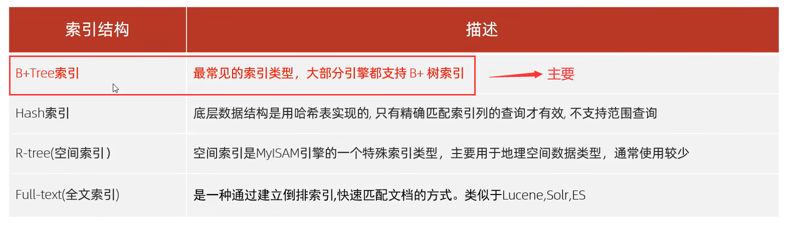

不同存储引擎对索引的支持情况

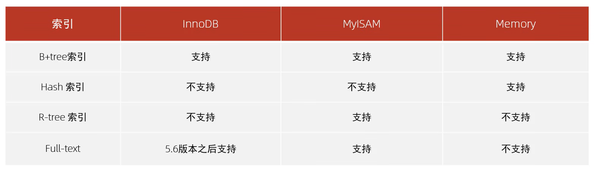

- B-Tree(多路平衡查找树)

以一颗最大度数为5的b-tree为例，每个节点最多存储4个key，5个指针。

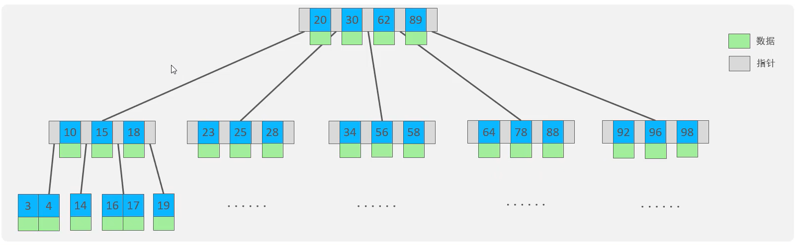

`树的度数指的是一个节点的子节点个数`

以下列数据为例，演示B-tree的结构

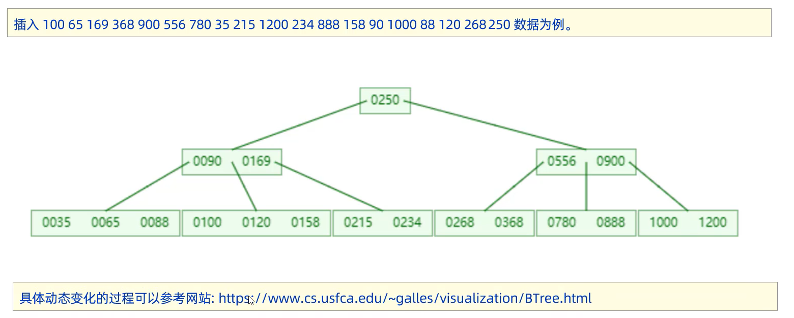

- B+Tree

以一颗最大度数为4的b-tree为例

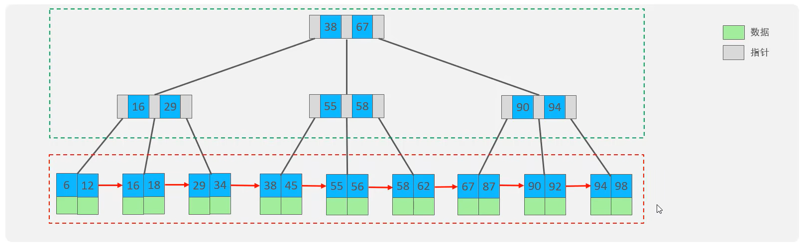

相对于B-Tree的区别：

1. 所有的数据都会出现在叶子节点。
2. 叶子节点形成一个单向链表。

- MySQL 的 B+Tree

MySQL 对 B+Tree 进行了优化。在原 B+Tree 的基础上，增加一个指向相邻叶子节点的链表指针，就形成了带有顺序指针的 B+Tree，提高区间访问性能。

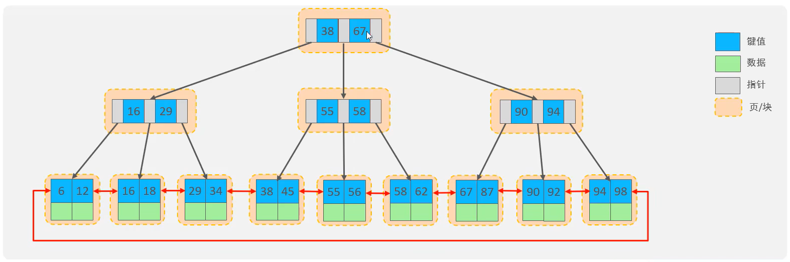

- Hash

哈希索引采用一定的 hash 算法，将键值换算成新的 hash 值，映射到对应的槽位上，然后存储在 hash 表中。但是在大数据情况下，难免会出现 hash 冲突，可以通过链表来解决。

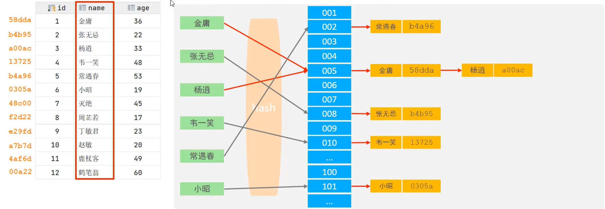

1. Hash 索引只能用于对等比较（=，in），不支持范围查询（between，>，<，...）
2. 无法利用索引完成排序操作
3. 查询效率高，通常只需要一次检索就能获取数据，效率通常要高于B+Tree索引。【如果出现hash冲突，效率不一定优于B+Tree】

在 MySQL 中，支持hash索引的是 Memory 引擎，但是 InnoDB 中具有自适应hash功能，hash索引是存储引擎根据B+Tree索引在指定条件下自动构建的。

#### 分类

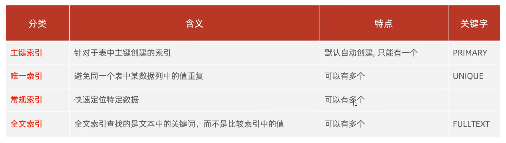

在 InnoDB 存储引擎中，根据索引的存储形式，又可以分为如下两种：


聚集索引选取规则：

1. 如果存在主键，主键索引就是聚集索引。
2. 如果不存在主键，将使用第一个唯一索引（UNIQUE）作为聚集索引。
3. 如果没有主键或没有合适的唯一索引，InnoDB 会自动生成一个 rowid 作为隐藏的聚集索引。

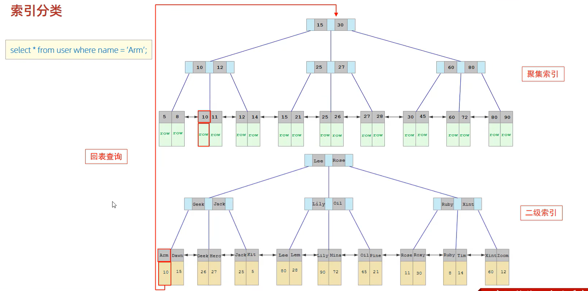

#### 语法

- 创建索引

```sql
-- 如果不加 [UNIQUE|FULLTEXT] 可选项的话，就是创建常规索引
CREATE [UNIQUE|FULLTEXT] INDEX index_name ON table_name(index_col_name, ...);

CREATE UNIQUE INDEX idx_emp_workno ON emp(workno);
CREATE INDEX idx_emp_age_idcard ON emp(age, idcard);
```

- 查看索引

```sql
SHOW INDEX FROM table_name;

SHOW INDEX FROM emp;

-- 执行结果
Table   Non_unique  Key_name            Seq_in_index  Column_name  Collation  Cardinality  Sub_part  Packed  Null    Index_type  Comment  Index_comment  Visible  Expression  
------  ----------  ------------------  ------------  -----------  ---------  -----------  --------  ------  ------  ----------  -------  -------------  -------  ------------
emp              0  PRIMARY                        1  id           A                    0    (NULL)  (NULL)          BTREE                               YES      (NULL)      
emp              0  idx_emp_workno                 1  workno       A                   16    (NULL)  (NULL)  YES     BTREE                               YES      (NULL)      
emp              1  idx_emp_age_idcard             1  age          A                   13    (NULL)  (NULL)  YES     BTREE                               YES      (NULL)      
emp              1  idx_emp_age_idcard             2  idcard       A                   16    (NULL)  (NULL)  YES     BTREE                               YES      (NULL)                                                                                                 
```

- 删除索引

```sql
DROP INDEX index_name ON table_name;
```

#### SQL性能分析

- SQL 执行频率

```sql
SHOW GLOBAL STATUS LIKE 'Com_______';

-- 执行结果
Variable_name  Value   
-------------  --------
Com_binlog     0       
Com_commit     0       
Com_delete     0       
Com_import     0       
Com_insert     4       
Com_repair     0       
Com_revoke     0       
Com_select     55      
Com_signal     0       
Com_update     1       
Com_xa_end     0    
```

使用 SQLyog 进行 MySQL 图形化操作，执行一次 select，Com_select 会自增三次。但是通过 Linux 命令行则自增一次。思考：是不是图形化界面需要保活之类的，确认会话正常。

- 慢查询日志

慢查询日志记录了所有执行时间超过指定参数（long_query_time，单位秒，默认10秒）的SQL语句的日志。MySQL 的慢查询日志默认关闭，需要在 MySQL 的配置文件中配置如下信息

```cnf
# 开启MySQL慢日志查询开关
slow_query_log=1

# 记录慢日志的时间为 2 秒，SQL 执行时间超过两秒会视为慢查询，记录慢查询日志
long_query_time=2
```

慢查询日志文件一般名为`xxx-slow.log`

- profile 详情

show profiles 能够在做 SQL 优化时帮助运维了解时间都耗费到哪里了。通过 have_profiling 参数，能够查询当前 MySQL 版本是否支持 profile 操作

```sql
SELECT @@have_profiling;

--执行结果
@@have_profiling  
------------------
YES    
```

默认 profiling 是关闭的，可以通过 set 语句在 session/global 级别开启 profiling；

```sql
set global profiling = 1;
```

执行一系列的业务 SQL 操作，然后通过如下指令查看指令的执行耗时

```sql
# 查看每一条 SQL 的耗时情况
show profiles;

-- 执行结果
Query_ID    Duration  Query                                                                                                                                                                              
--------  ----------  ----------------------------------------------------                                                                                                                                                                   
     157  0.00061000  SELECT * FROM emp where name='柳岩' LIMIT 0, 1000  

# 查看指定 query_id 的SQL语句在各个阶段的耗时情况
show profile for query query_id;

SHOW PROFILE FOR QUERY 157;
-- 执行结果
Status                      Duration  
--------------------------  ----------
starting                    0.000129  
checking permissions        0.000007  
Opening tables              0.000049  
init                        0.000006  
System lock                 0.000007  
optimizing                  0.000011  
statistics                  0.000020  
preparing                   0.000012  
executing                   0.000003  
Sending data                0.000078  
end                         0.000007  
query end                   0.000004  
waiting for handler commit  0.000007  
query end                   0.000006  
closing tables              0.000008  
freeing items               0.000200  
cleaning up                 0.000059  

# 查看指定 query_id 的SQL语句CPU的使用情况
show profile cpu for query query_id;
```

- explain 执行计划

EXPLAIN 或者 DESC 命令获取 MySQL 执行 SELECT 语句的信息，包括在 SELECT 语句执行过程中表如何连接和连接的顺序。

语法
```sql
EXPLAIN select 字段... from 表名 where 条件;

DESC select 字段... from 表名 where 条件;
```

```sql
EXPLAIN SELECT * FROM emp WHERE id=1;

    id  select_type  table   partitions  type    possible_keys  key      key_len  ref       rows  filtered  Extra   
------  -----------  ------  ----------  ------  -------------  -------  -------  ------  ------  --------  --------
     1  SIMPLE       emp     (NULL)      const   PRIMARY        PRIMARY  8        const        1    100.00  (NULL)  
```

EXPLAIN 执行计划各字段含义：
- id
  
select 查询的序列号，表示查询中执行 select 子句(子查询)或者是操作表的顺序（id相同，执行顺序从上到下；id不同，值越大，越先执行）。

id 相同：

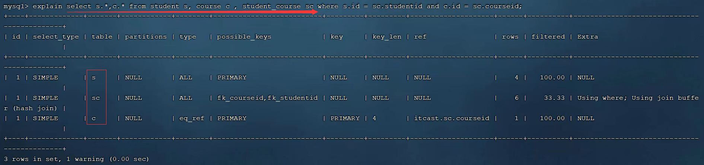

id 不同【子查询】

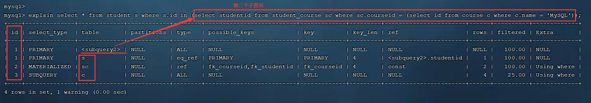
- select_type
  
表示 select 的类型，常见的取值有 SIMPLE（简单表，即不适用表连接或者子查询）、PRIMARY（子查询，即外层的查询）、UNION（UNION中的第二个或者后面的查询语句）、SUBQUERY（select/where之后包含了子查询）等。
- type
  
表示连接类型，性能由好到差的连接类型为：NULL、system、const（主键或唯一索引出现）、er_ref、ref（非唯一索引会出现）、range、index、all。
- possible_keys

显示可能应用在这张表上的索引，一个或多个。
- key

实际使用的索引，如果为NULL，则没有使用索引。
- key_len

表示索引中使用的字节数，该值为索引字段最大可能长度，并非实际使用长度，在不损失精确性的情况下，长度越短越好。（长度和字段存储的值相关）
- rows

在InnoDB中是一个预估值，执行查询的行数。
- filtered

表示返回结果的行数占需要读取行数的百分比，值越大越好。

#### 使用规则
- 验证索引效率

在未建立索引之前，执行 SQL 语句，查看耗时。

针对字段创建索引。
```sql
create index idx_xxx on 表名(字段名);
```

然后再次执行相同的 SQL 语句，再次查看 SQL 耗时。

- 最左前缀法则

主要针对联合索引。如果使用了联合索引，要遵循最左前缀法则。最左前缀法则指的是如果查询从索引的最左列开始，并且不跳过索引中的列，如果跳过某一列，索引将部分失效（后面的字段索引失效）。

```sql
-- 满足最左前缀法则【最左列必须存在，但没有强制顺序，谁在前谁在后都可以】
EXPLAIN SELECT * FROM emp WHERE gender='女' AND age=20 AND idcard='123456789012345678';
EXPLAIN SELECT * FROM emp WHERE age=20 AND idcard='123456789012345678' AND gender='女';

    id  select_type  table   partitions  type    possible_keys        key                  key_len  ref                  rows  filtered  Extra   
------  -----------  ------  ----------  ------  -------------------  -------------------  -------  -----------------  ------  --------  --------
     1  SIMPLE       emp     (NULL)      ref     idx_emp_gen_age_idc  idx_emp_gen_age_idc  611      const,const,const       1    100.00  (NULL)  
                                                                                                                                                 
-- 不满足最左前缀法则，部分索引失效
EXPLAIN SELECT * FROM emp WHERE gender='女' AND idcard='123456789012345678';

    id  select_type  table   partitions  type    possible_keys        key                  key_len  ref       rows  filtered  Extra                  
------  -----------  ------  ----------  ------  -------------------  -------------------  -------  ------  ------  --------  -----------------------
     1  SIMPLE       emp     (NULL)      ref     idx_emp_gen_age_idc  idx_emp_gen_age_idc  203      const        7     10.00  Using index condition  

-- 不满足最左前缀法则，索引全部失效，全表扫描
EXPLAIN SELECT * FROM emp WHERE age=20 AND idcard='123456789012345678';

    id  select_type  table   partitions  type    possible_keys  key     key_len  ref       rows  filtered  Extra        
------  -----------  ------  ----------  ------  -------------  ------  -------  ------  ------  --------  -------------
     1  SIMPLE       emp     (NULL)      ALL     (NULL)         (NULL)  (NULL)   (NULL)      16      6.25  Using where  
```
观察`key_len`列的变化，能直观的看出的确有部分索引失效了。

范围查询：如果联合索引中，出现范围查询（>，<），范围查询右侧的列索引失效。
```sql
EXPLAIN SELECT * FROM emp WHERE gender='女' AND age>20 AND idcard='123456789012345678';

    id  select_type  table   partitions  type    possible_keys        key                  key_len  ref       rows  filtered  Extra                  
------  -----------  ------  ----------  ------  -------------------  -------------------  -------  ------  ------  --------  -----------------------
     1  SIMPLE       emp     (NULL)      range   idx_emp_gen_age_idc  idx_emp_gen_age_idc  208      (NULL)       3     10.00  Using index condition  
     
EXPLAIN SELECT * FROM emp WHERE gender='女' AND age>=20 AND idcard='123456789012345678';

    id  select_type  table   partitions  type    possible_keys        key                  key_len  ref       rows  filtered  Extra                  
------  -----------  ------  ----------  ------  -------------------  -------------------  -------  ------  ------  --------  -----------------------
     1  SIMPLE       emp     (NULL)      range   idx_emp_gen_age_idc  idx_emp_gen_age_idc  611      (NULL)       4     10.00  Using index condition  
```
如何规避呢？在业务允许的情况下，尽量使用`>=`这样的运算。

- 索引失效情况一
1. 不要在索引列上进行运算操作（如果 substring 等），索引将失效。
```sql
-- 索引列失效，全表扫描
EXPLAIN SELECT * FROM emp WHERE SUBSTRING(workno, 2, 1) = 1;
```

2. 字符串类型字段使用时，不加引号，索引将失效。（存在隐式类型转换）

3. 模糊查询：如果使用尾部模糊匹配，索引不会失效。如果使用头部模糊匹配，索引失效。

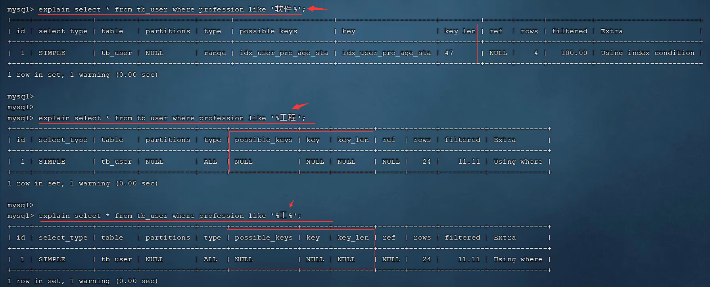

- 索引失效情况二

1. 用 or 分隔开的条件，如果 or 前的条件中的列有索引，而后面的列中没有索引，那么涉及的索引都不会被用到。

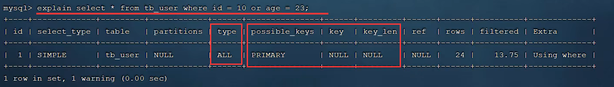

如何解决？需要针对 or 右侧的列建立索引。

2. 数据分布影响，如果MySQL评估使用索引比全表扫描更慢，则不使用索引。【如果返回的数据在全表记录中占比高于50%，则不会使用索引】

- SQL 提示

SQL 提示，是优化数据库的一个重要手段，简单来说，就是在 SQL 语句中加入一些人为的提示来达到优化操作的目的。

use index：建议 MySQL 使用某个索引

ignore index：不让 MySQL 使用某个索引

force index：强制 MySQL 使用某个索引

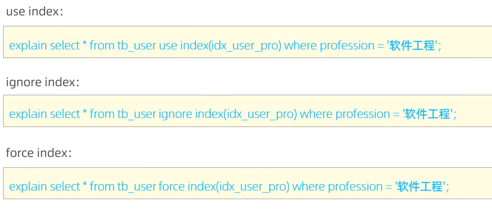

- 覆盖索引&回表查询

尽量使用覆盖索引（查询使用了索引，并且需要返回的列，在该索引中能够全部找到），减少 select *。

主键索引称为聚集索引，而非主键索引称为辅助索引或者二级索引。

假如需要查询 id、name（id是主键，name有索引）字段，那么此时可以 `select id name from tab_name;`，因为是使用 InnoDB 存储引擎，使用的 B+树索引结果，叶子节点会存储数据。而叶子节点就是name，存储的数据是 id。可以直接拿来用，不用回表查询。

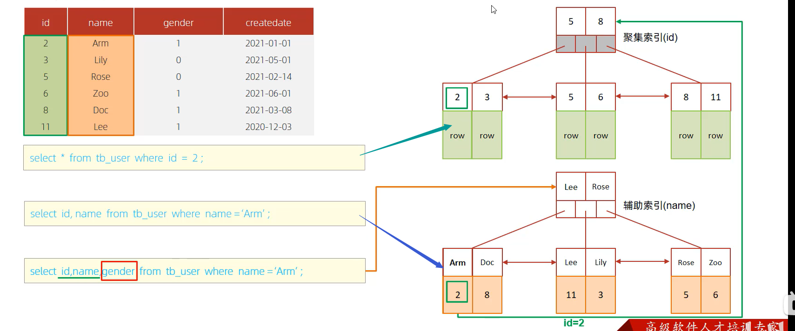

第一条和第二条 SQL 语句一次查询所有就可以找到所需要的字段，而第三条 SQL 语句中的 gender 字段在二级索引中没有，只能通过 id 回表查询聚集索引，得到 gender 字段。

- 前缀索引

当字段类型为字符串（varchar、text等）时，有时候需要索引很长的字符串，这会让索引变得很大，查询时，浪费大量的磁盘IO，影响查询效率。此时可以只将字符串的部分前缀，建立索引，可以大大的节约索引空间，提高索引效率。

语法
```sql
create index idx_xxx on table_name(column('部分字符'));
```

如何选取前缀长度？可以根据索引的选择性来决定，而选择性时是指不重复的索引值（基数）和数据表的记录总数的比值，索引选择性越高则查询效率越高。唯一索引的选择性是1，性能最好。

公式


案例

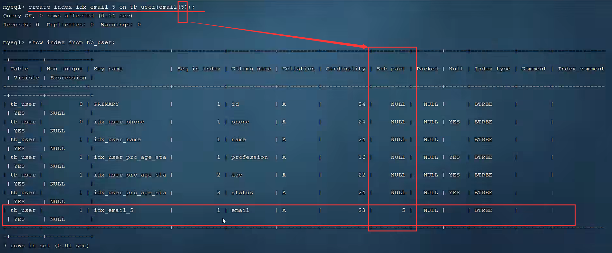

查询流程：将一行的数据取出来之后，会根据对应字段与传递的字段进行比较，如果是一样的，就将这一行返回。然后接着继续执行链表（B+树索引叶子节点是链表形式）

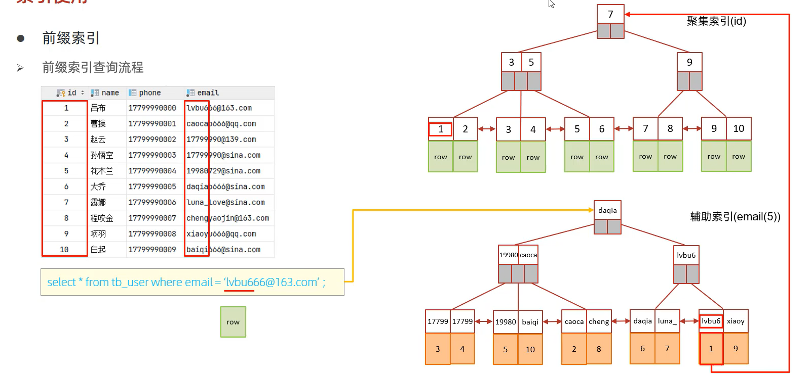

- 单列&联合索引

单列索引（即一个索引只包含单个列）：只有 phone 字段走了索引，而查询 name 字段的值必然要走回表查询。

单列索引多条件联合查询时，MySQL优化器会评估哪个字段的索引效率更高，会选择该索引完成本次查询。（并不会所有索引都会用到，只会用到某一个索引）

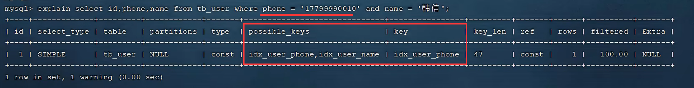

联合索引（即一个索引包含了多个列）：

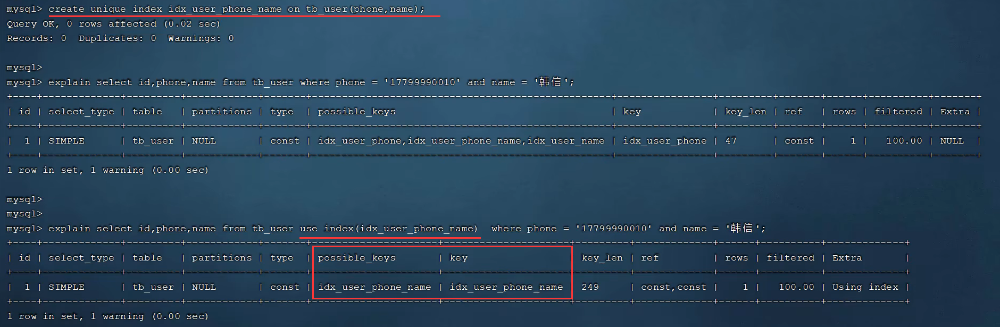

在业务场景中，如果存在多个查询条件，考虑针对于查询字段建立索引时，建立建立联合索引，而非单列索引。

联合索引结构

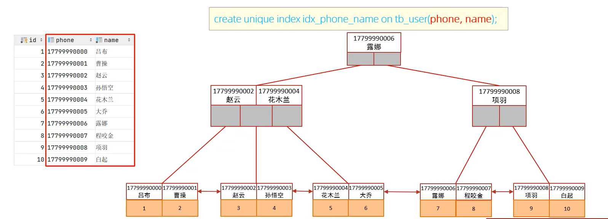

#### 设计原则
1. 针对于数据量较大，且查询比较频繁的表建立索引。（百万以上的数据考虑建立索引）
2. 针对于常作为查询条件（where）、排序（order by）、分组（group by）操作的字段建立索引。
3. 尽量选择区分度高的列作为索引，尽量建立唯一索引，区分度越高，使用索引的效率越高。（比如员工id、身份证号、手机号等）
4. 如果是字符串类型的字段，字段的长度较长，可以针对于字段的特点，建立前缀索引。
5. 尽量使用联合索引，减少单列索引，查询时，联合索引很多时候可以覆盖索引，节省存储空间，避免回表，提高查询效率
6. 要控制索引的数量，索引越多，维护索引结构的代价也就越大，会影响增删改的效率。
7. 如果索引列不能存储 NULL 值，请在创建表时使用 NOT NULL 约束。当优化器知道每列是否包含 NULL 值时，它能够更好地确定哪个索引最有效地用于查询。

### SQL优化

### 视图/存储过程/触发器

### 锁

### InnoDB引擎

### MySQL管理

## 运维篇

### 日志

### 主从复制

### 分库分表

### 读写分离

## 附录

#### InnoDB引擎查看表空间文件

Windows 查看 .ibd 文件

```cmd
C:\ProgramData\MySQL\MySQL Server 8.0\Data\test>ibd2sdi emp.ibd
```

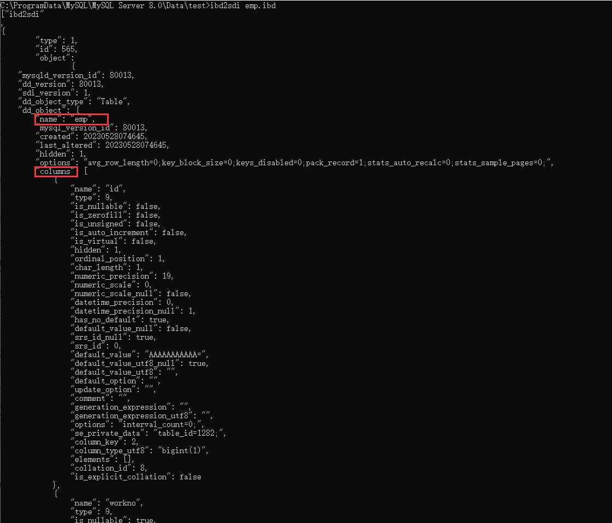

#### InnoDB 表空间逻辑存储结构

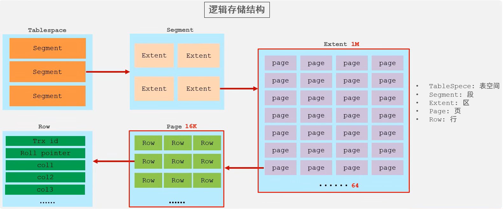

#### 常见存储引擎的区别

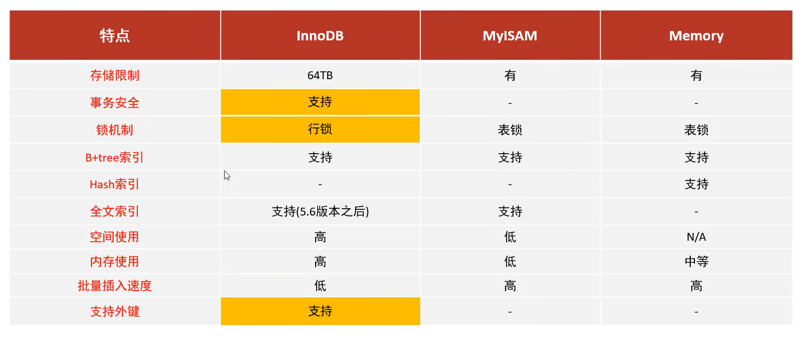

#### 思考：为什么 InnoDB 存储引擎选择使用 B+Tree 索引结构？

1. 相对于二叉树，层级更少，搜索效率高；
2. 对于 B-Tree，无论是叶子节点还是非叶子节点，都会保存数据，这样导致一页中存储的键值减少，指针跟着减少，要同样保存大量数据，只能增加树的高度，导致性能降低。
3. 相对于hash索引，B+Tree支持范围查询及排序操作；

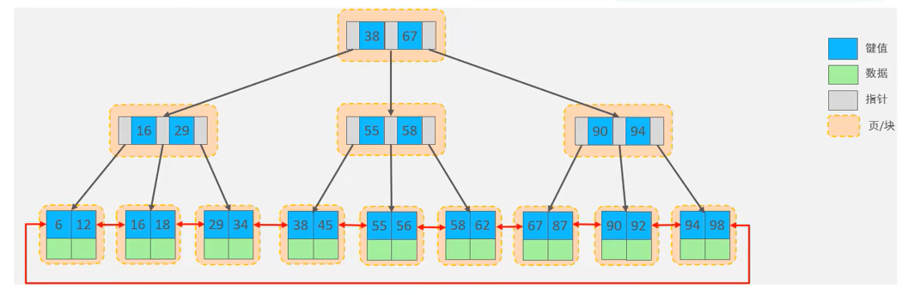

#### 思考：InnoDB主键索引的B+tree高度为多高呢？


假设：一行数据数据大小为1k，一页中可以存储16行这样的数据。InnoDB 的指针占用6个字节，键值占用空间和主键类型有关，主键为 bigint，占用字节为8.

```text
高度为2：
    n * 8 + (n + 1) * 6 = 16 * 1024  n ≈ 1170
    1171 * 16 = 18736
n 指代当前节点存储的 key 的数量，(n+1)*6 就是指针的数量乘以指针占用字节，最后得出每个节点存储 key 的个数为 1170，意味着有1171个指针

高度为2：
    1171 * 1171 * 16 = 21939856条数据
```


