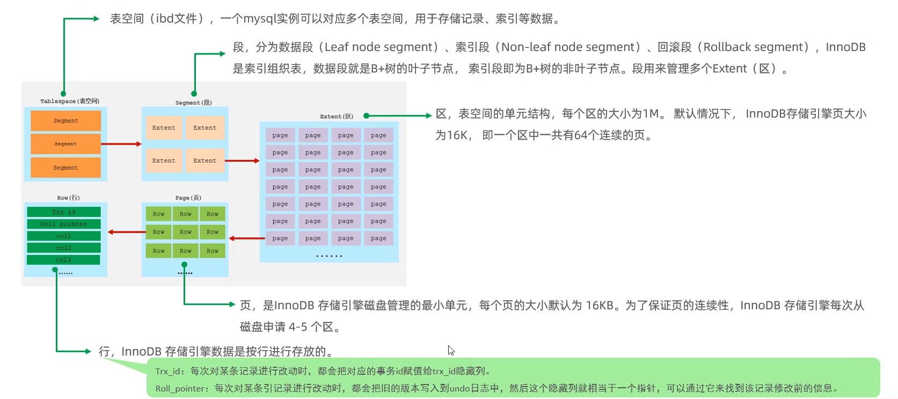

## 基础篇
> 以下所有内容都能从官方文档获取：https://dev.mysql.com/doc/refman/8.0/en/
> 
> DML(data manipulation language)：SELECT、UPDATE、INSERT、DELETE
> 
> DDL(data definition language)：主要的命令有CREATE、ALTER、DROP等。DDL主要是用在定义或改变表(TABLE)的结构，数据类型，表之间的链接和约束等初始化工作上，他们大多在建立表时使用；
> 
> DCL(Data Control Language)：是数据库控制功能。是用来设置或更改数据库用户或角色权限的语句，包括(grant,deny,revoke等)语句。在默认状态下，只有sysadmin,dbcreator,db_owner或db_securityadmin等人员才有权力执行DCL；

### SQL

```sql
# 查询
select * from tb_name;

# 删除
delete from tb_name where id = 1;

# 插入
insert into tb_name(id,name) values(1, 'a');

# 修改
update tb_name set name='b' where id=1;

# 创建数据库
create database forbearance;

# 创建表
create table user(
id int(11),
name varchar(10)
);

# 表修改-添加字段
alter table tb_name add 字段名 类型(长度) [comment '注释'] [约束];

# 表修改-修改字段类型
alter table tb_name modify 字段名 新数据类型(长度);

# 表修改-修改字段名和字段类型
alter table tb_name change 旧字段名 新字段名 类型(长度) [comment '注释'] [约束];

# 查询用户
use mysql
select * from user;

# 创建用户
create user '用户名'@'主机名' identified by '密码';

# 修改用户密码
alter user '用户名'@'主机名' identified with mysql_native_password by '密码';

# 删除用户
drop user '用户名'@'主机名';

# 查询权限
show grants for '用户名'@'主机名';

# 赋予权限
grant 权限列表 on 数据库名.表名 to '用户名'@'主机名';
grant all on 数据库名.表名 to '用户名'@'主机名';
grant select on 数据库名.表名 to '用户名'@'主机名';
...

# 撤销权限
remove 权限列表 on 数据库名.表名 from '用户名'@'主机名';
remove all on 数据库名.表名 from '用户名'@'主机名';
remove select on 数据库名.表名 from '用户名'@'主机名';
...
```

聚集函数（count，sum，max，min，avg等）只能用在select子句和group中的having子句中，所以一般group by和having搭配使用，having对group分组添加条件。
> 使用顺序为 where > group by > having > order by

DQL执行顺序


常用权限控制


### 函数
#### 字符串函数


#### 数值函数


#### 日期函数


type 可以是 year、month、day。

#### 流程函数


### 约束
约束是作用于表中字段上的规则，用于限制存储在表中的数据。

保证数据库中数据的正确性、有效性和完整性。


```sql
create table user(
    id int primary key auto_increment comment '主键',
    name varchar(10) not null unique comment '姓名',
    age int check(age > 0 && age <= 120) comment '年龄',
    status char(1) default '1' comment '状态',
    gender char(1) comment '性别',
) comment '用户表';
```

#### 外键约束
```sql
create table tb_name(
    ...
    [constraint] [外键名称] foreign key(外键字段) references 主表(主表列名)
);

alter table tb_name add constraint 外键名称 foreign key(外键字段) references 主表(主表列名);

alter table tb_name drop foreign key 外键名称;
```

- 外键删除/更新行为


`no action`和`restrict`是默认行为

```sql
alter table tb_name add constraint 外键名称 foreign key(外键字段) references 主表(主表列名) on update cascade on delete cascade;
```
### 多表查询
> 笛卡尔积：笛卡尔乘积指在数学中，两个集合，A集合和B集合的所有组合情况。（在多表查询时，需要消除无效的笛卡尔积。）

- 内连接：相当于查询A、B交集部分数据。
- 左外连接：查询左表所有数据，以及两张表交集部分数据。
- 右外连接：查询右表所有数据，以及两张表交集部分数据。
- 自连接：当前表与自身的连接查询，自连接需要使用表别名。

left join: 包含左表的所有行，对应的右表行可能为空

right join: 包含右表的所有行，对应的左表行可能为空

inner join: 只包含左右表都匹配并且不为空的行

join: 只包含左右表都匹配并且不为空的行

left outer join: 包含左表的所有行，对应的右表行可能为空。

#### 内连接
- 隐式内连接
```sql
select 字段... from 表1, 表2 where 条件...;
```

- 显式内连接
```sql
# inner join 或者 join
select 字段... from 表1 [inner] join 表2 on 连接条件;
```

#### 外连接
- `left join`
```sql
select 字段... from 表1 left join 表2 on 条件...
```  

- `right join`
```sql
select 字段... from 表1 right join 表2 on 条件...
```  

#### 自连接
自连接查询，可以时内连接查询，也可以时外连接查询。
```sql
select 字段... from 表A 别名a join 表A 别名b on 条件...;
```

#### 联合查询（union、union all）
对于 union 查询，就是把多次查询的结果合并起来，形成一个新的查询结果集。
```sql
select 字段... from 表A...
union [all]
select 字段... from 表B...
```
`注意：`对于联合查询的多张表的列数必须保持一致，字段类型也需要保持一致。

union会对合并之后的数据去重。union all会将全部数据直接合并（不考虑去重）。

#### 子查询
SQL 语句中嵌套 select 语句，称为嵌套查询，又称子查询。
```sql
select * from t1 where column1 = (select column1 from t2);
```
子查询外部的语句可以是 `insert/update/delete/select`。

子查询可在 where、from、select 之后。
##### 标量子查询（子查询结果为单个值）
常见的操作符：=、<>、>、>=、<、<=
```sql
select * from emp where dept_id = (select id from dept where name = '销售部');
```

##### 列子查询（子查询结果为一列，可以是单列多行）
常见的操作符：in、not in、any、some、 all


```sql
# 满足大于所有子查询的值
select * from emp where salary > all (select salary from emp where dept_id = (select id from dept where name = '财务部'));

# 满足任意一个子查询的值
select * from emp where salary > any (select salary from emp where dept_id = (select id from dept where name = '财务部'));
```

##### 行子查询（子查询结果为一行）
常见的操作符：=、<>、in、not in
```sql
select * from emp where (salary, managerid) = (select salary, managerid from emp where name = '张无忌');
```

##### 表子查询（子查询结果为多行多列）
常见的操作符：in
```sql
select * from emp where (job, salary) in (select job, salary from emp where name = '鹿杖客' or name = '宋远桥');

select e.*, d.* from (select * from emp where entrydate > '2023-01-01') e left join dept on e.dept_id = d.id;
```

### 事务
事务是一组操作的集合，它是一个不可分割的工作单位，事务会把所有的操作作为一个整体一起向系统提交或撤销操作请求，要么同时成功，要么同时失败。

默认MySQL的事务是自动提交的，也就是说，当执行一条 DML 语句，MySQL会立即隐式的提交事务。
#### 事务操作
- 查看/设置事务提交方式
```sql
# 1：自动提交，0=手动提交
select @@autocommit;

set @@autocommit = 0;
```

- 开启事务
```sql
start transaction;

# 或者 

begin;
```

- 提交事务
```sql
commit;
```

- 回滚事务
```sql
rollback;
```

#### 事务四大特性（ACID）
- 原子性（Atomicity）：事务是不可分割的最小操作单元，要么全部成功，要么全部失败。
- 一致性（Consistency）：事务完成时，必须使所有的数据都保持一致状态。
- 隔离性（Isolation）：数据库系统提供的隔离机制，保证事务在不受外部并发操作影响的独立环境下运行。
- 持久性（Durability）：事务一旦提交或回滚，它对数据库中的数据的改变就是永久的。

#### 并发事务问题
并发事务问题：多个事务在执行过程中，所出现的脏读、不可重复读、幻读。

1. 脏读：一个事务读到另一个事务还没有提交的数据。
2. 不可重复读：一个事务先后读取同一条记录，但两次读取的数据不同，称之为不可重复读。
3. 幻读：一个事务按照条件查询数据时，没有对应的数据行，但是在插入数据时，又发现这行数据已经存在（B事务执行 insert 并提交）。

#### 事务隔离级别
> Oracle 默认事务隔离级别是读已提交（Read committed）

|   隔离级别   |   脏读   |   不可重复读   |   幻读   |
| ---- | ---- | ---- | ---- |
|   Read uncommitted   |   √   |   √   |   √   |
|   Read committed   |   ×   |   √   |   √   |
|   Repeatable Read（默认）   |   ×   |   ×   |   √   |
|   Serializable   |   ×   |   ×   |   ×   |

`Serializable`串行化，所有事务按照次序依次执行。（事务一个一个地排队执行，不能进行并发操作，可以避免所有并发问题。但是效率低下，很消耗数据库性能。）

查看事务隔离级别
```sql
select @@transaction_isolation;
```

设置事务隔离级别
```sql
set [session|gloabl] transaction isolation level READ UNCOMMITTED | READ COMMITTED | REPEATABLE READ | SERIALIZABLE
```

## 进阶篇
### 存储引擎
#### MySQL 体系结构
`index`索引是在引擎层实现的，所以不同的存储引擎的索引实现是不一样的。


- 连接层

最上层的是一些客户端和连接服务，主要完成一些连接处理、授权认证以及相关的安全方案。服务器也会为安全接入的客户端验证它所具有的操作权限。

- 服务层

服务层架构主要完成大多数的核心服务功能，如 SQL 接口、完成缓存的查询、SQL 的分析和优化、部分内置函数的执行。所有跨存储引擎的功能也在这一层实现。如存储过程、函数等。

- 引擎层

存储引擎真正的负责了 MySQL 中数据的存储和提取，服务器通过 API 和存储引擎进行通信。不同的存储引擎具有不同的功能。我们可以根据自己的需求，来选择合适的存储引擎。

- 存储层

主要是将数据存储再文件系统之上，并完成与存储引擎的交互。【持久化】

#### 存储引擎简介

`存储引擎`就是存储数据、建立索引、更新/查询数据等技术的实现方式。存储引擎是基于表的，而不是基于库的，所以存储引擎也被称为表类型。【一个库下的多张表，可以指定使用不同的存储引擎】。

- 在创建表时，指定存储引擎

```SQL
CREATE TABLE `表名` (                                                                                                                                                                                                                                                                                                                                                                                       
          `id` bigint(1) NOT NULL,                                                                                                                                                                                                                                                                                                                                                                                 
           ...
           字段n 类型 [comment 字段注释]                                                                                                                                                                                                                                                                                                                                                                 
          PRIMARY KEY (`id`)                                                                                                                                                                                                                                                                                                                                                                                       
        ) ENGINE=InnoDB DEFAULT CHARSET=utf8mb4 COLLATE=utf8mb4_0900_ai_ci [comment 表注释]
-- ENGINE：指定存储引擎，CHARSET：字符集，COLLATE：数据编码
```

如果不指定存储引擎，MySQL5.5之后默认是`InnoDB`。

- 查询当前数据库支持的存储引擎

```SQL
SHOW ENGINES;

-- 执行结果如下：
Engine              Support  Comment                                                         Transactions  XA      Savepoints  
------------------  -------  --------------------------------------------------------------  ------------  ------  ------------
MEMORY              YES      Hash based, stored in memory, useful for temporary tables       NO            NO      NO          
MRG_MYISAM          YES      Collection of identical MyISAM tables                           NO            NO      NO          
CSV                 YES      CSV storage engine                                              NO            NO      NO          
FEDERATED           NO       Federated MySQL storage engine                                  (NULL)        (NULL)  (NULL)      
PERFORMANCE_SCHEMA  YES      Performance Schema                                              NO            NO      NO          
MyISAM              YES      MyISAM storage engine                                           NO            NO      NO          
InnoDB              DEFAULT  Supports transactions, row-level locking, and foreign keys      YES           YES     YES         
BLACKHOLE           YES      /dev/null storage engine (anything you write to it disappears)  NO            NO      NO          
ARCHIVE             YES      Archive storage engine                                          NO            NO      NO          
```

需要留意`MyISAM`是 MySQL 早期版本的默认存储引擎。

- 案例一：创建表，并指定为`MyISAM`存储引擎

```sql
CREATE TABLE my_myisam(
	id INT,
	NAME VARCHAR(10)
)ENGINE=MYISAM;
```

- 案例二：创建表，并指定为`MEMORY`存储引擎

```sql
CREATE TABLE my_memory(
	id INT,
	NAME VARCHAR(10)
)ENGINE=MEMORY;
```

#### 存储引擎的特点

- InnoDB
    - 介绍
        - InnoDB 是一种兼顾高可靠性和高性能的通用存储引擎，在 MySQL 5.5 之后，InnoDB 是默认的 MySQL 存储引擎。
    - 特点【主要介绍三种】
        - DML 操作遵循 ACID 模型，支持`事务`；
        - `行级锁`，提供并发访问性能；
        - 支持`外键` foreign key 约束，保证数据的完整性和正确性；
    - 磁盘文件
        - xxx.ibd：xxx代表的是表名，InnoDB 引擎的每张表都会对应这样一个表空间文件，存储该表的表结构（frm、sdi）、数据和索引；
        - 早期有个文件`frm`，但是在8.0之后表结构都存储到了`sdi`，而`sdi`文件又融入到了`ibd`表空间文件中。
        - 参数：`innodb_file_per_table`【多张表共享一个表空间，还是一张表对应一个表空间，8.0默认开启(即每一张表都对应一个表空间)】
        ```sql
        -- 查看系统变量
        SHOW VARIABLES LIKE 'innodb_file_per_table';
      
        -- 执行结果：
        Variable_name          Value   
        ---------------------  --------
        innodb_file_per_table  ON  
        ```
- MyISAM
    - MyISAM 是 MySQL 早期的默认存储引擎。
    - 不支持事务，不支持外键
    - 支持表锁，不支持行锁
    - 访问速度快
    - 磁盘文件
        - 
        - .sdi：存储表结构信息【是文本文件，可直接打开】
        - .MYD：存储数据
        - .MYI：存储索引
- Memory
    - Memory 引擎的表数据存储在内存中，会受到硬件问题、或断电问题的影响，只能将这些表作为临时表或缓存使用。
    - hash索引【默认】
    - 访问速度快
    - .sdi：存储表结构信息

#### 存储引擎的选择

在选择存储引擎时，应该根据应用系统的特点选择合适的存储引擎。对于复杂的应用系统，还可以根据实际情况选择多种存储引擎进行组合。

- InnoDB：MySLQ 默认的存储引擎，支持事务、外键。如果应用对事务的完整性有较高的要求，在并发条件下要求数据的一致性，数据操作除了插入和查询之外，还包含很多的更新、删除操作。那么 InnoDB 存储引擎是比较合适的选择。
- MyISAM：如果应用以读操作和插入操作为主，很少的更新和删除操作，并且对事务的完整性、并发性要求不是很高，那么选择 MyISAM 是非常合适的。【MongoDB替代】
- MEMORY：将所有数据保存在内存中，访问速度快，通常用于临时表及缓存。MEMORY 的缺陷就是对表的大小有限制，太大的表无法缓存在内存中，且无法保证数据的安全性。【Redis替代】

### 索引

#### 概述

索引（index）是帮助 MySQL 高效获取数据的数据结构（有序）。在数据之外，数据库系统还维护着满足特定查找算法的数据结构，这些数据结构以某种方式引用（指向）数据。这种数据结构就是索引

- 优：提高数据检索效率，降低数据库的IO成本；通过索引列对数据进行排序，降低数据排序的成本，降低CPU消耗；

- 缺：索引列需要占用空间；索引提高了查询效率，但是也降低了更新表的效率，对表进行 insert、update、delete时，需要维护索引，效率降低；

#### 结构

- 介绍


不同存储引擎对索引的支持情况


- B-Tree(多路平衡查找树)

以一颗最大度数为5的b-tree为例，每个节点最多存储4个key，5个指针。


`树的度数指的是一个节点的子节点个数`

以下列数据为例，演示B-tree的结构


- B+Tree

以一颗最大度数为4的b-tree为例


相对于B-Tree的区别：

1. 所有的数据都会出现在叶子节点。
2. 叶子节点形成一个单向链表。

- MySQL 的 B+Tree

MySQL 对 B+Tree 进行了优化。在原 B+Tree 的基础上，增加一个指向相邻叶子节点的链表指针，就形成了带有顺序指针的 B+Tree，提高区间访问性能。


- Hash

哈希索引采用一定的 hash 算法，将键值换算成新的 hash 值，映射到对应的槽位上，然后存储在 hash 表中。但是在大数据情况下，难免会出现 hash 冲突，可以通过链表来解决。


1. Hash 索引只能用于对等比较（=，in），不支持范围查询（between，>，<，...）
2. 无法利用索引完成排序操作
3. 查询效率高，通常只需要一次检索就能获取数据，效率通常要高于B+Tree索引。【如果出现hash冲突，效率不一定优于B+Tree】

在 MySQL 中，支持hash索引的是 Memory 引擎，但是 InnoDB 中具有自适应hash功能，hash索引是存储引擎根据B+Tree索引在指定条件下自动构建的。

#### 分类


在 InnoDB 存储引擎中，根据索引的存储形式，又可以分为如下两种：


聚集索引选取规则：

1. 如果存在主键，主键索引就是聚集索引。
2. 如果不存在主键，将使用第一个唯一索引（UNIQUE）作为聚集索引。
3. 如果没有主键或没有合适的唯一索引，InnoDB 会自动生成一个 rowid 作为隐藏的聚集索引。


#### 语法

- 创建索引

```sql
-- 如果不加 [UNIQUE|FULLTEXT] 可选项的话，就是创建常规索引
CREATE [UNIQUE|FULLTEXT] INDEX index_name ON table_name(index_col_name, ...);

CREATE UNIQUE INDEX idx_emp_workno ON emp(workno);
CREATE INDEX idx_emp_age_idcard ON emp(age, idcard);
```

- 查看索引

```sql
SHOW INDEX FROM table_name;

SHOW INDEX FROM emp;

-- 执行结果
Table   Non_unique  Key_name            Seq_in_index  Column_name  Collation  Cardinality  Sub_part  Packed  Null    Index_type  Comment  Index_comment  Visible  Expression  
------  ----------  ------------------  ------------  -----------  ---------  -----------  --------  ------  ------  ----------  -------  -------------  -------  ------------
emp              0  PRIMARY                        1  id           A                    0    (NULL)  (NULL)          BTREE                               YES      (NULL)      
emp              0  idx_emp_workno                 1  workno       A                   16    (NULL)  (NULL)  YES     BTREE                               YES      (NULL)      
emp              1  idx_emp_age_idcard             1  age          A                   13    (NULL)  (NULL)  YES     BTREE                               YES      (NULL)      
emp              1  idx_emp_age_idcard             2  idcard       A                   16    (NULL)  (NULL)  YES     BTREE                               YES      (NULL)                                                                                                 
```

- 删除索引

```sql
DROP INDEX index_name ON table_name;
```

#### SQL性能分析

- SQL 执行频率

```sql
SHOW GLOBAL STATUS LIKE 'Com_______';

-- 执行结果
Variable_name  Value   
-------------  --------
Com_binlog     0       
Com_commit     0       
Com_delete     0       
Com_import     0       
Com_insert     4       
Com_repair     0       
Com_revoke     0       
Com_select     55      
Com_signal     0       
Com_update     1       
Com_xa_end     0    
```

使用 SQLyog 进行 MySQL 图形化操作，执行一次 select，Com_select 会自增三次。但是通过 Linux 命令行则自增一次。思考：是不是图形化界面需要保活之类的，确认会话正常。

- 慢查询日志

慢查询日志记录了所有执行时间超过指定参数（long_query_time，单位秒，默认10秒）的SQL语句的日志。MySQL 的慢查询日志默认关闭，需要在 MySQL 的配置文件中配置如下信息

```cnf
# 开启MySQL慢日志查询开关
slow_query_log=1

# 记录慢日志的时间为 2 秒，SQL 执行时间超过两秒会视为慢查询，记录慢查询日志
long_query_time=2
```

慢查询日志文件一般名为`xxx-slow.log`

- profile 详情

show profiles 能够在做 SQL 优化时帮助运维了解时间都耗费到哪里了。通过 have_profiling 参数，能够查询当前 MySQL 版本是否支持 profile 操作

```sql
SELECT @@have_profiling;

--执行结果
@@have_profiling  
------------------
YES    
```

默认 profiling 是关闭的，可以通过 set 语句在 session/global 级别开启 profiling；

```sql
set global profiling = 1;
```

执行一系列的业务 SQL 操作，然后通过如下指令查看指令的执行耗时

```sql
# 查看每一条 SQL 的耗时情况
show profiles;

-- 执行结果
Query_ID    Duration  Query                                                                                                                                                                              
--------  ----------  ----------------------------------------------------                                                                                                                                                                   
     157  0.00061000  SELECT * FROM emp where name='柳岩' LIMIT 0, 1000  

# 查看指定 query_id 的SQL语句在各个阶段的耗时情况
show profile for query query_id;

SHOW PROFILE FOR QUERY 157;
-- 执行结果
Status                      Duration  
--------------------------  ----------
starting                    0.000129  
checking permissions        0.000007  
Opening tables              0.000049  
init                        0.000006  
System lock                 0.000007  
optimizing                  0.000011  
statistics                  0.000020  
preparing                   0.000012  
executing                   0.000003  
Sending data                0.000078  
end                         0.000007  
query end                   0.000004  
waiting for handler commit  0.000007  
query end                   0.000006  
closing tables              0.000008  
freeing items               0.000200  
cleaning up                 0.000059  

# 查看指定 query_id 的SQL语句CPU的使用情况
show profile cpu for query query_id;
```

- explain 执行计划

EXPLAIN 或者 DESC 命令获取 MySQL 执行 SELECT 语句的信息，包括在 SELECT 语句执行过程中表如何连接和连接的顺序。

语法
```sql
EXPLAIN select 字段... from 表名 where 条件;

DESC select 字段... from 表名 where 条件;
```

```sql
EXPLAIN SELECT * FROM emp WHERE id=1;

    id  select_type  table   partitions  type    possible_keys  key      key_len  ref       rows  filtered  Extra   
------  -----------  ------  ----------  ------  -------------  -------  -------  ------  ------  --------  --------
     1  SIMPLE       emp     (NULL)      const   PRIMARY        PRIMARY  8        const        1    100.00  (NULL)  
```

EXPLAIN 执行计划各字段含义：
- id
  
select 查询的序列号，表示查询中执行 select 子句(子查询)或者是操作表的顺序（id相同，执行顺序从上到下；id不同，值越大，越先执行）。

id 相同：


id 不同【子查询】


- select_type
  
表示 select 的类型，常见的取值有 SIMPLE（简单表，即不使用表连接或者子查询）、PRIMARY（子查询，即外层的查询）、UNION（UNION中的第二个或者后面的查询语句）、SUBQUERY（select/where之后包含了子查询）等。
- type
  
表示连接类型，性能由好到差的连接类型为：NULL、system、const（主键或唯一索引出现）、er_ref、ref（非唯一索引会出现）、range、index、all。
- possible_keys

显示可能应用在这张表上的索引，一个或多个。
- key

实际使用的索引，如果为NULL，则没有使用索引。
- key_len

表示索引中使用的字节数，该值为索引字段最大可能长度，并非实际使用长度，在不损失精确性的情况下，长度越短越好。（长度和字段存储的值相关）
- rows

在InnoDB中是一个预估值，执行查询的行数。
- filtered

表示返回结果的行数占需要读取行数的百分比，值越大越好。

#### 使用规则
- 验证索引效率

在未建立索引之前，执行 SQL 语句，查看耗时。

针对字段创建索引。
```sql
create index idx_xxx on 表名(字段名);
```

然后再次执行相同的 SQL 语句，再次查看 SQL 耗时。

- 最左前缀法则

主要针对联合索引。如果使用了联合索引，要遵循最左前缀法则。最左前缀法则指的是如果查询从索引的最左列开始，并且不跳过索引中的列，如果跳过某一列，索引将部分失效（后面的字段索引失效）。

```sql
-- 满足最左前缀法则【最左列必须存在，但没有强制顺序，谁在前谁在后都可以】
EXPLAIN SELECT * FROM emp WHERE gender='女' AND age=20 AND idcard='123456789012345678';
EXPLAIN SELECT * FROM emp WHERE age=20 AND idcard='123456789012345678' AND gender='女';

    id  select_type  table   partitions  type    possible_keys        key                  key_len  ref                  rows  filtered  Extra   
------  -----------  ------  ----------  ------  -------------------  -------------------  -------  -----------------  ------  --------  --------
     1  SIMPLE       emp     (NULL)      ref     idx_emp_gen_age_idc  idx_emp_gen_age_idc  611      const,const,const       1    100.00  (NULL)  
                                                                                                                                                 
-- 不满足最左前缀法则，部分索引失效
EXPLAIN SELECT * FROM emp WHERE gender='女' AND idcard='123456789012345678';

    id  select_type  table   partitions  type    possible_keys        key                  key_len  ref       rows  filtered  Extra                  
------  -----------  ------  ----------  ------  -------------------  -------------------  -------  ------  ------  --------  -----------------------
     1  SIMPLE       emp     (NULL)      ref     idx_emp_gen_age_idc  idx_emp_gen_age_idc  203      const        7     10.00  Using index condition  

-- 不满足最左前缀法则，索引全部失效，全表扫描
EXPLAIN SELECT * FROM emp WHERE age=20 AND idcard='123456789012345678';

    id  select_type  table   partitions  type    possible_keys  key     key_len  ref       rows  filtered  Extra        
------  -----------  ------  ----------  ------  -------------  ------  -------  ------  ------  --------  -------------
     1  SIMPLE       emp     (NULL)      ALL     (NULL)         (NULL)  (NULL)   (NULL)      16      6.25  Using where  
```
观察`key_len`列的变化，能直观的看出的确有部分索引失效了。

范围查询：如果联合索引中，出现范围查询（>，<），范围查询右侧的列索引失效。
```sql
EXPLAIN SELECT * FROM emp WHERE gender='女' AND age>20 AND idcard='123456789012345678';

    id  select_type  table   partitions  type    possible_keys        key                  key_len  ref       rows  filtered  Extra                  
------  -----------  ------  ----------  ------  -------------------  -------------------  -------  ------  ------  --------  -----------------------
     1  SIMPLE       emp     (NULL)      range   idx_emp_gen_age_idc  idx_emp_gen_age_idc  208      (NULL)       3     10.00  Using index condition  
     
EXPLAIN SELECT * FROM emp WHERE gender='女' AND age>=20 AND idcard='123456789012345678';

    id  select_type  table   partitions  type    possible_keys        key                  key_len  ref       rows  filtered  Extra                  
------  -----------  ------  ----------  ------  -------------------  -------------------  -------  ------  ------  --------  -----------------------
     1  SIMPLE       emp     (NULL)      range   idx_emp_gen_age_idc  idx_emp_gen_age_idc  611      (NULL)       4     10.00  Using index condition  
```
如何规避呢？在业务允许的情况下，尽量使用`>=`这样的运算。

- 索引失效情况一
1. 不要在索引列上进行运算操作（如果 substring 等），索引将失效。
```sql
-- 索引列失效，全表扫描
EXPLAIN SELECT * FROM emp WHERE SUBSTRING(workno, 2, 1) = 1;
```

2. 字符串类型字段使用时，不加引号，索引将失效。（存在隐式类型转换）

3. 模糊查询：如果使用尾部模糊匹配，索引不会失效。如果使用头部模糊匹配，索引失效。


- 索引失效情况二

1. 用 or 分隔开的条件，如果 or 前的条件中的列有索引，而后面的列中没有索引，那么涉及的索引都不会被用到。


如何解决？需要针对 or 右侧的列建立索引。

2. 数据分布影响，如果MySQL评估使用索引比全表扫描更慢，则不使用索引。【如果返回的数据在全表记录中占比高于50%，则不会使用索引】

- SQL 提示

SQL 提示，是优化数据库的一个重要手段，简单来说，就是在 SQL 语句中加入一些人为的提示来达到优化操作的目的。

use index：建议 MySQL 使用某个索引

ignore index：不让 MySQL 使用某个索引

force index：强制 MySQL 使用某个索引


- 覆盖索引&回表查询

尽量使用覆盖索引（查询使用了索引，并且需要返回的列，在该索引中能够全部找到），减少 select *。

主键索引称为聚集索引，而非主键索引称为辅助索引或者二级索引。

假如需要查询 id、name（id是主键，name有索引）字段，那么此时可以 `select id name from tab_name;`，因为是使用 InnoDB 存储引擎，使用的 B+树索引结果，叶子节点会存储数据。而叶子节点就是name，存储的数据是 id。可以直接拿来用，不用回表查询。


第一条和第二条 SQL 语句一次查询所有就可以找到所需要的字段，而第三条 SQL 语句中的 gender 字段在二级索引中没有，只能通过 id 回表查询聚集索引，得到 gender 字段。

- 前缀索引

当字段类型为字符串（varchar、text等）时，有时候需要索引很长的字符串，这会让索引变得很大，查询时，浪费大量的磁盘IO，影响查询效率。此时可以只将字符串的部分前缀，建立索引，可以大大的节约索引空间，提高索引效率。

语法
```sql
create index idx_xxx on table_name(column('部分字符'));
```

如何选取前缀长度？可以根据索引的选择性来决定，而选择性时是指不重复的索引值（基数）和数据表的记录总数的比值，索引选择性越高则查询效率越高。唯一索引的选择性是1，性能最好。

公式


案例


查询流程：将一行的数据取出来之后，会根据对应字段与传递的字段进行比较，如果是一样的，就将这一行返回。然后接着继续执行链表（B+树索引叶子节点是链表形式）


- 单列&联合索引

单列索引（即一个索引只包含单个列）：只有 phone 字段走了索引，而查询 name 字段的值必然要走回表查询。

单列索引多条件联合查询时，MySQL优化器会评估哪个字段的索引效率更高，会选择该索引完成本次查询。（并不会所有索引都会用到，只会用到某一个索引）


联合索引（即一个索引包含了多个列）：


在业务场景中，如果存在多个查询条件，考虑针对于查询字段建立索引时，建立建立联合索引，而非单列索引。

联合索引结构


#### 设计原则
1. 针对于数据量较大，且查询比较频繁的表建立索引。（百万以上的数据考虑建立索引）
2. 针对于常作为查询条件（where）、排序（order by）、分组（group by）操作的字段建立索引。
3. 尽量选择区分度高的列作为索引，尽量建立唯一索引，区分度越高，使用索引的效率越高。（比如员工id、身份证号、手机号等）
4. 如果是字符串类型的字段，字段的长度较长，可以针对于字段的特点，建立前缀索引。
5. 尽量使用联合索引，减少单列索引，查询时，联合索引很多时候可以覆盖索引，节省存储空间，避免回表，提高查询效率
6. 要控制索引的数量，索引越多，维护索引结构的代价也就越大，会影响增删改的效率。
7. 如果索引列不能存储 NULL 值，请在创建表时使用 NOT NULL 约束。当优化器知道每列是否包含 NULL 值时，它能够更好地确定哪个索引最有效地用于查询。

### SQL优化
#### 插入数据
- 批量插入（最好最多一次插入500-1000条记录，数据量较大，可以多次批量插入）
```sql
insert into tb_test values(1, 'a'), (2, 'b'), (3, 'c');
```

- 手动提交事务
```sql
start transaction;
insert into tb_test values(1, 'a'), (2, 'b'), (3, 'c');
insert into tb_test values(4, 'a'), (5, 'b'), (6, 'c');
insert into tb_test values(7, 'a'), (8, 'b'), (9, 'c');
commit;
```

- 主键顺序插入（主键顺序插入效率优于乱序插入）
```sql
乱序：9 6 8 3 1 2 7 5 4
顺序：1 2 3 4 5 6 7 8 9
```

- 大批量插入数据

如果一次性需要擦黄如大批量数据，使用 insert 语句插入性能较低，此时可以使用MySQL提供的 load 指令进行插入，操作如下：


```sql
load data local infile '/root/sql1.log' into table `tab_user` fields terminated by ',' lines terminated by '\n'

load data local infile '本地文件路径' into table `表名` fields terminated by '每个字段用什么分割' lines terminated by '每一行用什么分割'
```

#### 主键优化
- 数组组织方式

在 InnoDB 存储引擎中，表数据都是根据主键顺序组织存放的，这种存储方式的表称为索引组织表（index organized table IOT）


- 页分裂

页可以为空，可以填充一半，也可以填充100%。每个页包含了2-N行数据（如果一行数据过大，会行溢出），根据主键排列。【为什么是2行，原因是如果一个页只包含1行那就是链表了】


主键乱序插入涉及到链表指针变动、还要考虑将页的50%移动到新开辟的页中，效率没有顺序插入高。

- 页合并

当删除一行记录时，实际上记录并没有被物理删除，只是记录被标记（flaged）为删除并且它的空间会允许被其他记录声明使用。

当页中删除的记录达到 MERGE_THRESHOLD（默认为页的50%），InnoDB 会开始寻找最靠近的页（前或后）看看是否可以将两个页合并以优化空间使用。


MERGE_THRESHOLD：合并页的阈值，可以自行设置，也可以在创建表或者创建索引时指定。

- 主键设计原则


#### order by 优化
1. Using filesort：通过表的索引或全表扫描，读取满足条件的数据行，然后在排序缓冲区 `sort buffer` 中完成排序操作，索引不是通过索引直接返回排序结果的排序都叫 FileSort 排序。
2. Using index：通过有序索引顺序扫描直接返回有序数据，这种情况即为 Using index，不需要额外排序，执行效率高。
3. 根据排序字段建立合适的索引，多字段排序时，也需要遵循最左前缀法则。
4. 尽量使用覆盖索引。
5. 多字段排序，一个升序一个降序，此时需要注意联合索引在创建时的排序规则（ASC/DESC）。
6. 如果不可避免的出现 filesort，大数据量排序时，可以适当增大排序缓冲区大小 `sort_buffer_size`（默认256k）

```sql
-- 没有创建索引时，根据 age，phone 进行排序
explain select id, age, phone from tb_user order by age, phone;

-- 创建索引
create index idx_user_age_phone on tb_user(age,phone);

-- 创建索引后，根据 age，phone 进行升序排序
explain select id, age, phone from tb_user order by age, phone;

-- 创建索引后，根据 age，phone 进行降序排序
explain select id, age, phone from tb_user order by age desc, phone desc;

-- 根据age，phone进行排序，一个升序，一个降序（此时，phone 字段索引失效，只需针对排序规则再建立一个联合索引即可）
explain select id, age, phone from tb_user order by age asc, phone desc;

-- 创建索引
create index idx_user_age_phone on tb_user(age,phone);

-- 根据age，phone进行排序，一个升序，一个降序
explain select id, age, phone from tb_user order by age asc, phone desc;

show variables like 'sort_buffer_size';
```

- 不使用索引的情况下排序


  
- 创建索引后，根据 age，phone 进行升序排序


  
- 创建索引后，根据 age，phone 进行降序排序


  
- 使用联合索引排序也需要遵循最左前缀法则，否则部分索引失效


Backward index scan：反向索引扫描，原因是B+树索引默认按照升序排列，而此时需要倒序，就是 Backward index scan。

- 根据age，phone进行排序，一个升序，一个降序（此时 phone 索引失效）


  
只需要根据一个升序，一个降序的排序规则再建立一个联合索引即可


- 索引排序结构


#### group by 优化
1. 在分组操作时，可以通过索引来提高效率。
2. 分组操作时，索引的使用也需要满足最左前缀法则。

- 使用索引列进行 group by 前后对比


- 先使用 where 条件进行过滤，再 group by


#### limit 优化
一个常见又非常头疼的问题就是 limit 2000000, 10，此时需要MySQL排序前 2000010 记录，但仅仅返回 2000000-2000010 的记录，其他记录丢弃，查询排序的代价非常大。

官方的优化思路：一个分页查询时，通过覆盖索引和子查询能够比较好地提高性能。
```sql
select s.* from tb_sku s, (select id from tb_sku order by id limit 2000000, 10) c where s.id = c.id
```

#### count 优化
count 没法做优化，因为它是基于存储引擎的。
- MyISAM 引擎把一个表的总行数存储在磁盘上，因此执行`count(*)`时会直接返回这个数，效率很高。（如果存在 where 条件，效率依旧很慢）。
- InnoDB 引擎执行`count(*)`时需要遍历整张表，然后累积计数。

优化思路：自己计数，用Redis记录MySQL每插入一条记录，就+1；

count()是一个聚合函数，对于返回的结果集，需要一行行地判断，如果count函数的参数不是 null 则累加，否则不加，最后返回累加值。

- count 的几种用法
    - count(主键)
      
        InnoDB 引擎会遍历整张表，把每一行的主键id值都取出来，返回给服务层。服务层拿到主键后，直接按行进行累加。
    - count(字段)
        
        有 not null 约束：InnoDB 引擎会遍历整张表把每一行的字段值都取出来，返回给服务层，直接按行进行累加。
      
        没有 not null 约束：InnoDB 引擎会遍历整张表把每一行的字段值都取出来，返回给服务层，服务层判断是否为 null，不为 null 则计数累加。
    - count(1)

        InnoDB 引擎会遍历整张表，但不取值，用1代表代码行，直接按行进行累加。
    - count(*)

        InnoDB 引擎并不会把全部字段取出来，而是专门做了优化，不取值，服务层直接按行进行累加。
    
按照效率排序的话：count(字段) < count(主键) < count(1) ≈ `count(*)`，尽量使用 `count(*)`

#### update 优化（避免行锁升级为表锁）
在 update 操作时，一定要按照索引字段进行 update，否则在并发情况下，两个线程如果其中一个线程按照没有索引的 name 字段进行 update，而另一个线程也执行 update 操作，那么此时行锁会升级为表锁，并发性能降低。

InnoDB的行锁是针对索引加的锁，不是针对记录加的锁，并且该索引不能失效，否则会从行锁升级为表锁。并发性能降低。

### 视图/存储过程/触发器
#### 视图
视图（View）是一种虚拟存在的表，视图中的数据并不在数据库中实际存在，行和列的数据来自于定义视图的查询所使用的表，并且是在使用视图时动态生成的。

通俗的讲，视图只保存了查询的 SQL 逻辑，不保存查询结果。所以我们在创建视图的时候，主要的工作就落在创建这条 SQL 查询语句上。

语法：
```sql
-- 创建
create [or replace] view 视图名称[(列名列表)] as select语句 [with[cascaded | local] check option];

CREATE OR REPLACE VIEW view_t_1 AS SELECT id, workno, age FROM emp;

-- 查询
    -- 查看创建视图语句
    show create view 视图名称;
    -- 查看视图数据
    select * from 视图名称;
    
-- 修改
    方式一：create [or replace] view 视图名称[(列名列表)] as select语句 [with[cascaded | local] check option];
    方式二：alter view 视图名称[(列名列表)] as select语句 [with[cascaded | local] check option];
    
-- 删除
drop view[if exists] 视图名称[(列名列表)];
```
视图内的数据也可以对其增删改查，只不过视图是虚拟的，实际操作的是创建视图时关联的表。

- 检查选项（cascaded） 
  
    当使用 with check option 子句创建视图时，MySQL会通过视图检查正在更改（插入、更新、删除）的每个行，以使其符合视图的定义。MySQL允许基于另一个视图创建视图，它还会检查依赖视图中的规则以保持一致性。为了确定检查的范围，MySQL提供了两个选项：cascaded、local，默认cascaded。

    - cascaded 是级联的意思：如果一个视图基于另一个视图创建，那么当使用 cascaded 时，也会递归检查依赖的视图是否符合视图的定义。（如果用到了`with cascaded check option`会向下传递）
    
        

    - local 不会向下传递检查选项
    
        

- 视图的更新

要使视图可更新，视图中的行与基础表中的行之间必须存在一对一的关系。如果视图包含以下任何一项，则该视图不可更新。
1. 聚合函数或窗口函数：sum()、min()、max()、count()等
2. distinct
3. group by
4. having
5. union 或者 union all

#### 存储过程
语法
```sql
-- 创建
create procedure 存储过程名称([参数列表])
begin
    -- SQL语句
    -- 逻辑
end;

-- 调用 
call 名称([参数])

-- 查看
show create procedure 存储过程名称; -- 查看指定存储过程的定义
select * from information_schema.routines where routines_schema = ''; -- 查询指定数据库的存储过程及状态信息

-- 删除
drop procedure [if exists] 存储过程名称;
```

在命令行中，执行创建存储过从的 SQL 时，需要通过关键字 delimiter 指定 SQL 语句的结束符。

- 系统变量

系统变量是MySQL服务器提供的，属于服务器层面。分为全局变量（global）、会话变量（session）。
```sql
-- 查看系统变量
SHOW [session|global] VARIABLES;            -- 查看所有系统变量
SHOW [session|global] VARIABLES like '';    -- 模糊查询
select @@[session|global] 系统变量名;          -- 查看指定变量的值

-- 设置系统变量
set [session|global] 系统变量名 = 值;
set @@[session|global] 系统变量名 = 值;
```
如果没有指定 session/global，默认是 session 会话变量。在MySQL服务器重启之后，所有设置的全局参数会失效，若想不失效，需要修改MySQL配置文件。

- 用户变量

用户定义变量是用户根据需要自己定义的变量，用户变量不用提前声明，在用的时候直接`@变量名`使用即可。其作用域为当前连接。
```sql
-- 赋值（可以同时给多个变量赋值，用逗号分割）
set @val_name = expr [@val_name = expr];
set @val_name := expr [@val_name := expr];
select @val_name := expr [val_name := expr];
select 字段名 into @val_name from 表名;

-- 使用
select @val_name
```
用户定义的变量无需对其进行声明或初始化，只不过获取到的值为 null。

- 局部变量

局部变量的范围是在其内声明的 begin end 块，访问之前，需要 declare 声明，可用作存储过程内的局部变量和输入参数。
```sql
-- 声明
declare 变量名 变量类型 [default];

变量类型就是数据库字段类型

-- 赋值
set 变量名 = 值;
set 变量名 := 值;
select 字段名 into 变量名 from 表名;
```

- if
```sql
-- 语法
if 条件1 then
    ...
elseif 条件2 then
    ...
else 
    ...
end if;
```

- 参数（in、out、inout）


```sql
-- 语法
create procedure 存储过程名称([in/out/inout] 参数名 参数类型)
begin 
    ...
end;

in：输入
out：输出
inout：既可以做输入也可以输出

---------------------------------------------
create procedure p5(in score int, out result varchar(10))
begin 
    set result := '测试';
end;

call p5(99, @result);
select @result;
---------------------------------------------

---------------------------------------------
create procedure p5(inout score double)
begin 
    set socre := score * 0.5;
end;

set @score = 99;
call p5(@score);
select @score;
---------------------------------------------
```

- case
```sql
-- 语法一
case case_value
    when when_value1 then 
        ...
    when when_value2 then 
        ...
    else 
        ...
end case;

-- 语法二
-- 将条件直接写在 when 后
case
    when search_condition1 then 
        ...
    when search_condition2 then 
        ...
    else 
        ...
end case;
```
案例


- while 循环
 
while 循环是有条件的循环控制语句。满足条件后，再执行循环体中的 SQL 语句。语法如下：
```sql
-- 先判定条件，如果条件为 true，则执行逻辑，否则不执行逻辑
while 条件 do
    ...
end while;
```
案例


- repeat 循环

repeat是有条件的循环控制语句，当满足条件时退出循环。具体取法如下：
```sql
-- 先执行一次逻辑，然后判断循环条件是否满足，如果满足则退出，否则继续下一次循环
repeat
    ...
    until 条件
end repeat;
```
案例


- loop 循环

loop 实现简单的循环，如果不在 SQL 逻辑中增加退出循环的条件，可以用其来实现简单的死循环。loop 也可以配合以下两个语句使用：

- leave：配合循环使用，退出循环。
- iterate：用在循环中，作用是跳过当前循环，直接进入下一次循环。（可以理解为 continue）

```sql
[begin_label] loop
    ...
end loop [end_label];

[begin_label]：标记
leave label;    退出指定标记的循环体
iterate label;  进入下一次循环
```
案例


- 游标 cursor

游标 cursor 是用来存储查询结果集的数据类型，在存储过程和函数中可以使用游标对结果集进行循环处理。
```sql
-- 声明游标
declare 游标名称 cursor for 查询语句;

-- 打开游标
open 游标名称;

-- 获取游标记录
fetch 游标名称 into 变量1, 变量2 ...;

-- 关闭游标
close 游标名称;
```
案例


- 条件处理程序（handler）


#### 存储函数
存储函数是有返回值的存储过程，存储函数的参数只能是 in 输入类型
```sql
create function 存储函数名称([参数列表])
returns type [characteristic]
begin
    ...
    return ...;
end;

characteristic 说明
    deterministic：相同的输入参数总是产生相同的结果
    no sql：不包含 SQL 语句
    reads sql data：包含读取数据的语句，但不包含写入数据的语句
```


#### 触发器
> Oracle支持三种类型的触发器:行级触发器,语句级触发器和事件触发器
> 
> SQL Server支持语句级触发器、行级触发器、INSTEAD OF 触发器

触发器是与表有关的数据库对象，指在 insert/update/delete 之前或之后，触发并执行触发器中定义的 SQL 语句集合。触发器可以协助应用在数据库端确保数据的完整性，日志记录，数据校验等操作。

可以使用别名 old 和 new 来引用触发器中发生变化的记录内容，MySQL触发器只支持行级触发，不支持语句级触发。


语法
```sql
-- 创建
create trigger trigger_name
before/after insert/update/delete
on table_name for each row 
begin
    ...
end;

-- 查看
show triggers;

-- 删除（如果没有指定 schema_name ，默认为当前数据库）
drop trigger [schema_name].trigger_name;
```

案例 

insert：


update：


delete：


### 锁

#### 全局锁
全局锁典型的使用场景是做全库的逻辑备份。对所有表进行锁定，从而获取一致性视图，保证数据的完整性。


- 语法
```sql
---------------------------- 命令行模式
-- 打开锁
mysql> flush tables with read lock;

-- 执行备份操作不要在 MySQL 命令行下执行，因为是 MySQL 提供的命令，而不是 sql 语句。
-- C:\Users\admin> mysqldump -h 192.168.0.130 -uroot -p123456 数据库名 > 存放备份sql的目录
C:\Users\admin> mysqldump -h 192.168.0.130 -uroot -p123456 demo1 > D:/demo1.sql

-- 释放锁
unlock tables;
```

- 案例


数据库中加全局锁，是一个比较重的操作，存在以下问题：
1. 如果在主库上备份，那么在备份期间都不能执行更新，业务基本上就得停摆。
2. 如果在从库上备份，那么在备份期间从库不能执行主库同步过来的二进制文件（binlog），会导致主从延迟。

在InnoDB引擎中，可以在备份时加上参数`--single-transaction`来完成不加锁的一致性数据备份。（InnoDB底层是通过快照读来实现的）。
```sql
mysqldump --single-transaction -uroot -p 123456 demo1 > demo1.sql
```

#### 表级锁
> 表锁通常用于对整张表进行修改或查询的场景。例如，在进行备份或恢复数据操作时，需要对整张表进行锁定，以保证数据的完整性。

表级锁，每次操作锁住整张表。锁定粒度大，发生锁冲突的概率最高，并发度最低，应用在 MyISAM、InnoDB、BDB等存储引擎中。

##### 表锁
语法
```sql
-- 加锁
lock tables 表名[可以一次锁多张表] read/write;
-- 释放锁
unlock tables / 客户端断开连接
```
对于表锁，分为两类：
1. 表共享读锁（read lock）
2. 表独占写锁（write lock）


读锁不会阻塞其他客户端的读，但是会阻塞写。写锁既会阻塞其他客户端的读，又会阻塞其他客户端的写。
##### 元数据锁（meta data lock，MDL）
MDL 加锁过程时系统自动控制，无需显示使用，在访问一张表的时候会自动加上。MDL 锁主要作用是维护表元数据的数据一致性，在表上有活动事务的时候，不可以对元数据进行写入操作。为了避免 DML 和 DDL 冲突，保证读写的正确性。（简单来说：如果某一张表存在未提交的事务，那么不能修改这张表的表结构）

在 MySQL5.5中引入了 MDL，当对一张表进行增删改查的时候，加 MDL 读锁（共享）；当对表结构进行变更操作的时候，加 MDL 写锁（排它）。

对于锁的验证测试，都需要在事务中进行。`begin; ... commit;`


查看元数据锁：
```sql
select object_type, object_schema, object_name, lock_type, lock_duration from performance_schema.metadata_locks;
```
##### 意向锁
为了避免 DML 在执行时，添加的行锁与表锁的冲突，InnoDB 中引入了意向锁，使得表锁不用检查每行数据是否加锁，使用意向锁来减少表锁的检查。


1. 意向共享锁（IS）：由语句 select ... lock in share mode 添加。与表锁共享锁（read）兼容，与表锁排它锁（write）互斥。
2. 意向排它锁（IX）：由 insert、update、delete、select ... 佛如 update 添加。与表锁共享锁（read）及排它锁（write）都互斥，意向锁之间不会互斥。


当线程A开启一个事务后，执行 update 操作（假设按照主键 update），会加一个行锁，再加一个意向锁。此时线程B需要加表锁，如果加的锁和意向锁不兼容，会阻塞，阻塞到线程A提交事务，释放锁后，才能够加表锁；如果兼容，那么直接加锁，不会阻塞。

通过以下 SQL，查看意向锁及行锁的加锁情况：
```sql
SELECT object_schema, object_name, index_name, lock_type, lock_mode, lock_data FROM performance_schema.data_locks;
```

意向共享锁测试1：


意向排它锁测试2：


意向锁主要解决的是 InnoDB 中行锁与表锁的冲突。
#### 行级锁
行级锁，每次操作锁住对应的行数据。锁的粒度最小，发生锁冲突的概率最低，并发度最高。应用在 InnoDB 存储引擎中。

InnoDB 的数据是基于索引组织的（B+Tree，只有叶子节点会挂载数据，并且每个索引在叶子节点都存在），行锁是通过对索引上的索引项加锁来实现的，而不是对记录加的锁。对于行级锁，主要分为以下三类：
1. 行锁（Record Lock）：锁定单个行记录，防止其他事务对此进行 update 和 delete。在 RC、RR 隔离级别下都支持。
2. 间隙锁（Gap Lock）：锁定索引记录间隙（不含该记录），确保索引记录间隙不变，防止其他事务在这个间隙进行 insert，产生幻读。在 RR 隔离级别下支持。
3. 临键锁（Next-Key Lock）：行锁和间隙锁组合，同时锁住数据，并锁住数据前面的间隙 Gap。在 RR 隔离级别下支持。


##### 行锁
InnoDB 提供了两种类型的行锁：
1. 共享锁（S）：允许一个事务去读一行，阻止其他事务获得相同数据集的排它锁。（共享锁之间兼容，共享锁与排它锁互斥）
2. 排它锁（X）：允许获取排它锁的事务更新数据，阻止其他事务获得相同数据集的共享锁和排它锁。


默认情况下，InnoDB 在 REPEATABLE READ 事务隔离级别运行，InnoDB 使用 next-key 锁进行搜索和索引扫描，以防止幻读。
1. 针对唯一索引进行检索时，对已存在的记录进行等值匹配时，将会自动优化为行锁。
2. InnoDB 的行锁时针对于索引加的锁，如果不通过索引条件检索数据，那么 InnoDB 将对表中的索引记录加锁，此时就会升级为表锁。

##### 间隙锁/临键锁
默认情况下，InnoDB 在 REPEATABLE READ 事务隔离级别运行，InnoDB 使用 next-key 锁进行搜索和索引扫描，以防止幻读。
1. 索引上的等值查询（唯一索引）：给不存在的记录加锁时，优化为间隙锁。
2. 索引上的等值查询（普通索引）：向右遍历时，最后一个值不满足查询条件时，next-key lock 退化为间隙锁。（左右相邻的间隙）
3. 索引上的范围查询（唯一索引）：next-key lock，间隙锁+行锁

间隙锁的唯一目的是防止其他事务插入间隙（不包含间隙起止）。间隙锁可以共存，一个事务采用的间隙锁不会组织另一个事务在同一个间隙上采用间隙锁。

### InnoDB引擎
#### 逻辑存储结构
> innodb-architecture-8.0



- 表空间（ibd文件）：一个 MySQL 实例可以对应多个表空间，用于存储记录、索引等数据。（每一张表都是一个表空间）
- 段：分为数据段（Leaf node segment）、索引段（Non-leaf node segment）、回滚段（Rollback segment）。InnoDB 时索引组织表，数据段就是B+树的叶子节点，索引段即为B+树的非叶子节点。段用来管理多个 Extent（区）。
- 区：表空间的单元结构，每个区的大小为1M。默认情况下，InnoDB 存储引擎页大小为16K，一共有64个连续的页。
- 页：InnoDB 存储引擎磁盘管理的最小单元，每个页的大小默认16KB。为了保证页的连续性，InnoDB 存储引擎每次从磁盘申请4-5个区。
- 行：InnoDB 存储引擎数据是按行进行存放的。
    - Trx_id：每次对某条记录进行改动时，都会把对应的事务id赋值给 trx_id（隐藏列） 。
    - Roll_pointer：每次对某条记录进行改动时，都会把旧的版本写入到 undo 日志中，然后这个隐藏列就相当于一个指针，可以通过它来找到该记录修改前的信息。
#### 架构
MySQL5.5版本开始，默认使用 InnoDB 存储引擎，它擅长事务处理、具有崩溃恢复特性，在日常开发中使用非常广泛。以下时 InnoDB 架构图，左侧为内存结构，右侧为磁盘结构。


##### in-memory-structures
- Buffer Pool（缓冲池）
    - 缓冲池是主内存中的一块区域，里面可以缓存磁盘上经常操作的真实数据（表和索引数据），在执行增删改查时，先操作缓冲池中的数据（若缓冲池没有数据，则从磁盘加载并缓存），然后再以一定频率刷新到磁盘，从而减少磁盘IO，加快处理速度。
    - 缓冲池以Page页为单位，底层采用链表管理Page。根据状态，将Page分为三种类型：

        - free page：空闲page，未被使用。
  
        - clean page：被使用page，数据没有被修改过。
  
        - dirty page：脏页，被使用page，数据被修改过，页中数据与磁盘的数据产生不一致。（还没有刷新到磁盘）
    - 在专用服务器上，通常会将高达 80% 的物理内存分配给缓冲池。
- Change Buffer（更改缓冲区）
    - 针对于非唯一索引的二级索引页，在执行 DML 语句时，如果这些数据Page没有在Buffer Pool中，不会直接操作磁盘，而是会将数据的变更存储在Change Buffer中，在未来数据被读取时，将数据合并恢复到Buffer Pool中，再将合并后的数据刷新到磁盘中。
    - Change Buffer的意义：与聚集索引不同，二级索引通常是非唯一的，并且以相对随机的顺序插入二级索引。同样，删除和更新可能会影响索引树中不相邻的二级索引页。当其他操作将受影响的页面读入缓冲池时，稍后合并缓存的更改可避免将二级索引页面从磁盘读入缓冲池所需的大量随机访问 I/O。
- Adaptive Hash Index（自适应哈希索引）
    - 用于优化对Buffer Pool数据的查询。InnoDB存储引擎会监控对表上各索引页的查询，如果观察到hash索引可以提升速度，则建立hash索引。自适应哈希索引无需人工干预，是系统根据情况自动完成。
    - 通过系统变量`innodb_adaptive_hash_index`能够得知是否开启了自适应哈希索引。`SHOW VARIABLES LIKE 'innodb_adaptive_hash_index';`
- Log Buffer（日志缓冲区）
    - 用来保存要写入到磁盘中的log日志数据（redo log、undo log），默认大小为16MB（`innodb_log_buffer_size`），日志缓冲区的日志会定期刷新到磁盘中。如果需要更新、插入或删除许多行的事务，可以增加日志缓冲区的大小以节省磁盘I/O。
    - `innodb_log_buffer_size`：缓冲区大小，
    - `innodb_flush_log_at_trx_commit`：日志刷新到磁盘时机
        - 1：日志在每次事务提交时写入并刷新到磁盘。
        - 0：每`innodb_flush_log_at_timeout`秒将日志写入并刷新到磁盘一次。
        - 2：日志在每次事务提交后写入，并每`innodb_flush_log_at_timeout`秒刷新到磁盘一次。
    - `innodb_flush_log_at_timeout`：日志刷新频率。

##### on-disk-structures
- System Tablespace（系统表空间）
    - 系统表空间是更改缓冲区的存储区域。如果表是在系统表空间而不是 file-per-table 或通用表空间中创建的，它还可能包含表和索引数据。在以前的 MySQL 版本中，系统表空间包含InnoDB数据字典。
    - 系统表空间数据文件的大小和数量由`innodb_data_file_path`启动选项定义。`ibdata1`是系统表空间文件。
- File-Per-Table Tablespaces（每个表文件）
    - file-per-table 表空间包含单个 InnoDB表的数据和索引，并存储在文件系统中的单个数据文件中。可以理解为独立表空间（t1.ibd、t2.ibd...）
    - InnoDB默认情况下在 file-per-table 表空间中创建表。此行为由变量控制`innodb_file_per_table`。禁用`innodb_file_per_table`会导致InnoDB在系统表空间中创建表。
- General Tablespaces（通用表空间）
    - 通用表空间是InnoDB 使用语法创建的共享表空间`CREATE TABLESPACE`。在创建表时，可以指定表空间。
    ```sql
    -- 创建表空间：mysql> CREATE TABLESPACE `表空间名称` ADD DATAFILE '关联的表空间文件' Engine=InnoDB;  
    mysql> CREATE TABLESPACE `ts1` ADD DATAFILE 'ts1.ibd' Engine=InnoDB;  
  
    -- 将表添加到通用表空间（共享表空间包括InnoDB系统表空间和通用表空间。）
    mysql> CREATE TABLE t1 (c1 INT PRIMARY KEY) TABLESPACE ts1;
    -- 或者
    mysql> ALTER TABLE t2 TABLESPACE ts1;
    ```
- Undo Tablespaces（撤消表空间）
    - 撤消表空间包含撤消日志，这些记录是包含有关如何撤消事务对聚集索引记录的最新更改的信息的记录集合。
    - MySQL会在初始化时自动创建两个默认的 undo 空间（初始大小为16M），用于存储 undo log 日志。默认撤消表空间数据文件名为 undo_001和undo_002。
- Temporary Tablespaces（临时表空间）
    - InnoDB使用会话临时表空间和全局临时表空间。存储用户创建的临时表等数据。
- Doublewrite Buffer Files（双写缓冲区）
    - InnoDB引擎将数据页从Buffer Pool刷新到磁盘之前，先将数据页写入双写缓冲区文件中，便于系统异常时恢复数据。
    - 双写文件名：`#ib_16384_0.dblwr`、`#ib_16384_1.dblwr`。格式：#ib_page_size_file_number.dblwr.bdblwrDETECT_ONLYInnoDB
- Redo Log（重做日志）
    - 用来实现事务的持久性。该日志文件由两部分组成：redo log buffer（重做日志缓冲）、redo log（重做日志），前者是在内存中，后者在磁盘中。当事务提交后会把所有修改信息都存到该日志中，用于在刷新脏页到磁盘时，发生错误，进行数据恢复使用。
    - 随着数据修改的发生，重做日志数据被追加，最旧的数据随着检查点的进行而被截断。以循环方式写入重做日志文件，涉及两个文件（ib_logfile0、ib_logfile1）

思考：内存结构中的数据是如何刷新到磁盘中的？（通过后台线程实现）

##### 后台线程
后台线程的作用就是将InnoDB存储引擎缓冲池的数据在合适时机刷新到磁盘文件中。


- Master Thread
    - 核心后台线程，负责调度其他线程、负责将缓冲池中的数据异步刷新到磁盘中，保持数据的一致性，还包括脏页的刷新、合并插入缓冲、undo页的回收。
- IO Thread
    - 在 InnoDB 存储引擎中大量使用了 AIO 来处理 IO 请求，可以极大地提高数据库的性能，而 IO Thread 主要负责这些 IO 请求的回调。
    
- Purge Thread
    - 主要用于回收事务已经提交了的undo log，在事务提交之后，undo log可能没用了，就用 Purge Thread 来回收。
- Page Cleaner Thread
    - 协助 Master Thread 刷新脏页到磁盘的线程，减轻 Master Thread 的工作压力，减少阻塞。

#### 事务原理
> 原子性：undo log
> 
> 持久性：redo log
> 
> 一致性：undo log + redo log
> 
> 隔离性：锁 + MVCC


##### redo log
重做日志，记录的是事务提交时数据页的物理修改，是用来实现事务的持久性。

该日志文件由两部分组成：重做日志缓冲（redo log buffer）以及重做日志文件（redo log file），前者是在内存中，后者在磁盘中。当事务提交后会把所有修改信息都存到该日志文件中，用于在刷新脏页到磁盘发生错误时，进行数据恢复使用。


可以把 redo log 日志文件理解为 redis 中的快照。（并不会永久保存，每隔一段时间就会清理日志），用于在

##### undo log
undo log 日志解决事务的原子性。事务的原子性依赖于 undo log。

回滚日志，用于记录数据被修改前的信息。作用包含两个：提供回滚和 MVCC（多版本并发控制）。

undo log和redo log记录物理日志不一样，undo log是逻辑日志。可以认为当 delete 一条记录时，undo log中会记录一条对应的 insert 记录，反之亦然，当 update 一条记录时，它记录一条对应相反的 update 记录。当执行 rollback 时，就可以从 undo log 中的逻辑记录中读取到相应的内容并进行回滚。（undo log 记录的是变更前的数据）

Undo log销毁：undo log在事务执行时产生，事务提交时，并不会立即删除 undo log，因为这些日志可能还用于 MVCC。

Undo log存储：undo log采用段的方式进行管理和记录，存放在 rollback segment 回滚段中，内部包含 1024 个 undo log segment。

#### MVCC
##### 概念
> MVCC 作用：在快照读的时候，通过MVCC查找历史版本。

- 当前读
  
    读取的是记录的最新版本，读取时还要保证其他并发事务不能修改当前记录，会对读取的记录进行加锁。对于日常的操作如：`select ... lock in share mode`（共享锁）、`select ... for update`、update、insert、delete（排它锁）都是一种当前读。
- 快照读
    
    简单的 select（不加锁）就是快照读，快照读读取的是记录数据的可见版本，有可能是历史数据，不加锁，是非阻塞读。

    - Read Committed： 每次 select，都生成一个快照读。
    - Repeatable Read：开启事务后，第一个 select 语句才是快照读的地方。
    - Serializable：快照读会退化为当前读。
        
- MVCC

    Multi-Version Concurrency Control，多版本并发控制。指维护一个数据的多个版本，使得读写操作没有冲突，快照读为 MySQL 实现 MVCC 提供了一个非阻塞读功能。MVCC 的具体实现，还需要依赖于数据库记录中的三个隐式字段、undo log日志、readView。

##### 隐藏字段


在 InnoDB 存储引擎中，每一张表都会有2-3个隐藏字段。
- DB_TRX_ID：最近修改事务ID，记录插入这条记录或最后一次修改该记录的事务ID。（默认为1，自增）
- DB_ROLL_PTR：回滚指针，指向这条记录的上一个版本，用于配合 undo log，指向上一个版本。
- DB_ROW_ID：隐藏主键，如果表结构没有指定主键，将会生成该隐藏字段。

##### undo log版本链
回滚日志，在 insert、update、delete 的时候产生便于数据回滚的日志。

当 insert 的时候，产生的 undo log 日志只在回滚时需要，在事务提交后，可被立即删除。

而 update、delete 的时候，产生的 undo log 日志不仅在回滚时需要，在快照读时也需要，不会立即被删除。

原始记录


undo log版本链


不同事务或相同事务对同一条记录进行修改，会导致该记录的 undo log生成一条记录版本链表，链表的头部是最新的旧记录，链表的尾部是最早的旧记录。

查询的时候应该返回哪个版本？这个不是由 undo log版本链控制的，具体返回哪个版本，涉及到 readView。

##### readView
ReadView（读视图）是快照读SQL执行时MVCC提取数据的依据，记录并维护系统当前活跃的事务（未提交的）id。

ReadView中包含四个核心字段：
- `m_ids`：当前活跃的事务ID集合。
- `min_trx_id`：最小活跃事务ID。
- `max_trx_id`：预分配事务ID，当前最大事务ID+1（事务ID是自增的）。
- `creator_trx_id`：ReadView 创建者的事务ID。


不同的隔离级别，生成ReadView的时机不同：
- READ COMMITTED：在事务中每一次执行快照读时生成ReadView。
- REPEATABLE READ：仅在事务中第一次执行快照读时生成ReadView，后续复用该ReadView。

##### 原理分析（RC级别）
> READ COMMITTED 读已提交隔离级别下，在事务中每一次执行快照读时生成ReadView。

第一次执行快照读时生成ReadView，从undo log版本链的头部用trx_id依次匹配四个规则。

第一次执行快照读时，因为隔离级别是RC，读已提交，那么通过trx_id匹配访问规则得知，最近一次已提交是事务2。


第二次执行快照读时生成ReadView，从undo log版本链的头部用trx_id依次匹配四个规则。

第二次执行快照读时，因为隔离级别是RC，读已提交，那么通过trx_id匹配访问规则得知，最近一次已提交是事务3。


##### 原理分析（RR级别）
> REPEATABLE READ 可重复读隔离级别下，仅在事务中第一次执行快照读时生成ReadView，后续复用该ReadView。
> 
> 同一个事务当中，读取两次相同的数据，结果都是一样的。


MVCC-实现原理
> MVCC + 锁 实现隔离性。redo log + undo log 实现一致性。


### MySQL管理
#### 系统数据库
MySQL 数据库安装完成后，自带四个数据库，具体作用如下：

| 数据库     | 说明     | 
| -------- | -------- | 
| mysql | 存储 MySQL 服务器正常运行所需要的各种信息（时区、主从、用户、权限等） | 
| information_schema | 提供访问数据库元数据的各种表和视图，包含数据库、表、字段类型及访问权限等 | 
| performance_schema | 为 MySQL 服务器运行时状态提供底层监控功能，主要用于收集数据库服务器性能参数 | 
| sys | 包含一系列方便 DBA 和开发人员利用 performance_schema 性能数据库进行性能调优和诊断的视图 | 

#### 常用工具
1. mysql

mysql的客户端工具。

语法：`mysql [options] [database]`
```sql
-u, --user=name          -- 指定用户名
-p, --password[=name]    -- 指定密码
-h, --host=name          -- 指定服务器IP或域名
-P, --port=port          -- 指定连接端口
-e, --execute=name       -- 执行 SQL 语句并退出
```
`-e`选项可以在 MySQL 客户端执行 SQL 语句，而不用连接 MySQL 数据库再执行，对于一些批处理脚本，这种方式尤为方便。
```sql
mysql -uroot -p123456 replication -e "select * from student";
```

2. mysqladmin

mysqladmin是一个执行管理操作的客户端程序。可以用它来检查服务器的配置和当前状态，创建并删除数据库等。

通过帮助文档查看选项及指令：
```sql
mysqladmin --help
```


```linux
mysqladmin -uroot -p123456 version;

mysqladmin -uroot -p123456 drop 'db01';
```
mysqladmin 主要是在脚本中执行操作mysql服务器。

3. mysqlbinlog

可以将mysql二进制日志文件格式化为文本格式。

语法：`mysqlbinlog [options] log-file1 log-file2 ...`
```sql
-d, --database=name                             # 指定数据库名称，只列出指定的数据库相关操作
-o, --offset=#                                  # 忽略日志中的前 n 行命令
-r, result-file=name                            # 将格式化的文本日志输出到指定文件
-s, --short-from                                # 显示简单格式，省略掉一些信息
-v                                              # 将行事件（数据变更）重构为 SQL 语句
-vv                                             # 将行事件（数据变更）重构为 SQL 语句，并输出注释信息
--start-datatime=date1 --stop-datatime=date2    # 指定日期间隔内的日志
--start-postition=pos1 --stop-postition=pos2    # 指定位置间隔内的日志
```
示例：
```linux
mysqlbinlog binlog.000002
```

4. mysqlshow

mysqlshow 客户带对象查找工具，用于查找某些数据库、数据库中的表、表中的列或索引。

语法：`mysqlshow [options] [db_name[table_name[col_name]]]`
```sql
--count     # 显示数据库及表的统计信息（数据库、表 均可以不指定）
-i          # 显示指定数据库或者表的状态信息
```
示例：
```linux
# 查询每个数据库的表的数量及表中记录的行数
mysqlshow -uroot -p123456 --count

# 执行结果
+--------------------+--------+--------------+
|     Databases      | Tables |  Total Rows  |
+--------------------+--------+--------------+
| db02               |      0 |            0 |
| db03               |      0 |            0 |
| information_schema |     65 |        21888 |
| mysql              |     33 |         2908 |
| performance_schema |    102 |       360658 |
| replication        |      1 |            2 |
| sys                |    101 |         4493 |
+--------------------+--------+--------------+

# 查询 replication 库中每个表中的字段数及行数
mysqlshow -uroot -p123456 replication --count

# 执行结果
Database: replication
+----------+----------+------------+
|  Tables  | Columns  | Total Rows |
+----------+----------+------------+
| student |        3 |          2 |
+----------+----------+------------+

# 查询 replication 库中 student 表的详细信息
mysqlshow -uroot -p123456 replication student --count

# 执行结果
Database: replication  Table: student  Rows: 2
+-------+---------------+-----------+------+-----+---------+-------+---------------------------------+---------+
| Field | Type          | Collation | Null | Key | Default | Extra | Privileges                      | Comment |
+-------+---------------+-----------+------+-----+---------+-------+---------------------------------+---------+
| id    | bigint(11)    |           | NO   | PRI |         |       | select,insert,update,references |         |
| name  | varbinary(11) |           | YES  |     |         |       | select,insert,update,references |         |
| age   | int(3)        |           | YES  |     |         |       | select,insert,update,references |         |
+-------+---------------+-----------+------+-----+---------+-------+---------------------------------+---------+
```

5. mysqldump

mysqldump 客户端工具用来备份数据库或在不同数据库之家进行数据迁移。备份内容包含创建表以及插入表的 SQL 语句。
```linux
#语法
    mysqldump [options] db_name[tables]
    mysqldump [options] --database/-B db1 [db2 db3 ...]
    mysqldump [options] --all-databases/-A
    
# 连接选项
    -u, --user=name         # 指定用户名
    -p, --password=[name]   # 指定密码
    -h, --host=name         # 指定服务器ip或域名 
    -P, --port=#            # 指定连接端口
    
# 输出选项
    --add-drop-database     # 在每个数据库创建语句前加上 drop database 语句
    --add-drop-table        # 在每个表创建语句前加上 drop table 语句，默认开启；不开启（--skip-add-drop-table）
    -n, --no-create-db      # 不包含数据库的创建语句
    -t, --no-create-info    # 不包含数据表的创建语句
    -d, --no-data           # 不包含数据
    -T, --tab=name          # 自动生成两个文件：一个 .sql 文件，创建表结构的语句。一个 .txt 文件，数据文件
```
示例：
```linux
# 备份 replication 数据库，并将 .sql 文件输出到当前目录下
mysqldump -uroot -p123456 replication > replication.sql 

mysqldump -uroot -p123456 -T /var/lib/mysql-files/ replication student
```

6. mysqlimport/source

mysqlimport 是客户端数据导入工具，用来导入 mysqldump 加 ——T 参数后导出的文本文件。
```linux
语法
    mysqlimport[options] db_name textfile1 [textfile2 ...]

示例
    mysqlimport -uroot -p123456 replication /var/lib/mysql-files/student.txt
```

若需要导入 sql 文件，可以使用 source 指令。
```linux
# 需要连接 mysql 执行命令
source /var/lib/mysql-files/student.sql
```

## 运维篇
### 日志
#### 错误日志
错误日志是 MySQL 中重要的日志之一，它记录了当 mysqld 启动和停止时，以及服务器在运行过程中发生任何严重错误时的相关信息。当数据库发生任何故障导致无法正常使用时，建议首先查看此日志。

该日志默认时开启的，默认存放目录 /var/log/，默认日志文件名为 mysqld.log。
```sql
-- 查看日志位置
show variables like '%log_error%'
```

##### 二进制日志
二进制日志（binlog）记录了所有的DDL（数据定义语言）语句和DML（数据操纵语言）语句，但不包括（select、show）语句。

作用：1、灾难时的数据恢复；2、MySQL的主从复制。

在MySQL8版本中，默认二进制日志是开启的：
```sql
show variables like '%log_bin%'
```

- 日志格式

MySQL服务器中提供多种格式来记录二进制日志。

|  日志格式   | 说明  |
|  ----  | ----  |
| STATEMENT  | 基于 SQL 语句的日志记录，记录的是 SQL 语句，对数据进行修改的 SQL 都会记录在日志文件中。 |
| ROW  | 基于行的日志记录，记录的是每一行的数据变更。（默认），比如一个update影响了5行，那么就记录5条 |
| MIXED  | 混合STATEMENT、ROW，默认采用STATEMENT，在某些特殊情况会自动切换为ROW进行记录 |

查看当前 MySQL 的日志格式
```sql
show variables like '%binlog_format%'
```
变更日志格式
```sql
-- 修改配置文件
vim /etc/my.cnf

-- 添加一条配置
binlog_format=STATEMENT
```
日志格式变更后，二进制日志文件也会变更，会重新新建一个日志文件记录。

- 日志删除

|  指令   | 说明  |
|  ----  | ----  |
| reset master  | 删除全部 binlog 日志，删除之后，日志编号将从 binlog.000001 重新开始 |
| purge master logs to 'binlog.xxxxxx'  | 删除编号 xxxxxx 之前的所有日志 |
| purge master logs before 'yyyy-mm-dd  hh24:mi:ss'  | 删除 'yyyy-mm-dd  hh24:mi:ss' 之前产生的所有日志 |

如果没有手动清理，MySQL 中也配置了自动过期时间，过期会自动删除。
```sql
show variables like '%binlog_expire_logs_seconds%'; （2592000秒）默认30天
```
也可以在配置文件中调整`binlog_expire_logs_seconds`参数。

##### 查询日志
查询日志中记录了客户端的所有操作语句（DDL、DML、DQL ...）。而二进制日志不包含查询语句的 SQL 语句。默认情况下，查询日志是关闭的，如果需要开启查询日志，可以设置如下配置。
```sql
SHOW VARIABLES LIKE '%general%';

-- 修改MySQL的配置文件
-- 开启查询日志，0=关闭，1=开启
general_log=1

-- 日志的文件名，若没有指定，默认文件名为 host_name.log
general_log_file=mysql_query.log
```

##### 慢查询日志
慢记录日志记录了所有执行时间超过参数 long_query_time 设置值并且扫描记录数不小于 min_examined_row_limit（默认为0） 的所有 SQL 语句的日志。
```sql
slow_query_log=1

long_query_time=2
```

long_query_time 默认为10秒，精度可以到微妙。默认未开启。

默认情况下，不会记录管理语句，也不会记录不使用索引进行查找的查询。可以使用如下配置更改此行为。
```sql
-- 记录执行慢的管理语句
log_slow_admin_statements=1

-- 记录执行慢的未使用索引的语句
log_queries_not_using_index=1
```

### 主从复制
主从复制（主从同步）是指将主数据库的 DDL 和 DML 操作通过二进制文件传输刀从库服务器中，然后在从库上对这些日志重新执行，从而使得从库和主库的数据保持同步。

MySQL 支持一台主库同时向多台从库进行复制，而从库也可以作为其他从服务器的主库，实现链状复制。主库称为 Master，从库称为 Salve。

MySQL 主从复制的要点：
1. 主库出现故障，可以快速切换到从库提供服务。
2. 实现读写分离，降低主库的访问压力。（增删改访问主库，查访问从库）
3. 可以在从库中执行备份，避免备份期间影响主库服务。（备份期间数据可能存在一定延迟）

#### 原理


从上图来看，复制过程分成三步：
1. Master 主库在事务提交后，会把数据变更记录在二进制日志文件（binlog）中。
2. 从库读取（IO Thread）主库的二进制文件 binlog，写入（IO Thread）到从库的中继日志 Relay log。
3. Slave 执行（SQL Thread）中继日志中的事件，将数据变更反映到自己的数据中。

#### 搭建
- 准备两台服务器（开放3306端口）
```linux
# 开放3306端口
firewall-cmd --zone=public --add-port=3306/tcp-permanent
firewall-cmd -reload

# 或者关闭服务器防火墙
systemctl stop firewall
# 关闭开机自启
systemctl disable firewall
```

##### 主库配置
1. 修改配置文件（`vim /etc/my.cnf`）
```cnf
# MySQL 服务ID，保证整个集群环境中唯一。取值范围：1-2^32 -1，默认为1
server-id=1

# 是否只读，1=只读，0=读写
read-only=0

# 忽略的数据库，指不需要同步的数据库
# binlog-ignore-db=mysql
# 指定同步的数据库
# binlog-do-db=test
```
2. 重启 MySQL 服务
```linux
systemctl restart mysqld
```

3. 登录 mysql，创建远程连接的账号，并赋予主从复制权限
```sql
# 创建 replication 用户，并设置密码，`@'%'`该用户可在任意主机上连接该 MySQL 服务
create user 'replication'@'%' identified with mysql_native_password by 'Root@123456';

# 为 'replication'@'%' 用户分配主从复制权限
grant replication slave on *.* to 'replication'@'%';
```

4. 查看二进制日志坐标
```sql
show master status;

+---------------+----------+--------------+------------------+-------------------+
| File          | Position | Binlog_Do_DB | Binlog_Ignore_DB | Executed_Gtid_Set |
+---------------+----------+--------------+------------------+-------------------+
| binlog.000002 |      668 |              |                  |                   |
+---------------+----------+--------------+------------------+-------------------+
```
字段说明：
- file：从哪个日志文件开始推送日志文件。（当前已经写到哪个文件了）
- position：从哪个位置开始推送日志
- binlog_ignore_db：指定不需要同步的日志

##### 从库配置
1. 修改配置文件（`vim /etc/my.cnf`）
```cnf
# MySQL 服务ID，保证整个集群环境中唯一。取值范围：1-2^32 -1，和主库不一样即可
server-id=2

# 是否只读，1=只读（只对普通用户是只读，如果是超级管理员，依旧可以读），0=读写
read-only=1

# 设置超级管理员是只读
# super-read-only=1
```
2. 重启 MySQL 服务
```linux
systemctl restart mysqld
```

3. 登录从库 mysql，设置主库配置
```sql
-- 8.0.23版本语法
change replication source to source_host='',souce_user='',source_password='',source_log_file='',source_log_pos=xxx;

-- 8.0.23版本之前的语法
change master to master_host='',master_user='',master_password='',master_log_file='',master_log_pos=xxx;
```


4. 开启同步操作
```sql
# 8.0.22 之后
start replica;

#8.0.22　之前
start slave;
```

5．查看主从同步状态
```sql
# 8.0.22 之后
show replica status;

#8.0.22　之前
show slave status;
```


此时，主从复制的配置已经配置好了，现在在主库中执行的变更操作就会同步到从库中。

如果中途添加的从库，可以把主库的sql文件在从库执行，保证主从的初始数一致，然后在进行同步操作。

#### 多主多从

##### 主库配置
1. 修改配置文件
```cnf
# 集群环境唯一即可
server-id=1

# 指定同步的数据库
binlog-do-db=db01
binlog-do-db=db02
binlog-do-db=db03

# 在作为从数据库的时候，有写入操作也要更新二进制日志文件
log-slave-updates
```
`log-slave-updates`：从库作为其他从库的主库时 log-slave-updates参数是必须要添加的，因为从库要作为其他从库的主库，必须添加该参数。该参数就是为了让从库从主库复制数据时可以写入到binlog日志。

`log-bin`：从库开启log-bin参数，如果直接往从库写数据，是可以记录log-bin日志的，但是从库通过I0线程读取主库二进制日志文件，然后通过SQL线程写入的数据，是不会记录binlog日志的。也就是说从库从主库上复制的数据，是不写入从库的binlog日志的。所以从库作为其他从库的主库时需要在配置文件中添加log-slave-updates参数。

2. 重启 MySQL 服务器
```cmd
systemctl restart mysqld
```

3. 创建账户并授权，参考前文
   
4. 配置从库，参考前文
   
5. 配置从库关联的主库，参考前文
   
6. 启动从库主从复制，参考前文

7. 主库相互复制
```cmd
# 主库1复制主库2，主库2复制主库1
change master to master_host='',master_user='',master_password='',master_log_file='',master_log_pos=xxx;

# 启动从库主从复制
start slave;
```

### 分库分表
分库分表的中心思想都是将数据分散存储，使得单一数据库/表的数据量变小，来解决数据库的性能问题，从而达到提升数据库性能的目的。

拆分策略


垂直拆分


垂直分库（左图）：以表为依据，根据业务将不同表拆分到不同库中。
1. 每个库的表结构都不一样。
2. 每个库的数据也不一样。
3. 所有库的并集构成全量数据。

垂直分表（右图）：以字段为依据，根据字段属性将不同字段拆分到不同表中。
1. 每个表的结构都不一样。
2. 每个表的数据也不一样，一般通过（主键/外键）关联。
3. 所有表的并集构成全量数据。

水平拆分


水平分库（左图）：以字段为依据，按照拆分策略，将一个库的数据拆分到多个库中。
1. 每个库的表结构都一样。
2. 每个库的数据都不一样。
3. 所有库的并集构成全量数据。

水平分表（右图）：以字段为依据，按照拆分策略，将一个表的数据拆分到多个表中。
1. 每个库的表结构都一样。
2. 每个库的数据都不一样。
3. 所有表的并集构成全量数据。

## 附录
#### InnoDB引擎查看表空间文件

Windows 查看 .ibd 文件

```cmd
C:\ProgramData\MySQL\MySQL Server 8.0\Data\test>ibd2sdi emp.ibd
```


#### InnoDB 表空间逻辑存储结构


#### 常见存储引擎的区别


#### 思考：为什么 InnoDB 存储引擎选择使用 B+Tree 索引结构？

1. 相对于二叉树，层级更少，搜索效率高；
2. 对于 B-Tree，无论是叶子节点还是非叶子节点，都会保存数据，这样导致一页中存储的键值减少，指针跟着减少，要同样保存大量数据，只能增加树的高度，导致性能降低。
3. 相对于hash索引，B+Tree支持范围查询及排序操作；


#### 思考：InnoDB主键索引的B+tree高度为多高呢？


假设：一行数据数据大小为1k，一页中可以存储16行这样的数据。InnoDB 的指针占用6个字节，键值占用空间和主键类型有关，主键为 bigint，占用字节为8.

```text
高度为2：
    n * 8 + (n + 1) * 6 = 16 * 1024  n ≈ 1170
    1171 * 16 = 18736
n 指代当前节点存储的 key 的数量，(n+1)*6 就是指针的数量乘以指针占用字节，最后得出每个节点存储 key 的个数为 1170，意味着有1171个指针

高度为2：
    1171 * 1171 * 16 = 21939856条数据
```

#### 创建索引时默认是按照升序进行排序的
A：ASC，D：DESC


