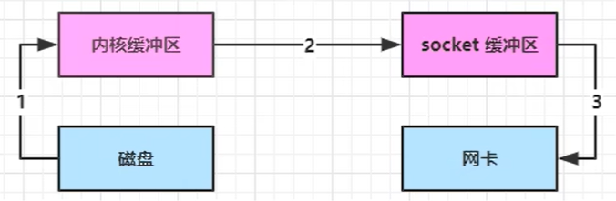

# Netty

## NIO基础

### 三大组件

- Channel：类似于stream（InputStream、OutputStream），但Channel是读写数据的双向通道。可以从channel将数据读入buffer，也可以将buffer的数据写入channel。而像stream要么是输入、要么是输出。channel比stream更为底层。
  
  常见的Channel：
  
  - FileChannel：文件传输。
  
  - DatagramChannel：UDP网络传输。
  
  - SocketChannel：TCP网络传输，客户端与服务端都会用到。
  
  - ServerSocketChannel：TCP网络传输，专用于服务器端。

- Buffer：buffer则用来缓冲读写数据。
  
  常见的buffer有：
  
  - ByteBuffer
    
    - MappedByteBuffer
    
    - DirectByteBuffer
    
    - HeapByteBuffer

- Selector：Selector的作用就是配合一个线程来管理多个channel，获取多个channel上发生的事件。

### Buffer

##### 基本使用

```java
try(RandomAccessFile file = new RandomAccessFile("file", "rw")) {
    FileChannel fileChannel = file.getChannel();
    // 准备缓冲区
    ByteBuffer buffer = ByteBuffer.allocate(10);
    int len;
    // 1、从fileChannel读取数据，向buffer写入
    while ((len = fileChannel.read(buffer)) != -1) {
        System.out.println("读取到字节数: " + len);

        // 2、切换 buffer 读模式
        buffer.flip();

        // 是否还有剩余未读数据
        while (buffer.hasRemaining()) {
            // 3、从buffer读取数据
            System.out.println((char) buffer.get());
        }
        // 4、切换 buffer 写模式
        buffer.clear();
    }
} catch (Exception e) {
    e.printStackTrace();
}
```

##### ByteBuffer结构

ByteBuffer有三个重要的属性：

- capacity：缓冲区容量。

- position：写入位置/读取位置。

- limit：写入限制/读取限制。

初始化时三者的状态：


写模式下，position时写入位置，limit等于capacity：


读模式下（调用flip()方法），position切换为读取位置，limit切换为读取限制：


读取4个字节后，状态为：


clear动作发生后，其状态为：


如果是调用compact()，表示将未读完的部分向前压缩，然后切换至写模式。其状态为：


##### 粘包半包

粘包：多条数据合并为一条数据发送。

半包：数据被截断。（受限于服务器缓冲区大小）

### 文件编程

FileChannel只能工作在阻塞模式下。且不能直接获取FileChannel，必须通过FileInputStream、FileOutputStream或者来获取FileChannel。

- 通过FileInputStream获取到的channel只能读。

- 通过FileOutputStream获取到的channel只能写。

- 通过RandomAccessFile获取到的channel是否读写，根据构造RandomAccessFile时的读写模式决定。

Path & Files。

### 网络编程

#### 处理消息边界

- 一种思路是固定消息长度，数据包大小一样，服务器按照预定长度读取，缺点是浪费带宽。

- 另一种思路是按照分隔符拆分，缺点是效率低。

- TLV格式，即Type类型、Length长度、Value数据，类型和长度已知的情况下，就可以方便获取消息大小。分配何时的buffer，缺点是buffer需提前分配，如果内容过大，则会影响服务端的吞吐量。
  
  - HTTP 1.0是TLV格式。
  
  - HTTP 2.0是LTV格式

> 个人理解：可以参考Redis的数据结构的对象头实现。

### 零拷贝

#### 传统IO

传统IO将一个文件通过socket写出。

```java
RandomAccessFile file = new RandomAccessFile("file", "r");
byte[] buf = new  byte[1024];
file.read(buf);

Socket socket = ...;
socket.getOutputStream().write(buf);
```

其内部工作流程如下：


1. Java本身并不具备IO读写能力，因此read方法调用后，要从Java程序的用户态切换至内核态，去调用操作系统（Kernel）的读能力。将数据读入内核缓冲区。这期间用户线程阻塞，操作系统使用DMA（Direct Memory Access）来实现文件读，期间不会使用CPU。

> DMA可以理解为硬件单元，用来解放CPU，完成文件IO。

2. 从内核态切换至用户态，将数据从内核换成功能区读入用户缓冲区（即 `byte[] buf`），期间CPU会参与拷贝，无法利用DMA。

3. 调用write方法，这时将数据从用户缓冲区（`byte[] buf`）写入socket缓冲区，CPU会参与拷贝。

4. Java也不具备向网卡写数据的能力，因此需要从用户态切换至内核态。调用操作系统的写能力，调用DMA将socket缓冲区的数据写入网卡，不会使用CPU。

可以看到，Java的IO实际不是物理设备级别的读写，而是缓存的复制。底层的真正读写是操作系统来完成的。

- 用户态与和内核态的切换发生了三次。

- 数据拷贝发生了四次。

#### NIO优化

- ByteBuffer.allocate(10)：HeadByteBuffer，使用Java堆内存。

- ByteBuffer.allocateDirect(10)：DirectByteBuffer，使用直接内存，即操作系统内存。


Java可以使用DirectByteBuffer将堆外内存映射到JVM内存中来直接访问使用。

减少了一次内核缓冲区-用户缓冲区的数据拷贝。用户态和内核态切换次数没有减少。

#### NIO进一步优化

底层采用 Linux 2.1 后提供的sendFile方法。在Java中对应着Channel的transferTo/transferFrom方法。



1. Java调用transferTo()方法后，要从Java程序的用户态切换至内核态，使用DMA将数据读入内核缓冲区。不会使用CPU。

2. 数据从内核缓冲区传输到socket缓冲区，CPU会参与拷贝。

3. 最后使用DMA将socket缓冲区的数据写入网卡，不会使用CPU。

只发生了一次用户态和内核态的切换。数据拷贝了三次。

在 Linux 2.4 中又进一步优化为：


1. Java调用transferTo()方法后，要从Java程序的用户态切换至内核态，使用DMA将数据读入内核缓冲区。不会使用CPU。
   
   - 只会将一些offset和length信息拷贝到socket缓冲区，几乎无消耗。

2. 使用DMA将内核缓冲区的数据写入网卡，不会使用CPU。

整个过程只发生了一次用户态和内核态的切换，数据拷贝了两次。所谓`零拷贝`，并不是真正无拷贝，**而是不会拷贝重复数据到JVM内存中**。

零拷贝的优点：

- 不利用CPU计算，减少PCU缓存伪共享。

- 零拷贝适合小文件传输。。

- 更少的用户态和内核态的切换。

## 入门

### 入门程序

#### server

```java
public class Server {

    public static void main(String[] args) throws InterruptedException {
        new ServerBootstrap()
                .group(new NioEventLoopGroup())
                .channel(NioServerSocketChannel.class)
                .childHandler(new ChannelInitializer<NioSocketChannel>() {
                    @Override
                    // 连接建立后，会触发
                    protected void initChannel(NioSocketChannel ch) throws Exception {
                        ch.pipeline().addLast(new StringDecoder());
                        ch.pipeline().addLast(new SimpleChannelInboundHandler() {
                            @Override
                            public void channelRead0(ChannelHandlerContext ctx, Object msg) throws Exception {
                                System.out.println(msg);
                                ctx.channel().writeAndFlush(Unpooled.copiedBuffer("你好，我是服务端", CharsetUtil.UTF_8));
                            }
                        });
                    }
                }).bind(8080);
    }
}
```

#### client

```java
public class Client {

    public static void main(String[] args) throws InterruptedException {
        new Bootstrap()
                .group(new NioEventLoopGroup())
                .channel(NioSocketChannel.class)
                .handler(new ChannelInitializer<NioSocketChannel>() {
                    @Override
                    // 连接建立后，会触发
                    protected void initChannel(NioSocketChannel ch) throws Exception {
                        ch.pipeline().addLast(new StringEncoder());
                        ch.pipeline().addLast(new ChannelInboundHandlerAdapter() {
                            @Override
                            // 读事件触发，服务端接收客户端请求i
                            public void channelRead(ChannelHandlerContext ctx, Object msg) throws Exception {
                                ByteBuf byteBuf=(ByteBuf)msg;
                                System.out.println("服务端发来消息"+byteBuf.toString(CharsetUtil.UTF_8));
                            }
                        });
                    }
                })
                // 连接服务端
                .connect(new InetSocketAddress("localhost", 8080))
                .sync()
                .channel()
                .writeAndFlush("hello world");

    }
}
```

### 概念

- 将Channel理解为数据的通道。

- 将msg理解为传输的数据，最开始输入为ByteBuffer，但经过pipeline处理后，会变成其它类型对象，最后输出又变为ByteBuffer。

- 将handler理解为数据的处理工序（如编解码）。
  
  - 工序可能会有多个（handler），多个工序串起来就是pipeline。pipeline负责发布事件（注册、连接、读、读取完成...）传播给每个handler（流水线传播，由上一个handler传递给下一个handler）。handler堆自己感兴趣的事件进行处理（重写感兴趣的事件处理方法）。
  
  - handler分为Inbound（入站）和Outbound（出栈）。

- 将EventLoop理解为处理数据的工人。
  
  - EventLoop可以管理多个channel的io操作，并且一旦EventLoop负责了某个channel，就要负责到底（绑定）。
  
  - EventLoop既可以执行io操作，也可以进行任务处理，每个EventLoop都有一个任务队列，队列可以存放多个channel的待处理任务，任务分为普通任务、定时任务。
  
  - EventLoop按照pipeline顺序，依次执行每个handler，也可也给每个handler指定不同的EventLoop。

### 组件

#### EventLoop

EventLoop本质是一个单线程执行器（同时还维护了一个Selector），其内部有一个run()方法能够处理Channel发生的IO事件。

其继承关系如下，主要有两条继承线：

```java
public interface EventLoop extends OrderedEventExecutor, EventLoopGroup {}
    public interface OrderedEventExecutor extends EventExecutor {}
    public interface EventLoopGroup extends EventExecutorGroup {}
        public interface EventExecutorGroup extends ScheduledExecutorService, Iterable<EventExecutor> {}
```

- 一条线是继承自j.u.c.ScheduledExecutorService，因此具备线程池中的所有方法。

- 另一条线是继承自Netty自己的OrderedEventExecutor。
  
  - 提供`boolean inEventLoop(Thread thread)`方法判断线程是否属于此EventLoop。
  
  - 提供`EventExecutorGroup parent()`方法判断属于哪个EventLoopGroup。

EventLoopGroup是一组EventLoop的集合（线程池），Channel一般会调用EventLoopGroup的register方法来绑定其中一个EventLoop。保证后续这个Channel上的IO事件都由此 EventLoop来处理。

- 其继承自Netty自己的EventExecutorGroup。
  
  - 实现了Iterable接口提供遍历EventLoop的能力。
  
  - 另有next()方法获取EventLoopGroup中下一个EventLoop。

##### 普通&定时任务

```java
// NioEventLoopGroup：处理io事件、普通任务、定时任务
EventLoopGroup group = new NioEventLoopGroup(2);

// DefaultEventLoopGroup：普通任务、定时任务
EventLoopGroup group = new DefaultEventLoopGroup(2);

// 获取下一个EventLoop对象
group.next();

// 执行普通任务
group.next().submit(() -> {
  ......
});

// 执行定时任务，第二个参数为初始延迟，第三个参数为执行频率，第四个参数为时间单位
group.next().scheduleAtFixedRate(() -> {
  ......
}, 0, 1, TimeUnit.SECONDS);
```

##### 分工细化

```java
public class Server {

    public static void main(String[] args) throws InterruptedException {
        EventLoopGroup group = new DefaultEventLoopGroup(2);
        new ServerBootstrap()
                .group(new NioEventLoopGroup(1), new NioEventLoopGroup())
                .channel(NioServerSocketChannel.class)
                .childHandler(new ChannelInitializer<NioSocketChannel>() {
                    @Override
                    // 连接建立后，会触发
                    protected void initChannel(NioSocketChannel ch) throws Exception {
                        ch.pipeline().addLast(new StringDecoder());

                        // 交给其它group执行
                        ch.pipeline().addLast("handler-1", new SimpleChannelInboundHandler() {
                            @Override
                            public void channelRead0(ChannelHandlerContext ctx, Object msg) throws Exception {
                                System.out.println(msg);

                                // 将msg传递给下一个handler
                                ctx.fireChannelRead(msg);
                            }
                        }).addLast(group, "handler-2", new SimpleChannelInboundHandler() {
                            @Override
                            public void channelRead0(ChannelHandlerContext ctx, Object msg) throws Exception {
                                System.out.println(msg);
                                ctx.channel().writeAndFlush(Unpooled.copiedBuffer("你好，我是服务端", CharsetUtil.UTF_8));
                            }
                        });
                    }
                }).bind(8080);
    }
}
```

建议将EventLoopGroup的职责划分更细，分为bossGroup和workerGroup。bossGroup负责NioServerSocketChannel上的accept事件，而workerGroup负责NioSocketChannel上的读写事件。

如果handler执行耗时较长，也可以给handler指定不同的EventLoop。避免影响到执行IO事件的效率。

##### 切换线程

```java
// 调用：io.netty.channel.AbstractChannelHandlerContext#fireChannelRead
public ChannelHandlerContext fireChannelRead(final Object msg) {
    invokeChannelRead(findContextInbound(MASK_CHANNEL_READ), msg);
    return this;
}

// 切换线程的关键代码：io.netty.channel.AbstractChannelHandlerContext#invokeChannelRead
static void invokeChannelRead(final AbstractChannelHandlerContext next, Object msg) {
    final Object m = next.pipeline.touch(ObjectUtil.checkNotNull(msg, "msg"), next);

    // 获取下一个handler的EventLoop
    EventExecutor executor = next.executor();

    /*
      判断当前handler中的线程，是否和下一个handler的EventLoop是同一个线程
      如果两个handler绑定的是同一个EventLoop，那么就执行if逻辑，反之执行else逻辑
    */
    if (executor.inEventLoop()) {
        next.invokeChannelRead(m);
    } else {

      // 由下一个handler的线程来调用（executor）
        executor.execute(new Runnable() {
            @Override
            public void run() {
                next.invokeChannelRead(m);
            }
        });
    }
}
```

#### Channel

Netty中的Channel与JDK中的Channel作用相当，是对I/O操作的封装。如read()、write()、connect()、bind()等，是Netty中核心对象。而NioServerSocketChannel、NioSocketChannel就是其具体实现。

Channel的状态改变都会触发相应事件传递到Pipeline中，被ChannelHandler处理。

常见的触发事件：channelRegistered、channelRead、channelActive...

Channel主要作用：

- close()：关闭channel。

- closeFuture()：关闭channel。
  
  - sync()：同步等待channel关闭。
  
  - addListener()：异步等待channel关闭。

- pipeline()：添加handler。

- write()：将数据写入。

- writeAndFlush()：将数据写入并刷出。

##### 连接问题

```java
public class Client {

    public static void main(String[] args) throws InterruptedException {
        new Bootstrap()
                .group(new NioEventLoopGroup())
                .channel(NioSocketChannel.class)
                .handler(new ChannelInitializer<NioSocketChannel>() {
                    @Override
                    // 连接建立后，会触发
                    protected void initChannel(NioSocketChannel ch) throws Exception {
                        ch.pipeline().addLast(new StringEncoder());
                        ch.pipeline().addLast(new ChannelInboundHandlerAdapter() {
                            @Override
                            // 读事件触发，服务端接收客户端请求i
                            public void channelRead(ChannelHandlerContext ctx, Object msg) throws Exception {
                                ByteBuf byteBuf=(ByteBuf)msg;
                                System.out.println("服务端发来消息"+byteBuf.toString(CharsetUtil.UTF_8));
                            }
                        });
                    }
                })
                // 连接服务端
                .connect(new InetSocketAddress("localhost", 8080))
                .sync()
                .channel()
                .writeAndFlush("hello world");

    }
}
```

connect()方法是异步非阻塞的（ChannelFuture），main线程发起调用，但真正执行connect的是nio线程。所以需要再调用sync()方法，同步等待连接结果。或者使用addListener()添加回调，当nio线程连接建立好之后，调用回调函数，由nio线程执行。

closeFuture()同理，要么sync()同步等待，要么添加回调。

Netty中Future的场景很多，Future要点：

- 首先肯定是使用多线程。

- 但异步并没有缩短响应事件，反而有所增加。但异步提高了单位时间内的吞吐量（处理请求的速度）。

- 合理进行任务拆分，也是利用异步的关键。

#### Future&Promise

在进行异步处理时，经常用到Future和Promise这两个接口。

Netty中的Future与JDK中的同名，但Netty的Future继承自JDK的Future，而Promise又是对Netty Future的扩展。

Promise可以理解为结果容器。

Netty中线程间的通信方式就是用的Promise。

#### Handler&Pipeline

handler是控制socket io的各个生命周期的业务实现。

ChannelHandler用来处理Channel上的IO事件，分为入站、出站两种。所有的ChannelHandler被串起来就是Pipeline。

- 入站处理器通常是ChannelInboundHandlerAdapter的子类，主要用于读取客户端数据，写回结果。

- 出站处理器通常是ChannelOutboundHandlerAdapter的子类，主要用于对写回结果进行加工（编码）。

> 形象理解：每个Channel是一个产品的加工车间，Pipeline是车间中的流水线，ChannelHandler是流水线上的工序，而ByteBuf则是原材料。

假设服务端有三个入站、三个出站处理器：`head -> h1 -> h2 -> h3 -> h4 -> h5 -> h6 -> tail`

- 入站顺序：`h1 -> h2 -> h3`。

- 出站顺序：`h6 -> h5 -> h4`。
  
  - `ctx.channel().writeAndFlush()`：从tail -> head找出站处理器。
  
  - `ctx.writeAndFlush()`：从当前处理器 -> head找出站处理器。（可以修改出入站添加的顺序）

如果想要出站处理器生效，则需要在入站处理器中向客户端channel有写数据。

服务端pipeline触发流程：


Netty中的Pipeline本质上是一个双向链表，它采用了责任链模式。

`EmbeddedChannel`是Netty提供的测试handler类，用于测试handler调用链。无需启动服务端。

#### ByteBuf

Netty的ByteBuf是对nio的ByteBuffer的增强。

##### 创建

```java
/**
 默认容量256字节
 * ByteBuf buffer();
 指定初始容量
 * ByteBuf buffer(int initialCapacity);
 指定初始容量，以及扩容的最大容量
 * ByteBuf buffer(int initialCapacity, int maxCapacity);
 */
ByteBuf buffer = ByteBufAllocator.DEFAULT.buffer();
buffer.writeBytes("".toString().getBytes());
```

##### 池化&内存模式

- 堆内存
  
  - `ByteBuf buffer = ByteBufAllocator.DEFAULT.heapBuffer(10);`

- 直接内存
  
  - `ByteBuf buffer = ByteBufAllocator.DEFAULT.directBuffer(10);`

- 以上两种方式均基于池化创建的ByteBuf。
  
  - 直接内存创建和销毁的代价昂贵，但读写性能高（少一次内复制），适合配合池化使用。
  
  - 直接内存对GC压力小，但这部分内存不受JVM垃圾回收管理，需要注意及时主动释放。

##### 组成


- ByteBuf 是一个字节容器，容器里面的的数据分为四个部分：
  
  - 第一个部分是已经丢弃的字节，这部分数据是无效的；（已经读过的内容）
  
  - 第二部分是可读字节，这部分数据是 ByteBuf 的主体数据， 从 ByteBuf 里面读取的数据都来自这一部分;（已经写入但还未读取的内容）
  
  - 第三部分数据是可写字节，所有写到 ByteBuf 的数据都会写到这一段；（剩余可写入数据的空间大小）
  
  - 最后一部分表示的是该 ByteBuf 最多还能扩容多少容量

- 上图中除了可扩容部分，剩下的内容是被两个指针给划分出来的，从左到右，依次是读指针（readerIndex）、写指针（writerIndex），然后还有一个变量 capacity，表示 ByteBuf 底层内存的总容量；

- 从 ByteBuf 中每读取一个字节，readerIndex 自增1，ByteBuf 里面总共有 writerIndex-readerIndex 个字节可读, 由此可以推论出当 readerIndex 与 writerIndex 相等的时候，ByteBuf 不可读；

- 写数据是从 writerIndex 指向的部分开始写，每写一个字节，writerIndex 自增1，直到增到 capacity，这个时候，表示 ByteBuf 已经不可写了；

- ByteBuf 里面还有一个参数 maxCapacity，当向 ByteBuf 写数据的时候，如果容量不足，那么这个时候可以进行扩容，直到 capacity 扩容到 maxCapacity，超过 maxCapacity 就会报错。

##### 写入&读取

- 写入

| 方法                                                            | 描述                        |
|:-------------------------------------------------------------:| ------------------------- |
| writeBoolean(boolean value)                                   |                           |
| writeByte(int value)                                          |                           |
| writeShort(int value)                                         |                           |
| writeInt(int value)                                           | 写入 int 值，默认大端字节序。先写高位再写低位 |
| writeIntLE(int value)                                         | 写入 int 值，小端字节序。先写低位再写高位   |
| writeLong(long value)                                         |                           |
| writeChar(int value)                                          |                           |
| writeFloat(float value)                                       |                           |
| writeDouble(double value)                                     |                           |
| writeBytes(ByteBuf src)                                       | 写入 netty 的 ByteBuf        |
| writeBytes(byte[] src)                                        | 写入 byte[]                 |
| writeBytes(ByteBuffer src)                                    | 写入 nio 的 ByteBuffer       |
| int writeCharSequence(CharSequence sequence, Charset charset) | 写入字符串，需指定字符编码             |

方法返回值都是ByteBuf，可以链式调用。

还有一类方法是set开头的方法，也可以写入数据，但不会改变写指针位置。用于修改指定位置的字节。

- 扩容规则
  
  - 假定ByteBuf初始容量为10，一次性写入了12个字节，此时需要发生扩容。
  
  - 如果写入后数据大小没有超过512字节，则选择写一个16的整数倍，例如写入后大小为12字节，则扩容后capacity为16字节。
  
  - 如果写入数据后大小超过512字节，则选择下一个2^n，例如写入后大小为513，则扩容后capacity为2^10=1024。
  
  - 且扩容不能超过`maxcapacity`，超过会报错。

- 读取

读过的内容，就属于废弃部分，再读只能读那些尚未读取的部分。

| 方法                        | 描述                                |
| ------------------------- | --------------------------------- |
| buffer.readByte()         | 每次读取一个字节                          |
| buffer.readInt()          | 每次读取一个整数，也就是四个字节                  |
| buffer.markReaderIndex()  | 为读指针做一个标记，配合下面的方法可以实现重复读取某个索引处的字节 |
| buffer.resetReaderIndex() | 将读指针跳到上一个标记过的地方实现重复读取某个数          |

除了上面一些了read开头的方法以外，还有一系列get开头的方法也可以读取数据，只不过get开头的方法不会改变读指针位置。相当于是按索引去获取。

如果需要重复读取，需要调用buffer.markReaderIndex()对读指针进行标记，并通过buffer.resetReaderIndex()将读指针恢复到mark标记的位置。

##### 内存释放

Netty采用引用计数法来实现回收内存，每个ByteBuf都实现了ReferenceCounted接口：

- 每个ByteBuf对象的初始计数为1。

- 调用release方法计数减1，如果计数为0，ByteBuf内存被回收。

- 调用retain方法计数加1，表示调用者没用完之前，即使其它handler调用了release方法也不会造成回收。

- 当计数为0时，底层内存会被回收。即使ByteBuf对象还在，但其各个方法均无法正常使用。

基本规则是，谁是最后使用者（谁最后使用ByteBuf），谁负责release，详细分析如下：

- 一般情况下：如果是入站ByteBuf，由tail负责release。如果是出站ByteBuf，由head负责release。

##### 零拷贝

- slice
  
  - 零拷贝的体现之一，对原始ByteBuf进行切片成多个ByteBuf，切片后的ByteBuf并没有发生内存复制，还是使用原始ByteBuf的内存，切片后的ByteBuf维护独立的read、write指针。（可以理解为引用拷贝）
  
  
  
  ```java
    ByteBuf buffer = ByteBufAllocator.DEFAULT.directBuffer(10);
    buffer.writeBytes("abcdefg".toString().getBytes());
  
    /*
      buffer.slice()：返回此缓冲区的可读字节中的一个片段
      buffer.slice(0, 3)：返回此缓冲区的子区域的一部分。第一个参数是开始索引，第二个参数是分片长度
    */
    buffer.slice();
    buffer.slice(0, 3);
  ```

修改返回的缓冲区或此缓冲区的内容会影响彼此的内容，同时返回的缓冲区会维护单独的索引和标记。

切片后的ByteBuf不允许添加的新的字节，否则会抛异常。（限制新的切片的最大容量）

原始ByteBuf释放内存后，切片后的ByteBuf也无法使用。也会抛异常。因为使用的都是同一块内存。如果还想让切片后的ByteBuf生效，需在释放内存前执行一次retain()，让引用计数加1。然后保证谁最后使用，谁释放原则。（且retain、release需成对出现）

- composite
  
  - CompositeByteBuf字面意思就是组合ByteBuf，他会把多个ByteBuf组合到一起，这些ByteBuf在逻辑上连续，实际物理地址不一定连续。如果超过最大值，就会进行扩容操作。
  
  ```java
    ByteBuf buffer1 = ByteBufAllocator.DEFAULT.buffer(10);
    buffer1.writeBytes(new byte[]{1, 2, 3, 4, 5});
  
    ByteBuf buffer2 = ByteBufAllocator.DEFAULT.buffer(10);
    buffer2.writeBytes(new byte[]{6, 7, 8, 9, 10});
  
    CompositeByteBuf buffer = ByteBufAllocator.DEFAULT.compositeBuffer(10);
    buffer.addComponents(true, buffer1, buffer2);
  ```

#### Unpooled

Unpooled是一个工具类，提供非池化的ByteBuf创建、阻塞、复制等操作。

## 进阶

### 粘包半包

- 粘包：顾名思义就是不同的数据包粘在一起了，接收端一次接受到了多个数据包，而且不保证是多个完整数据包的集合，也许其中某个数据包是不完整的。

- 半包：顾名思义就是数据包不完整，只有一半。其实就是数据在传输接收过程中，接收端一次接收没有接收到完整的数据包，需要经过多次接收才能得到完整数据包。

如果没有一个好的协议规范，半包和粘包在TCP数据传输中是很普遍的问题，它们不是两个孤立的问题，彼此相伴相生。

#### 现象分析

粘包：

- 现象：发送`adb`、`def`，接收`abcdef`。

- 原因：
  
  - 应用层：接收方ByteBuf设置过大（Netty接收缓冲区默认1024）
  
  - 滑动窗口：假设发送方256bytes表示一个完整报文，但由于接收方处理不及时且窗口大小足够大，者256bytes字节就会缓冲在接收方的滑动窗口中，当滑动窗口缓冲了多个报文就会粘包。
  
  - Nagle算法：会造成粘包。

半包：

- 现象：发送`abcdef`，接收`adb`、`def`。

- 原因：
  
  - 应用层：接收方ByteBuf小于实际发送数据量。
  
  - 滑动窗口：假设接收方的窗口只剩余128bytes，而发送方的报文大小是256bytes，这时窗口放不下，只能先发送128bytes，等待ack后才能发送剩余部分，这就造成了半包。
  
  - MSS限制：当发送的数据超过MSS限制后，会将数据切片发送，就会造成半包。

> MSS (Maximum Segment Size)，最大报文长度。TCP payload的最大值，TCP协议定义的一个选项，MSS是TCP用来限制应用层最大的发送字节数。
> 
> 最大传输单元（Maximum Transmission Unit，MTU）限制的是**数据链路层的payload,也就是上层协议的大小**,例如IP,ICMP等。

本质是因为TCP是流式协议，消息无边界。

#### 解决

- 短链接：能解决半包，但粘包还是会存在。缺点是每次以`连接-断开`为一个消息边界。频繁的连接断开影响性能。

- 定长解码器：能够解决粘包半包。缺点是占用字节过多，不满定长字节数的会补全bit位。

- 行解码器：能够解决粘包半包。缺点是遍历字节查找分隔符。效率低。

- LTC解码器：`LengthFieldBasedFrameDecoder`。

### 协议设计与解析

#### 自定义协议

自定义协议要素：

- 魔数：用来判断是否是无效数据包。

- 版本号：支持协议的升级。

- 序列化算法：消息正文采用哪种序列化方式。例如：ProtoBuf、hessian。

- 指令类型：具体功能，跟业务相关。例如：登录、注册...

- 请求序号：提供给异步能力。

- 正文长度

- 消息正文

## 优化

### 参数调优

**默认配置类：DefaultChannelConfig。**

#### 客户端连接超时

- 属于SocketChannel参数`CONNECT_TIMEOUT_MILLIS`。

- 用于在客户端建立连接时，如果在指定时间内无法连接，则抛出timeout异常。

- `SO_TIMEOUT`主要用在阻塞IO。阻塞IO中accept、read等操作都是无限等待的，如果不希望一直阻塞，可以使用`SO_TIMEOUT`调整超时时间。

```java
// 客户端 SocketChannel 参数用 .option(xxx, xxx) 设置

// 服务端
    // ServerSocketChannel 用 .option(xxx, xxx) 设置
    // SockerChannel 用 childOption(xxx, xxx) 设置
```

#### SO_BACKLOG

控制全连接队列的大小。服务端参数。

如果是Windows系统默认SO_BACKLOG为200，否则为128。

Netty与Linux中`proc/ysy/net/core/somaxconn`值比较，结果取较小的值。

#### ulimit -n

属于操作系统参数

#### TCP_NODELAY

属于SocketChannel参数，即Nagle算法，默认值为false，开启了Nagle算法。建议设置true关闭Nagle。

#### SO_SENDBUF&SO_RCVBUF

决定了滑动窗口的上限。

- SO_SENDBUF属于SocketChannel参数。

- SO_RCVBUF既可用于SocketChannel，也能用于ServerSocketChannel。建议设置到ServerSocketChannel上。

- SO_SNDBUF：TCP发送缓冲区的**容量上限**；

- SO_RCVBUF：TCP接受缓冲区的**容量上限**；

`SO_SNDBUF`和`SO_RCVBUF`只是规定了读写缓冲区大小的上限，在实际使用未达到上限前，`SO_SNDBUF`和`SO_RCVBUF`是不起作用的。

一个TCP连接占用的内存相当于读写缓冲区实际占用内存大小之和。

#### ALLOCATOR

SocketChannel参数。allocator（分配器）。

用于分配ByteBuf，ctx.alloc()。

#### RCVBUF_ALLOCATOR

SocketChannel参数。

控制Netty接收缓冲区大小。

负责入站数据的分配，决定入站缓冲区的大小（可动态调整），同一采用direct直接内存。具体池化或非池化由allocator决定。

## 源码

### 程序入口

如下所示是JavaNIO的步骤，那么Netty在底层是怎么封装这些步骤的呢？

```java
// 1、创建Selector
Selector selector = Selector.open();

// NioServerSocketChannel attachment = new NioServerSocketChannel();

// 2、创建ServerSocketChannel，处理连接请求
ServerSocketChannel serverSocketChannel = ServerSocketChannel.open();
// 设置是否为非阻塞
serverSocketChannel.configureBlocking(false);

// SelectionKey selectionKey = serverSocketChannel.register(selector, 0, attachment);

// 3、将 serverSocketChannel 注册到 selector 中
SelectionKey selectionKey = serverSocketChannel.register(selector, 0);

// 4、该SelectionKey上注册的关注事件集合
selectionKey.interestOps(SelectionKey.OP_ACCEPT);

// 5、绑定端口号
serverSocketChannel.bind(new InetSocketAddress(8080));

while(true) {
    selector.select();
    Iterator<SelectionKey> keys = selector.selectedKeys().iterator();
    while(keys.hasNext()) {
        SelectionKey key = keys.next();
        keys.remove();

        if (key.isAcceptable()) {
            ServerSocketChannel channel = (ServerSocketChannel)key.channel();
            SocketChannel sc = channel.accept();
            sc.configureBlocking(false);
            SelectionKey scKey = sc.register(selector, 0);
            scKey.interestOps(SelectionKey.OP_READ);
        }
        if (key.isReadable()) {
            try {
                SocketChannel channel = (SocketChannel)key.channel();
                ByteBuffer buffer = ByteBuffer.allocate(16);
                // 如果客户端正常断开，也会触发读事件，但会返回-1
                int read = channel.read(buffer);
                if (read == -1) {
                   key.cancel();
                   continue;
                }
                buffer.flip();
                ......
            } catch(Exception e) {
                // 客户端断开会触发服务端的读事件，异常断开会抛异常，需要将下线的客户端在Selector取消注册
                key.cancel();
            }
        }
    }
}
```

Netty的启动程序如下所示：

```java
new ServerBootstrap()
    // NioEventLoopGroup 内部包含 nio 线程
    .group(new NioEventLoopGroup())
    .channel(NioServerSocketChannel.class)
    .childHandler(new ChannelInitializer<NioSocketChannel>() {
        @Override
        protected void initChannel(NioSocketChannelch) throws Exception {
            ch.pipeline().addLast(new SimpleChannelInboundHandler() {
                @Override
                protected void channelRead0(ChannelHandlerContext ctx, Object msg) throws Exception {
                    System.out.println("第一个Netty程序!");
                }
            });
        }
    }).bind(8080);
```

在Netty中，除了前面JavaNIO第一个的步骤是在NioEventLoopGroup完成的，剩余四个步骤都是在bind方法进行的。

### 启动流程

#### init

```java
public ChannelFuture bind(int inetPort) {
    return bind(new InetSocketAddress(inetPort));
}

public ChannelFuture bind(SocketAddress localAddress) {
    validate();
    return doBind(ObjectUtil.checkNotNull(localAddress, "localAddress"));
}

private ChannelFuture doBind(final SocketAddress localAddress) {

    // 1、initAndRegister 完成初始化和注册
    final ChannelFuture regFuture = initAndRegister();
    final Channel channel = regFuture.channel();
    if (regFuture.cause() != null) {
        return regFuture;
    }

    if (regFuture.isDone()) {
        // At this point we know that the registration was complete and successful.
        ChannelPromise promise = channel.newPromise();

        // 2、在初始化和注册完成后，真正执行原生 ServerSocketChannel bind
        doBind0(regFuture, channel, localAddress, promise);
        return promise;
    } else {
        // Registration future is almost always fulfilled already, but just in case it's not.
        final PendingRegistrationPromise promise = new PendingRegistrationPromise(channel);

        /* 
            添加监听器（回调）
            当initAndRegister()执行完成后，由Nio Thread回调执行
        */
        regFuture.addListener(new ChannelFutureListener() {
            @Override
            public void operationComplete(ChannelFuture future) throws Exception {
                Throwable cause = future.cause();
                if (cause != null) {
                    // Registration on the EventLoop failed so fail the ChannelPromise directly to not cause an
                    // IllegalStateException once we try to access the EventLoop of the Channel.
                    promise.setFailure(cause);
                } else {
                    // Registration was successful, so set the correct executor to use.
                    // See https://github.com/netty/netty/issues/2586
                    promise.registered();

                    // 2、在初始化和注册完成后，真正执行原生 ServerSocketChannel bind
                    doBind0(regFuture, channel, localAddress, promise);
                }
            }
        });
        return promise;
    }
}
```

initAndRegister()从方法名就能看出来，其对应的是两个步骤：

1. `ServerSocketChannel.open();`

2. `serverSocketChannel.register(selector, 0);`

```java
final ChannelFuture initAndRegister() {
    Channel channel = null;
    try {
        /*
        1、ServerSocketChannel serverSocketChannel = ServerSocketChannel.open()
            创建 NioServerSocketChannel 实例，反射调用无参构造
            在其构造中执行 ServerSocketChannel.open()
        */
        channel = channelFactory.newChannel();
        // 初始化 NioServerSocketChannel
        init(channel);
    } catch (Throwable t) {
        if (channel != null) {
            // channel can be null if newChannel crashed (eg SocketException("too many open files"))
            channel.unsafe().closeForcibly();
            // as the Channel is not registered yet we need to force the usage of the GlobalEventExecutor
            return new DefaultChannelPromise(channel, GlobalEventExecutor.INSTANCE).setFailure(t);
        }
        // as the Channel is not registered yet we need to force the usage of the GlobalEventExecutor
        return new DefaultChannelPromise(new FailedChannel(), GlobalEventExecutor.INSTANCE).setFailure(t);
    }

    /*
    2、serverSocketChannel.register(selector, 0, att)
        将 ServerSocketChannel 注册到 Selector
    */
    ChannelFuture regFuture = config().group().register(channel);
    if (regFuture.cause() != null) {
        if (channel.isRegistered()) {
            channel.close();
        } else {
            channel.unsafe().closeForcibly();
        }
    }

    return regFuture;
}
```

而doBind0()方法自然就是绑定端口逻辑了：

- `serverSocketChannel.bind(new InetSocketAddress(8080));`

#### register

```java
// 入口：ChannelFuture regFuture = config().group().register(channel);

// 调用：io.netty.channel.MultithreadEventLoopGroup#register
public ChannelFuture register(Channel channel) {
    return next().register(channel);
}

// 调用：io.netty.channel.SingleThreadEventLoop#register
public ChannelFuture register(Channel channel) {
    return register(new DefaultChannelPromise(channel, this));
}
public ChannelFuture register(final ChannelPromise promise) {
    ObjectUtil.checkNotNull(promise, "promise");
    promise.channel().unsafe().register(this, promise);
    return promise;
}

// 调用：io.netty.channel.AbstractChannel.AbstractUnsafe#register
public final void register(EventLoop eventLoop, final ChannelPromise promise) {
    ObjectUtil.checkNotNull(eventLoop, "eventLoop");
    if (isRegistered()) {
        promise.setFailure(new IllegalStateException("registered to an event loop already"));
        return;
    }
    if (!isCompatible(eventLoop)) {
        promise.setFailure(
                new IllegalStateException("incompatible event loop type: " + eventLoop.getClass().getName()));
        return;
    }

    AbstractChannel.this.eventLoop = eventLoop;

    // 判断当前线程是不是 nio thread，启动时很显然不是，则执行 else 逻辑
    if (eventLoop.inEventLoop()) {
        register0(promise);
    } else {
        try {
            /*
                将真正注册逻辑交给 eventLoop 执行 （nio thread 执行）
                懒加载，第一次调用 execute() 才会将 eventLoop 关联的 nio thread 创建
                （启动 nio boss 线程）
            */
            eventLoop.execute(new Runnable() {
                @Override
                public void run() {
                    // 原生 ServerSocketChannel 注册到 Selector，但没有关注事件
                    register0(promise);
                }
            });
        } catch (Throwable t) {
            logger.warn(
                    "Force-closing a channel whose registration task was not accepted by an event loop: {}",
                    AbstractChannel.this, t);
            closeForcibly();
            closeFuture.setClosed();
            safeSetFailure(promise, t);
        }
    }
}

// 调用：io.netty.channel.AbstractChannel.AbstractUnsafe#register0
private void register0(ChannelPromise promise) {
    try {
        // check if the channel is still open as it could be closed in the mean time when the register
        // call was outside of the eventLoop
        if (!promise.setUncancellable() || !ensureOpen(promise)) {
            return;
        }
        boolean firstRegistration = neverRegistered;

        /*
        模板方法，由子类实现，(AbstractNioChannel)
            一般do开头的方法就是干活的方法
            原生 ServerSocketChannel 注册到 Selector，但没有关注事件
            底层等同于serverSocketChannel.register(selector, 0)
        */
        doRegister();
        neverRegistered = false;
        registered = true;

        // Ensure we call handlerAdded(...) before we actually notify the promise. This is needed as the
        // user may already fire events through the pipeline in the ChannelFutureListener.

        /*
        具体执行到附录中init(channel)中的回调方法
            执行 NioServerSockerChannel 初始化 handler （ChannelInitializer）
        */
        pipeline.invokeHandlerAddedIfNeeded();

        safeSetSuccess(promise);

        // 回调 channelRegistered()
        pipeline.fireChannelRegistered();
        // Only fire a channelActive if the channel has never been registered. This prevents firing
        // multiple channel actives if the channel is deregistered and re-registered.
        if (isActive()) {
            if (firstRegistration) {
                pipeline.fireChannelActive();
            } else if (config().isAutoRead()) {
                // This channel was registered before and autoRead() is set. This means we need to begin read
                // again so that we process inbound data.
                //
                // See https://github.com/netty/netty/issues/4805
                beginRead();
            }
        }
    } catch (Throwable t) {
        // Close the channel directly to avoid FD leak.
        closeForcibly();
        closeFuture.setClosed();
        safeSetFailure(promise, t);
    }
}
```

在AbstractChannel的子类`io.netty.channel.nio.AbstractNioChannel#doRegister`中执行了Java原生nio的注册逻辑：

```java
protected void doRegister() throws Exception {
    boolean selected = false;
    for (;;) {
        try {
            /*
            调用 Java nio 的 serverSocketChannel.register(selector, 0, att);
                1、Selector被eventLoop管理，从eventLoop().unwrappedSelector()获取Selector
                2、未关注事件
                3、Netty传入的附件为 this，类型为 NioServerSocketChannel，将来selector发生事件由 NioServerSocketChannel 处理
            */
            selectionKey = javaChannel().register(eventLoop().unwrappedSelector(), 0, this);
            return;
        } catch (CancelledKeyException e) {
            ......
        }
    }
}

protected SelectableChannel javaChannel() {
    return ch;
}
```

回顾一下Java nio 的注册逻辑：

```java
/*
    public abstract class ServerSocketChannel extends AbstractSelectableChannel implements NetworkChannel
    public abstract class AbstractSelectableChannel extends SelectableChannel
*/
// 入口：SelectionKey selectionKey = serverSocketChannel.register(selector, 0);

// 调用：java.nio.channels.SelectableChannel#register
public final SelectionKey register(Selector sel, int ops)
    throws ClosedChannelException
{ 
    return register(sel, ops, null);
}

// 调用：java.nio.channels.spi.AbstractSelectableChannel#register
public final SelectionKey register(Selector sel, int ops,
                                   Object att)
    throws ClosedChannelException
{
    synchronized (regLock) {
        if (!isOpen())
            throw new ClosedChannelException();
        if ((ops & ~validOps()) != 0)
            throw new IllegalArgumentException();
        if (blocking)
            throw new IllegalBlockingModeException();
        SelectionKey k = findKey(sel);
        if (k != null) {
            k.interestOps(ops);
            k.attach(att);
        }
        if (k == null) {
            // New registration
            synchronized (keyLock) {
                if (!isOpen())
                    throw new ClosedChannelException();
                k = ((AbstractSelector)sel).register(this, ops, att);
                addKey(k);
            }
        }
        return k;
    }
}
```

此时Java Nio 和 Netty 的注册ServerSocketChannel到Selector就对上了。

#### doBind0

当initAndRegister()执行完后，会触发regFuture的回调执行doBind0()，在前面逻辑中`regFuture.addListener(new ChannelFutureListener() {...doBind0()...})`添加的回调函数，此时会得到执行。并执行原生 ServerSocketChannel 绑定端口。

```java
// 调用：io.netty.bootstrap.AbstractBootstrap#doBind0
private static void doBind0(
        final ChannelFuture regFuture, final Channel channel,
        final SocketAddress localAddress, final ChannelPromise promise) {

    // This method is invoked before channelRegistered() is triggered.  Give user handlers a chance to set up
    // the pipeline in its channelRegistered() implementation.

    // 还是由 eventLoop nio 线程执行
    channel.eventLoop().execute(new Runnable() {
        @Override
        public void run() {
            if (regFuture.isSuccess()) {
                // 
                channel.bind(localAddress, promise).addListener(ChannelFutureListener.CLOSE_ON_FAILURE);
            } else {
                promise.setFailure(regFuture.cause());
            }
        }
    });
}

// 调用：io.netty.channel.AbstractChannel#bind
public ChannelFuture bind(SocketAddress localAddress, ChannelPromise promise) {
    return pipeline.bind(localAddress, promise);
}

// 调用：io.netty.channel.DefaultChannelPipeline#bind
public final ChannelFuture bind(SocketAddress localAddress, ChannelPromise promise) {
    return tail.bind(localAddress, promise);
}

// 调用：io.netty.channel.AbstractChannelHandlerContext#bind
public ChannelFuture bind(final SocketAddress localAddress, final ChannelPromise promise) {
    ObjectUtil.checkNotNull(localAddress, "localAddress");
    if (isNotValidPromise(promise, false)) {
        // cancelled
        return promise;
    }

    final AbstractChannelHandlerContext next = findContextOutbound(MASK_BIND);
    EventExecutor executor = next.executor();
    if (executor.inEventLoop()) {
        // 
        next.invokeBind(localAddress, promise);
    } else {
        safeExecute(executor, new Runnable() {
            @Override
            public void run() {
                next.invokeBind(localAddress, promise);
            }
        }, promise, null, false);
    }
    return promise;
}
private void invokeBind(SocketAddress localAddress, ChannelPromise promise) {
    if (invokeHandler()) {
        try {
            // 其调用的是实现类 DefaultChannelPipeline.HeadContext#bind
            ((ChannelOutboundHandler) handler()).bind(this, localAddress, promise);
        } catch (Throwable t) {
            notifyOutboundHandlerException(t, promise);
        }
    } else {
        bind(localAddress, promise);
    }
}

// 调用：io.netty.channel.DefaultChannelPipeline.HeadContext#bind
public void bind(
        ChannelHandlerContext ctx, SocketAddress localAddress, ChannelPromise promise) {
    unsafe.bind(localAddress, promise);
}

// 调用：io.netty.channel.AbstractChannel.AbstractUnsafe#bind
public final void bind(final SocketAddress localAddress, final ChannelPromise promise) {
    assertEventLoop();

    if (!promise.setUncancellable() || !ensureOpen(promise)) {
        return;
    }

    // See: https://github.com/netty/netty/issues/576
    if (Boolean.TRUE.equals(config().getOption(ChannelOption.SO_BROADCAST)) &&
        localAddress instanceof InetSocketAddress &&
        !((InetSocketAddress) localAddress).getAddress().isAnyLocalAddress() &&
        !PlatformDependent.isWindows() && !PlatformDependent.maybeSuperUser()) {
        // Warn a user about the fact that a non-root user can't receive a
        // broadcast packet on *nix if the socket is bound on non-wildcard address.
        logger.warn(
                "A non-root user can't receive a broadcast packet if the socket " +
                "is not bound to a wildcard address; binding to a non-wildcard " +
                "address (" + localAddress + ") anyway as requested.");
    }

    boolean wasActive = isActive();
    try {
        // 原生 ServerSocketChannel 绑定端口
        doBind(localAddress);
    } catch (Throwable t) {
        safeSetFailure(promise, t);
        closeIfClosed();
        return;
    }

    // 判断ServerSocketChannel是否可用，可用则处于active状态
    if (!wasActive && isActive()) {
        invokeLater(new Runnable() {
            @Override
            public void run() {
                pipeline.fireChannelActive();
            }
        });
    }

    safeSetSuccess(promise);
}
```

最终经过漫长的方法调用，又回到了NioServerSocketChannel调用bind()，其内部就调用的就是Java nio 的bind逻辑。

```java
// 调用：io.netty.channel.socket.nio.NioServerSocketChannel#doBind
protected void doBind(SocketAddress localAddress) throws Exception {
    // 当前使用的JDK是1.8
    if (PlatformDependent.javaVersion() >= 7) {
        // serverSocketChannel.bind(new InetSocketAddress(8080));
        javaChannel().bind(localAddress, config.getBacklog());
    } else {
        javaChannel().socket().bind(localAddress, config.getBacklog());
    }
}
// javaChannel()返回的是sun.nio.ch.ServerSocketChannelImpl。
```

此时Java Nio 和 Netty 的bind()就对上了。

#### 关注accept事件

```java
/*
判断ServerSocketChannel是否可用，可用则处于active状态

channel并不具备业务功能，真正干活的是pipeline中 handler，即channel通知handler开始干活
    此时pipeline中有3个handler：head -> ServerBootstrapAcceptor -> tail
    head、tail是特殊的handler，每个Channel pipeline 都会自带，具体看附录中NioServerSocketChannel构造
    而ServerBootstrapAcceptor由Neety在回调方法中添加的
*/
if (!wasActive && isActive()) {
    invokeLater(new Runnable() {
        @Override
        public void run() {
            // 执行pipeline中所有handler的 channelActive() 方法
            // 主要逻辑集中在 head（HeadContext）
            // 触发 NioServerSocketChannel channelActive 事件
            pipeline.fireChannelActive();
        }
    });
}
```

上述逻辑作用是在ServerSocketChannel可用之后执行`selectionKey.interestOps(SelectionKey.OP_ACCEPT)`，在pipeline handler中得到执行。

```java
// 调用：io.netty.channel.DefaultChannelPipeline#fireChannelActive
public final ChannelPipeline fireChannelActive() {
    AbstractChannelHandlerContext.invokeChannelActive(head);
    return this;
}

// 调用：io.netty.channel.AbstractChannelHandlerContext#invokeChannelActive
static void invokeChannelActive(final AbstractChannelHandlerContext next) {
    EventExecutor executor = next.executor();
    // 是 nio 线程，会进入 if 逻辑
    if (executor.inEventLoop()) {
        next.invokeChannelActive();
    } else {
        executor.execute(new Runnable() {
            @Override
            public void run() {
                next.invokeChannelActive();
            }
        });
    }
}
private void invokeChannelActive() {
    if (invokeHandler()) {
        try {
            // 调用实现类的 channelActive() 方法
            ((ChannelInboundHandler) handler()).channelActive(this);
        } catch (Throwable t) {
            invokeExceptionCaught(t);
        }
    } else {
        fireChannelActive();
    }
}
```

默认先调用pipeline调用链的head节点，即`DefaultChannelPipeline.HeadContext`：

```java
public class DefaultChannelPipeline implements ChannelPipeline {
    final class HeadContext extends AbstractChannelHandlerContext
                implements ChannelOutboundHandler, ChannelInboundHandler {
        public void channelActive(ChannelHandlerContext ctx) {
            ctx.fireChannelActive();

            // selectionKey.interestOps(SelectionKey.OP_ACCEPT);
            readIfIsAutoRead();
        }

        private void readIfIsAutoRead() {
            if (channel.config().isAutoRead()) {
                channel.read();
            }
        }
    }
}

// 调用：io.netty.channel.AbstractChannel#read
public Channel read() {
    pipeline.read();
    return this;
}

// 调用：io.netty.channel.DefaultChannelPipeline#read
public final ChannelPipeline read() {
    tail.read();
    return this;
}

// 调用：io.netty.channel.AbstractChannelHandlerContext#read
public ChannelHandlerContext read() {
    final AbstractChannelHandlerContext next = findContextOutbound(MASK_READ);
    EventExecutor executor = next.executor();
    if (executor.inEventLoop()) {
        next.invokeRead();
    } else {
        Tasks tasks = next.invokeTasks;
        if (tasks == null) {
            next.invokeTasks = tasks = new Tasks(next);
        }
        executor.execute(tasks.invokeReadTask);
    }

    return this;
}
private void invokeRead() {
    if (invokeHandler()) {
        try {
            ((ChannelOutboundHandler) handler()).read(this);
        } catch (Throwable t) {
            invokeExceptionCaught(t);
        }
    } else {
        read();
    }
}

// 调用：io.netty.channel.DefaultChannelPipeline.HeadContext#read
public void read(ChannelHandlerContext ctx) {
    unsafe.beginRead();
}

// 调用：io.netty.channel.AbstractChannel.AbstractUnsafe#beginRead
public final void beginRead() {
    assertEventLoop();

    try {
        doBeginRead();
    } catch (final Exception e) {
        invokeLater(new Runnable() {
            @Override
            public void run() {
                pipeline.fireExceptionCaught(e);
            }
        });
        close(voidPromise());
    }
}

// 调用：io.netty.channel.nio.AbstractNioMessageChannel#doBeginRead
protected void doBeginRead() throws Exception {
    if (inputShutdown) {
        return;
    }
    super.doBeginRead();
}
```

最终在AbstractNioChannel类中执行doBeginRead()，绑定`SelectionKey.OP_ACCEPT`事件到selectionKey：

```java
// 调用：io.netty.channel.nio.AbstractNioChannel#doBeginRead
protected void doBeginRead() throws Exception {
    // Channel.read() or ChannelHandlerContext.read() was called
    final SelectionKey selectionKey = this.selectionKey;
    if (!selectionKey.isValid()) {
        return;
    }

    readPending = true;

    /*
        如果没有关注 SelectionKey.OP_ACCEPT，则关注 SelectionKey.OP_ACCEPT 事件
        readInterestOp 是在 NioServerSocketChannel 构造方法中得到赋值的
    */
    final int interestOps = selectionKey.interestOps();
    if ((interestOps & readInterestOp) == 0) {
        // selectionKey.interestOps(SelectionKey.OP_ACCEPT);
        selectionKey.interestOps(interestOps | readInterestOp);
    }
}
```

此时Java Nio 和 Netty 的绑定accept事件就对上了。

到现在为止，Java nio 的五个步骤都在Netty中对应上了。至此服务器端启动好了。

### EventLoop

- NioEventLoop的重要组成：Selector、线程、任务队列。

- NioEventLoop 既处理io事件，也会处理普通任务和定时任务。

其重要的成员变量：

```java
// 成员变量
public final class NioEventLoop extends SingleThreadEventLoop {

    private Selector selector;
    private Selector unwrappedSelector;

    /*
        任务队列，缓存任务，由 thread 依次取出执行
        普通任务，非IO事件
    */
    private final Queue<Runnable> taskQueue;

    /*
        在父类SingleThreadEventLoop的父类SingleThreadEventExecutor中
        处理IO事件的线程（单线程）
    */
    private volatile Thread thread;

    /*
        在父类SingleThreadEventLoop的父类SingleThreadEventExecutor中
        执行器，和 thread 用的是同一个线程
    */
    private final Executor executor;

    /*
        在父类SingleThreadEventLoop的父类SingleThreadEventExecutor的父类AbstractScheduledEventExecutor中
        处理定时任务的队列
    */
    PriorityQueue<ScheduledFutureTask<?>> scheduledTaskQueue;
}
```

#### EventLoop何时创建

启动类程序入口：

```java
NioEventLoopGroup bossGroup = new NioEventLoopGroup(1);
NioEventLoopGroup workerGroup = new NioEventLoopGroup();

new ServerBootstrap().group(bossGroup, workerGroup);
```

bossGroup就是parentGroup，是负责处理TCP/IP连接的，而workerGroup就是childGroup，是负责处理Channel（通道）的I/O事件。

```java
// 调用NioEventLoopGroup构造重载：io.netty.channel.nio.NioEventLoopGroup#NioEventLoopGroup
public NioEventLoopGroup(int nThreads) {
    this(nThreads, (Executor) null);
}
public NioEventLoopGroup(int nThreads) {
    this(nThreads, (Executor) null);
}
public NioEventLoopGroup(int nThreads, Executor executor) {
    this(nThreads, executor, SelectorProvider.provider());
}
public NioEventLoopGroup(int nThreads, Executor executor, final SelectorProvider selectorProvider) {
    this(nThreads, executor, selectorProvider, DefaultSelectStrategyFactory.INSTANCE);
}
public NioEventLoopGroup(int nThreads, Executor executor, final SelectorProvider selectorProvider,
                         final SelectStrategyFactory selectStrategyFactory) {
    super(nThreads, executor, selectorProvider, selectStrategyFactory, RejectedExecutionHandlers.reject());
}

// 调用父类构造：io.netty.channel.MultithreadEventLoopGroup#MultithreadEventLoopGroup
protected MultithreadEventLoopGroup(int nThreads, Executor executor, Object... args) {
    // nThreads==0即无参构造，默认会被设置为 CPU 核心数*2
    super(nThreads == 0 ? DEFAULT_EVENT_LOOP_THREADS : nThreads, executor, args);
}

// 调用父类构造：io.netty.util.concurrent.MultithreadEventExecutorGroup#MultithreadEventExecutorGroup
protected MultithreadEventExecutorGroup(int nThreads, Executor executor, Object... args) {
    this(nThreads, executor, DefaultEventExecutorChooserFactory.INSTANCE, args);
}
```

经过漫长的构造函数重载调用，最终调用到MultithreadEventExecutorGroup的构造函数，真正干活的构造：

```java
protected MultithreadEventExecutorGroup(int nThreads, Executor executor, EventExecutorChooserFactory chooserFactory, Object... args) {
    checkPositive(nThreads, "nThreads");

    /*
    executor 如果是 null 则初始化一个，（线程池）
        ThreadPerTaskExecutor 的逻辑就是每来一个任务，新建一个线程
    */
    if (executor == null) {
        executor = new ThreadPerTaskExecutor(newDefaultThreadFactory());
    }

    children = new EventExecutor[nThreads];

    for (int i = 0; i < nThreads; i ++) {
        boolean success = false;
        try {
            // 实例化 NioEventLoop 并放入数组容器中
            children[i] = newChild(executor, args);
            success = true;
        } catch (Exception e) {
            // TODO: Think about if this is a good exception type
            throw new IllegalStateException("failed to create a child event loop", e);
        } finally {
            // 如果有一个 child 实例化失败，则把已经成功实例化的“线程” shutdown，shutdown 是异步操作
            if (!success) {
                for (int j = 0; j < i; j ++) {
                    children[j].shutdownGracefully();
                }

                for (int j = 0; j < i; j ++) {
                    EventExecutor e = children[j];
                    try {
                        while (!e.isTerminated()) {
                            e.awaitTermination(Integer.MAX_VALUE, TimeUnit.SECONDS);
                        }
                    } catch (InterruptedException interrupted) {
                        // Let the caller handle the interruption.
                        // 设置中断状态，交给关心的线程来处理.
                        Thread.currentThread().interrupt();
                        break;
                    }
                }
            }
        }
    }

    // 通过chooserFactory工厂来实例化 Chooser，把线程池数组传进去
    chooser = chooserFactory.newChooser(children);

    // 注册一个 Listener， 用来监听该线程池的 termination 事件
    final FutureListener<Object> terminationListener = new FutureListener<Object>() {
        @Override
        public void operationComplete(Future<Object> future) throws Exception {
            if (terminatedChildren.incrementAndGet() == children.length) {
                terminationFuture.setSuccess(null);
            }
        }
    };

    // 给池中每一个线程都设置 listener，当监听到所有线程都 terminate 以后，这个线程池就算真正的 terminate 了。
    for (EventExecutor e: children) {
        e.terminationFuture().addListener(terminationListener);
    }

    // 设置 readonlyChildren，它是只读集合
    Set<EventExecutor> childrenSet = new LinkedHashSet<EventExecutor>(children.length);
    Collections.addAll(childrenSet, children);
    readonlyChildren = Collections.unmodifiableSet(childrenSet);
}
```

上面的代码比较简单，没有什么需要特别说的，接下来，我们来看看 newChild() 这个方法，这个方法非常重要，它将创建线程池中的线程。事实上这里的线程，并不是真的Thread，而是指池中的个体，即NioEventLoop。而NioEventLoop内部都会有一个自己的Thread实例。

```java
// 调用：io.netty.channel.nio.NioEventLoopGroup#newChild
protected EventLoop newChild(Executor executor, Object... args) throws Exception {
    SelectorProvider selectorProvider = (SelectorProvider) args[0];
    SelectStrategyFactory selectStrategyFactory = (SelectStrategyFactory) args[1];
    RejectedExecutionHandler rejectedExecutionHandler = (RejectedExecutionHandler) args[2];
    EventLoopTaskQueueFactory taskQueueFactory = null;
    EventLoopTaskQueueFactory tailTaskQueueFactory = null;

    int argsLength = args.length;
    if (argsLength > 3) {
        taskQueueFactory = (EventLoopTaskQueueFactory) args[3];
    }
    if (argsLength > 4) {
        tailTaskQueueFactory = (EventLoopTaskQueueFactory) args[4];
    }
    return new NioEventLoop(this, executor, selectorProvider,
            selectStrategyFactory.newSelectStrategy(),
            rejectedExecutionHandler, taskQueueFactory, tailTaskQueueFactory);
}
```

真正创建NioEventLoop的地方：

```java
// io.netty.channel.nio.NioEventLoop#NioEventLoop
NioEventLoop(NioEventLoopGroup parent, Executor executor, SelectorProvider selectorProvider,
             SelectStrategy strategy, RejectedExecutionHandler rejectedExecutionHandler,
             EventLoopTaskQueueFactory taskQueueFactory, EventLoopTaskQueueFactory tailTaskQueueFactory) {
    super(parent, executor, false, newTaskQueue(taskQueueFactory), newTaskQueue(tailTaskQueueFactory),
            rejectedExecutionHandler);
    this.provider = ObjectUtil.checkNotNull(selectorProvider, "selectorProvider");
    this.selectStrategy = ObjectUtil.checkNotNull(strategy, "selectStrategy");

    // 获取NIO组件 Selector
    final SelectorTuple selectorTuple = openSelector();
    this.selector = selectorTuple.selector;
    this.unwrappedSelector = selectorTuple.unwrappedSelector;
}
```

此时可以得出：

- 在 Netty 中，NioEventLoopGroup 代表线程池，NioEventLoop 就是其中的线程。

- 线程池 NioEventLoopGroup 是池中的线程 NioEventLoop 的 parent，从上面的代码中的取名可以看出。

- 每个 NioEventLoop 都有自己的 Selector，上面的代码也反映了这一点，这和 Tomcat 中的 NIO 模型有点区别。

- executor、selectStrategy 和 rejectedExecutionHandler 从 NioEventLoopGroup 中一路传递到了 NioEventLoop 中。

- NioEventLoop 是在NioEventLoopGroup实例化时被创建。

#### Selector何时创建

```java
NioEventLoop(NioEventLoopGroup parent, Executor executor, SelectorProvider selectorProvider,
                 SelectStrategy strategy, RejectedExecutionHandler rejectedExecutionHandler,
                 EventLoopTaskQueueFactory taskQueueFactory, EventLoopTaskQueueFactory tailTaskQueueFactory) {
    super(parent, executor, false, newTaskQueue(taskQueueFactory), newTaskQueue(tailTaskQueueFactory),
            rejectedExecutionHandler);
    this.provider = ObjectUtil.checkNotNull(selectorProvider, "selectorProvider");
    this.selectStrategy = ObjectUtil.checkNotNull(strategy, "selectStrategy");

    final SelectorTuple selectorTuple = openSelector();
    this.selector = selectorTuple.selector;
    this.unwrappedSelector = selectorTuple.unwrappedSelector;
}

private SelectorTuple openSelector() {
    final Selector unwrappedSelector;
    try {
        // 创建 Java nio 原生Selector
        unwrappedSelector = provider.openSelector();
    } catch (IOException e) {
        throw new ChannelException("failed to open a new selector", e);
    }
    ......
    return new SelectorTuple(unwrappedSelector, new SelectedSelectionKeySetSelector(unwrappedSelector, selectedKeySet));
}
```

Selector会在NioEventLoop构造方法调用时被创建，而NioEventLoop会在NioEventLoopGroup构造方法调用时被创建。

##### EventLoop为何有两个selector成员变量?

```java
// NioEventLoop.class
private Selector selector;
private Selector unwrappedSelector;
```

```java
NioEventLoop(NioEventLoopGroup parent, Executor executor, SelectorProvider selectorProvider,
             SelectStrategy strategy, RejectedExecutionHandler rejectedExecutionHandler,
             EventLoopTaskQueueFactory taskQueueFactory, EventLoopTaskQueueFactory tailTaskQueueFactory) {
    super(parent, executor, false, newTaskQueue(taskQueueFactory), newTaskQueue(tailTaskQueueFactory),
            rejectedExecutionHandler);
    this.provider = ObjectUtil.checkNotNull(selectorProvider, "selectorProvider");
    this.selectStrategy = ObjectUtil.checkNotNull(strategy, "selectStrategy");
    final SelectorTuple selectorTuple = openSelector();
    this.selector = selectorTuple.selector;
    this.unwrappedSelector = selectorTuple.unwrappedSelector;
}
```

```java
private SelectorTuple openSelector() {
    final Selector unwrappedSelector;
    try {
        // 创建一个原生的Selector
        unwrappedSelector = provider.openSelector();
    } catch (IOException e) {
        throw new ChannelException("failed to open a new selector", e);
    }

    // 是否禁止优化，默认false
    if (DISABLE_KEY_SET_OPTIMIZATION) {
        return new SelectorTuple(unwrappedSelector);
    }

    // 尝试获取sun.nio.ch.SelectorImpl的class对象，Netty重写了一个Selector
    Object maybeSelectorImplClass = AccessController.doPrivileged(new PrivilegedAction<Object>() {
        @Override
        public Object run() {
            try {
                return Class.forName(
                        "sun.nio.ch.SelectorImpl",
                        false,
                        PlatformDependent.getSystemClassLoader());
            } catch (Throwable cause) {
                return cause;
            }
        }
    });

    /*
        如果返回maybeSelectorImplClass不是一个class对象，
        或者maybeSelectorImplClass不是unwrappedSelector的子类
    */
    if (!(maybeSelectorImplClass instanceof Class) ||
        // ensure the current selector implementation is what we can instrument.
        !((Class<?>) maybeSelectorImplClass).isAssignableFrom(unwrappedSelector.getClass())) {
        if (maybeSelectorImplClass instanceof Throwable) {
            Throwable t = (Throwable) maybeSelectorImplClass;
            logger.trace("failed to instrument a special java.util.Set into: {}", unwrappedSelector, t);
        }
        return new SelectorTuple(unwrappedSelector);
    }

    final Class<?> selectorImplClass = (Class<?>) maybeSelectorImplClass;

    // 内部元素是数组结构实现的set接口
    final SelectedSelectionKeySet selectedKeySet = new SelectedSelectionKeySet();

    Object maybeException = AccessController.doPrivileged(new PrivilegedAction<Object>() {
        @Override
        public Object run() {
            try {
                Field selectedKeysField = selectorImplClass.getDeclaredField("selectedKeys");
                Field publicSelectedKeysField = selectorImplClass.getDeclaredField("publicSelectedKeys");

                if (PlatformDependent.javaVersion() >= 9 && PlatformDependent.hasUnsafe()) {
                    // Let us try to use sun.misc.Unsafe to replace the SelectionKeySet.
                    // This allows us to also do this in Java9+ without any extra flags.
                    long selectedKeysFieldOffset = PlatformDependent.objectFieldOffset(selectedKeysField);
                    long publicSelectedKeysFieldOffset =
                            PlatformDependent.objectFieldOffset(publicSelectedKeysField);

                    if (selectedKeysFieldOffset != -1 && publicSelectedKeysFieldOffset != -1) {
                        PlatformDependent.putObject(
                                unwrappedSelector, selectedKeysFieldOffset, selectedKeySet);
                        PlatformDependent.putObject(
                                unwrappedSelector, publicSelectedKeysFieldOffset, selectedKeySet);
                        return null;
                    }
                    // We could not retrieve the offset, lets try reflection as last-resort.
                }

                Throwable cause = ReflectionUtil.trySetAccessible(selectedKeysField, true);
                if (cause != null) {
                    return cause;
                }
                cause = ReflectionUtil.trySetAccessible(publicSelectedKeysField, true);
                if (cause != null) {
                    return cause;
                }

                /*
                    把selectedKeys设置为SelectedSelectionKeySet（它是数组实现)，原来是HashSet，也就是用HashMap实现
                    把publicSelectedKeys设置为SelectedSelectionKeySet（它是数组实现)，原来是HashSet，也就是用HashMap实现
                */
                selectedKeysField.set(unwrappedSelector, selectedKeySet);
                publicSelectedKeysField.set(unwrappedSelector, selectedKeySet);
                return null;
            } catch (NoSuchFieldException e) {
                return e;
            } catch (IllegalAccessException e) {
                return e;
            }
        }
    });

    if (maybeException instanceof Exception) {
        selectedKeys = null;
        Exception e = (Exception) maybeException;
        logger.trace("failed to instrument a special java.util.Set into: {}", unwrappedSelector, e);
        return new SelectorTuple(unwrappedSelector);
    }
    selectedKeys = selectedKeySet;
    logger.trace("instrumented a special java.util.Set into: {}", unwrappedSelector);
    return new SelectorTuple(unwrappedSelector,
                             new SelectedSelectionKeySetSelector(unwrappedSelector, selectedKeySet));
}
```

openSelector() 方法是用于创建一个新的 Selector，并对其进行优化，以提高性能。在优化过程中，会尝试将 SelectedSelectionKeySet 对象设置为 Selector 的属性，以提供更高效的选择器操作。

- 为了在遍历 selectedKey 时提高性能。（使用数组遍历）。

- 只有在遍历时会使用包装过的Selector。

#### nio thread何时启动

测试代码：

```java
EventLoop eventLoop = new NioEventLoopGroup().next();
eventLoop.execute(() -> {
    System.out.println("hello");
});
```

开始分析nio thread何时启动：

```java
// 调用：io.netty.util.concurrent.SingleThreadEventExecutor#execute
public void execute(Runnable task) {
    execute0(task);
}
private void execute0(@Schedule Runnable task) {
    // 有效性检查，任务是否为空
    ObjectUtil.checkNotNull(task, "task");
    execute(task, !(task instanceof LazyRunnable) && wakesUpForTask(task));
}
private void execute(Runnable task, boolean immediate) {
    // 当前线程对比EventLoop线程是不是同一个线程
    boolean inEventLoop = inEventLoop();
    // 将任务添加到任务队列
    addTask(task);

    // inEventLoop第一次为false，取反为true，进入if逻辑
    if (!inEventLoop) {
        // 首次开启线程
        startThread();
        if (isShutdown()) {
            boolean reject = false;
            try {
                if (removeTask(task)) {
                    reject = true;
                }
            } catch (UnsupportedOperationException e) {
                // The task queue does not support removal so the best thing we can do is to just move on and
                // hope we will be able to pick-up the task before its completely terminated.
                // In worst case we will log on termination.
            }
            if (reject) {
                reject();
            }
        }
    }

    if (!addTaskWakesUp && immediate) {
        wakeup(inEventLoop);
    }
}
```

`startThread()`开启 nio thread：

```java
// NioEventLoop的父类
public abstract class SingleThreadEventExecutor extends AbstractScheduledEventExecutor implements OrderedEventExecutor {
    private static final int ST_NOT_STARTED = 1;
    private static final int ST_STARTED = 2;

    private void startThread() {
        // 第一次线程状态为未开启
        if (state == ST_NOT_STARTED) {
            // 使用 cas 修改线程状态为已开启，如果cas成功则去创建nio thread。（只有第一次调用execute()才会cas成功）
            if (STATE_UPDATER.compareAndSet(this, ST_NOT_STARTED, ST_STARTED)) {
                boolean success = false;
                try {
                    // 真正干活的方法
                    doStartThread();
                    success = true;
                } finally {
                    if (!success) {
                        STATE_UPDATER.compareAndSet(this, ST_STARTED, ST_NOT_STARTED);
                    }
                }
            }
        }
    }

    private void doStartThread() {
        assert thread == null;
        executor.execute(new Runnable() {
            @Override
            public void run() {
                /*
                executor就是nio thread
                    将executor执行时的当前线程赋值给了 EventLoop 的成员变量 thread
                */
                thread = Thread.currentThread();
                if (interrupted) {
                    thread.interrupt();
                }

                boolean success = false;
                updateLastExecutionTime();
                try {
                    /*
                        执行 NioEventLoop run 方法（Run the tasks in the taskQueue）
                        查看有没有任务、定时任务、IO事件，如果有则执行任务
                    */
                    SingleThreadEventExecutor.this.run();
                    success = true;
                } catch (Throwable t) {
                    logger.warn("Unexpected exception from an event executor: ", t);
                } finally {
                    ... ...
                }
            }
        });
    }
}
```

结论 ：

- 当首次调用 EventLoop#execute() 方法时会创建 nio thread。

- 并且只会启动一次，通过state状态控制。

#### 提交普通任务会不会结束select阻塞

```java
// 调用：io.netty.channel.nio.NioEventLoop#run
protected void run() {
    int selectCnt = 0;
    for (;;) {
        try {
            int strategy;
            try {
                strategy = selectStrategy.calculateStrategy(selectNowSupplier, hasTasks());
                switch (strategy) {
                case SelectStrategy.CONTINUE:
                    continue;

                case SelectStrategy.BUSY_WAIT:
                    // fall-through to SELECT since the busy-wait is not supported with NIO

                case SelectStrategy.SELECT:
                    long curDeadlineNanos = nextScheduledTaskDeadlineNanos();
                    if (curDeadlineNanos == -1L) {
                        curDeadlineNanos = NONE; // nothing on the calendar
                    }
                    nextWakeupNanos.set(curDeadlineNanos);
                    try {
                        if (!hasTasks()) {
                            /*
                                带有超时时间的 select()，超过指定时间则会被唤醒
                                或者被wakeup()，也会被唤醒，向下执行逻辑，以便处理普通任务
                            */
                            strategy = select(curDeadlineNanos);
                        }
                    } finally {
                        // This update is just to help block unnecessary selector wakeups
                        // so use of lazySet is ok (no race condition)
                        nextWakeupNanos.lazySet(AWAKE);
                    }
                    // fall through
                default:
                }
            } catch (IOException e) {
                ......
            }

            selectCnt++;
            cancelledKeys = 0;
            needsToSelectAgain = false;
            final int ioRatio = this.ioRatio;
            boolean ranTasks;
            ......
        } catch (CancelledKeyException e) {
            ......
        } catch (Error e) {
            throw e;
        } catch (Throwable t) {
            handleLoopException(t);
        } finally {
            ......
        }
    }
}

private int select(long deadlineNanos) throws IOException {
    if (deadlineNanos == NONE) {
        return selector.select();
    }
    // Timeout will only be 0 if deadline is within 5 microsecs
    long timeoutMillis = deadlineToDelayNanos(deadlineNanos + 995000L) / 1000000L;
    return timeoutMillis <= 0 ? selector.selectNow() : selector.select(timeoutMillis);
}
```

提交普通任务（非第一次提交）：

```java
// io.netty.util.concurrent.SingleThreadEventExecutor#execute
private void execute(Runnable task, boolean immediate) {
    boolean inEventLoop = inEventLoop();
    addTask(task);
    if (!inEventLoop) {
        ......
    }

    if (!addTaskWakesUp && immediate) {
        // 唤醒 selector
        wakeup(inEventLoop);
    }
}

// 调用子类：io.netty.channel.nio.NioEventLoop#wakeup
protected void wakeup(boolean inEventLoop) {

    if (!inEventLoop && nextWakeupNanos.getAndSet(AWAKE) != AWAKE) {
        // selector被唤醒，即nio thread被唤醒
        selector.wakeup();
    }
}
```

结论：

- 当提交普通任务时会结束 select 阻塞。

##### wakeup()方法如何理解

```java
// 调用子类：io.netty.channel.nio.NioEventLoop#wakeup
protected void wakeup(boolean inEventLoop) {
    /*
    !inEventLoop：如果不是nio thread，即普通任务
    nextWakeupNanos.getAndSet(AWAKE) != AWAKE
        ：如果nextWakeupNanos不是AWAKE（-1），即eventLoop线程还堵塞在IO上，
            此时需要调用selector.wakeup()方法唤醒堵塞在IO上的线程，任务来了并且要求立即执行，赶紧去执行任务；
        ：如果是AWAKE，则表示EL线程已经是唤醒状态，不需要去重复唤醒。
    */
    if (!inEventLoop && nextWakeupNanos.getAndSet(AWAKE) != AWAKE) {
        // selector被唤醒，即nio thread被唤醒
        selector.wakeup();
    }
}
```

结论：

1. 只有当其它线程提交任务时，才会调用selector#wakeup()方法。

2. 如果有多个其它线程都来提交任务，会使用cas来避免 wakeup() 被频繁调用。

#### 什么时候会进入SelectStrategy.SELECT分支

```java
public interface SelectStrategy {
    /**
     * Indicates a blocking select should follow.
        表示应随后选择一个阻塞选择。
     */
    int SELECT = -1;
    /**
     * Indicates the IO loop should be retried, no blocking select to follow directly.
        表示应该重试IO循环，没有需要直接遵循的阻塞选择。
     */
    int CONTINUE = -2;
    /**
     * Indicates the IO loop to poll for new events without blocking.
        指示不轮询新事件的IO循环。
     */
    int BUSY_WAIT = -3;
}

public final class NioEventLoop extends SingleThreadEventLoop {

    /*
    hasTasks()如果返回true，则会调用selectNowSupplier.get()方法
        其内部调用的是 selector.selectNow()，该selectNow()方法不会阻塞
        会立即去Selector选择器上查看有没有事件，如果有则返回事件个数，如果没有也不会报错，返回0
    如果有普通任务时，会顺便获取到IO事件。
    */
    private final IntSupplier selectNowSupplier = new IntSupplier() {
        @Override
        public int get() throws Exception {
            return selectNow();
        }
    };

    int selectNow() throws IOException {
        return selector.selectNow();
    }

    protected void run() {
        int selectCnt = 0;
        for (;;) {
            try {
                int strategy;
                try {
                    // 分支由 selectStrategy.calculateStrategy() 控制
                    strategy = selectStrategy.calculateStrategy(selectNowSupplier, hasTasks());
                    switch (strategy) {
                    case SelectStrategy.CONTINUE:
                        continue;

                    case SelectStrategy.BUSY_WAIT:
                        // fall-through to SELECT since the busy-wait is not supported with NIO

                    case SelectStrategy.SELECT:
                        long curDeadlineNanos = nextScheduledTaskDeadlineNanos();
                        if (curDeadlineNanos == -1L) {
                            curDeadlineNanos = NONE; // nothing on the calendar
                        }
                        nextWakeupNanos.set(curDeadlineNanos);
                        try {
                            if (!hasTasks()) {
                                strategy = select(curDeadlineNanos);
                            }
                        } finally {
                            // This update is just to help block unnecessary selector wakeups
                            // so use of lazySet is ok (no race condition)
                            nextWakeupNanos.lazySet(AWAKE);
                        }
                        // fall through
                    default:
                    }
                } catch (IOException e) {
                    ......
                }
                ......
            } catch (CancelledKeyException e) {
                ......
            } catch (Error e) {
                throw e;
            } catch (Throwable t) {
                handleLoopException(t);
            } finally {
                ......
            }
        }
    }
}
```

NIOEventLoop执行策略：

```java
final class DefaultSelectStrategy implements SelectStrategy {
    static final SelectStrategy INSTANCE = new DefaultSelectStrategy();

    private DefaultSelectStrategy() { }

    @Override
    public int calculateStrategy(IntSupplier selectSupplier, boolean hasTasks) throws Exception {
        return hasTasks ? selectSupplier.get() : SelectStrategy.SELECT;
    }
}
```

结论：

- 没有任务时，才会进入SelectStrategy.SELECT分支。

- 当有普通任务时，会调用selector.selectNow()顺被获取到IO事件。

##### 何时会select阻塞，阻塞多久?

```java
public final class NioEventLoop extends SingleThreadEventLoop {

    private static final long NONE = Long.MAX_VALUE;

    protected void run() {
        int selectCnt = 0;
        for (;;) {
            try {
                int strategy;
                try {
                    strategy = selectStrategy.calculateStrategy(selectNowSupplier, hasTasks());
                    switch (strategy) {
                    ......
                    case SelectStrategy.SELECT:
                        // 获取下一个定时任务的执行时间，若没有定时任务则返回-1
                        long curDeadlineNanos = nextScheduledTaskDeadlineNanos();

                        // 如果没有下一个定时任务，将 curDeadlineNanos 设置为 NONE 表示没有任务在计划中
                        if (curDeadlineNanos == -1L) {
                            curDeadlineNanos = NONE; // nothing on the calendar
                        }

                        // 将 curDeadlineNanos 设置为 nextWakeupNanos，以表示下次唤醒的时间。
                        //  nextWakeupNanos 是一个 AtomicLong 类型的变量，用于记录下次唤醒的时间戳
                        nextWakeupNanos.set(curDeadlineNanos);
                        try {
                            if (!hasTasks()) {
                                // 如果没有定时任务，curDeadlineNanos值为long最大值，返回 selectedKeys 数量.
                                strategy = select(curDeadlineNanos);
                            }
                        } finally {
                            // This update is just to help block unnecessary selector wakeups
                            // so use of lazySet is ok (no race condition)

                            /*
                                将 nextWakeupNanos 设置为 AWAKE，表示当前选择器已被唤醒
                                用于帮助阻塞不必要的选择器唤醒。在这里使用 lazySet 是为了避免多线程竞争问题。
                            */
                            nextWakeupNanos.lazySet(AWAKE);
                        }
                        // fall through
                    default:
                    }
                } 
                ......
            } 
            ......
        }
    }

    private int select(long deadlineNanos) throws IOException {
        // 如果没有定时任务，则会一直阻塞
        if (deadlineNanos == NONE) {
            return selector.select();
        }
        // Timeout will only be 0 if deadline is within 5 microsecs

        /*
        假设下一次执行定时任务是1秒后，则deadlineNanos=1000000000（单位纳秒）
            timeoutMillis = (1000000000 + 995000) / 1000000 = 1000.995 毫秒
        select()阻塞1秒左右，比1秒稍长一点
        */
        long timeoutMillis = deadlineToDelayNanos(deadlineNanos + 995000L) / 1000000L;
        return timeoutMillis <= 0 ? selector.selectNow() : selector.select(timeoutMillis);
    }
}
```

结论：

- 当没有普通任务时，会select阻塞。

- 基于下一个定时执行的时间来设置阻塞时间。

- 默认会阻塞 long 的最大值。

#### nio空轮询bug在哪里体现，如何解决?

```java
protected void run() {
    // 用于循环计数
    int selectCnt = 0;
    for (;;) {
        try {
            int strategy;
            try {
                strategy = selectStrategy.calculateStrategy(selectNowSupplier, hasTasks());
                switch (strategy) {
                ......
                case SelectStrategy.SELECT:
                    long curDeadlineNanos = nextScheduledTaskDeadlineNanos();
                    if (curDeadlineNanos == -1L) {
                        curDeadlineNanos = NONE; // nothing on the calendar
                    }
                    nextWakeupNanos.set(curDeadlineNanos);
                    try {
                        if (!hasTasks()) {
                            // 可能会出现 select 空轮询bug
                            strategy = select(curDeadlineNanos);
                        }
                    } 
                    ......
                default:
                }
            } catch (IOException e) {......}
            selectCnt++;
            ......
            if (ranTasks || strategy > 0) {
                if (selectCnt > MIN_PREMATURE_SELECTOR_RETURNS && logger.isDebugEnabled()) {
                    logger.debug("Selector.select() returned prematurely {} times in a row for Selector {}.",
                            selectCnt - 1, selector);
                }
                selectCnt = 0;

            // 如果select出现空轮询bug，默认循环512次会重新 rebuild Selector
            } else if (unexpectedSelectorWakeup(selectCnt)) { // Unexpected wakeup (unusual case)
                selectCnt = 0;
            }
        } 
        ......
    }
}

private boolean unexpectedSelectorWakeup(int selectCnt) {
    if (Thread.interrupted()) {
        // Thread was interrupted so reset selected keys and break so we not run into a busy loop.
        // As this is most likely a bug in the handler of the user or it's client library we will
        // also log it.
        //
        // See https://github.com/netty/netty/issues/2426
        if (logger.isDebugEnabled()) {
            logger.debug("Selector.select() returned prematurely because " +
                    "Thread.currentThread().interrupt() was called. Use " +
                    "NioEventLoop.shutdownGracefully() to shutdown the NioEventLoop.");
        }
        return true;
    }
    if (SELECTOR_AUTO_REBUILD_THRESHOLD > 0 &&
            selectCnt >= SELECTOR_AUTO_REBUILD_THRESHOLD) {
        // The selector returned prematurely many times in a row.
        // Rebuild the selector to work around the problem.
        logger.warn("Selector.select() returned prematurely {} times in a row; rebuilding Selector {}.",
                selectCnt, selector);

        // 重新创建一个 Selector，替换出现bug的Selector，旧的Selector selectedKeys 等信息拷贝到新 Selector
        rebuildSelector();
        return true;
    }
    return false;
}
```

结论：

- 解决1：Netty会重新创建一个Selector，替换出现bug的Selector。

- 解决2：重写Selector的实现。

- 这个空轮询bug是JDK在Linux下的selector才会出现的bug。

- 出现bug后，select()不会阻塞，还是会继续向下执行逻辑。

#### ioRatio控制什么？设置为100有何作用？

- 作用：ioRatio 控制处理 io 事件所占用的时间比例。默认50%，即50%时间用于处理IO时间，50%时间处理普通任务。

```java
protected void run() {
    int selectCnt = 0;
    for (;;) {
        try {
            int strategy;
            // ...... strategy = select(curDeadlineNanos);

            selectCnt++;
            cancelledKeys = 0;
            needsToSelectAgain = false;
            final int ioRatio = this.ioRatio;
            boolean ranTasks;

            // 设置为100，则处理普通任务没有超时时间
            if (ioRatio == 100) {
                try {
                    if (strategy > 0) {
                        processSelectedKeys();
                    }
                } finally {
                    // Ensure we always run tasks.
                    ranTasks = runAllTasks();
                }
            } else if (strategy > 0) {
                final long ioStartTime = System.nanoTime();
                try {
                    // 处理选择器上的可连接、可写、可读事件
                    processSelectedKeys();
                } finally {
                    // 在finally 执行普通任务
                    // Ensure we always run tasks.

                    /*
                         ioTime 表示执行io事件耗时时间
                         假设IO事件耗时8s，当然实际不可能这么耗时。则 ioTime=8，假设ioRatio=80
                         ioTime * (100 - ioRatio) / ioRatio = 8*20/80 = 2s
                         普通任务耗时2秒，如果2秒钟没有执行完，则退出执行任务的循环，等待下一次继续执行普通任务即可
                    */
                    final long ioTime = System.nanoTime() - ioStartTime;
                    ranTasks = runAllTasks(ioTime * (100 - ioRatio) / ioRatio);
                }
            } else {
                ranTasks = runAllTasks(0); // This will run the minimum number of tasks
            }

            if (ranTasks || strategy > 0) {
                if (selectCnt > MIN_PREMATURE_SELECTOR_RETURNS && logger.isDebugEnabled()) {
                    logger.debug("Selector.select() returned prematurely {} times in a row for Selector {}.",
                            selectCnt - 1, selector);
                }
                selectCnt = 0;
            } else if (unexpectedSelectorWakeup(selectCnt)) { // Unexpected wakeup (unusual case)
                selectCnt = 0;
            }
        } 
        ......
    }
}
```

结论：

- ioRatio 控制处理 io 事件所占用的时间比例。

- 若 ioRatio=100，则会影响到IO事件的处理。
  
  - 因为ioRatio=100，处理普通任务时没有设置超时时间，即将所有普通任务处理完成，才进入新一轮循环。

#### selectedKeys优化

这部分可参考前文`EventLoop为何有两个selector成员变量?`。简言之就是优化底层selectedKeys的数据结构。

在Netty种的体现：

```java
// 处理SelectedKeys可连接、可读、可写事件
// io.netty.channel.nio.NioEventLoop#processSelectedKeys
private void processSelectedKeys() {
    // selectedKeys != null 如果成立则表示Netty将selectedKeys的底层HashSet实现替换成了数组实现
    if (selectedKeys != null) {
        // 数组遍历
        processSelectedKeysOptimized();
    } else {
        // HashSet 遍历（迭代器遍历）
        processSelectedKeysPlain(selector.selectedKeys());
    }
}

private void processSelectedKeysOptimized() {
    for (int i = 0; i < selectedKeys.size; ++i) {
        final SelectionKey k = selectedKeys.keys[i];
        // null out entry in the array to allow to have it GC'ed once the Channel close
        // See https://github.com/netty/netty/issues/2363
        selectedKeys.keys[i] = null;

        /*
            获取附件，即NioServerSocketChannel，由NioServerSocketChannel处理selectedKeys发生的事件
                先获取到NioServerSocketChannel，由NioServerSocketChannel获取到pipeline
                    再由pipeline获取到handler，由handler处理selectedKeys发生的事件
        */
        final Object a = k.attachment();

        // AbstractNioChannel是所有NioChannel的父类，所以会进入if分支
        if (a instanceof AbstractNioChannel) {
            // 这个方法会区分不同事件类型
            processSelectedKey(k, (AbstractNioChannel) a);
        } else {
            @SuppressWarnings("unchecked")
            NioTask<SelectableChannel> task = (NioTask<SelectableChannel>) a;
            processSelectedKey(k, task);
        }

        if (needsToSelectAgain) {
            // null out entries in the array to allow to have it GC'ed once the Channel close
            // See https://github.com/netty/netty/issues/2363
            selectedKeys.reset(i + 1);

            selectAgain();
            i = -1;
        }
    }
}
```

#### 在何处区分不同事件类型

```java
// io.netty.channel.nio.NioEventLoop#processSelectedKey
private void processSelectedKey(SelectionKey k, AbstractNioChannel ch) {
    final AbstractNioChannel.NioUnsafe unsafe = ch.unsafe();
    if (!k.isValid()) {
        final EventLoop eventLoop;
        try {
            eventLoop = ch.eventLoop();
        } catch (Throwable ignored) {
            // If the channel implementation throws an exception because there is no event loop, we ignore this
            // because we are only trying to determine if ch is registered to this event loop and thus has authority
            // to close ch.
            return;
        }
        // Only close ch if ch is still registered to this EventLoop. ch could have deregistered from the event loop
        // and thus the SelectionKey could be cancelled as part of the deregistration process, but the channel is
        // still healthy and should not be closed.
        // See https://github.com/netty/netty/issues/5125
        if (eventLoop == this) {
            // close the channel if the key is not valid anymore
            unsafe.close(unsafe.voidPromise());
        }
        return;
    }

    try {
        int readyOps = k.readyOps();
        // We first need to call finishConnect() before try to trigger a read(...) or write(...) as otherwise
        // the NIO JDK channel implementation may throw a NotYetConnectedException.

        // 可连接事件
        if ((readyOps & SelectionKey.OP_CONNECT) != 0) {
            // remove OP_CONNECT as otherwise Selector.select(..) will always return without blocking
            // See https://github.com/netty/netty/issues/924
            int ops = k.interestOps();
            ops &= ~SelectionKey.OP_CONNECT;
            k.interestOps(ops);

            unsafe.finishConnect();
        }

        // Process OP_WRITE first as we may be able to write some queued buffers and so free memory.

        // 可写事件
        if ((readyOps & SelectionKey.OP_WRITE) != 0) {
            // Call forceFlush which will also take care of clear the OP_WRITE once there is nothing left to write
            ch.unsafe().forceFlush();
        }

        // Also check for readOps of 0 to workaround possible JDK bug which may otherwise lead
        // to a spin loop

        // 可读事件，readyOps取值为1则是OP_READ，取值为16则是OP_ACCEPT
        if ((readyOps & (SelectionKey.OP_READ | SelectionKey.OP_ACCEPT)) != 0 || readyOps == 0) {
            // accept流程
            unsafe.read();
        }
    } catch (CancelledKeyException ignored) {
        unsafe.close(unsafe.voidPromise());
    }
}
```

### accept流程

回忆一下nio中的accept流程：

1. selector.select()阻塞直到事件发生。

2. 遍历处理selectedKeys。

3. 判断事件类型是否为accept。

4. 创建SocketChannel，设置非阻塞。

5. 将SocketChannel注册至selector。

6. 关注selectionKey的read事件。

验证在Netty中什么地方对应这些步骤的，1~3的步骤在前面已经分析过了。现在开始分析4~6的步骤，监听客户端感兴趣事件：

```java
private final class NioMessageUnsafe extends AbstractNioUnsafe {

    private final List<Object> readBuf = new ArrayList<Object>();

    /*
        如果服务端发生accept或read事件，则会进入这里
        【假设此时发生的是客户端连接事件 accept】
    */
    @Override
    public void read() {
        assert eventLoop().inEventLoop();
        final ChannelConfig config = config();
        final ChannelPipeline pipeline = pipeline();
        final RecvByteBufAllocator.Handle allocHandle = unsafe().recvBufAllocHandle();
        allocHandle.reset(config);

        boolean closed = false;
        Throwable exception = null;
        try {
            try {
                do {
                    /*
                        4、创建SocketChannel，设置非阻塞。
                        readBuf会放到NioServerSocketChannel的pipeline上进行处理
                    */
                    int localRead = doReadMessages(readBuf);
                    if (localRead == 0) {
                        break;
                    }
                    if (localRead < 0) {
                        closed = true;
                        break;
                    }

                    allocHandle.incMessagesRead(localRead);
                } while (continueReading(allocHandle));
            } catch (Throwable t) {
                exception = t;
            }

            int size = readBuf.size();
            for (int i = 0; i < size; i ++) {
                readPending = false;

                /*
                    NioServerSocketChannel上的pipeline上共有三个handler（会依次执行每个handler）：
                        head -> acceptor(ServerBootstrapAcceptor) -> tail
                        而此时的accept事件会在ServerBootstrapAcceptor handler中得到执行
                        触发 handler 的 channelRead() 事件
                */
                pipeline.fireChannelRead(readBuf.get(i));
            }
            readBuf.clear();
            allocHandle.readComplete();
            pipeline.fireChannelReadComplete();

            if (exception != null) {
                closed = closeOnReadError(exception);

                pipeline.fireExceptionCaught(exception);
            }

            if (closed) {
                inputShutdown = true;
                if (isOpen()) {
                    close(voidPromise());
                }
            }
        } finally {
            // Check if there is a readPending which was not processed yet.
            // This could be for two reasons:
            // * The user called Channel.read() or ChannelHandlerContext.read() in channelRead(...) method
            // * The user called Channel.read() or ChannelHandlerContext.read() in channelReadComplete(...) method
            //
            // See https://github.com/netty/netty/issues/2254
            if (!readPending && !config.isAutoRead()) {
                removeReadOp();
            }
        }
    }
}
```

#### 创建SocketChannel，设置非阻塞

```java
// io.netty.channel.socket.nio.NioServerSocketChannel#doReadMessages
protected int doReadMessages(List<Object> buf) throws Exception {

    // 内部会调用serverSocketChannel.accept()建立连接，和原生nio对应上了
    SocketChannel ch = SocketUtils.accept(javaChannel());

    try {
        if (ch != null) {
            /*
            new NioSocketChannel(this, ch)：
                将Netty中NioSocketChannel和Java中SocketChannel关联起来，并设置SocketChannel为非阻塞
            将创建的NioSocketChannel当作消息添加到集合中，将来会由pipeline中的handler进行处理
            */
            buf.add(new NioSocketChannel(this, ch));
            return 1;
        }
    } catch (Throwable t) {
        logger.warn("Failed to create a new channel from an accepted socket.", t);

        try {
            ch.close();
        } catch (Throwable t2) {
            logger.warn("Failed to close a socket.", t2);
        }
    }

    return 0;
}
```

#### 将SocketChannel注册至selector

```java
public class ServerBootstrap extends AbstractBootstrap<ServerBootstrap, ServerChannel> {

    private static class ServerBootstrapAcceptor extends ChannelInboundHandlerAdapter {
        ......
        /*
            此时这个 msg 就是前面创建的NioSocketChannel
        */
        public void channelRead(ChannelHandlerContext ctx, Object msg) {
            final Channel child = (Channel) msg;

            child.pipeline().addLast(childHandler);

            setChannelOptions(child, childOptions, logger);
            setAttributes(child, childAttrs);

            try {
                /*
                这里的register()和前面注册NioServerSocketChannel时调用的方法是一样的
                在其内部注册完成后会调用自定义启动引导类时定义的
                    `.childHandler(new ChannelInitializer<NioSocketChannel>() {}`初始化逻辑
                    （即触发新的SocketChannel上的初始化事件）
                register()做了两件事：
                    步骤5. 将SocketChannel注册至selector。
                        sc.register(eventLoop的选择器, 0, NioSocketChannel)
                    步骤6. 关注selectionKey的read事件。
                此时的pipeline是：head -> 自定义的handler -> tail
                */
                childGroup.register(child).addListener(new ChannelFutureListener() {
                    @Override
                    public void operationComplete(ChannelFuture future) throws Exception {
                        if (!future.isSuccess()) {
                            forceClose(child, future.cause());
                        }
                    }
                });
            } catch (Throwable t) {
                forceClose(child, t);
            }
        }
        ......
    }
}
```

### read流程

回忆一下nio中的read流程：

1. selector.select()阻塞直到事件发生。

2. 遍历处理selectedKeys。

3. 判断事件类型是否为read。

4. 读取操作。

验证在Netty中什么地方对应这些步骤的，1~3的步骤在前面已经分析过了。现在开始分析步骤4，读取操作：

```java
public abstract class AbstractNioByteChannel extends AbstractNioChannel {

    protected class NioByteUnsafe extends AbstractNioUnsafe {
        ......
        @Override
        public final void read() {
            final ChannelConfig config = config();
            if (shouldBreakReadReady(config)) {
                clearReadPending();
                return;
            }
            final ChannelPipeline pipeline = pipeline();
            // ByteBuf的分配器，负责池化还是非池化，默认PooledByteBufAllocator
            final ByteBufAllocator allocator = config.getAllocator();
            final RecvByteBufAllocator.Handle allocHandle = recvBufAllocHandle();
            allocHandle.reset(config);

            ByteBuf byteBuf = null;
            boolean close = false;
            try {
                do {
                    // 负责创建ByteBuf，此处是io事件，会创建直接内存bytebuf
                    byteBuf = allocHandle.allocate(allocator);
                    // 将socketChannel数据写入缓存
                    allocHandle.lastBytesRead(doReadBytes(byteBuf));
                    if (allocHandle.lastBytesRead() <= 0) {
                        // nothing was read. release the buffer.
                        byteBuf.release();
                        byteBuf = null;
                        close = allocHandle.lastBytesRead() < 0;
                        if (close) {
                            // There is nothing left to read as we received an EOF.
                            readPending = false;
                        }
                        break;
                    }

                    allocHandle.incMessagesRead(1);
                    readPending = false;

                    /*
                        步骤4、读取操作。
                        处理读的流程，触发 channelRead()
                        依次调用pipeline上的handler：head -> 自定义handler -> tail
                    */
                    pipeline.fireChannelRead(byteBuf);
                    byteBuf = null;
                } while (allocHandle.continueReading());

                allocHandle.readComplete();
                pipeline.fireChannelReadComplete();

                if (close) {
                    closeOnRead(pipeline);
                }
            } catch (Throwable t) {
                handleReadException(pipeline, byteBuf, t, close, allocHandle);
            } finally {
                // Check if there is a readPending which was not processed yet.
                // This could be for two reasons:
                // * The user called Channel.read() or ChannelHandlerContext.read() in channelRead(...) method
                // * The user called Channel.read() or ChannelHandlerContext.read() in channelReadComplete(...) method
                //
                // See https://github.com/netty/netty/issues/2254
                if (!readPending && !config.isAutoRead()) {
                    removeReadOp();
                }
            }
        }
    }
}
```

## 附录

### ChannelHandler概念

ChannelHandler并不处理事件，而由其子类代为处理：ChannelInboundHandler拦截和处理入站事件，ChannelOutboundHandler拦截和处理出站事件。

ChannelHandler和ChannelHandlerContext通过组合或继承的方式关联到一起成对使用。

事件通过ChannelHandlerContext主动调用如fireXXX()和write(msg)等方法，将事件传播到下一个处理器。

注意：入站事件在ChannelPipeline双向链表中由头到尾正向传播，出站事件则方向相反。

当客户端连接到服务器时，Netty新建一个ChannelPipeline处理其中的事件，而一个ChannelPipeline中含有若干ChannelHandler。如果每个客户端连接都新建一个ChannelHandler实例，当有大量客户端时，服务器将保存大量的ChannelHandler实例。

为此，Netty提供了`@Sharable`注解，如果一个ChannelHandler状态无关，那么可将其标注为`@Sharable`，如此，服务器只需保存一个实例就能处理所有客户端的事件。

### ChannelPipeline概念

在Netty里，`Channel`是通讯的载体，而`ChannelHandler`负责Channel中的逻辑处理。

那么`ChannelPipeline`是什么呢？我觉得可以理解为ChannelHandler的容器：一个Channel包含一个ChannelPipeline，所有ChannelHandler都会注册到ChannelPipeline中，并按顺序组织起来。

在Netty中，`ChannelEvent`是数据或者状态的载体，例如传输的数据对应`MessageEvent`，状态的改变对应`ChannelStateEvent`。当对Channel进行操作时，会产生一个ChannelEvent，并发送到`ChannelPipeline`。ChannelPipeline会选择一个ChannelHandler进行处理。这个ChannelHandler处理之后，可能会产生新的ChannelEvent，并流转到下一个ChannelHandler。

### @Shareable

在保证线程安全的情况下，可以使用`@Shareable`共享handler。父类如果不支持`@Shareable`，那么同样子类也无法使用。

### 心跳机制

在Netty中，实现心跳机制的关键是`IdleStateHandler`。

```java
public class IdleStateHandler extends ChannelDuplexHandler {
    public IdleStateHandler(
            int readerIdleTimeSeconds,
            int writerIdleTimeSeconds,
            int allIdleTimeSeconds) {

        this(readerIdleTimeSeconds, writerIdleTimeSeconds, allIdleTimeSeconds,
             TimeUnit.SECONDS);
    }

    public IdleStateHandler(
            long readerIdleTime, long writerIdleTime, long allIdleTime,
            TimeUnit unit) {
        this(false, readerIdleTime, writerIdleTime, allIdleTime, unit);
    }
    ......
}
```

- `readerIdleTimeSeconds`：读超时. 即当在指定的时间间隔内没有从 Channel 读取到数据时, 会触发一个 READER_IDLE 的 IdleStateEvent 事件.

- `writerIdleTimeSeconds`:：写超时. 即当在指定的时间间隔内没有数据写入到 Channel 时, 会触发一个 WRITER_IDLE 的 IdleStateEvent 事件.

- `allIdleTimeSeconds`：读/写超时. 即当在指定的时间间隔内没有读或写操作时, 会触发一个 ALL_IDLE 的 IdleStateEvent 事件。
1. 当调用pipeline().addLast()方法添加ChannelHandler时，会触发handlerAdded()方法。IdleStateHandler重写了handlerAdded()方法，所以当添加IdleStateHandler时，其内部handlerAdded()就会得到执行。

```java
// 源码入口
ch.pipeline().addLast(new IdleStateHandler(1, 1, 1));

// 调用：io.netty.channel.DefaultChannelPipeline#addLast
public final ChannelPipeline addLast(ChannelHandler... handlers) {
    return addLast(null, handlers);
}
public final ChannelPipeline addLast(EventExecutorGroup executor, ChannelHandler... handlers) {
    ObjectUtil.checkNotNull(handlers, "handlers");

    for (ChannelHandler h: handlers) {
        if (h == null) {
            break;
        }
        addLast(executor, null, h);
    }

    return this;
}
public final ChannelPipeline addLast(EventExecutorGroup group, String name, ChannelHandler handler) {
    final AbstractChannelHandlerContext newCtx;
    synchronized (this) {
        checkMultiplicity(handler);

        newCtx = newContext(group, filterName(name, handler), handler);

        addLast0(newCtx);

        // If the registered is false it means that the channel was not registered on an eventLoop yet.
        // In this case we add the context to the pipeline and add a task that will call
        // ChannelHandler.handlerAdded(...) once the channel is registered.
        if (!registered) {
            newCtx.setAddPending();
            callHandlerCallbackLater(newCtx, true);
            return this;
        }

        EventExecutor executor = newCtx.executor();
        if (!executor.inEventLoop()) {
            callHandlerAddedInEventLoop(newCtx, executor);
            return this;
        }
    }
    callHandlerAdded0(newCtx);
    return this;
}
private void callHandlerAdded0(final AbstractChannelHandlerContext ctx) {
    try {
        // 
        ctx.callHandlerAdded();
    } catch (Throwable t) {
        ......
    }
}

// 调用：io.netty.channel.AbstractChannelHandlerContext#callHandlerAdded
final void callHandlerAdded() throws Exception {
    // We must call setAddComplete before calling handlerAdded. Otherwise if the handlerAdded method generates
    // any pipeline events ctx.handler() will miss them because the state will not allow it.
    if (setAddComplete()) {
        // 触发实现类的handlerAdded()方法
        handler().handlerAdded(this);
    }
}
```

2. 进入`IdleStateHandler`查看其`handlerAdded()`逻辑：

```java
// 调用：io.netty.handler.timeout.IdleStateHandler#handlerAdded
public void handlerAdded(ChannelHandlerContext ctx) throws Exception {
    if (ctx.channel().isActive() && ctx.channel().isRegistered()) {
        // channelActive() event has been fired already, which means this.channelActive() will
        // not be invoked. We have to initialize here instead.
        initialize(ctx);
    } else {
        // channelActive() event has not been fired yet.  this.channelActive() will be invoked
        // and initialization will occur there.
    }
}

private void initialize(ChannelHandlerContext ctx) {
    // Avoid the case where destroy() is called before scheduling timeouts.
    // See: https://github.com/netty/netty/issues/143
    switch (state) {
    case 1:
    case 2:
        return;
    default:
         break;
    }

    state = 1;
    initOutputChanged(ctx);

    lastReadTime = lastWriteTime = ticksInNanos();
    if (readerIdleTimeNanos > 0) {
        readerIdleTimeout = schedule(ctx, new ReaderIdleTimeoutTask(ctx),
                readerIdleTimeNanos, TimeUnit.NANOSECONDS);
    }
    if (writerIdleTimeNanos > 0) {
        writerIdleTimeout = schedule(ctx, new WriterIdleTimeoutTask(ctx),
                writerIdleTimeNanos, TimeUnit.NANOSECONDS);
    }
    if (allIdleTimeNanos > 0) {
        allIdleTimeout = schedule(ctx, new AllIdleTimeoutTask(ctx),
                allIdleTimeNanos, TimeUnit.NANOSECONDS);
    }
}

Future<?> schedule(ChannelHandlerContext ctx, Runnable task, long delay, TimeUnit unit) {
    return ctx.executor().schedule(task, delay, unit);
}
```

观察到其内部使用定时任务实现心跳机制。当构造对象传入的参数 > 0 时候，就创建一个定时任务。

Netty心跳机制总结：

- IdleStateHandler实现心跳检测功能，当服务器和客户端没有任务读写，并且超过设置事件，会触发handler的userEventTriggered方法，用户可以在这个方法中实现自己的逻辑。

- IdleStateHandler的实现基于EventLoop的定时任务，每次读写都会记录一个最后读/写事件，定时任务执行的时候，根据最后读写事件与间隔时间的差值来判断是否执行。

- 内部有3 个定时任务，分别对应读，写，读/写事件，通常我们监听读/写事件就足够。

- IdleStateHandler 内部考虑了极端情况，例如客户端接收缓慢问题，一次接收数据的事件超过了我们设置的最长等待时间。Netty通过构造方法中 observeOutput 属性来决定是否对出站缓冲区的情况进行判断。

- 如果observeOutput = true情况，并且出现出站缓慢，Netty将不认为是空闲，也不会执行定时任务，除非是第一次写或者读/写事件，第一次无论如何也会触发，因为第一次无法判断是出站缓慢还是空闲。

- 出站缓慢可能造成OOM，所以当我们应用出现OOM之类，并且写空闲极少发生，使用了observeOutput = true，那么可能需要注意是不是出站速度过慢导致的。

既然会记录最后读/写事件，猜想IdleStateHandler是否直接或间接实现了ChannelInboundHandler、ChannelOutboundHandler（入站、出站）接口。那么也就会有对应的channelReadComplete()、write()。那么读/写耗时时间也应该在这两个方法中执行记录操作。

#### IdleStateHandler源码

```java
/*
  其父类的继承关系：public class ChannelDuplexHandler extends ChannelInboundHandlerAdapter implements ChannelOutboundHandler
*/
public class IdleStateHandler extends ChannelDuplexHandler {

    // 读/写事件任务
    private final class AllIdleTimeoutTask extends AbstractIdleTask {

        AllIdleTimeoutTask(ChannelHandlerContext ctx) {
            super(ctx);
        }

        @Override
        protected void run(ChannelHandlerContext ctx) {

            long nextDelay = allIdleTimeNanos;
            if (!reading) {
                nextDelay -= ticksInNanos() - Math.max(lastReadTime, lastWriteTime);
            }
            if (nextDelay <= 0) {
                // Both reader and writer are idle - set a new timeout and
                // notify the callback.
                allIdleTimeout = schedule(ctx, this, allIdleTimeNanos, TimeUnit.NANOSECONDS);

                boolean first = firstAllIdleEvent;
                firstAllIdleEvent = false;

                try {
                    if (hasOutputChanged(ctx, first)) {
                        return;
                    }

                    IdleStateEvent event = newIdleStateEvent(IdleState.ALL_IDLE, first);
                    channelIdle(ctx, event);
                } catch (Throwable t) {
                    ctx.fireExceptionCaught(t);
                }
            } else {
                // Either read or write occurred before the timeout - set a new
                // timeout with shorter delay.
                allIdleTimeout = schedule(ctx, this, nextDelay, TimeUnit.NANOSECONDS);
            }
        }
    }

    // 写事件任务
    private final class WriterIdleTimeoutTask extends AbstractIdleTask {

        WriterIdleTimeoutTask(ChannelHandlerContext ctx) {
            super(ctx);
        }

        @Override
        protected void run(ChannelHandlerContext ctx) {

            long lastWriteTime = IdleStateHandler.this.lastWriteTime;
            long nextDelay = writerIdleTimeNanos - (ticksInNanos() - lastWriteTime);
            if (nextDelay <= 0) {
                // Writer is idle - set a new timeout and notify the callback.
                writerIdleTimeout = schedule(ctx, this, writerIdleTimeNanos, TimeUnit.NANOSECONDS);

                boolean first = firstWriterIdleEvent;
                firstWriterIdleEvent = false;

                try {
                    if (hasOutputChanged(ctx, first)) {
                        return;
                    }

                    IdleStateEvent event = newIdleStateEvent(IdleState.WRITER_IDLE, first);
                    channelIdle(ctx, event);
                } catch (Throwable t) {
                    ctx.fireExceptionCaught(t);
                }
            } else {
                // Write occurred before the timeout - set a new timeout with shorter delay.
                writerIdleTimeout = schedule(ctx, this, nextDelay, TimeUnit.NANOSECONDS);
            }
        }
    }

    // 读事件任务
    private final class ReaderIdleTimeoutTask extends AbstractIdleTask {

        ReaderIdleTimeoutTask(ChannelHandlerContext ctx) {
            super(ctx);
        }

        @Override
        protected void run(ChannelHandlerContext ctx) {
            long nextDelay = readerIdleTimeNanos;
            if (!reading) {
                nextDelay -= ticksInNanos() - lastReadTime;
            }

            if (nextDelay <= 0) {
                // Reader is idle - set a new timeout and notify the callback.
                readerIdleTimeout = schedule(ctx, this, readerIdleTimeNanos, TimeUnit.NANOSECONDS);

                boolean first = firstReaderIdleEvent;
                firstReaderIdleEvent = false;

                try {
                    IdleStateEvent event = newIdleStateEvent(IdleState.READER_IDLE, first);
                    channelIdle(ctx, event);
                } catch (Throwable t) {
                    ctx.fireExceptionCaught(t);
                }
            } else {
                // Read occurred before the timeout - set a new timeout with shorter delay.
                readerIdleTimeout = schedule(ctx, this, nextDelay, TimeUnit.NANOSECONDS);
            }
        }
    }

    public void channelRead(ChannelHandlerContext ctx, Object msg) throws Exception {
        if (readerIdleTimeNanos > 0 || allIdleTimeNanos > 0) {
            reading = true;
            firstReaderIdleEvent = firstAllIdleEvent = true;
        }
        ctx.fireChannelRead(msg);
    }

    public void channelReadComplete(ChannelHandlerContext ctx) throws Exception {
        if ((readerIdleTimeNanos > 0 || allIdleTimeNanos > 0) && reading) {
            lastReadTime = ticksInNanos();
            reading = false;
        }
        ctx.fireChannelReadComplete();
    }

    private final ChannelFutureListener writeListener = new ChannelFutureListener() {
        @Override
        public void operationComplete(ChannelFuture future) throws Exception {
            lastWriteTime = ticksInNanos();
            firstWriterIdleEvent = firstAllIdleEvent = true;
        }
    };

    public void write(ChannelHandlerContext ctx, Object msg, ChannelPromise promise) throws Exception {
        // Allow writing with void promise if handler is only configured for read timeout events.
        if (writerIdleTimeNanos > 0 || allIdleTimeNanos > 0) {
            ctx.write(msg, promise.unvoid()).addListener(writeListener);
        } else {
            ctx.write(msg, promise);
        }
    }
}
```

### Java nio  事件

Java NIO事件针对于服务器端而言。

在服务器端的网络编程中，通常会使用 Java NIO 来实现异步非阻塞的网络通信。服务器端会创建一个 `ServerSocketChannel` 来监听客户端的连接请求，并使用一个 `Selector` 来注册感兴趣的事件。服务器端会监听三种事件：可接受连接事件（`OP_ACCEPT`）、可读事件（`OP_READ`）和可写事件（`OP_WRITE`）。

- 可连接事件（`OP_CONNECT`）：当一个客户端发起连接请求，但连接还未建立时（即有新的客户端连接请求到达服务端时），会触发可连接事件。通常用于客户端与服务器建立连接的过程。当该事件触发时，可以使用 `SelectionKey.isConnectable()` 方法来判断。

- 可读事件（`OP_READ`）：当一个通道有数据可读时，会触发可读事件。通常用于服务器端接收客户端发送的数据。当该事件触发时，可以使用 `SelectionKey.isReadable()` 方法来判断哪些连接有数据可读，并使用对应的 `SocketChannel` 读取数据。

- 可写事件（`OP_WRITE`）：当一个通道可写入数据时，会触发可写事件。通常用于服务器端向客户端发送数据。当该事件触发时，可以使用 `SelectionKey.isWritable()` 方法来判断哪些连接可以写入数据，并使用对应的 `SocketChannel` 向客户端发送数据。

### ByteBuf头尾释放内存源码

```java
public class DefaultChannelPipeline implements ChannelPipeline {

    final class HeadContext extends AbstractChannelHandlerContext
            implements ChannelOutboundHandler, ChannelInboundHandler {

        @Override
        public void write(ChannelHandlerContext ctx, Object msg, ChannelPromise promise) {
            unsafe.write(msg, promise);
        }        
    }

    final class TailContext extends AbstractChannelHandlerContext implements ChannelInboundHandler {

          TailContext(DefaultChannelPipeline pipeline) {
              super(pipeline, null, TAIL_NAME, TailContext.class);
              setAddComplete();
          }
          ......
          @Override
          public void channelRead(ChannelHandlerContext ctx, Object msg) {
              onUnhandledInboundMessage(ctx, msg);
          }
          ......
    }

    protected void onUnhandledInboundMessage(ChannelHandlerContext ctx, Object msg) {
        onUnhandledInboundMessage(msg);
        if (logger.isDebugEnabled()) {
            logger.debug("Discarded message pipeline : {}. Channel : {}.",
                         ctx.pipeline().names(), ctx.channel());
        }
    }

    protected void onUnhandledInboundMessage(Object msg) {
        try {
            logger.debug(
                    "Discarded inbound message {} that reached at the tail of the pipeline. " +
                            "Please check your pipeline configuration.", msg);
        } finally {
            // 释放内存
            ReferenceCountUtil.release(msg);
        }
    }
}
```

```java
public final void write(Object msg, ChannelPromise promise) {
    assertEventLoop();

    // 出站缓冲区
    ChannelOutboundBuffer outboundBuffer = this.outboundBuffer;
    if (outboundBuffer == null) {
        try {
            // release message now to prevent resource-leak
            // 释放内存
            ReferenceCountUtil.release(msg);
        } finally {
            // If the outboundBuffer is null we know the channel was closed and so
            // need to fail the future right away. If it is not null the handling of the rest
            // will be done in flush0()
            // See https://github.com/netty/netty/issues/2362
            safeSetFailure(promise,
                    newClosedChannelException(initialCloseCause, "write(Object, ChannelPromise)"));
        }
        return;
    }

    int size;
    try {
        msg = filterOutboundMessage(msg);
        size = pipeline.estimatorHandle().size(msg);
        if (size < 0) {
            size = 0;
        }
    } catch (Throwable t) {
        try {
            ReferenceCountUtil.release(msg);
        } finally {
            safeSetFailure(promise, t);
        }
        return;
    }

    outboundBuffer.addMessage(msg, size, promise);
}
```

### channelFactory.newChannel()

这个`constructor`就是引导类启动时调用`bootstrap.channel(NioServerSocketChannel.class)`传递来的。初始化 NioServerSocketChannel。

```java
public class ReflectiveChannelFactory<T extends Channel> implements ChannelFactory<T> {

    public ReflectiveChannelFactory(Class<? extends T> clazz) {
        ObjectUtil.checkNotNull(clazz, "clazz");
        try {
            this.constructor = clazz.getConstructor();
        } catch (NoSuchMethodException e) {
            throw new IllegalArgumentException("Class " + StringUtil.simpleClassName(clazz) +
                    " does not have a public non-arg constructor", e);
        }
    }

    public T newChannel() {
        try {
            // 反射调用无参构造
            return constructor.newInstance();
        } catch (Throwable t) {
            throw new ChannelException("Unable to create Channel from class " + constructor.getDeclaringClass(), t);
        }
    }
}
```

#### NioServerSocketChannel构造

```java
public class NioServerSocketChannel extends AbstractNioMessageChannel implements io.netty.channel.socket.ServerSocketChannel {

    private static final SelectorProvider DEFAULT_SELECTOR_PROVIDER = SelectorProvider.provider();

    private static final Method OPEN_SERVER_SOCKET_CHANNEL_WITH_FAMILY = SelectorProviderUtil.findOpenMethod("openServerSocketChannel");

    public NioServerSocketChannel() {
        this(DEFAULT_SELECTOR_PROVIDER);
    }
    public NioServerSocketChannel(SelectorProvider provider) {
        this(provider, null);
    }
    public NioServerSocketChannel(SelectorProvider provider, InternetProtocolFamily family) {
        this(newChannel(provider, family));
    }

    private static ServerSocketChannel newChannel(SelectorProvider provider, InternetProtocolFamily family) {
        try {
            ServerSocketChannel channel = SelectorProviderUtil.newChannel(OPEN_SERVER_SOCKET_CHANNEL_WITH_FAMILY, provider, family);

            // ServerSocketChannel serverSocketChannel = ServerSocketChannel.open();
            return channel == null ? provider.openServerSocketChannel() : channel;
        } catch (IOException e) {
            throw new ChannelException("Failed to open a socket.", e);
        }
    }
}
```

来回顾一下Java Nio 的`ServerSocketChannel.open()`：

```java
// ServerSocketChannel serverSocketChannel = ServerSocketChannel.open();

public static ServerSocketChannel open() throws IOException {
    return SelectorProvider.provider().openServerSocketChannel();
}

// sun.nio.ch.SelectorProviderImpl#openServerSocketChannel
public ServerSocketChannel openServerSocketChannel() throws IOException {
    return new ServerSocketChannelImpl(this);
}
```

此时Java Nio 和 Netty 的创建ServerSocketChannel就对上了。

而在构造NioServerSocketChannel时，在其父类构造中初始化pipeline（类型是DefaultChannelPipeline），增加了首尾结点。

```java
// ......

public NioServerSocketChannel(SelectorProvider provider, InternetProtocolFamily family) {
    this(newChannel(provider, family));
}
public NioServerSocketChannel(ServerSocketChannel channel) {
    // 调用父类构造，并配置监听 SelectionKey.OP_ACCEPT，即监听客户端连接请求
    super(null, channel, SelectionKey.OP_ACCEPT);
    config = new NioServerSocketChannelConfig(this, javaChannel().socket());
}

protected AbstractNioMessageChannel(Channel parent, SelectableChannel ch, int readInterestOp) {
    // 调用父类构造
    super(parent, ch, readInterestOp);
}

protected AbstractNioChannel(Channel parent, SelectableChannel ch, int readInterestOp) {
    // 调用父类构造
    super(parent);

    this.ch = ch;
    this.readInterestOp = readInterestOp;
    try {
        // 设置非堵塞
        ch.configureBlocking(false);
    } catch (IOException e) {
        try {
            ch.close();
        } catch (IOException e2) {
            logger.warn(
                        "Failed to close a partially initialized socket.", e2);
        }

        throw new ChannelException("Failed to enter non-blocking mode.", e);
    }
}

protected AbstractChannel(Channel parent) {
    this.parent = parent;
    id = newId();
    unsafe = newUnsafe();
    pipeline = newChannelPipeline();
}
protected DefaultChannelPipeline newChannelPipeline() {
    return new DefaultChannelPipeline(this);
}

// 在构造NioServerSocketChannel时，初始化pipeline，类型为DefaultChannelPipeline，增加了首尾结点。
protected DefaultChannelPipeline(Channel channel) {
    this.channel = ObjectUtil.checkNotNull(channel, "channel");
    succeededFuture = new SucceededChannelFuture(channel, null);
    voidPromise =  new VoidChannelPromise(channel, true);

    tail = new TailContext(this);
    head = new HeadContext(this);

    head.next = tail;
    tail.prev = head;
}
```

### init(channel)

```java
public class ServerBootstrap extends AbstractBootstrap<ServerBootstrap, ServerChannel> {

    void init(Channel channel) {
        setChannelOptions(channel, newOptionsArray(), logger);
        setAttributes(channel, newAttributesArray());

        // NioServerSocketChannel 本质也是一个 Channel，也有自己的pipeline（流水线）
        ChannelPipeline p = channel.pipeline();

        final EventLoopGroup currentChildGroup = childGroup;
        final ChannelHandler currentChildHandler = childHandler;
        final Entry<ChannelOption<?>, Object>[] currentChildOptions = newOptionsArray(childOptions);
        final Entry<AttributeKey<?>, Object>[] currentChildAttrs = newAttributesArray(childAttrs);

        /*
        ChannelInitializer 只会被执行一次
            添加 NioServerSocketChannel 初始化 handler （回调）
            等到 ssc.register() 注册完成后，该回调得到执行
        */
        p.addLast(new ChannelInitializer<Channel>() {
            @Override
            public void initChannel(final Channel ch) {
                final ChannelPipeline pipeline = ch.pipeline();
                ChannelHandler handler = config.handler();
                if (handler != null) {
                    pipeline.addLast(handler);
                }

                ch.eventLoop().execute(new Runnable() {
                    @Override
                    public void run() {
                        pipeline.addLast(new ServerBootstrapAcceptor(
                                ch, currentChildGroup, currentChildHandler, currentChildOptions, currentChildAttrs));
                    }
                });
            }
        });
    }
}
```

该方法在NioServerSocketChannel的pipeline中添加了一个初始化handler。而初始化handler内部又向NioServerSocketChannel的pipeline中添加了一个Acceptor handler，其作用是在 Acceptor 事件发生后建立连接。

### NioEventLoop调用父类构造

```java
// io.netty.channel.nio.NioEventLoop#NioEventLoop
NioEventLoop(NioEventLoopGroup parent, Executor executor, SelectorProvider selectorProvider,
             SelectStrategy strategy, RejectedExecutionHandler rejectedExecutionHandler,
             EventLoopTaskQueueFactory taskQueueFactory, EventLoopTaskQueueFactory tailTaskQueueFactory) {
    super(parent, executor, false, newTaskQueue(taskQueueFactory), newTaskQueue(tailTaskQueueFactory),
            rejectedExecutionHandler);
    this.provider = ObjectUtil.checkNotNull(selectorProvider, "selectorProvider");
    this.selectStrategy = ObjectUtil.checkNotNull(strategy, "selectStrategy");
    final SelectorTuple selectorTuple = openSelector();
    this.selector = selectorTuple.selector;
    this.unwrappedSelector = selectorTuple.unwrappedSelector;
}

// 调用：io.netty.channel.SingleThreadEventLoop#SingleThreadEventLoop
protected SingleThreadEventLoop(EventLoopGroup parent, Executor executor,
                                boolean addTaskWakesUp, Queue<Runnable> taskQueue, Queue<Runnable> tailTaskQueue,
                                RejectedExecutionHandler rejectedExecutionHandler) {
    super(parent, executor, addTaskWakesUp, taskQueue, rejectedExecutionHandler);
    tailTasks = ObjectUtil.checkNotNull(tailTaskQueue, "tailTaskQueue");
} 

// 调用：io.netty.util.concurrent.SingleThreadEventExecutor#SingleThreadEventExecutor
protected SingleThreadEventExecutor(EventExecutorGroup parent, Executor executor,
                                    boolean addTaskWakesUp, Queue<Runnable> taskQueue,
                                    RejectedExecutionHandler rejectedHandler) {
    super(parent);
    this.addTaskWakesUp = addTaskWakesUp;
    this.maxPendingTasks = DEFAULT_MAX_PENDING_EXECUTOR_TASKS;
    this.executor = ThreadExecutorMap.apply(executor, this);

    /*
        taskQueue：提交给 NioEventLoop 的任务都会进入到这个 taskQueue 中等待被执行
        默认容量是16
    */
    this.taskQueue = ObjectUtil.checkNotNull(taskQueue, "taskQueue");
    this.rejectedExecutionHandler = ObjectUtil.checkNotNull(rejectedHandler, "rejectedHandler");
}
```

NioEventLoop 的父类是 SingleThreadEventLoop，而 SingleThreadEventLoop 的父类是 SingleThreadEventExecutor，从其类名可以看出它是一个 Executor，是一个线程池，而且是 Single Thread 单线程的。

也就是说，线程池 NioEventLoopGroup 中的每一个线程 NioEventLoop 也可以当做一个线程池来用，只不过池中只有一个线程。

### inEventLoop()

- 作用：判断当前线程是不是 nio 线程。

```java
// 调用：io.netty.util.concurrent.AbstractEventExecutor#inEventLoop
public boolean inEventLoop() {
    return inEventLoop(Thread.currentThread());
}

// 一般是调用：io.netty.util.concurrent.SingleThreadEventExecutor#inEventLoop
public boolean inEventLoop(Thread thread) {
    // 第一次 this.thread 为 null
    return thread == this.thread;
}
```

### nextScheduledTaskDeadlineNanos()

- 作用：获取下一个定时任务的执行时间，若没有定时任务则返回-1。

```java
// io.netty.util.concurrent.AbstractScheduledEventExecutor#nextScheduledTaskDeadlineNanos
protected final long nextScheduledTaskDeadlineNanos() {
    ScheduledFutureTask<?> scheduledTask = peekScheduledTask();
    return scheduledTask != null ? scheduledTask.deadlineNanos() : -1;
}

final ScheduledFutureTask<?> peekScheduledTask() {
    Queue<ScheduledFutureTask<?>> scheduledTaskQueue = this.scheduledTaskQueue;
    return scheduledTaskQueue != null ? scheduledTaskQueue.peek() : null;
}
```

### deadlineToDelayNanos()

- 作用：给定一个任意的截止日期，返回过期剩余时间。

```java
// io.netty.util.concurrent.AbstractScheduledEventExecutor#deadlineToDelayNanos
protected static long deadlineToDelayNanos(long deadlineNanos) {
    return ScheduledFutureTask.deadlineToDelayNanos(deadlineNanos);
}

// io.netty.util.concurrent.ScheduledFutureTask#deadlineToDelayNanos
static long deadlineToDelayNanos(long deadlineNanos) {
    return deadlineNanos == 0L ? 0L : Math.max(0L, deadlineNanos - nanoTime());
}
```

### NioEventLoop常量SELECTOR_AUTO_REBUILD_THRESHOLD

```java
private static final int SELECTOR_AUTO_REBUILD_THRESHOLD;

static {
    if (PlatformDependent.javaVersion() < 7) {
        final String key = "sun.nio.ch.bugLevel";
        final String bugLevel = SystemPropertyUtil.get(key);
        if (bugLevel == null) {
            try {
                AccessController.doPrivileged(new PrivilegedAction<Void>() {
                    @Override
                    public Void run() {
                        System.setProperty(key, "");
                        return null;
                    }
                });
            } catch (final SecurityException e) {
                logger.debug("Unable to get/set System Property: " + key, e);
            }
        }
    }

    int selectorAutoRebuildThreshold = SystemPropertyUtil.getInt("io.netty.selectorAutoRebuildThreshold", 512);
    if (selectorAutoRebuildThreshold < MIN_PREMATURE_SELECTOR_RETURNS) {
        selectorAutoRebuildThreshold = 0;
    }

    SELECTOR_AUTO_REBUILD_THRESHOLD = selectorAutoRebuildThreshold;

    if (logger.isDebugEnabled()) {
        logger.debug("-Dio.netty.noKeySetOptimization: {}", DISABLE_KEY_SET_OPTIMIZATION);
        logger.debug("-Dio.netty.selectorAutoRebuildThreshold: {}", SELECTOR_AUTO_REBUILD_THRESHOLD);
    }
}
```

### 何时触发写事件？

> https://www.cnblogs.com/binlovetech/p/16453634.html

OP_READ 事件的注册是在 NioSocketChannel 被注册到对应的 Reactor 中时就会注册。而 OP_WRITE 事件只会在 Socket 缓冲区满的时候才会被注册。

当 Socket 缓冲区再次变得可写时，要记得取消 OP_WRITE 事件的监听。否则的话就会一直被通知。

### SocketUtils.accept(javaChannel())

```java
public static SocketChannel accept(final ServerSocketChannel serverSocketChannel) throws IOException {
    try {
        return AccessController.doPrivileged(new PrivilegedExceptionAction<SocketChannel>() {
            @Override
            public SocketChannel run() throws IOException {
                return serverSocketChannel.accept();
            }
        });
    } catch (PrivilegedActionException e) {
        throw (IOException) e.getCause();
    }
}
```