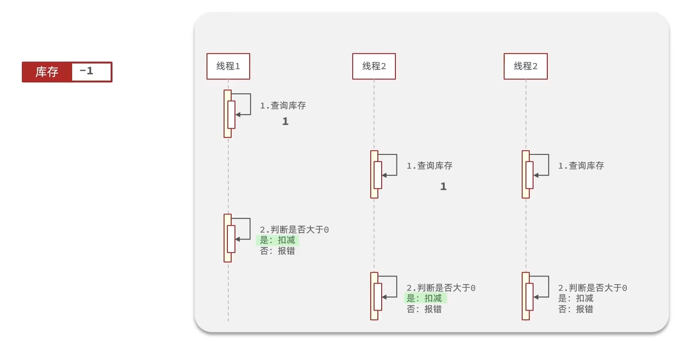
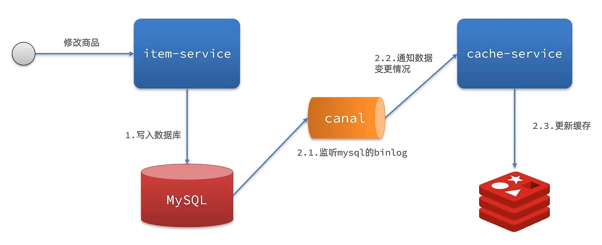
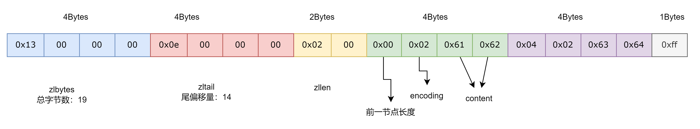
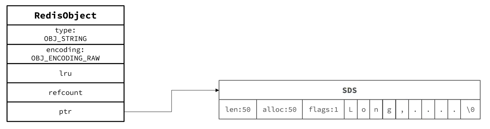
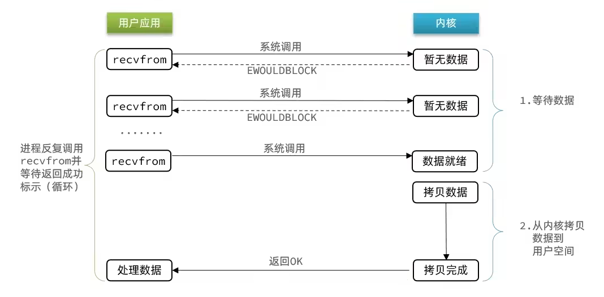

# Redis

## Redis 常见数据结构

### Redis 数据结构介绍

Redis 是一个 key-value 的数据库，key 一般是 String 类型，不过 value 的类型多种多样。

官方命令帮助文档：https://redis.io/commands/

### Redis 通用命令

通用命令是部分数据类型都可以使用的指令，常见的有：

- `KEYS`：查看符合模板的所以key，（通配符，模糊匹配或者精确匹配）不建议在生产环境设备上使用。
  
  ```shell
  127.0.0.1:6379> help KEYS
  
  KEYS pattern
  summary: Find all keys matching the given pattern
  since: 1.0.0
  group: generic
  ```

- `DEL`：删除一个或若干个指定的key。
  
  ```shell
  127.0.0.1:6379> help DEL
  
  # [] 表示可以传入1个或多个
  DEL key [key ...]
  summary: Delete a key
  since: 1.0.0
  group: generic
  ```

- `EXISTS`：判断一个或若干个key是否存在。1是存在，0是不存在
  
  ```shell
  127.0.0.1:6379> help EXISTS
  
  EXISTS key [key ...]
  summary: Determine if a key exists
  since: 1.0.0
  group: generic
  ```

- `EXPIRE`：给一个key 设置有效期，有效期到期时该key会自动删除。
  
  ```shell
  127.0.0.1:6379> help EXPIRE
  
  EXPIRE key seconds
  summary: Set a key's time to live in seconds
  since: 1.0.0
  group: generic
  ```

- `TTL`：查看一个key的剩余有效期

使用`help @generic`命令可以查看所有通用命令：

```shell
127.0.0.1:6379> help @generic
```

或使用`help [command]`查看一个命令的用法：

```shell
127.0.0.1:6379> help keys

  KEYS pattern
  summary: Find all keys matching the given pattern
  since: 1.0.0
  group: generic
```

### String 类型

#### 概述

String 类型，也就是字符串类型，是 Redis 中最简单的存储类型。

其 value 是字符串，不过根据字符串的格式不同，又可以分为三类：

- string：普通字符串。
- int：整数类型，可以自增、自减。
- float：浮点类型，可以自增、自减。

| key   | value       |
| ----- | ----------- |
| msg   | hello world |
| num   | 20          |
| score | 82.8        |

但不管是哪种格式，底层都是采用字节数组形式存储，只不过是编码方式不同。字符串类型的最大空间不能超过 512 Mb。

#### String 类型的常见命令

| 命令            | 描述                                         |
| ------------- | ------------------------------------------ |
| `SET`         | 添加或修改已存在的一个String类型的键值对                    |
| `GET`         | 根据key获取String类型的value                      |
| `MSET`        | 批量添加多个String类型的键值对                         |
| `MGET`        | 根据多个key获取多个Strng类型的value                   |
| `INCR`        | 让一个整形的key自增1                               |
| `INCRBY`      | 让一个整形的key自增指定的步长。如果 incrby num 2，让 num 自增2 |
| `INCRBYFLOAT` | 让一个浮点类型的数字自增指定的步长                          |
| `SETNX`       | 添加一个String类型的键值对，前提是这个key不存在，否则不执行         |
| `SETEX`       | 添加一个String类型的键值对，并指定有效期                    |

#### key的层级格式

Redis的key允许类有多个词条形成层级结构，词条之间用`:`隔开，格式如下：

```txt
项目名:业务名:类型:id

set sanguo:wu:sunquan dongwu
set sanguo:wei:caocao caowei
set sanguo:shu:liubei shuhan
```

### Hash 类型

#### 概述

Hash类型，也叫散列，其value是一个无序字典，类似于Java中的HashMap结构。

Hash结构可以将对象中的每个字段独立存储，可以针对单个字段做CRUD。


#### Hash类型的常见命令

| 命令                     | 描述                                        |
| ---------------------- | ----------------------------------------- |
| `HSET key field value` | 添加或修改已存在的一个hash类型key的field的值              |
| `HGET key field`       | 获取一个hash类型key的field的值                     |
| `HMSET`                | 批量添加多个hash类型key的field的值                   |
| `HMGET`                | 批量获取多个hash类型key的field的值                   |
| `HGETALL`              | 获取一个hash类型的key中的所有field和value             |
| `HKEYS`                | 获取一个hash类型的key中所有的field                   |
| `HVALS`                | 获取一个hash类型的key中所有的value                   |
| `HINCRBY`              | 让一个hash类型的key的字段值自增指定步长                   |
| `HSETNX`               | 添加一个hash类型的key的field值，前提是这个field不存在，否则不执行 |

### List 类型

#### 概述

Redis中的List类型与Java中的LinkedList类似，可以看作是一个双向链表结构，既可以支持正向检索也可以支持反向检索。

特征也与LinkedList类似：

- 有序

- 元素可重复 

- 插入和删除快

- 查询速度一般

#### List类型的常见命令

| 命令                     | 描述                                               |
| ---------------------- | ------------------------------------------------ |
| `LPUSH key element...` | 向列表左侧插入一个或多个元素（L：Left）                           |
| `LPOP key`             | 移除并返回左侧的第一个元素，没有则返回nil                           |
| `RPUSH key element...` | 向列表右侧插入一个或多个元素（R：Right）                          |
| `RPOP key`             | 移除并返回右侧的第一个元素                                    |
| `LRANGE key star end`  | 返回`star end`角标范围内的所有元素（角标从0开始，包头包尾）              |
| `BLPOP`和`BRPOP`        | 与`LPOP`和`RPOP`类似，在没有元素时等待指定时间，而不是直接返回nil（类似阻塞队列） |

### Set 类型

#### 概述

Redis的Set结构与Java中的HashSet类似，可以看作是一个value为null的HashMap。是一个hash表，因此也具备与HashSet类似的特征：

- 无序

- 元素不可重复

- 查找快

- 支持交集、并集、差集等功能

#### Set类型的常见命令

| 命令                     | 描述                                  |
| ---------------------- | ----------------------------------- |
| `SADD key member...`   | 向set中添加一个或多个元素                      |
| `SREM key member...`   | 移除set中一个或多个指定的元素                    |
| `SCARD key`            | 返回set中元素的个数                         |
| `SISMEMBER key member` | 判断一个元素在set中是否存在                     |
| `SMEMBERS`             | 获取set中的所有元素                         |
| `SINTER key1 key2 ...` | 获取key1于key2 ... 的交集                 |
| `SDIFF key1 key2 ...`  | 获取key1于key2 ... 的差集（key1有的，key2没有的） |
| `SUNION key1 key2 ...` | 获取key1于key2 ... 的并集                 |

### SortedSet 类型

#### 概述

Redis的SortedSet时一个可排序的set集合，与Java中的TreeSet有些类似，但底层数据结构差异较大。SortedSet中的每一个元素都带有一个score属性，可以基于score属性对元素排序，底层的实现是一个跳表（SkipList）加hash表。SortedSet具备下列特性：

- 可排序

- 元素不重复

- 查询快

常用来实现排行榜这样的功能。

#### SortedSet类型的常见命令

| 命令                             | 描述                                       |
| ------------------------------ | ---------------------------------------- |
| `ZADD key score member`        | 添加一个或多个元素到SortedSet，如果存在则更新其 score 值     |
| `ZREM key member`              | 删除SortedSet中指定元素                         |
| `ZSCORE key member`            | 获取SortedSet中指定元素的score值                  |
| `ZRANK key member`             | 获取SortedSet中指定元素的排名                      |
| `ZCARD key`                    | 获取SortedSet中的元素个数                        |
| `ZCOUNT key min max`           | 统计score值在给定范围内的所有元素个数                    |
| `ZINCRBY key increment member` | 让SortedSet中指定元素自增指定步长                    |
| `ZRANGE key min max`           | 按照score排序后，获取指定排名范围内的元素                  |
| `ZRANGEBYSCORE key min max`    | 按照score排序后，获取指定score范围内的元素               |
| `ZINTER numkeys key1 key2 ...` | 获取key1于key2 ... 的交集，（numkeys：为参与计算的集合数量） |
| `ZDIFF numkeys key1 key2 ...`  | 获取key1于key2 ... 的差集（key1有的，key2没有的）      |
| `ZUNION numkeys key1 key2 ...` | 获取key1于key2 ... 的并集                      |

排名默认升序，如果要降序则需要在命令的`Z`后面添加`REV`即可。比如`ZREVRANGE、ZREVRANGEBYSCORE ...` 

## 业务场景

### 短信登录

#### 基于Session实现短信登录流程


#### Session共享问题

Session共享问题：多台Tomcat服务器并不共享Session存储空间，当请求切换到不同Tomcat服务时会导致数据丢失的问题。

而session的替代方案应该满足：

- 数据共享

- 内存存储

- key-value结构

#### 基于Redis实现共享Session登录流程


### 查询缓存

#### 缓存更新策略

|      | 内存淘汰                                             | 超时剔除                              | 主动更新                   |
| ---- | ------------------------------------------------ | --------------------------------- | ---------------------- |
| 描述   | 不用自己维护，利用Redis的内部淘汰机制，当内存不足时会自动淘汰部分数据。下次查询时更新缓存。 | 给缓存数据添加TTL时间，到期后自动删除缓存。下次查询时更新缓存。 | 编写业务逻辑，在修改数据库的同时，更新缓存。 |
| 一致性  | 差                                                | 一般                                | 好                      |
| 维护成本 | 无                                                | 低                                 | 高                      |

业务场景：

- 低一致性需求：使用内存淘汰机制。

- 高一致性需求：主动更新，并以超时剔除作为兜底方案。
  
  - 读操作：
    
    - 设定缓存超时时间。
  
  - 写操作：
    
    - 确保数据库与缓存操作的原子性。

##### 主动更新策略


一般会选择第一种方案，可控性较高。

操作缓存和数据库时有三个问题需要考虑：

1. 删缓存还是更新缓存？
   
   1. 更新缓存：每次更新数据库都需要更新缓存，无效写操作较多。（假如修改多查询少）
   
   2. 删除缓存：更新数据库时让缓存失效，等到查询时再更新缓存。
   
   一般会考虑使用删除缓存方案。

2. 如何保证缓存与数据库的操作同时成功或失败？
   
   1. 单体系统：将缓存与数据库操作放在一个事务。
   
   2. 分布式系统：利用TCC（两阶段）等分布式事务方案。
   
   需要保证原子性。

3. 先操作缓存还是先操作数据库？
   
   
   
   需要考虑线程安全问题。但右侧方案发生的概率低于左侧。一般情况下会选择右侧方案（先修改数据库，再删除缓存）。

#### 缓存穿透

缓存穿透是指客户端请求的数据在缓存和数据库中都不存在，这样就会导致缓存永远不会生效，这些请求都会到达数据库。

常见的有两种解决方案：

- 缓存空对象
  
  - 优点：实现简单，维护方便。
  
  - 缺点：
    
    - 额外的内存消耗。
    
    - 可能会造成短期的不一致。

- 布隆过滤
  
  - 内存占用较少，没有多余的key。
  
  - 缺点：
    
    - 实现复杂。
    
    - 存在误判可能。

#### 缓存雪崩

缓存雪崩是指在同一时段内大量的缓存key同时失效（过期）或者Redis服务宕机，导致大量请求到达数据库，带来巨大压力。

解决方案：

- 给不同的key的TTL添加随机值。

- 利用Redis的集群（哨兵）提高服务的可用性。

- 给缓存业务添加降级限流策略。

- 给业务添加多级缓存。

#### 缓存击穿

缓存击穿问题也称热点key问题，即一个被高并发访问并且缓存重建业务较复杂的key突然失效了，无数的请求访问会在瞬间给数据库带来巨大的冲击。

常见的解决方案有两种：

- 互斥锁（分布式锁）。

- 逻辑过期（不设置TTL，额外存储过期时间字段，只不过是逻辑上的过期）。


| 解决方案 | 优点                            | 缺点                           |
| ---- | ----------------------------- | ---------------------------- |
| 互斥锁  | 没有额外的内存消耗 <br/>保证一致性<br/>实现简单 | 线程需要等待，性能受影响<br/>可能有死锁风险     |
| 逻辑过期 | 线程无需等待，性能较好                   | 不保证一致性<br/>有额外的内存消耗<br/>实现复杂 |

### 优惠券秒杀

#### 全局唯一ID

全局唯一ID生成器，是一种在分布式系统下用来生成全局唯一ID的工具，一般需要满足下列特性：

- 唯一性。

- 高可用。

- 递增性。

- 安全性。

- 高性能。


```java
/**
    简易版全局id生成器
*/
public class IdWorker {
    /**
     * 左移32位
     */
    private static final int BITS = 32;

    /**
     * 初始时间戳，2023.1.1 0.0.0
     */
    private static final long BEGIN_TIMESTAMP = 1672531200L;

    private StringRedisTemplate stringRedisTemplate;

    public IdWorker(StringRedisTemplate stringRedisTemplate) {
        this.stringRedisTemplate = stringRedisTemplate;
    }

    /**
     * nextId
     * @param prefix key 前缀
     * @return
     */
    public long nextId(String prefix) {
        // 时间戳
        LocalDateTime now = LocalDateTime.now();
        long nowSecond = now.toEpochSecond(ZoneOffset.UTC);
        long timestamp = nowSecond - BEGIN_TIMESTAMP;

        // 序列号
        String date = now.format(DateTimeFormatter.ofPattern("yyyy:MM:dd"));
        long count = stringRedisTemplate.opsForValue().increment(String.format("icr:%s:%s", prefix, date));

        // 拼接并返回
        return timestamp << BITS | count;
    }
}
```

全局唯一ID生成策略：

- UUID

- Redis自增

- Snowflake 算法

- 数据库自增

> 数据库自增：不是使用AUTO_INCREMENT，而是额外依赖第三张表，专门用于生成id，比如有5张表的id都从这额外的表中获取id。也能够保证全局唯一，但性能上稍逊于Redis自增。

#### 实现优惠券秒杀下单

下单时需要判断两点：

- 秒杀是否开始或结束，如果尚未开始或已结束则无法下单。

- 库存是否充足，不足则无法下单。


#### 超卖问题



解决方案：悲观锁、乐观锁。

乐观锁的关键是判断之前查询得到的数据是否被修改了。常见的有两种方式：

- 版本号


- CAS


在Java程序中，使用悲观锁（同步锁）的效率较低，线程长时间的争抢阻塞。而使用乐观锁（不加锁，在更新时判断是否有其它线程在修改）效率较高，但成功率较低。

改进：利用数据库的锁（MySQL行锁，悲观锁），`stock > 0`就不会出现超卖现象。但如果并发量很高的话，还是会给数据库造成压力。

#### 一人一单


实现思路：要保证一人一单，首先要保证数据库记录只有对应的一条。

- 可以在Java程序中加锁（同步锁），锁对象是userId（`userId.toString().intern()`）。如果使用Spring事务，要想事务生效，除了`@Transactional`注解外，如果还封装其为方法时，需要通过事务代理对象来调用其方法（或者手动事务回滚也可以）。锁要包裹事务，事务不能包裹锁。

- 还可以利用数据库保证一人一单，给userId加唯一约束（不止userId一个字段，还要根据其它业务字段加约束），但高并发下，频繁访问数据库，数据库压力巨大。

```java
synchronized(userId.toString().intern()) {
    XxxService proxy = AopContext.currentProxy();
    proxy.method1(...);
}
```

上面的解决方案在单机情况下通过加锁可以解决，但是在集群环境下（部署多台服务器）就不行了。

#### 分布式锁

分布式锁：满足分布式系统或集群模式下多进程可见并且互斥的锁。

满足基本特性：

- 多进程可见。

- 互斥。

- 高可用。

- 高性能。

- 安全性。

分布式锁的核心时实现多进程之间的互斥，而满足这一点的方式有很多，常见的有三种：

|     | MySQL           | Redis          | Zookeeper        |
| --- | --------------- | -------------- | ---------------- |
| 互斥  | 利用MySQL自身的互斥锁机制 | 利用setnx这样的互斥命令 | 利用节点的唯一性和有序性实现互斥 |
| 高可用 | 好               | 好              | 好                |
| 高性能 | 一般              | 好              | 一般               |
| 安全性 | 断开连接，自动释放锁      | 利用锁超时时间，到期释放   | 临时节点，断开连接自动释放    |

##### 实现

定义接口

```java
import java.util.concurrent.TimeUnit;

public interface RedisDistributeLock {
    /**
     * 
     * 加锁 
     * @param key 主键
     * @param timeout 超时时间
     * @param unit     超时时间单位
     * @return boolean  true:加锁成功;false:加锁失败
     */
    boolean tryLock(String key, long timeout, TimeUnit unit);

    /**
     * 
     * 加锁和释放锁的线程必须保证是同一个。 
     * @param key     主键
     */
    void releaseLock(String key);
}
```

定义接口实现

```java
import java.util.Objects;
import java.util.concurrent.TimeUnit;

import org.springframework.data.redis.core.StringRedisTemplate;

public class RedisDistributeLockImpl implements RedisDistributeLock {

    private StringRedisTemplate stringRedisTemplate;

    public RedisDistributeLockImpl(StringRedisTemplate stringRedisTemplate) {
        this.stringRedisTemplate = stringRedisTemplate;
    }

    @Override
    public boolean tryLock(String key, long timeout, TimeUnit unit) {
        long threadId = Thread.currentThread().getId();
        return stringRedisTemplate.opsForValue().setIfAbsent(key, threadId + "", timeout, unit);
    }

    @Override
    public void releaseLock(String key) {
        stringRedisTemplate.delete(key);
    }
}
```

定义的key能够锁同一个用户即可。

但是还是存在线程安全问题，业务还没有执行完锁就过期了，而其它线程尝试获取锁时就会获取到。会导致一开始获取到锁的那个对象，释放错误的锁，释放了其它线程的锁。

而且只存入线程id，多服务部署相同线程id又会冲突。所以需要再额外添加一个标识。

##### 改进1

防止错误释放锁，需再添加一个标识，判断锁是不是当前线程添加的。


```java
import java.util.Objects;
import java.util.concurrent.TimeUnit;

import org.springframework.data.redis.core.StringRedisTemplate;

public class RedisDistributeLockImpl implements RedisDistributeLock {

    private StringRedisTemplate stringRedisTemplate;
    private sttaic final String KEY_PREFIX = "lock:";
    private sttaic final String ID_PREFIX = UUID.randomUUID().toString(true) + "-";

    public RedisDistributeLockImpl(StringRedisTemplate stringRedisTemplate) {
        this.stringRedisTemplate = stringRedisTemplate;
    }

    @Override
    public boolean tryLock(String key, long timeout, TimeUnit unit) {
        String threadId = ID_PREFIX + Thread.currentThread().getId();

        // 加锁
        return stringRedisTemplate.opsForValue().setIfAbsent(KEY_PREFIX + key, threadId, timeout, unit);
    }

    @Override
    public void releaseLock(String key) {
        String threadId = ID_PREFIX + Thread.currentThread().getId();
        String id = stringRedisTemplate.opsForValue().get(KEY_PREFIX + key);
        // 判断标识是否一致
        if (!threadId.equals(id)) {
            return;
        }

        // 释放锁
        stringRedisTemplate.delete(KEY_PREFIX + key);
    }
}
```

但是还是会出现线程安全问题，错误释放锁（多线程环境下，因为阻塞导致的错误释放锁）。如果在释放锁时，通过了标识判断，由于JVM垃圾回收触发STW导致的阻塞，恰好阻塞时间超过了锁的过期时间，那么锁还是会被错误释放。究其原因，判断锁标识的动作和释放锁动作是两个动作，需要将这两个操作变成原子操作。


##### 改进2

lua脚本保证原子操作。

> Redis使用同一个Lua解释器来执行所有命令，同时，Redis保证以一种原子性的方式来执行脚本：当lua脚本在执行的时候，不会有其他脚本和命令同时执行，这种语义类似于 MULTI/EXEC。从别的客户端的视角来看，一个lua脚本要么不可见，要么已经执行完。
> 
> 然而这也意味着，执行一个较慢的lua脚本是不建议的，由于脚本的开销非常低，构造一个快速执行的脚本并非难事。但是你要注意到，当你正在执行一个比较慢的脚本时，所以其他的客户端都无法执行命令。

```lua
-- 获取锁的线程标识，get key
local id = redis.call('get', KEYS[1]);
-- 判断线程标识与锁的标识是否一致
if (id == ARGV[1]) then
    -- 释放
    return redis.call('del', KEYS[1]);
end
return 0;
```

```java
private static final DefaultRedisScript<Long> UNLOCK_SCRIPT;
static {
    UNLOCK_SCRIPT = new DefaultRedisScript<>();
    DefaultRedisScript.setLocation(new ClassPathResource("unlock.lua"));
    UNLOCK_SCRIPT.setResultType(Long.class);
}

public void unlock(String key) {
    // 调用 lua 脚本
    stringRedisTemplate.execute(
        UNLOCK_SCRIPT,
        Collections.singletonList(KEY_PREFIX + key),
        ID_PREFIX + Thread.currentThread().getId()
    );
}
```

经过前两次的改进，不会出现错误释放锁的问题了。

但是会出现线程阻塞导致超时自动释放锁而引起的线程安全问题，这个需要衡量业务的耗时来设置TTL，或者给锁续期。

##### Redisson可重入锁原理

> 可以参考JDK的ReentrantLock实现，如果锁重入，则锁的重入次数+1，释放锁时-1，当锁重入次数为0时则可以释放锁。

Redisson 也是这样实现的，使用的是Hash数据结构。


这么些个操作，要想保证原子性，应该是使用了lua脚本。


为了验证猜想，查阅Redisson源码（获取锁）：

```java
// 入口
RLock lock = redissonClient.getLock("");
lock.tryLock();

// org.redisson.RedissonLock#tryLock()
public boolean tryLock() {
    return get(tryLockAsync());

}

public RFuture<Boolean> tryLockAsync() {
    return tryLockAsync(Thread.currentThread().getId());
}

public RFuture<Boolean> tryLockAsync(long threadId) {
    return tryAcquireOnceAsync(-1, -1, null, threadId);
}

/*
waitTime：重试获取锁等待的间隔时间
leaseTime：锁的过期时间
unit：时间单位
threadId：锁的标识
*/
private RFuture<Boolean> tryAcquireOnceAsync(long waitTime, long leaseTime, TimeUnit unit, long threadId) {
    if (leaseTime != -1) {
        return tryLockInnerAsync(waitTime, leaseTime, unit, threadId, RedisCommands.EVAL_NULL_BOOLEAN);
    }
    RFuture<Boolean> ttlRemainingFuture = tryLockInnerAsync(waitTime,
                                                commandExecutor.getConnectionManager().getCfg().getLockWatchdogTimeout(),
                                                TimeUnit.MILLISECONDS, threadId, RedisCommands.EVAL_NULL_BOOLEAN);
    ttlRemainingFuture.onComplete((ttlRemaining, e) -> {
        if (e != null) {
            return;
        }

        // lock acquired
        if (ttlRemaining) {
            scheduleExpirationRenewal(threadId);
        }
    });
    return ttlRemainingFuture;
}

<T> RFuture<T> tryLockInnerAsync(long waitTime, long leaseTime, TimeUnit unit, long threadId, RedisStrictCommand<T> command) {
    internalLockLeaseTime = unit.toMillis(leaseTime);

    return evalWriteAsync(getName(), LongCodec.INSTANCE, command,
            "if (redis.call('exists', KEYS[1]) == 0) then " +
                    "redis.call('hincrby', KEYS[1], ARGV[2], 1); " +
                    "redis.call('pexpire', KEYS[1], ARGV[1]); " +
                    "return nil; " +
                    "end; " +
                    "if (redis.call('hexists', KEYS[1], ARGV[2]) == 1) then " +
                    "redis.call('hincrby', KEYS[1], ARGV[2], 1); " +
                    "redis.call('pexpire', KEYS[1], ARGV[1]); " +
                    "return nil; " +
                    "end; " +
                    "return redis.call('pttl', KEYS[1]);",
            Collections.singletonList(getName()), internalLockLeaseTime, getLockName(threadId));
}
```

释放锁源码：

```java
// org.redisson.RedissonLock#unlock
public void unlock() {
    try {
        get(unlockAsync(Thread.currentThread().getId()));
    } catch (RedisException e) {
        if (e.getCause() instanceof IllegalMonitorStateException) {
            throw (IllegalMonitorStateException) e.getCause();
        } else {
            throw e;
        }
    }
}

public RFuture<Void> unlockAsync(long threadId) {
    RPromise<Void> result = new RedissonPromise<Void>();
    RFuture<Boolean> future = unlockInnerAsync(threadId);

    future.onComplete((opStatus, e) -> {
        cancelExpirationRenewal(threadId);

        if (e != null) {
            result.tryFailure(e);
            return;
        }

        if (opStatus == null) {
            IllegalMonitorStateException cause = new IllegalMonitorStateException("attempt to unlock lock, not locked by current thread by node id: "
                    + id + " thread-id: " + threadId);
            result.tryFailure(cause);
            return;
        }

        result.trySuccess(null);
    });

    return result;
}

protected RFuture<Boolean> unlockInnerAsync(long threadId) {
    return evalWriteAsync(getName(), LongCodec.INSTANCE, RedisCommands.EVAL_BOOLEAN,
            "if (redis.call('hexists', KEYS[1], ARGV[3]) == 0) then " +
                    "return nil;" +
                    "end; " +
                    "local counter = redis.call('hincrby', KEYS[1], ARGV[3], -1); " +
                    "if (counter > 0) then " +
                    "redis.call('pexpire', KEYS[1], ARGV[2]); " +
                    "return 0; " +
                    "else " +
                    "redis.call('del', KEYS[1]); " +
                    "redis.call('publish', KEYS[2], ARGV[1]); " +
                    "return 1; " +
                    "end; " +
                    "return nil;",
            Arrays.asList(getName(), getChannelName()), LockPubSub.UNLOCK_MESSAGE, internalLockLeaseTime, getLockName(threadId));
}
```

##### Redissson锁重试&WatchDog

Redisson的锁重试的实现是通过Redis的消息订阅和信号量完成的。收到锁释放的消息后再进行重试，不会无休止的重试，导致浪费CPU资源。

> Redisson锁重试源码：org.redisson.RedissonLock#tryLock(long, long, java.util.concurrent.TimeUnit)

Redisson锁的续期是通过WatchDog（看门狗）机制实现的。第一次获取锁就会创建一个定时任务，默认是10秒更新一次锁的有效期。

```java
// org.redisson.RedissonLock#renewExpiration
private void renewExpiration() {
    ExpirationEntry ee = EXPIRATION_RENEWAL_MAP.get(getEntryName());
    if (ee == null) {
        return;
    }

    Timeout task = commandExecutor.getConnectionManager().newTimeout(new TimerTask() {
        @Override
        public void run(Timeout timeout) throws Exception {
            ExpirationEntry ent = EXPIRATION_RENEWAL_MAP.get(getEntryName());
            if (ent == null) {
                return;
            }
            Long threadId = ent.getFirstThreadId();
            if (threadId == null) {
                return;
            }

            RFuture<Boolean> future = renewExpirationAsync(threadId);
            future.onComplete((res, e) -> {
                if (e != null) {
                    log.error("Can't update lock " + getName() + " expiration", e);
                    return;
                }

                if (res) {
                    // reschedule itself
                    // 递归调用，可无限续期
                    renewExpiration();
                }
            });
        }
    }, internalLockLeaseTime / 3, TimeUnit.MILLISECONDS);

    ee.setTimeout(task);
}
```

`internalLockLeaseTime`默认是30秒。

锁释放时，移除定时任务。

```java
void cancelExpirationRenewal(Long threadId) {
    ExpirationEntry task = EXPIRATION_RENEWAL_MAP.get(getEntryName());
    if (task == null) {
        return;
    }

    if (threadId != null) {
        task.removeThreadId(threadId);
    }

    if (threadId == null || task.hasNoThreads()) {
        Timeout timeout = task.getTimeout();
        if (timeout != null) {
            timeout.cancel();
        }
        EXPIRATION_RENEWAL_MAP.remove(getEntryName());
    }
}
```

##### Redisson分布式锁原理流程


##### 总结

Redisson分布式锁原理：

- 可重入：利用hash结构记录线程id（锁标识）和重入次数。

- 可重试：利用信号量和PubSub（发布订阅）功能实现等待、唤醒，获取锁失败的重试机制。在设置的锁过期时间内尝试重试。

- 超时续约：利用WatchDog机制，每隔一段时间（`internalLockLeaseTime / 3`），重置超时时间。

#### 优化秒杀

##### Redis 优化秒杀


##### 秒杀业务的优化思路是什么？

1. 先利用Redis完成库存余量、一人一单判断，完成抢单业务并响应给用户。

2. 再将下单业务放入阻塞队列（JDK自带的阻塞队列），利用独立线程异步下单。

#### Redis实现消息队列异步秒杀

##### PubSub

PubSub（发布订阅）是Redis2.0引入的消息传递模型。消费者可以订阅若干个channel，生产者向对应的channel发送消息后，所以订阅者都能收到相关消息。

- `subscribe channel [channel]`：订阅一个或多个频道 。

- `publish channel msg`：向一个频道发送消息。

- `psubscribe pattern [pattern]`：订阅与pattern（通配符）格式匹配的频道。

PubSub方式不支持数据持久化，会导致消息丢失。消息堆积有上限，超出上限会数据丢失。

##### Stream

Stream是Redis5.0引入的新的数据类型，可以实现消息队列。

- 创建消息的方式：`xadd`


- 读取消息的方式：`xread`


xread 会出现消息漏读的情况。

- 创建消费者组的方式：`xgroup`


- 从消费者组读数据：`xreadgroup`


`xreadgroup`特点：

- 消息可回溯。

- 同一个消费者组的消费者争抢消息（同一消费者组只会有一个消费者消费），加快消费速度。

- 可以阻塞读取。

- 没有消息漏读的风险。

- 有消息确认机制，保证 消息至少被消费一次。


#### 总结

Redis在秒杀场景下的应用：

- 缓存。

- 分布式锁。

- 超卖问题。

- lua脚本保证原子性。

- Redis消息队列（可选的）。

### 达人探店

#### 点赞

同一个用户只能点赞一次，再次点击则取消点赞。

使用Set数据结构。

```shell
# 判断用户有没有点赞
sismember key userId

# 如果用户没有点赞，则添加到集合
sadd key userId

# 如果用户已点赞，取消点赞
srem key userId
```

#### 点赞排行榜


```shell
# 获取SortedSet中指定元素的score值，相当于判断集合中是否存在指定元素，不存在则返回nil
zscore key userId

# 如果用户没有点赞，则添加到集合（表示已点赞）
zadd key score userId

# 如果用户已点赞，取消点赞
zrem key userId

# 排行榜，默认升序，只显示top5
zrange key 0 4
```

> `select * from tb_name where id in (5,1) order by field(id, 5, 1)`
> 
> 使用`order by field(id, 5, 1)`可以强制按照5, 1 的顺序结果显示。
> 
> 因为传入的参数顺序，in 不一定会保证其顺序，默认还是会按照id排序显示。

### 好友关注

#### 关注和取关

关注也是会有排序的，所以选择使用SortedSet数据结构。

```shell
# 获取SortedSet中指定元素的score值，相当于判断集合中是否存在指定元素，不存在则返回nil
zscore key userId

# 如果用户没有关注，则添加到集合（表示已关注）
zadd key score userId

# 如果用户已关注，取消关注
zrem key userId
```

#### 共同关注

共同关注用Set和SortedSet都可以实现，都可以获取交集。

```shell
# key 是当前用户userId，value 是关注的用户userId
# key-value 可以理解为我关注了哪些人。

127.0.0.1:6379> sadd k1 m1 m2
(integer) 2
127.0.0.1:6379> sadd k2 m2 m3
(integer) 2
127.0.0.1:6379> sinter k1 k2
1) "m2"

127.0.0.1:6379> zadd s1 1 m1 2 m2
(integer) 2
127.0.0.1:6379> zadd s2 1 m2 2 m3
(integer) 2
127.0.0.1:6379> ZINTER 2 s1 s2
1) "m2"
```

#### 关注推送

关注推送也叫做Feed流。为用户持续的提供"沉浸式"体验，通过无限下拉刷新获取新的信息。


Feed流产品有两种常见的模式：

- Timeline：不做内容筛选，简单的按照内容发布时间排序，常用于好友关注、朋友圈。
  
  - 优点：信息全面，实现相对简单。
  
  - 缺点：信息噪音较多，内容获取效率低。

- 智能排序：利用算法屏蔽掉违规的、用户不感兴趣的内容。推送用户感兴趣的信息来吸引用户。
  
  - 优点：用户粘度高，容易沉迷。
  
  - 如果算法不精准，可能会适得其反。

案例：基于关注的好友来做Feed流，采用Timeline模式。该模式的实现方案有三种：

- 拉模式：读扩散。


- 推模式：写扩散


- 推拉模式


选择使用推模式实现关注推送功能。

- 在有新消息的时候，将新的推送发送到粉丝的收件箱。

- 收件箱满足可以根据时间戳排序，可以使用Redis的SortedSet数据结构。

- 查询收件箱数据时，可以实现分页查询。

```shell
# 按照socre降序，redis实现滚动分页查询
# key
# max 最大score（第一次分页给一个最大值，非第一次分页则给上一次查询的最小的score）
# min 最小score（给0即可）
# withscores 结果显示score
# limit 分页查询
# offset 偏移量 （一般从最后一条记录的下一条开始读取）
#    第一次也分偏移量为0
#    之后偏移量offset取决于上一次查询中末尾最小的score相同个数。会存在score一样的情况。
#      如果只有一个，offset=1，如果有三个score相同，则 offset=3
# count 查询多少条记录
zrevrangebyscore key max min withscores limit offset count
```

### 附近商户

#### 概述

GEO数据结构：GEO（Geolocation）地理坐标。Redis在3.2版本中加入了对GEO的支持，允许存储地理坐标信息，通过经纬度检索数据。底层是基于SortedSet实现的。常见命令有：

| 命令               | 描述                                                                  |
| ---------------- | ------------------------------------------------------------------- |
| `GEOADD`         | 添加一个地理空间信息。包含：经度（longitude）、纬度（latitude）、值（member）                  |
| `GEODIST`        | 计算指定的两个点之间的距离并返回                                                    |
| `GEOHASH`        | 将指定的member的坐标转为hash字符串形式并返回                                         |
| `GEOPOS`         | 返回指定member的坐标                                                       |
| `GEORADIUS`      | 6.2以后已废弃。指定圆心、半径，找到该圆内包含的所有member，并按照与圆心之间的距离排序后返回                  |
| `GEOSEARCH`      | 6.2新功能。在指定范围内搜索member，并按照与指定点之间的距离排序后返回。范围可以是圆形或矩形                  |
| `GEOSEARCHSTORE` | 6.2新功能。与`GEOSEARCH`功能一致，唯一区别就是可以把结果存储到一个指定的key（key的类型一般是 SortedSet） |

演示：

```shell
# 添加 三个地理坐标
127.0.0.1:6379> GEOADD g1 116.378248 39.865275 bjn 116.42803 39.903738 bjz 116.322287 39.893729 bjx
(integer) 3
# 计算 北京南和北京西两点之间的距离，默认单位是米
127.0.0.1:6379> GEODIST g1 bjn bjx
"5729.9533"
127.0.0.1:6379> GEODIST g1 bjn bjx km
"5.7300"

127.0.0.1:6379> help GEOSEARCH

GEOSEARCH key [FROMMEMBER member] [FROMLONLAT longitude latitude] [BYRADIUS radius m|km|ft|mi] [BYBOX width height m|km|ft|mi] [ASC|DESC] [COUNT count [ANY]] [WITHCOORD] [WITHDIST] [WITHHASH]
summary: Query a sorted set representing a geospatial index to fetch members inside an area of a box or a circle.
since: 6.2
group: geo

# 计算 g1 距离天安门 10 km范围内的所有火车站，并显示距离
127.0.0.1:6379> GEOSEARCH g1 FROMLONLAT 116.397904 39.909005 BYRADIUS 10 km withdist
1) 1) "bjz"
   2) "2.6361"
2) 1) "bjn"
   2) "5.1452"
3) 1) "bjx"
   2) "6.6723"

127.0.0.1:6379> GEOPOS g1 bjn
1) 1) "116.3782462477684021"
   2) "39.86527441178797204"

127.0.0.1:6379> GEOHASH g1 bjn
1) "wx4fb320190"
```

GEO没有提供分页功能，所以每次需要查询全部数据，然后再进行逻辑分页，进行截取即可。

### 用户签到

用户签到功能可以用bit位0或1表示，一个月最多有31天，只需要31个bit位，4个字节，内存占用少。

#### 概述

BitMap用法：

Redis中是利用string类型的数据结构实现的BitMap，因此最大上限也是512M，转换为bit则是2^32个bit位。BitMap的操作命令有：

| 命令            | 描述                                                 |
| ------------- | -------------------------------------------------- |
| `SETBIT`      | 向指定位置（offset）存入一个0或1                               |
| `GETBIT`      | 获取指定位置（offset）的bit值                                |
| `BITCOUNT`    | 统计BitMap中值为1的bit位的数量                               |
| `BITFIELD`    | 操作（查询、修改、自增）BitMap中bit数组中的指定位置（offset）的值，并以十进制形式返回 |
| `BITFIELD_RO` | 获取BitMap中的bit数组，并以十进制形式返回                          |
| `BITOP`       | 将多个BitMap的结果做位运算（与（&）、或（\|）、异或（^））                 |
| `BITPOS`      | 查找bit数组中指定范围内第一个0或1出现的位置                           |

```shell
127.0.0.1:6379> help SETBIT

  SETBIT key offset value
  summary: Sets or clears the bit at offset in the string value stored at key
  since: 2.2.0
  group: string

# 11001111
127.0.0.1:6379> SETBIT bm1 0 1
(integer) 0
127.0.0.1:6379> SETBIT bm1 1 1
(integer) 0
127.0.0.1:6379> SETBIT bm1 4 1
(integer) 0
127.0.0.1:6379> SETBIT bm1 5 1
(integer) 0
127.0.0.1:6379> SETBIT bm1 6 1
(integer) 0
127.0.0.1:6379> SETBIT bm1 7 1
(integer) 0

127.0.0.1:6379> GETBIT bm1 2
(integer) 0
127.0.0.1:6379> GETBIT bm1 4
(integer) 1
127.0.0.1:6379> BITCOUNT bm1
(integer) 6
127.0.0.1:6379> help BITFIELD

  BITFIELD key [GET type offset] [SET type offset value] [INCRBY type offset increment] [OVERFLOW WRAP|SAT|FAIL]
  summary: Perform arbitrary bitfield integer operations on strings
  since: 3.2.0
  group: string

# u：无符号；i:有符号；
# u2表示获取2个bit位，u3表示获取3个bit位；0表示offset从第0个bit位开始获取
# 返回十进制
127.0.0.1:6379> BITFIELD bm1 get u2 0
1) (integer) 3
127.0.0.1:6379> BITFIELD bm1 get u3 0
1) (integer) 6
127.0.0.1:6379> BITFIELD bm1 get u4 0
1) (integer) 12

127.0.0.1:6379> BITPOS bm1 0
(integer) 2
127.0.0.1:6379> BITPOS bm1 1
(integer) 0
```

### UV统计

#### 概述

- UV：Unique Visitor，独立访客量，是指通过互联网访问，浏览这个网页的自然人。一天内同一个用户多次访问该网站，只记录一次。

- PV：Page View，页面访问量或点击量，用于每访问一次网站的一个页面，记录一次PV，多次打开页面则记录多次PV。常用来衡量网站的流量。

HyperLogLog用法：

HyperLogLog（HLL）是从LogLog算法派生的概率算法，用于确定非常大的集合的基数，而不需要存储所有的值。Redis中的HLL是基于string结构实现的，单个HLL的内存永远小于16kb。但其测量结果是概率性的，有小于0.81%的误差。会过滤重复元素。

```shell
PFADD key element [element ...]
summary: Adds the specified elements to the specified HyperLogLog.
since: 2.8.9
group: hyperloglog

PFCOUNT key [key ...]
summary: Return the approximated cardinality of the set(s) observed by the HyperLogLog at key(s).
since: 2.8.9
group: hyperloglog

PFMERGE destkey sourcekey [sourcekey ...]
summary: Merge N different HyperLogLogs into a single one.
since: 2.8.9
group: hyperloglog
```

## 分布式缓存

### Redis持久化

#### RDB持久化

RDB（Redis Database Backup file）Redis数据备份文件。也被叫做Redis数据快照。简单来说就是把内存中的所有数据都记录到磁盘中。当Redis实例故障重启后，从磁盘读取快照文件，恢复数据。

快照文件被称为RDB文件，默认是保存在当前运行目录。

```shell
[root@server7 src]# ./redis-cli -h 127.0.0.1 -p 6379
127.0.0.1:6379> auth 123456
OK
127.0.0.1:6379> save   # 由Redis主进程来执行RDB，会阻塞所有命令
OK
127.0.0.1:6379> bgsave # 开启子进程执行RDB，避免主进程收到影响
Background saving started
```

Redis停机时会执行一次RDB，但是Redis宕机就没办法触发RDB。其实在Redis内部由触发RDB的机制，可以在redis.conf文件中进行配置：

```conf
save 5 1
# 900秒内，如果至少有1个key被修改，则执行bgsave，如果是save "" 则表示禁用RDB
# save 900 1
# save 300 10
# save 60 10000
```

RDB的其它配置：

```conf
# 是否压缩，建议不开启，压缩也会消耗CPU
rdbcompression no

# RDB文件名称
dbfilename dump.rbd

# 文件保存的路径目录, 默认 ./ 运行的当前
dir /mydata/redis-6.2.12/rdb_dump
```

设置RDB多久触发一次合适呢？一般默认即可，30秒、60秒。

##### RDB的fork原理

bgsave开始时会fork主进程得到子进程（fork过程主进程是阻塞的），子进程共享主进程的内存数据。完成fork后，读取内存数并写入RDB文件（异步执行）。


fork采用的是copy-on-write技术：

- 当主进程执行读操作时，访问共享内存；

- 当主进程执行写操作时，则会拷贝一份数据，执行写操作，之后对该数据的读，也会映射到拷贝的这个副本上。

极端情况：当子进程执行RDB较慢时，主进程不断接收写请求，那么都会对共享内存中的数据进行拷贝，会导致占用双倍的内存，最终内存溢出。

页表是虚拟内存。

RDB方式bgsave的基本流程？

- fork主进程得到一个子进程（主进程阻塞），共享内存空间。

- 子进程读取内存数据并写入新的RDB文件（异步执行）。

- 用新的RDB文件替换旧的RDB文件。

RDB会在什么时候执行？

- 默认是服务停止时触发。

- 可以设置为n秒内至少执行n次修改则触发RDB。

RDB的缺点？

- RDB执行间隔时间长，两次RDB之间写入数据有丢失的风险。

- for子进程、压缩、写出RDB文件都比较耗时。

#### AOF持久化

AOF：Append Only File（追加文件）。Redis处理的每一个写命令都会记录在AOF文件中，可以看作是命令日志文件。（类似于MySQL的redolog）

AOF默认是关闭的，需要修改redis.conf配置文件来开启AOF：

```conf
# 是否开启AOF功能，默认no
appendonly yes

# AOF文件名称
appendfilename "appendonly.aof"

# 文件保存的路径目录, 默认 ./ 运行的当前
dir /mydata/redis-6.2.12/rdb_dump
```

AOF命令记录的频率也可以通过redis.conf来配置：

```conf
# 每执行一次写命令，立即记录到AOF文件
appendsync always

# 默认的，写命令执行完先放入AOF缓冲区，然后每隔1秒将缓冲区数据写到AOF文件
appendsync everysec

# 写命令执行完先放入AOF缓冲区，由操作系统决定何时将缓冲区内存写回磁盘
appendsync no
```

因为是记录命令，AOF文件会比RDB文件大得多。而且AOF会记录对同一个key的多次写操作，但只有最后一次写操作才有意义。可以通过执行`bgrewitreaof`命令，可以让AOF文件执行重写功能，用最少的命令达到相同效果。

```shell
127.0.0.1:6379> BGREWRITEAOF # BGREWRITEAOF 命令是后台执行的
Background append only file rewriting started

# BGREWRITEAOF 执行后，aof文件就是经过压缩和编码后的文件
root@server7 redis-6.2.12]# vi rdb_dump/appendonly.aof
REDIS0009ú      redis-ver^F6.2.12ú
redis-bitsÀ@ú^Ectime£ü±dú^Hused-memÂp¨^M^@ú^Laof-preambleÀ^Aþ^@û^A^@^@^CnumÀ{ÿN¢<92>B Ü"ô
```

Redis会在触发阈值时自动去重写AOF文件。阈值也可以在redis.conf中配置：

```conf
# 默认的，AOF文件比上次文件增长超过多少百分比则触发重写，默认100%，增长一倍
auto-aof-rewrite-percentage 100

# 默认的，AOF体积占用达到阈值才触发重写
auto-aof-rewrite-min-size 64mb
```

#### RDB&AOF对比

RDB和AOF各有优缺点，如果对数据安全性要求较高，在实际开发中往往会结合两者来使用。


### Redis主从

#### 搭建主从架构

单节点Redis的并发能力是有上限的，要想进一步提高Redis的并发能力，就需要搭建主从集群，实现读写分离。


##### 准备实例和配置

设备有限，所以在一台虚拟机开启3个实例模拟主从集群。

要想在一台虚拟机开启3个实例，必须只能被三份不同的配置文件和目录，配置文件所在的目录即工作目录。

1. 创建目录

```shell
cd /tmp
mkdir 7001 7002 7003

[root@server7 tmp]# ll
总用量 0
drwxr-xr-x. 2 root root  6 7月  15 10:29 7001
drwxr-xr-x. 2 root root  6 7月  15 10:29 7002
drwxr-xr-x. 2 root root  6 7月  15 10:29 7003
```

2. 拷贝配置文件到每个实例目录

```shell
# 方式1：逐个拷贝
cp redis.conf 7001
cp redis.conf 7002
cp redis.conf 7003
# 方式2：管道组合命令，一键拷贝
echo 7001 7002 7003 | xargs -t -n 1 cp redis.conf
```

3. 修改每个实例的端口、工作目录（不是必须的，如果是多台服务器则不需要设置）

```shell
# s 表示替换 /g 表示全局替换
sed -i -e 's/6379/7001/g' -e 's/dir .\//dir \/tmp\/7001\//g' 7001/redis.conf
sed -i -e 's/6379/7002/g' -e 's/dir .\//dir \/tmp\/7002\//g' 7002/redis.conf
sed -i -e 's/6379/7003/g' -e 's/dir .\//dir \/tmp\/7003\//g' 7003/redis.conf
```

4. 修改每个实例的声明IP（不是必须的，如果是多台服务器则不需要设置）

```shell
# 逐一执行
sed -i 'la replica-announce-ip 192.168.44.149' 7001/redis.conf
sed -i 'la replica-announce-ip 192.168.44.149' 7002/redis.conf
sed -i 'la replica-announce-ip 192.168.44.149' 7003/redis.conf

# 批量执行
printf '%s\n' 7001 7002 7003 | xargs -I{} -t sed -i 'la replica-announce-ip 192.168.44.149' {}/redis.conf
```

##### 启动

```shell
redis-server 7001/redis.conf
redis-server 7002/redis.conf
redis-server 7003/redis.conf
```

##### 开启主从关系

要配置主从可以使用`replicaof`或者`slaveof`（5.0以前）命令。

有临时和永久两种模式：

- 修改配置文件（永久生效）
  
  - 在从节点redis.conf中添加一行配置`slaveof <masterip> <masterport>`

- 使用redis.cli客户端连接到redis服务后，从节点执行`slaveof`命令，重启后失效：
  
  ```shell
  # 当前节点要成为 masterip:masterport 的 slave
  slaveof <masterip> <masterport>
  ```

```shell
# 将 7002 7003 设置为 7001 的 从节点，7001 是主节点
[root@server7 src]# redis-cli -p 7002
127.0.0.1:7002> SLAVEOF 192.168.44.149 7001
OK
127.0.0.1:7003>
[root@server7 src]# redis-cli -p 7003
127.0.0.1:7003> SLAVEOF 192.168.44.149 7001
OK

# 副本信息，7001 挂载两个从节点 7002 7003 状态是在线的
[root@server7 src]# redis-cli -p 7001
127.0.0.1:7001> INFO replication
# Replication
role:master
connected_slaves:2
slave0:ip=192.168.44.149,port=7002,state=online,offset=364,lag=1
slave1:ip=192.168.44.149,port=7003,state=online,offset=364,lag=1
master_failover_state:no-failover
master_replid:5d3bd5761e059a8da4fab71d297c0bde303f1740
master_replid2:0000000000000000000000000000000000000000
master_repl_offset:364
second_repl_offset:-1
repl_backlog_active:1
repl_backlog_size:1048576
repl_backlog_first_byte_offset:1
repl_backlog_histlen:364
```

测试：

```shell
# 主节点写
127.0.0.1:7001> set k1 v1
OK
127.0.0.1:7001> 

# 从节点从主节点同步数据，也能获取到 k1
[root@server7 src]# redis-cli -p 7002
127.0.0.1:7002> get k1
"v1"
127.0.0.1:7002> 
[root@server7 src]# redis-cli -p 7003
127.0.0.1:7003> get k1
"v1"

# 从节点不能执行写操作，从节点是只读的副本
127.0.0.1:7003> set k2 v2
(error) READONLY You can't write against a read only replica.
```

#### 主从数据同步原理

##### 全量同步

主从第一次同步是全量同步


> repl_backlog缓冲区，本质是一个数组

master如何判断salve是不是第一次同步数据？

- Replication Id：简称replid，是数据集的标记，id一致说明是同一数据集。每一个master都有唯一的 replid，slave会继承master节点replid。

- offset：偏移量，offset会随着记录在repl_backlog中的数据增多而逐渐增大。slave完成同步时也会记录当前同步的offset。如果slave的offset小于master的offset，说明slave数据落后于master，需要更新。

master通过slave记录的replid判断是否一致从而同步数据。replid一致则只需增量更新，replid不一致则需要全量更新。

因此slave做数据同步时，必须向master声明自己的replication id 和 offset，master才可以判断需要同步哪些数据。

第一次配置主从同步的日志文件：

`7002 从节点`

```shell
20253:M 15 Jul 2023 11:09:42.109 # WARNING: The TCP backlog setting of 511 cannot be enforced because /proc/sys/net/core/somaxconn is set to the lower value of 128.
20253:M 15 Jul 2023 11:09:42.109 # Server initialized
20253:M 15 Jul 2023 11:09:42.109 # WARNING Memory overcommit must be enabled! Without it, a background save or replication may fail under low memory condition. Being disabled, it can can also cause failures without low memory condition, see https://github.com/jemalloc/jemalloc/issues/1328. To fix this issue add 'vm.overcommit_memory = 1' to /etc/sysctl.conf and then reboot or run the command 'sysctl vm.overcommit_memory=1' for this to take effect.
20253:M 15 Jul 2023 11:09:42.110 * Ready to accept connections
20253:S 15 Jul 2023 11:09:56.212 * Before turning into a replica, using my own master parameters to synthesize a cached master: I may be able to synchronize with the new master with just a partial transfer.

# 1.0、执行slaveof/replicationof 命令，建立连接
20253:S 15 Jul 2023 11:09:56.212 * Connecting to MASTER 192.168.44.149:7001
20253:S 15 Jul 2023 11:09:56.212 * MASTER <-> REPLICA sync started
20253:S 15 Jul 2023 11:09:56.212 * REPLICAOF 192.168.44.149:7001 enabled (user request from 'id=3 addr=127.0.0.1:55054 laddr=127.0.0.1:7002 fd=7 name= age=5 idle=0 flags=N db=0 sub=0 psub=0 multi=-1 qbuf=48 qbuf-free=40906 argv-mem=25 obl=0 oll=0 omem=0 tot-mem=61489 events=r cmd=slaveof user=default redir=-1')
20253:S 15 Jul 2023 11:09:56.212 * Non blocking connect for SYNC fired the event.
20253:S 15 Jul 2023 11:09:56.213 * Master replied to PING, replication can continue...

# 1.1、psync replid offset，尝试做一次局部同步 
20253:S 15 Jul 2023 11:09:56.213 * Trying a partial resynchronization (request e235eaae1b73bfda55612799917518acde8580c7:1).

# 1.4、保存主节点的版本信息（replid和offset）
20253:S 15 Jul 2023 11:09:56.215 * Full resync from master: 5d3bd5761e059a8da4fab71d297c0bde303f1740:0
20253:S 15 Jul 2023 11:09:56.215 * Discarding previously cached master state.

# 接收数据
20253:S 15 Jul 2023 11:09:56.223 * MASTER <-> REPLICA sync: receiving 176 bytes from master to disk

# 2.3、清空本地数据，加载RDB文件
20253:S 15 Jul 2023 11:09:56.224 * MASTER <-> REPLICA sync: Flushing old data
20253:S 15 Jul 2023 11:09:56.224 * MASTER <-> REPLICA sync: Loading DB in memory
20253:S 15 Jul 2023 11:09:56.225 * Loading RDB produced by version 6.2.12
20253:S 15 Jul 2023 11:09:56.225 * RDB age 0 seconds
20253:S 15 Jul 2023 11:09:56.225 * RDB memory usage when created 1.83 Mb
20253:S 15 Jul 2023 11:09:56.225 # Done loading RDB, keys loaded: 0, keys expired: 0.
20253:S 15 Jul 2023 11:09:56.225 * MASTER <-> REPLICA sync: Finished with success
```

`7001 主节点`

```shell
20248:M 15 Jul 2023 11:09:29.227 # WARNING: The TCP backlog setting of 511 cannot be enforced because /proc/sys/net/core/somaxconn is set to the lower value of 128.
20248:M 15 Jul 2023 11:09:29.227 # Server initialized
20248:M 15 Jul 2023 11:09:29.228 # WARNING Memory overcommit must be enabled! Without it, a background save or replication may fail under low memory condition. Being disabled, it can can also cause failures without low memory condition, see https://github.com/jemalloc/jemalloc/issues/1328. To fix this issue add 'vm.overcommit_memory = 1' to /etc/sysctl.conf and then reboot or run the command 'sysctl vm.overcommit_memory=1' for this to take effect.
20248:M 15 Jul 2023 11:09:29.228 * Ready to accept connections

# 1.1、接收到同步请求
20248:M 15 Jul 2023 11:09:56.213 * Replica 192.168.44.149:7002 asks for synchronization

# 1.2 不接受局部同步，replid 不一致，执行全量同步
20248:M 15 Jul 2023 11:09:56.213 * Partial resynchronization not accepted: Replication ID mismatch (Replica asked for 'e235eaae1b73bfda55612799917518acde8580c7', my replication IDs are 'fa0826cebf59df7cad31bc236d5e5835f9c09a9c' and '0000000000000000000000000000000000000000')

# 1.3、第一次同步，返回主节点的 replid和offset
20248:M 15 Jul 2023 11:09:56.213 * Replication backlog created, my new replication IDs are '5d3bd5761e059a8da4fab71d297c0bde303f1740' and '0000000000000000000000000000000000000000'

# 2.1、执行 BGSAVE，生成 RDB
20248:M 15 Jul 2023 11:09:56.213 * Starting BGSAVE for SYNC with target: disk
20248:M 15 Jul 2023 11:09:56.214 * Background saving started by pid 20264
20264:C 15 Jul 2023 11:09:56.218 * DB saved on disk

# 2.2、发送RDB文件
20264:C 15 Jul 2023 11:09:56.219 * RDB: 6 MB of memory used by copy-on-write
20248:M 15 Jul 2023 11:09:56.223 * Background saving terminated with success
20248:M 15 Jul 2023 11:09:56.223 * Synchronization with replica 192.168.44.149:7002 succeeded
```

##### 增量同步

主从第一次同步是全量同步，但如个slave重启后同步，则执行增量同步。


但是repl_backlog大小也是有上限的（本质是一个数组），写满后会覆盖最早的数据。如果slave断开世间过久，导致之前尚未备份的数据被覆盖，则无法基于repl_backlog做增量同步，只能再次全量同步。

这种清空没有办法去解决的，只能是尽可能的减小发生的概率。

Redis主从集群的优化（优化全量同步的性能，减少全量同步的次数）：

- 在master中配置`repl-diskless-sync yes`启动无磁盘复制，避免全量同步时先写入磁盘，减少一次磁盘复制。适用于IO较慢，网络带宽很快的Redis服务器配置。（避免全量同步时的磁盘IO）

- 在master中配置`maxmemory <bytes>`内存大小，单位字节。Redis单节点上的内存占用不要太大。（减少RDB（Redis Database backup file Redis数据备份文件，也叫快照）导致的过多磁盘IO）。如果不设置内存大小或者设置内存大小为0，在64位操作系统下不限制内存大小，在32位操作系统下最多使用3GB内存。Redis一般推荐设置内存为最大物理内存的四分之三。

- 在master中配置`repl-backlog-size <size>`修改默认大小，默认大小是1M。适当提高repl_backlog的大小，发现slave宕机时应该尽快实现故障恢复，尽可能避免全量同步。

```txt
repl_backlog_buffer(repl-backlog-size) = second * write_size_per_second
second：从服务器断开重连主服务器所需的平均时间；
write_size_per_second：master 平均每秒产生的命令数据量大小（写命令和数据大小总和）；
例如，如果主服务器平均每秒产生 1 MB 的写数据，而从服务器断线之后平均要 5 秒才能重新连接上主服务器，那么复制积压缓冲区的大小就不能低于 5 MB。
```

- 限制一个master上的slave节点数量，如果实在是太多slave，则可以采用主-从-从链式结构，减少master压力。


#### 总结

##### 简述全量同步的流程？

- slave节点尝试请求增量同步。

- master节点判断replid，发现不一致，拒绝增量同步。

- master将完整内存数据生成RDB，发送RDB到slave。

- slave清空本地数据，加载master的RDB。

- master将RDB期间的命令记录在repl_backlog，并持续将log中的命令发送给slave。

- slave执行接收到的命令，保持与master之间的同步。

##### 简述全量同步和增量同步的区别？

- 全量同步：master将完整内存数据生成RDB，发送RDB到slave。后续命令则记录在repl_backlog，批量发送给slave。

- 增量同步：slave提交自己的offset到master，master获取repl_backlog中从offset之后的命令给slave。

##### 何时执行全量同步？

- slave节点第一次连接master节点时。

- slave节点断开时间过久，导致repl_backlog中的offset已经被覆盖时。

##### 何时执行增量同步？

- slave节点断开又恢复，并且在repl_backlog中能够找到offset时。

### Redis哨兵

#### 哨兵的作用和原理

##### 哨兵的作用

Redis提供了哨兵（Sentinel）机制来实现主从集群的自动故障恢复。哨兵的结构和作用如下：

- `监控`：Sentinel会不断检查master和slave是否按预期工作。

- `自动故障恢复`：如果master故障，Sentinel会将一个slave提升为master。当故障实例恢复后也以新的master为主。

- `通知`：Sentinel充当Redis客户端的服务发现来源 ，当集群发生故障转移时，会将最新信息推送给Redis的客户端。基于PubSub机制实现的。


##### 服务状态监控

Sentinel基于心跳机制检测服务状态，每隔1秒向集群的每个实例发送ping命令：

- 主观下线：如果某Sentinel节点发现某实例未在规定时间内响应，则认为该实例主观下线。

- 客观下线：若超过指定数量（quorum）的Sentinel都认为该实例主观下线，则该实例客观下线。quorum值建议超过Sentinel实例数量的一半。

通过投票机制来确定Redis实例是否下线。


##### 选举新的master

一旦发现master故障，Sentinel需要在slave中选择一个作为新的master，选择依据如下：

- 首先会判断slave节点与master节点断开时间长短，如果超过指定值（`down-after-milliseconds * 10`）则会排除该slave节点。

- 然后判断slave节点的`slave-priority`（默认1）值，越小优先级越高，如果是0则不参与选举。

- 如果`slave-priority`一样，则判断slave节点offset值，越大说明数据越新，优先级越高。

- 如果offset值一样，最后判断slave节点的运行id大小，越小优先级越高。

##### 如何实现故障转移

当选中了其中过一个slave为新的master后（假设选中了 7002），故障转移的步骤如下：

- Sentinel给备选的slave节点发送`slaveof no one`命令，让该节点成为master。

- Sentinel给所有其它slave发送`slaveof 192.168.44.149 7002`命令，让其它slave成为新master的从节点，开始从新的master上同步数据。

- 最后，Sentinel将故障节点标记为slave（修改故障节点配置），当故障节点恢复后会自动成为新master的slave节点。


#### 搭建哨兵集群

由于设备有限，只能在一台虚拟机上模拟集群。要在同一台虚拟机开启3个实例，必须准备三份不同的配置文件和目录，配置文件所在目录即工作目录。

创建三个文件夹，分别是s1、s2、s3

```shell
cd /tmp/
mkdir s1 s2 s3

[root@server7 tmp]# ll
drwxr-xr-x. 2 root root     6 7月  16 07:10 s1
drwxr-xr-x. 2 root root     6 7月  16 07:10 s2
drwxr-xr-x. 2 root root     6 7月  16 07:10 s3
```

在s1中创建sentinel.conf文件

```vim
# 当前sentinel实例的端口
port 27001
sentinel announce-ip 192.168.44.149
# 指定主节点
#   monitor：监控
#   mymaster：主节点名称，自定义的，随意填写
#   192.168.44.149 7001：主节点的ip和端口
#   2：选举master时的quorum值
sentinel monitor mymaster 192.168.44.149 7001 2
# slave与master断开的超时时间
sentinel down-after-milliseconds mymaster 5000
# 故障恢复超时时间
sentinel failover-timeout mymaster 60000
dir "/tmp/s1"
```

然后将s1/sentinel.conf文件拷贝自s2、s3目录中

```shell
# 方式一：逐个拷贝
cp s1/sentinel.conf s2
cp s1/sentinel.conf s3

# 方式二：管道组合命令，一键拷贝
echo s2 s3 | xargs -t -n 1 cp s1/sentinel.conf
```

修改s2、s3配置文件，将端口分别修改为27002、27003

```shell
sed -i -e 's/27001/27002/g' -e 's/s1/s2/g' s2/sentinel.conf
sed -i -e 's/27001/27003/g' -e 's/s1/s3/g' s3/sentinel.conf
```

分别启动三台sentinel实例（前提是主从已经配置）

```shell
redis-sentinel s1/sentinel.conf
redis-sentinel s2/sentinel.conf
redis-sentinel s3/sentinel.conf
```

手动停掉7001Redis服务。

查看日志（Sentinel）

s1

```shell
# s1
23534:X 16 Jul 2023 07:55:13.355 # WARNING: The TCP backlog setting of 511 cannot be enforced because /proc/sys/net/core/somaxconn is set to the lower value of 128.
23534:X 16 Jul 2023 07:55:13.356 # Sentinel ID is cf069226c7b70854e9ca2bf56c41700b434e5730

# 此时，整个集群都被Sentinel监控了 slave：7002、7003；master：7001
23534:X 16 Jul 2023 07:55:13.356 # +monitor master mymaster 192.168.44.149 7001 quorum 2
23534:X 16 Jul 2023 07:55:13.360 * +slave slave 192.168.44.149:7002 192.168.44.149 7002 @ mymaster 192.168.44.149 7001
23534:X 16 Jul 2023 07:55:13.362 * +slave slave 192.168.44.149:7003 192.168.44.149 7003 @ mymaster 192.168.44.149 7001
23534:X 16 Jul 2023 07:55:18.436 # +sdown sentinel 47355c27f2b993d6e5c0dc55d5e9025699265cc9 192.168.44.149 27002 @ mymaster 192.168.44.149 7001
23534:X 16 Jul 2023 07:55:18.437 # +sdown sentinel 03fd8e91042d4a5402bbd478fbfbdd9ec43ed293 192.168.44.149 27003 @ mymaster 192.168.44.149 7001
23534:X 16 Jul 2023 07:55:19.750 # -sdown sentinel 47355c27f2b993d6e5c0dc55d5e9025699265cc9 192.168.44.149 27002 @ mymaster 192.168.44.149 7001
23534:X 16 Jul 2023 07:55:21.387 # +new-epoch 156
23534:X 16 Jul 2023 07:55:22.893 # -sdown sentinel 03fd8e91042d4a5402bbd478fbfbdd9ec43ed293 192.168.44.149 27003 @ mymaster 192.168.44.149 7001
23534:X 16 Jul 2023 07:55:24.510 # +new-epoch 159

# 7001 发生故障后，主观认为7001下线
23534:X 16 Jul 2023 07:55:47.253 # +sdown master mymaster 192.168.44.149 7001
23534:X 16 Jul 2023 07:55:47.344 # +new-epoch 160

# sentinel 内部选举一个leader（sentinel实例），选中sentinel实例去执行故障切换，让sentinel端口为27003的去执行
23534:X 16 Jul 2023 07:55:47.446 # +vote-for-leader 03fd8e91042d4a5402bbd478fbfbdd9ec43ed293 160

# quorum超过半数，7001 客观下线
23534:X 16 Jul 2023 07:55:48.341 # +odown master mymaster 192.168.44.149 7001 #quorum 3/2
23534:X 16 Jul 2023 07:55:48.341 # Next failover delay: I will not start a failover before Sun Jul 16 07:57:48 2023
23534:X 16 Jul 2023 07:55:48.519 # +config-update-from sentinel 03fd8e91042d4a5402bbd478fbfbdd9ec43ed293 192.168.44.149 27003 @ mymaster 192.168.44.149 7001
23534:X 16 Jul 2023 07:55:48.519 # +switch-master mymaster 192.168.44.149 7001 192.168.44.149 7002
23534:X 16 Jul 2023 07:55:48.519 * +slave slave 192.168.44.149:7003 192.168.44.149 7003 @ mymaster 192.168.44.149 7002
23534:X 16 Jul 2023 07:55:48.519 * +slave slave 192.168.44.149:7001 192.168.44.149 7001 @ mymaster 192.168.44.149 7002
23534:X 16 Jul 2023 07:55:53.547 # +sdown slave 192.168.44.149:7001 192.168.44.149 7001 @ mymaster 192.168.44.149 7002
```

s2

```shell
# s2 
23539:X 16 Jul 2023 07:55:19.246 # WARNING: The TCP backlog setting of 511 cannot be enforced because /proc/sys/net/core/somaxconn is set to the lower value of 128.
23539:X 16 Jul 2023 07:55:19.247 # Sentinel ID is 47355c27f2b993d6e5c0dc55d5e9025699265cc9
23539:X 16 Jul 2023 07:55:19.247 # +monitor master mymaster 192.168.44.149 7001 quorum 2
23539:X 16 Jul 2023 07:55:19.251 * +slave slave 192.168.44.149:7002 192.168.44.149 7002 @ mymaster 192.168.44.149 7001
23539:X 16 Jul 2023 07:55:19.254 * +slave slave 192.168.44.149:7003 192.168.44.149 7003 @ mymaster 192.168.44.149 7001
23539:X 16 Jul 2023 07:55:24.476 # +new-epoch 159

# 7001 发生故障后
23539:X 16 Jul 2023 07:55:47.277 # +sdown master mymaster 192.168.44.149 7001
23539:X 16 Jul 2023 07:55:47.444 # +new-epoch 160
23539:X 16 Jul 2023 07:55:47.448 # +vote-for-leader 03fd8e91042d4a5402bbd478fbfbdd9ec43ed293 160
23539:X 16 Jul 2023 07:55:47.449 # +odown master mymaster 192.168.44.149 7001 #quorum 3/2
23539:X 16 Jul 2023 07:55:47.449 # Next failover delay: I will not start a failover before Sun Jul 16 07:57:47 2023
23539:X 16 Jul 2023 07:55:48.519 # +config-update-from sentinel 03fd8e91042d4a5402bbd478fbfbdd9ec43ed293 192.168.44.149 27003 @ mymaster 192.168.44.149 7001
23539:X 16 Jul 2023 07:55:48.519 # +switch-master mymaster 192.168.44.149 7001 192.168.44.149 7002
23539:X 16 Jul 2023 07:55:48.519 * +slave slave 192.168.44.149:7003 192.168.44.149 7003 @ mymaster 192.168.44.149 7002
23539:X 16 Jul 2023 07:55:48.519 * +slave slave 192.168.44.149:7001 192.168.44.149 7001 @ mymaster 192.168.44.149 7002
23539:X 16 Jul 2023 07:55:53.527 # +sdown slave 192.168.44.149:7001 192.168.44.149 7001 @ mymaster 192.168.44.149 7002
```

s3

```shell
# s3
23544:X 16 Jul 2023 07:55:22.470 # WARNING: The TCP backlog setting of 511 cannot be enforced because /proc/sys/net/core/somaxconn is set to the lower value of 128.
23544:X 16 Jul 2023 07:55:22.470 # Sentinel ID is 03fd8e91042d4a5402bbd478fbfbdd9ec43ed293
23544:X 16 Jul 2023 07:55:22.470 # +monitor master mymaster 192.168.44.149 7001 quorum 2
23544:X 16 Jul 2023 07:55:22.474 * +slave slave 192.168.44.149:7002 192.168.44.149 7002 @ mymaster 192.168.44.149 7001
23544:X 16 Jul 2023 07:55:22.476 * +slave slave 192.168.44.149:7003 192.168.44.149 7003 @ mymaster 192.168.44.149 7001

# 7001 发生故障后，7001主观下线
23544:X 16 Jul 2023 07:55:47.277 # +sdown master mymaster 192.168.44.149 7001

# 7001客观下线，quorum超过半数
23544:X 16 Jul 2023 07:55:47.338 # +odown master mymaster 192.168.44.149 7001 #quorum 2/2
23544:X 16 Jul 2023 07:55:47.338 # +new-epoch 160

# 处理失败恢复
23544:X 16 Jul 2023 07:55:47.338 # +try-failover master mymaster 192.168.44.149 7001

# 选举27003端口的sentinel实例为leader，执行故障转移。（选举机制：谁先发现宕机谁做leader）
23544:X 16 Jul 2023 07:55:47.341 # +vote-for-leader 03fd8e91042d4a5402bbd478fbfbdd9ec43ed293 160
23544:X 16 Jul 2023 07:55:47.446 # cf069226c7b70854e9ca2bf56c41700b434e5730 voted for 03fd8e91042d4a5402bbd478fbfbdd9ec43ed293 160
23544:X 16 Jul 2023 07:55:47.449 # 47355c27f2b993d6e5c0dc55d5e9025699265cc9 voted for 03fd8e91042d4a5402bbd478fbfbdd9ec43ed293 160
23544:X 16 Jul 2023 07:55:47.521 # +elected-leader master mymaster 192.168.44.149 7001

# 准备选举一个slave作为新master
23544:X 16 Jul 2023 07:55:47.521 # +failover-state-select-slave master mymaster 192.168.44.149 7001

# 从slave中选master，选中了7002这个实例作为master
23544:X 16 Jul 2023 07:55:47.595 # +selected-slave slave 192.168.44.149:7002 192.168.44.149 7002 @ mymaster 192.168.44.149 7001

# 让7002执行 slaveof noone 命令，成为新的master
23544:X 16 Jul 2023 07:55:47.596 * +failover-state-send-slaveof-noone slave 192.168.44.149:7002 192.168.44.149 7002 @ mymaster 192.168.44.149 7001

# 7002等待提升，其实就是让其它slave执行 slaveof 192.168.44.149 7002
23544:X 16 Jul 2023 07:55:47.669 * +failover-state-wait-promotion slave 192.168.44.149:7002 192.168.44.149 7002 @ mymaster 192.168.44.149 7001

# 7002 正式提升为master
23544:X 16 Jul 2023 07:55:48.444 # +promoted-slave slave 192.168.44.149:7002 192.168.44.149 7002 @ mymaster 192.168.44.149 7001

# 修改下线的7001实例的配置，让它标记为7002的slave
23544:X 16 Jul 2023 07:55:48.444 # +failover-state-reconf-slaves master mymaster 192.168.44.149 7001

# 修改7003实例的配置，标记为7002的slave节点
23544:X 16 Jul 2023 07:55:48.518 * +slave-reconf-sent slave 192.168.44.149:7003 192.168.44.149 7003 @ mymaster 192.168.44.149 7001
23544:X 16 Jul 2023 07:55:49.474 * +slave-reconf-inprog slave 192.168.44.149:7003 192.168.44.149 7003 @ mymaster 192.168.44.149 7001
23544:X 16 Jul 2023 07:55:49.474 * +slave-reconf-done slave 192.168.44.149:7003 192.168.44.149 7003 @ mymaster 192.168.44.149 7001
23544:X 16 Jul 2023 07:55:49.548 # +failover-end master mymaster 192.168.44.149 7001
23544:X 16 Jul 2023 07:55:49.548 # +switch-master mymaster 192.168.44.149 7001 192.168.44.149 7002
23544:X 16 Jul 2023 07:55:49.548 * +slave slave 192.168.44.149:7003 192.168.44.149 7003 @ mymaster 192.168.44.149 7002
23544:X 16 Jul 2023 07:55:49.548 * +slave slave 192.168.44.149:7001 192.168.44.149 7001 @ mymaster 192.168.44.149 7002
23544:X 16 Jul 2023 07:55:54.563 # +sdown slave 192.168.44.149:7001 192.168.44.149 7001 @ mymaster 192.168.44.149 7002
```

查看日志（主从）

7002

```shell
# 故障转移
23501:M 16 Jul 2023 07:55:47.670 # Setting secondary replication ID to f986cfdcf3e16354fd70fd6950db1c396328c5a6, valid up to offset: 5035. New replication ID is de7d7f2eab6950a2e2b0cf2369397f2a9edcf91e

# 执行了 slaveof noone
23501:M 16 Jul 2023 07:55:47.670 * MASTER MODE enabled (user request from 'id=10 addr=192.168.44.149:38142 laddr=192.168.44.149:7002 fd=12 name=sentinel-03fd8e91-cmd age=25 idle=0 flags=x db=0 sub=0 psub=0 multi=4 qbuf=188 qbuf-free=40766 argv-mem=4 obl=45 oll=0 omem=0 tot-mem=61468 events=r cmd=exec user=default redir=-1')
23501:M 16 Jul 2023 07:55:47.673 # CONFIG REWRITE executed with success.

23501:M 16 Jul 2023 07:55:48.527 * Replica 192.168.44.149:7003 asks for synchronization
23501:M 16 Jul 2023 07:55:48.527 * Partial resynchronization request from 192.168.44.149:7003 accepted. Sending 460 bytes of backlog starting from offset 5035.

# 7001故障恢复后，7001 尝试主从同步
23501:M 16 Jul 2023 08:05:58.675 * Replica 192.168.44.149:7001 asks for synchronization
23501:M 16 Jul 2023 08:05:58.675 * Partial resynchronization not accepted: Replication ID mismatch (Replica asked for '62e2eaec67127051b63678e73a208e0c95c02337', my replication IDs are 'de7d7f2eab6950a2e2b0cf2369397f2a9edcf91e' and 'f986cfdcf3e16354fd70fd6950db1c396328c5a6')
23501:M 16 Jul 2023 08:05:58.675 * Starting BGSAVE for SYNC with target: disk
23698:C 16 Jul 2023 08:05:58.747 * DB saved on disk
23698:C 16 Jul 2023 08:05:58.748 * RDB: 4 MB of memory used by copy-on-write
23501:M 16 Jul 2023 08:05:58.773 * Background saving started by pid 23698
23501:M 16 Jul 2023 08:05:58.773 * Background saving terminated with success
23501:M 16 Jul 2023 08:05:58.773 * Synchronization with replica 192.168.44.149:7001 succeeded
```

7003

```shell
# 故障转移
23514:S 16 Jul 2023 07:55:48.519 * MASTER <-> REPLICA sync started

# replicaof 192.168.44.149 7002，成为7002的slave，并执行全量同步
23514:S 16 Jul 2023 07:55:48.519 * REPLICAOF 192.168.44.149:7002 enabled (user request from 'id=10 addr=192.168.44.149:39814 laddr=192.168.44.149:7003 fd=12 name=sentinel-03fd8e91-cmd age=26 idle=0 flags=x db=0 sub=0 psub=0 multi=4 qbuf=349 qbuf-free=40605 argv-mem=4 obl=45 oll=0 omem=0 tot-mem=61468 events=r cmd=exec user=default redir=-1')
23514:S 16 Jul 2023 07:55:48.524 # CONFIG REWRITE executed with success.
23514:S 16 Jul 2023 07:55:48.525 * Non blocking connect for SYNC fired the event.
23514:S 16 Jul 2023 07:55:48.525 * Master replied to PING, replication can continue...
23514:S 16 Jul 2023 07:55:48.525 * Trying a partial resynchronization (request f986cfdcf3e16354fd70fd6950db1c396328c5a6:5035).
23514:S 16 Jul 2023 07:55:48.528 * Successful partial resynchronization with master.
23514:S 16 Jul 2023 07:55:48.528 # Master replication ID changed to de7d7f2eab6950a2e2b0cf2369397f2a9edcf91e
23514:S 16 Jul 2023 07:55:48.528 * MASTER <-> REPLICA sync: Master accepted a Partial Resynchronization.
```

7001

7001启动了会尝试做一个主从同步。

```shell
# 重启7001
23693:S 16 Jul 2023 08:05:58.668 * Connecting to MASTER 192.168.44.149:7002
23693:S 16 Jul 2023 08:05:58.668 * MASTER <-> REPLICA sync started

# replicaof 192.168.44.149 7002
23693:S 16 Jul 2023 08:05:58.668 * REPLICAOF 192.168.44.149:7002 enabled (user request from 'id=3 addr=192.168.44.149:43482 laddr=192.168.44.149:7001 fd=7 name=sentinel-cf069226-cmd age=10 idle=0 flags=x db=0 sub=0 psub=0 multi=4 qbuf=202 qbuf-free=40752 argv-mem=4 obl=45 oll=0 omem=0 tot-mem=61468 events=r cmd=exec user=default redir=-1')
23693:S 16 Jul 2023 08:05:58.673 # CONFIG REWRITE executed with success.
23693:S 16 Jul 2023 08:05:58.674 * Non blocking connect for SYNC fired the event.
23693:S 16 Jul 2023 08:05:58.674 * Master replied to PING, replication can continue...
23693:S 16 Jul 2023 08:05:58.674 * Trying a partial resynchronization (request 62e2eaec67127051b63678e73a208e0c95c02337:1).
23693:S 16 Jul 2023 08:05:58.773 * Full resync from master: de7d7f2eab6950a2e2b0cf2369397f2a9edcf91e:138032
23693:S 16 Jul 2023 08:05:58.773 * Discarding previously cached master state.
23693:S 16 Jul 2023 08:05:58.773 * MASTER <-> REPLICA sync: receiving 191 bytes from master to disk
23693:S 16 Jul 2023 08:05:58.773 * MASTER <-> REPLICA sync: Flushing old data
23693:S 16 Jul 2023 08:05:58.773 * MASTER <-> REPLICA sync: Loading DB in memory
23693:S 16 Jul 2023 08:05:58.774 * Loading RDB produced by version 6.2.12
23693:S 16 Jul 2023 08:05:58.774 * RDB age 0 seconds
23693:S 16 Jul 2023 08:05:58.774 * RDB memory usage when created 1.99 Mb
23693:S 16 Jul 2023 08:05:58.774 # Done loading RDB, keys loaded: 1, keys expired: 0.
23693:S 16 Jul 2023 08:05:58.774 * MASTER <-> REPLICA sync: Finished with success
```

分布式缓存一般使用Lettuce。Redis的其中一种客户端。

### Redis分片集群

主从和哨兵可以解决高可用、高并发读的问题。但依然有两个问题没有解决：

- 海量数据 存储问题

- 高并发写的问题。

使用分片集群可以解决上述问题，分片集群特征：

- 集群中有多个master，每个master保存不同的数据。

- 每个master都可以有多个slave节点。

- master之间通过ping检测彼此的健康状态。

- 客户端请求可以访问集群中任意节点，最终都会被路由转发到正确节点。


#### 搭建分片集群

##### 实例配置

由于设备有限，只能在一台虚拟机中模拟分片集群。

| ip             | 端口   | 角色     |
| -------------- | ---- | ------ |
| 192.168.44.149 | 7001 | master |
| 192.168.44.149 | 7002 | master |
| 192.168.44.149 | 7003 | master |
| 192.168.44.149 | 8001 | slave  |
| 192.168.44.149 | 8002 | slave  |
| 192.168.44.149 | 8003 | slave  |

创建 7001、7002、7003、8001、8002、8003 目录：

```shell
cd /tmp/
mkdir 7001 7002 7003 8001 8002 8003
```

创建配置文件

```vim
port 7001
# 开启集群功能
cluster-enabled yes
# 集群的配置文件名称，由redis维护
cluster-config-file /tmp/redis_cluster/7001/nodes.conf
# 节点心跳失败的超时时间
cluster-node-timeout 5000
# 持久化文件存放目录
dir /tmp/redis_cluster/7001/
# 绑定地址
bind 0.0.0.0
# redis后台运行
daemonize yes
# 注册的实例ip
replica-announce-ip 192.168.44.149
# 保护模式
protected-mode no
# 数据库数量
databases 1
# 日志
logfile /tmp/redis_cluster/7001/run.log
```

拷贝到每个目录下

```shell
echo 7001 7002 7003 8001 8002 8003 | xargs -t -n 1 cp redis.conf
```

修改每个目录的端口

```shell
[root@server7 redis_cluster]# printf '%s\n' 7001 7002 7003 8001 8002 8003 | xargs -I{} -t sed -i 's/7001/{}/g' {}/redis.conf
sed -i s/7001/7001/g 7001/redis.conf 
sed -i s/7001/7002/g 7002/redis.conf 
sed -i s/7001/7003/g 7003/redis.conf 
sed -i s/7001/8001/g 8001/redis.conf 
sed -i s/7001/8002/g 8002/redis.conf 
sed -i s/7001/8003/g 8003/redis.conf
```

##### 启动redis-server

```shell
printf '%s\n' 7001 7002 7003 8001 8002 8003 | xargs -I{} -t redis-server {}/redis.conf
```

##### 通过ps命令查看状态

```shell
[root@server7 redis_cluster]# ps -ef | grep redis
root      24983      1  0 09:38 ?        00:00:00 redis-server 0.0.0.0:7001 [cluster]
root      24985      1  0 09:38 ?        00:00:00 redis-server 0.0.0.0:7002 [cluster]
root      24995      1  0 09:38 ?        00:00:00 redis-server 0.0.0.0:7003 [cluster]
root      24997      1  0 09:38 ?        00:00:00 redis-server 0.0.0.0:8001 [cluster]
root      25007      1  0 09:38 ?        00:00:00 redis-server 0.0.0.0:8002 [cluster]
root      25013      1  0 09:38 ?        00:00:00 redis-server 0.0.0.0:8003 [cluster]
```

##### 关闭所有进程

```shell
printf '%s\n' 7001 7002 7003 8001 8002 8003 | xargs -I{} -t redis-cli -p {} shutdown
```

##### 创建集群

1. Redis5.0以前的命令

5.0以前的集群命令依赖src/redis-trib.rb实现。redis-trib.rb使用ruby编写的，所以需要按照ruby环境 ，这里不作解释。

1. Redis5.0以后的命令

```shell
redis-cli --cluster create --cluster-replicas 1 192.168.44.149:7001 192.168.44.149:7002 192.168.44.149:7003 192.168.44.149:8001 192.168.44.149:8002 192.168.44.149:8003
```

- `redis-cli --cluster`或者`./redis-trib.rb`：代表集群操作命令。

- create：表示创建集群。

- `--cluster-replicas 1`或者`--replicas 1`：表示指定集群中每个master的副本个数为1，即一个master对应一个slave。此时`节点总数 ÷ (replicas+1)`得到的就是master的数量。因此节点列表中的前n个就是master，其它节点都是slave节点，随机分配到不同master。

运行命令后的结果：

```shell
[root@server7 redis_cluster]# redis-cli --cluster create --cluster-replicas 1 192.168.44.149:7001 192.168.44.149:7002 192.168.44.149:7003 192.168.44.149:8001 192.168.44.149:8002 192.168.44.149:8003
>>> Performing hash slots allocation on 6 nodes...
Master[0] -> Slots 0 - 5460
Master[1] -> Slots 5461 - 10922
Master[2] -> Slots 10923 - 16383
Adding replica 192.168.44.149:8002 to 192.168.44.149:7001
Adding replica 192.168.44.149:8003 to 192.168.44.149:7002
Adding replica 192.168.44.149:8001 to 192.168.44.149:7003
>>> Trying to optimize slaves allocation for anti-affinity
[WARNING] Some slaves are in the same host as their master
M: 604cd8786073415c1ea040ff8cf2120923f3d9cf 192.168.44.149:7001
   slots:[0-5460] (5461 slots) master
M: 22d17de63787aab987f8accf1f9aff327b4a4bfe 192.168.44.149:7002
   slots:[5461-10922] (5462 slots) master
M: e3e33bd2bf01aadc382a5e1b44b1a763be23642a 192.168.44.149:7003
   slots:[10923-16383] (5461 slots) master
S: fb1cb83a65e8cf15b6dca2fd1bd8efc99efabe79 192.168.44.149:8001
   replicates 22d17de63787aab987f8accf1f9aff327b4a4bfe
S: daeaef4ac7d0a6590dea43dd91a4a24f59098704 192.168.44.149:8002
   replicates e3e33bd2bf01aadc382a5e1b44b1a763be23642a
S: 452e4a58832d83c18939275a6c5d8deab1f74e16 192.168.44.149:8003
   replicates 604cd8786073415c1ea040ff8cf2120923f3d9cf

# redis自动配置的主从节点搭配你觉得可以吗？
Can I set the above configuration? (type 'yes' to accept): yes
>>> Nodes configuration updated
>>> Assign a different config epoch to each node
>>> Sending CLUSTER MEET messages to join the cluster
Waiting for the cluster to join
..
>>> Performing Cluster Check (using node 192.168.44.149:7001)
M: 604cd8786073415c1ea040ff8cf2120923f3d9cf 192.168.44.149:7001
   slots:[0-5460] (5461 slots) master
   1 additional replica(s)
S: fb1cb83a65e8cf15b6dca2fd1bd8efc99efabe79 192.168.44.149:8001
   slots: (0 slots) slave
   replicates 22d17de63787aab987f8accf1f9aff327b4a4bfe
S: 452e4a58832d83c18939275a6c5d8deab1f74e16 192.168.44.149:8003
   slots: (0 slots) slave
   replicates 604cd8786073415c1ea040ff8cf2120923f3d9cf
M: e3e33bd2bf01aadc382a5e1b44b1a763be23642a 192.168.44.149:7003
   slots:[10923-16383] (5461 slots) master
   1 additional replica(s)
M: 22d17de63787aab987f8accf1f9aff327b4a4bfe 192.168.44.149:7002
   slots:[5461-10922] (5462 slots) master
   1 additional replica(s)
S: daeaef4ac7d0a6590dea43dd91a4a24f59098704 192.168.44.149:8002
   slots: (0 slots) slave
   replicates e3e33bd2bf01aadc382a5e1b44b1a763be23642a
[OK] All nodes agree about slots configuration.
>>> Check for open slots...
>>> Check slots coverage...
[OK] All 16384 slots covered.
```

##### 查看集群状态

```shell
[root@server7 redis_cluster]# redis-cli -p 7001 cluster nodes
604cd8786073415c1ea040ff8cf2120923f3d9cf 192.168.44.149:7001@17001 myself,master - 0 1689472352000 1 connected 0-5460
fb1cb83a65e8cf15b6dca2fd1bd8efc99efabe79 192.168.44.149:8001@18001 slave 22d17de63787aab987f8accf1f9aff327b4a4bfe 0 1689472353000 2 connected
452e4a58832d83c18939275a6c5d8deab1f74e16 192.168.44.149:8003@18003 slave 604cd8786073415c1ea040ff8cf2120923f3d9cf 0 1689472353000 1 connected
e3e33bd2bf01aadc382a5e1b44b1a763be23642a 192.168.44.149:7003@17003 master - 0 1689472353118 3 connected 10923-16383
22d17de63787aab987f8accf1f9aff327b4a4bfe 192.168.44.149:7002@17002 master - 0 1689472354141 2 connected 5461-10922
daeaef4ac7d0a6590dea43dd91a4a24f59098704 192.168.44.149:8002@18002 slave e3e33bd2bf01aadc382a5e1b44b1a763be23642a 0 1689472353631 3 connected
```

#### 散列插槽

Redis会把每一个 master节点映射到0~16383共16384个插槽（hash slot）上，查看集群信息时就能看到：

```shell
# 0-5460
604cd8786073415c1ea040ff8cf2120923f3d9cf 192.168.44.149:7001@17001 myself,master - 0 1689472352000 1 connected 0-5460
# 10923-16383
e3e33bd2bf01aadc382a5e1b44b1a763be23642a 192.168.44.149:7003@17003 master - 0 1689472353118 3 connected 10923-16383
# 5461-10922
22d17de63787aab987f8accf1f9aff327b4a4bfe 192.168.44.149:7002@17002 master - 0 1689472354141 2 connected 5461-10922
```

数据key不是与节点绑定的，而是与插槽绑定。redis会根据key的有效部分计算插槽值，分两种情况：

- key中包含`{}`，且`{}`中至少包含1个字符，`{}`中的部分是有效部分。

- key中不包含`{}`，则整个key都是有效部分。

eg：key是 name，那么就根据name计算，如果是{age}name，则根据age计算。计算方式是利用CRC16算法得到一个hash值，然后对16384取余，得到的结果就是slot值。

测试验证：

根据插槽切换了路由Redis节点。

```shell
# -c 集群环境
[root@server7 redis_cluster]# redis-cli -c -p 7001
127.0.0.1:7001> set num 123
OK
127.0.0.1:7001> set a 1
-> Redirected to slot [15495] located at 192.168.44.149:7003
OK
192.168.44.149:7003> get a
"1"
192.168.44.149:7003> get num
-> Redirected to slot [2765] located at 192.168.44.149:7001
"123"
192.168.44.149:7001>
```

##### 总结

Redis如何判断某个key应该存放在哪个实例？

- 将16384个插槽分配到不同的实例（master）。

- 根据key的有效部分计算hash值，对16384取余。

- 余数作为插槽，根据插槽找到实例即可。

如何将同一类数据对那个的保存在同一个Redis实例？

- key可以以`{typeid}`作为前缀。typeid作为有效部分。参与计算hash

```shell
192.168.44.149:7001> set {a}num 111
-> Redirected to slot [15495] located at 192.168.44.149:7003
OK
192.168.44.149:7003>
```

#### 集群伸缩

redis-cli --cluster提供了很多操作集群的命令，可以通过下面方式查看：

```shell
[root@server7 redis_cluster]# redis-cli --cluster help
Cluster Manager Commands:
  create         host1:port1 ... hostN:portN
                 --cluster-replicas <arg>
  check          host:port
                 --cluster-search-multiple-owners
  info           host:port
  fix            host:port
                 --cluster-search-multiple-owners
                 --cluster-fix-with-unreachable-masters
  reshard        host:port
                 --cluster-from <arg>
                 --cluster-to <arg>
                 --cluster-slots <arg>
                 --cluster-yes
                 --cluster-timeout <arg>
                 --cluster-pipeline <arg>
                 --cluster-replace
  rebalance      host:port
                 --cluster-weight <node1=w1...nodeN=wN>
                 --cluster-use-empty-masters
                 --cluster-timeout <arg>
                 --cluster-simulate
                 --cluster-pipeline <arg>
                 --cluster-threshold <arg>
                 --cluster-replace
  # 添加节点，默认是master节点；existing_host:existing_port 表示集群中已存在的节点，连接集群
  add-node       new_host:new_port existing_host:existing_port
                 --cluster-slave
                 --cluster-master-id <arg>
  del-node       host:port node_id
...
```

##### 扩容

测试：现在要增加一台集群节点（9001）

```shell
[root@server7 redis_cluster]# mkdir 9001
[root@server7 redis_cluster]# cp redis.conf 9001

[root@server7 redis_cluster]# sed -i s/7001/9001/g 9001/redis.conf

[root@server7 redis_cluster]# redis-server 9001/redis.conf

[root@server7 redis_cluster]# ps -ef | grep redis
root      24983      1  0 09:38 ?        00:00:13 redis-server 0.0.0.0:7001 [cluster]
root      24985      1  0 09:38 ?        00:00:13 redis-server 0.0.0.0:7002 [cluster]
root      24995      1  0 09:38 ?        00:00:13 redis-server 0.0.0.0:7003 [cluster]
root      24997      1  0 09:38 ?        00:00:11 redis-server 0.0.0.0:8001 [cluster]
root      25007      1  0 09:38 ?        00:00:12 redis-server 0.0.0.0:8002 [cluster]
root      25013      1  0 09:38 ?        00:00:11 redis-server 0.0.0.0:8003 [cluster]
root      25801      1  0 10:39 ?        00:00:00 redis-server 0.0.0.0:9001 [cluster]

# 向集群中添加一个节点
[root@server7 redis_cluster]# redis-cli --cluster add-node 192.168.44.149:9001 192.168.44.149:7001
>>> Adding node 192.168.44.149:9001 to cluster 192.168.44.149:7001
>>> Performing Cluster Check (using node 192.168.44.149:7001)
M: 604cd8786073415c1ea040ff8cf2120923f3d9cf 192.168.44.149:7001
   slots:[0-5460] (5461 slots) master
   1 additional replica(s)
S: fb1cb83a65e8cf15b6dca2fd1bd8efc99efabe79 192.168.44.149:8001
   slots: (0 slots) slave
   replicates 22d17de63787aab987f8accf1f9aff327b4a4bfe
S: 452e4a58832d83c18939275a6c5d8deab1f74e16 192.168.44.149:8003
   slots: (0 slots) slave
   replicates 604cd8786073415c1ea040ff8cf2120923f3d9cf
M: e3e33bd2bf01aadc382a5e1b44b1a763be23642a 192.168.44.149:7003
   slots:[10923-16383] (5461 slots) master
   1 additional replica(s)
M: 22d17de63787aab987f8accf1f9aff327b4a4bfe 192.168.44.149:7002
   slots:[5461-10922] (5462 slots) master
   1 additional replica(s)
S: daeaef4ac7d0a6590dea43dd91a4a24f59098704 192.168.44.149:8002
   slots: (0 slots) slave
   replicates e3e33bd2bf01aadc382a5e1b44b1a763be23642a
[OK] All nodes agree about slots configuration.
>>> Check for open slots...
>>> Check slots coverage...
[OK] All 16384 slots covered.
>>> Send CLUSTER MEET to node 192.168.44.149:9001 to make it join the cluster.
[OK] New node added correctly.

# 查看集群状态，发现 9001 节点没有分配 插槽，那么相当于添加一个空节点，没起作用
[root@server7 redis_cluster]# redis-cli -p 7001 cluster nodes
3d708a31634d67aea85460ca4fe16bdb4756abc2 192.168.44.149:9001@19001 master - 0 1689475479000 0 connected
604cd8786073415c1ea040ff8cf2120923f3d9cf 192.168.44.149:7001@17001 myself,master - 0 1689475479000 1 connected 0-5460
fb1cb83a65e8cf15b6dca2fd1bd8efc99efabe79 192.168.44.149:8001@18001 slave 22d17de63787aab987f8accf1f9aff327b4a4bfe 0 1689475480574 2 connected
452e4a58832d83c18939275a6c5d8deab1f74e16 192.168.44.149:8003@18003 slave 604cd8786073415c1ea040ff8cf2120923f3d9cf 0 1689475480000 1 connected
e3e33bd2bf01aadc382a5e1b44b1a763be23642a 192.168.44.149:7003@17003 master - 0 1689475479000 3 connected 10923-16383
22d17de63787aab987f8accf1f9aff327b4a4bfe 192.168.44.149:7002@17002 master - 0 1689475479000 2 connected 5461-10922
daeaef4ac7d0a6590dea43dd91a4a24f59098704 192.168.44.149:8002@18002 slave e3e33bd2bf01aadc382a5e1b44b1a763be23642a 0 1689475480271 3 connected

# 从 7003 节点中分配一些插槽
[root@server7 redis_cluster]# redis-cli --cluster reshard 192.168.44.149:7003
>>> Performing Cluster Check (using node 192.168.44.149:7003)
M: e3e33bd2bf01aadc382a5e1b44b1a763be23642a 192.168.44.149:7003
   slots:[10923-16383] (5461 slots) master
   1 additional replica(s)
M: 3d708a31634d67aea85460ca4fe16bdb4756abc2 192.168.44.149:9001
   slots: (0 slots) master
S: 452e4a58832d83c18939275a6c5d8deab1f74e16 192.168.44.149:8003
   slots: (0 slots) slave
   replicates 604cd8786073415c1ea040ff8cf2120923f3d9cf
M: 604cd8786073415c1ea040ff8cf2120923f3d9cf 192.168.44.149:7001
   slots:[0-5460] (5461 slots) master
   1 additional replica(s)
S: fb1cb83a65e8cf15b6dca2fd1bd8efc99efabe79 192.168.44.149:8001
   slots: (0 slots) slave
   replicates 22d17de63787aab987f8accf1f9aff327b4a4bfe
S: daeaef4ac7d0a6590dea43dd91a4a24f59098704 192.168.44.149:8002
   slots: (0 slots) slave
   replicates e3e33bd2bf01aadc382a5e1b44b1a763be23642a
M: 22d17de63787aab987f8accf1f9aff327b4a4bfe 192.168.44.149:7002
   slots:[5461-10922] (5462 slots) master
   1 additional replica(s)
[OK] All nodes agree about slots configuration.
>>> Check for open slots...
>>> Check slots coverage...
[OK] All 16384 slots covered.

# 需要设置多少插槽，设置 3000 插槽
How many slots do you want to move (from 1 to 16384)? 3000

# 哪个节点来接收这些插槽，指定 9001
What is the receiving node ID? 3d708a31634d67aea85460ca4fe16bdb4756abc2

# 从哪个节点（source）中分配插槽，指定 7003
Please enter all the source node IDs.
  Type 'all' to use all the nodes as source nodes for the hash slots.
  Type 'done' once you entered all the source nodes IDs.
Source node #1: e3e33bd2bf01aadc382a5e1b44b1a763be23642a
# 退出
Source node #2: done
  Moving slot 10923 from e3e33bd2bf01aadc382a5e1b44b1a763be23642a
  ... ...
  Moving slot 13922 from e3e33bd2bf01aadc382a5e1b44b1a763be23642a

# 你同意这个分配计划吗
Do you want to proceed with the proposed reshard plan (yes/no)? yes
  ... ...

# 查看集群状态信息，9001已经从7003中得到分配的插槽了
[root@server7 redis_cluster]# redis-cli -p 7001 cluster nodes
3d708a31634d67aea85460ca4fe16bdb4756abc2 192.168.44.149:9001@19001 master - 0 1689476306657 7 connected 10923-13922
604cd8786073415c1ea040ff8cf2120923f3d9cf 192.168.44.149:7001@17001 myself,master - 0 1689476305000 1 connected 0-5460
fb1cb83a65e8cf15b6dca2fd1bd8efc99efabe79 192.168.44.149:8001@18001 slave 22d17de63787aab987f8accf1f9aff327b4a4bfe 0 1689476306000 2 connected
452e4a58832d83c18939275a6c5d8deab1f74e16 192.168.44.149:8003@18003 slave 604cd8786073415c1ea040ff8cf2120923f3d9cf 0 1689476305000 1 connected
e3e33bd2bf01aadc382a5e1b44b1a763be23642a 192.168.44.149:7003@17003 master - 0 1689476305229 3 connected 13923-16383
22d17de63787aab987f8accf1f9aff327b4a4bfe 192.168.44.149:7002@17002 master - 0 1689476306761 2 connected 5461-10922
daeaef4ac7d0a6590dea43dd91a4a24f59098704 192.168.44.149:8002@18002 slave e3e33bd2bf01aadc382a5e1b44b1a763be23642a 0 1689476306556 3 connected
```

测试9001节点

```shell
[root@server7 redis_cluster]# redis-cli -c -p 7001
127.0.0.1:7001> get abcdefghijk
-> Redirected to slot [12868] located at 192.168.44.149:9001
(nil)
192.168.44.149:9001> get num
-> Redirected to slot [2765] located at 192.168.44.149:7001
"123"
192.168.44.149:7001> set abcdefghijk 888
-> Redirected to slot [12868] located at 192.168.44.149:9001
OK
192.168.44.149:9001> get abcdefghijk
"888"
```

##### 缩容

```shell
[root@server7 redis_cluster]# redis-cli --cluster reshard 192.168.44.149:9001
>>> Performing Cluster Check (using node 192.168.44.149:9001)
M: 3d708a31634d67aea85460ca4fe16bdb4756abc2 192.168.44.149:9001
   slots:[10923-13922] (3000 slots) master
M: e3e33bd2bf01aadc382a5e1b44b1a763be23642a 192.168.44.149:7003
   slots:[13923-16383] (2461 slots) master
   1 additional replica(s)
S: 452e4a58832d83c18939275a6c5d8deab1f74e16 192.168.44.149:8003
   slots: (0 slots) slave
   replicates 604cd8786073415c1ea040ff8cf2120923f3d9cf
M: 604cd8786073415c1ea040ff8cf2120923f3d9cf 192.168.44.149:7001
   slots:[0-5460] (5461 slots) master
   1 additional replica(s)
S: daeaef4ac7d0a6590dea43dd91a4a24f59098704 192.168.44.149:8002
   slots: (0 slots) slave
   replicates e3e33bd2bf01aadc382a5e1b44b1a763be23642a
M: 22d17de63787aab987f8accf1f9aff327b4a4bfe 192.168.44.149:7002
   slots:[5461-10922] (5462 slots) master
   1 additional replica(s)
S: fb1cb83a65e8cf15b6dca2fd1bd8efc99efabe79 192.168.44.149:8001
   slots: (0 slots) slave
   replicates 22d17de63787aab987f8accf1f9aff327b4a4bfe
[OK] All nodes agree about slots configuration.
>>> Check for open slots...
>>> Check slots coverage...
[OK] All 16384 slots covered.

# 分配多少插槽
How many slots do you want to move (from 1 to 16384)? 3000

# 哪个节点来接收插槽，指定 7003
What is the receiving node ID? e3e33bd2bf01aadc382a5e1b44b1a763be23642a

# 从哪个节点上分配，指定 9001
Please enter all the source node IDs.
  Type 'all' to use all the nodes as source nodes for the hash slots.
  Type 'done' once you entered all the source nodes IDs.
Source node #1: 3d708a31634d67aea85460ca4fe16bdb4756abc2
Source node #2: done 
... ...
Do you want to proceed with the proposed reshard plan (yes/no)? yes
... ...
```

删除9001节点

```shell
[root@server7 redis_cluster]# redis-cli --cluster del-node 192.168.44.149:9001 3d708a31634d67aea85460ca4fe16bdb4756abc2
>>> Removing node 3d708a31634d67aea85460ca4fe16bdb4756abc2 from cluster 192.168.44.149:9001
>>> Sending CLUSTER FORGET messages to the cluster...
>>> Sending CLUSTER RESET SOFT to the deleted node.

[root@server7 redis_cluster]# redis-cli -p 7001 cluster nodes
604cd8786073415c1ea040ff8cf2120923f3d9cf 192.168.44.149:7001@17001 myself,master - 0 1689478430000 1 connected 0-5460
fb1cb83a65e8cf15b6dca2fd1bd8efc99efabe79 192.168.44.149:8001@18001 slave 22d17de63787aab987f8accf1f9aff327b4a4bfe 0 1689478431568 2 connected
452e4a58832d83c18939275a6c5d8deab1f74e16 192.168.44.149:8003@18003 slave 604cd8786073415c1ea040ff8cf2120923f3d9cf 0 1689478431000 1 connected
e3e33bd2bf01aadc382a5e1b44b1a763be23642a 192.168.44.149:7003@17003 master - 0 1689478431568 8 connected 10923-16383
22d17de63787aab987f8accf1f9aff327b4a4bfe 192.168.44.149:7002@17002 master - 0 1689478431568 2 connected 5461-10922
daeaef4ac7d0a6590dea43dd91a4a24f59098704 192.168.44.149:8002@18002 slave e3e33bd2bf01aadc382a5e1b44b1a763be23642a 0 1689478430550 8 connected
```

#### 故障转移

##### 自动故障转移

使用watch命令监听集群节点信息

```shell
# 节点宕机前没什么变化
[root@server7 redis_cluster]# watch redis-cli -p 7001 cluster nodes
604cd8786073415c1ea040ff8cf2120923f3d9cf 192.168.44.149:7001@17001 myself,master - 0 1689478430000 1 connected 0-5460
fb1cb83a65e8cf15b6dca2fd1bd8efc99efabe79 192.168.44.149:8001@18001 slave 22d17de63787aab987f8accf1f9aff327b4a4bfe 0 1689478431568 2 connected
452e4a58832d83c18939275a6c5d8deab1f74e16 192.168.44.149:8003@18003 slave 604cd8786073415c1ea040ff8cf2120923f3d9cf 0 1689478431000 1 connected
e3e33bd2bf01aadc382a5e1b44b1a763be23642a 192.168.44.149:7003@17003 master - 0 1689478431568 8 connected 10923-16383
22d17de63787aab987f8accf1f9aff327b4a4bfe 192.168.44.149:7002@17002 master - 0 1689478431568 2 connected 5461-10922
daeaef4ac7d0a6590dea43dd91a4a24f59098704 192.168.44.149:8002@18002 slave e3e33bd2bf01aadc382a5e1b44b1a763be23642a 0 1689478430550 8 connected

# 当执行 redis-cli -p 7002 shutdown 命令后，7002 fail，8001 被选举为master节点
604cd8786073415c1ea040ff8cf2120923f3d9cf 192.168.44.149:7001@17001 myself,master - 0 1689478884000 1 connected 0-5460
fb1cb83a65e8cf15b6dca2fd1bd8efc99efabe79 192.168.44.149:8001@18001 master - 0 1689478884584 9 connected 5461-10922
452e4a58832d83c18939275a6c5d8deab1f74e16 192.168.44.149:8003@18003 slave 604cd8786073415c1ea040ff8cf2120923f3d9cf 0 1689478885600 1 connected
e3e33bd2bf01aadc382a5e1b44b1a763be23642a 192.168.44.149:7003@17003 master - 0 1689478883558 8 connected 10923-16383

# 当7002故障恢复上线后，变为slave节点
22d17de63787aab987f8accf1f9aff327b4a4bfe 192.168.44.149:7002@17002 slave fb1cb83a65e8cf15b6dca2fd1bd8efc99efabe79 0 1689478885000 9 connected
daeaef4ac7d0a6590dea43dd91a4a24f59098704 192.168.44.149:8002@18002 slave e3e33bd2bf01aadc382a5e1b44b1a763be23642a 0 1689478884073 8 connected
```

```shell
[root@server7 tmp]# redis-cli -p 7002 shutdown

[root@server7 tmp]# redis-server ./redis_cluster/7002/redis.conf
```

Redis集群自动具备主从故障切换，不需要哨兵。

当集群中有一个master宕机后会发生什么？

1. 首先是该实例与其它实例失去连接。

2. 然后是疑似宕机，原master宕机标记为 `fail?`。

3. 最后是确定下线，自动提升一个slave为新的master。

##### 手动故障转移/数据迁移

利用cluster failover命令可以手动让集群中的某个master宕机，切换到执行执行cluster failover命令的这个slave节点，实现无感知的数据迁移。其流程如下：


等待故障转移完成后，slave变为master，master变为slave。以后的集群交互就与新的master进行通信。

手动的Failover支持三种模式：

- 缺省：默认的流程，如上图1~6步。

- force：省略了对offset的一致性校验，省略2-3步骤。

- tackover：直接执行第5步，忽略数据一致性、忽略master状态以及其它master的意见。

演示，让7002当选当选master：

```shell
[root@server7 tmp]# redis-cli -p 7002
127.0.0.1:7002> CLUSTER FAILOVER
OK
```

监控集群节点信息

```shell
[root@server7 tmp]# watch redis-cli -p 7001 cluster nodes

604cd8786073415c1ea040ff8cf2120923f3d9cf 192.168.44.149:7001@17001 myself,master - 0 1689480067000 1 connected 0-5460

# 8001 被手动替换为 slave
fb1cb83a65e8cf15b6dca2fd1bd8efc99efabe79 192.168.44.149:8001@18001 slave 22d17de63787aab987f8accf1f9aff327b4a4bfe 0 1689480069000 10 connected
452e4a58832d83c18939275a6c5d8deab1f74e16 192.168.44.149:8003@18003 slave 604cd8786073415c1ea040ff8cf2120923f3d9cf 0 1689480069025 1 connected
e3e33bd2bf01aadc382a5e1b44b1a763be23642a 192.168.44.149:7003@17003 master - 0 1689480069535 8 connected 10923-16383

# 7002 被手动替换为 master
22d17de63787aab987f8accf1f9aff327b4a4bfe 192.168.44.149:7002@17002 master - 0 1689480069000 10 connected 5461-10922
daeaef4ac7d0a6590dea43dd91a4a24f59098704 192.168.44.149:8002@18002 slave e3e33bd2bf01aadc382a5e1b44b1a763be23642a 0 1689480067502 8 connected
```

## 多级缓存

用于缓存的Nginx是业务Nginx，需要部署为集群，再由专门的Nginx代理来做反向代理。


### JVM进程缓存

缓存在日常开发者起到至关重要的作用，由于是存储在内存中，数据的读取速度是非常快的。能大量减少对数据库的访问，减少数据库压力。可以把缓存分为两类：

- 分布式缓存：如Redis
  
  - 优点：存储容量更大，可靠性更好，可以在集群间共享。
  
  - 缺点：访问缓存有网络开销。
  
  - 场景：缓存数据量较大、可靠性要求较高、需要在集群间共享。

- 进程本地缓存：如HashMap、GuavaCache
  
  - 优点：读取本地内存，没有网络开销，速度更快。
  
  - 缺点：存储容量有限、可靠性较低、无法共享。
  
  - 场景：性能要求较高，缓存数据量较小。

#### Caffeine

> Github：https://github.com/ben-manes/caffeine/wiki/Population-zh-CN

Caffeine是一个基于Java8开发的提供了近乎最佳命中率的高性能的缓存库。

缓存和ConcurrentMap有点相似，但还是有所区别。最根本的区别是ConcurrentMap将会持有所有加入到缓存当中的元素，直到它们被从缓存当中手动移除。但是，Caffeine的缓存Cache 通常会被配置成自动驱逐缓存中元素，以限制其内存占用。

Caffeine提供三种缓存的驱逐策略：

- 基于容量：设置缓存的数量上限。

- 基于时间：设置缓存的有效时间。

- 基于引用：设置缓存为软引用或弱引用，利用GC来回收缓存数据。性能较差，不推荐使用。

默认情况下，当一个缓存元素过期的时候，Caffeine不会立即将其清理和驱逐。而是在一次读或写操作后，或者在空闲时间完成对失效数据的驱逐。

```pom
<dependency>
    <groupId>com.github.ben-manes.caffeine</groupId>
    <artifactId>caffeine</artifactId>
    <version>3.1.1</version>
</dependency>
```

简单使用：

```java
// 创建缓存对象
Cache<String, Person> cache = Caffeine.newBuilder()
    // key的过期时间，10分钟，从最后依次写入开始计时
    .expireAfterWrite(10, TimeUnit.MINUTES)  
    // key的size，最大10000，超过10000，则默认使用LRU，最少最近使用
    .maximumSize(10_000)    
    .build();

// 查找一个缓存元素， 没有查找到的时候返回null
Person person = cache.getIfPresent(key);
// 查找缓存，如果缓存不存在则生成缓存元素,  如果无法生成则返回null
person = cache.get(key, k -> createExpensivePerson(key));
// 添加或者更新一个缓存元素
cache.put(key, person);
// 移除一个缓存元素
cache.invalidate(key);
```

### 多级缓存

#### OpenResty

> 官网：https://openresty.org/cn/

OpenResty是一个基于Nginx的高性能Web频台，用于方便的搭建能够处理超高并发、扩展性极高的动态Web应用、Web服务和动态网关。具备下列特点：

- 具备Nginx的完整功能。

- 基于Lua语言进行扩展，集成大量Lua库、第三方模块。

- 允许使用Lua自定义业务逻辑、自定义库。

可以将其理解为是业务Nginx，可以处理一定的业务能力。而反向代理则由专门的反向代理Nginx来负责。

OpenResty也提供本地缓存。OpenResty为Nginx提供了shard dict的功能，可以在Nginx的多个worker之间共享数据，实现缓存功能。

- 开启共享字典，在nginx.conf的http下添加配置

```conf
# 共享词典（本地缓存），缓存名称: item_cache，缓存大小150m
lua_shared_dict item_cache 150m;
```

- 操作共享字典

```lua
# 基于 lua 
# 获取本地缓存对象
local item_cache = ngx.shared.item_cache
# 存储缓存，指定 key、vlaue、过期时间，单位秒，设置0表示用不过期
item_cache:set('key', 'value', 1000)
# 获取缓存
local val = item_cache:get('key')
```

#### Redis 缓存预热


冷启动：服务刚启动时，Redis中并没有缓存，如果所有缓存数据都在第一次查询时添加缓存，可能会给数据库带来较大压力。

缓存预热：在实际开发中，我们可以利用大数据统计用户访问的热点数据，在项目启动时将这些热点数据提前查询并保存到Redis中。

### 缓存同步

#### 缓存同步策略

缓存数据同步的常见方式有三种：

- 设置有效期：给缓存设置有效期，到期后自动删除。再次查询时更新。
  
  - 优势：简单、方便。
  
  - 缺点：时效性差，缓存过期之前可能数据不一致。
  
  - 场景：更新频率较低，时效性要求低的业务。

- 同步双写：在修改数据库的同时，直接修改缓存。
  
  - 优势：时效性强，缓存与数据库强一致。
  
  - 缺点：有代码侵入 ，耦合度高。
  
  - 场景：对一致性、时效性要求较高的缓存数据。

- 异步通知：修改数据库时发送事件通知，相关服务监听到通知后修改缓存数据。
  
  - 优势：低耦合，可以同时通知多个缓存服务。
  
  - 缺点：时效性一般，可能存在中间不一致状态。
  
  - 场景：时效性要求一般，有多个服务需要同步。

#### Canal



Canal是基于MySQL的binlog日志文件实现的（即基于MySQL的主从同步来实现的）。binlog包括所有指令，DDL、DML等命令。

Canal就是把自己伪装成MySQL的一个slave节点，从而监听master的binary log变化。再把得到的变化信息通知给Canal的客户端，进而完成对其它数据库的同步。

要想使用Canal，需要先开启MySQL的主从同步功能。Canal推送给canal-client的时被修改的这一行的数据（row）。

### 多级缓存总结


## Redis最佳实践

### Redis键值设计

#### 优雅的key结构

Redis的key虽然可以自定义，但建议遵守下面的几个最佳实践约定：

- 遵循基本格式：`[业务名称]:[数据名]:id`

- 长度不超过44个字节

- 不包含特殊字符

`eg：login:user:10`

1. 可读性强。

2. 避免key冲突

3. 方便管理

4. 更节省空间：key是string类型，底层编码包含int、embstr和raw三种。embstr在小于44字节时，采用连续内存空间，内存占用更小，raw使用的是指针。指向另一块内存空间。

```shell
127.0.0.1:6379> set num 123
OK
127.0.0.1:6379> type num
string
127.0.0.1:6379> OBJECT encoding num
"int"
127.0.0.1:6379> set name aaaaaaaaaaaaaaaaaaaaaaaaaaaaaaaaaaaaaaaaaaaa
OK
127.0.0.1:6379> type name
string
127.0.0.1:6379> OBJECT encoding name
"embstr"
127.0.0.1:6379> set name aaaaaaaaaaaaaaaaaaaaaaaaaaaaaaaaaaaaaaaaaaaaa
OK
127.0.0.1:6379> type name
string
127.0.0.1:6379> OBJECT encoding name
"raw"
127.0.0.1:6379>
```

#### 拒绝BigKey

##### 概述

BigKey：value占用内存过大的 key。BigKey通常以key的大小和key中成员的数量来综合判定，比如：

- key本身的数据量过大：一个string类型的key，其value占用5MB。

- key中的成员数过多：一个zset类型的key，其value的成员数量有10,000个。

- key中成员的数据量过大：一个hash类型的key，其value的成员数量有1000个，但其每个成员占用100MB。

推荐值：

- 单个key的value小于10KB。

- 对于集合类型的key，建议元素数量小于1000。

```shell
127.0.0.1:6379> set num 123
OK
127.0.0.1:6379> MEMORY USAGE num
(integer) 48
127.0.0.1:6379> STRLEN num
(integer) 3
127.0.0.1:6379> LPUSH l2 v1 v2 v3
(integer) 3
127.0.0.1:6379> LLEN l2
(integer) 3
127.0.0.1:6379> MEMORY USAGE l2
(integer) 143
```

`MEMORY USAGE`单位字节，但不建议使用，对CPU消耗较大。一般判断其长度即可，例如`STRLEN、LLEN ...`。

##### BigKey的缺点

- 网络阻塞

对BigKey执行读请求时，少量的QPS就可能带宽使用率被占满，导致Redis实例乃至所在物理机被拖垮。

- 数据倾斜

BigKey所在的Redis实例内存使用率远超于其它实例，无法使数据分片内存资源达到均衡。

- Redis阻塞

对元素较多的hash、list、zset等做运算会耗时较久，使得主线程被阻塞。

- CPU压力

对BigKey的数据序列化和反序列化会导致CPU的使用率飙升，影响Redis实例和本机其它应用。

##### 如何发现BigKey

- redis-cli --bigkeys

利用`redis-cli`提供的`--bigkeys`参数，可以遍历分析所以key，并返回key的整体统计信息与每个数据的Top1的big key。

- scan扫描

自定义工具，利用scan扫描Redis中的所有key，利用strlen、hlen等命令判断key的长度。（不建议使用 memory usage）

- 第三方工具

利用第三方工具，如Redis-Rdb-Tools分析RDB快照文件，全面分析内存使用情况。

- 网络监控

自定义工具，监控进出的Redis的网络数据，超出预警值时主动告警。

##### 如何删除BigKey

BigKey内存占用较多，即便删除这样的key也需要耗费较长时间，导致Redis主线程阻塞，引发一系列问题。

- Redis3.0及以前

如果时集合类型，则需要遍历BigKey的元素，先逐个删除子元素，最后删除BigKey。

通过scan扫描，例如`hscan、scan、sscan、zscan`。

- Redis4.0以后

Redis在4.0后提供了异步删除的命令：`unlink`

#### 恰当的数据类型

比如：一个key存储了100万个hash类型的元素，可以拆分为 100万（总元素）/500（拆分后每个key存储多少元素） = 2000 个（key）。

原来一个key存放100万个元素，现在拆分后2000个key，各存放500元素。使用命令`info memory`查看占用，拆分后较拆分前的key占用至少减少了1/2的内存。

可以通过`CONFIG set/get hash-max-ziplist-entries`设置entry的上限或者查看默认值。

### 批处理优化

#### Pipeline

如果是单一类型，可以使用如`mset、hset、sadd ...`这样的批量添加的命令。但如果有对复杂数据类型（不同数据类型）的批处理需求，建议使用Pipeline功能。

诸如mset这样的命令，是Redis内置的命令，在执行命令的时候会保证传递的所有命令的原子性。而Pipeline则会有先后顺序，不具备原子性。将传递的命令放入队列中，Redis的线程会依次执行这些命令。可能会存在多个客户端同时使用Pipeline的情况，会有插队现象。导致耗时较久。但与原生mset相差无几。

#### cluster批处理

如mset或Pipeline这样的批处理命令需要在依次请求中携带多条命令，而此时如果Redis是一个集群，那么批处理命令的多个key必须落在一个插槽中，否则就会导致执行失败。


`hash_tag`即`{}`。给批处理的每个key都设置同一个`{xxx}`。但是通常情况下会选择并行slot。

### 服务端优化

#### 持久化配置

Redis的持久化虽然可以保证数安全，但也会带来额外的开销，因此建议持久化遵循下列建议：

1. 用来做缓存的Redis实例尽量不用开启持久化功能（RDB、AOF）。

2. 建议关闭RDB持久化功能，使用AOF持久化。

3. 如果开启了RDB，建议利用脚本定期在slave节点做RDB数据备份。

4. 设置合理的rewrite（`auto-aof-rewrite-percentage 100`、`auto-aof-rewrite-min-size 64mb`）阈值，避免频繁的bgrewrite。

5. 配置`no-appendfsync-on-rewrite yes`（默认 no），禁止在rewrite期间做aof，避免因AOF引起的阻塞。

建议5现象的原因：如果在RDB、bgrewrite期间做AOF，恰好AOF操作IO较耗时，超过了阈值2秒，则会使得主线程阻塞。


部署建议：

1. Redis实例的物理机要预留足够内存，应多fork、rewrite。

2. 单个Redis实例内存上限不太大，4G或8G即可。可以加快fork的速度、减少主动同步、数据迁移压力。

3. 不要与CPU密集型应用部署在一起。

4. 不要与高硬盘负荷应用部署在一起。如：数据库、消息队列。

#### 慢查询

慢查询：在Redis执行时耗时超过指定阈值的命令，称为慢查询，可以是查、写。


慢查询的阈值可以通过配置指定：

- `slowlog-log-slower-than`：慢查询阈值，单位是微秒。默认是10000（10毫秒），建议是1000，通常一个命令执行耗时在几十微秒左右。

而慢查询会被记录在慢查询日志中，日志的长度是有上限的，也可以通过配置指定。默认128，建议1000：

- `slowlog-max-len`：慢查询日志（本质是一个队列）

通过`CONFIG GET`命令查看默认值。

```shell
127.0.0.1:6379> CONFIG GET slowlog-max-len
1) "slowlog-max-len"
2) "128"
127.0.0.1:6379> CONFIG GET slowlog-log-slower-than
1) "slowlog-log-slower-than"
2) "10000"
```

通过`CONFIG SET`命令修改值。重启Redis服务会刷新配置。要想永久生效则需要去配置到`redis.conf`中。

```shell
127.0.0.1:6379> CONFIG SET slowlog-log-slower-than 1000
OK
127.0.0.1:6379> CONFIG GET slowlog-log-slower-than
1) "slowlog-log-slower-than"
2) "1000"
```

查看慢查询日志列表：

- `SLOWLOG len`：查询慢日志记录数。

- `SLOWLOG get[0]`：查看n条慢查询日志。

- `SLOWLOG reset`：清空慢查询日志。


#### 命令及安全配置

漏洞重现：https:/cloud.tencent.com/developer/article/1039000

漏洞出现的核心原因有以下几点：

- Redis未设置密码或设置简单密码。

- 利用Redis的`config set`命令动态修改Redis配置。

- 使用了Root账号权限启动Redis

为了避免这样的漏洞，几点建议：

1. Redis一定要设置密码且复杂。

2. 禁止线上使用：`key、flushall、flushdb、config set`等命令。可以利用`rename-command`禁用 。

```conf
# redis.conf

# 方式一
# 表示用 sf6saf6sdfsd2sdfsd6fwfsddf23s321sdf55fs5 替换 CONFIG 命令使用。
# 以后使用 CONFIG 就不能直接使用 CONFIG，需要用后面的一长串代替 CONFIG 。
rename-command CONFIG sf6saf6sdfsd2sdfsd6fwfsddf23s321sdf55fs5

# 方式二
# 设置为 "" 表示命令不能再用了
rename-command CONFIG ""
```

3. bind: 现在网卡，禁止外网网卡访问。避免`bind: 0.0.0.0`。

4. 开启防火墙。

5. 不要使用Root账户启动Redis。

6. 尽量不使用默认端口6379。

#### 内存配置

当Redis内存不足时，可能导致key频繁被删除、响应时间变成、QPS不稳定等问题。当内存使用率达到90%以上时就需要警惕了，需要快速定位到内存占用的原因。


Redis提供了一些命令，用于查看Redis当前的内存分配状态：

- `info memory`

- `memory [usage key | stats]`

重启Redis会清空内存碎片，那么缓冲区内存如何配置？

内存缓冲区常见的有三种：

- 复制缓冲区：主从复制的repl_backlog_buf，如果设置太小可能导致频繁的全量复制，影响性能。通过`repl_backlog_size`来设置，默认1MB。

- AOF缓冲区：AOF刷盘之前的缓存区域，AOF执行rewrite的缓冲区。无法设置容量上限。

- 客户端缓冲区：分为输入缓冲区和输出缓冲区。输入缓冲区最大1G且无法设置。输出缓冲区可以设置。

设置输出缓冲区命令：`client-output-buffer-limit <class> <hard limit> <soft limit> <soft seconds>`

- class：客户端类型
  
  - normal：普通客户端
  
  - replica：主从复制客户端
  
  - pubsub：PubSub客户端

- hard limit：缓冲区上限在超过limit后断开客户端连接。

- soft limit&soft seconds缓冲区在超过soft limit并且持续了soft seconds秒后断开客户端连接。

默认配置如下：

```conf
# Both the hard or the soft limit can be disabled by setting them to zero.
# 普通客户端默认没有上限
client-output-buffer-limit normal 0 0 0
client-output-buffer-limit replica 256mb 64mb 60
client-output-buffer-limit pubsub 32mb 8mb 60
```

客户端使用命令`info clientss、client list`可以查看客户端的连接情况，缓冲区等信息。最好是可以写一个脚本定时监控redis缓冲区情况并告警。

### 集群最佳实践

#### 集群完整性问题

在Redis的默认配置中，如果发现任意一个插槽不可用，则整个集群都会停止对外服务。

```conf
# By default Redis Cluster nodes stop accepting queries if they detect there
# is at least a hash slot uncovered (no available node is serving it).
# This way if the cluster is partially down (for example a range of hash slots
# are no longer covered) all the cluster becomes, eventually, unavailable.
# It automatically returns available as soon as all the slots are covered again.
#
# However sometimes you want the subset of the cluster which is working,
# to continue to accept queries for the part of the key space that is still
# covered. In order to do so, just set the cluster-require-full-coverage
# option to no.
#
# cluster-require-full-coverage yes
```

为了保证高可用特性，建议将`cluster-require-full-coverage`配置为 no。即使部分插槽不可用，但还是有可用插槽部分的。不影响可用插槽部分。

#### 集群带宽问题

集群节点之间会不断的互相Ping来确定集群中其它节点的状态。每次Ping携带的信息至少包括：

- 插槽信息

- 集群状态信息

集群中节点越多，集群状态信息数据量也越大，10个节点的相关信息可能达到1KB。此时每次集群互通需要的带宽会很高。

解决途径：

1. 避免大集群，集群节点数不要太多，最好少于1000。如果业务庞大，则建立多个集群，

2. 避免在单个物理机中运行太多的Redis实例。一般单机部署10个即可。

3. 配置合适的`cluster-node-timeout`值。（节点心跳失败的超时时间）

#### 集群还是主从

集群虽然具备高可用特性，能实现自动故障恢复，但是如果使用不当，也会存在一些问题：

1. 集群完整性问题

2. 集群带宽问题

3. 数据倾斜问题

4. 客户端性能问题

5. 命令的集群兼容性问题

6. lua和事务问题

单体Redis（主从Redis）已经能达到万级别的QPS，优化的好一点也能达到好几万，并且也具备很强的高可用特性。如果主从能满足业务需求的情况下，尽量不搭建Redis集群。

## 原理篇

### 数据结构

#### 动态字符串SDS

Redis中保存的key是字符串，而value往往是字符串或者字符串的集合。可见字符串是Redis中最常用的一种数据结构。

不过Redis没有直接使用C语言中的字符串，因为C语言中字符串存在很多问题：

- 获取字符串的长度需要通过运算（遍历）

- 非二进制安全（使用`\0`作为结束标识符，如果一定要使用`\0`则没办法使用字符串了）

- 不可修改

Redis构建了一种新的字符串结构，称为简单动态字符串（Simple Dynamic String）SDS。

比如执行命令`set name jack`。

那么Redis在底层会创建两个SDS，其中一个是包含`name`的SDS，另一个是包含`jack`的SDS。

Redis是基于C语言实现的，其SDS是一个结构体，源码如下：

```c
// source：安装包 redis-7.0.12\src

/* Note: sdshdr5 is never used, we just access the flags byte directly.
 * However is here to document the layout of type 5 SDS strings. */
struct __attribute__ ((__packed__)) sdshdr5 {
    unsigned char flags; /* 3 lsb of type, and 5 msb of string length */
    char buf[];
};
struct __attribute__ ((__packed__)) sdshdr8 {
    // buf 已保存的字符串字节数，不包含结束标识符
    uint8_t len; /* used */

    // buf 申请的总的字节数，不包含结束标识符
    uint8_t alloc; /* excluding the header and null terminator */

    // SDS的头类型，用来控制SDS的头大小
    unsigned char flags; /* 3 lsb of type, 5 unused bits */

    // 存放字符串的字符数组
    char buf[];
};
struct __attribute__ ((__packed__)) sdshdr16 {
    uint16_t len; /* used */
    uint16_t alloc; /* excluding the header and null terminator */
    unsigned char flags; /* 3 lsb of type, 5 unused bits */
    char buf[];
};
struct __attribute__ ((__packed__)) sdshdr32 {
    uint32_t len; /* used */
    uint32_t alloc; /* excluding the header and null terminator */
    unsigned char flags; /* 3 lsb of type, 5 unused bits */
    char buf[];
};
struct __attribute__ ((__packed__)) sdshdr64 {
    uint64_t len; /* used */
    uint64_t alloc; /* excluding the header and null terminator */
    unsigned char flags; /* 3 lsb of type, 5 unused bits */
    char buf[];
};
```

flags对应的类型说明：

```c
#define SDS_TYPE_5  0
#define SDS_TYPE_8  1
#define SDS_TYPE_16 2
#define SDS_TYPE_32 3
#define SDS_TYPE_64 4
```

例如，一个包含字符串`name`的sds结构如下：


SDS之所以叫做动态字符串，是因为它具备动态扩容的能力，例如一个内存为`hi`的SDS：


假如此时要给SDS追加一段字符串`,Amy`，这里首先会申请新的内存空间：

- 如果新字符串小于1M，则新空间为扩展后字符串长度的两倍+1。（+1是给结束标识符预留的）

- 如果新字符串大于1M，则新空间为扩展后字符串长度+1M+1。称为内存预分配。


len和alloc在初始化时会相等，后续扩容则可能不相等，两者表示的长度都不包含结束标识符。

#### IntSet

数据量不大的情况下可以使用IntSet，数据量大了查找效率还是较慢。

##### 概述

IntSet是Redis中set集合的一种实现方式，基于整数组数来实现，并且具备可变长度、有序等特征。结构如下：

```c
typedef struct intset {

    // 编码方式：支持存放16位、32位、64位整数
    uint32_t encoding;

    // 元素个数
    uint32_t length;

    // 整数数组，保存集合数据
    int8_t contents[];
} intset;
```

其中的encoding包含三种模式，表示存储的整数大小不同：

```c
/* Note that these encodings are ordered, so:
 * INTSET_ENC_INT16 < INTSET_ENC_INT32 < INTSET_ENC_INT64. */

// 2字节整数，范围类似Java的short
#define INTSET_ENC_INT16 (sizeof(int16_t))

// 4字节整数，范围类似Java的int
#define INTSET_ENC_INT32 (sizeof(int32_t))

// 8字节整数，范围类似Java的long
#define INTSET_ENC_INT64 (sizeof(int64_t))
```

为了方便查找，Redis会将insert中所有的整数按照升序（默认）依次保存在contents数组中，结构图下：


现在数组中的每个元素都在`int16_t`的范围内，因此采用的编码方式是`INTSET_ECN_INT16`，则每部分占用的字节大小为：

- encoding：4字节。（固定）

- length：4字节。（固定）

- contents：2字节 * 3 = 6字节。

> 数组寻址公式：startPtr（数组元素的起始地址） + (sizeof(int16)（占用字节数） * index（角标/索引）)

现在，假设有一个intset，元素为`{5,10,20}`，采用的编码是`INTSET_ECN_INT16`，则每个整数占2个字节。


此时向该set中添加一个数字：50000，这个数字超出了`int16_t`的范围，intset会自动升级编码方式到合适的大小。

以当前案例来说，流程如下：

1. 升级编码为`INTSET_ENC_INT32`（50000在4个字节范围内），每个整数占4个字节，并按照新的编码方式及元素个数扩容数组。

2. 倒叙依次将数组中的元素拷贝到扩容后的正确位置。


3. 将待添加的元素放入数组末尾。


4. 最后，将intset的encoding属性改为`INTSET_ENC_INT32`，将length属性改为4。


##### 底层实现

```c
// intset.h

#ifndef __INTSET_H
#define __INTSET_H
#include <stdint.h>

typedef struct intset {
    uint32_t encoding;
    uint32_t length;
    int8_t contents[];
} intset;

intset *intsetNew(void);
intset *intsetAdd(intset *is, int64_t value, uint8_t *success);
intset *intsetRemove(intset *is, int64_t value, int *success);
uint8_t intsetFind(intset *is, int64_t value);
int64_t intsetRandom(intset *is);
uint8_t intsetGet(intset *is, uint32_t pos, int64_t *value);
uint32_t intsetLen(const intset *is);
size_t intsetBlobLen(intset *is);
int intsetValidateIntegrity(const unsigned char *is, size_t size, int deep);

#ifdef REDIS_TEST
int intsetTest(int argc, char *argv[], int flags);
#endif

#endif // __INTSET_H
```

编码升级是发生在add中的。`源码：intset.c`

```c
/* Insert an integer in the intset */

/**
    is：要新增到哪一个intset集合
    value：要新增的元素
    success：接收结果，成功或失败
*/
intset *intsetAdd(intset *is, int64_t value, uint8_t *success) {

    //  获取当前value值的编码
    uint8_t valenc = _intsetValueEncoding(value);
    // 要新增的位置
    uint32_t pos;
    if (success) *success = 1;

    // 判断要新增的元素的编码是不是超过了当前intset的编码
    if (valenc > intrev32ifbe(is->encoding)) {
        // 超出编码，需要升级编码
        return intsetUpgradeAndAdd(is,value);
    } else {
        // 在当前intset中查找值与value相同元素的角标pos
        if (intsetSearch(is,value,&pos)) {

            // 如果找到了，则无需插入，直接结束并返回失败（说明set集合的元素是不重复的）
            if (success) *success = 0;
            return is;
        }

        // 数组扩容
        is = intsetResize(is,intrev32ifbe(is->length)+1);

        // 移动数组中pos之后的元素到pos+1，给新元素预留出空间
        if (pos < intrev32ifbe(is->length)) intsetMoveTail(is,pos,pos+1);
    }

    // 插入新元素
    _intsetSet(is,pos,value);
    is->length = intrev32ifbe(intrev32ifbe(is->length)+1);
    return is;
}
```

编码升级：

```c
/* Upgrades the intset to a larger encoding and inserts the given integer. */
static intset *intsetUpgradeAndAdd(intset *is, int64_t value) {

    // 获取当前intset编码
    uint8_t curenc = intrev32ifbe(is->encoding);

    // 获取新编码（新编码肯定是比curenc大的）
    uint8_t newenc = _intsetValueEncoding(value);

    // 获取元素个数
    int length = intrev32ifbe(is->length);

    // 判断新元素大于0还是小于0，小于0插入队首，大于0插入队尾
    int prepend = value < 0 ? 1 : 0;

    // 重新对intset编码为新编码
    is->encoding = intrev32ifbe(newenc);
    // 重置数组大小
    is = intsetResize(is,intrev32ifbe(is->length)+1);

    // 倒叙遍历，逐个移动元素到新的位置，_intsetGetEncoded()用于按照旧编码方式查找旧元素
    while(length--)

        // _intsetSet()用于按照新编码方式插入新元素
        _intsetSet(is,length+prepend,_intsetGetEncoded(is,length,curenc));

    // 插入新元素，prepend决定是队首还是队尾
    if (prepend)
        _intsetSet(is,0,value);
    else
        _intsetSet(is,intrev32ifbe(is->length),value);

    // 修改数组长度
    is->length = intrev32ifbe(intrev32ifbe(is->length)+1);
    return is;
}
```

intsetSearch() 二分查找确定新元素插入到哪个位置（pos）。

```c
/* Search for the position of "value". Return 1 when the value was found and
 * sets "pos" to the position of the value within the intset. Return 0 when
 * the value is not present in the intset and sets "pos" to the position
 * where "value" can be inserted. */
static uint8_t intsetSearch(intset *is, int64_t value, uint32_t *pos) {

    // 初始化二分查找需要用到的变量 min、max、mid
    int min = 0, max = intrev32ifbe(is->length)-1, mid = -1;
    int64_t cur = -1;

    // 如果数组为空则不用找了
    if (intrev32ifbe(is->length) == 0) {
        if (pos) *pos = 0;
        return 0;
    } else {
        // 数组不为空 
        // 判断value是否大于最大值或者小于最小值
        if (value > _intsetGet(is,max)) {
            // 大于最大值，不用找了，插入队尾
            if (pos) *pos = intrev32ifbe(is->length);
            return 0;
        } else if (value < _intsetGet(is,0)) {
            // 小于最小值，不用找了，插入队首
            if (pos) *pos = 0;
            return 0;
        }
    }

    // 二分查找
    while(max >= min) {
        mid = ((unsigned int)min + (unsigned int)max) >> 1;
        cur = _intsetGet(is,mid);
        if (value > cur) {
            min = mid+1;
        } else if (value < cur) {
            max = mid-1;
        } else {
            break;
        }
    }

    if (value == cur) {
        if (pos) *pos = mid;
        return 1;
    } else {
        if (pos) *pos = min;
        return 0;
    }
}
```

#### Dict

##### 概述

Redis是一个键值型（Key-Value Pair）的数据库，可以根据键实现快速的增删改查。而键与值的映射关系是通过 Dict实现的。

Dict由三部分组成：哈希表（DictHashTable）、哈希节点（DictEntry）、字典（Dict）


向Dict添加键值对时，Redis首先根据key计算出hash值（h），然后利用`h&sizemask`计算出元素应该存储到数组中的哪个索引位置。假设存储k1=v1，假设k1的哈希值h=1，则1&3，因此k1=v1要存储到数组索引为1位置。

dicEntry数组初始容量是4，所以sizemask为size-1是3。Dict发生hash碰撞使用头插法。（数组+链表）


##### 扩容

Dict在每次新增键值对时都会检查负载因子（LoadFactor = used/size），满足以下两种情况时会触发哈希表扩容：

- 哈希表的 LoadFactor >= 1，并且服务器没有执行`BGSAVE`或者`BGREWRITEAOF`等后台进程；

- 哈希表的 LoadFactor > 5；

```c
/* Expand the hash table if needed */
static int _dictExpandIfNeeded(dict *d) {
    // 如果正在rehash，则返回ok
    if (dictIsRehashing(d)) return DICT_OK;

    // 如果哈希表为空，则初始化哈希表默认大小为4
    if (DICTHT_SIZE(d->ht_size_exp[0]) == 0) return dictExpand(d, DICT_HT_INITIAL_SIZE);

    /* If we reached the 1:1 ratio, and we are allowed to resize the hash
     * table (global setting) or we should avoid it but the ratio between
     * elements/buckets is over the "safe" threshold, we resize doubling
     * the number of buckets. */
    if (!dictTypeExpandAllowed(d))
        return DICT_OK;

    /*
        当负载因子(used/size) > 1，并且服务器没有执行`BGSAVE`或者`BGREWRITEAOF`等后台进程；
        或者负载因子 > 5，则进行扩容
    */
    if ((dict_can_resize == DICT_RESIZE_ENABLE &&
         d->ht_used[0] >= DICTHT_SIZE(d->ht_size_exp[0])) ||
        (dict_can_resize != DICT_RESIZE_FORBID &&
         d->ht_used[0] / DICTHT_SIZE(d->ht_size_exp[0]) > dict_force_resize_ratio)) {

        /*
         扩容大小为used+1，
         磁层会对扩容大小做判断，实际找到是第一个大于等于 used+1 的 2^n
        */
        return dictExpand(d, d->ht_used[0] + 1);
    }
    return DICT_OK;
}
```

Dict除了扩容以外，每次删除元素时，也会对负载因子做判断，当LoadFactor < 0.1 时，会做哈希表缩容：


查看`dictExpand()`做了哪些事：

```c
/* return DICT_ERR if expand was not performed */

/**
    *d：dict
    size：扩容目标大小
*/
int dictExpand(dict *d, unsigned long size) {
    return _dictExpand(d, size, NULL);
}

/* Expand or create the hash table,
 * when malloc_failed is non-NULL, it'll avoid panic if malloc fails (in which case it'll be set to 1).
 * Returns DICT_OK if expand was performed, and DICT_ERR if skipped. */
int _dictExpand(dict *d, unsigned long size, int* malloc_failed) {
    if (malloc_failed) *malloc_failed = 0;

    // 如果当前entry数量超过了要申请的size大小，或者正在rehash，则报错
    if (dictIsRehashing(d) || d->ht_used[0] > size)
        return DICT_ERR;

    /* the new hash table */
    dictEntry **new_ht_table;
    unsigned long new_ht_used;
    signed char new_ht_size_exp = _dictNextExp(size);

    // 实际大小，大于等于size的最小的2^n次方
    size_t newsize = 1ul<<new_ht_size_exp;

    // 超出LONG_MAX，说明内存溢出，报错
    if (newsize < size || newsize * sizeof(dictEntry*) < newsize)
        return DICT_ERR;

    /* Rehashing to the same table size is not useful. */
    // 新的size与旧的一样，报错
    if (new_ht_size_exp == d->ht_size_exp[0]) return DICT_ERR;

    /* Allocate the new hash table and initialize all pointers to NULL */
    if (malloc_failed) {
        new_ht_table = ztrycalloc(newsize*sizeof(dictEntry*));
        *malloc_failed = new_ht_table == NULL;
        if (*malloc_failed)
            return DICT_ERR;
    } else
        // 分配内存：size * entrySize
        new_ht_table = zcalloc(newsize*sizeof(dictEntry*));

    // used初始化为0
    new_ht_used = 0;

    /* Is this the first initialization? If so it's not really a rehashing
     * we just set the first hash table so that it can accept keys. 
     d->ht_table[0] == NULL 如果成立说明是初始化
        直接将创建好的new_ht_table赋值给ht_table[0]即可
     */
    if (d->ht_table[0] == NULL) {
        d->ht_size_exp[0] = new_ht_size_exp;
        d->ht_used[0] = new_ht_used;
        d->ht_table[0] = new_ht_table;
        return DICT_OK;
    }

    /* Prepare a second hash table for incremental rehashing */
    // 需要rehash，此处需要将rehashidx置为0即可。
    //  在每次增删改查时都会触发rehash
    d->ht_size_exp[1] = new_ht_size_exp;
    d->ht_used[1] = new_ht_used;
    d->ht_table[1] = new_ht_table;
    d->rehashidx = 0;
    return DICT_OK;
}
```

##### rehash

不管是扩容还是缩容，必定会创建新的哈希表，导致哈希表的size和sizemask变更，而key的查询与sizemask有关。因此必须对哈希表中的每一个key重新计算索引，插入到新的哈希表的新的索引处。这个过程称为rehash。其rehash过程如下：

1. 计算新哈希表的newsize，值取决于当前要做扩容还是缩容：
   
   1. 如果是扩容：则newsize为第一个大于等于used+1的2^n
   
   2. 如果是收缩：则newsize为第一个大于等于user的2^n（不能小于4，如果缩容后的size小于4，则默认设置最小4）

2. 按照新的newsize申请内存空间，创建new_ht_table，并赋值给ht_table[1]

3. 设置d->rehashidx = 0，标识开始rehash

4. 每次执行新增、查询、修改、删除操作时，都检查一下`dict.rehashindx`是否大于-1，如果是则将`ht_table[0].table[rehashindx]`（rehashindx可以理解为数组索引，一次只rehash一个数组元素，但是entry可能为链表（hash碰撞））的entry链表rehash到`ht_table[1]`，并且将rehashidx++。直到ht_table[0]的所有数据都rehash到`ht_table[1]`。

5. 将`ht_table[1`]赋值给`ht_table[0]`，将ht_table[1]初始化为空哈希表，释放原来的`ht_table[0]`的内存

6. 将rehashindx赋值为-1，代表rehash结束。

7. 在rehash过程中，如果是新增操作则直接写入`ht_table[1]`。查询、修改和阐述则会在`ht_table[0]`和`ht_table[1]`中一次查找并执行rehash（ht_table[0]和ht_table[1]不会同时存在相同元素）。这样可以确保`ht_table[0]`的数据只减不增，随着rehash最终为空哈希表。

可以将Redis的Dict扩容理解为Java的HashMap，而rehash可以理解是线程安全的map操作。Dict采用渐进式rehash，每次访问Dict时只执行一次rehash。原因是如果一次将rehash全部执行（如果数据量太大），主线程会阻塞。

开始rehash：


结束rehash：


##### 总结

Dict的结构：

- 结构类似Java中的HashMap，底层是数组加链表来解决哈希冲突。

- Dict包含两个哈希表，多数情况下用ht[0]，ht[1]用来rehash。

Dict的伸缩：

- 当LoadFactor大于5或者LoadFactor小于1并且没有子进程任务时，Dict扩容。

- 当LoadFactor小于0.1时，Dict缩容。

- 扩容大小为第一个大于等于 used + 1 的 2^n。

- 缩容大小为第一个大于等于 used 的 2^n。(最小为4)

- Dict采用渐进式rehash，即每次访问Dict时执行一次rehash。

- rehash时ht[0]只减不增，新增操作只在ht[1]执行，其它操作在两个哈希表都有可能执行。（但同一个元素不会同时存在两个哈希表）

#### ZipList

##### 概述

ZipList是一种特殊的`"双端链表"`，由特定的特殊编码的连续内存块组成，可以在任意一端进行压入/弹出操作，并且该操作的时间复杂度为O(1)。（并不是真正意义上的链表，只是具备链表的特性。）

其结构如下：


其每块区域占用内存如下：


##### ZipListEntry

ZipList中的Entry并不像一般链表那样记录前后节点的指针，因为记录两个指针要占用16个字节，浪费内存。而是采用下面的结构：


- `previous_entry_length`：占1个或5个字节。表示前一个节点的长度。
  
  - 如果前一节点的长度小于254字节，则采用1个字节来保存这个长度值。
  
  - 如果前一节点的长度大于等于254字节，则采用5个字节来保持这个长度值。第一个字节为0xfe，后4个字节才是真实长度数据。

- `encoding`：编码属性，记录content的数据类型（字符串还是整数）及长度，占用1字节、2字节或5个字节。

- `contents`：负责保存节点的数据，可以是字符串或者整数。

此时就可以推断出entry的占用内存，previous_entry_length占用字节 + encoding占用字节 + contents的长度（encoding记录了contents的字节数）

值得注意的是，ZipList中所有存储长度的数值均采用小端字节序：即低位字节在前，高位字节在后。eg：数值0x1234，采用用小端字节序后实际存储值为：0x3412。

##### encoding编码

ZipListEntry中的encoding编码分为字符串和整数两种：

- 字符串：如果encoding是以`00`、`01`或者`10`开头，则表示content是字符串


例如，要保存字符串：`ab`和`cd`。


最终在Redis中体现即：



- 整数：如果encoding是以`11`开头，则证明content存储的是整数，且encoding固定只占用一个字节。


例如，一个ZipList中包含两个整数值：`2`和`5`


##### ZipList的连锁更新问题

ZipList中的每个Entry都包含`previous_entry_length`来记录上一个节点的大小，长度是1个或5个字节：

- 如果前一节点的长度小于254字节，则采用1个字节来保存这个长度值。

- 如果前一节点的长度大于等于254字节，则采用5个字节来保持这个长度值。第一个字节为0xfe，后4个字节才是真实长度数据。

假设现在有N个连续的、且长度为250~253字节之间的entry（没超过254字节），因此entry的`previous_entry_length`属性用1个字节即可表示。如图所示：


恰好此时需要在队首新增一个元素，并且该元素的大小超过了254字节。而因为第一个元素大小超过了254字节，则后面n个连续的、且长度为250~253字节之间的entry都要修改`previous_entry_length`，牵一发而动全身。如图所示：


ZipList这种特殊情况下产生的连续多次扩建扩展操作称之为连锁更新（Cascade update）。新增、删除都有可能导致连锁更新的发生。

但是发生的概率极低，N个连续的、且长度为250~253字节之间的entry，（2、3、4...连续，影响的范围不一样）

##### 总结

ZipList特性：

1. 压缩列表可以看作一种连续内存空间的`"双向链表"`。

2. 列表节点之间不是通过指针连接，而是记录上一节点和本节点长度来寻址，内存占用较低。

3. 如果列表数据过多，导致链表过程，可能影响查询性能。

4. 增或删较大数据时有可能发生连续更新问题。（在Redis新版本中采用ListPack（紧凑列表）解决ZipList的连锁更新问题。）

#### QuickList

##### 概述

Redis在3.2版本中引入了新的数据结构QuickList，它是一个双端链表，只不过链表中的每个节点存储的是ZipList。结构如下：


为了避免QuickList中的每个ZipList中entry过多，Redis提供了一个配置项：`list-max-ziplist-size`来限制。

- 如果值为正，则表示ZipList允许的entry个数的最大值。

- 如果值为负，则表示ZipList最大内存大小，分5种情况：
  
  1. `-1`：每个ZipList的内存占用不能超过4KB
  
  2. `-2`：每个ZipList的内存占用不能超过8KB
  
  3. `-3`：每个ZipList的内存占用不能超过16KB
  
  4. `-4`：每个ZipList的内存占用不能超过32KB
  
  5. `-5`：每个ZipList的内存占用不能超过64KB

其默认值为 `-2`：

```shell
127.0.0.1:6379> config get list-max-ziplist-size
1) "list-max-ziplist-size"
2) "-2"
```

除了控制ZipList的大小，QuickList还可以对节点的ZipList做压缩。通过配置项`list-compress-depth`来控制。因为链表一般从首尾访问较多，所以首尾是不压缩的。这个参数是控制首尾不压缩的节点个数。

- 0：特殊值，表示不压缩。

- 1：表示QuickList的首尾各1各节点不压缩，中间节点压缩。

- 2：表示QuickList的首尾各2个节点不压缩，中间节点压缩。

- 3：表示QuickList的首尾各3个节点不压缩，中间节点压缩。

- ...以此类推。

其默认是0：

```shell
127.0.0.1:6379> config get list-compress-depth
1) "list-compress-depth"
2) "0"
```

以下是QuickList和QuickNode的结构源码：


QuickList在Redis中直观体现：


##### 总结

QuickList的特点：

- QuickList是一个双端链表，其节点存储为ZipList。

- 每个节点都是一个ZipList，解决了传统链表的内存占用问题。

- 能够控制ZipList大小，解决连续内存空间申请效率问题。

- 中间节点可以压缩，进一步节省内存。

#### SkipList

##### 概述

SkipList（跳表）事实上还是一个链表，但与传统的链表相比有几点差异：

- 元素按照升序排列存储。

- 一个节点可能包含多个指针，指针跨度不同。（最多允许32级指针）


SkipList性能基本与红黑树（二分查找）是差不多的。

结构有点像MySQL索引，叶子节点下挂载数据。叶子节点用于排序、查找。 


实际的数据结构挂载数据如下：


虽然图中是level指向level，这是为了体现多级指针，实际上底层指向的是SkipListNode。

比如，第一个SkipListNode指向3个不同的SkipListNode，这是三级指针。往往在数据量较大的情况会提升效率，类似二分查找。

如果按照传统链表，获取第5个元素需要遍历5次，而现在指针有多个（指向不同的SkipListNode），可以直接从第一次元素找到第5个元素，只需遍历一次。

##### 总结

SkipList的特点：

- 跳表是一个双向链表，每个节点都包含score和ele值（element 类型是SDS（字符串），具体数据）。

- 节点按照score值排序，score值一样则按照ele字典排序。

- 每个节点都可以包含多层指针，层数是1到32，具体多少层由Redis内部的函数控制，通过函数推测具体多少层合适。

- 不同层级的指针到下一个节点的跨度不同，层级越高，跨度越大。

- 增删改查效率与红黑树基本一致，但实现却更简单。

#### RedisObject

Redis中的任意数据类型的键和值都会被封装为一个RedisObject对象，也可以叫Redis对象，其源码如下：


一个RedisObject对象占用16字节，不包含指针指向的实际数据内存。

Redis中会根据存储的数据类型不同，而选择不同的编码方式，共包含11种不同类型：


五种数据结构对应的编码方式如下：


#### 五种数据类型

##### String

String是Redis种最常见的数据存储类型：

- 其基本编码方式是`RAW`，基于简单动态字符串（SDS）实现，存储上限为512MB。



- 如果存储的SDS长度小于44字节，则会采用`EMBSTR`编码。此时RedisObject head与SDS是一段连续空间，申请内存时只需要调用一次内存分配函数，效率更高。


假设此时SDS长度小于等于44字节，那么RedisObject head和SDS的内存空间是连续的，Redis底层分配内存算法是按照2^n次方分片的，正好64字节是一个分片，不会产生内存碎片。

- 如果存储的字符串是整数，并且大小在LONG_MAX范围 内，则会采用`INT`编码。直接将数据保存在RedisObject的ptr指针位置（指针占用8字节），不再需要SDS，更节省内存 。


可以使用命令`object encoding key`查看key的编码方式。

##### List

Redis的List结构类似 一个双端链表，可以从首、尾操作列表中的元素：

- 在3.2版本之前，Redis采用ZipList和LinkedList来实现List，当元素个数小于512并且元素占用小于64字节时采用ZipList编码，超过则采用LinkedList编码。

- 在3.2版本之后，Redis统一采用QuickList来实现List。

```c
// t_list.c

/* LPUSH <key> <element> [<element> ...] */
void lpushCommand(client *c) {
    pushGenericCommand(c,LIST_HEAD,0);
}

/* RPUSH <key> <element> [<element> ...] */
void rpushCommand(client *c) {
    pushGenericCommand(c,LIST_TAIL,0);
}

/* Implements LPUSH/RPUSH/LPUSHX/RPUSHX. 
 * 'xx': push if key exists.（如果为true，如果key不存在则不自动创建key） 
 client：客户端信息，包括命令，redis将命令存放在 argv 数组中
 where：LIST_HEAD、LIST_TAIL，从头还是尾新增数据
 */
void pushGenericCommand(client *c, int where, int xx) {
    int j;

    // 尝试找到key对应的list，（robj即RedisObjejct对象，RedisObject封装了quicklist）
    // lpush key v1 v2，argv[1]取得是 key
    robj *lobj = lookupKeyWrite(c->db, c->argv[1]);

    // 检查类型是否正确，判断 robj.type 是否是 OBJ_LIST类型
    if (checkType(c,lobj,OBJ_LIST)) return;

    // 检查robj是否为空
    if (!lobj) {

        // xx 值为false才会自动创建不存在的key，默认是false
        if (xx) {
            addReply(c, shared.czero);
            return;
        }

        // 如果为空，则自动创建新的QuickList
        lobj = createQuicklistObject();

        /*
            限制QuickList大小
            list_max_listpack_size：限制每一个ZipList大小小于8Kb，新版本使用list_max_listpack_size替换了list-max-ziplist-size
            list_compress_depth：首尾压缩的个数，默认0即不压缩
        */
        quicklistSetOptions(lobj->ptr, server.list_max_listpack_size,
                            server.list_compress_depth);

        // 添加元素
        dbAdd(c->db,c->argv[1],lobj);
    }

    for (j = 2; j < c->argc; j++) {
        listTypePush(lobj,c->argv[j],where);
        server.dirty++;
    }

    addReplyLongLong(c, listTypeLength(lobj));

    char *event = (where == LIST_HEAD) ? "lpush" : "rpush";
    signalModifiedKey(c,c->db,c->argv[1]);
    notifyKeyspaceEvent(NOTIFY_LIST,event,c->argv[1],c->db->id);
}
```

`createQuicklistObject()`

```c
// object.c
robj *createQuicklistObject(void) {
    // 申请内存并初始化 QuickList
    quicklist *l = quicklistCreate();

    // 创建RedisObject，type为OBJ_LIST，ptr指向 QuickList
    robj *o = createObject(OBJ_LIST,l);

    // 设置编码为 OBJ_ENCODING_QUICKLIST
    o->encoding = OBJ_ENCODING_QUICKLIST;
    return o;
}

robj *createObject(int type, void *ptr) {
    robj *o = zmalloc(sizeof(*o));
    o->type = type;
    o->encoding = OBJ_ENCODING_RAW;
    o->ptr = ptr;
    o->refcount = 1;

    /* Set the LRU to the current lruclock (minutes resolution), or
     * alternatively the LFU counter. */
    if (server.maxmemory_policy & MAXMEMORY_FLAG_LFU) {
        o->lru = (LFUGetTimeInMinutes()<<8) | LFU_INIT_VAL;
    } else {
        o->lru = LRU_CLOCK();
    }
    return o;
}
```

List的内存结构如下：


##### Set

Set是Redis中的集合，不一定确保元素有序，元素唯一、查询效率高。

- 为了查询效率和唯一性，Set采用ht编码（Dict）。Dict中的key用来存储元素，value统一为null。

- 当存储的所有数据都是整数，并且元素数量不超过配置项`set-max-intset-entries`值时，Set会采用IntSet编码以节省内存。

第一次添加set，只添加纯数字（`sadd s1 5 10 20`），其内存结构为：


如果此时向set中添加一个字符串（`sadd s1 m1`），其内存结构为：


获取默认值：`config get set-max-intset-entries`；设置值：`config set set-max-intset-entries`；默认(intset容量)是512。

Set初始化创建：


在每一次新增元素时，都会检查Set存储的所有数据是不是都是整数，并且元素数量不超过配置项`set-max-intset-entries`值。如果不满足任意一个条件，Set都会将IntSet编码转换成ht（Dict）编码。


##### ZSet

ZSet也就是SortedSet，其中每一个元素都需要指定一个score值和member值：

```shell
127.0.0.1:6379> zadd z1 10 m1 20 m2 30 m3
(integer) 3
127.0.0.1:6379> zscore z1 m1
"10"
```

其特点为：可以根据score值排序，member唯一，可以根据member查询分数。而哪种编码结构可以满足这三个需求呢？

- SkipList：可排序，并且可以同时存储score和ele（member）值。

- HT（Dict）：可以键值存储，并且可以根据key找value。

Redis中ZSet采用了SkipList+Dict两者配合实现。其数据结构如下：


其内存结构如下：


虽然ZSet查询、排序性能好，但是也占用大量内存。

所以当元素较少时，HT和SkipList的优势不明显，而且更耗内存。因此ZSet还会采用ZipList结构来节省内存，不过需要同时满足两个条件：

1. 元素数量小于`zset_max_ziplist_entries`，默认128。

2. 每个元素都小于`zset_max_ziplist_value`字节，默认64。

初始化时的流程：


zset用到了多个编码，那么必然会涉及到编码转换：


而默认初始化为ZipList，ZipList本身是没有排序功能的，且没有键值对的概念，因此需要ZSet通过业务编码实现：

- ZipList是连续空间，因此score和element是紧挨在一起的两个entry，element在前，score在后。

- score越小越接近队首，score越大越接近队尾，按照score值升序排列。

其内存结构如下：


##### Hash

Hash底层采用的编码与ZSet基本一致，只需要把排序有关的SkipList屏蔽即可。

- Hash结构默认采用ZipList编码，以节省内存。ZipList中相邻的两个entry分别保存field和value。


- 当数据量较大时，Hash结构会转为HT（Dict）编码，触发条件有两个（满足其一即可）：
  
  1. ZipList中的元素数量超过了`hash-max-ziplist-entries`（默认512）。
  
  2. ZipList中的任意entry大小超过了`hash-max-ziplist-value`（默认64字节）。


其部分源码如下：

```c
// t_hash.c
// hset u1 name Jack age 21
void hsetCommand(client *c) {
    int i, created = 0;
    robj *o;

    if ((c->argc % 2) == 1) {
        addReplyErrorArity(c);
        return;
    }

    /*
        判断hash的key是否存在，不存在则创建
        默认采用ZipList编码
    */
    if ((o = hashTypeLookupWriteOrCreate(c,c->argv[1])) == NULL) return;

    // 判断是否需要将ZipList转为Dict
    hashTypeTryConversion(o,c->argv,2,c->argc-1);

    // 遍历命令参数的所有 field和value，并执行hset命令
    for (i = 2; i < c->argc; i += 2)
        created += !hashTypeSet(o,c->argv[i]->ptr,c->argv[i+1]->ptr,HASH_SET_COPY);

    /* HMSET (deprecated) and HSET return value is different. */
    char *cmdname = c->argv[0]->ptr;
    if (cmdname[1] == 's' || cmdname[1] == 'S') {
        /* HSET */
        addReplyLongLong(c, created);
    } else {
        /* HMSET */
        addReply(c, shared.ok);
    }
    signalModifiedKey(c,c->db,c->argv[1]);
    notifyKeyspaceEvent(NOTIFY_HASH,"hset",c->argv[1],c->db->id);
    server.dirty += (c->argc - 2)/2;
}

robj *hashTypeLookupWriteOrCreate(client *c, robj *key) {
    // 查找key
    robj *o = lookupKeyWrite(c->db,key);
    if (checkType(c,o,OBJ_HASH)) return NULL;

    // 不存在则创建
    if (o == NULL) {
        o = createHashObject();
        dbAdd(c->db,key,o);
    }
    return o;
}

// object.c
robj *createHashObject(void) {

    /*  创建对象，申请内存空间：
        6.2.6版本默认采用ZipList编码，
        而7.0.12版本默认采用了ListPack（紧凑列表）编码
    */
    unsigned char *zl = lpNew(0);
    robj *o = createObject(OBJ_HASH, zl);

    /*  设置编码：
        6.2.6版本采用ZipList编码，
        而7.0.12版本默认采用了ListPack（紧凑列表）编码
    */
    o->encoding = OBJ_ENCODING_LISTPACK;
    return o;
}

// t_hash.c
// 编码转换
void hashTypeTryConversion(robj *o, robj **argv, int start, int end) {
    int i;
    size_t sum = 0;

    // 6.2.6版本编码为ZipList；7.0.12版本编码为listpack
    if (o->encoding != OBJ_ENCODING_LISTPACK) return;

    // 依次遍历命令中的 field、value参数
    for (i = start; i <= end; i++) {
        if (!sdsEncodedObject(argv[i]))
            continue;
        size_t len = sdslen(argv[i]->ptr);

        /*
            6.2.6：如果field或value超过了hash_max_ziplist_value，则转为ht
            7.0.12：如果field或value超过了hash_max_listpack_value，则转为ht
        */
        if (len > server.hash_max_listpack_value) {
            hashTypeConvert(o, OBJ_ENCODING_HT);
            return;
        }
        sum += len;
    }

    /*
        6.2.6：如果ZipList大小超过1G，则转为ht
        7.0.12：如果ListPack大小超过1G，则转为ht
    */
    if (!lpSafeToAdd(o->ptr, sum))
        hashTypeConvert(o, OBJ_ENCODING_HT);
}
```

在Redis6.2.6版本中，`hashTypeSet()` 执行hset命令的代码片段：


### 网络模型

#### 用户态&内核态

> 32位系统寻址空间最大为2^32 字节；64位系统寻址空间最大为2^64 字节

为了避免用户应用导致冲突甚至内核崩溃，用户应用和内核是分离的：

- 进程的寻址空间会划分为两部分：内核空间、用户空间。

- 用户空间只能执行受限命令（Ring3），而且不能直接调用系统，必须通过内核提供的接口访问。

- 内核空间可以执行特权命令（Ring0），调用一切系统资源。


拿IO来说，Linux系统为了提高IO效率，会在用户空间和内核空间都加入缓冲区：

- 写数据时，要把用户缓冲区数据拷贝到内核缓冲区，然后写入设备（磁盘，网卡...）

- 读数据时，要从设备读取数据到内核缓冲区，然后拷贝到用户缓冲区


#### 阻塞IO

> 阻塞IO指的是：执行IO操作期间用户空间等待（用户空间阻塞）


顾名思义，阻塞IO就是两个阶段都必须阻塞等待：


如图可以看到，在阻塞IO模型中，在内核响应用户空间之前，用户进程在两个阶段都是阻塞状态。

> 两个阶段：内核从设备（磁盘、网卡...）中读取数据到内核缓冲区；内核拷贝数据到用户空间（用户缓冲区）；

#### 非阻塞IO

顾名思义，非阻塞IO的recvfrom操作会立即返回结果而不是阻塞用户进程。



如图可以看到，非阻塞IO模型中，用户进程在第一个阶段是非阻塞的，第二个阶段是阻塞状态。但是是非阻塞，但性能并没有得到提升。而且轮询机制会导致CPU空转，CPU使用率暴增。

#### IO多路复用

无论是阻塞IO还是非阻塞IO，用户应用在一阶段时都需要调用recvform来获取数据。差别在于无数据时的处理方案：

- 如果调用recvform时，恰好没有数据，阻塞IO会让进程阻塞，非阻塞IO会让CPU空转，两者都无法充分发挥CPU的性能。

- 如果调用recvform时恰好有数据，则用户进程可以直接进入第二阶段，读取并处理数据。

比如服务端在处理客户端Socket请求时，在单线程情况下，只能串行处理每一个Socket，如果正在处理的Socket恰好未就绪（数据不可读或不可写），线程就会被阻塞，其它所有客户端Socket都必须等待阻塞，性能会很差。

文件描述符（File Descriptor）：简称FD，是一个从0开始递增的无符号 整数，用来关联Linux中的一个文件。在Linux中，一切皆文件，例如常规文件、视频、硬件设备等，当然也包括网络套接字（Socket）。

IO多路复用：利用单个线程同时监听多个FD，并在某个FD可读、可写时得到通知，避免无效的等待，充分利用CPU资源。


监听FD的方式、通知的方式有多种实现，常见的有：select 、poll、epoll。

差异：

- select和poll只会通知用户进程有FD就绪，但不确定具体是哪个FD，需要用户进程遍历FD来确认。

- epoll则会在通知用户进程FD就绪的同时，将已就绪的FD写入用户空间。

##### select

select是Linux中最早的IO多路复用实现方案：


select模式存在的问题：

- 需要将整个`fd_set`从用户空间拷贝到内核空间，select结束还需要从内核空间再次拷贝回用户空间。

- select无法得知具体是哪个fd就绪，用户空间需要遍历整个`fd_set`。

- `fd_set`监听的fd数量最大为1024个。

##### poll

poll模式对select模式做了简单改进，但 性能提升不明显，部分关键代码如下：

poll模式的IO流程：

1. 创建`pollfd`数组，向数组中添加感兴趣的fd信息，数组大小自定义。

2. 调用poll函数，将`pollfd`数组拷贝到内核空间，在内核空间中转为链表存储，无上限。

3. 内核遍历fd，判断是否就绪。没有则休眠等待。

4. 数据就绪或超时后，拷贝`pollfd`数组到用户空间，返回就绪fd数量n。

5. 用户进程判断n是否大于0。

6. 大于0则遍历`pollfd`数组，找到就绪的fd。

与select对比：

- select模式中的`fd_set`大小固定为1024.而`pollfd`在内核中采用链表，理论上无上限。

- 监听的FD越多，每次遍历也越耗时，性能反而会下降。

##### epoll

epoll模式是对select和poll的改进，它提供了三个函数：


##### 总结

select模式存在的三个问题：

1. 能监听的FD最大不超过1024。

2. 每次select都需要把所有要监听的FD都拷贝到内核空间。（两次拷贝）

3. 每次都要遍历所有FD来判断就绪状态。

poll模式的问题：

- poll利用链表解决了select中监听FD上限的问题，但依然要遍历所有FD，如果监听较多，性能会收到影响。

epoll模式中如何解决这些问题的？

- 基于epoll实例中的红黑树（rb_root）保存要监听的FD，理论上无上限，而且增删改查效率都非常高，性能不会随着监听的FD数量增多而下降。

- 每个FD只需执行一次epoll_ctl函数添加到红黑树，以后每次epoll_wait无需传递任何参数，也无需重复拷贝FD到内核空间。

- 内核会将已就绪的FD拷贝到用户空间的指定位置，用户进程无需遍历所有FD就能得知就绪的FD是谁。

> 将已就绪FD拷贝到用户空间之前，会将已就绪FD列表指向的链表断开，即list_head没有元素

##### 事件通知机制

当FD有数据可读时，调用的epoll_wait就可以得到通知。但是事件通知的模式有两种：

- LevelTriggered：简称LT。当FD有数据可读时，会重复通知多次，直到数据处理完成。时Epoll的默认模式。

- EdgeTriggered：简称ET。当FD有数据可读时，只会被通知一次，不管数据是否处理完成。

比如：

1. 假设一个客户端socket对应的FD已经注册到epoll实例中。

2. 客户端socket发送了2KB的数据。

3. 服务端调用epoll_wait，等待FD就绪。

4. 服务端从FD读取了1KB数据。

5. 回到步骤4（再次调用epoll_wait，形成闭环）


如果是ET模式，在拷贝已就绪FD到用户空间之前，内核会将`list_head`指向的链表移除，下次再来获取时就是空链表了。

如果是LT模式，在拷贝已就绪FD到用户空间之前，内核会将`list_head`指向的链表移除。内核如果判断是LT模式，会再次将已就绪的FD添加回`list_head`。

可以调用epoll_ctl函数修改FD状态，内核会将FD再次添加到list_head。

ET模式避免了LT模式可能出现的惊群现象。

ET模式最好结合非阻塞IO读取FD数据，但实现较为复杂。（避免频繁epoll_wait、内核拷贝至用户空间）

##### web服务流程

> Redis本身可以理解为是TCP服务端。类似web服务端。

基于epoll模式的web服务的基本流程如图：


#### 信号驱动IO

信号驱动IO是与内核建立SIGIO的信号关联并设置回调，当内核有FD就绪时，会发出SIGIO信号通知用户，期间用户应用可以执行其它业务，无需阻塞等待。


当有大量IO操作时，信号较多，SIGIO处理函数不能及时处理可能导致信号队列溢出。

而且内核空间与用户空间的频繁信号交互性能也较低。

#### 异步IO

异步IO的整个过程都是非阻塞的，用户进程调用完异步API后就可以去执行其它业务，内核等待数据就绪并拷贝到用户空间后才会递交信号，通知用户进程。


#### 同步和异步

IO操作是同步还是异步，关键看数据在内核空间与用户空间的拷贝过程（数据读写的IO操作），也就是阶段二是同步还是异步：


#### Redis网络模型

- 面试题：Redis是单线程还是多线程？
  
  - 如果仅仅聊Redis的核心业务部分（命令处理），答案是单线程（可以明确告诉面试官）。
  
  - 如果是聊整个Redis，那么答案就是多线程。

在Redis版本迭代过程中，在两个重要的时间节点上引入两类多线程的支持：

- Redis v4.0：引入多线程异步处理一些耗时较长的任务，例如异步删除命令unlink（删除BigKey）。

- Redis v6.0：在核心网络模型中引入多线程，进一步提高对于多核CPU的利用率。

- 面试题：为什么Redis要选择单线程？
  
  - 抛开持久化不谈，Redis是纯内存操作，执行速度非常快，它的性能瓶颈是网络延迟而不是执行速度，因此多线程并不会带来巨大的性能提升。（内存级别可以做到延迟微秒级别）
  
  - 多线程会导致过多的上下文切换，带来不必要的开销。
  
  - 引入多线程会面临线程安全问题，必然要引入线程锁这样的安全手段，实现复杂度增高，而且性能也会大打折扣。

> 总结：网络模型部分引入了多线程，但是在命令处理部分仍然是单线程，串行执行命令。

Redis通过IO多路复用来提高网络性能，支持多种不同的多路复用实现，并且将这些实现进行封装，提供统一的API库 AE：


其封装并暴露统一的API，如下：

```c
// 创建多路复用程序，比如 epoll_create
static int aeApiCreate(aeEventLoop *eventLoop) {}

static int aeApiResize(aeEventLoop *eventLoop, int setsize) {}

static void aeApiFree(aeEventLoop *eventLoop) {}

// 注册FD（监听FD），比如 epoll_ctl
static int aeApiAddEvent(aeEventLoop *eventLoop, int fd, int mask) {}

// 删除FD，比如 epoll_del
static void aeApiDelEvent(aeEventLoop *eventLoop, int fd, int delmask) {}

// 等待FD就绪，比如 epoll_wait、select、poll
static int aeApiPoll(aeEventLoop *eventLoop, struct timeval *tvp) {}

static char *aeApiName(void) {}
```

在`ae.c`文件中，根据当前系统环境生效对应的IO多路复用实现：

```c
/* Include the best multiplexing layer supported by this system.
 * The following should be ordered by performances, descending. */
#ifdef HAVE_EVPORT
#include "ae_evport.c"
#else
    #ifdef HAVE_EPOLL
    #include "ae_epoll.c"
    #else
        #ifdef HAVE_KQUEUE
        #include "ae_kqueue.c"
        #else
        #include "ae_select.c"
        #endif
    #endif
#endif
```

##### 单线程网络模型

程序入口`server.c#main()`

```c
int main(int argc, char **argv) {
    // ...
    // 初始化服务
    initServer();
    // ...
    // 监听事件循环
    aeMain(server.el);
    // ...
}
```

1. initServer()：

```c
void initServer(void) {
    // ...
    // 内部会调用 aeApiCreate(eventLoop)，类似 epoll_create
    server.el = aeCreateEventLoop(server.maxclients+CONFIG_FDSET_INCR);

    // ...
    /* Open the TCP listening socket for the user commands. */
    // 监听TCP端口，创建ServerSocket，得到FD
    if (server.port != 0 &&
        listenToPort(server.port,&server.ipfd) == C_ERR) {
        /* Note: the following log text is matched by the test suite. */
        serverLog(LL_WARNING, "Failed listening on port %u (TCP), aborting.", server.port);
        exit(1);
    }

    // ...
    /* Create an event handler for accepting new connections in TCP and Unix
     * domain sockets. */

    // 注册连接处理器，内部会调用 aeApiAddEvent(&server.ipfd) 监听FD 
    // acceptTcpHandler可以理解为是回调，如果ssfd可读，那么执行acceptTcpHandler逻辑
    if (createSocketAcceptHandler(&server.ipfd, acceptTcpHandler) != C_OK) {
        serverPanic("Unrecoverable error creating TCP socket accept handler.");
    }

    // ...
    /* Register before and after sleep handlers (note this needs to be done
     * before loading persistence since it is used by processEventsWhileBlocked. */

    // 注册 ae_api_poll 前的处理器
    // 调用 epoll_wait 之前做一些准备工作
    aeSetBeforeSleepProc(server.el,beforeSleep);
}
```

2. aeMain()：

```c
// ae.c
void aeMain(aeEventLoop *eventLoop) {
    eventLoop->stop = 0;
    // 循环监听事件
    while (!eventLoop->stop) {
        aeProcessEvents(eventLoop, AE_ALL_EVENTS|
                                   AE_CALL_BEFORE_SLEEP|
                                   AE_CALL_AFTER_SLEEP);
    }
}

int aeProcessEvents(aeEventLoop *eventLoop, int flags) {
    // ...
    if (eventLoop->maxfd != -1 ||
        ((flags & AE_TIME_EVENTS) && !(flags & AE_DONT_WAIT))) {
        // ...

        // 调用前置处理器 beforesleep
        if (eventLoop->beforesleep != NULL && flags & AE_CALL_BEFORE_SLEEP)
            eventLoop->beforesleep(eventLoop);

        // 等待FD就绪，类似 epoll_wait，返回就绪FD数量
        numevents = aeApiPoll(eventLoop, tvp);

        /* After sleep callback. */
        if (eventLoop->aftersleep != NULL && flags & AE_CALL_AFTER_SLEEP)
            eventLoop->aftersleep(eventLoop);

        for (j = 0; j < numevents; j++) {
            // ... 遍历处理已就绪的FD，调用对应的处理器（比如 ServerSocket的acceptTcpHandler）
            // ServerSocket的acceptTcpHandler做了两件事，
            // 1：accept() 接收客户端socket，得到FD
            // 2：将客户端socket对应的FD注册到epoll实例中，开始监听客户端socketFD
        }
    }
    // ...
    return processed; /* return the number of processed file/time events */
}
```

先看一下acceptTcpHandler的实现：

```c
// networking.c
// ServerSocket 数据读处理器，处理客户端连接
void acceptTcpHandler(aeEventLoop *el, int fd, void *privdata, int mask) {
    // ...
    while(max--) {
        // accept 客户端连接
        cfd = anetTcpAccept(server.neterr, fd, cip, sizeof(cip), &cport);
        // ...
        // 客户端创建客户端状态（redisClient）
        acceptCommonHandler(connCreateAcceptedSocket(cfd),0,cip);
    }
}

// anet.c
int anetTcpAccept(char *err, int serversock, char *ip, size_t ip_len, int *port) {
    // ...
    if ((fd = anetGenericAccept(err,serversock,(struct sockaddr*)&sa,&salen)) == ANET_ERR)
        return ANET_ERR;
    // ...
    return fd;
}

// anet.c
static int anetGenericAccept(char *err, int s, struct sockaddr *sa, socklen_t *len) {
    int fd;
    do {
        // ..
        // 接收socket连接，获取FD
        fd = accept(s,sa,len);
        //...
    } while(fd == -1 && errno == EINTR);
    // ...
    return fd;
}

// connection.c
connection *connCreateAcceptedSocket(int fd) {
    // 创建 connection，关联fd
    connection *conn = connCreateSocket();
    conn->fd = fd;
    conn->state = CONN_STATE_ACCEPTING;
    return conn;
}

// networking.c
static void acceptCommonHandler(connection *conn, int flags, char *ip) {
    // ...
    /* Create connection and client */
    if ((c = createClient(conn)) == NULL) {
        serverLog(LL_WARNING,
            "Error registering fd event for the new client: %s (conn: %s)",
            connGetLastError(conn),
            connGetInfo(conn, conninfo, sizeof(conninfo)));
        connClose(conn); /* May be already closed, just ignore errors */
        return;
    }
    // ...
}

// networking.c
client *createClient(connection *conn) {
    // ... 
    if (conn) {
        connEnableTcpNoDelay(conn);
        if (server.tcpkeepalive)
            connKeepAlive(conn,server.tcpkeepalive);

        // 内部调用aeApiAddEvent(fd, READABLE)
        // 监听客户端socket的FD读事件，并绑定读处理器 readQueryFromClient
        connSetReadHandler(conn, readQueryFromClient);
        connSetPrivateData(conn, c);
    }
    // ...
    return c;
}
```

acceptTcpHandler 做了两件事：

- 1、接收客户端连接。

- 2、添加对于客户端socket的监听


readQueryFromClient 处理客户端socketFD读事件（`set name Jack`）：


来看一下Redis单线程网络模型的整个流程：

> 这里 beforeSleep() 的意思是新进来的fd会去帮队列中其它fd绑定的socket写操作。
> 
> 而如果执行回调sendReplyToClient并将缓冲区数据写完了，接着会处理timer事件，最终也会再次执行aeMain()，新客户端fd的socket写也会得到执行，形成一个闭环。
> 
> 可以参考文章：https://www.zhihu.com/tardis/bd/art/144805500?source_id=1001
> 
> 就绪就是：1、客户端和服务器建立连接（接收到ClientSocket，客户端的信息就绪），2、建立好连接后，有客户端发来请求(请求数据就绪)，3、服务器请求处理完后准备返回数据（响应数据已就绪）


可以把aeEventLoop()、beforeSleep()、aeApiPoll()看作是IO多路复用+事件派发。其实Redis的整个网络模型就是IO多路复用+事件派发机制。

##### 多线程网络模型

Redis 6.0版本中引入了多线程，目的是为了提高IO读写效率。因此在解析客户端命令、写响应数据时采用了多线程。而核心的命令执行、IO多路复用模块仍然是由主线程执行。


### 通信协议

#### RESP协议

Redis是一个CS架构的软件，通信一般分为两步（不包括Pipeline和PubSub）：

1. 客户端（client）向服务端（server）发送一条命令。

2. 服务端解析并执行命令，返回响应结果给客户端。

因此客户端发送命令的格式、服务端响应结果的格式必须有一个规范，而这个规范就是通信协议。

而在Redis中采用的是RESP（Redis Serialization Protocol）协议：

- Redis 1.2版本 引入了RESP协议。

- Redis 2.0版本中成为与Redis服务端通信的标准，简称RESP2。

- Redis 6.0版本中，从RESP2升级到了RESP3协议，增加了更多的数据类型并且支持6.0的新特性（客户端缓存）

但是因为RESP3与RESP2不兼容，默认使用的依然是RESP2协议。

在RESP中，通过首字节的字符来区分不同数据类型，常用的数据类型包括5种：

- 单行字符串：首字节为`+`，后面跟上单行字符串，以CRLF（`\r\n`）结尾。例如服务端返回`"OK"`：`"+OK\r\n"`。（服务端返回）

- 错误（Error）：首字节为`-`，与单行字符串格式一样，只不过字符串是异常西悉尼，例如：`"-Error message \r\n"`。（服务端返回）

- 数值：首字节为`:`，后面跟上数字格式的字符串，以CRLF结尾。例如`":10\r\n"`。（服务端返回）

- 多行字符串：首字节为`$`，表示二进制安全的字符串，最大支持512MB。例如`"$5\r\nhello\r\n"`。`$5`表示读取5个字节。（服务端返回）
  
  - 如果大小为0，则代表空字符串：`"$0\r\n\r\n"`。
  
  - 如果大小为-1，则代表不存在：`"$-1\r\n"`。

- 数组：首字节为`*`，后面跟上数组元素个数，再跟上元素，元素数据类型不限，元素也可以是数组本身。（服务端返回/客户端请求）


#### 模拟Redis客户端

利用TCP与Redis服务端建立连接。并按照Redis通信协议发送请求命令。

### 内存策略

#### 过期策略

可以通过expire命令给Redis的key设置TTL（过期时间）。当key的TTL到期后，再次访问key返回的是nil，说明这个key已经不存在了，对应的内存也得到释放。从而起到内存回收的目的。

有两个问题需要思考：

1. Redis如何知道一个key是否过期？
   
   - 利用两个Dict分别记录key-value键值对以及key-ttl键值对。

2. TTL到期就立即删除吗？
   
   - 惰性删除。
   
   - 周期删除。

##### DB结构

Redis本身是一个典型的key-value内存存储数据库，因此所有的key、value都保存在DIct结构中。不过在其database结构体中，有两个Dict：一个用来记录key-value；另一个用来记录key-TTL。（源码 server.c）


内存结构为（这里做了简化，事实上ht[0]中每一个的DictEntry指向的是RedisObject，RedisObject再指向对应的数据结构）：


到这里，可以回答上面的第一个问题思考了。

##### 惰性删除

惰性删除并不是在TTL到期后就立即删除，而是在访问一个key的时候（增删改查），检查该key的存活时间，如果已经过期才执行删除。


##### 周期删除

周期删除是通过一个定时任务，周期性的抽样部分过期的key，然后执行删除。执行周期有两种方式：

- Redis会设置一个定时任务`serverCron()`，按照`server.hz`的频率来执行过期key处理，模式为SLOW。

- Redis的每个事件循环前会调用`beforeSleep()`函数，执行过期key清理，模式为FAST。

> server.hz 默认是10，即一秒钟最多执行10次。默认间隔100ms执行周期


SLOW模式规则：

1. 执行频率受`server.hz`影响，默认10，即每秒执行10次，每个执行周期100ms。

2. 执行清理耗时不超过一次执行周期的25%。（即25ms）

3. 逐个遍历db中bucket，抽取20个key判断是否过期。（最终所有过期key都会被扫描到）

4. 如果还没达到时间上限（25ms），并且过期key比例大于10%，就再进行一次抽样，否则执行结束。

FAST模式规则（过期key比例小于10%不执行）：

1. 执行频率受`beforeSleep()`调用频率影响，但两次FAST模式间隔不低于2ms。

2. 执行清理耗时不超过1ms。

3. 逐个遍历db中bucket，抽取20个key判断是否过期。（最终所有过期key都会被扫描到）

4. 如果还没达到时间上限（1ms），并且过期key比例大于10%，就再进行一次抽样，否则执行结束。

##### 总结

Redis Key的TTL记录方式：

- 在RedisDB中通过一个Dict记录每个key的TTL时间。（如果设置了key的TTL，才会记录）

过期key的删除策略：

- 惰性删除：每次查找key时会判断key是否过期，如果过期则删除。

- 定期删除：定期抽样部分key，判断是否过期，如果过期则删除。

定期清理的两种模式：

- SLOW模式执行频率默认为10，每次不超过25ms。

- FAST模式执行频率不固定，但两次间隔不低于2ms，每次耗时不超过1ms。

#### 淘汰策略

内存淘汰：就是当Redis内存使用达到设置的阈值时，Redis主动挑选部分key进行删除以释放更多内存的流程。

Redis会在处理客户端命令的方法`processCommand()`中尝试做内存淘汰：


Redis支持8种不同策略来选择要删除的key：

- noeviction：不淘汰任何值，但是在内存不足时不允许写入新数据，默认策略。

- volatile-ttl：对设置了TTL的key，比较key的剩余TTL值，TTL越小越先被淘汰。

- allkeys-random：对所有的key，随机进行淘汰。也就是从db-dict种随机挑选。

- volatile-random：对设置了TTL的key，随机进行淘汰。也就是从db-expires种随机挑选。（db-expires存储的是key-ttl）

- allkeys-lru：对所有的key，基于LRU算法进行淘汰。

- volatile-lru：对设置了TTL的key，基于LRU算法进行淘汰。

- allkeys-lfu：对所有的key，基于LFU算法进行淘汰。

- volatile-lfu：对设置了TTL的key，基于LFU算法进行淘汰。

LRU（Least Recently Used）：最少最近使用。用当前时间减去最后一次访问时间，这个值越大则淘汰优先级越高。

LFU（Least Frequently Used）：最少频率使用。会统计每个key的访问频率，值越小淘汰优先级越高。

淘汰策略可以通过配置进行修改：

```conf
# default
maxmemory-policy noeviction
```

而LRU、LFU的信息被封装在RedisObject结构：


LFU的访问次数之所以称为逻辑访问次数，是因为并不是每个key被访问都计数，而是通过运算：

1. 生成0~1之间的随机数R。

2. 计算`1/(旧访问次数 * lfu_log_factor + 1)`，记录为P，`lfu_log_factor`默认为10。

3. 如果 R < P，则计数器+1，且最大值不超过255。

4. 访问次数会随着时间而衰减，距离上一次访问时间每隔`lfu_decay_time`分钟（默认1分钟），计数器-1.

`lfu_log_factor`及`lfu_decay_time`都可以通过redis.conf进行配置，也可以通过`config set lfu_log_factor`命令行进行配置。

##### 淘汰策略流程图


## 附录

### 命令行启动

```shell
[root@server7 ~]# cd /mydata/redis-6.2.12/src/
[root@server7 src]# ./redis-cli -h 127.0.0.1 -p 6379
127.0.0.1:6379> auth 123456
OK
```

### Redis集群脑裂问题

因为网络分区，主节点和客户端，哨兵和从库分割为了两个网络，主库和客户端处在一个网络中，从库和哨兵在另外一个网络中，此时哨兵也会发起主从切换，出现两个主节点的情况。

如何应对脑裂？

脑裂的主要原因其实就是哨兵集群认为主节点已经出现故障了，重新选举其它从节点作为主节点，而原主节点其实是假故障，从而导致短暂的出现两个主节点，那么在主从切换期间客户端一旦给原主节点发送命令，就会造成数据丢失。

所以应对脑裂的解决办法应该是去限制原主库接收请求，Redis提供了两个配置项。

```conf
# 与主节点通信的从节点数量必须大于等于该值主节点，否则主节点拒绝写入。
min-slaves-to-write：2
# 主节点与从节点通信的ACK消息延迟必须小于该值，否则主节点拒绝写入。
min-slaves-max-lag：15s
```

这两个配置项必须同时满足，不然主节点拒绝写入。在假故障期间满足min-slaves-to-write和min-slaves-max-lag的要求，那么主节点就会被禁止写入，脑裂造成的数据丢失情况自然也就解决了。

但并不能彻底解决脑裂，只能是合理规避。因为在脑裂期间，还会有`min-slaves-max-lag`这期间的数据会丢失。