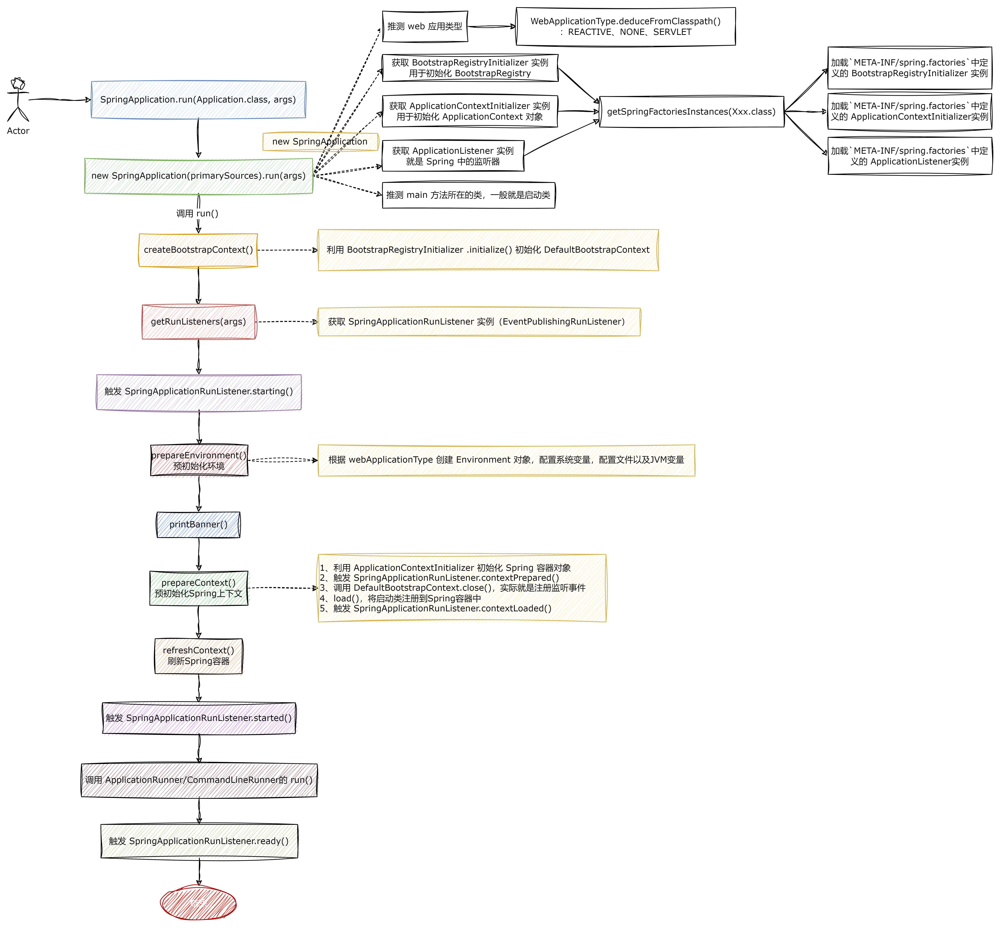

# SpringBoot
> spring-boot version 2.6.0
> 
> source：https://blog.csdn.net/zkr1234562/article/details/128053698



### 自动配置原理入门
#### 引导加载自动配置类
```java
@SpringBootConfiguration
@EnableAutoConfiguration
@ComponentScan(excludeFilters = {
		@Filter(type = FilterType.CUSTOM, classes = TypeExcludeFilter.class),
		@Filter(type = FilterType.CUSTOM, classes = AutoConfigurationExcludeFilter.class) })
public @interface SpringBootApplication {}
```
`@SpringBootApplication`是`@SpringBootConfiguration`、`@EnableAutoConfiguration`以及`@ComponentScan`的合成注解。
##### @SpringBootConfiguration
```java
@Target(ElementType.TYPE)
@Retention(RetentionPolicy.RUNTIME)
@Documented
@Configuration
public @interface SpringBootConfiguration {

    @AliasFor(annotation = Configuration.class)
	boolean proxyBeanMethods() default true;
}
```
在`@SpringBootConfiguration`注解上又标注了`@Configuration`注解，表示这是一个配置类。

proxyBeanMethods：分为 full（全模式）、lite（轻量级模式）。
* proxyBeanMethods = true：Full 全模式。 该模式下注入容器中的同一个组件无论被取出多少次都是同一个bean实例，即单实例对象，在该模式下SpringBoot每次启动都会判断检查容器中是否存在该组件。
* proxyBeanMethods = false：Lite 轻量级模式。该模式下注入容器中的同一个组件无论被取出多少次都是不同的bean实例，即多实例对象，在该模式下SpringBoot每次启动会跳过检查容器中是否存在该组件。

什么时候用Full全模式，什么时候用Lite轻量级模式？
* 当在你的同一个Configuration配置类中，注入到容器中的bean实例之间有依赖关系时，建议使用Full全模式
* 当在你的同一个Configuration配置类中，注入到容器中的bean实例之间没有依赖关系时，建议使用Lite轻量级模式，以提高SpringBoot的启动速度和性能

proxyBeanMethods 属性默认值是 true, 也就是说该配置类会被代理（CGLIB），在同一个配置文件中调用其它被 @Bean 注解标注的方法获取对象时会直接从 IOC 容器之中获取；

##### @ComponentScan
指定扫描哪些bean。
##### @EnableAutoConfiguration
```java
@AutoConfigurationPackage
@Import(AutoConfigurationImportSelector.class)
public @interface EnableAutoConfiguration {

	/**
	 * Environment property that can be used to override when auto-configuration is
	 * enabled.
	 */
	String ENABLED_OVERRIDE_PROPERTY = "spring.boot.enableautoconfiguration";

	/**
	 * Exclude specific auto-configuration classes such that they will never be applied.
	 * @return the classes to exclude
	 */
	Class<?>[] exclude() default {};

	/**
	 * Exclude specific auto-configuration class names such that they will never be
	 * applied.
	 * @return the class names to exclude
	 * @since 1.3.0
	 */
	String[] excludeName() default {};

}
```
###### @AutoConfigurationPackage
自动配置包。
```java
@Import(AutoConfigurationPackages.Registrar.class)
public @interface AutoConfigurationPackage {

	/**
	 * Base packages that should be registered with {@link AutoConfigurationPackages}.
	 * <p>
	 * Use {@link #basePackageClasses} for a type-safe alternative to String-based package
	 * names.
	 * @return the back package names
	 * @since 2.3.0
	 */
	String[] basePackages() default {};

	/**
	 * Type-safe alternative to {@link #basePackages} for specifying the packages to be
	 * registered with {@link AutoConfigurationPackages}.
	 * <p>
	 * Consider creating a special no-op marker class or interface in each package that
	 * serves no purpose other than being referenced by this attribute.
	 * @return the base package classes
	 * @since 2.3.0
	 */
	Class<?>[] basePackageClasses() default {};

}
```
`@Import`就是给容器中导入一个组件（`AutoConfigurationPackages.Registrar`）。`AutoConfigurationPackages.Registrar`用来往容器中批量注册组件。
```txt
@AutoConfigurationPackage和@ComponentScan一样，都是将Spring Boot启动类所在的包及其子包里面的组件扫描到IOC容器中。
但是区别是@AutoConfigurationPackage扫描@Enitity、@Mapper等第三方依赖的注解。
而@ComponentScan只扫描@Controller/@Service/@Component/@Repository这些Spring提供的注解。所以这两个注解扫描的对象是不一样的。

往小了说，@AutoConfigurationPackage是自动配置的提醒，是Spring Boot中注解，而@ComponentScan是Spring的注解
```
1. `org.springframework.boot.autoconfigure.AutoConfigurationPackages.Registrar`
```java
static class Registrar implements ImportBeanDefinitionRegistrar, DeterminableImports {

    @Override
    public void registerBeanDefinitions(AnnotationMetadata metadata, BeanDefinitionRegistry registry) {
        register(registry, new PackageImports(metadata).getPackageNames().toArray(new String[0]));
    }

    @Override
    public Set<Object> determineImports(AnnotationMetadata metadata) {
        return Collections.singleton(new PackageImports(metadata));
    }

}

// org.springframework.boot.autoconfigure.AutoConfigurationPackages#register
private static final String BEAN = AutoConfigurationPackages.class.getName();

public static void register(BeanDefinitionRegistry registry, String... packageNames) {
    if (registry.containsBeanDefinition(BEAN)) {
        BasePackagesBeanDefinition beanDefinition = (BasePackagesBeanDefinition) registry.getBeanDefinition(BEAN);
        beanDefinition.addBasePackages(packageNames);
    }
    else {
        registry.registerBeanDefinition(BEAN, new BasePackagesBeanDefinition(packageNames));
    }
}
```
也就是将启动类所在的包的所有组件导入容器中。

###### @Import(AutoConfigurationImportSelector.class)
1. `org.springframework.boot.autoconfigure.AutoConfigurationImportSelector#selectImports`
```java
/*
    AutoConfigurationImportSelector implements DeferredImportSelector
        DeferredImportSelector extends ImportSelector
*/

public class AutoConfigurationImportSelector implements DeferredImportSelector, BeanClassLoaderAware,
		ResourceLoaderAware, BeanFactoryAware, EnvironmentAware, Ordered {
    @Override
	public String[] selectImports(AnnotationMetadata annotationMetadata) {
		if (!isEnabled(annotationMetadata)) {
			return NO_IMPORTS;
		}
		AutoConfigurationEntry autoConfigurationEntry = getAutoConfigurationEntry(annotationMetadata);
		return StringUtils.toStringArray(autoConfigurationEntry.getConfigurations());
	}
}
```
这个方法中的核心就是利用`getAutoConfigurationEntry(annotationMetadata)`给容器中批量导入组件。
2. `org.springframework.boot.autoconfigure.AutoConfigurationImportSelector#getAutoConfigurationEntry`
```java
protected AutoConfigurationEntry getAutoConfigurationEntry(AnnotationMetadata annotationMetadata) {
    
    // 检查自动配置功能是否开启，默认开启状态
    if (!isEnabled(annotationMetadata)) {
        return EMPTY_ENTRY;
    }
    
    // 将注解元信息封装成注解属性对象
    AnnotationAttributes attributes = getAttributes(annotationMetadata);
    
    // 获取候选配置类的全路径字符串集合
    List<String> configurations = getCandidateConfigurations(annotationMetadata, attributes);
    
    // 去除重复的配置类
    configurations = removeDuplicates(configurations);
    
    // 获取注解中被exclude和excludeName排除的类的集合
    Set<String> exclusions = getExclusions(annotationMetadata, attributes);
    
    // 检查被排除类是否可实例化、是否被自动注册配置所使用，不符合条件则抛出异常
    checkExcludedClasses(configurations, exclusions);
    
    // 从候选配置类中去除掉被排除的类
    configurations.removeAll(exclusions);
    
    // 过滤
    configurations = getConfigurationClassFilter().filter(configurations);
    
    // 将配置类和排除类通过事件传入到监听器中
    fireAutoConfigurationImportEvents(configurations, exclusions);
    
    // 最终返回符合条件的自动配置类的全限定名数组
    return new AutoConfigurationEntry(configurations, exclusions);
}

protected boolean isEnabled(AnnotationMetadata metadata) {
    if (getClass() == AutoConfigurationImportSelector.class) {
        return getEnvironment().getProperty(EnableAutoConfiguration.ENABLED_OVERRIDE_PROPERTY, Boolean.class, true);
    }
    return true;
}
```
3. `org.springframework.boot.autoconfigure.AutoConfigurationImportSelector#getCandidateConfigurations`
```java
protected List<String> getCandidateConfigurations(AnnotationMetadata metadata, AnnotationAttributes attributes) {
    List<String> configurations = SpringFactoriesLoader.loadFactoryNames(getSpringFactoriesLoaderFactoryClass(),
            getBeanClassLoader());
    Assert.notEmpty(configurations, "No auto configuration classes found in META-INF/spring.factories. If you "
            + "are using a custom packaging, make sure that file is correct.");
    return configurations;
}
```
4. `org.springframework.core.io.support.SpringFactoriesLoader#loadFactoryNames`
```java
public static List<String> loadFactoryNames(Class<?> factoryType, @Nullable ClassLoader classLoader) {
    ClassLoader classLoaderToUse = classLoader;
    if (classLoaderToUse == null) {
        classLoaderToUse = SpringFactoriesLoader.class.getClassLoader();
    }
    String factoryTypeName = factoryType.getName();
    return loadSpringFactories(classLoaderToUse).getOrDefault(factoryTypeName, Collections.emptyList());
}
```
5. `org.springframework.core.io.support.SpringFactoriesLoader#loadSpringFactories`
```java
public static final String FACTORIES_RESOURCE_LOCATION = "META-INF/spring.factories";

private static Map<String, List<String>> loadSpringFactories(ClassLoader classLoader) {
    Map<String, List<String>> result = cache.get(classLoader);
    if (result != null) {
        return result;
    }

    result = new HashMap<>();
    try {
        Enumeration<URL> urls = classLoader.getResources(FACTORIES_RESOURCE_LOCATION);
        while (urls.hasMoreElements()) {
            URL url = urls.nextElement();
            UrlResource resource = new UrlResource(url);
            Properties properties = PropertiesLoaderUtils.loadProperties(resource);
            for (Map.Entry<?, ?> entry : properties.entrySet()) {
                String factoryTypeName = ((String) entry.getKey()).trim();
                String[] factoryImplementationNames =
                        StringUtils.commaDelimitedListToStringArray((String) entry.getValue());
                for (String factoryImplementationName : factoryImplementationNames) {
                    result.computeIfAbsent(factoryTypeName, key -> new ArrayList<>())
                            .add(factoryImplementationName.trim());
                }
            }
        }

        // Replace all lists with unmodifiable lists containing unique elements
        result.replaceAll((factoryType, implementations) -> implementations.stream().distinct()
                .collect(Collectors.collectingAndThen(Collectors.toList(), Collections::unmodifiableList)));
        cache.put(classLoader, result);
    }
    catch (IOException ex) {
        throw new IllegalArgumentException("Unable to load factories from location [" +
                FACTORIES_RESOURCE_LOCATION + "]", ex);
    }
    return result;
}
```
默认会扫描当前系统下的所有`META-INF/spring.factories`位置的文件。比如`spring-boot-autoconfigure-2.6.0.jar`包下的`META-INF/spring.factories`文件就是要自动配置的配置。
```txt
# Auto Configure
org.springframework.boot.autoconfigure.EnableAutoConfiguration=\
org.springframework.boot.autoconfigure.admin.SpringApplicationAdminJmxAutoConfiguration,\
org.springframework.boot.autoconfigure.aop.AopAutoConfiguration,\
org.springframework.boot.autoconfigure.amqp.RabbitAutoConfiguration,\
org.springframework.boot.autoconfigure.batch.BatchAutoConfiguration,\
org.springframework.boot.autoconfigure.web.servlet.DispatcherServletAutoConfiguration,\
org.springframework.boot.autoconfigure.web.servlet.ServletWebServerFactoryAutoConfiguration,\
org.springframework.boot.autoconfigure.web.servlet.error.ErrorMvcAutoConfiguration,\
org.springframework.boot.autoconfigure.web.servlet.HttpEncodingAutoConfiguration,\
org.springframework.boot.autoconfigure.web.servlet.MultipartAutoConfiguration,\
org.springframework.boot.autoconfigure.web.servlet.WebMvcAutoConfiguration,\
... 
```
而这些配置文件是在文件中固定的，兼容了全场景的配置。然后会按需进行加载，并不会全部导入。

而且对应的配置类是否生效，也取决于`@ConditionalOnClass`这种`@ConditionalOnXxx`条件注解，如果系统中存在指定的类，那么对应的配置类则生效。就会导入相关的组件

总结：
1. SpringBoot 会先加载所有的自动配置类，`xxxAutoConfiguration`。
2. 每个自动配置类按照条件进行生效（`@ConditionalOnXxx`），默认都会绑定一个配置文件。
3. 生效的配置类就会给容器中装配需要的组件。
4. 只要容器中有这些组件，相当于这些功能就有了。
5. 定制化配置
    1. 用户可以使用@bean替换底层的组件。
    2. 去底层查看这个组件获取哪些配置文件的哪些值，修改值替换组件即可。
    
## SpringBoot 原理
### SpringBoot 启动过程
#### SpringApplication 创建初始化过程

启动类程序

```java
@SpringBootApplication
public class Application {

    public static void main(String[] args) {
        SpringApplication.run(Application.class, args);
    }
}
```

1、SpringApplication.run

```java
public static ConfigurableApplicationContext run(Class<?> primarySource, String... args) {
  return run(new Class<?>[] { primarySource }, args);
}

 public static ConfigurableApplicationContext run(Class<?>[] primarySources, String[] args) {
     return new SpringApplication(primarySources).run(args);
 }

 public SpringApplication(Class<?>... primarySources) {
     this(null, primarySources);
 }

 public SpringApplication(ResourceLoader resourceLoader, Class<?>... primarySources) {
     this.resourceLoader = resourceLoader;
     Assert.notNull(primarySources, "PrimarySources must not be null");
     
     // 初始化加载资源类集合
     this.primarySources = new LinkedHashSet<>(Arrays.asList(primarySources));
     
     // 推断当前 WEB 应用类型，一共有三种：NONE,SERVLET,REACTIVE
     this.webApplicationType = WebApplicationType.deduceFromClasspath();
     
     // 获取引导注册初始化器，从"META-INF/spring.factories"读取BootstrapRegistryInitializer类的实例名称集合
     this.bootstrapRegistryInitializers = new ArrayList<>(
             getSpringFactoriesInstances(BootstrapRegistryInitializer.class));
             
     // 获取应用上下文初始化器，从"META-INF/spring.factories"读取ApplicationContextInitializer类的实例名称集合
     setInitializers((Collection) getSpringFactoriesInstances(ApplicationContextInitializer.class));
     
     // 获取监听器，从"META-INF/spring.factories"读取ApplicationListener类的实例名称集合
     setListeners((Collection) getSpringFactoriesInstances(ApplicationListener.class));
     
     // 推断主入口应用类，通过当前调用栈，获取Main方法所在类，并赋值给mainApplicationClass
     this.mainApplicationClass = deduceMainApplicationClass();
  }
```

2、deduceFromClasspath()

```java
private static final String[] SERVLET_INDICATOR_CLASSES = { "javax.servlet.Servlet",
	"org.springframework.web.context.ConfigurableWebApplicationContext" };

private static final String WEBMVC_INDICATOR_CLASS = "org.springframework.web.servlet.DispatcherServlet";

private static final String WEBFLUX_INDICATOR_CLASS = "org.springframework.web.reactive.DispatcherHandler";

private static final String JERSEY_INDICATOR_CLASS = "org.glassfish.jersey.servlet.ServletContainer";

static WebApplicationType deduceFromClasspath() {
    
    // 响应式
    if (ClassUtils.isPresent(WEBFLUX_INDICATOR_CLASS, null) && !ClassUtils.isPresent(WEBMVC_INDICATOR_CLASS, null)
            && !ClassUtils.isPresent(JERSEY_INDICATOR_CLASS, null)) {
        return WebApplicationType.REACTIVE;
    }
    
    // 非web
    for (String className : SERVLET_INDICATOR_CLASSES) {
        if (!ClassUtils.isPresent(className, null)) {
            return WebApplicationType.NONE;
        }
    }
    
    // servlet web
    return WebApplicationType.SERVLET;
}
```

#### SpringBoot 启动过程
```java
public ConfigurableApplicationContext run(String... args) {
    long startTime = System.nanoTime();
    
    // 创建DefaultBootstrapContext对象,利用BootstrapRegistryInitializer初始化DefaultBootstrapContext对象
    DefaultBootstrapContext bootstrapContext = createBootstrapContext();
    ConfigurableApplicationContext context = null;
    
    /*
        开启Headless模式，设置系统属性`java.awt.headless`的值，默认为true，
        用于运行headless服务器，进行简单的图像处理，多用于在缺少显示屏、键盘或者鼠标时的系统配置，很多监控工具如jconsole 需要将该值设置为true
    */
    configureHeadlessProperty();
    
    /*
        获取SpringApplicationRunListeners类型的实例
        SpringBoot提供了一个EventPublishingRunListener，它实现了SpringApplicationRunListener接口
        可以在程序执行到一定阶段时进行事件通知，回调方法
        SpringBoot会利用这个类，发布一个ApplicationContextInitializedEvent事件，可以通过定义ApplicationListener来消费这个事件
    */
    SpringApplicationRunListeners listeners = getRunListeners(args);
    
    // 发布ApplicationStartingEvent事件，在运行开始时发送
    listeners.starting(bootstrapContext, this.mainApplicationClass);
    try {
    
        // 初始化默认应用参数类
        ApplicationArguments applicationArguments = new DefaultApplicationArguments(args);
        
        /*
        预初始化环境
            读取环境变量：操作系统的环境变量/JVM的环境变量）。
            读取配置文件信息：基于监听器，会利用EventPublishingRunListener发布一个ApplicationEnvironmentPreparedEvent事件
              默认会有一个EnvironmentPostProcessorApplicationListener来处理这个事件，当然也可以通过自定义ApplicationListener来处理这个事件，
              当ApplicationListener接收到这个事件之后，就会解析application.properties、application.yml文件，并添加到Environment中
        */
        ConfigurableEnvironment environment = prepareEnvironment(listeners, bootstrapContext, applicationArguments);
        
        // 把要忽略的bean的参数打开
        configureIgnoreBeanInfo(environment);
        
        // 打印Banner
        Banner printedBanner = printBanner(environment);
        
        // 根据webApplicationType创建不同的Spring上下文容器
        context = createApplicationContext();
        context.setApplicationStartup(this.applicationStartup);
        
        // 预初始化spring上下文，将启动类注入容器
        prepareContext(bootstrapContext, context, environment, listeners, applicationArguments, printedBanner);
        
        // 刷新Spring容器，将bean加载到容器中，
        // 创建并启动tomacat等（以tomcat为例，调到ServletWebServerApplicationContext的createWebServer()方法
        // 在`onRefresh()`执行TomcatServletWebServerFactory的getWebServer方法
        refreshContext(context);
        
        // 空方法，用于扩展
        afterRefresh(context, applicationArguments);
        Duration timeTakenToStartup = Duration.ofNanos(System.nanoTime() - startTime);
        if (this.logStartupInfo) {
            new StartupInfoLogger(this.mainApplicationClass).logStarted(getApplicationLog(), timeTakenToStartup);
        }
        
        // 发布ApplicationStartedEvent事件和AvailabilityChangeEvent事件
        listeners.started(context, timeTakenToStartup);
        
        // 获取Spring容器中的ApplicationRunner/CommandLineRunner类型的Bean,并执行run方法
        callRunners(context, applicationArguments);
    }
    catch (Throwable ex) {
    
        // 发布ApplicationFailedEvent事件
        handleRunFailure(context, ex, listeners);
        throw new IllegalStateException(ex);
    }
    try {
        Duration timeTakenToReady = Duration.ofNanos(System.nanoTime() - startTime);
        
        // 发布ApplicationReadyEvent事件和AvailabilityChangeEvent事件
        listeners.ready(context, timeTakenToReady);
    }
    catch (Throwable ex) {
    
        // 发布ApplicationFailedEvent事件
        handleRunFailure(context, ex, null);
        throw new IllegalStateException(ex);
    }
    return context;
}
```
##### 预初始化环境
```java
private ConfigurableEnvironment prepareEnvironment(SpringApplicationRunListeners listeners,
        DefaultBootstrapContext bootstrapContext, ApplicationArguments applicationArguments) {
    // Create and configure the environment
    
    // 根据webApplicationType创建或者获取Environment
    ConfigurableEnvironment environment = getOrCreateEnvironment();
    
    // 将命令行参数读取环境变量中
    configureEnvironment(environment, applicationArguments.getSourceArgs());
    
    // 将@PropertieSource的配置信息 放在第一位，它的优先级是最低的
    ConfigurationPropertySources.attach(environment);
    
    // 发布ApplicationEnvironmentPreparedEvent的监听器，读取全局配置文件
    listeners.environmentPrepared(bootstrapContext, environment);
    
    // 所有spring.main 开头的配置信息绑定到SpringApplication中
    DefaultPropertiesPropertySource.moveToEnd(environment);
    Assert.state(!environment.containsProperty("spring.main.environment-prefix"),
            "Environment prefix cannot be set via properties.");
    bindToSpringApplication(environment);
    if (!this.isCustomEnvironment) {
        environment = convertEnvironment(environment);
    }
    
    // 更新PropertySources
    ConfigurationPropertySources.attach(environment);
    return environment;
}


private ConfigurableEnvironment getOrCreateEnvironment() {
    if (this.environment != null) {
        return this.environment;
    }
    switch (this.webApplicationType) {
    case SERVLET:
        return new ApplicationServletEnvironment();
    case REACTIVE:
        return new ApplicationReactiveWebEnvironment();
    default:
        return new ApplicationEnvironment();
    }
}
```
##### 预初始化Spring上下文
```java
private void prepareContext(DefaultBootstrapContext bootstrapContext, ConfigurableApplicationContext context,
			ConfigurableEnvironment environment, SpringApplicationRunListeners listeners,
			ApplicationArguments applicationArguments, Banner printedBanner) {
    context.setEnvironment(environment);
    postProcessApplicationContext(context);
    
    // 拿到之前读取到所有ApplicationContextInitializer的组件， 循环调用initialize方法
    applyInitializers(context);
    
    // 发布ApplicationContextInitializedEvent
    listeners.contextPrepared(context);
    bootstrapContext.close(context);
    if (this.logStartupInfo) {
        logStartupInfo(context.getParent() == null);
        logStartupProfileInfo(context);
    }
    // Add boot specific singleton beans
    
    // 获取当前spring上下文beanFactory (负责创建bean)
    ConfigurableListableBeanFactory beanFactory = context.getBeanFactory();
    beanFactory.registerSingleton("springApplicationArguments", applicationArguments);
    if (printedBanner != null) {
        beanFactory.registerSingleton("springBootBanner", printedBanner);
    }
    
    //设置不允许覆盖bean，当出现两个重名的bean，会抛异常
    if (beanFactory instanceof AbstractAutowireCapableBeanFactory) {
        ((AbstractAutowireCapableBeanFactory) beanFactory).setAllowCircularReferences(this.allowCircularReferences);
        if (beanFactory instanceof DefaultListableBeanFactory) {
            ((DefaultListableBeanFactory) beanFactory)
                    .setAllowBeanDefinitionOverriding(this.allowBeanDefinitionOverriding);
        }
    }
    
    // 设置当前spring容器是不是要将所有的bean设置为懒加载
    if (this.lazyInitialization) {
        context.addBeanFactoryPostProcessor(new LazyInitializationBeanFactoryPostProcessor());
    }
    // Load the sources
    Set<Object> sources = getAllSources();
    Assert.notEmpty(sources, "Sources must not be empty");
    
    // 读取主启动类 （因为后续要根据配置类解析配置的所有bean)，将启动类作为配置类注册到Spring容器中
    load(context, sources.toArray(new Object[0]));
    
    // 读取完配置类后发送ApplicationPreparedEvent，默认利用EventPublishingRunListener发布一个ApplicationPreparedEvent事件
    listeners.contextLoaded(context);
}
```

## 附录
### getSpringFactoriesInstances()
```java
private <T> Collection<T> getSpringFactoriesInstances(Class<T> type, Class<?>[] parameterTypes, Object... args) {
    ClassLoader classLoader = getClassLoader();
    // Use names and ensure unique to protect against duplicates
    Set<String> names = new LinkedHashSet<>(SpringFactoriesLoader.loadFactoryNames(type, classLoader));
    List<T> instances = createSpringFactoriesInstances(type, parameterTypes, classLoader, args, names);
    AnnotationAwareOrderComparator.sort(instances);
    return instances;
}
```

