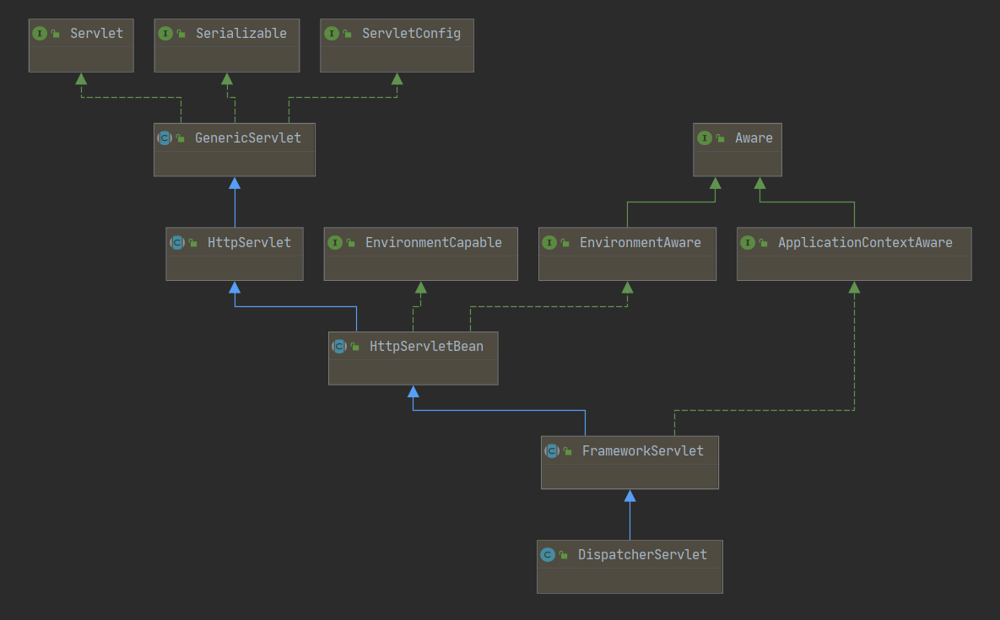

# SpringMVC



## 初始化阶段

### Servlet

```java
/*
 * Licensed to the Apache Software Foundation (ASF) under one or more
 * contributor license agreements.  See the NOTICE file distributed with
 * this work for additional information regarding copyright ownership.
 * The ASF licenses this file to You under the Apache License, Version 2.0
 * (the "License"); you may not use this file except in compliance with
 * the License.  You may obtain a copy of the License at
 *
 *     http://www.apache.org/licenses/LICENSE-2.0
 *
 * Unless required by applicable law or agreed to in writing, software
 * distributed under the License is distributed on an "AS IS" BASIS,
 * WITHOUT WARRANTIES OR CONDITIONS OF ANY KIND, either express or implied.
 * See the License for the specific language governing permissions and
 * limitations under the License.
 */

package javax.servlet;

import java.io.IOException;

public interface Servlet {

    public void init(ServletConfig config) throws ServletException;

    public ServletConfig getServletConfig();

    public void service(ServletRequest req, ServletResponse res)
            throws ServletException, IOException;

    public String getServletInfo();

    public void destroy();
}
```

### GenericServlet

```java
package javax.servlet;

import java.io.IOException;
import java.util.Enumeration;

public abstract class GenericServlet implements Servlet, ServletConfig,
        java.io.Serializable {

    private static final long serialVersionUID = 1L;

    private transient ServletConfig config;

    public GenericServlet() {
        // NOOP
    }

    @Override
    public void destroy() {
        // NOOP by default
    }

......

    /**
        初始化
    */
    @Override
    public void init(ServletConfig config) throws ServletException {
        this.config = config;
        // 由子类实现
        this.init();
    }

    public void init() throws ServletException {
        // NOOP by default
    }

......

    @Override
    public abstract void service(ServletRequest req, ServletResponse res)
            throws ServletException, IOException;
......
}
```

### HttpServlet

```java

package javax.servlet.http;

import java.io.IOException;
import java.io.OutputStreamWriter;
import java.io.PrintWriter;
import java.io.UnsupportedEncodingException;
import java.lang.reflect.InvocationTargetException;
import java.lang.reflect.Method;
import java.text.MessageFormat;
import java.util.Enumeration;
import java.util.ResourceBundle;

import javax.servlet.DispatcherType;
import javax.servlet.GenericServlet;
import javax.servlet.ServletException;
import javax.servlet.ServletOutputStream;
import javax.servlet.ServletRequest;
import javax.servlet.ServletResponse;

public abstract class HttpServlet extends GenericServlet {

    private static final long serialVersionUID = 1L;

    private static final String METHOD_DELETE = "DELETE";
    private static final String METHOD_HEAD = "HEAD";
    private static final String METHOD_GET = "GET";
    private static final String METHOD_OPTIONS = "OPTIONS";
    private static final String METHOD_POST = "POST";
    private static final String METHOD_PUT = "PUT";
    private static final String METHOD_TRACE = "TRACE";

    private static final String HEADER_IFMODSINCE = "If-Modified-Since";
    private static final String HEADER_LASTMOD = "Last-Modified";

    private static final String LSTRING_FILE =
        "javax.servlet.http.LocalStrings";
    private static final ResourceBundle lStrings =
        ResourceBundle.getBundle(LSTRING_FILE);


    /**
     * Does nothing, because this is an abstract class.
     */
    public HttpServlet() {
        // NOOP
    }

    protected void doGet(HttpServletRequest req, HttpServletResponse resp)
        throws ServletException, IOException
    {
        String msg = lStrings.getString("http.method_get_not_supported");
        sendMethodNotAllowed(req, resp, msg);
    }

......

    protected void doHead(HttpServletRequest req, HttpServletResponse resp)
        throws ServletException, IOException {

        if (DispatcherType.INCLUDE.equals(req.getDispatcherType())) {
            doGet(req, resp);
        } else {
            NoBodyResponse response = new NoBodyResponse(resp);
            doGet(req, response);
            response.setContentLength();
        }
    }

    protected void doPost(HttpServletRequest req, HttpServletResponse resp)
        throws ServletException, IOException {

        String msg = lStrings.getString("http.method_post_not_supported");
        sendMethodNotAllowed(req, resp, msg);
    }

    protected void doPut(HttpServletRequest req, HttpServletResponse resp)
        throws ServletException, IOException {

        String msg = lStrings.getString("http.method_put_not_supported");
        sendMethodNotAllowed(req, resp, msg);
    }

    protected void doDelete(HttpServletRequest req,
                            HttpServletResponse resp)
        throws ServletException, IOException {

        String msg = lStrings.getString("http.method_delete_not_supported");
        sendMethodNotAllowed(req, resp, msg);
    }

......

    protected void doOptions(HttpServletRequest req,
            HttpServletResponse resp)
        throws ServletException, IOException {

        Method[] methods = getAllDeclaredMethods(this.getClass());

        boolean ALLOW_GET = false;
        boolean ALLOW_HEAD = false;
        boolean ALLOW_POST = false;
        boolean ALLOW_PUT = false;
        boolean ALLOW_DELETE = false;
        boolean ALLOW_TRACE = true;
        boolean ALLOW_OPTIONS = true;

        // Tomcat specific hack to see if TRACE is allowed
        Class<?> clazz = null;
        try {
            clazz = Class.forName("org.apache.catalina.connector.RequestFacade");
            Method getAllowTrace = clazz.getMethod("getAllowTrace", (Class<?>[]) null);
            ALLOW_TRACE = ((Boolean) getAllowTrace.invoke(req, (Object[]) null)).booleanValue();
        } catch (ClassNotFoundException | NoSuchMethodException | SecurityException |
                IllegalAccessException | IllegalArgumentException | InvocationTargetException e) {
            // Ignore. Not running on Tomcat. TRACE is always allowed.
        }
        // End of Tomcat specific hack

        for (int i=0; i<methods.length; i++) {
            Method m = methods[i];

            if (m.getName().equals("doGet")) {
                ALLOW_GET = true;
                ALLOW_HEAD = true;
            }
            if (m.getName().equals("doPost"))
                ALLOW_POST = true;
            if (m.getName().equals("doPut"))
                ALLOW_PUT = true;
            if (m.getName().equals("doDelete"))
                ALLOW_DELETE = true;
        }

        String allow = null;
        if (ALLOW_GET)
            allow=METHOD_GET;
        if (ALLOW_HEAD)
            if (allow==null) allow=METHOD_HEAD;
            else allow += ", " + METHOD_HEAD;
        if (ALLOW_POST)
            if (allow==null) allow=METHOD_POST;
            else allow += ", " + METHOD_POST;
        if (ALLOW_PUT)
            if (allow==null) allow=METHOD_PUT;
            else allow += ", " + METHOD_PUT;
        if (ALLOW_DELETE)
            if (allow==null) allow=METHOD_DELETE;
            else allow += ", " + METHOD_DELETE;
        if (ALLOW_TRACE)
            if (allow==null) allow=METHOD_TRACE;
            else allow += ", " + METHOD_TRACE;
        if (ALLOW_OPTIONS)
            if (allow==null) allow=METHOD_OPTIONS;
            else allow += ", " + METHOD_OPTIONS;

        resp.setHeader("Allow", allow);
    }

    protected void doTrace(HttpServletRequest req, HttpServletResponse resp)
        throws ServletException, IOException
    {

        int responseLength;

        String CRLF = "\r\n";
        StringBuilder buffer = new StringBuilder("TRACE ").append(req.getRequestURI())
            .append(" ").append(req.getProtocol());

        Enumeration<String> reqHeaderEnum = req.getHeaderNames();

        while( reqHeaderEnum.hasMoreElements() ) {
            String headerName = reqHeaderEnum.nextElement();
            buffer.append(CRLF).append(headerName).append(": ")
                .append(req.getHeader(headerName));
        }

        buffer.append(CRLF);

        responseLength = buffer.length();

        resp.setContentType("message/http");
        resp.setContentLength(responseLength);
        ServletOutputStream out = resp.getOutputStream();
        out.print(buffer.toString());
        out.close();
    }

    protected void service(HttpServletRequest req, HttpServletResponse resp)
        throws ServletException, IOException {

        String method = req.getMethod();

        if (method.equals(METHOD_GET)) {
            long lastModified = getLastModified(req);
            if (lastModified == -1) {
                // servlet doesn't support if-modified-since, no reason
                // to go through further expensive logic
                doGet(req, resp);
            } else {
                long ifModifiedSince;
                try {
                    ifModifiedSince = req.getDateHeader(HEADER_IFMODSINCE);
                } catch (IllegalArgumentException iae) {
                    // Invalid date header - proceed as if none was set
                    ifModifiedSince = -1;
                }
                if (ifModifiedSince < (lastModified / 1000 * 1000)) {
                    // If the servlet mod time is later, call doGet()
                    // Round down to the nearest second for a proper compare
                    // A ifModifiedSince of -1 will always be less
                    maybeSetLastModified(resp, lastModified);
                    doGet(req, resp);
                } else {
                    resp.setStatus(HttpServletResponse.SC_NOT_MODIFIED);
                }
            }

        } else if (method.equals(METHOD_HEAD)) {
            long lastModified = getLastModified(req);
            maybeSetLastModified(resp, lastModified);
            doHead(req, resp);

        } else if (method.equals(METHOD_POST)) {
            doPost(req, resp);

        } else if (method.equals(METHOD_PUT)) {
            doPut(req, resp);

        } else if (method.equals(METHOD_DELETE)) {
            doDelete(req, resp);

        } else if (method.equals(METHOD_OPTIONS)) {
            doOptions(req,resp);

        } else if (method.equals(METHOD_TRACE)) {
            doTrace(req,resp);

        } else {
            //
            // Note that this means NO servlet supports whatever
            // method was requested, anywhere on this server.
            //

            String errMsg = lStrings.getString("http.method_not_implemented");
            Object[] errArgs = new Object[1];
            errArgs[0] = method;
            errMsg = MessageFormat.format(errMsg, errArgs);

            resp.sendError(HttpServletResponse.SC_NOT_IMPLEMENTED, errMsg);
        }
    }

    @Override
    public void service(ServletRequest req, ServletResponse res)
        throws ServletException, IOException {

        HttpServletRequest  request;
        HttpServletResponse response;

        try {
            request = (HttpServletRequest) req;
            response = (HttpServletResponse) res;
        } catch (ClassCastException e) {
            throw new ServletException(lStrings.getString("http.non_http"));
        }
        service(request, response);
    }
}
// NoBodyResponse、NoBodyOutputStream
......
```

### HttpServletBean

```java
package org.springframework.web.servlet;

import java.util.Enumeration;
import java.util.HashSet;
import java.util.Set;

import javax.servlet.ServletConfig;
import javax.servlet.ServletException;
import javax.servlet.http.HttpServlet;

import org.apache.commons.logging.Log;
import org.apache.commons.logging.LogFactory;

import org.springframework.beans.BeanWrapper;
import org.springframework.beans.BeansException;
import org.springframework.beans.MutablePropertyValues;
import org.springframework.beans.PropertyAccessorFactory;
import org.springframework.beans.PropertyValue;
import org.springframework.beans.PropertyValues;
import org.springframework.context.EnvironmentAware;
import org.springframework.core.env.ConfigurableEnvironment;
import org.springframework.core.env.Environment;
import org.springframework.core.env.EnvironmentCapable;
import org.springframework.core.io.Resource;
import org.springframework.core.io.ResourceEditor;
import org.springframework.core.io.ResourceLoader;
import org.springframework.lang.Nullable;
import org.springframework.util.Assert;
import org.springframework.util.CollectionUtils;
import org.springframework.util.StringUtils;
import org.springframework.web.context.support.ServletContextResourceLoader;
import org.springframework.web.context.support.StandardServletEnvironment;

@SuppressWarnings("serial")
public abstract class HttpServletBean extends HttpServlet implements EnvironmentCapable, EnvironmentAware {

	/** Logger available to subclasses. */
	protected final Log logger = LogFactory.getLog(getClass());

	@Nullable
	private ConfigurableEnvironment environment;

	private final Set<String> requiredProperties = new HashSet<>(4);

	protected final void addRequiredProperty(String property) {
		this.requiredProperties.add(property);
	}

......
    
    /**
        tomcat启动，就会执行该方法，初始化DispatcherServlet
    */
	@Override
	public final void init() throws ServletException {

		// Set bean properties from init parameters.
		PropertyValues pvs = new ServletConfigPropertyValues(getServletConfig(), this.requiredProperties);
		if (!pvs.isEmpty()) {
			try {
				BeanWrapper bw = PropertyAccessorFactory.forBeanPropertyAccess(this);
				ResourceLoader resourceLoader = new ServletContextResourceLoader(getServletContext());
				bw.registerCustomEditor(Resource.class, new ResourceEditor(resourceLoader, getEnvironment()));
				initBeanWrapper(bw);
				bw.setPropertyValues(pvs, true);
			}
			catch (BeansException ex) {
				if (logger.isErrorEnabled()) {
					logger.error("Failed to set bean properties on servlet '" + getServletName() + "'", ex);
				}
				throw ex;
			}
		}

		// 初始化 web 环境，执行 FrameworkServlet#initServletBean() 方法
		initServletBean();
	}
......
}
```

### FrameworkServlet

```java
public abstract class FrameworkServlet extends HttpServletBean implements ApplicationContextAware {

	@Override
	protected final void initServletBean() throws ServletException {
		getServletContext().log("Initializing Spring " + getClass().getSimpleName() + " '" + getServletName() + "'");
		if (logger.isInfoEnabled()) {
			logger.info("Initializing Servlet '" + getServletName() + "'");
		}
		long startTime = System.currentTimeMillis();

		try {
            // 初始化 web 环境
			this.webApplicationContext = initWebApplicationContext();
			initFrameworkServlet();
		}
		catch (ServletException | RuntimeException ex) {
			logger.error("Context initialization failed", ex);
			throw ex;
		}

		if (logger.isDebugEnabled()) {
			String value = this.enableLoggingRequestDetails ?
					"shown which may lead to unsafe logging of potentially sensitive data" :
					"masked to prevent unsafe logging of potentially sensitive data";
			logger.debug("enableLoggingRequestDetails='" + this.enableLoggingRequestDetails +
					"': request parameters and headers will be " + value);
		}

		if (logger.isInfoEnabled()) {
			logger.info("Completed initialization in " + (System.currentTimeMillis() - startTime) + " ms");
		}
	}

    protected WebApplicationContext initWebApplicationContext() {
        WebApplicationContext rootContext =
                WebApplicationContextUtils.getWebApplicationContext(getServletContext());
        WebApplicationContext wac = null;

        if (this.webApplicationContext != null) {
            // A context instance was injected at construction time -> use it
            wac = this.webApplicationContext;
            if (wac instanceof ConfigurableWebApplicationContext) {
                ConfigurableWebApplicationContext cwac = (ConfigurableWebApplicationContext) wac;
                if (!cwac.isActive()) {
                    // The context has not yet been refreshed -> provide services such as
                    // setting the parent context, setting the application context id, etc
                    if (cwac.getParent() == null) {
                        // The context instance was injected without an explicit parent -> set
                        // the root application context (if any; may be null) as the parent
                        cwac.setParent(rootContext);
                    }

                    /*
                        配置和刷新Spring容器
                        初始化Spring IOC环境，这个方法最终会调用 refresh() 方法
                    */
                    configureAndRefreshWebApplicationContext(cwac);
                }
            }
        }
        if (wac == null) {
            // No context instance was injected at construction time -> see if one
            // has been registered in the servlet context. If one exists, it is assumed
            // that the parent context (if any) has already been set and that the
            // user has performed any initialization such as setting the context id
            wac = findWebApplicationContext();
        }
        if (wac == null) {
            // No context instance is defined for this servlet -> create a local one
            wac = createWebApplicationContext(rootContext);
        }

        if (!this.refreshEventReceived) {
            // Either the context is not a ConfigurableApplicationContext with refresh
            // support or the context injected at construction time had already been
            // refreshed -> trigger initial onRefresh manually here.
            synchronized (this.onRefreshMonitor) {
                // 初始化DispatcherServlet的配置，由子类实现
                onRefresh(wac);
            }
        }

        if (this.publishContext) {
            // Publish the context as a servlet context attribute.
            String attrName = getServletContextAttributeName();
            getServletContext().setAttribute(attrName, wac);
        }

        return wac;
    }

    protected void configureAndRefreshWebApplicationContext(ConfigurableWebApplicationContext wac) {
        if (ObjectUtils.identityToString(wac).equals(wac.getId())) {
            // The application context id is still set to its original default value
            // -> assign a more useful id based on available information
            if (this.contextId != null) {
                wac.setId(this.contextId);
            }
            else {
                // Generate default id...
                wac.setId(ConfigurableWebApplicationContext.APPLICATION_CONTEXT_ID_PREFIX +
                        ObjectUtils.getDisplayString(getServletContext().getContextPath()) + '/' + getServletName());
            }
        }

        wac.setServletContext(getServletContext());
        wac.setServletConfig(getServletConfig());
        wac.setNamespace(getNamespace());
        wac.addApplicationListener(new SourceFilteringListener(wac, new ContextRefreshListener()));

        // The wac environment's #initPropertySources will be called in any case when the context
        // is refreshed; do it eagerly here to ensure servlet property sources are in place for
        // use in any post-processing or initialization that occurs below prior to #refresh
        ConfigurableEnvironment env = wac.getEnvironment();
        if (env instanceof ConfigurableWebEnvironment) {
            ((ConfigurableWebEnvironment) env).initPropertySources(getServletContext(), getServletConfig());
        }

        postProcessWebApplicationContext(wac);
        applyInitializers(wac);
        wac.refresh();
    }
}
```

### DispatcherServlet

```java
public class DispatcherServlet extends FrameworkServlet {
	@Override
	protected void onRefresh(ApplicationContext context) {
		initStrategies(context);
	}

	protected void initStrategies(ApplicationContext context) {
		initMultipartResolver(context);// 文件上传解析器
		initLocaleResolver(context);// 国际化解析器
		initThemeResolver(context);// 网页主题解析器
		initHandlerMappings(context);// 初始化 HandlerMapping
		initHandlerAdapters(context);// 初始化 HandlerAdapter
		initHandlerExceptionResolvers(context);// 处理器异常解析器
		initRequestToViewNameTranslator(context);
		initViewResolvers(context);// 视图解析器
		initFlashMapManager(context);// 重定向数据管理器
	}
}
```

## 请求处理阶段

> 用户的一个请求过来，会由Servlet接收到，然后一步一步调用到DispatcherServlet的doService方法。

```text
# 请求调用链

Servlet#service
  -> GenericServlet#service
    -> HttpServlet#service(ServletRequest, ServletResponse)
      -> HttpServletBean
        -> FrameworkServlet#service
          -> FrameworkServlet#processRequest
            -> DispatcherServlet#doService
```

1. doDispatch

```java
public class DispatcherServlet extends FrameworkServlet {
    protected void doDispatch(HttpServletRequest request, HttpServletResponse response) throws Exception {
		HttpServletRequest processedRequest = request;
		HandlerExecutionChain mappedHandler = null;
		boolean multipartRequestParsed = false;

		WebAsyncManager asyncManager = WebAsyncUtils.getAsyncManager(request);

		try {
			ModelAndView mv = null;
			Exception dispatchException = null;

			try {
                // 检查请求中是否有文件上传操作
				processedRequest = checkMultipart(request);
				multipartRequestParsed = (processedRequest != request);

				// mappedHandler调用链，该对象封装了handler和interceptors
				mappedHandler = getHandler(processedRequest);
                // mappedHandler没找到，响应404
				if (mappedHandler == null) {
					noHandlerFound(processedRequest, response);
					return;
				}

				// 获取处理器适配器
                // 如果是一个bean，mappedHandler.getHandler()返回的是一个对象
                // 如果是一个method，mappedHandler.getHandler()返回的是一个方法
				HandlerAdapter ha = getHandlerAdapter(mappedHandler.getHandler());

				// 处理请求头
				String method = request.getMethod();
				boolean isGet = "GET".equals(method);
				if (isGet || "HEAD".equals(method)) {
					long lastModified = ha.getLastModified(request, mappedHandler.getHandler());
					if (new ServletWebRequest(request, response).checkNotModified(lastModified) && isGet) {
						return;
					}
				}

				// 前置拦截器
				if (!mappedHandler.applyPreHandle(processedRequest, response)) {
					return;
				}

				// 通过处理器适配器，处理请求，反射调用
				mv = ha.handle(processedRequest, response, mappedHandler.getHandler());

				if (asyncManager.isConcurrentHandlingStarted()) {
					return;
				}
                // 视图解析器处理
				applyDefaultViewName(processedRequest, mv);
                // 后置拦截器
				mappedHandler.applyPostHandle(processedRequest, response, mv);
			}
			catch (Exception ex) {
				dispatchException = ex;
			}
			catch (Throwable err) {
				// As of 4.3, we're processing Errors thrown from handler methods as well,
				// making them available for @ExceptionHandler methods and other scenarios.
				dispatchException = new NestedServletException("Handler dispatch failed", err);
			}
            // 异常处理，渲染页面，执行拦截器的afterCompletion()方法
			processDispatchResult(processedRequest, response, mappedHandler, mv, dispatchException);
		}
		catch (Exception ex) {
			triggerAfterCompletion(processedRequest, response, mappedHandler, ex);
		}
		catch (Throwable err) {
			triggerAfterCompletion(processedRequest, response, mappedHandler,
					new NestedServletException("Handler processing failed", err));
		}
		finally {
			if (asyncManager.isConcurrentHandlingStarted()) {
				// Instead of postHandle and afterCompletion
				if (mappedHandler != null) {
					mappedHandler.applyAfterConcurrentHandlingStarted(processedRequest, response);
				}
			}
			else {
				// Clean up any resources used by a multipart request.
				if (multipartRequestParsed) {
					cleanupMultipart(processedRequest);
				}
			}
		}
	}
}
```


