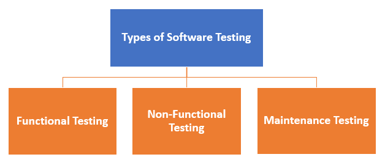
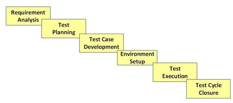
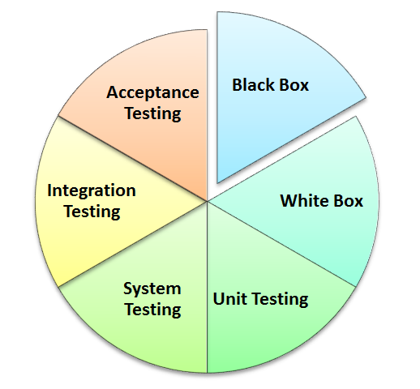

# Testing

## 测试基础知识

### 什么是软件测试?

#### 概述

**软件测试**是一种检查实际软件产品是否符合预期要求并确保软件产品无缺陷的方法。它涉及使用手动或自动化工具执行软件/系统组件以评估一个或多个感兴趣的属性。软件测试的目的是识别与实际要求相比的错误、差距或缺失的要求。

但有些人更喜欢将软件测试定义为白盒测试和黑盒测试。软件测试意味着对被测应用程序的验证。

软件测试是一种检查实际结果是否与预期结果相符并确保软件系统没有缺陷的活动。

#### 软件测试的类型

通常，测试分为三类：

- 功能测试

- 非功能测试或性能测试

- 维护（回归与维护）

#### 软件工程中的测试策略

以下是软件工程中的重要策略：

- 单元测试：程序员遵循此软件测试基本方法来测试程序的单元。它可以帮助开发人员了解代码的各个单元是否正常工作。

- 集成测试：它专注于软件的构建和设计。您需要查看集成的单元是否正常工作。

- 系统测试：在这种方法中，您的软件将作为一个整体进行编译，然后作为一个整体进行测试。此测试策略检查功能性、安全性、可移植性等。

### 软件测试的7个原则

#### 1.无法进行详尽的测试

详尽的测试是不可能的。相反，我们需要根据应用程序的风险评估进行最佳的测试量。

#### 2.缺陷聚类

**缺陷聚类**表明少数模块包含大多数检测到的缺陷。这是帕累托原则在软件测试中的应用：大约 80% 的问题出现在 20% 的模块中。

#### 3.农药悖论

在农业生产过程中，重复使用同一种农药混合物来消灭昆虫，久而久之，昆虫就会对农药产生抗药性，从而使农药对昆虫无效。

软件测试也是如此。如果进行同一套重复测试，这种方法对于发现新缺陷将毫无用处。

为了解决这个问题，需要定期审查和修改测试用例，添加新的和不同的测试用例来帮助发现更多的缺陷。

测试人员不能仅仅依赖现有的测试技术。他必须不断寻找改进现有方法的方法，使测试更有效。但即使经过这么多的测试努力，你也永远不能声称你的产品没有错误。

#### 4.测试表明存在缺陷

因此，测试原则指出——测试谈论缺陷的存在而不是缺陷的不存在。即软件测试降低了软件中存在未发现的缺陷的概率，但即使没有发现缺陷，也不能证明正确性。

#### 5.没有错误——谬误

99% 无错误的软件仍有可能无法使用。如果系统针对错误的需求进行了彻底测试，就会出现这种情况。软件测试不仅仅是发现缺陷，还要检查软件是否满足业务需求。没有错误是一种谬论，即如果系统构建不可用并且不能满足用户的需求和要求，那么发现和修复缺陷也无济于事。

#### 6.早期测试

测试应在软件开发生命周期中尽早开始。这样，在早期阶段就能发现需求或设计阶段的任何缺陷。

在测试的早期阶段修复缺陷要便宜得多。但应该多早开始测试呢？建议您在定义需求时就开始查找错误。

#### 7.测试依赖于上下文

测试依赖于上下文，这基本上意味着您测试电子商务网站的方式将不同于测试现成的商业应用程序的方式。所有开发的软件都不相同。您可能会根据应用程序类型使用不同的方法、方法论、技术和测试类型。例如，测试零售店的任何 POS 系统都与测试 ATM 机不同。

#### 误区：“原则仅供参考。我不会在实践中使用它们”

这完全是错误的。测试原则将帮助您创建有效的测试策略并起草错误捕获测试用例。

### 软件测试生命周期

#### 什么是软件测试生命周期

**软件测试生命周期** (STLC：Software Testing Life Cycle)是在测试过程中进行的一系列特定活动，以确保满足软件质量目标。

STLC 涉及验证和确认活动。与普遍看法相反，软件测试不仅仅是一项单一/孤立的活动。

即测试是由一系列以方法论方式开展的活动组成，以帮助认证您的软件产品。

#### STLC 阶段

每个软件测试生命周期模型（STLC 模型）都有以下六个主要阶段：

1. 需求分析

2. 测试计划

3. 测试用例开发

4. 测试环境设置

5. 测试执行

6. 测试周期结束

每个阶段都有明确的进入和退出标准以及与之相关的活动和可交付成果。

#### STLC 的进入和退出标准是什么

- 进入标准：进入标准给出了在开始测试之前必须完成的先决条件项目。

- 退出标准：退出标准定义了测试结束前必须完成的项目。

在理想情况下，只有满足上一阶段的退出条件后，您才会进入下一阶段。但实际上这并不总是可行的。

#### 需求阶段测试

**需求阶段测试**也称为**需求分析**，其中测试团队从测试的角度研究需求以确定可测试的需求，并且 QA 团队可以与各个利益相关者进行互动以详细了解需求。需求可以是功能性的，也可以是非功能性的。测试项目的自动化可行性也在此阶段完成。

##### 需求阶段测试中的活动

- 确定要执行的测试类型。

- 收集有关测试优先级和重点的详细信息。

- 准备需求可追溯性矩阵（RTM）。

- 确定应该进行测试的测试环境详细信息。

- 自动化可行性分析（如果需要）。

##### 需求阶段测试的交付成果

- 需求可追溯性矩阵成型。

- 自动化可行性报告。（如适用）

> 需求可追溯性矩阵 (RTM)是一种使用测试用例映射和跟踪用户需求的文档。
> 
> 需求可追溯性矩阵的主要目的是验证所有需求都通过测试用例进行了检查，以便在软件测试期间没有未检查的功能。

#### 测试计划

STLC 中的测试计划是一个阶段，高级 QA 经理在此阶段确定测试计划策略以及项目的工作量和成本估算。此外，还确定了资源、测试环境、测试限制和测试计划。测试计划在同一阶段准备和完成。

##### 测试计划活动

- 准备各类测试的测试计划/策略文件

- 测试工具选择

- 测试工作量估算

- 资源规划和确定角色和职责

- 培训要求

##### 测试计划的交付成果

- 测试计划/策略文档

- 工作量估算文件

#### 测试用例开发阶段

测试用例开发阶段涉及测试计划准备就绪后测试用例和测试脚本的创建、验证和重新编写。首先，确定测试数据，然后创建和审查，然后根据先决条件重新编写。然后，QA 团队开始为各个单元开发测试用例。

##### 测试用例开发活动

- 创建测试用例、自动化脚本（如果适用）

- 审查并确定基准测试用例和脚本

- 创建测试数据（如果测试环境可用）

##### 测试用例开发的交付成果

- 测试用例/脚本

- 测试数据

#### 测试环境设置

**测试环境设置**决定了测试工作产品的软件和硬件条件。这是测试过程的关键方面之一，可以与测试用例开发阶段同时进行。如果开发团队提供测试环境，则测试团队可能不参与此活动。测试团队需要对给定的环境进行准备情况检查（冒烟测试）。

##### 测试环境设置活动

- 了解所需的架构、环境设置并为测试环境准备硬件和软件需求列表

- 设置测试环境和测试数据

- 对构建进行烟雾测试

##### 测试环境设置的交付成果

- 环境已准备就绪，并设置了测试数据

- 烟雾测试结果

#### 测试执行阶段

**测试执行阶段**由测试人员执行，在此阶段，根据准备的测试计划和测试用例对软件构建进行测试。该过程包括测试脚本执行、测试脚本维护和错误报告。如果报告了错误，则会将其返回给开发团队进行纠正并重新进行测试。

##### 测试执行活动

- 按计划执行测试

- 记录测试结果，并记录失败案例的缺陷

- 在 RTM 中将缺陷映射到测试用例

- 重新测试缺陷修复

- 跟踪缺陷直至关闭

##### 测试执行的交付成果

- 已完成 RTM 并处于执行状态

- 测试用例已根据结果更新

- 缺陷报告

#### 测试周期结束

**测试周期收尾阶段**是测试执行的完成，涉及测试完成报告、测试完成矩阵收集和测试结果等多项活动。测试团队成员开会、讨论和分析测试成果，以确定未来必须实施的策略，从当前测试周期中吸取教训。其目的是消除未来测试周期的流程瓶颈。

##### 测试周期结束活动

- 根据时间、测试覆盖率、成本、软件、关键业务目标、质量评估周期完成标准

- 根据上述参数准备测试指标

- 记录项目学习成果

- 准备测试结束报告

- 向客户定性和定量地报告工作产品质量

- 分析测试结果，找出缺陷类型和严重程度的分布

##### 测试周期收尾的交付成果

- 测试结束报告

- 测试指标

#### STLC 阶段以及进入和退出标准

| STLC阶段     | 进入标准                                                     | 活动                                                         | 退出标准                                                     | 交付成果                                                     |
| ------------ | ------------------------------------------------------------ | ------------------------------------------------------------ | ------------------------------------------------------------ | ------------------------------------------------------------ |
| 需求分析     | 需求文档可用（功能性和非功能性） 已定义验收标准 应用程序架构文档可用 | 分析业务功能以了解业务模块和模块特定功能。识别模块中的所有交易 识别所有用户配置文件 收集用户界面/身份验证、地理分布要求 确定要执行的测试类型 收集有关测试优先级和重点的详细信息 准备需求可追溯性矩阵(RTM) 确定应该进行测试的测试环境详细信息 自动化可行性分析（如果需要） | 签署 RTM 客户签署的测试自动化可行性报告                  | 需求可追溯性矩阵成型 自动化可行性报告（如适用）          |
| 测试计划     | 需求文件需求可追溯性矩阵 测试自动化可行性文档。          | 分析各种可用的测试方法 确定最适合的方法 准备各类测试的测试计划/策略文件 测试工具选择 测试工作量估算 资源规划和确定角色和职责 | 批准的测试计划/策略文件 工作量估算文件已签署             | 测试计划/策略文档 工作量估算文件                         |
| 测试用例开发 | 需求文件 RTM 和测试计划 自动化分析报告               | 创建测试用例、测试设计、自动化脚本（适用时） 审查并确定基准测试用例和脚本 创建测试数据 | 审查并签署测试用例/脚本 审查并签署测试数据               | 测试用例/脚本 测试数据                                   |
| 测试环境设置 | 提供系统设计和架构文档 环境设置计划可用                  | 了解所需的架构、环境设置 准备硬件和软件开发需求清单 确定连接要求 准备环境设置清单 设置测试环境和测试数据 对构建进行烟雾测试 根据烟雾测试结果接受/拒绝构建 | 环境设置按照计划和清单进行 测试数据设置完成 烟雾测试成功 | 环境已准备就绪，并设置了测试数据 烟雾测试结果            |
| 测试执行     | 提供基准 RTM、测试计划、测试用例/脚本 测试环境已准备好 测试数据设置完成 需要测试的构建的单元/集成测试报告可用 | 按计划执行测试 记录测试结果，并记录失败案例的缺陷 如有必要，更新测试计划/测试用例 在 RTM 中将缺陷映射到测试用例 重新测试缺陷修复 应用程序的回归测试 跟踪缺陷直至关闭 | 所有计划的测试均已执行 记录缺陷并跟踪至关闭              | 已完成 RTM 并处于执行状态 测试用例已根据结果更新 缺陷报告 |
| 测试周期结束 | 测试已完成 测试结果已公布 缺陷日志可用               | 根据时间、测试覆盖率、成本、软件质量、关键业务目标评估周期完成标准 根据上述参数准备测试指标 记录项目学习成果 准备测试结束报告 向客户定性和定量地报告工作产品质量 分析测试结果，找出缺陷类型和严重程度的分布情况 | 客户签署测试结束报告                                         | 测试结束报告 测试指标                                    |

## 测试类型

### 手动测试

#### 什么是手动测试

手动测试是一种软件测试，其中测试用例由测试人员手动执行，不使用任何自动化工具。手动测试的目的是识别软件应用程序中的错误、问题和缺陷。手动软件测试是所有测试类型中最原始的技术，它有助于发现软件应用程序中的关键错误。

任何新应用程序都必须先进行手动测试，然后才能实现自动化测试。手动软件测试需要付出更多努力，但对于检查自动化可行性而言必不可少。手动测试概念不需要任何测试工具知识。软件测试的基本原则之一是“ 100% 自动化是不可能的”。这使得手动测试势在必行。

#### 手动测试的目标

手动测试的关键概念是确保应用程序没有错误并且符合指定的功能要求。

测试套件或用例是在测试阶段设计的，应该具有 100% 的测试覆盖率。

它还确保报告的缺陷已由开发人员修复，并且测试人员已对修复的缺陷进行了重新测试。

基本上，此测试检查系统的质量并向客户提供无缺陷的产品。

#### 手动测试的类型

上图描述了手动测试类型。事实上，任何类型的软件测试都可以手动执行，也可以使用自动化工具执行。

- 黑盒测试

- 白盒测试

- 单元测试

- 系统测试

- 集成测试

- 验收测试

#### 如何进行手动测试

1. 阅读并理解软件项目文档/指南。此外，如果可用，请研究被测应用程序 (AUT)

2. 起草测试用例，涵盖文档中提到的所有要求

3. 与团队负责人、客户（如适用）一起审查并确定测试用例的基准

4. 在 AUT 上执行测试用例

5. 报告错误

6. 一旦错误被修复，再次执行失败的测试用例以验证它们是否通过

> AUT：Application Under Test

#### 手动测试与自动化测试

| 手动测试                   | 自动化测试                                            |
|----------------------------|-------------------------------------------------------|
| 手动测试需要人工干预来执行测试。 | 自动化测试是使用工具来执行测试用例                          |
| 手动测试需要熟练劳动力、长时间并且成本高昂。 | 自动化测试节省时间、成本和人力。记录后，运行自动化测试套件会更容易 |
| 任何类型的应用程序都可以手动测试，某些测试类型（如临时测试和猴子测试）更适合手动执行。 | 自动化测试仅推荐用于稳定的系统，并且主要用于回归测试          |
| 手动测试可能会变得重复且无趣。 | 自动化测试中的自动化软件可以处理一遍又一遍执行相同测试用例的无聊部分 |

#### 自动化测试的工具

- Selenium

- QTP

- Jmeter

- Loadrunner

- TestLink

- Quality Center(ALM)

### 自动化测试

### 单元测试

### 集成测试

### 健全性测试与烟雾测试

### 回归测试

### 非功能性测试

## 测试用例开发

## 测试技术方法

## 测试管理与控制

## 缺陷

## 敏捷测试

## 测试不同的域

## 白盒测试

## 性能测试

## 高级测试主题

## 常问问题

## 测试类型 – 列表

