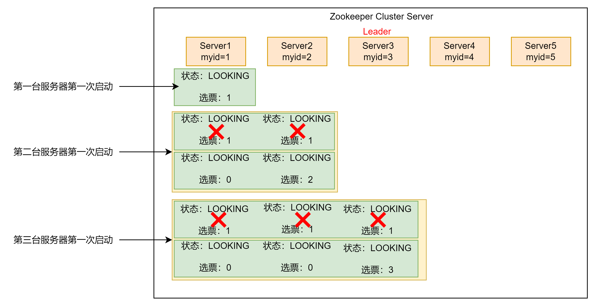
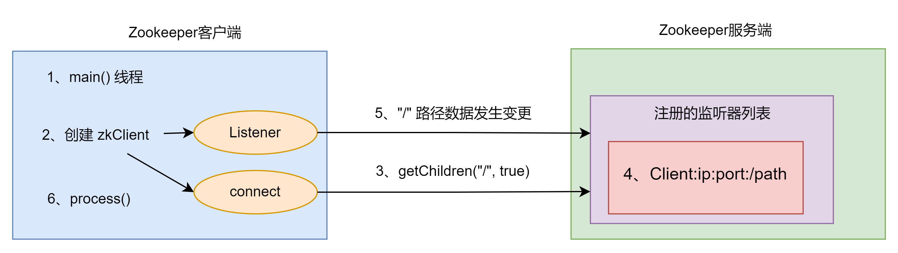
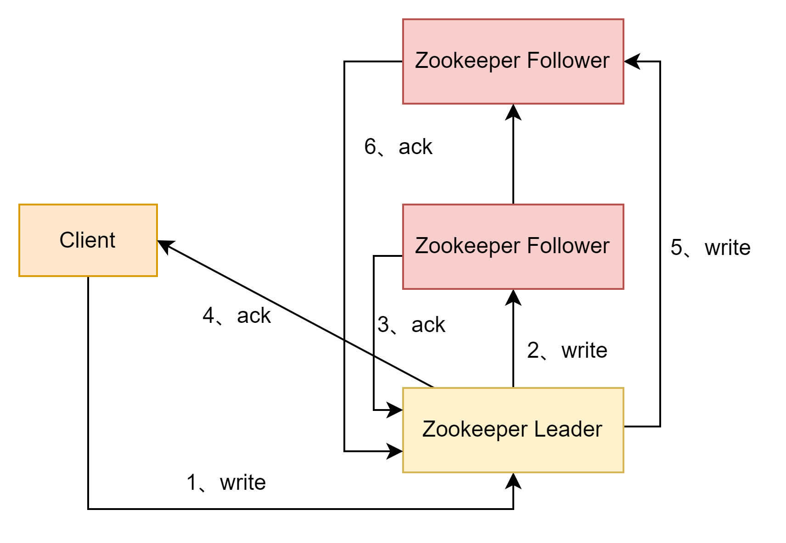
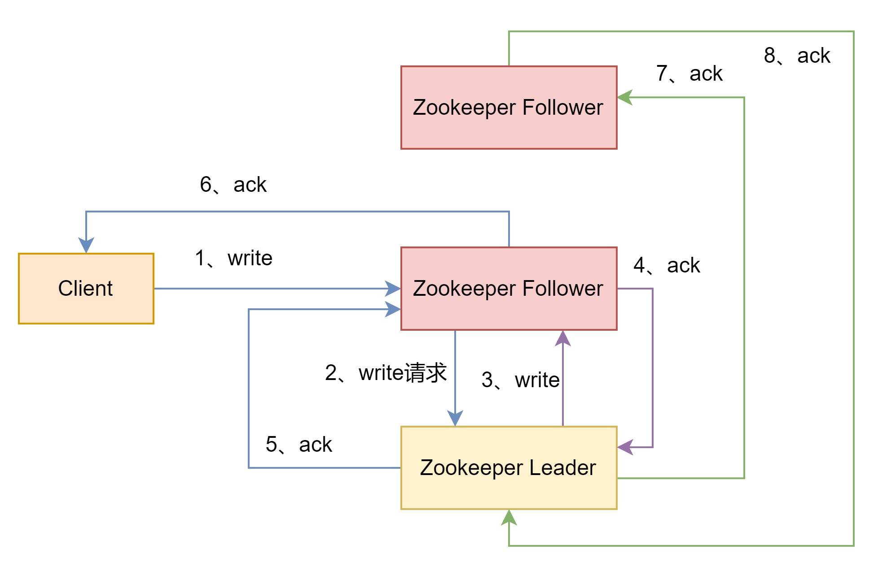

# Zookeeper

## 集群模式
`vim zoo.cfg`，增加集群节点。
```cfg
server.1=192.168.44.131:2888:3888
server.2=192.168.44.132:2888:3888
server.3=192.168.44.129:2888:3888
```
参数解读：`server.A=B:C:D`，A表示这是第几号服务器，B表示服务器地址，C表示Follower与Leader交换信息的端口，D表示执行选举时服务器相互通信的端口。

### zookeeper选举机制第一次启动


Zookeeper第一次启动总结：
1. 服务器1启动，发起一次选举。服务器1投给自己一票。此时服务器1票数为一票，发现票数不够半数（3票），选举无法完成，服务器1的状态保持为`LOOKING`。
2. 服务器2启动，发起一次选举。服务器1和2分别投给自己一票，并交换选票信息。交换选票之后服务器1发现服务器2的`myid`比自己目前投票选举的（服务器1）大，更改选票为推举服务器2。此时服务器1为0票，服务器2为2票，还是没有半数以上结果，选举无法完成，服务器1和2的状态保持`LOOKING`。
3. 服务器3启动，发起一次选举。服务器1、2和3分别投给自己一票，并交换选票信息。而此时服务器1和2都会更改选票为服务器3。`此次投票结果：服务器1为0票，服务器2为0票，服务器3为3票`。此时服务器3的票数已经超过半数，服务器3当选`Leader`。服务器1和2更改状态为`FOLLOWING`，服务器3更改状态为`LEADING`。
4. 服务器4启动，发起一次选举。此时服务器1，2，3已经不是`LOOKING`状态，不会更改选票信息。交换选票信息结果：`服务器3为3票，服务器4为1票`。此时服务器4服从多数，更改选票信息为服务器3，并更改状态为`FOLLOWING`。
5. 服务器 5启动，同4一样当`FOLLOWING`。

- SID：服务id，用来唯一标识一台Zookeeper集群中的机器，且不能重复，和myid一致。
- ZXID：事务id，用来标识依次服务状态的变更。在某一时刻，集群中的每台ZXID不一定完全一致，这和Zookeeper服务器对于客户端`更新请求`的处理逻辑有关。每次写操作都有事务id（zxid）。
- Epoch：每个Leader任期的代号。没有Leader时同一轮投票过程中的逻辑时钟时相同的，每投完一次选票这个数据就会增加。

<span style="color: red">注意：</span>两个节点各自生成各自的选票，选票就是SID、ZXID，两个节点各自选出ZXID/SID最大的，放到投票箱当中。初始化选举Leader规则：①事务id大的胜出 ；②事务id相同，服务器id大的胜出

### zookeeper选举机制非第一次启动
当Zookeeper集群中的一台服务器出现`服务器初始化启动或者服务器运行期间无法和Leader保持连接`时就会开始Leader选举。

而当一台机器开始Leader选举流程时，当前集群也可能会处于以下两种状态：
1. 集群中已经存在一个Leader：机器视图去选举Leader时，会被告知当前服务器的Leader信息，对于该机器而言，仅仅需要和Leader机器建立连接并进行状态同步即可。
2. 集群中不存在Leader：选举Leader规则：①EPOCH大的直接胜出；②EPOCH相同，事务id大的胜出；③事务id相同，服务器id大的胜出。
```txt
在某一时刻，服务器3（Leader）和服务器5出现故障，因此开始Leader选举。
SID为1、2、4的机器的（EPOCH，ZXID，SID ）情况：
    服务器1：（1，8，1）
    服务器2：（1，7，2）
    服务器4：（1，8，4） 
根据选举规则，服务器4为新的Leader
```

### 启动停止脚本
```shell
#!/bin/bash

#zookeeper节点
zookeeperServers='192.168.44.129 192.168.44.131 192.168.44.132'

case $1 in 
"start") {
	for zoo in $zookeeperServers
	do
		echo ---------- Zookeeper $zoo 启动 ----------
		ssh $zoo "/mydata/zookeeper/zookeeper-3.5.7/bin/zkServer.sh start"
	done
}
;;
case $1 in 
"stop") {
	for zoo in $zookeeperServers
	do
		echo ---------- Zookeeper $zoo 停止 ----------
		ssh $zoo "/mydata/zookeeper/zookeeper-3.5.7/bin/zkServer.sh stop"
	done
}
;;
case $1 in 
"status") {
	for zoo in $zookeeperServers
	do
		echo ---------- Zookeeper $zoo 状态 ----------
		ssh $zoo "/mydata/zookeeper/zookeeper-3.5.7/bin/zkServer.sh status"
	done
}
;;
esac
```
运行脚本期间可能会遇到两个问题：1、J`AVA_HOME`找不到路径，修改`zkEnv.sh`文件指定`JAVA_HOME`即可；2、每次ssh都需要输入密码（设置免密登录即可）。

### 客户端操作
#### 命令行语法
|   语法   |    描述  |
| ---- | ---- |
|   help   |   显式索引操作命令   |
|   ls path   |   查看当前 `znode` 的子节点 <br/>`-w` 监听子节点变化 <br/>`-s` 附加次级信息   |
|   create   |   创建 `znode` 节点 <br/>`-s` 带有序列的节点 <br/> `-e` 临时节点（重启或超时消失）  |
|   get path   |   获取节点的值 <br/> `-w` 监听节点内容变化 <br/>`-s` 附加信息   |
|   set   |   设置节点的具体值   |
|   stat   |   查看节点状态   |
|   delete   |   删除节点   |
|   deleteall   |   递归删除节点   |

#### znode节点数据信息
```txt
[zk: 192.168.44.131:2181(CONNECTED) 6] ls -s /
[zookeeper]cZxid = 0x0
# 创建节点的事务 zxid，每次修改 zk 状态都会产生一个 zk 事务id，事务id是 zk 中所有修改的总的次序。
# 每次修改都有唯一的 zxid，如果 zxid1 小于 zxid2，那么 zxid1 在 zxid2 之前发生
cZxid = 0x0

# znode 被创建的毫秒数（从1970年开始）
ctime = Thu Jan 01 08:00:00 CST 1970

# znode 最后更新的事务 zxid
mZxid = 0x0

# znode 最后修改的毫秒数（从1970年开始）
mtime = Thu Jan 01 08:00:00 CST 1970

# znode 最后更新的子节点 zxid
pZxid = 0x0

# znode 子节点版本号，znode 子节点修改次数
cversion = -1

# znode 数据版本号
dataVersion = 0

# 访问控制列表的版本号
aclVersion = 0

# 如果时临时节点，该值是 znode 拥有者的 session id。如果不是临时节点则是0
ephemeralOwner = 0x0

# znode 的数据长度
dataLength = 0

# znode 子节点数量
numChildren = 1
```

#### 节点类型
持久：客户端和服务端断开连接后，创建的节点不会删除。

临时：客户端和服务端断开连接后，创建的节点会删除。

序列：Zookeeper 给该节点名称进行顺序编号，创建 znode 时设置的顺序标识。顺序号是一个单调递增的计数器，由父节点维护。

持久节点、持久序列节点、临时节点、临时序列节点

#### 监听器及节点删除


监听器原理总结：
1. 启动 Zookeeper 客户端。
2. 在客户端启动过程中，会创建两个线程。一个辅助网络连接通信（connect），一个负责监听（listener）。
3. 通过`connect`线程将注册的监听事件发送给服务端。
4. 在服务端的注册监听器列表中将注册的监听事件添加到列表中。
5. 服务端监听到有数据或路径发生变化，就会将这个消息发送给`listener`线程。
6. `listener`线程内部调用`process()`方法。

常见的监听方式：
1. 监听节点数据的变化：`get path [watch]`
2. 监听子节点增减的变化：`ls path [watch]`

注册一次，监听一次。想再次监听，需要再次注册。

#### 客户端API

#### 客户端向服务端写数据流程
Zookeeper 遵循半数机制，集群中超过半数成功就会做出响应。

##### 客户端写请求发送给leader节点


客户端写请求发送给leader节点大概步骤：
1. 客户端向 Leader 节点发送写请求（写请求可以是创建节点、更新节点数据、删除节点等操作。）。
2. Leader 节点接收并处理写请求，Leader 节点会将事务广播给 ZooKeeper 集群中的其他 Follower 节点，以便进行数据同步。
3. Follower 节点接收到 Leader 节点广播的事务后，Follower 节点会将事务添加到自己的事务日志中，确保事务持久化到磁盘。然后 Follower 节点会向 Leader 节点发送 ACK（确认）信息。
4. Leader 节点等待大多数节点（包括自己）的 ACK。
5. 客户端收到写请求的响应。

##### 客户端写请求发送给follower节点


客户端写请求发送给follower节点大概步骤：
1. 客户端向 Follower 节点发送写请求（写请求可以是创建节点、更新节点数据、删除节点等操作。）。
2. Follower 节点收到客户端发送的写请求后，会将写请求转发给 Leader 节点，因为只有 Leader 节点才能处理写操作。
3. Leader 节点接收并处理写请求：Leader 节点收到来自 Follower 节点的写请求后，会按照`客户端写请求发送给leader节点流程的2-4步骤`处理该请求。
4. Leader 节点将响应发送给 Follower 节点。
5. Follower 节点将响应发送给客户端。

## 服务器动态上下限监听

## 分布式锁

## Zookeeper 算法 

## 源码
### 服务端初始化

### 选举机制

### 服务端Leader启动

### 服务端Follower启动

### 客户端启动

## 附录

### 本地模式

### 配置参数解读
`zoo.cfg`
```cfg
# 通信心跳时间，Zookeeper服务器与客户端心跳时间，单位毫秒。也可以是服务器与服务器之间的心跳时间
1. tickTime=2000;

# LF初始通信时限。Leader和Follower初始连接时能容忍的最多心跳数
2. initLimit=10；

# LF同步通信时限。Leader和Follower之间通信时间如果超过(syncLimit*tickTime)，Leader认为Follower宕机，从服务器列表中删除Follower。
3. syncLimit

# 保存Zookeeper中的数据
4. dataDir=/xxx/xxx.log

# 客户端连接端口
5. clientPort=2181
```

### 命令
```bin
# 启动 Zookeeper 服务器
bin/zkServer.sh start

# 查看 Zookeeper 服务器状态
bin/zkServer.sh status

# 停止 Zookeeper 服务器
bin/zkServer.sh stop

# 启动客户端
bin/zkCli.sh -server 192.168.44.131:2181

# 创建一个持久节点
[zk: 192.168.44.131:2181(CONNECTED) 0] create /address "127.0.0.1:8000"
Created /address

# 获取节点的数据
[zk: 192.168.44.131:2181(CONNECTED) 1] get /address
127.0.0.1:8000

# 获取节点的数据，包括附加信息，zxid等
[zk: 192.168.44.131:2181(CONNECTED) 2] get -s /address
127.0.0.1:8000
cZxid = 0x800000002
ctime = Sun Jun 18 13:32:17 CST 2023
mZxid = 0x800000002
mtime = Sun Jun 18 13:32:17 CST 2023
pZxid = 0x800000003
cversion = 1
dataVersion = 0
aclVersion = 0
ephemeralOwner = 0x0
dataLength = 14
numChildren = 1

# 创建持久序列节点
[zk: 192.168.44.131:2181(CONNECTED) 3] create -s /address/city/Chengdu "chengdu"   
Created /address/city/Chengdu0000000000

# 查看子节点
[zk: 192.168.44.131:2181(CONNECTED) 4] ls /
[address, zookeeper]

# 修改节点值
[zk: 192.168.44.131:2181(CONNECTED) 1] set /address "192.168.0.1:80"
[zk: 192.168.44.131:2181(CONNECTED) 2] get /address
192.168.0.1:80

# 删除节点
[zk: 192.168.44.132(CONNECTED) 7] delete /address/city/fujian

# 递归删除节点
[zk: 192.168.44.132(CONNECTED) 9] deleteall /address/city

# 查看节点状态
[zk: 192.168.44.129(CONNECTED) 5] stat /address
cZxid = 0x800000002
ctime = Sun Jun 18 13:32:17 CST 2023
mZxid = 0x80000000c
mtime = Sun Jun 18 14:38:28 CST 2023
pZxid = 0x800000012
cversion = 2
dataVersion = 2
aclVersion = 0
ephemeralOwner = 0x0
dataLength = 8
numChildren = 0
```

### 写数据原理


