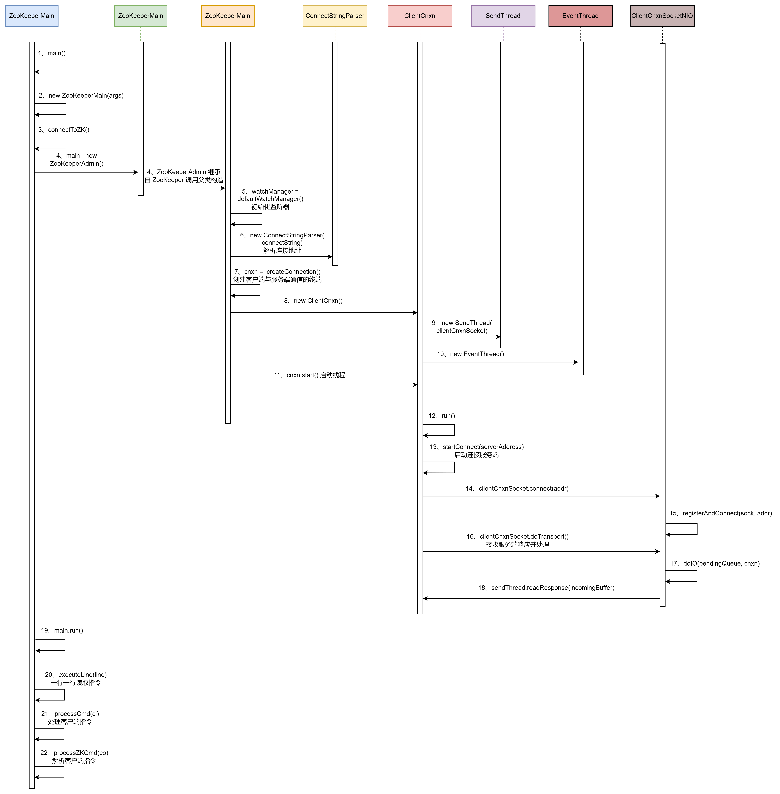

# Zookeeper

## 集群模式
`vim zoo.cfg`，增加集群节点。
```cfg
server.1=192.168.44.131:2888:3888
server.2=192.168.44.132:2888:3888
server.3=192.168.44.129:2888:3888
```
参数解读：`server.A=B:C:D`，A表示这是第几号服务器，B表示服务器地址，C表示Follower与Leader交换信息的端口，D表示执行选举时服务器相互通信的端口。

### zookeeper选举机制第一次启动


Zookeeper第一次启动总结：
1. 服务器1启动，发起一次选举。服务器1投给自己一票。此时服务器1票数为一票，发现票数不够半数（3票），选举无法完成，服务器1的状态保持为`LOOKING`。
2. 服务器2启动，发起一次选举。服务器1和2分别投给自己一票，并交换选票信息。交换选票之后服务器1发现服务器2的`myid`比自己目前投票选举的（服务器1）大，更改选票为推举服务器2。此时服务器1为0票，服务器2为2票，还是没有半数以上结果，选举无法完成，服务器1和2的状态保持`LOOKING`。
3. 服务器3启动，发起一次选举。服务器1、2和3分别投给自己一票，并交换选票信息。而此时服务器1和2都会更改选票为服务器3。`此次投票结果：服务器1为0票，服务器2为0票，服务器3为3票`。此时服务器3的票数已经超过半数，服务器3当选`Leader`。服务器1和2更改状态为`FOLLOWING`，服务器3更改状态为`LEADING`。
4. 服务器4启动，发起一次选举。此时服务器1，2，3已经不是`LOOKING`状态，不会更改选票信息。交换选票信息结果：`服务器3为3票，服务器4为1票`。此时服务器4服从多数，更改选票信息为服务器3，并更改状态为`FOLLOWING`。
5. 服务器 5启动，同4一样当`FOLLOWING`。

- SID：服务id，用来唯一标识一台Zookeeper集群中的机器，且不能重复，和myid一致。
- ZXID：事务id，用来标识依次服务状态的变更。在某一时刻，集群中的每台ZXID不一定完全一致，这和Zookeeper服务器对于客户端`更新请求`的处理逻辑有关。每次写操作都有事务id（zxid）。
- Epoch：每个Leader任期的代号。没有Leader时同一轮投票过程中的逻辑时钟时相同的，每投完一次选票这个数据就会增加。

<span style="color: red">注意：</span>两个节点各自生成各自的选票，选票就是SID、ZXID，两个节点各自选出ZXID/SID最大的，放到投票箱当中。初始化选举Leader规则：①事务id大的胜出 ；②事务id相同，服务器id大的胜出

### zookeeper选举机制非第一次启动
当Zookeeper集群中的一台服务器出现`服务器初始化启动或者服务器运行期间无法和Leader保持连接`时就会开始Leader选举。

而当一台机器开始Leader选举流程时，当前集群也可能会处于以下两种状态：
1. 集群中已经存在一个Leader：机器视图去选举Leader时，会被告知当前服务器的Leader信息，对于该机器而言，仅仅需要和Leader机器建立连接并进行状态同步即可。
2. 集群中不存在Leader：选举Leader规则：①EPOCH大的直接胜出；②EPOCH相同，事务id大的胜出；③事务id相同，服务器id大的胜出。
```txt
在某一时刻，服务器3（Leader）和服务器5出现故障，因此开始Leader选举。
SID为1、2、4的机器的（EPOCH，ZXID，SID ）情况：
    服务器1：（1，8，1）
    服务器2：（1，7，2）
    服务器4：（1，8，4） 
根据选举规则，服务器4为新的Leader
```

### 启动停止脚本
```shell
#!/bin/bash

#zookeeper节点
zookeeperServers='192.168.44.129 192.168.44.131 192.168.44.132'

case $1 in 
"start") {
	for zoo in $zookeeperServers
	do
		echo ---------- Zookeeper $zoo 启动 ----------
		ssh $zoo "/mydata/zookeeper/zookeeper-3.5.7/bin/zkServer.sh start"
	done
}
;;
case $1 in 
"stop") {
	for zoo in $zookeeperServers
	do
		echo ---------- Zookeeper $zoo 停止 ----------
		ssh $zoo "/mydata/zookeeper/zookeeper-3.5.7/bin/zkServer.sh stop"
	done
}
;;
case $1 in 
"status") {
	for zoo in $zookeeperServers
	do
		echo ---------- Zookeeper $zoo 状态 ----------
		ssh $zoo "/mydata/zookeeper/zookeeper-3.5.7/bin/zkServer.sh status"
	done
}
;;
esac
```
运行脚本期间可能会遇到两个问题：1、J`AVA_HOME`找不到路径，修改`zkEnv.sh`文件指定`JAVA_HOME`即可；2、每次ssh都需要输入密码（设置免密登录即可）。

### 客户端操作
#### 命令行语法
|   语法   |    描述  |
| ---- | ---- |
|   help   |   显式索引操作命令   |
|   ls path   |   查看当前 `znode` 的子节点 <br/>`-w` 监听子节点变化 <br/>`-s` 附加次级信息   |
|   create   |   创建 `znode` 节点 <br/>`-s` 带有序列的节点 <br/> `-e` 临时节点（重启或超时消失）  |
|   get path   |   获取节点的值 <br/> `-w` 监听节点内容变化 <br/>`-s` 附加信息   |
|   set   |   设置节点的具体值   |
|   stat   |   查看节点状态   |
|   delete   |   删除节点   |
|   deleteall   |   递归删除节点   |

#### znode节点数据信息
```txt
[zk: 192.168.44.131:2181(CONNECTED) 6] ls -s /
[zookeeper]cZxid = 0x0
# 创建节点的事务 zxid，每次修改 zk 状态都会产生一个 zk 事务id，事务id是 zk 中所有修改的总的次序。
# 每次修改都有唯一的 zxid，如果 zxid1 小于 zxid2，那么 zxid1 在 zxid2 之前发生
cZxid = 0x0

# znode 被创建的毫秒数（从1970年开始）
ctime = Thu Jan 01 08:00:00 CST 1970

# znode 最后更新的事务 zxid
mZxid = 0x0

# znode 最后修改的毫秒数（从1970年开始）
mtime = Thu Jan 01 08:00:00 CST 1970

# znode 最后更新的子节点 zxid
pZxid = 0x0

# znode 子节点版本号，znode 子节点修改次数
cversion = -1

# znode 数据版本号
dataVersion = 0

# 访问控制列表的版本号
aclVersion = 0

# 如果时临时节点，该值是 znode 拥有者的 session id。如果不是临时节点则是0
ephemeralOwner = 0x0

# znode 的数据长度
dataLength = 0

# znode 子节点数量
numChildren = 1
```

#### 节点类型
持久：客户端和服务端断开连接后，创建的节点不会删除。

临时：客户端和服务端断开连接后，创建的节点会删除。

序列：Zookeeper 给该节点名称进行顺序编号，创建 znode 时设置的顺序标识。顺序号是一个单调递增的计数器，由父节点维护。

持久节点、持久序列节点、临时节点、临时序列节点

#### 监听器及节点删除


监听器原理总结：
1. 启动 Zookeeper 客户端。
2. 在客户端启动过程中，会创建两个线程。一个辅助网络连接通信（connect），一个负责监听（listener）。
3. 通过`connect`线程将注册的监听事件发送给服务端。
4. 在服务端的注册监听器列表中将注册的监听事件添加到列表中。
5. 服务端监听到有数据或路径发生变化，就会将这个消息发送给`listener`线程。
6. `listener`线程内部调用`process()`方法。

常见的监听方式：
1. 监听节点数据的变化：`get path [watch]`
2. 监听子节点增减的变化：`ls path [watch]`

注册一次，监听一次。想再次监听，需要再次注册。但是不会对二级子节点进行监听

#### 客户端API

### 写数据原理
客户端向服务端写数据流程：Zookeeper 遵循半数机制，集群中超过半数成功就会做出响应。

##### 客户端写请求发送给leader节点


客户端写请求发送给leader节点大概步骤：
1. 客户端向 Leader 节点发送写请求（写请求可以是创建节点、更新节点数据、删除节点等操作。）。
2. Leader 节点接收并处理写请求，Leader 节点会将事务广播给 ZooKeeper 集群中的其他 Follower 节点，以便进行数据同步。
3. Follower 节点接收到 Leader 节点广播的事务后，Follower 节点会将事务添加到自己的事务日志中，确保事务持久化到磁盘。然后 Follower 节点会向 Leader 节点发送 ACK（确认）信息。
4. Leader 节点等待大多数节点（包括自己）的 ACK。
5. 客户端收到写请求的响应。

##### 客户端写请求发送给follower节点


客户端写请求发送给follower节点大概步骤：
1. 客户端向 Follower 节点发送写请求（写请求可以是创建节点、更新节点数据、删除节点等操作。）。
2. Follower 节点收到客户端发送的写请求后，会将写请求转发给 Leader 节点，因为只有 Leader 节点才能处理写操作。
3. Leader 节点接收并处理写请求：Leader 节点收到来自 Follower 节点的写请求后，会按照`客户端写请求发送给leader节点流程的2-4步骤`处理该请求。
4. Leader 节点将响应发送给 Follower 节点。
5. Follower 节点将响应发送给客户端。

## 服务器动态上下限监听

基本思路就是：服务器上限则创建临时节点，客户端监听父节点中子节点的变化。服务器下线时临时节点也会删除，watcher 也会通知 客户端，服务器下线了。

## 分布式锁


zookeeper分布式锁流程：
1. 客户端连接 zookeeper 集群，并创建临时序列节点。
2. 判断自己创建的节点是不是当前节点下最小序列的节点：
    1. 是，获取到锁。
    2. 不是，对前一个节点进行监听。
3. 获取到锁，处理完业务后，delete删除节点释放锁。
4. 然后其他发起监听的客户端会判断释放的节点是不是自己前一个节点，如果是则唤醒当前节点，否则继续阻塞。

- 分布式共享锁实现
```java
import org.apache.curator.RetryPolicy;
import org.apache.curator.framework.CuratorFramework;
import org.apache.curator.framework.CuratorFrameworkFactory;
import org.apache.curator.framework.recipes.cache.*;
import org.apache.curator.retry.ExponentialBackoffRetry;
import org.apache.zookeeper.CreateMode;
import org.apache.zookeeper.ZooDefs;
import org.apache.zookeeper.data.Stat;

import java.util.Collections;
import java.util.List;
import java.util.Objects;
import java.util.concurrent.CountDownLatch;

/**
 * @author cristina
 */
public class DistributedLock {

    private final String connectString = "192.168.44.131:2181,192.168.44.132:2181,192.168.44.129:2181";
    private final CuratorFramework client;
    private final CountDownLatch waitLatch = new CountDownLatch(1);
    private final String rootPath = "/locks";
    private String waitPath;
    private static final String DISTRIBUTED_LOCK = "seq-";
    private String currentNode;
    /**
     * ExponentialBackoffRetry：重试3次，每次间隔1秒
     */
    RetryPolicy retryPolicy = new ExponentialBackoffRetry(1000, 3);

    public DistributedLock() {
        client = CuratorFrameworkFactory.newClient(connectString, retryPolicy);
        client.start();

        // 监听根节点路径变化
        listenerChildrenNode(rootPath);

        try {
            // 如果根节点不存在则创建
            Stat stat = client.checkExists().forPath(rootPath);
            if (Objects.isNull(stat)) {
                client.create()
                        .creatingParentsIfNeeded()
                        .withMode(CreateMode.PERSISTENT)
                        .withACL(ZooDefs.Ids.OPEN_ACL_UNSAFE)
                        .forPath(rootPath, "locks".getBytes());
            }
        } catch (Exception e) {
            e.printStackTrace();
        }
    }

    public void lock() {
        try {
            // 创建临时序列接待你
            currentNode = client.create()
                    .creatingParentsIfNeeded()
                    .withMode(CreateMode.EPHEMERAL_SEQUENTIAL)
                    .withACL(ZooDefs.Ids.OPEN_ACL_UNSAFE)
                    .forPath(String.format("%s/%s", rootPath, DISTRIBUTED_LOCK));

            // 获取根节点的所有子节点
            List<String> childrenNode = client.getChildren().forPath(rootPath);

            if (childrenNode.size() == 1) {
                // have no competition.
                return;
            }
            Collections.sort(childrenNode);
            String node = currentNode.substring("/locks/".length());
            int index = childrenNode.indexOf(node);

            if (index == 0) {
                // have no competition.
                return;
            }
            // 监听前一个节点
            waitPath = String.format("%s/%s", rootPath, childrenNode.get(index - 1));
            // 阻塞
            waitLatch.await();
        } catch (Exception e) {
            e.printStackTrace();
        }
    }

    public void unlock() {
        try {
            client.delete().deletingChildrenIfNeeded().withVersion(-1).forPath(currentNode);
        } catch (Exception e) {
            e.printStackTrace();
        }
    }

    public void listenerChildrenNode(String path) {
        try {
            TreeCache cache = new TreeCache(client, path);
            cache.getListenable().addListener(new TreeCacheListener() {
                @Override
                public void childEvent(CuratorFramework curatorFramework, TreeCacheEvent event) throws Exception {
                    // 排除不关心的事件
                    if (Objects.isNull(event.getData())) {
                        return;
                    }
                    if (event.getType() == TreeCacheEvent.Type.NODE_REMOVED) {
                        // 当前节点为阻塞状态，只有当前节点的前一个序列节点释放后，当前节点才会被唤醒
                        if (event.getData().getPath().equals(waitPath)) {
                            waitLatch.countDown();
                            System.out.println("remove: " + event.getData().getPath());
                        }
                    }
                }
            });
            cache.start();
        } catch (Exception e) {
            e.printStackTrace();
        }
    }
}
```

Curator 客户端提供一个`InterProcessMutex`排他锁。省去造轮子的过程。
## Zookeeper 算法 
### paxos 算法
paxos 算法是一种居于消息传递且具有高度容错性的一致性算法。

paxos 算法所解决的问题就是如何快速正确的在分布式系统中对某个数据值达成一致，并且保证不论发生任何异常，都不会破坏整个系统的一致性。


在一个Paxos系统中，首先将所有节点划分为Proposer（提议者）、Acceptor（接收者）和Learner（学习者）。且每个节点都可以有多个角色。

Paxos算法流程分为三个阶段：
1. Prepare准备阶段
   1. Proposer向多个Acceptor发出Propose请求Promise。
   2. Acceptor针对接收到的Propose请求进行Promise。
2. Accept接收阶段
   1. Proposer接收到多数Acceptor的Promise后，向Acceptor发出Propose请求。
   2. Acceptor针对接收到的Propose请求进行Accept处理。
3. Learn学习阶段：Proposer将表决的决议发送给所有Learners。


1. Prepare：`Proposer`生成全局唯一且递增的`Proposal ID`，向所有`Acceptor`发送`Propose`请求，无需携带提案内容，只携带`Proposal ID`即可。
2. Promise：`Acceptor`收到`Propose`请求后，做出`两个承诺，一个应答`。
   1. 不再接受`Proposal ID`小于等于当前请求的Propose请求。
   2. 不再接受`Proposal ID`小于当前请求的Accept请求。
   3. 不违背以前做出的`Promise`承诺下，响应已经`Accept`过的提案中`Proposal ID`最大的哪个提案的`Value`和`Proposal ID`，没有则返回 null。（Acceptor Promise）
3. Propose：`Proposer`收到多数`Acceptor`的`Promise`应答后，从应答中选择`Proposal ID`最大的提案的`Value`，作为 本次要发起的提案。如果所有应答的提案`Value`都为null，则可以自己指定提案`Value`。然后携带当前`Proposal ID`，向所有`Acceptor`发送`Propose`请求。
4. Accept：`Acceptor`收到`Propose`请求后，在不违背之前做出的承诺下，接受并持久化当前`Proposal ID`和提案`Value`。
5. Learn：`Proposer`收到多数`Acceptor`的`Accept`后，决议形成，将决议发送给所有`Learner`。

### ZAB 协议
ZAB协议借鉴了Paxos算法，是专门为Zookeeper设计的支持崩溃恢复的原子广播协议。基于该协议，Zookeeper设计为只有一台客户端（Leader）负责处理外部的写事务请求，然后Leader客户端将数据同步到其他Follower节点。在Zookeeper中只有一个Leader可以发起提案。

zab协议包括两种基本模式：消息广播、崩溃恢复。

#### 消息广播


消息广播总结：
1. 客户端发起一个写操作请求。
2. `Leader`服务器将客户端的请求转化为事务`Proposal`提案，同时为每个`Proposal`分配一个全局的ID，即zxid。
3. `Leader`服务器会为每个`Follower`服务器都分配一个队列，然后将需要广播的`Proposal`依次放到队列中，并且根据`FIFO`策略进行消息发送。
4. `Follower`接收到`Proposal`后，首先会将其以事务日志的方式写入本地磁盘中，写入成功后向`Leader`响应一个`Ack`消息。
5. `Leader`接收到超过半数以上`Follower`的`Ack`响应消息后（包括Leader自身），即认为消息发送成功，可以发送`commit`消息。
6. `Leader`向所有`Follower`广播`commit`消息，同时`Leader`也会完成事务提交。`Follower`接收到`commit`消息后，会将上一条事务提交。

Zookeeper采用Zab协议的核心，就是只要有一台服务器提交了Proposal，就要确保所有的服务器最终都能正确提交Proposal。

个人理解：Proposal可以理解为客户端的一次写操作（创建节点、修改节点、删除节点等），只有Leader有写操作权限，所以由Leader将操作具体内容（创建节点、修改节点、删除节点等）广播给Follower。提交事务就是将数据永久持久化到磁盘中。

ZAB协议针对事务请求的处理过程类似于两阶段提交过程：
1. 广播事务阶段。
2. 广播提交操作。

两阶段提交有可能会因为Leader宕机带来数据不一致。如：
1. Leader发起一个事务Proposal后宕机了，Follower来不及Proposal。
2. Leader收到半数ACK后宕机，来不及向Follower发送commit；

一旦Leader服务器与过半Follower失去联系，那么就会进入崩溃恢复模式。
#### 崩溃恢复


假设异常情况：
1. 一个事务在Leader提出之后，Leader宕机。
2. 一个事务在Leader提交后，且过半的Follower都响应Ack了，但是Leader在commit消息发出之前宕机。

Zab协议崩溃恢复需要满足以下两个要求：
1. 确保已经被Leader提交的提案Proposal，必须最终被所有的Follower服务器提交。（已经产生的提案，Follower必须执行）
2. 确保丢弃已经被Leader提出，但是还没有被提交的Proposal。

崩溃恢复主要包括两部分：Leader选举、数据恢复。
#####　Leader选举


Zab协议需要保证选举出来的Leader满足以下条件：
1. 新选举的Leader不能包含未提交的Proposal。（新Leader必须都是已经提交了Proposal的Follower节点（Ack））
2. 新选举的Leader节点中是最大的zxid。（可以避免Leader服务器检查Proposal的提交和丢弃工作）
#####　数据恢复


Zab数据同步：
1. 完成Leader选举后，在正式开始工作之前（即接收事务请求，然后提出新的Proposal），Leader会先确认事务日志中的所有Proposal是否已经被集群中过半的服务器commit。
2. Leader需要确保所有的Follower服务器能够接收到每一条事务的Proposal，并且能够将所有已提交的事务Proposal应用到内存数据中。等到Follower将所有尚未同步的事务Proposal都从Leader上同步，并且应用到内存数据中后，Leader才会把该Follower加入到真正可用的Follower列表中。

### CAP理论
1. 一致性（Consistency）：指数据在多个副本之间是否能够保持数据一致的特性。在一致性的需求下，当一个系统在数据一致性的状态下执行变更操作后，应该保证系统的数据仍处于一致的状态。
2. 可用性（Available）：指系统提供的服务必须一直处于可用状态。对于用户的每一次操作请求总能在有限时间内返回结果。
3. 分区容错性（Partition Tolerance）：指在遇到任何网络分区故障时，仍然需要能够保证对外提供满足一致性和可用性的服务。除非整个网络环境都出现故障。

Zookeeper保证的是CP：
1. Zookeeper不能保证每次服务请求的可用性。（在极端情况下，Zookeeper可能会丢弃以下请求，消费者需要重新请求才能获得结果）
2. Leader选举时集群都是不可用。

一个分布式系统不可能同时满足这三个。最多只能同时满足两个，P是必须的，CP或者AP。

## 源码
### 持久化源码
Leader和Follower的数据会在内存和磁盘中各保存一份，素以需要将内存中的数据持久化到磁盘中。

在` org.apache.zookeeper.server.persistence`包下的都是和序列化相关的代码。


等到服务器空闲时会将内存数据写入到`TxnLog编辑日志`，再从`TxnLog编辑日志`写入到`snapShot快照`（磁盘）。

#### 快照
```java
public interface SnapShot {
    
    // 反序列化
    long deserialize(DataTree dt, Map<Long, Integer> sessions) 
        throws IOException;
    
    // 序列化
    void serialize(DataTree dt, Map<Long, Integer> sessions, 
            File name) 
        throws IOException;
    
    // 查找最近的快照文件
    File findMostRecentSnapshot() throws IOException;
    
    // 释放资源
    void close() throws IOException;
}
```
#### 操作日志
```java
public interface TxnLog {
    // 设置监控 fsync 的阈值
    void setServerStats(ServerStats serverStats);
    
    // 回滚日志
    void rollLog() throws IOException;
    // 追加日志
    boolean append(TxnHeader hdr, Record r) throws IOException;

    // 读取日志
    TxnIterator read(long zxid) throws IOException;
    
    // 获取事务id
    long getLastLoggedZxid() throws IOException;
    
    // 删除日志
    boolean truncate(long zxid) throws IOException;
    
    // 获取此事务日志的 dbid
    long getDbId() throws IOException;
    
    // 提交
    void commit() throws IOException;

    // 事务日志运行的同步时间(以毫秒为单位)
    long getTxnLogSyncElapsedTime();
   
    // 释放资源
    void close() throws IOException;
    
    // 用于读取事务日志的迭代接口
    public interface TxnIterator {
        TxnHeader getHeader();
        Record getTxn();
        boolean next() throws IOException;
        void close() throws IOException;
        long getStorageSize() throws IOException;
    }
}
```

### 序列化源码
`zookeeper-jute`是关于Zookeeper序列化相关源码。
```java
// 序列化实现 OutputArchive 接口
// 反序列化实现 InputArchive 接口

public interface Record {
    public void serialize(OutputArchive archive, String tag)
        throws IOException;
    public void deserialize(InputArchive archive, String tag)
        throws IOException;
}

public interface OutputArchive {
    public void writeByte(byte b, String tag) throws IOException;
    public void writeBool(boolean b, String tag) throws IOException;
    public void writeInt(int i, String tag) throws IOException;
    public void writeLong(long l, String tag) throws IOException;
    public void writeFloat(float f, String tag) throws IOException;
    public void writeDouble(double d, String tag) throws IOException;
    public void writeString(String s, String tag) throws IOException;
    public void writeBuffer(byte buf[], String tag)
        throws IOException;
    public void writeRecord(Record r, String tag) throws IOException;
    public void startRecord(Record r, String tag) throws IOException;
    public void endRecord(Record r, String tag) throws IOException;
    public void startVector(List<?> v, String tag) throws IOException;
    public void endVector(List<?> v, String tag) throws IOException;
    public void startMap(TreeMap<?,?> v, String tag) throws IOException;
    public void endMap(TreeMap<?,?> v, String tag) throws IOException;

}

public interface InputArchive {
    public byte readByte(String tag) throws IOException;
    public boolean readBool(String tag) throws IOException;
    public int readInt(String tag) throws IOException;
    public long readLong(String tag) throws IOException;
    public float readFloat(String tag) throws IOException;
    public double readDouble(String tag) throws IOException;
    public String readString(String tag) throws IOException;
    public byte[] readBuffer(String tag) throws IOException;
    public void readRecord(Record r, String tag) throws IOException;
    public void startRecord(String tag) throws IOException;
    public void endRecord(String tag) throws IOException;
    public Index startVector(String tag) throws IOException;
    public void endVector(String tag) throws IOException;
    public Index startMap(String tag) throws IOException;
    public void endMap(String tag) throws IOException;
}
```

### 1、服务端初始化


#### 启动脚本
```shell
# zkServer.sh
if [ -e "$ZOOBIN/../libexec/zkEnv.sh" ]; then
  . "$ZOOBINDIR"/../libexec/zkEnv.sh
else
  . "$ZOOBINDIR"/zkEnv.sh
fi

if [ "x$JMXDISABLE" = "x" ] || [ "$JMXDISABLE" = 'false' ]
then
  echo "ZooKeeper JMX enabled by default" >&2
  if [ "x$JMXPORT" = "x" ]
  then
    # for some reason these two options are necessary on jdk6 on Ubuntu
    #   accord to the docs they are not necessary, but otw jconsole cannot
    #   do a local attach
    ZOOMAIN="-Dcom.sun.management.jmxremote -Dcom.sun.management.jmxremote.local.only=$JMXLOCALONLY org.apache.zookeeper.server.quorum.QuorumPeerMain"
  else
    if [ "x$JMXAUTH" = "x" ]
    then
      JMXAUTH=false
    fi
    if [ "x$JMXSSL" = "x" ]
    then
      JMXSSL=false
    fi
    if [ "x$JMXLOG4J" = "x" ]
    then
      JMXLOG4J=true
    fi
    echo "ZooKeeper remote JMX Port set to $JMXPORT" >&2
    echo "ZooKeeper remote JMX authenticate set to $JMXAUTH" >&2
    echo "ZooKeeper remote JMX ssl set to $JMXSSL" >&2
    echo "ZooKeeper remote JMX log4j set to $JMXLOG4J" >&2
    ZOOMAIN="-Dcom.sun.management.jmxremote -Dcom.sun.management.jmxremote.port=$JMXPORT -Dcom.sun.management.jmxremote.authenticate=$JMXAUTH -Dcom.sun.management.jmxremote.ssl=$JMXSSL -Dzookeeper.jmx.log4j.disable=$JMXLOG4J org.apache.zookeeper.server.quorum.QuorumPeerMain"
  fi
else
    echo "JMX disabled by user request" >&2
    ZOOMAIN="org.apache.zookeeper.server.quorum.QuorumPeerMain"
 fi
 
 if [ "x$2" != "x" ]
then
    ZOOCFG="$ZOOCFGDIR/$2"
fi
    
# ... ...
case $1 in
start)
    echo  -n "Starting zookeeper ... "
    if [ -f "$ZOOPIDFILE" ]; then
      if kill -0 `cat "$ZOOPIDFILE"` > /dev/null 2>&1; then
         echo $command already running as process `cat "$ZOOPIDFILE"`.
         exit 1
      fi
    fi
    nohup "$JAVA" $ZOO_DATADIR_AUTOCREATE "-Dzookeeper.log.dir=${ZOO_LOG_DIR}" \
    "-Dzookeeper.log.file=${ZOO_LOG_FILE}" "-Dzookeeper.root.logger=${ZOO_LOG4J_PROP}" \
    -XX:+HeapDumpOnOutOfMemoryError -XX:OnOutOfMemoryError='kill -9 %p' \
    -cp "$CLASSPATH" $JVMFLAGS $ZOOMAIN "$ZOOCFG" > "$_ZOO_DAEMON_OUT" 2>&1 < /dev/null &
 ;;
# $ZOOMAIN="org.apache.zookeeper.server.quorum.QuorumPeerMain"
# $ZOOCFG 在 zkEnv.sh 文件中 = filepath/zoo.cfg

# zkEnv.sh
if [ "x$ZOOCFG" = "x" ]
then
    ZOOCFG="zoo.cfg"
fi

ZOOCFG="$ZOOCFGDIR/$ZOOCFG"
```

所以Zookeeper服务端的入口是`org.apache.zookeeper.server.quorum.QuorumPeerMain#main`。
#### 解析配置文件
1. `org.apache.zookeeper.server.quorum.QuorumPeerConfig#parse`
```java
public void parse(String path) throws ConfigException {
  LOG.info("Reading configuration from: " + path);
 
  try {
      // 获取文件路径
      File configFile = (new VerifyingFileFactory.Builder(LOG)
          .warnForRelativePath()
          .failForNonExistingPath()
          .build()).create(path);
          
      Properties cfg = new Properties();
      
      // IO流的形式读取配置文件
      FileInputStream in = new FileInputStream(configFile);
      try {
          // 加载配置文件的内容
          cfg.load(in);
          configFileStr = path;
      } finally {
          in.close();
      }
      
      // 解析zoo.cfg
      parseProperties(cfg);
  } catch (IOException e) {
      throw new ConfigException("Error processing " + path, e);
  } catch (IllegalArgumentException e) {
      throw new ConfigException("Error processing " + path, e);
  }   
  
  // 省略部分代码 .. 动态配置文件 ...
}
```
2. `org.apache.zookeeper.server.quorum.QuorumPeerConfig#parseProperties`
```java
public void parseProperties(Properties zkProp)
    throws IOException, ConfigException {
        int clientPort = 0;
        int secureClientPort = 0;
        String clientPortAddress = null;
        String secureClientPortAddress = null;
        VerifyingFileFactory vff = new VerifyingFileFactory.Builder(LOG).warnForRelativePath().build();
        
        // zoo.cfg 能够配置的所有配置项，遍历 Properties
        for (Entry<Object, Object> entry : zkProp.entrySet()) {
            String key = entry.getKey().toString().trim();
            String value = entry.getValue().toString().trim();
            if (key.equals("dataDir")) {
                dataDir = vff.create(value);
            } else if (key.equals("dataLogDir")) {
                dataLogDir = vff.create(value);
            } else if (key.equals("clientPort")) {
                clientPort = Integer.parseInt(value);
            } else if (key.equals("localSessionsEnabled")) {
                localSessionsEnabled = Boolean.parseBoolean(value);
            } else if (key.equals("localSessionsUpgradingEnabled")) {
                localSessionsUpgradingEnabled = Boolean.parseBoolean(value);
            } else if (key.equals("clientPortAddress")) {
                clientPortAddress = value.trim();
            } else if (key.equals("secureClientPort")) {
                secureClientPort = Integer.parseInt(value);
            } else if (key.equals("secureClientPortAddress")){
                secureClientPortAddress = value.trim();
            } else if (key.equals("tickTime")) {
                tickTime = Integer.parseInt(value);
            } else if (key.equals("maxClientCnxns")) {
                maxClientCnxns = Integer.parseInt(value);
            } else if (key.equals("minSessionTimeout")) {
                minSessionTimeout = Integer.parseInt(value);
            } else if (key.equals("maxSessionTimeout")) {
                maxSessionTimeout = Integer.parseInt(value);
            } else if (key.equals("initLimit")) {
                initLimit = Integer.parseInt(value);
            } else if (key.equals("syncLimit")) {
                syncLimit = Integer.parseInt(value);
            } else if (key.equals("electionAlg")) {
                electionAlg = Integer.parseInt(value);
            } else if (key.equals("quorumListenOnAllIPs")) {
                quorumListenOnAllIPs = Boolean.parseBoolean(value);
            } else if (key.equals("peerType")) {
                if (value.toLowerCase().equals("observer")) {
                    peerType = LearnerType.OBSERVER;
                } else if (value.toLowerCase().equals("participant")) {
                    peerType = LearnerType.PARTICIPANT;
                } else
                {
                    throw new ConfigException("Unrecognised peertype: " + value);
                }
            } else if (key.equals( "syncEnabled" )) {
                syncEnabled = Boolean.parseBoolean(value);
            } else if (key.equals("dynamicConfigFile")){
                dynamicConfigFileStr = value;
            } else if (key.equals("autopurge.snapRetainCount")) {
                snapRetainCount = Integer.parseInt(value);
            } else if (key.equals("autopurge.purgeInterval")) {
                purgeInterval = Integer.parseInt(value);
            } else if (key.equals("standaloneEnabled")) {
                if (value.toLowerCase().equals("true")) {
                    setStandaloneEnabled(true);
                } else if (value.toLowerCase().equals("false")) {
                    setStandaloneEnabled(false);
                } else {
                    throw new ConfigException("Invalid option " + value + " for standalone mode. Choose 'true' or 'false.'");
                }
            } else if (key.equals("reconfigEnabled")) {
                if (value.toLowerCase().equals("true")) {
                    setReconfigEnabled(true);
                } else if (value.toLowerCase().equals("false")) {
                    setReconfigEnabled(false);
                } else {
                    throw new ConfigException("Invalid option " + value + " for reconfigEnabled flag. Choose 'true' or 'false.'");
                }
            } else if (key.equals("sslQuorum")){
                sslQuorum = Boolean.parseBoolean(value);
            } else if (key.equals("portUnification")){
                shouldUsePortUnification = Boolean.parseBoolean(value);
            } else if (key.equals("sslQuorumReloadCertFiles")) {
                sslQuorumReloadCertFiles = Boolean.parseBoolean(value);
            } else if ((key.startsWith("server.") || key.startsWith("group") || key.startsWith("weight")) && zkProp.containsKey("dynamicConfigFile")) {
                throw new ConfigException("parameter: " + key + " must be in a separate dynamic config file");
            } else if (key.equals(QuorumAuth.QUORUM_SASL_AUTH_ENABLED)) {
                quorumEnableSasl = Boolean.parseBoolean(value);
            } else if (key.equals(QuorumAuth.QUORUM_SERVER_SASL_AUTH_REQUIRED)) {
                quorumServerRequireSasl = Boolean.parseBoolean(value);
            } else if (key.equals(QuorumAuth.QUORUM_LEARNER_SASL_AUTH_REQUIRED)) {
                quorumLearnerRequireSasl = Boolean.parseBoolean(value);
            } else if (key.equals(QuorumAuth.QUORUM_LEARNER_SASL_LOGIN_CONTEXT)) {
                quorumLearnerLoginContext = value;
            } else if (key.equals(QuorumAuth.QUORUM_SERVER_SASL_LOGIN_CONTEXT)) {
                quorumServerLoginContext = value;
            } else if (key.equals(QuorumAuth.QUORUM_KERBEROS_SERVICE_PRINCIPAL)) {
                quorumServicePrincipal = value;
            } else if (key.equals("quorum.cnxn.threads.size")) {
                quorumCnxnThreadsSize = Integer.parseInt(value);
            } else {
                System.setProperty("zookeeper." + key, value);
            }
        }
        // ... 省略部分代码，检查配置参数是否合法
        
        // backward compatibility - dynamic configuration in the same file as
        // static configuration params see writeDynamicConfig()
        if (dynamicConfigFileStr == null) {
            
            // 解析 myid、初始化 ClientPort 等信息
            setupQuorumPeerConfig(zkProp, true);
            if (isDistributed() && isReconfigEnabled()) {
                // we don't backup static config for standalone mode.
                // we also don't backup if reconfig feature is disabled.
                backupOldConfig();
            }
        }
    }
```
3. `org.apache.zookeeper.server.quorum.QuorumPeerConfig#setupQuorumPeerConfig`
```java
void setupQuorumPeerConfig(Properties prop, boolean configBackwardCompatibilityMode)
      throws IOException, ConfigException {
  quorumVerifier = parseDynamicConfig(prop, electionAlg, true, configBackwardCompatibilityMode);
  
  // 服务id 就是 myid
  setupMyId();
  setupClientPort();
  setupPeerType();
  checkValidity();
}

private void setupMyId() throws IOException {
  File myIdFile = new File(dataDir, "myid");
  // standalone server doesn't need myid file.
  if (!myIdFile.isFile()) {
      return;
  }
  BufferedReader br = new BufferedReader(new FileReader(myIdFile));
  String myIdString;
  try {
      myIdString = br.readLine();
  } finally {
      br.close();
  }
  try {
      // myid 赋值给 serverId
      serverId = Long.parseLong(myIdString);
      MDC.put("myid", myIdString);
  } catch (NumberFormatException e) {
      throw new IllegalArgumentException("serverid " + myIdString
              + " is not a number");
  }
}
```
主脉络的流程就分析完了。

#### 删除过期快照
1. `org.apache.zookeeper.server.DatadirCleanupManager#start`
```java
// config.getSnapRetainCount() 默认=3，config.getPurgeInterval() 默认=0
// DatadirCleanupManager purgeMgr = new DatadirCleanupManager(config.getDataDir(), config.getDataLogDir(), config.getSnapRetainCount(), config.getPurgeInterval());
// purgeMgr.start();

public void start() {
  // 如果清理任务正在执行中，返回
  if (PurgeTaskStatus.STARTED == purgeTaskStatus) {
      LOG.warn("Purge task is already running.");
      return;
  }
  // 默认关闭
  if (purgeInterval <= 0) {
      LOG.info("Purge task is not scheduled.");
      return;
  }

  // 创建定时任务，交给线程池来处理 删除过期快照，每隔 purgeInterval 小时检查一次
  timer = new Timer("PurgeTask", true);
  TimerTask task = new PurgeTask(dataLogDir, snapDir, snapRetainCount);
  timer.scheduleAtFixedRate(task, 0, TimeUnit.HOURS.toMillis(purgeInterval));

  purgeTaskStatus = PurgeTaskStatus.STARTED;
}

static class PurgeTask extends TimerTask {
  private File logsDir;
  private File snapsDir;
  private int snapRetainCount;

  public PurgeTask(File dataDir, File snapDir, int count) {
      logsDir = dataDir;
      snapsDir = snapDir;
      snapRetainCount = count;
  }

  @Override
  public void run() {
      LOG.info("Purge task started.");
      try {
          // 清除过期快照
          PurgeTxnLog.purge(logsDir, snapsDir, snapRetainCount);
      } catch (Exception e) {
          LOG.error("Error occurred while purging.", e);
      }
      LOG.info("Purge task completed.");
  }
}
```
简单看一下`PurgeTxnLog.purge()`源码：
```java
public static void purge(File dataDir, File snapDir, int num) throws IOException {
   // 最少保留3个快照
  if (num < 3) {
      throw new IllegalArgumentException(COUNT_ERR_MSG);
  }

  // 默认生成的文件夹名字是version-2
  FileTxnSnapLog txnLog = new FileTxnSnapLog(dataDir, snapDir);

  // 获取指定数量的快照
  List<File> snaps = txnLog.findNRecentSnapshots(num);
  int numSnaps = snaps.size();
  if (numSnaps > 0) {
      purgeOlderSnapshots(txnLog, snaps.get(numSnaps - 1));
  }
}
```
主脉络的流程就分析完了。

#### 通信初始化
1. `org.apache.zookeeper.server.ServerCnxnFactory#createFactory()`
```java
static public ServerCnxnFactory createFactory() throws IOException {
  // 默认就是 NIOServerCnxnFactory
  String serverCnxnFactoryName =
      System.getProperty(ZOOKEEPER_SERVER_CNXN_FACTORY);
  if (serverCnxnFactoryName == null) {
      serverCnxnFactoryName = NIOServerCnxnFactory.class.getName();
  }
  try {
      
      // 创建 NIOServerCnxnFactory
      ServerCnxnFactory serverCnxnFactory = (ServerCnxnFactory) Class.forName(serverCnxnFactoryName)
              .getDeclaredConstructor().newInstance();
      LOG.info("Using {} as server connection factory", serverCnxnFactoryName);
      return serverCnxnFactory;
  } catch (Exception e) {
      IOException ioe = new IOException("Couldn't instantiate "
              + serverCnxnFactoryName);
      ioe.initCause(e);
      throw ioe;
  }
}
```
2. `org.apache.zookeeper.server.NIOServerCnxnFactory#configure`
```java
public void configure(InetSocketAddress addr, int maxcc, boolean secure) throws IOException {
  if (secure) {
      throw new UnsupportedOperationException("SSL isn't supported in NIOServerCnxn");
  }
  configureSaslLogin();

  maxClientCnxns = maxcc;
  sessionlessCnxnTimeout = Integer.getInteger(
      ZOOKEEPER_NIO_SESSIONLESS_CNXN_TIMEOUT, 10000);

  cnxnExpiryQueue =
      new ExpiryQueue<NIOServerCnxn>(sessionlessCnxnTimeout);
  expirerThread = new ConnectionExpirerThread();

  int numCores = Runtime.getRuntime().availableProcessors();
  // 32 cores sweet spot seems to be 4 selector threads
  numSelectorThreads = Integer.getInteger(
      ZOOKEEPER_NIO_NUM_SELECTOR_THREADS,
      Math.max((int) Math.sqrt((float) numCores/2), 1));
  if (numSelectorThreads < 1) {
      throw new IOException("numSelectorThreads must be at least 1");
  }

  numWorkerThreads = Integer.getInteger(
      ZOOKEEPER_NIO_NUM_WORKER_THREADS, 2 * numCores);
  workerShutdownTimeoutMS = Long.getLong(
      ZOOKEEPER_NIO_SHUTDOWN_TIMEOUT, 5000);

  for(int i=0; i<numSelectorThreads; ++i) {
      selectorThreads.add(new SelectorThread(i));
  }

  // 默认 NIO 通信，绑定2181端口
  this.ss = ServerSocketChannel.open();
  ss.socket().setReuseAddress(true);
  LOG.info("binding to port " + addr);
  ss.socket().bind(addr);
  ss.configureBlocking(false);
  acceptThread = new AcceptThread(ss, addr, selectorThreads);
}
```
主脉络的流程就分析完了。
#### 加载编辑日志和快照
1. `org.apache.zookeeper.server.quorum.QuorumPeer#start`
```java
public synchronized void start() {
  if (!getView().containsKey(myid)) {
      throw new RuntimeException("My id " + myid + " not in the peer list");
   }
   
  // 加载日志数据到内存中
  loadDataBase();
  startServerCnxnFactory();
  try {
      
      /*
         启动adminServer，通过浏览器可以访问
         http://localhost:8080/commands/
      */
      adminServer.start();
  } catch (AdminServerException e) {
      LOG.warn("Problem starting AdminServer", e);
      System.out.println(e);
  }
  
  // 启动快速选举
  startLeaderElection();
  
  // 调用 Thread.start();
  super.start();
}
```
2. `org.apache.zookeeper.server.quorum.QuorumPeer#loadDataBase`
```java
private void    loadDataBase() {
  try {
  
      // 从磁盘将数据加载到内存中
      zkDb.loadDataBase();

      // 获取最新的 zxid
      long lastProcessedZxid = zkDb.getDataTree().lastProcessedZxid;
      
      // 获取 zxid 对应的 EPOCH（代号）
      long epochOfZxid = ZxidUtils.getEpochFromZxid(lastProcessedZxid);
      try {
          currentEpoch = readLongFromFile(CURRENT_EPOCH_FILENAME);
      } catch(FileNotFoundException e) {
         // ... 省略
      }
      /// ... 省略
  } catch(IOException ie) {
      LOG.error("Unable to load database on disk", ie);
      throw new RuntimeException("Unable to run quorum server ", ie);
  }
}
```
3. `org.apache.zookeeper.server.ZKDatabase#loadDataBase`
```java
public long loadDataBase() throws IOException {
  long zxid = snapLog.restore(dataTree, sessionsWithTimeouts, commitProposalPlaybackListener);
  initialized = true;
  return zxid;
}
```
4. `org.apache.zookeeper.server.persistence.FileTxnSnapLog#restore`
```java
public long restore(DataTree dt, Map<Long, Integer> sessions, PlayBackListener listener) throws IOException {
  // 1、恢复快照
  long deserializeResult = snapLog.deserialize(dt, sessions);
  FileTxnLog txnLog = new FileTxnLog(dataDir);

  // 2、恢复 编辑日志 数据到 DataTree
  RestoreFinalizer finalizer = () -> {
      long highestZxid = fastForwardFromEdits(dt, sessions, listener);
      return highestZxid;
  };

  // ... 省略

  return finalizer.run();
}
```
5. `org.apache.zookeeper.server.persistence.SnapShot#deserialize`
```java
public long deserialize(DataTree dt, Map<Long, Integer> sessions) throws IOException {
  // we run through 100 snapshots (not all of them)
  // if we cannot get it running within 100 snapshots
  // we should  give up
  List<File> snapList = findNValidSnapshots(100);
  if (snapList.size() == 0) {
      return -1L;
  }
  File snap = null;
  boolean foundValid = false;
  
  // 依次遍历每一个快照的数据
  for (int i = 0, snapListSize = snapList.size(); i < snapListSize; i++) {
      snap = snapList.get(i);
      LOG.info("Reading snapshot " + snap);
      
      // 反序列化 环境准备
      try (InputStream snapIS = new BufferedInputStream(new FileInputStream(snap));
           CheckedInputStream crcIn = new CheckedInputStream(snapIS, new Adler32())) {
          InputArchive ia = BinaryInputArchive.getArchive(crcIn);
          
          // 反序列化
          deserialize(dt, sessions, ia);
          long checkSum = crcIn.getChecksum().getValue();
          long val = ia.readLong("val");
          if (val != checkSum) {
              throw new IOException("CRC corruption in snapshot :  " + snap);
          }
          foundValid = true;
          break;
      } catch (IOException e) {
          LOG.warn("problem reading snap file " + snap, e);
      }
  }
  if (!foundValid) {
      throw new IOException("Not able to find valid snapshots in " + snapDir);
  }
  dt.lastProcessedZxid = Util.getZxidFromName(snap.getName(), SNAPSHOT_FILE_PREFIX);
  return dt.lastProcessedZxid;
}
```
6. `org.apache.zookeeper.server.persistence.FileSnap#deserialize`
```java
public void deserialize(DataTree dt, Map<Long, Integer> sessions,
      InputArchive ia) throws IOException {
  FileHeader header = new FileHeader();
  header.deserialize(ia, "fileheader");
  if (header.getMagic() != SNAP_MAGIC) {
      throw new IOException("mismatching magic headers "
              + header.getMagic() +
              " !=  " + FileSnap.SNAP_MAGIC);
  }
  
  // 反序列化快照
  SerializeUtils.deserializeSnapshot(dt,ia,sessions);
}
```
7. `org.apache.zookeeper.server.util.SerializeUtils#deserializeSnapshot`
```java
public static void deserializeSnapshot(DataTree dt,InputArchive ia,
      Map<Long, Integer> sessions) throws IOException {
  int count = ia.readInt("count");
  while (count > 0) {
      long id = ia.readLong("id");
      int to = ia.readInt("timeout");
      sessions.put(id, to);
      if (LOG.isTraceEnabled()) {
      }
      count--;
  }
  
  // 反序列化
  dt.deserialize(ia, "tree");
}
```
8. `org.apache.zookeeper.server.DataTree#deserialize`
```java
public void deserialize(InputArchive ia, String tag) throws IOException {
  aclCache.deserialize(ia);
  nodes.clear();
  pTrie.clear();
  String path = ia.readString("path");
  
  // 循环将快照数据恢复到 DataTree
  while (!"/".equals(path)) {
  
      // 每次循环创建一个节点对象
      DataNode node = new DataNode();
      ia.readRecord(node, "node");
      
      // 将 DataNode恢复到 DataTree
      nodes.put(path, node);
      synchronized (node) {
          aclCache.addUsage(node.acl);
      }
      int lastSlash = path.lastIndexOf('/');
      if (lastSlash == -1) {
          root = node;
      } else {
      
          // // 处理父节点
          String parentPath = path.substring(0, lastSlash);
          DataNode parent = nodes.get(parentPath);
          if (parent == null) {
              throw new IOException("Invalid Datatree, unable to find " +
                      "parent " + parentPath + " of path " + path);
          }
          
          // // 处理子节点
          parent.addChild(path.substring(lastSlash + 1));
          long eowner = node.stat.getEphemeralOwner();
          EphemeralType ephemeralType = EphemeralType.get(eowner);
          if (ephemeralType == EphemeralType.CONTAINER) {
              containers.add(path);
          } else if (ephemeralType == EphemeralType.TTL) {
              ttls.add(path);
          } else if (eowner != 0) {
              HashSet<String> list = ephemerals.get(eowner);
              if (list == null) {
                  list = new HashSet<String>();
                  ephemerals.put(eowner, list);
              }
              list.add(path);
          }
      }
      path = ia.readString("path");
  }
  nodes.put("/", root);
  // we are done with deserializing the
  // the datatree
  // update the quotas - create path trie
  // and also update the stat nodes
  setupQuota();

  aclCache.purgeUnused();
}
```
9. `org.apache.zookeeper.server.persistence.FileTxnSnapLog#fastForwardFromEdits`
```java
public long fastForwardFromEdits(DataTree dt, Map<Long, Integer> sessions, PlayBackListener listener) throws IOException {

  // 从快照的zxid + 1位置开始恢复
  TxnIterator itr = txnLog.read(dt.lastProcessedZxid+1);
  
  // 快照中最大的 zxid，在执行编辑日志时，这个值会不断更新，直到所有操作执行完
  long highestZxid = dt.lastProcessedZxid;
  TxnHeader hdr;
  try {
  
      // 从 lastProcessedZxid事务编号器开始，不断的从编辑日志中恢复剩下的还没有恢复的数据
      while (true) {
          // iterator points to
          // the first valid txn when initialized
          
          // 获取事务头信息，包括 zxid
          hdr = itr.getHeader();
          if (hdr == null) {
              //empty logs
              return dt.lastProcessedZxid;
          }
          if (hdr.getZxid() < highestZxid && highestZxid != 0) {
              LOG.error("{}(highestZxid) > {}(next log) for type {}",
                      highestZxid, hdr.getZxid(), hdr.getType());
          } else {
              highestZxid = hdr.getZxid();
          }
          try {
              
              // 根据编辑日志恢复数据到 DataTree 每 执行一次，对应的事务 idhighestZxid + 1
              processTransaction(hdr,dt,sessions, itr.getTxn());
          } catch(KeeperException.NoNodeException e) {
             throw new IOException("Failed to process transaction type: " +
                   hdr.getType() + " error: " + e.getMessage(), e);
          }
          listener.onTxnLoaded(hdr, itr.getTxn());
          if (!itr.next())
              break;
      }
  } finally {
      if (itr != null) {
          itr.close();
      }
  }
  return highestZxid;
}
```
10. `org.apache.zookeeper.server.persistence.FileTxnSnapLog#processTransaction`
```java
public void processTransaction(TxnHeader hdr,DataTree dt, Map<Long, Integer> sessions, Record txn)
  throws KeeperException.NoNodeException {
  ProcessTxnResult rc;
  switch (hdr.getType()) {
  case OpCode.createSession:
      sessions.put(hdr.getClientId(),
              ((CreateSessionTxn) txn).getTimeOut());
      if (LOG.isTraceEnabled()) {
          ZooTrace.logTraceMessage(LOG,ZooTrace.SESSION_TRACE_MASK,
                  "playLog --- create session in log: 0x"
                          + Long.toHexString(hdr.getClientId())
                          + " with timeout: "
                          + ((CreateSessionTxn) txn).getTimeOut());
      }
      rc = dt.processTxn(hdr, txn);
      break;
  case OpCode.closeSession:
      sessions.remove(hdr.getClientId());
      if (LOG.isTraceEnabled()) {
          ZooTrace.logTraceMessage(LOG,ZooTrace.SESSION_TRACE_MASK,
                  "playLog --- close session in log: 0x"
                          + Long.toHexString(hdr.getClientId()));
      }
      rc = dt.processTxn(hdr, txn);
      break;
  default:
  
      // 处理事务请求，创建节点、删除节点和其他的各种事务操作等
      rc = dt.processTxn(hdr, txn);
  }

  /**
   * Snapshots are lazily created. So when a snapshot is in progress,
   * there is a chance for later transactions to make into the
   * snapshot. Then when the snapshot is restored, NONODE/NODEEXISTS
   * errors could occur. It should be safe to ignore these.
   */
  if (rc.err != Code.OK.intValue()) {
      LOG.debug(
              "Ignoring processTxn failure hdr: {}, error: {}, path: {}",
              hdr.getType(), rc.err, rc.path);
  }
}
```
11. `org.apache.zookeeper.server.DataTree#processTxn`
```java
public ProcessTxnResult processTxn(TxnHeader header, Record txn, boolean isSubTxn)
    {
        ProcessTxnResult rc = new ProcessTxnResult();

        try {
            rc.clientId = header.getClientId();
            rc.cxid = header.getCxid();
            rc.zxid = header.getZxid();
            rc.type = header.getType();
            rc.err = 0;
            rc.multiResult = null;
            switch (header.getType()) {
                case OpCode.create:
                    CreateTxn createTxn = (CreateTxn) txn;
                    rc.path = createTxn.getPath();
                    
                    // 创建节点
                    createNode(
                            createTxn.getPath(),
                            createTxn.getData(),
                            createTxn.getAcl(),
                            createTxn.getEphemeral() ? header.getClientId() : 0,
                            createTxn.getParentCVersion(),
                            header.getZxid(), header.getTime(), null);
                    break;
                 // ... 省略 ...
            }
        } catch (KeeperException e) {
            if (LOG.isDebugEnabled()) {
                LOG.debug("Failed: " + header + ":" + txn, e);
            }
            rc.err = e.code().intValue();
        } catch (IOException e) {
            if (LOG.isDebugEnabled()) {
                LOG.debug("Failed: " + header + ":" + txn, e);
            }
        }
        // ... 省略 ...
        return rc;
    }
```
ZooKeeper 服务端的初始化流程如下：
```txt
1. 读取配置文件：
   ZooKeeper 服务端会读取配置文件，包括服务器的IP地址、端口号、数据目录、最大连接数等配置信息。
2. 初始化数据目录：
   ZooKeeper 会检查数据目录是否存在，如果不存在则创建。数据目录用于存储 ZooKeeper 的数据和事务日志。
3. 加载数据和事务日志：
   如果数据目录中存在数据和事务日志，ZooKeeper 会加载它们，并恢复到最新的状态。
4. 初始化服务器状态：
   ZooKeeper 会初始化服务器状态，包括服务器的 ID、IP 地址、端口号等信息，并根据配置文件中的参数进行初始化。
5. 启动内部线程：
   ZooKeeper 会启动多个内部线程，包括选举线程、请求处理线程等，用于处理客户端请求、管理集群状态等。
```

### 2、选举机制
选举机制大致流程


#### 选举准备
创建选票、通络通信监听、发送和接收的消息队列等等。


1. `org.apache.zookeeper.server.quorum.QuorumPeer#startLeaderElection`
```java
synchronized public void startLeaderElection() {
 try {
 
     // 当前节点在启动的时候，初始状态都是LOOKING，都会先投自己一票
     if (getPeerState() == ServerState.LOOKING) {
     
         // 创建选票，选票包括myid（serverid）、zxid（事务id）、epoch（当前选举轮数）
         currentVote = new Vote(myid, getLastLoggedZxid(), getCurrentEpoch());
     }
 } catch(IOException e) {
     RuntimeException re = new RuntimeException(e.getMessage());
     re.setStackTrace(e.getStackTrace());
     throw re;
 }

 // if (!getView().containsKey(myid)) {
//      throw new RuntimeException("My id " + myid + " not in the peer list");
  //}
  if (electionType == 0) {
      try {
          udpSocket = new DatagramSocket(getQuorumAddress().getPort());
          responder = new ResponderThread();
          responder.start();
      } catch (SocketException e) {
          throw new RuntimeException(e);
      }
  }
  
  // 根据配置文件配置的选举算法类型创建选举算法，新版zookeeper默认FastLeaderElection，这里electionType=3
  this.electionAlg = createElectionAlgorithm(electionType);
}
```
2. `org.apache.zookeeper.server.quorum.Vote#Vote()`
```java
public Vote(long id,
              long zxid,
              long peerEpoch) {
  this.version = 0x0;
  this.id = id;
  this.zxid = zxid;
  this.electionEpoch = -1;
  this.peerEpoch = peerEpoch;
  this.state = ServerState.LOOKING;
}
```
3. `org.apache.zookeeper.server.quorum.QuorumPeer#createElectionAlgorithm`
```java
protected Election createElectionAlgorithm(int electionAlgorithm){
  Election le=null;

  //TODO: use a factory rather than a switch
  switch (electionAlgorithm) {
  
  // 在 3.7.1 版本中默认 FastLeaderElection
  case 0:
      le = new LeaderElection(this);
      break;
  case 1:
      le = new AuthFastLeaderElection(this);
      break;
  case 2:
      le = new AuthFastLeaderElection(this, true);
      break;
  case 3:
  
      // QuorumCnxManager 负责发起网络请求（将投票发送出去或者接收其他节点发送的投票）
      QuorumCnxManager qcm = createCnxnManager();
      QuorumCnxManager oldQcm = qcmRef.getAndSet(qcm);
      
      // 如果已经在选举了，则停止选举
      if (oldQcm != null) {
          LOG.warn("Clobbering already-set QuorumCnxManager (restarting leader election?)");
          oldQcm.halt();
      }
      
      /*
         QuorumCnxManager.Listener 是一个内部类，继承了 Thread
         所以 listener.start() 只需查看其 run() 方法即可
         这个 Listener 的作用是开启一个选举端口，比如在zoo.cfg中配置的3888端口
         Listener 线程负责创建 ServerSocket，用来接收投票信息
         如果收到其他节点的投票时，会将网络投票数据添加到成员变量recvQueue<Message>(阻塞队列)中
         QuorumCnxManager有三个内部类Listener(线程)、RecvWoker(线程）、SendWorker(线程)。
      */
      QuorumCnxManager.Listener listener = qcm.listener;
      if(listener != null){
          listener.start();
          
          // 真正选举的地方
          FastLeaderElection fle = new FastLeaderElection(this, qcm);
          
          // 这个`start()`调用的是`messenger.start()`
          // `messenger.start()` 内部启动了 WorkerReceiver 和 WorkerSender线程
          fle.start();
          le = fle;
      } else {
          LOG.error("Null listener when initializing cnx manager");
      }
      break;
  default:
      assert false;
  }
  return le;
}
```
`createElectionAlgorithm()`方法大致做了三件事：
- 1、启动`QuorumCnxManager.Listener`线程
- 2、启动`FastLeaderElection.Messenger.WorkerReceiver`线程
- 3、启动`FastLeaderElection.Messenger.WorkerSender`线程

4. `org.apache.zookeeper.server.quorum.QuorumPeer#createCnxnManager`
```java
public QuorumCnxManager createCnxnManager() {
  return new QuorumCnxManager(this,
          this.getId(),
          this.getView(),
          this.authServer,
          this.authLearner,
          this.tickTime * this.syncLimit,
          this.getQuorumListenOnAllIPs(),
          this.quorumCnxnThreadsSize,
          this.isQuorumSaslAuthEnabled());
}
```
看一下创建`QuorumCnxManager`的源码，`org.apache.zookeeper.server.quorum.QuorumCnxManager#QuorumCnxManager`。
```java
public QuorumCnxManager(QuorumPeer self,
                      final long mySid,
                      Map<Long,QuorumPeer.QuorumServer> view,
                      QuorumAuthServer authServer,
                      QuorumAuthLearner authLearner,
                      int socketTimeout,
                      boolean listenOnAllIPs,
                      int quorumCnxnThreadsSize,
                      boolean quorumSaslAuthEnabled) {
  this.recvQueue = new ArrayBlockingQueue<Message>(RECV_CAPACITY);
  this.queueSendMap = new ConcurrentHashMap<Long, ArrayBlockingQueue<ByteBuffer>>();
  this.senderWorkerMap = new ConcurrentHashMap<Long, SendWorker>();
  this.lastMessageSent = new ConcurrentHashMap<Long, ByteBuffer>();

  String cnxToValue = System.getProperty("zookeeper.cnxTimeout");
  if(cnxToValue != null){
      this.cnxTO = Integer.parseInt(cnxToValue);
  }

  this.self = self;

  this.mySid = mySid;
  this.socketTimeout = socketTimeout;
  this.view = view;
  this.listenOnAllIPs = listenOnAllIPs;

  initializeAuth(mySid, authServer, authLearner, quorumCnxnThreadsSize,
          quorumSaslAuthEnabled);

  // Starts listener thread that waits for connection requests
  listener = new Listener();
  listener.setName("QuorumPeerListener");
}
```
5. `org.apache.zookeeper.server.quorum.QuorumCnxManager.Listener#run`
```java
public void run() {
   int numRetries = 0;
   InetSocketAddress addr;
   Socket client = null;
   Exception exitException = null;
   while ((!shutdown) && (portBindMaxRetry == 0 || numRetries < portBindMaxRetry)) {
       try {
           if (self.shouldUsePortUnification()) {
               LOG.info("Creating TLS-enabled quorum server socket");
               ss = new UnifiedServerSocket(self.getX509Util(), true);
           } else if (self.isSslQuorum()) {
               LOG.info("Creating TLS-only quorum server socket");
               ss = new UnifiedServerSocket(self.getX509Util(), false);
           } else {
               ss = new ServerSocket();
           }

           ss.setReuseAddress(true);

           if (self.getQuorumListenOnAllIPs()) {
               int port = self.getElectionAddress().getPort();
               addr = new InetSocketAddress(port);
           } else {
               // Resolve hostname for this server in case the
               // underlying ip address has changed.
               self.recreateSocketAddresses(self.getId());
               addr = self.getElectionAddress();
           }
           LOG.info("My election bind port: " + addr.toString());
           setName(addr.toString());
           ss.bind(addr);
           while (!shutdown) {
               try {
                   
                   // 阻塞等待其他节点投票
                   client = ss.accept();
                   setSockOpts(client);
                   if (quorumSaslAuthEnabled) {
                       receiveConnectionAsync(client);
                   } else {
                       receiveConnection(client);
                   }
                   numRetries = 0;
               } catch (SocketTimeoutException e) {
               }
           }
       } catch (IOException e) {
           
   }
   // ... 省略 ...
}
```
6. `org.apache.zookeeper.server.quorum.FastLeaderElection`
```java
public FastLeaderElection(QuorumPeer self, QuorumCnxManager manager){
   this.stop = false;
   this.manager = manager;
   starter(self, manager);
}
    
// 创建发送队列和接收队列
private void starter(QuorumPeer self, QuorumCnxManager manager) {
   this.self = self;
   proposedLeader = -1;
   proposedZxid = -1;
   
   // 发送阻塞队列
   sendqueue = new LinkedBlockingQueue<ToSend>();
   // 接收阻塞队列
   recvqueue = new LinkedBlockingQueue<Notification>();
   this.messenger = new Messenger(manager);
}

Messenger(QuorumCnxManager manager) {

   // 创建一个发送消息的工作线程
   this.ws = new WorkerSender(manager);
   this.wsThread = new Thread(this.ws, "WorkerSender[myid=" + self.getId() + "]");
   this.wsThread.setDaemon(true);

   // 创建一个接收消息的工作线程
   this.wr = new WorkerReceiver(manager);
   this.wrThread = new Thread(this.wr, "WorkerReceiver[myid=" + self.getId() + "]");
   this.wrThread.setDaemon(true);
}
```
sendqueue、 recvqueue、 WorkerReceiver WorkerSender、Listener，这五个对象是在 选举准备时创建的。
#### 选举执行


queueSendMap SendWorker、RecvWorker，这三个对象是在真正选举的过程中创建的。

1. `org.apache.zookeeper.server.quorum.QuorumPeer#run`
```java
public void run() {
   while (running) {
      switch (getPeerState()) {
         // 服务器刚启动时的状态
         case LOOKING:
            // ... 省略
            setCurrentVote(makeLEStrategy().lookForLeader());
         case OBSERVING:
            try {
               LOG.info("OBSERVING");
               setObserver(makeObserver(logFactory));
               observer.observeLeader();
            } catch (Exception e) {
               LOG.warn("Unexpected exception",e );
            } finally {
               observer.shutdown();
               setObserver(null);  
               updateServerState();
            }
            break;
         case FOLLOWING:
            try {
               LOG.info("FOLLOWING");
               setFollower(makeFollower(logFactory));
               follower.followLeader();
            } catch (Exception e) {
               LOG.warn("Unexpected exception",e);
            } finally {
               follower.shutdown();
               setFollower(null);
               updateServerState();
            }
            break;
         case LEADING:
            LOG.info("LEADING");
            try {
               setLeader(makeLeader(logFactory));
               leader.lead();
               setLeader(null);
            } catch (Exception e) {
               LOG.warn("Unexpected exception",e);
            } finally {
               if (leader != null) {
                  leader.shutdown("Forcing shutdown");
                  setLeader(null);
               }
               updateServerState();
            }
            break;
      }
      start_fle = Time.currentElapsedTime();
   // ... 省略
   }
}
```
2. `org.apache.zookeeper.server.quorum.FastLeaderElection#lookForLeader`
```java
public Vote lookForLeader() throws InterruptedException {
  try {
      self.jmxLeaderElectionBean = new LeaderElectionBean();
      MBeanRegistry.getInstance().register(
              self.jmxLeaderElectionBean, self.jmxLocalPeerBean);
  } catch (Exception e) {
      LOG.warn("Failed to register with JMX", e);
      self.jmxLeaderElectionBean = null;
  }
  if (self.start_fle == 0) {
     self.start_fle = Time.currentElapsedTime();
  }
  try {
      
      // 用来存储接收到的投票
      HashMap<Long, Vote> recvset = new HashMap<Long, Vote>();
      HashMap<Long, Vote> outofelection = new HashMap<Long, Vote>();
      int notTimeout = finalizeWait;
      synchronized(this){
      
          // 逻辑时钟 +1
          logicalclock.incrementAndGet();
          
          // 更新选票
          updateProposal(getInitId(), getInitLastLoggedZxid(), getPeerEpoch());
      }
              
      /*
         异步广播选票（放入发送dui），把初始的投票数据发送出去（即第一轮投票）。假设3个zk节点，选票为 Vote(1, 0, 1)
         发送第1个节点（自身）的选票会投递到 QuorumCnxManager的recvQueue<Message>中，由 WorkerReceiver线程 pollRecvQueue() 处理
         发送给第2、3节点的选票会通过socket发送
      */
      sendNotifications();

      /*
       * Loop in which we exchange notifications until we find a leader
         在循环中交换通知直到找到领导者
       */

      while ((self.getPeerState() == ServerState.LOOKING) && (!stop)){
          
          // recvqueue 的数据是通过 FastLeaderElection 内部的 WorkerReceiver 线程 offer 的
          // 从 recvqueue 队列中拉数据（投给自己的选票）
          Notification n = recvqueue.poll(notTimeout, TimeUnit.MILLISECONDS);

          // 如果为 null 则没有获取到外部的投票，可能是集群之间的节点没有连接上
          if(n == null){
              
              // 检查 queueSendMap 缓存的队列是否都为空，都为空说明所有的票据都已经发布，那么再次发送投票
              if(manager.haveDelivered()){
                  sendNotifications();
              } else {
                  
                  // 再次尝试发起连接发送选票
                  manager.connectAll();
              }

              int tmpTimeOut = notTimeout*2;
              notTimeout = (tmpTimeOut < maxNotificationInterval ? tmpTimeOut : maxNotificationInterval);
              LOG.info("Notification time out: " + notTimeout);
          } 
          
          // 校验收到的网络投票是否来自配置文件中的 server 列表中的服务器（验证节点serverId是否有效）
          else if (validVoter(n.sid) && validVoter(n.leader)) {
              
              // 判断收到的投票者的状态，如果是 LOOKING 则代表在找 leader
              switch (n.state) {
              case LOOKING:
              
                  // 如果收到的选举的epoch（可理解为周期、轮数）比自己的逻辑时钟大，说明自己的投票轮数落后
                  // 比较 epoch、zxid、sid 谁大就更改选票投谁，totalOrderPredicate() 返回true，说明网络投票优先自己，改投收到的选票信息
                  if (n.electionEpoch > logicalclock.get()) {
                      logicalclock.set(n.electionEpoch);
                      recvset.clear();
                      if(totalOrderPredicate(n.leader, n.zxid, n.peerEpoch, getInitId(), getInitLastLoggedZxid(), getPeerEpoch())) {
                          updateProposal(n.leader, n.zxid, n.peerEpoch);
                      } else {
                          updateProposal(getInitId(), getInitLastLoggedZxid(), getPeerEpoch());
                      }
                      
                      // 再次发送通知给其他节点，说我已经赞同了提案中的节点为 leader
                      sendNotifications();
                      
                  // 如果收到的选举的epoch（可理解为周期、轮数）比自己的逻辑时钟小，说明收到的投票消息过期，丢弃
                  } else if (n.electionEpoch < logicalclock.get()) {
                      if(LOG.isDebugEnabled()){
                          LOG.debug("Notification election epoch is smaller than logicalclock. n.electionEpoch = 0x"
                                  + Long.toHexString(n.electionEpoch)
                                  + ", logicalclock=0x" + Long.toHexString(logicalclock.get()));
                      }
                      break;
                      
                  // epoch相同，则比较 zxid、sid 谁更大，如果返回true，说明网络投票的胜出，更新选票
                  } else if (totalOrderPredicate(n.leader, n.zxid, n.peerEpoch, proposedLeader, proposedZxid, proposedEpoch)) {
                      updateProposal(n.leader, n.zxid, n.peerEpoch);
                      
                      // 再次发送通知给其他节点，说我已经赞同了提案中的节点为 leader
                      sendNotifications();
                  }

                  // 记录收到的投票
                  recvset.put(n.sid, new Vote(n.leader, n.zxid, n.electionEpoch, n.peerEpoch));

                  // 判断投给自己的选票vote 是否过半数，并判断是否收到了半数以上的投票 ack 确认
                  if (termPredicate(recvset, new Vote(proposedLeader, proposedZxid, logicalclock.get(), proposedEpoch))) {

                      // 虽然已经完成过半的节点赞成某个 sid 成为 leader,但是还是得尝试一下 recvqueue 有没有数据
                      // 可能由于网络原因 z3 节点的投票数据这时候才到达
                      // 在超时时间（200ms）内等待，看是否还有投票，如果有再次比较票据信息，记录选票
                      while((n = recvqueue.poll(finalizeWait, TimeUnit.MILLISECONDS)) != null){
                          if(totalOrderPredicate(n.leader, n.zxid, n.peerEpoch, proposedLeader, proposedZxid, proposedEpoch)){
                              recvqueue.put(n);
                              break;
                          }
                      }

                      // 如果 recvqueue 真的没有任务投票数据了，就可以确认节点状态，退出 leader 选举
                      if (n == null) {
                          
                          // 更新节点类型  LEADING | FOLLOWING | OBSERVING
                          self.setPeerState((proposedLeader == self.getId()) ? ServerState.LEADING: learningState());
                          Vote endVote = new Vote(proposedLeader, proposedZxid, logicalclock.get(), proposedEpoch);
                          
                          // 清空收到的选票队列
                          leaveInstance(endVote);
                          
                          // 退出 while 循环,程序回到 QuorumPeer.setCurrentVote(makeLEStrategy().lookForLeader());
                          return endVote;
                      }
                  }
                  break;
              case OBSERVING:
                  break;
              case FOLLOWING:
              case LEADING:
              default:
                  break;
              }
          } else {
            
          }
      }
      return null;
  } finally {
      // ...
  }
}

synchronized void updateProposal(long leader, long zxid, long epoch){
   if(LOG.isDebugEnabled()){
      LOG.debug("Updating proposal: " + leader + " (newleader), 0x"
              + Long.toHexString(zxid) + " (newzxid), " + proposedLeader
              + " (oldleader), 0x" + Long.toHexString(proposedZxid) + " (oldzxid)");
   }
   proposedLeader = leader;
   proposedZxid = zxid;
   proposedEpoch = epoch;
}
```

3. `org.apache.zookeeper.server.quorum.FastLeaderElection#sendNotifications`
```java
private void sendNotifications() {
  for (long sid : self.getCurrentAndNextConfigVoters()) {
      QuorumVerifier qv = self.getQuorumVerifier();
      
      // 准备选票 serverid、zxid、epoch
      ToSend notmsg = new ToSend(ToSend.mType.notification,
              proposedLeader,
              proposedZxid,
              logicalclock.get(),
              QuorumPeer.ServerState.LOOKING,
              sid,
              proposedEpoch, qv.toString().getBytes());
      if(LOG.isDebugEnabled()){
          LOG.debug("Sending Notification: " + proposedLeader + " (n.leader), 0x"  +
                Long.toHexString(proposedZxid) + " (n.zxid), 0x" + Long.toHexString(logicalclock.get())  +
                " (n.round), " + sid + " (recipient), " + self.getId() +
                " (myid), 0x" + Long.toHexString(proposedEpoch) + " (n.peerEpoch)");
      }
      
      // 把要发送的选票放入发送队列，由 WorkerSender线程负责拉取（每3秒poll一次）
      sendqueue.offer(notmsg);
  }
}
```
4. `org.apache.zookeeper.server.quorum.FastLeaderElection.Messenger.WorkerSender#run`
```java
public void run() {
    while (!stop) {
        try {
            
            // 每3秒接收一次要发送的选票
            ToSend m = sendqueue.poll(3000, TimeUnit.MILLISECONDS);
            if(m == null) continue;

            // 处理要发送的选票
            process(m);
        } catch (InterruptedException e) {
            break;
        }
    }
    LOG.info("WorkerSender is down");
}

void process(ToSend m) {
    ByteBuffer requestBuffer = buildMsg(m.state.ordinal(),
                                        m.leader,
                                        m.zxid,
                                        m.electionEpoch,
                                        m.peerEpoch,
                                        m.configData);

    // 发送选票
    manager.toSend(m.sid, requestBuffer);

}
```
5. `org.apache.zookeeper.server.quorum.QuorumCnxManager#toSend`
```java
public void toSend(Long sid, ByteBuffer b) {
  /*
   * If sending message to myself, then simply enqueue it (loopback).
   */
   
  // 如果是投给自己的
  if (this.mySid == sid) {
       b.position(0);
       
       // 将发送给自己的选票添加到 recvQueue 队列，由 WorkerReceiver 线程负责 pollRecvQueue() 处理
       addToRecvQueue(new Message(b.duplicate(), sid));
      /*
       * Otherwise send to the corresponding thread to send.
       */
  } else {
       // 不是否给自己的
       /*
        * Start a new connection if doesn't have one already.
        */
       ArrayBlockingQueue<ByteBuffer> bq = new ArrayBlockingQueue<ByteBuffer>(
          SEND_CAPACITY);
       ArrayBlockingQueue<ByteBuffer> oldq = queueSendMap.putIfAbsent(sid, bq);
       
       // 由 SendWorker 线程负责 pollSendQueue() 处理
       if (oldq != null) {
           addToSendQueue(oldq, b);
       } else {
           addToSendQueue(bq, b);
       }
       
       // 发送选票
       connectOne(sid);
  }
}
```
6. `org.apache.zookeeper.server.quorum.QuorumCnxManager#connectOne`
```java
synchronized void connectOne(long sid){
  if (senderWorkerMap.get(sid) != null) {
      LOG.debug("There is a connection already for server " + sid);
      return;
  }
  synchronized (self.QV_LOCK) {
      boolean knownId = false;
      // Resolve hostname for the remote server before attempting to
      // connect in case the underlying ip address has changed.
      self.recreateSocketAddresses(sid);
      Map<Long, QuorumPeer.QuorumServer> lastCommittedView = self.getView();
      QuorumVerifier lastSeenQV = self.getLastSeenQuorumVerifier();
      Map<Long, QuorumPeer.QuorumServer> lastProposedView = lastSeenQV.getAllMembers();
      if (lastCommittedView.containsKey(sid)) {
          knownId = true;
          
          // 
          if (connectOne(sid, lastCommittedView.get(sid).electionAddr))
              return;
      }
      if (lastSeenQV != null && lastProposedView.containsKey(sid)
              && (!knownId || (lastProposedView.get(sid).electionAddr !=
              lastCommittedView.get(sid).electionAddr))) {
          knownId = true;
          if (connectOne(sid, lastProposedView.get(sid).electionAddr))
              return;
      }
      if (!knownId) {
          LOG.warn("Invalid server id: " + sid);
          return;
      }
  }
}
```
7. `org.apache.zookeeper.server.quorum.QuorumCnxManager#connectOne`
```java
synchronized private boolean connectOne(long sid, InetSocketAddress electionAddr){
  if (senderWorkerMap.get(sid) != null) {
      LOG.debug("There is a connection already for server " + sid);
      return true;
  }

  Socket sock = null;
  try {
      LOG.debug("Opening channel to server " + sid);
      if (self.isSslQuorum()) {
           SSLSocket sslSock = self.getX509Util().createSSLSocket();
           setSockOpts(sslSock);
           sslSock.connect(electionAddr, cnxTO);
           sslSock.startHandshake();
           sock = sslSock;
           LOG.info("SSL handshake complete with {} - {} - {}", sslSock.getRemoteSocketAddress(), sslSock.getSession().getProtocol(), sslSock.getSession().getCipherSuite());
       } else {
           sock = new Socket();
           setSockOpts(sock);
           sock.connect(electionAddr, cnxTO);

       }
       LOG.debug("Connected to server " + sid);
      // Sends connection request asynchronously if the quorum
      // sasl authentication is enabled. This is required because
      // sasl server authentication process may take few seconds to
      // finish, this may delay next peer connection requests.
      if (quorumSaslAuthEnabled) {
      
          // 异步
          initiateConnectionAsync(sock, sid);
      } else {
      
          // 同步
          initiateConnection(sock, sid);
      }
      return true;
  } catch (UnresolvedAddressException e) {
      closeSocket(sock);
      throw e;
  } catch (X509Exception e) {
      closeSocket(sock);
      return false;
  } catch (IOException e) {
      closeSocket(sock);
      return false;
  }
}
```
8. `org.apache.zookeeper.server.quorum.QuorumCnxManager#initiateConnection`
```java
public void initiateConnection(final Socket sock, final Long sid) {
  try {
      startConnection(sock, sid);
  } catch (IOException e) {
      LOG.error("Exception while connecting, id: {}, addr: {}, closing learner connection",
              new Object[] { sid, sock.getRemoteSocketAddress() }, e);
      closeSocket(sock);
      return;
  }
}
```
9. `org.apache.zookeeper.server.quorum.QuorumCnxManager#startConnection`
```java
private boolean startConnection(Socket sock, Long sid) throws IOException {
  
  // 通过输出流，向服务器发送数据
  DataOutputStream dout = null;
  
  // 通过输入流，读取对方发送过来的选票
  DataInputStream din = null;
  try {
      // Use BufferedOutputStream to reduce the number of IP packets. This is
      // important for x-DC scenarios.
      BufferedOutputStream buf = new BufferedOutputStream(sock.getOutputStream());
      dout = new DataOutputStream(buf);

      // Sending id and challenge
      // represents protocol version (in other words - message type)
      dout.writeLong(PROTOCOL_VERSION);
      dout.writeLong(self.getId());
      String addr = formatInetAddr(self.getElectionAddress());
      byte[] addr_bytes = addr.getBytes();
      dout.writeInt(addr_bytes.length);
      dout.write(addr_bytes);
      dout.flush();

      din = new DataInputStream(
              new BufferedInputStream(sock.getInputStream()));
  } catch (IOException e) {
      LOG.warn("Ignoring exception reading or writing challenge: ", e);
      closeSocket(sock);
      return false;
  }

  // authenticate learner
  QuorumPeer.QuorumServer qps = self.getVotingView().get(sid);
  if (qps != null) {
      // TODO - investigate why reconfig makes qps null.
      authLearner.authenticate(sock, qps.hostname);
  }

  // If lost the challenge, then drop the new connection
  
  // 如果对方的 sid 大于自己
  if (sid > self.getId()) {
      LOG.info("Have smaller server identifier, so dropping the " +
              "connection: (" + sid + ", " + self.getId() + ")");
      closeSocket(sock);
      // Otherwise proceed with the connection
  } else {
      // 如果对方的 sid 小于自己
      
      // 初始化发送器和接收器
      SendWorker sw = new SendWorker(sock, sid);
      RecvWorker rw = new RecvWorker(sock, din, sid, sw);
      sw.setRecv(rw);

      SendWorker vsw = senderWorkerMap.get(sid);

      if(vsw != null)
          vsw.finish();

      senderWorkerMap.put(sid, sw);
      queueSendMap.putIfAbsent(sid, new ArrayBlockingQueue<ByteBuffer>(
              SEND_CAPACITY));

      // 启动发送器线程和接收器线程
      sw.start();
      rw.start();

      return true;

  }
  return false;
}
```
10. `org.apache.zookeeper.server.quorum.QuorumCnxManager.SendWorker#run`
```java
public void run() {
   threadCnt.incrementAndGet();
   try {
       /**
        * If there is nothing in the queue to send, then we
        * send the lastMessage to ensure that the last message
        * was received by the peer. The message could be dropped
        * in case self or the peer shutdown their connection
        * (and exit the thread) prior to reading/processing
        * the last message. Duplicate messages are handled correctly
        * by the peer.
        *
        * If the send queue is non-empty, then we have a recent
        * message than that stored in lastMessage. To avoid sending
        * stale message, we should send the message in the send queue.
        */
       ArrayBlockingQueue<ByteBuffer> bq = queueSendMap.get(sid);
       if (bq == null || isSendQueueEmpty(bq)) {
          ByteBuffer b = lastMessageSent.get(sid);
          if (b != null) {
              LOG.debug("Attempting to send lastMessage to sid=" + sid);
              send(b);
          }
       }
   } catch (IOException e) {
       LOG.error("Failed to send last message. Shutting down thread.", e);
       this.finish();
   }

   try {
       while (running && !shutdown && sock != null) {

           ByteBuffer b = null;
           try {
               ArrayBlockingQueue<ByteBuffer> bq = queueSendMap
                       .get(sid);
               if (bq != null) {
                   // 
                   b = pollSendQueue(bq, 1000, TimeUnit.MILLISECONDS);
               } else {
                   LOG.error("No queue of incoming messages for " +
                             "server " + sid);
                   break;
               }

               if(b != null){
                   lastMessageSent.put(sid, b);
                   send(b);
               }
           } catch (InterruptedException e) {
               LOG.warn("Interrupted while waiting for message on queue",
                       e);
           }
       }
   } catch (Exception e) {
       LOG.warn("Exception when using channel: for id " + sid
                + " my id = " + QuorumCnxManager.this.mySid
                + " error = " + e);
   }
   this.finish();
   LOG.warn("Send worker leaving thread " + " id " + sid + " my id = " + self.getId());
}
```
11. `org.apache.zookeeper.server.quorum.QuorumCnxManager.RecvWorker#run`
```java
public void run() {
   threadCnt.incrementAndGet();
   try {
       while (running && !shutdown && sock != null) {
           /**
            * Reads the first int to determine the length of the
            * message
            */
           int length = din.readInt();
           if (length <= 0 || length > PACKETMAXSIZE) {
               throw new IOException(
                       "Received packet with invalid packet: "
                               + length);
           }
           /**
            * Allocates a new ByteBuffer to receive the message
            */
           byte[] msgArray = new byte[length];
           din.readFully(msgArray, 0, length);
           ByteBuffer message = ByteBuffer.wrap(msgArray);
           
           // 将发送给自己的选票添加到 recvQueue 队列中，由 WorkerReceiver线程负责 pollRecvQueue() 处理
           addToRecvQueue(new Message(message.duplicate(), sid));
       }
   } catch (Exception e) {
       LOG.warn("Connection broken for id " + sid + ", my id = "
                + QuorumCnxManager.this.mySid + ", error = " , e);
   } finally {
       LOG.warn("Interrupting SendWorker");
       sw.finish();
       closeSocket(sock);
   }
}
```
1. 逻辑时钟(epoch–logicalclock)：或者叫投票的次数，同一轮投票过程中的逻辑时钟值是相同的。每投完一次票这个数据就会增加，然后与接收到的其它服务器返回的投票信息中的数值相比，根据不同的值做出不同的判断。

在 ZooKeeper 3.5.7 版本中，Leader 选举的流程如下：
```txt
1. 启动阶段：
   1. 每个服务器以 FOLLOWER 状态启动，并与其他服务器建立连接，形成一个 ZooKeeper 集群。
   2. 所有服务器等待初始化完成后，进入 LOOKING 状态。
2. LOOKING 阶段：
   1. 服务器会发送 Leader 选举请求（LE）给其他服务器，并等待其他服务器的响应。
   2. 服务器会记录收到的选票，并根据选票的 zxid、epoch、sid 进行比较。
3. 选举投票：
   1. 每个服务器收到选举请求后，会检查自己的状态：
      1. 如果服务器已经有 LEADER，它会回复自己的投票信息给请求服务器。
      2. 如果服务器还没有 LEADER，它会检查自己的 zxid：
         1. 如果自己的 zxid 比选举请求的 zxid 大，服务器会拒绝投票。
         2. 如果自己的 zxid 比选举请求的 zxid 小或相等，服务器会投票给请求服务器，并更新自己的投票信息。
         投票选举规则：((newEpoch > curEpoch) || ((newEpoch == curEpoch) && ((newZxid > curZxid) || ((newZxid == curZxid) && (newId > curId)))));
4. 选票比较和选举结果：
   1. 在 LOOKING 阶段，每个服务器会记录收到的投票，并统计得票数。
   2. 如果有服务器收到了超过半数的选票，它会切换为 LEADING 状态，并成为新的 LEADER。
   3. 如果没有服务器获得足够的选票，所有服务器会重新发起选举，回到 LOOKING 阶段。
5. 新的 LEADER 选举成功：
   1. 新的 LEADER 会向其他服务器发送消息，告知它们自己已成为 LEADER，并开始处理客户端请求。
   2. 其他服务器收到消息后，切换为 FOLLOWER 状态，并与新的 LEADER 保持通信。
```
### 3、Leader和Follower状态同步

大致流程：


Leader 与 Follower 在进行 nio 操作时的对应读写操作（配合源码看蛮直观的）：


同步数据入口 `org.apache.zookeeper.server.quorum.QuorumPeer#run`

#### Leader

1. `org.apache.zookeeper.server.quorum.Leader#lead`
```java
void lead() throws IOException, InterruptedException {
  self.end_fle = Time.currentElapsedTime();
  long electionTimeTaken = self.end_fle - self.start_fle;
  self.setElectionTimeTaken(electionTimeTaken);
  LOG.info("LEADING - LEADER ELECTION TOOK - {} {}", electionTimeTaken, QuorumPeer.FLE_TIME_UNIT);
  self.start_fle = 0;
  self.end_fle = 0;

  zk.registerJMX(new LeaderBean(this, zk), self.jmxLocalPeerBean);

  try {
      self.tick.set(0);
      
      // 加载快照和编辑日志（在初始化时已经加载过了）
      zk.loadData();

      leaderStateSummary = new StateSummary(self.getCurrentEpoch(), zk.getLastProcessedZxid());

      // 创建一个线程并开启线程，接收 follower/observer 的注册请求
      cnxAcceptor = new LearnerCnxAcceptor();
      cnxAcceptor.start();

      /*
         阻塞等待超过半数的 follower/observer 连接
         设置 leader 的 epoch，根据 epoch 设置新的 zxid
      */
      long epoch = getEpochToPropose(self.getId(), self.getAcceptedEpoch());

      // 根据新的 epoch，设置新的起始 zxid
      zk.setZxid(ZxidUtils.makeZxid(epoch, 0));

      synchronized(this){
          lastProposed = zk.getZxid();
      }

      newLeaderProposal.packet = new QuorumPacket(NEWLEADER, zk.getZxid(),
             null, null);


      if ((newLeaderProposal.packet.getZxid() & 0xffffffffL) != 0) {
          LOG.info("NEWLEADER proposal has Zxid of "
                  + Long.toHexString(newLeaderProposal.packet.getZxid()));
      }

      QuorumVerifier lastSeenQV = self.getLastSeenQuorumVerifier();
      QuorumVerifier curQV = self.getQuorumVerifier();
      if (curQV.getVersion() == 0 && curQV.getVersion() == lastSeenQV.getVersion()) {
          
         try {
             QuorumVerifier newQV = self.configFromString(curQV.toString());
             newQV.setVersion(zk.getZxid());
             self.setLastSeenQuorumVerifier(newQV, true);    
         } catch (Exception e) {
             throw new IOException(e);
         }
      }
      
      newLeaderProposal.addQuorumVerifier(self.getQuorumVerifier());
      if (self.getLastSeenQuorumVerifier().getVersion() > self.getQuorumVerifier().getVersion()){
         newLeaderProposal.addQuorumVerifier(self.getLastSeenQuorumVerifier());
      }
      
       // 阻塞等待超过半数的 follower/observer 获取新的 epoch，并返回 Leader.ACKEPOCH          
       waitForEpochAck(self.getId(), leaderStateSummary);
       
       // 设置当前新的 epoch
       self.setCurrentEpoch(epoch);    
      
       try {
       
           // 阻塞等待超过半数的 follower/observer 进行数据同步成功，并且返回 Leader.ACK
           waitForNewLeaderAck(self.getId(), zk.getZxid());
       } catch (InterruptedException e) {
           shutdown("Waiting for a quorum of followers, only synced with sids: [ "
                   + newLeaderProposal.ackSetsToString() + " ]");
           HashSet<Long> followerSet = new HashSet<Long>();

           for(LearnerHandler f : getLearners()) {
               if (self.getQuorumVerifier().getVotingMembers().containsKey(f.getSid())){
                   followerSet.add(f.getSid());
               }
           }    
           boolean initTicksShouldBeIncreased = true;
           for (Proposal.QuorumVerifierAcksetPair qvAckset:newLeaderProposal.qvAcksetPairs) {
               if (!qvAckset.getQuorumVerifier().containsQuorum(followerSet)) {
                   initTicksShouldBeIncreased = false;
                   break;
               }
           }                  
           if (initTicksShouldBeIncreased) {
               LOG.warn("Enough followers present. "+
                       "Perhaps the initTicks need to be increased.");
           }
           return;
       }

       /*
            执行到这里，说明所有的follower都已经回复了ack
            说明整个集群是可运行态，当前leader也可以启动服务接收客户端请求了
       */
       startZkServer();

      String initialZxid = System.getProperty("zookeeper.testingonly.initialZxid");
      if (initialZxid != null) {
          long zxid = Long.parseLong(initialZxid);
          zk.setZxid((zk.getZxid() & 0xffffffff00000000L) | zxid);
      }

      if (!System.getProperty("zookeeper.leaderServes", "yes").equals("no")) {
          self.setZooKeeperServer(zk);
      }

      self.adminServer.setZooKeeperServer(zk);

      boolean tickSkip = true;
      // If not null then shutdown this leader
      String shutdownMessage = null;

      // 死循环，每 (self.tickTime / 2) 毫秒主动向 follower/observer 发起 ping 请求（心跳检测）
      while (true) {
          synchronized (this) {
              long start = Time.currentElapsedTime();
              long cur = start;
              long end = start + self.tickTime / 2;
              while (cur < end) {
                  wait(end - cur);
                  cur = Time.currentElapsedTime();
              }

              if (!tickSkip) {
                  self.tick.incrementAndGet();
              }

              // We use an instance of SyncedLearnerTracker to
              // track synced learners to make sure we still have a
              // quorum of current (and potentially next pending) view.
              SyncedLearnerTracker syncedAckSet = new SyncedLearnerTracker();
              syncedAckSet.addQuorumVerifier(self.getQuorumVerifier());
              if (self.getLastSeenQuorumVerifier() != null
                      && self.getLastSeenQuorumVerifier().getVersion() > self
                              .getQuorumVerifier().getVersion()) {
                  syncedAckSet.addQuorumVerifier(self
                          .getLastSeenQuorumVerifier());
              }

              // 将 Follower 加入该容器
              syncedAckSet.addAck(self.getId());

              for (LearnerHandler f : getLearners()) {
                  if (f.synced()) {
                      syncedAckSet.addAck(f.getSid());
                  }
              }

              // check leader running status
              if (!this.isRunning()) {
                  // set shutdown flag
                  shutdownMessage = "Unexpected internal error";
                  break;
              }

              // 判断是否有超过半数 follower 在集群中
              if (!tickSkip && !syncedAckSet.hasAllQuorums()) {
              
                  // 如果没有半数，则调用 shutdown() 关闭一些对象，然后 return，重新选举
                  shutdownMessage = "Not sufficient followers synced, only synced with sids: [ "
                          + syncedAckSet.ackSetsToString() + " ]";
                  break;
              }
              tickSkip = !tickSkip;
          }
          for (LearnerHandler f : getLearners()) {
              f.ping();
          }
      }
      if (shutdownMessage != null) {
          // 集群中没有过半的 follower，关闭一些对象，重新选举
          shutdown(shutdownMessage);
          // leader goes in looking state
      }
  } finally {
      zk.unregisterJMX(this);
  }
}
```
lead()方法大致会执行下面几个操作：
* 1、从快照和编辑日志中加载数据。
* 2、创建一个线程，接收 `follower/observer` 的注册请求。
* 3、等待过半的 `follower/observer` 注册之后，再继续往下执行程序。
* 4、等待过半的 `follower/observer` 都获取了新的 epoch，并且返回 `Leader.ACKEPOCH` 之后，再继续往下执行程序。
* 5、等待过半的 `follower/observer` 进行数据同步成功，并且返回 `Leader.ACK` 之后，再继续往下执行程序。
* 6、数据同步完成，开启 zkServer，同时开启请求调用连接，接收请求执行。
* 7、while 循环，每隔 (self.tickTime / 2) 毫秒向 follower 发起 ping 请求（心跳检测）。
* 8、如果集群中没有过半的 follower，则会调用 shutdown() 关闭一些对象，重新选举。

2. `org.apache.zookeeper.server.quorum.Leader.LearnerCnxAcceptor#run`
```java
public void run() {
    try {
        while (!stop) {
            Socket s = null;
            boolean error = false;
            try {
                
                // 阻塞等待，Follower 发送同步申请
                s = ss.accept();

                // start with the initLimit, once the ack is processed
                // in LearnerHandler switch to the syncLimit
                
                // 设置 socket 读取超时时间为 tickTime * initLimit
                s.setSoTimeout(self.tickTime * self.initLimit);
                s.setTcpNoDelay(nodelay);

                BufferedInputStream is = new BufferedInputStream(s.getInputStream());
                
                // 创建 LearnerHandler 并启动线程（处理 leader ~ follower 之间的请求）
                LearnerHandler fh = new LearnerHandler(s, is, Leader.this);
                fh.start();
            } catch (SocketException e) {
                // ... ...
            }
        }
    } catch (Exception e) {
        LOG.warn("Exception while accepting follower", e.getMessage());
        handleException(this.getName(), e);
    }
}
```
`Leader`监听`Follower`的请求，为每一个`Follower`都创建一个`LearnerHandler`线程来处理请求响应。
3. `org.apache.zookeeper.server.quorum.LearnerHandler#run`

LearnerHandler是Learner服务器的管理者，主要负责Follower/Observer服务器和Leader服务器之间的一系列网络通信，包括数据同步、请求转发和Proposal提议的投票等。
```java
public void run() {
    try {
        leader.addLearnerHandler(this);
        
        // tickOfNextAckDeadline：下次回复ACK的deadline(周期数，不是时间)
        // 启动时(数据同步)是一个标准，完成启动后(正常交互)，是另一个标准
        tickOfNextAckDeadline = leader.self.tick.get() + leader.self.initLimit + leader.self.syncLimit;

        // 获取 follower 的注册请求信息
        ia = BinaryInputArchive.getArchive(bufferedInput);
        bufferedOutput = new BufferedOutputStream(sock.getOutputStream());
        oa = BinaryOutputArchive.getArchive(bufferedOutput);

        // 等待 follower/observer 发出的请求，请求包的类型为 Leader.FOLLOWERINFO 或 Leader.OBSERVERINFO
        QuorumPacket qp = new QuorumPacket();
        
        // 阻塞读取数据。readRecord 读取数据包不断从 learner 节点读数据，如果没读到将会阻塞 readRecord 
        ia.readRecord(qp, "packet");
        if(qp.getType() != Leader.FOLLOWERINFO && qp.getType() != Leader.OBSERVERINFO){
            LOG.error("First packet " + qp.toString()
                    + " is not FOLLOWERINFO or OBSERVERINFO!");
            return;
        }

        // 获取 follower 信息，接收 learner 发送过来的 LearnerInfo，包括版本信息及sid
        byte learnerInfoData[] = qp.getData();
        if (learnerInfoData != null) {
            ByteBuffer bbsid = ByteBuffer.wrap(learnerInfoData);
            if (learnerInfoData.length >= 8) {
                // 获取 myid
                this.sid = bbsid.getLong();
            }
            if (learnerInfoData.length >= 12) {
                // 协议版本号，默认 0x10000
                this.version = bbsid.getInt(); // protocolVersion
            }
            if (learnerInfoData.length >= 20) {
                long configVersion = bbsid.getLong();
                if (configVersion > leader.self.getQuorumVerifier().getVersion()) {
                    throw new IOException("Follower is ahead of the leader (has a later activated configuration)");
                }
            }
        } else {
            // 获取 myid
            this.sid = leader.followerCounter.getAndDecrement();
        }

        if (leader.self.getView().containsKey(this.sid)) {
            LOG.info("Follower sid: " + this.sid + " : info : "
                    + leader.self.getView().get(this.sid).toString());
        } else {
            LOG.info("Follower sid: " + this.sid + " not in the current config " + Long.toHexString(leader.self.getQuorumVerifier().getVersion()));
        }
                    
        if (qp.getType() == Leader.OBSERVERINFO) {
              learnerType = LearnerType.OBSERVER;
        }

        // 记录当前 learner（follower） 的最新的 epoch
        long lastAcceptedEpoch = ZxidUtils.getEpochFromZxid(qp.getZxid());

        long peerLastZxid;
        StateSummary ss = null;
        long zxid = qp.getZxid();
        
        // 如果 learner（follower） 的 epoch 比自己高，更新自己的
        long newEpoch = leader.getEpochToPropose(this.getSid(), lastAcceptedEpoch);
        long newLeaderZxid = ZxidUtils.makeZxid(newEpoch, 0);

        // 正常情况下，follower 发送过来的 version（protocolVersion）就是 0x10000，所以不会进第一个if
        if (this.getVersion() < 0x10000) {
            // we are going to have to extrapolate the epoch information
            long epoch = ZxidUtils.getEpochFromZxid(zxid);
            ss = new StateSummary(epoch, zxid);
            // fake the message
            leader.waitForEpochAck(this.getSid(), ss);
        } else {
            byte ver[] = new byte[4];
            ByteBuffer.wrap(ver).putInt(0x10000);
            
            // leader 将新的 epoch 发送给 follower
            QuorumPacket newEpochPacket = new QuorumPacket(Leader.LEADERINFO, newLeaderZxid, ver, null);
            oa.writeRecord(newEpochPacket, "packet");
            bufferedOutput.flush();
            
            // leader 接收到 learner（follower） 的 ACKEPOCH 响应
            QuorumPacket ackEpochPacket = new QuorumPacket();
            ia.readRecord(ackEpochPacket, "packet");
            if (ackEpochPacket.getType() != Leader.ACKEPOCH) {
                LOG.error(ackEpochPacket.toString()
                        + " is not ACKEPOCH");
                return;
            }
            ByteBuffer bbepoch = ByteBuffer.wrap(ackEpochPacket.getData());
            ss = new StateSummary(bbepoch.getInt(), ackEpochPacket.getZxid());
            
            // 等待 followers 返回 ack 响应，等待过半机器注册
            leader.waitForEpochAck(this.getSid(), ss);
        }
        peerLastZxid = ss.getLastZxid();
       
        // Leader 同步数据给 Follower
        boolean needSnap = syncFollower(peerLastZxid, leader.zk.getZKDatabase(), leader);
        
        /* if we are not truncating or sending a diff just send a snapshot */
        if (needSnap) {
            boolean exemptFromThrottle = getLearnerType() != LearnerType.OBSERVER;
            LearnerSnapshot snapshot = 
                    leader.getLearnerSnapshotThrottler().beginSnapshot(exemptFromThrottle);
            try {
                long zxidToSend = leader.zk.getZKDatabase().getDataTreeLastProcessedZxid();
                oa.writeRecord(new QuorumPacket(Leader.SNAP, zxidToSend, null, null), "packet");
                bufferedOutput.flush();

                // Dump data to peer
                leader.zk.getZKDatabase().serializeSnapshot(oa);
                oa.writeString("BenWasHere", "signature");
                bufferedOutput.flush();
            } finally {
                snapshot.close();
            }
        }

        LOG.debug("Sending NEWLEADER message to " + sid);

        if (getVersion() < 0x10000) {
            QuorumPacket newLeaderQP = new QuorumPacket(Leader.NEWLEADER,
                    newLeaderZxid, null, null);
            oa.writeRecord(newLeaderQP, "packet");
        } else {
        
            // 生成 NEWLEADER 的 packet,发给 learner 代表自己需要同步的信息发完了
            QuorumPacket newLeaderQP = new QuorumPacket(Leader.NEWLEADER,
                    newLeaderZxid, leader.self.getLastSeenQuorumVerifier()
                            .toString().getBytes(), null);
                            
            // 加入到 queuedPackets 队列                 
            queuedPackets.add(newLeaderQP);
        }
        bufferedOutput.flush();

        // 启动数据包发送线程，负责处理 queuedPackets 队列
        // 不断发送 packets 直到接受到 proposalOfDeath
        startSendingPackets();
        
        /*
         * Have to wait for the first ACK, wait until
         * the leader is ready, and only then we can
         * start processing messages.
         */
        qp = new QuorumPacket();
        ia.readRecord(qp, "packet");
        
        // follower 接收到 NEWLEADER 一定会返回ACK
        if(qp.getType() != Leader.ACK){
            LOG.error("Next packet was supposed to be an ACK,"
                + " but received packet: {}", packetToString(qp));
            return;
        }

        if(LOG.isDebugEnabled()){
            LOG.debug("Received NEWLEADER-ACK message from " + sid);   
        }
        
        // 等待有过半 follower 返回 ACK
        leader.waitForNewLeaderAck(getSid(), qp.getZxid());

        // 开始同步超时检测
        syncLimitCheck.start();
        
        // 请求阶段的读取超时时间为 tickTime * syncLimit
        sock.setSoTimeout(leader.self.tickTime * leader.self.syncLimit);

        /*
         * Wait until leader starts up
         */
        synchronized(leader.zk){
            while(!leader.zk.isRunning() && !this.isInterrupted()){
                leader.zk.wait(20);
            }
        }
        // Mutation packets will be queued during the serialize,
        // so we need to mark when the peer can actually start
        // using the data
        //
        LOG.debug("Sending UPTODATE message to " + sid);      
        
        // 发送 update 的 packet 代表过半的机器回复了 NEWLEADER 的 ACK
        queuedPackets.add(new QuorumPacket(Leader.UPTODATE, -1, null, null));


        // 正常交互，处理 follower 的请求等
        while (true) {
            qp = new QuorumPacket();
            ia.readRecord(qp, "packet");

            long traceMask = ZooTrace.SERVER_PACKET_TRACE_MASK;
            if (qp.getType() == Leader.PING) {
                traceMask = ZooTrace.SERVER_PING_TRACE_MASK;
            }
            if (LOG.isTraceEnabled()) {
                ZooTrace.logQuorumPacket(LOG, traceMask, 'i', qp);
            }
            tickOfNextAckDeadline = leader.self.tick.get() + leader.self.syncLimit;


            ByteBuffer bb;
            long sessionId;
            int cxid;
            int type;

            switch (qp.getType()) {
            case Leader.ACK:
                if (this.learnerType == LearnerType.OBSERVER) {
                    if (LOG.isDebugEnabled()) {
                        LOG.debug("Received ACK from Observer  " + this.sid);
                    }
                }
                
                // 更新 proposal（提案） 对应的 ack 时间
                syncLimitCheck.updateAck(qp.getZxid());
                leader.processAck(this.sid, qp.getZxid(), sock.getLocalSocketAddress());
                break;
            case Leader.PING:
                // Process the touches
                ByteArrayInputStream bis = new ByteArrayInputStream(qp
                        .getData());
                DataInputStream dis = new DataInputStream(bis);
                while (dis.available() > 0) {
                    long sess = dis.readLong();
                    int to = dis.readInt();
                    
                    // 会话管理，激活
                    leader.zk.touch(sess, to);
                }
                break;
            case Leader.REVALIDATE:
                bis = new ByteArrayInputStream(qp.getData());
                dis = new DataInputStream(bis);
                long id = dis.readLong();
                int to = dis.readInt();
                ByteArrayOutputStream bos = new ByteArrayOutputStream();
                DataOutputStream dos = new DataOutputStream(bos);
                dos.writeLong(id);
                boolean valid = leader.zk.checkIfValidGlobalSession(id, to);
                if (valid) {
                    try {
                        //set the session owner
                        // as the follower that
                        // owns the session
                        
                        // 设置 owner 是当前 learnerHandler
                        leader.zk.setOwner(id, this);
                    } catch (SessionExpiredException e) {
                        LOG.error("Somehow session " + Long.toHexString(id) +
                                " expired right after being renewed! (impossible)", e);
                    }
                }
                if (LOG.isTraceEnabled()) {
                    ZooTrace.logTraceMessage(LOG,
                                             ZooTrace.SESSION_TRACE_MASK,
                                             "Session 0x" + Long.toHexString(id)
                                             + " is valid: "+ valid);
                }
                dos.writeBoolean(valid);
                
                // 返回是否 valid
                qp.setData(bos.toByteArray());
                queuedPackets.add(qp);
                break;
            case Leader.REQUEST:
                bb = ByteBuffer.wrap(qp.getData());
                sessionId = bb.getLong();
                cxid = bb.getInt();
                type = bb.getInt();
                bb = bb.slice();
                Request si;
                if(type == OpCode.sync){
                    si = new LearnerSyncRequest(this, sessionId, cxid, type, bb, qp.getAuthinfo());
                } else {
                    si = new Request(null, sessionId, cxid, type, bb, qp.getAuthinfo());
                }
                si.setOwner(this);
                
                // 提交请求
                leader.zk.submitLearnerRequest(si);
                break;
            default:
                LOG.warn("unexpected quorum packet, type: {}", packetToString(qp));
                break;
            }
        }
    } catch (IOException e) {
        if (sock != null && !sock.isClosed()) {
            LOG.error("Unexpected exception causing shutdown while sock "
                    + "still open", e);
            //close the socket to make sure the
            //other side can see it being close
            try {
                sock.close();
            } catch(IOException ie) {
                // do nothing
            }
        }
    } catch (InterruptedException e) {
        LOG.error("Unexpected exception causing shutdown", e);
    } catch (SnapshotThrottleException e) {
        LOG.error("too many concurrent snapshots: " + e);
    } finally {
        LOG.warn("******* GOODBYE "
                + (sock != null ? sock.getRemoteSocketAddress() : "<null>")
                + " ********");
        shutdown();
    }
}
```
说明一下 `syncFollower()` 方法：
```txt
lastProcessedZxid：最后一次处理的事务 zxid，该值初始化由最新的 snapshot 文件名中获取。（leader）
peerLastZxid：follower 最后一次处理的事务 zxid

case 1：（配置 zookeeper.forceSnapshotSync 参数）`forceSnapSync`，强制使用 snapshot 进行同步（一般用于测试）
case 2：lastProcessedZxid == peerLastZxid
   数据一样，不用同步，Leader发送空的 DIFF 包给 Follower
case 2：peerLastZxid > maxCommittedLog && !isPeerNewEpochZxid
   follower 的数据比 leader 新，Leader发送 TRUNC 包给 Follower 进行回滚
case 2：(maxCommittedLog >= peerLastZxid) && (minCommittedLog <= peerLastZxid)
   follower 的数据比较旧，（DIFF）Leader会以 Proposal 和 commit 方式同步数据给 Follower
case 2：peerLastZxid < minCommittedLog && txnLogSyncEnabled
   全量同步 SNAP
```
4. `org.apache.zookeeper.server.quorum.LearnerHandler#syncFollower`- leader发送同步信息
```java
public boolean syncFollower(long peerLastZxid, ZKDatabase db, Leader leader) {

  boolean isPeerNewEpochZxid = (peerLastZxid & 0xffffffffL) == 0;
  // Keep track of the latest zxid which already queued
  long currentZxid = peerLastZxid;
  boolean needSnap = true;
  boolean txnLogSyncEnabled = db.isTxnLogSyncEnabled();
  ReentrantReadWriteLock lock = db.getLogLock();
  ReadLock rl = lock.readLock();
  try {
      rl.lock();
      
      // 内存中记录的最大事务日志的id
      long maxCommittedLog = db.getmaxCommittedLog();
      
      // 内存中记录的最小事务日志的id
      long minCommittedLog = db.getminCommittedLog();
      long lastProcessedZxid = db.getDataTreeLastProcessedZxid();

      LOG.info("Synchronizing with Follower sid: {} maxCommittedLog=0x{}"
              + " minCommittedLog=0x{} lastProcessedZxid=0x{}"
              + " peerLastZxid=0x{}", getSid(),
              Long.toHexString(maxCommittedLog),
              Long.toHexString(minCommittedLog),
              Long.toHexString(lastProcessedZxid),
              Long.toHexString(peerLastZxid));

      if (db.getCommittedLog().isEmpty()) {
          /*
           * It is possible that committedLog is empty. In that case
           * setting these value to the latest txn in leader db
           * will reduce the case that we need to handle
           *
           * Here is how each case handle by the if block below
           * 1. lastProcessZxid == peerZxid -> Handle by (2)
           * 2. lastProcessZxid < peerZxid -> Handle by (3)
           * 3. lastProcessZxid > peerZxid -> Handle by (5)
           */
          minCommittedLog = lastProcessedZxid;
          maxCommittedLog = lastProcessedZxid;
      }

      if (forceSnapSync) {
          // Force leader to use snapshot to sync with follower
          LOG.warn("Forcing snapshot sync - should not see this in production");
          
      // follower 已经同步过了
      } else if (lastProcessedZxid == peerLastZxid) {
          // Follower is already sync with us, send empty diff
          LOG.info("Sending DIFF zxid=0x" + Long.toHexString(peerLastZxid) +
                   " for peer sid: " +  getSid());
                   
          // 发送DIFF，只是发送的zxidToSend和learner本地一样，相当于空的DIFF
          queueOpPacket(Leader.DIFF, peerLastZxid);
          needOpPacket = false;
          needSnap = false;
          
      // 回滚同步
      } else if (peerLastZxid > maxCommittedLog && !isPeerNewEpochZxid) {
          // Newer than committedLog, send trunc and done
          LOG.debug("Sending TRUNC to follower zxidToSend=0x" +
                    Long.toHexString(maxCommittedLog) +
                    " for peer sid:" +  getSid());
          queueOpPacket(Leader.TRUNC, maxCommittedLog);
          currentZxid = maxCommittedLog;
          needOpPacket = false;
          needSnap = false;
          
      // 差异化同步
      } else if ((maxCommittedLog >= peerLastZxid)
              && (minCommittedLog <= peerLastZxid)) {
          // Follower is within commitLog range
          LOG.info("Using committedLog for peer sid: " +  getSid());
          Iterator<Proposal> itr = db.getCommittedLog().iterator();
          
          // 将差异化的提交放入队列中，发送给 follower
          currentZxid = queueCommittedProposals(itr, peerLastZxid, null, maxCommittedLog);
          needSnap = false;
          
      // 全量同步
      } else if (peerLastZxid < minCommittedLog && txnLogSyncEnabled) {
          // Use txnlog and committedLog to sync

          long sizeLimit = db.calculateTxnLogSizeLimit();
          Iterator<Proposal> txnLogItr = db.getProposalsFromTxnLog(peerLastZxid, sizeLimit);
          if (txnLogItr.hasNext()) {
              LOG.info("Use txnlog and committedLog for peer sid: " +  getSid());
              currentZxid = queueCommittedProposals(txnLogItr, peerLastZxid,
                                                   minCommittedLog, maxCommittedLog);

              LOG.debug("Queueing committedLog 0x" + Long.toHexString(currentZxid));
              Iterator<Proposal> committedLogItr = db.getCommittedLog().iterator();
              currentZxid = queueCommittedProposals(committedLogItr, currentZxid,
                                                   null, maxCommittedLog);
              needSnap = false;
          }
          // closing the resources
          if (txnLogItr instanceof TxnLogProposalIterator) {
              TxnLogProposalIterator txnProposalItr = (TxnLogProposalIterator) txnLogItr;
              txnProposalItr.close();
          }
      } else {
          LOG.warn("Unhandled scenario for peer sid: " +  getSid());
      }
      LOG.debug("Start forwarding 0x" + Long.toHexString(currentZxid) +
                " for peer sid: " +  getSid());
      leaderLastZxid = leader.startForwarding(this, currentZxid);
  } finally {
      rl.unlock();
  }

  if (needOpPacket && !needSnap) {
      // This should never happen, but we should fall back to sending
      // snapshot just in case.
      LOG.error("Unhandled scenario for peer sid: " +  getSid() +
               " fall back to use snapshot");
      needSnap = true;
  }

  return needSnap;
}
```
通过`maxCommittedLog` 、`minCommittedLog` 和 `peerLastZxid`之间的比较确定是否需要同步以及同步类型。
* 直接差异化同步（DIFF同步）
* 先回滚再差异化同步（TRUNC+DIFF同步）
* 仅回滚同步（TRUNC同步）
* 全量同步（SNAP同步）

#### Follower
1. `org.apache.zookeeper.server.quorum.Follower#followLeader`
```java
void followLeader() throws InterruptedException {
    self.end_fle = Time.currentElapsedTime();
    long electionTimeTaken = self.end_fle - self.start_fle;
    self.setElectionTimeTaken(electionTimeTaken);
    LOG.info("FOLLOWING - LEADER ELECTION TOOK - {} {}", electionTimeTaken,
            QuorumPeer.FLE_TIME_UNIT);
    self.start_fle = 0;
    self.end_fle = 0;
    fzk.registerJMX(new FollowerBean(this, zk), self.jmxLocalPeerBean);
    try {
        
        // 获取被选举的 Leader 信息
        QuorumServer leaderServer = findLeader();            
        try {
        
            // 连接 leader，创建socket连接
            connectToLeader(leaderServer.addr, leaderServer.hostname);
            
            // 注册当前节点信息到 Leader
            long newEpochZxid = registerWithLeader(Leader.FOLLOWERINFO);
            if (self.isReconfigStateChange())
               throw new Exception("learned about role change");
            //check to see if the leader zxid is lower than ours
            //this should never happen but is just a safety check
            long newEpoch = ZxidUtils.getEpochFromZxid(newEpochZxid);
            if (newEpoch < self.getAcceptedEpoch()) {
                LOG.error("Proposed leader epoch " + ZxidUtils.zxidToString(newEpochZxid)
                        + " is less than our accepted epoch " + ZxidUtils.zxidToString(self.getAcceptedEpoch()));
                throw new IOException("Error: Epoch of leader is lower");
            }
            
            // 同步 leader 数据
            syncWithLeader(newEpochZxid);     
            
            // 读取 leader 发送的数据包           
            QuorumPacket qp = new QuorumPacket();
            while (this.isRunning()) {
            
                // 处理 leader 请求（如：两阶段 primary - accept）
                readPacket(qp);
                
                // 处理数据包，处理提案
                processPacket(qp);
            }
        } catch (Exception e) {
            LOG.warn("Exception when following the leader", e);
            try {
                sock.close();
            } catch (IOException e1) {
                e1.printStackTrace();
            }

            // clear pending revalidations
            pendingRevalidations.clear();
        }
    } finally {
        zk.unregisterJMX((Learner)this);
    }
}
```
2. `org.apache.zookeeper.server.quorum.Learner#registerWithLeader`
```java
protected long registerWithLeader(int pktType) throws IOException{
   /*
   * Send follower info, including last zxid and sid
   */
   long lastLoggedZxid = self.getLastLoggedZxid();
   QuorumPacket qp = new QuorumPacket();                
   qp.setType(pktType);
   qp.setZxid(ZxidUtils.makeZxid(self.getAcceptedEpoch(), 0));
 
   // 发送当前节点信息 
   LearnerInfo li = new LearnerInfo(self.getId(), 0x10000, self.getQuorumVerifier().getVersion());
   ByteArrayOutputStream bsid = new ByteArrayOutputStream();
   BinaryOutputArchive boa = BinaryOutputArchive.getArchive(bsid);
   boa.writeRecord(li, "LearnerInfo");
   qp.setData(bsid.toByteArray());
   
   // 发送请求给 leader，并从 leader 获取响应
   writePacket(qp, true);
   
   // leader 收到注册请求后，并将 leader 的基本信息响应给 follower
   readPacket(qp);        
   final long newEpoch = ZxidUtils.getEpochFromZxid(qp.getZxid());
   if (qp.getType() == Leader.LEADERINFO) {
      // we are connected to a 1.0 server so accept the new epoch and read the next packet
      leaderProtocolVersion = ByteBuffer.wrap(qp.getData()).getInt();
      byte epochBytes[] = new byte[4];
      final ByteBuffer wrappedEpochBytes = ByteBuffer.wrap(epochBytes);
      if (newEpoch > self.getAcceptedEpoch()) {
          wrappedEpochBytes.putInt((int)self.getCurrentEpoch());
          self.setAcceptedEpoch(newEpoch);
      } else if (newEpoch == self.getAcceptedEpoch()) {
          // since we have already acked an epoch equal to the leaders, we cannot ack
          // again, but we still need to send our lastZxid to the leader so that we can
          // sync with it if it does assume leadership of the epoch.
          // the -1 indicates that this reply should not count as an ack for the new epoch
          wrappedEpochBytes.putInt(-1);
      } else {
          throw new IOException("Leaders epoch, " + newEpoch + " is less than accepted epoch, " + self.getAcceptedEpoch());
      }
      
      // follower发送ack信息，一次完整的请求注册就结束了（ackNewEpoch）
      QuorumPacket ackNewEpoch = new QuorumPacket(Leader.ACKEPOCH, lastLoggedZxid, epochBytes, null);
      writePacket(ackNewEpoch, true);
      return ZxidUtils.makeZxid(newEpoch, 0);
   } else {
      if (newEpoch > self.getAcceptedEpoch()) {
          self.setAcceptedEpoch(newEpoch);
      }
      if (qp.getType() != Leader.NEWLEADER) {
          LOG.error("First packet should have been NEWLEADER");
          throw new IOException("First packet should have been NEWLEADER");
      }
      return qp.getZxid();
   }
} 
```
3. `org.apache.zookeeper.server.quorum.Learner#syncWithLeader`- follower接收同步数据信息
```java
protected void syncWithLeader(long newLeaderZxid) throws Exception{
  QuorumPacket ack = new QuorumPacket(Leader.ACK, 0, null, null);
  QuorumPacket qp = new QuorumPacket();
  long newEpoch = ZxidUtils.getEpochFromZxid(newLeaderZxid);
  
  QuorumVerifier newLeaderQV = null;
  
  // In the DIFF case we don't need to do a snapshot because the transactions will sync on top of any existing snapshot
  // For SNAP and TRUNC the snapshot is needed to save that history
  boolean snapshotNeeded = true;
  readPacket(qp);
  LinkedList<Long> packetsCommitted = new LinkedList<Long>();
  LinkedList<PacketInFlight> packetsNotCommitted = new LinkedList<PacketInFlight>();
  synchronized (zk) {
      if (qp.getType() == Leader.DIFF) {
          LOG.info("Getting a diff from the leader 0x{}", Long.toHexString(qp.getZxid()));
          snapshotNeeded = false;
      }
      
      // 全量同步
      else if (qp.getType() == Leader.SNAP) {
          LOG.info("Getting a snapshot from leader 0x" + Long.toHexString(qp.getZxid()));
          // The leader is going to dump the database
          // db is clear as part of deserializeSnapshot()
          zk.getZKDatabase().deserializeSnapshot(leaderIs);
          // ZOOKEEPER-2819: overwrite config node content extracted
          // from leader snapshot with local config, to avoid potential
          // inconsistency of config node content during rolling restart.
          if (!QuorumPeerConfig.isReconfigEnabled()) {
              LOG.debug("Reset config node content from local config after deserialization of snapshot.");
              zk.getZKDatabase().initConfigInZKDatabase(self.getQuorumVerifier());
          }
          String signature = leaderIs.readString("signature");
          if (!signature.equals("BenWasHere")) {
              LOG.error("Missing signature. Got " + signature);
              throw new IOException("Missing signature");                   
          }
          zk.getZKDatabase().setlastProcessedZxid(qp.getZxid());
          
      // 删除差异化数据
      } else if (qp.getType() == Leader.TRUNC) {
          //we need to truncate the log to the lastzxid of the leader
          LOG.warn("Truncating log to get in sync with the leader 0x"
                  + Long.toHexString(qp.getZxid()));
          boolean truncated=zk.getZKDatabase().truncateLog(qp.getZxid());
          if (!truncated) {
              // not able to truncate the log
              LOG.error("Not able to truncate the log "
                      + Long.toHexString(qp.getZxid()));
              System.exit(13);
          }
          zk.getZKDatabase().setlastProcessedZxid(qp.getZxid());

      }
      else {
          LOG.error("Got unexpected packet from leader: {}, exiting ... ",
                    LearnerHandler.packetToString(qp));
          System.exit(13);

      }
      zk.getZKDatabase().initConfigInZKDatabase(self.getQuorumVerifier());
      zk.createSessionTracker();            
      
      long lastQueued = 0;
      outerLoop:
      while (self.isRunning()) {
          // 读取同步数据信息，同步到当前节点
          readPacket(qp);
          switch(qp.getType()) {
            // ...
          }
      }
  }
  ack.setZxid(ZxidUtils.makeZxid(newEpoch, 0));
  writePacket(ack, true);
  sock.setSoTimeout(self.tickTime * self.syncLimit);
  
  // follower（FollowerZooKeeperServer） 启动
  zk.startup();

  self.updateElectionVote(newEpoch);

  // We need to log the stuff that came in between the snapshot and the uptodate
  if (zk instanceof FollowerZooKeeperServer) {
      FollowerZooKeeperServer fzk = (FollowerZooKeeperServer)zk;
      for(PacketInFlight p: packetsNotCommitted) {
          fzk.logRequest(p.hdr, p.rec);
      }
      for(Long zxid: packetsCommitted) {
          fzk.commit(zxid);
      }
  } else if (zk instanceof ObserverZooKeeperServer) {
      // Similar to follower, we need to log requests between the snapshot
      // and UPTODATE
      ObserverZooKeeperServer ozk = (ObserverZooKeeperServer) zk;
      for (PacketInFlight p : packetsNotCommitted) {
          Long zxid = packetsCommitted.peekFirst();
          if (p.hdr.getZxid() != zxid) {
              // log warning message if there is no matching commit
              // old leader send outstanding proposal to observer
              LOG.warn("Committing " + Long.toHexString(zxid)
                      + ", but next proposal is "
                      + Long.toHexString(p.hdr.getZxid()));
              continue;
          }
          packetsCommitted.remove();
          Request request = new Request(null, p.hdr.getClientId(),
                  p.hdr.getCxid(), p.hdr.getType(), null, null);
          request.setTxn(p.rec);
          request.setHdr(p.hdr);
          ozk.commitRequest(request);
      }
  } else {
      // New server type need to handle in-flight packets
      throw new UnsupportedOperationException("Unknown server type");
  }
}
```
看一下`zk.startup()`，follower（FollowerZooKeeperServer）启动。
```java
// org.apache.zookeeper.server.ZooKeeperServer#startup

public synchronized void startup() {
  if (sessionTracker == null) {
      createSessionTracker();
  }
  startSessionTracker();
  setupRequestProcessors();

  registerJMX();

  setState(State.RUNNING);
  notifyAll();
}

// org.apache.zookeeper.server.quorum.FollowerZooKeeperServer#setupRequestProcessors
// follower 请求执行链

protected void setupRequestProcessors() {
  RequestProcessor finalProcessor = new FinalRequestProcessor(this);
  commitProcessor = new CommitProcessor(finalProcessor, Long.toString(getServerId()), true, getZooKeeperServerListener());
  commitProcessor.start();
  firstProcessor = new FollowerRequestProcessor(this, commitProcessor);
  ((FollowerRequestProcessor) firstProcessor).start();
  syncProcessor = new SyncRequestProcessor(this, new SendAckRequestProcessor((Learner)getFollower()));
  syncProcessor.start();
}
```

4. `org.apache.zookeeper.server.quorum.Follower#processPacket`
```java
protected void processPacket(QuorumPacket qp) throws Exception{
   switch (qp.getType()) {
   case Leader.PING:            
      ping(qp);            
      break;
   case Leader.PROPOSAL:           
      TxnHeader hdr = new TxnHeader();
      Record txn = SerializeUtils.deserializeTxn(qp.getData(), hdr);
      if (hdr.getZxid() != lastQueued + 1) {
          LOG.warn("Got zxid 0x"
                  + Long.toHexString(hdr.getZxid())
                  + " expected 0x"
                  + Long.toHexString(lastQueued + 1));
      }
      lastQueued = hdr.getZxid();
      
      if (hdr.getType() == OpCode.reconfig){
         SetDataTxn setDataTxn = (SetDataTxn) txn;       
         QuorumVerifier qv = self.configFromString(new String(setDataTxn.getData()));
         self.setLastSeenQuorumVerifier(qv, true);                               
      }
      
      fzk.logRequest(hdr, txn);
      break;
   case Leader.COMMIT:
   
      // 处理提案
      fzk.commit(qp.getZxid());
      break;
      
   case Leader.COMMITANDACTIVATE:
     // get the new configuration from the request
     Request request = fzk.pendingTxns.element();
     SetDataTxn setDataTxn = (SetDataTxn) request.getTxn();                                                                                                      
     QuorumVerifier qv = self.configFromString(new String(setDataTxn.getData()));                                
   
     // get new designated leader from (current) leader's message
     ByteBuffer buffer = ByteBuffer.wrap(qp.getData());    
     long suggestedLeaderId = buffer.getLong();
      boolean majorChange = 
             self.processReconfig(qv, suggestedLeaderId, qp.getZxid(), true);
     // commit (writes the new config to ZK tree (/zookeeper/config)                     
     fzk.commit(qp.getZxid());
      if (majorChange) {
         throw new Exception("changes proposed in reconfig");
     }
     break;
   case Leader.UPTODATE:
      LOG.error("Received an UPTODATE message after Follower started");
      break;
   case Leader.REVALIDATE:
      revalidate(qp);
      break;
   case Leader.SYNC:
      fzk.sync();
      break;
   default:
      LOG.warn("Unknown packet type: {}", LearnerHandler.packetToString(qp));
      break;
   }
}
```
Leader和Follower状态同步的流程可以总结如下：

```java
1. Leader选举：当ZooKeeper集群中没有Leader或Leader失去连接时，Follower会参与Leader选举过程。选举过程中，Follower会与其他服务器进行通信，比较各自的zxid（事务ID）和选举Epoch（选举轮次），最终选出新的Leader。
2. Leader状态同步：一旦新的Leader选举完成，Follower会与新的Leader建立连接，并开始状态同步过程。状态同步是为了保证Follower与Leader的数据一致性。
   1. Follower请求同步：Follower会向Leader发送一个`FOLLOWERINFO`请求，请求包含Follower的最后一次同步的zxid。
   2. Leader响应同步：Leader接收到Follower的请求后，会将从Follower最后一次同步的zxid之后的所有事务记录发送给Follower。
   3. Follower应用同步：Follower接收到Leader发送的事务记录后，会按照顺序逐个应用到自己的数据状态中，保持与Leader的数据一致性。
3.快照同步：状态同步完成后，为了加快数据恢复的速度，Leader会将自己当前的数据状态进行快照，并发送给Follower进行快照同步。
      1. Leader生成快照：
            Leader会将自己当前的数据状态进行快照，包括所有的数据节点和数据内容。
      2. Follower接收快照：
            Follower接收到Leader发送的快照后，会将快照中的数据进行恢复，使自己的数据状态与Leader完全一致。
4. 完成同步：
      一旦快照同步完成，Follower的数据状态将与Leader完全一致，并与Leader保持同步更新。
```


### 服务端Leader启动


1. `org.apache.zookeeper.server.quorum.Leader#startZkServer`
```java
private synchronized void startZkServer() {
  // Update lastCommitted and Db's zxid to a value representing the new epoch
  lastCommitted = zk.getZxid();
  LOG.info("Have quorum of supporters, sids: [ "
          + newLeaderProposal.ackSetsToString()
          + " ]; starting up and setting last processed zxid: 0x{}",
          Long.toHexString(zk.getZxid()));
  
  /*
   * ZOOKEEPER-1324. the leader sends the new config it must complete
   *  to others inside a NEWLEADER message (see LearnerHandler where
   *  the NEWLEADER message is constructed), and once it has enough
   *  acks we must execute the following code so that it applies the
   *  config to itself.
   */
  QuorumVerifier newQV = self.getLastSeenQuorumVerifier();
  
  Long designatedLeader = getDesignatedLeader(newLeaderProposal, zk.getZxid());                                         

  self.processReconfig(newQV, designatedLeader, zk.getZxid(), true);
  if (designatedLeader != self.getId()) {
      allowedToCommit = false;
  }
  
  // leader（LeaderZooKeeperServer） 启动
  zk.startup();
  /*
   * Update the election vote here to ensure that all members of the
   * ensemble report the same vote to new servers that start up and
   * send leader election notifications to the ensemble.
   * 
   * @see https://issues.apache.org/jira/browse/ZOOKEEPER-1732
   */
  self.updateElectionVote(getEpoch());

  zk.getZKDatabase().setlastProcessedZxid(zk.getZxid());
}
```
2. `org.apache.zookeeper.server.quorum.LeaderZooKeeperServer#startup`
```java
public synchronized void startup() {
  super.startup();
  if (containerManager != null) {
      containerManager.start();
  }
}
```
LeaderZooKeeperServer 继承自 ZooKeeperServer，重写了 startup 和 setupRequestProcessors，这里重点关注 Leader 服务器的请求处理链。

Leader 服务器的请求处理链 LeaderRequestProcessor -> PrepRequestProcessor -> ProposalRequestProcessor -> CommitProcessor -> ToBeAppliedRequestProcessor -> FinalRequestProcessor
* 1、PrepRequestProcessor 请求预处理器。在Zookeeper中，那些会改变服务器状态的请求称为事务请求（创建节点、更新数据、删除节点、创建会话等），PrepRequestProcessor能够识别出当前客户端请求是否是事务请求。对于事务请求，PrepRequestProcessor处理器会对其进行一系列预处理，如创建请求事务头、事务体、会话检查、ACL检查和版本检查等。
* 2、ProposalRequestProcessor 事务投票处理器。Leader服务器事务处理流程的发起者，对于非事务性请求，ProposalRequestProcessor会直接将请求转发到CommitProcessor处理器，不再做任何处理，而对于事务性请求，处理将请求转发到CommitProcessor外，还会根据请求类型创建对应的Proposal提议，并发送给所有的Follower服务器来发起一次集群内的事务投票。同时，ProposalRequestProcessor还会将事务请求交付给SyncRequestProcessor进行事务日志的记录。
* 3、CommitProcessor 事务提交处理器。对于非事务请求，该处理器会直接将其交付给下一级处理器处理；对于事务请求，其会等待集群内针对Proposal的投票直到该Proposal可被提交，利用CommitProcessor，每个服务器都可以很好地控制对事务请求的顺序处理。
* 4、ToBeCommitProcessor 该处理器有一个toBeApplied队列，用来存储那些已经被CommitProcessor处理过的可被提交的Proposal。其会将这些请求交付给FinalRequestProcessor处理器处理，待其处理完后，再将其从toBeApplied队列中移除。
* 5、FinalRequestProcessor 用来进行客户端请求返回之前的操作，包括创建客户端请求的响应，针对事务请求，该处理还会负责将事务应用到内存数据库中去。
* 6、SyncRequestProcessor 事务日志记录处理器。用来将事务请求记录到事务日志文件中，同时会触发Zookeeper进行数据快照。
* 7、AckRequestProcessor 负责在SyncRequestProcessor完成事务日志记录后，向Proposal的投票收集器发送ACK反馈，以通知投票收集器当前服务器已经完成了对该Proposal的事务日志记录。

3. `org.apache.zookeeper.server.ZooKeeperServer#startup`
```java
public synchronized void startup() {
  if (sessionTracker == null) {
      createSessionTracker();
  }
  startSessionTracker();
    
  // 执行子类的方法
  setupRequestProcessors();

  registerJMX();

  setState(State.RUNNING);
  notifyAll();
}
```
5. `org.apache.zookeeper.server.quorum.LeaderZooKeeperServer#setupRequestProcessors`
```java
protected void setupRequestProcessors() {
    RequestProcessor finalProcessor = new FinalRequestProcessor(this);
    RequestProcessor toBeAppliedProcessor = new Leader.ToBeAppliedRequestProcessor(finalProcessor, getLeader());
    commitProcessor = new CommitProcessor(toBeAppliedProcessor,
                                          Long.toString(getServerId()), false,
                                          getZooKeeperServerListener());

    commitProcessor.start();

    ProposalRequestProcessor proposalProcessor = new ProposalRequestProcessor(this, commitProcessor);
    proposalProcessor.initialize();
    prepRequestProcessor = new PrepRequestProcessor(this, proposalProcessor);

    prepRequestProcessor.start();

    firstProcessor = new LeaderRequestProcessor(this, prepRequestProcessor);

    setupContainerManager();
}
```
5. `org.apache.zookeeper.server.PrepRequestProcessor#run`
```java
public void run() {
  try {
      while (true) {
          Request request = submittedRequests.take();
          long traceMask = ZooTrace.CLIENT_REQUEST_TRACE_MASK;
          if (request.type == OpCode.ping) {
              traceMask = ZooTrace.CLIENT_PING_TRACE_MASK;
          }
          if (LOG.isTraceEnabled()) {
              ZooTrace.logRequest(LOG, traceMask, 'P', request, "");
          }
          if (Request.requestOfDeath == request) {
              break;
          }
          pRequest(request);
      }
  } catch (RequestProcessorException e) {
      if (e.getCause() instanceof XidRolloverException) {
          LOG.info(e.getCause().getMessage());
      }
      handleException(this.getName(), e);
  } catch (Exception e) {
      handleException(this.getName(), e);
  }
  LOG.info("PrepRequestProcessor exited loop!");
}
```
6. `org.apache.zookeeper.server.PrepRequestProcessor#pRequest`
```java
protected void pRequest(Request request) throws RequestProcessorException {
  // LOG.info("Prep>>> cxid = " + request.cxid + " type = " +
  // request.type + " id = 0x" + Long.toHexString(request.sessionId));
  request.setHdr(null);
  request.setTxn(null);

  try {
      switch (request.type) {
      case OpCode.createContainer:
      case OpCode.create:
      case OpCode.create2:
          CreateRequest create2Request = new CreateRequest();
          pRequest2Txn(request.type, zks.getNextZxid(), request, create2Request, true);
          break;
      case OpCode.createTTL:
          CreateTTLRequest createTtlRequest = new CreateTTLRequest();
          pRequest2Txn(request.type, zks.getNextZxid(), request, createTtlRequest, true);
          break;
      case OpCode.deleteContainer:
      case OpCode.delete:
          DeleteRequest deleteRequest = new DeleteRequest();
          pRequest2Txn(request.type, zks.getNextZxid(), request, deleteRequest, true);
          break;
      case OpCode.setData:
          SetDataRequest setDataRequest = new SetDataRequest();                
          pRequest2Txn(request.type, zks.getNextZxid(), request, setDataRequest, true);
          break;
      case OpCode.reconfig:
          ReconfigRequest reconfigRequest = new ReconfigRequest();
          ByteBufferInputStream.byteBuffer2Record(request.request, reconfigRequest);
          pRequest2Txn(request.type, zks.getNextZxid(), request, reconfigRequest, true);
          break;
      case OpCode.setACL:
          SetACLRequest setAclRequest = new SetACLRequest();                
          pRequest2Txn(request.type, zks.getNextZxid(), request, setAclRequest, true);
          break;
      case OpCode.check:
          CheckVersionRequest checkRequest = new CheckVersionRequest();              
          pRequest2Txn(request.type, zks.getNextZxid(), request, checkRequest, true);
          break;
      case OpCode.multi:
          MultiTransactionRecord multiRequest = new MultiTransactionRecord();
          try {
              ByteBufferInputStream.byteBuffer2Record(request.request, multiRequest);
          } catch(IOException e) {
              request.setHdr(new TxnHeader(request.sessionId, request.cxid, zks.getNextZxid(),
                      Time.currentWallTime(), OpCode.multi));
              throw e;
          }
          List<Txn> txns = new ArrayList<Txn>();
          //Each op in a multi-op must have the same zxid!
          long zxid = zks.getNextZxid();
          KeeperException ke = null;

          //Store off current pending change records in case we need to rollback
          Map<String, ChangeRecord> pendingChanges = getPendingChanges(multiRequest);

          for(Op op: multiRequest) {
              Record subrequest = op.toRequestRecord();
              int type;
              Record txn;

              /* If we've already failed one of the ops, don't bother
               * trying the rest as we know it's going to fail and it
               * would be confusing in the logfiles.
               */
              if (ke != null) {
                  type = OpCode.error;
                  txn = new ErrorTxn(Code.RUNTIMEINCONSISTENCY.intValue());
              }

              /* Prep the request and convert to a Txn */
              else {
                  try {
                      pRequest2Txn(op.getType(), zxid, request, subrequest, false);
                      type = request.getHdr().getType();
                      txn = request.getTxn();
                  } catch (KeeperException e) {
                      ke = e;
                      type = OpCode.error;
                      txn = new ErrorTxn(e.code().intValue());

                      if (e.code().intValue() > Code.APIERROR.intValue()) {
                          LOG.info("Got user-level KeeperException when processing {} aborting" +
                                  " remaining multi ops. Error Path:{} Error:{}",
                                  request.toString(), e.getPath(), e.getMessage());
                      }

                      request.setException(e);

                      /* Rollback change records from failed multi-op */
                      rollbackPendingChanges(zxid, pendingChanges);
                  }
              }

              //FIXME: I don't want to have to serialize it here and then
              //       immediately deserialize in next processor. But I'm
              //       not sure how else to get the txn stored into our list.
              ByteArrayOutputStream baos = new ByteArrayOutputStream();
              BinaryOutputArchive boa = BinaryOutputArchive.getArchive(baos);
              txn.serialize(boa, "request") ;
              ByteBuffer bb = ByteBuffer.wrap(baos.toByteArray());

              txns.add(new Txn(type, bb.array()));
          }

          request.setHdr(new TxnHeader(request.sessionId, request.cxid, zxid,
                  Time.currentWallTime(), request.type));
          request.setTxn(new MultiTxn(txns));

          break;

      //create/close session don't require request record
      case OpCode.createSession:
      case OpCode.closeSession:
          if (!request.isLocalSession()) {
              pRequest2Txn(request.type, zks.getNextZxid(), request,
                           null, true);
          }
          break;

      //All the rest don't need to create a Txn - just verify session
      case OpCode.sync:
      case OpCode.exists:
      case OpCode.getData:
      case OpCode.getACL:
      case OpCode.getChildren:
      case OpCode.getChildren2:
      case OpCode.ping:
      case OpCode.setWatches:
      case OpCode.checkWatches:
      case OpCode.removeWatches:
          zks.sessionTracker.checkSession(request.sessionId,
                  request.getOwner());
          break;
      default:
          LOG.warn("unknown type " + request.type);
          break;
      }
  } catch (KeeperException e) {
      if (request.getHdr() != null) {
          request.getHdr().setType(OpCode.error);
          request.setTxn(new ErrorTxn(e.code().intValue()));
      }

      if (e.code().intValue() > Code.APIERROR.intValue()) {
          LOG.info("Got user-level KeeperException when processing {} Error Path:{} Error:{}",
                  request.toString(), e.getPath(), e.getMessage());
      }
      request.setException(e);
  } catch (Exception e) {
      // log at error level as we are returning a marshalling
      // error to the user
      LOG.error("Failed to process " + request, e);

      StringBuilder sb = new StringBuilder();
      ByteBuffer bb = request.request;
      if(bb != null){
          bb.rewind();
          while (bb.hasRemaining()) {
              sb.append(Integer.toHexString(bb.get() & 0xff));
          }
      } else {
          sb.append("request buffer is null");
      }

      LOG.error("Dumping request buffer: 0x" + sb.toString());
      if (request.getHdr() != null) {
          request.getHdr().setType(OpCode.error);
          request.setTxn(new ErrorTxn(Code.MARSHALLINGERROR.intValue()));
      }
  }
  request.zxid = zks.getZxid();
    
  // 请求执行链  
  nextProcessor.processRequest(request);
}
```
服务端 Leader 启动分为三个阶段：服务端初始化、选举机制以及数据同步，前面已经将这三个阶段解析了，现在来总结一些流程，方便理解。
```txt
1. 服务器启动：
      启动ZooKeeper服务器，并加载配置文件。
2. 初始化数据目录：
      检查数据目录是否存在，如果不存在则创建并初始化数据目录。（version-2）
3. 加载本地数据库：
      加载本地数据库，恢复之前的状态。
4. 选举Leader：
      开始进行Leader选举。服务器将自己作为候选者参与选举，并向集群中的其他服务器发送选举请求。
5. 接收选举结果：
      等待接收来自其他服务器的选举结果。当选票数达到半数以上时，服务器成为新的Leader。
6. 成为Leader：
      一旦服务器成为Leader，它将负责处理客户端请求和维护集群的一致性。
      成为 Leader 的条件：
         1、新选举的Leader不能包含未提交的Proposal。（新Leader必须都是已经提交了Proposal的Follower节点（Ack））
         2、新选举的Leader节点中是最大的zxid。
      Leader 正式开始工作前（即接收事务请求，然后提出新的Proposal），需进行数据同步：
         1、Leader会先确认事务日志中的所有Proposal是否已经被集群中过半的服务器commit。
         2、Leader需要确保所有的Follower服务器能够接收到每一条事务的Proposal，
            并且能够将所有已提交的事务Proposal应用到内存数据中。等到Follower将所有尚未同步的事务Proposal都从Leader上同步，
            并且应用到内存数据中后，Leader才会把该Follower加入到真正可用的Follower列表中
7. 处理客户端请求：
      Leader开始接收并处理客户端的读写请求，包括创建、读取、更新和删除数据等操作。
8. 数据同步：
      Leader将更新的数据同步给集群中的其他服务器（Follower或Observer）。
9. 心跳与保持连接：
      Leader定期发送心跳消息给集群中的其他服务器，以保持与其它服务器的连接。
10. 处理客户端会话：
      Leader处理来自客户端的会话请求，包括创建、管理和关闭会话等操作。
11. 处理集群成员变化：
      Leader负责监测集群中的成员变化情况，包括服务器的加入和离开。
12. 监听变更事件：
      Leader监听集群中数据的变更事件，并通知相关的订阅者。
13. 处理选举事件：
      如果在运行期间发生了选举事件，Leader需要处理该事件并进行相应的调整。
```
总的来说，ZooKeeper服务端Leader启动的流程包括服务器启动、选举Leader、成为Leader、处理客户端请求、数据同步、心跳与保持连接、处理会话、处理集群成员变化、监听变更事件和处理选举事件等环节。在这个过程中，Leader负责维护集群的一致性和可用性，并处理客户端的读写请求。

### 服务端Follower启动
follower 对应的服务端是`FollowerZooKeeperServer`，其也重写了`setupRequestProcessors()`，所以它也有请求链`FollowerRequestProcessor -> CommitProcessor -> FinalRequestProcessor -> SyncRequestProcessor` 

1. `org.apache.zookeeper.server.quorum.Follower#followLeader`
```java
void followLeader() throws InterruptedException {
  self.end_fle = Time.currentElapsedTime();
  long electionTimeTaken = self.end_fle - self.start_fle;
  self.setElectionTimeTaken(electionTimeTaken);
  LOG.info("FOLLOWING - LEADER ELECTION TOOK - {} {}", electionTimeTaken,
          QuorumPeer.FLE_TIME_UNIT);
  self.start_fle = 0;
  self.end_fle = 0;
  fzk.registerJMX(new FollowerBean(this, zk), self.jmxLocalPeerBean);
  try {
      QuorumServer leaderServer = findLeader();            
      try {
          connectToLeader(leaderServer.addr, leaderServer.hostname);
          long newEpochZxid = registerWithLeader(Leader.FOLLOWERINFO);
          if (self.isReconfigStateChange())
             throw new Exception("learned about role change");
          //check to see if the leader zxid is lower than ours
          //this should never happen but is just a safety check
          long newEpoch = ZxidUtils.getEpochFromZxid(newEpochZxid);
          if (newEpoch < self.getAcceptedEpoch()) {
              LOG.error("Proposed leader epoch " + ZxidUtils.zxidToString(newEpochZxid)
                      + " is less than our accepted epoch " + ZxidUtils.zxidToString(self.getAcceptedEpoch()));
              throw new IOException("Error: Epoch of leader is lower");
          }
          
          // 如果数据同步完就可以 执行 zk.startup() 启动 follower（FollowerZooKeeperServer）
          syncWithLeader(newEpochZxid);                
          QuorumPacket qp = new QuorumPacket();
          
          // 读取信息、处理信息
          while (this.isRunning()) {
              readPacket(qp);
              processPacket(qp);
          }
      } catch (Exception e) {
          LOG.warn("Exception when following the leader", e);
          try {
              sock.close();
          } catch (IOException e1) {
              e1.printStackTrace();
          }

          // clear pending revalidations
          pendingRevalidations.clear();
      }
  } finally {
      zk.unregisterJMX((Learner)this);
  }
}
```
2. `org.apache.zookeeper.server.quorum.Follower#processPacket`
```java
protected void processPacket(QuorumPacket qp) throws Exception{
  switch (qp.getType()) {
  case Leader.PING:            
      ping(qp);            
      break;
  case Leader.PROPOSAL:           
      TxnHeader hdr = new TxnHeader();
      Record txn = SerializeUtils.deserializeTxn(qp.getData(), hdr);
      if (hdr.getZxid() != lastQueued + 1) {
          LOG.warn("Got zxid 0x"
                  + Long.toHexString(hdr.getZxid())
                  + " expected 0x"
                  + Long.toHexString(lastQueued + 1));
      }
      lastQueued = hdr.getZxid();
      
      if (hdr.getType() == OpCode.reconfig){
         SetDataTxn setDataTxn = (SetDataTxn) txn;       
         QuorumVerifier qv = self.configFromString(new String(setDataTxn.getData()));
         self.setLastSeenQuorumVerifier(qv, true);                               
      }
      
      fzk.logRequest(hdr, txn);
      break;
  case Leader.COMMIT:
      fzk.commit(qp.getZxid());
      break;
      
  case Leader.COMMITANDACTIVATE:
     // get the new configuration from the request
     Request request = fzk.pendingTxns.element();
     SetDataTxn setDataTxn = (SetDataTxn) request.getTxn();                                                                                                      
     QuorumVerifier qv = self.configFromString(new String(setDataTxn.getData()));                                

     // get new designated leader from (current) leader's message
     ByteBuffer buffer = ByteBuffer.wrap(qp.getData());    
     long suggestedLeaderId = buffer.getLong();
      boolean majorChange = 
             self.processReconfig(qv, suggestedLeaderId, qp.getZxid(), true);
     // commit (writes the new config to ZK tree (/zookeeper/config)                     
     fzk.commit(qp.getZxid());
      if (majorChange) {
         throw new Exception("changes proposed in reconfig");
     }
     break;
  case Leader.UPTODATE:
      LOG.error("Received an UPTODATE message after Follower started");
      break;
  case Leader.REVALIDATE:
      revalidate(qp);
      break;
  case Leader.SYNC:
      fzk.sync();
      break;
  default:
      LOG.warn("Unknown packet type: {}", LearnerHandler.packetToString(qp));
      break;
  }
}
```
ZooKeeper服务端Follower启动的流程可以总结如下：
```txt
1. 服务器启动：
      启动ZooKeeper服务器，并加载配置文件。
2. 初始化数据目录：
      检查数据目录是否存在，如果不存在则创建并初始化数据目录。
3. 加载本地数据库：
      加载本地数据库，恢复之前的状态。
4. 加入集群：
      Follower服务器加入到集群中，并与集群中的Leader建立连接。
5. 同步数据：
      Follower开始从Leader节点同步数据，包括数据的创建、更新和删除等操作。
6. 接收心跳：
      Follower接收来自Leader的心跳消息，以维持与Leader的连接和状态同步。
7. 处理客户端请求：
      Follower接收来自客户端的读写请求，并将其转发给Leader进行处理。
8. 处理集群成员变化：
      Follower负责监测集群中的成员变化情况，包括服务器的加入和离开。
9. 监听变更事件：
      Follower监听集群中数据的变更事件，并通知相关的订阅者。
10. 处理选举事件：
      如果在运行期间发生了选举事件，Follower需要处理该事件并进行相应的调整。
```
总的来说，ZooKeeper服务端Follower启动的流程包括服务器启动、加入集群、数据同步、接收心跳、处理客户端请求、处理集群成员变化、监听变更事件和处理选举事件等环节。在这个过程中，Follower负责与Leader保持连接并同步数据，同时处理来自客户端的请求，并参与集群的一致性和可用性。

### 客户端启动


```shell
# zkCli.sh

ZOOBIN="${BASH_SOURCE-$0}"
ZOOBIN="$(dirname "${ZOOBIN}")"
ZOOBINDIR="$(cd "${ZOOBIN}"; pwd)"

if [ -e "$ZOOBIN/../libexec/zkEnv.sh" ]; then
  . "$ZOOBINDIR"/../libexec/zkEnv.sh
else
  . "$ZOOBINDIR"/zkEnv.sh
fi

ZOO_LOG_FILE=zookeeper-$USER-cli-$HOSTNAME.log

"$JAVA" "-Dzookeeper.log.dir=${ZOO_LOG_DIR}" "-Dzookeeper.root.logger=${ZOO_LOG4J_PROP}" "-Dzookeeper.log.file=${ZOO_LOG_FILE}" \
     -cp "$CLASSPATH" $CLIENT_JVMFLAGS $JVMFLAGS \
     org.apache.zookeeper.ZooKeeperMain "$@"
```

1. `org.apache.zookeeper.ZooKeeperMain#main`
```java
public static void main(String args[]) throws CliException, IOException, InterruptedException
{
  ZooKeeperMain main = new ZooKeeperMain(args);
  
  // 启动客户端
  main.run();
}
```
2. `org.apache.zookeeper.ZooKeeperMain#ZooKeeperMain`
```java
public ZooKeeperMain(String args[]) throws IOException, InterruptedException {
  
  // 解析参数中的 option（可选项）
  cl.parseOptions(args);
  System.out.println("Connecting to " + cl.getOption("server"));
  
  // 连接到 zk 服务器
  connectToZK(cl.getOption("server"));
}
```
3. `org.apache.zookeeper.ZooKeeperMain#connectToZK`
```java
protected void connectToZK(String newHost) throws InterruptedException, IOException {
  if (zk != null && zk.getState().isAlive()) {
      zk.close();
  }

  // zk server 地址
  host = newHost;
  boolean readOnly = cl.getOption("readonly") != null;
  if (cl.getOption("secure") != null) {
      System.setProperty(ZKClientConfig.SECURE_CLIENT, "true");
      System.out.println("Secure connection is enabled");
  }
  
  // 创建 Zookeeper 客户端
  zk = new ZooKeeperAdmin(host, Integer.parseInt(cl.getOption("timeout")), new MyWatcher(), readOnly);
}
```
4. `org.apache.zookeeper.admin.ZooKeeperAdmin#ZooKeeperAdmin`
```java
// public class ZooKeeperAdmin extends ZooKeeper

public ZooKeeperAdmin(String connectString, int sessionTimeout, Watcher watcher,
               boolean canBeReadOnly) throws IOException {
  super(connectString, sessionTimeout, watcher, canBeReadOnly);
}

public ZooKeeper(String connectString, int sessionTimeout, Watcher watcher,
      boolean canBeReadOnly) throws IOException {
  this(connectString, sessionTimeout, watcher, canBeReadOnly,
          createDefaultHostProvider(connectString));
}

public ZooKeeper(String connectString, int sessionTimeout, Watcher watcher,
      boolean canBeReadOnly, HostProvider aHostProvider)
      throws IOException {
  this(connectString, sessionTimeout, watcher, canBeReadOnly,
          aHostProvider, null);
}

public ZooKeeper(String connectString, int sessionTimeout, Watcher watcher,
      boolean canBeReadOnly, HostProvider aHostProvider,
      ZKClientConfig clientConfig) throws IOException {
  LOG.info("Initiating client connection, connectString=" + connectString
          + " sessionTimeout=" + sessionTimeout + " watcher=" + watcher);

  if (clientConfig == null) {
      clientConfig = new ZKClientConfig();
  }
  this.clientConfig = clientConfig;
  
  // 创建监听器管理器
  watchManager = defaultWatchManager();
  watchManager.defaultWatcher = watcher;
  
  // url 解析器，多个 zk 服务端地址用 "," 分割，并将 host、post 添加到 serverAddresses 集合中
  ConnectStringParser connectStringParser = new ConnectStringParser(
          connectString);
          
  // 将 ip:port 封装为 HostProvider
  hostProvider = aHostProvider;

  /*
       创建并初始化连接，ClientCnxn 管理客户端网络连接
       getClientCnxnSocket() 获取客户端的 socket 连接，若没有指定默认是 ClientCnxnSocketNIO
  */
  cnxn = createConnection(connectStringParser.getChrootPath(),
          hostProvider, sessionTimeout, this, watchManager,
          getClientCnxnSocket(), canBeReadOnly);
          
  // 启动网络连接器，并建立连接
  cnxn.start();
}
```
* 1、connectStringParser.getChrootPath()：chrootpath，命名空间，可用于隔离。
* 2、HostProvider：内部对解析出来的地址和端口封装为InetSocketAddress,并提供next方法返回一个服务器地址供客户端连接ClientCnxn。

5. `org.apache.zookeeper.ZooKeeper#defaultWatchManager`
```java
protected ZKWatchManager defaultWatchManager() {
  return new ZKWatchManager(getClientConfig().getBoolean(ZKClientConfig.DISABLE_AUTO_WATCH_RESET));
}
```
6. `org.apache.zookeeper.client.ConnectStringParser#ConnectStringParser`
```java
public ConnectStringParser(String connectString) {
  // parse out chroot, if any
  int off = connectString.indexOf('/');
  if (off >= 0) {
      String chrootPath = connectString.substring(off);
      // ignore "/" chroot spec, same as null
      if (chrootPath.length() == 1) {
          this.chrootPath = null;
      } else {
          PathUtils.validatePath(chrootPath);
          this.chrootPath = chrootPath;
      }
      connectString = connectString.substring(0, off);
  } else {
      this.chrootPath = null;
  }

  List<String> hostsList = split(connectString,",");
  for (String host : hostsList) {
      int port = DEFAULT_PORT;
      int pidx = host.lastIndexOf(':');
      if (pidx >= 0) {
          // otherwise : is at the end of the string, ignore
          if (pidx < host.length() - 1) {
              port = Integer.parseInt(host.substring(pidx + 1));
          }
          host = host.substring(0, pidx);
      }
      serverAddresses.add(InetSocketAddress.createUnresolved(host, port));
  }
}
```
7. `org.apache.zookeeper.ZooKeeper#createConnection`
```java
protected ClientCnxn createConnection(String chrootPath,
      HostProvider hostProvider, int sessionTimeout, ZooKeeper zooKeeper,
      ClientWatchManager watcher, ClientCnxnSocket clientCnxnSocket,
      boolean canBeReadOnly) throws IOException {
  return new ClientCnxn(chrootPath, hostProvider, sessionTimeout, this,
          watchManager, clientCnxnSocket, canBeReadOnly);
}
```
8. `org.apache.zookeeper.ClientCnxn#ClientCnxn`
```java
public ClientCnxn(String chrootPath, HostProvider hostProvider, int sessionTimeout, ZooKeeper zooKeeper,
      ClientWatchManager watcher, ClientCnxnSocket clientCnxnSocket, boolean canBeReadOnly)
      throws IOException {
  this(chrootPath, hostProvider, sessionTimeout, zooKeeper, watcher,
       clientCnxnSocket, 0, new byte[16], canBeReadOnly);
}

public ClientCnxn(String chrootPath, HostProvider hostProvider, int sessionTimeout, ZooKeeper zooKeeper,
      ClientWatchManager watcher, ClientCnxnSocket clientCnxnSocket,
      long sessionId, byte[] sessionPasswd, boolean canBeReadOnly) {
  this.zooKeeper = zooKeeper;
  this.watcher = watcher;
  this.sessionId = sessionId;
  this.sessionPasswd = sessionPasswd;
  this.sessionTimeout = sessionTimeout;
  this.hostProvider = hostProvider;
  this.chrootPath = chrootPath;

  // 连接超时时间
  connectTimeout = sessionTimeout / hostProvider.size();
  readTimeout = sessionTimeout * 2 / 3;
  readOnly = canBeReadOnly;

  // 用于向服务端发送请求，并接收服务端的响应
  sendThread = new SendThread(clientCnxnSocket);
  
  // 事件处理线程
  eventThread = new EventThread();
  this.clientConfig=zooKeeper.getClientConfig();
  initRequestTimeout();
}
```
9. `org.apache.zookeeper.ClientCnxn#start`
```java
public void start() {
  sendThread.start();
  eventThread.start();
}
```
10. `org.apache.zookeeper.ClientCnxn.SendThread#run`
```java
public void run() {
   clientCnxnSocket.introduce(this, sessionId, outgoingQueue);
   clientCnxnSocket.updateNow();
   clientCnxnSocket.updateLastSendAndHeard();
   int to;
   long lastPingRwServer = Time.currentElapsedTime();
   final int MAX_SEND_PING_INTERVAL = 10000; //10 seconds
   InetSocketAddress serverAddress = null;
   while (state.isAlive()) {
       try {
           if (!clientCnxnSocket.isConnected()) {
               // don't re-establish connection if we are closing
               if (closing) {
                   break;
               }
               if (rwServerAddress != null) {
                   serverAddress = rwServerAddress;
                   rwServerAddress = null;
               } else {
               
                   // 取出地址
                   serverAddress = hostProvider.next(1000);
               }
               
               // 开始连接
               startConnect(serverAddress);
               
               clientCnxnSocket.updateLastSendAndHeard();
           }

           // 已连接
           if (state.isConnected()) {
               // determine whether we need to send an AuthFailed event.
               if (zooKeeperSaslClient != null) {
                   boolean sendAuthEvent = false;
                   if (zooKeeperSaslClient.getSaslState() == ZooKeeperSaslClient.SaslState.INITIAL) {
                       try {
                           zooKeeperSaslClient.initialize(ClientCnxn.this);
                       } catch (SaslException e) {
                          LOG.error("SASL authentication with Zookeeper Quorum member failed: " + e);
                           state = States.AUTH_FAILED;
                           sendAuthEvent = true;
                       }
                   }
                   KeeperState authState = zooKeeperSaslClient.getKeeperState();
                   
                   // 权限认证
                   if (authState != null) {
                       if (authState == KeeperState.AuthFailed) {
                           // An authentication error occurred during authentication with the Zookeeper Server.
                           state = States.AUTH_FAILED;
                           sendAuthEvent = true;
                       } else {
                           if (authState == KeeperState.SaslAuthenticated) {
                               sendAuthEvent = true;
                           }
                       }
                   }

                   if (sendAuthEvent) {
                       eventThread.queueEvent(new WatchedEvent(
                             Watcher.Event.EventType.None,
                             authState,null));
                       if (state == States.AUTH_FAILED) {
                         eventThread.queueEventOfDeath();
                       }
                   }
               }
               to = readTimeout - clientCnxnSocket.getIdleRecv();
           } else {
               to = connectTimeout - clientCnxnSocket.getIdleRecv();
           }
           
           // 检查超时
           if (to <= 0) {
               String warnInfo;
               warnInfo = "Client session timed out, have not heard from server in "
                   + clientCnxnSocket.getIdleRecv()
                   + "ms"
                   + " for sessionid 0x"
                   + Long.toHexString(sessionId);
               LOG.warn(warnInfo);
               throw new SessionTimeoutException(warnInfo);
           }
           if (state.isConnected()) {
               //1000(1 second) is to prevent race condition missing to send the second ping
               //also make sure not to send too many pings when readTimeout is small 
               int timeToNextPing = readTimeout / 2 - clientCnxnSocket.getIdleSend() - 
                       ((clientCnxnSocket.getIdleSend() > 1000) ? 1000 : 0);
               //send a ping request either time is due or no packet sent out within MAX_SEND_PING_INTERVAL
               if (timeToNextPing <= 0 || clientCnxnSocket.getIdleSend() > MAX_SEND_PING_INTERVAL) {
               
                   // 发送心跳
                   sendPing();
                   clientCnxnSocket.updateLastSend();
               } else {
                   if (timeToNextPing < to) {
                       to = timeToNextPing;
                   }
               }
           }

           // If we are in read-only mode, seek for read/write server
           if (state == States.CONNECTEDREADONLY) {
               long now = Time.currentElapsedTime();
               int idlePingRwServer = (int) (now - lastPingRwServer);
               if (idlePingRwServer >= pingRwTimeout) {
                   lastPingRwServer = now;
                   idlePingRwServer = 0;
                   pingRwTimeout =
                       Math.min(2*pingRwTimeout, maxPingRwTimeout);
                   pingRwServer();
               }
               to = Math.min(to, pingRwTimeout - idlePingRwServer);
           }
           
           // 传输请求
           clientCnxnSocket.doTransport(to, pendingQueue, ClientCnxn.this);
       } catch (Throwable e) {
           if (closing) {
               if (LOG.isDebugEnabled()) {
                   // closing so this is expected
                   LOG.debug("An exception was thrown while closing send thread for session 0x"
                           + Long.toHexString(getSessionId())
                           + " : " + e.getMessage());
               }
               break;
           } else {
               // this is ugly, you have a better way speak up
               if (e instanceof SessionExpiredException) {
                   LOG.info(e.getMessage() + ", closing socket connection");
               } else if (e instanceof SessionTimeoutException) {
                   LOG.info(e.getMessage() + RETRY_CONN_MSG);
               } else if (e instanceof EndOfStreamException) {
                   LOG.info(e.getMessage() + RETRY_CONN_MSG);
               } else if (e instanceof RWServerFoundException) {
                   LOG.info(e.getMessage());
               } else if (e instanceof SocketException) {
                   LOG.info("Socket error occurred: {}: {}", serverAddress, e.getMessage());
               } else {
                   LOG.warn("Session 0x{} for server {}, unexpected error{}",
                                   Long.toHexString(getSessionId()),
                                   serverAddress,
                                   RETRY_CONN_MSG,
                                   e);
               }
               // At this point, there might still be new packets appended to outgoingQueue.
               // they will be handled in next connection or cleared up if closed.
               cleanAndNotifyState();
           }
       }
   }
   synchronized (state) {
       // When it comes to this point, it guarantees that later queued
       // packet to outgoingQueue will be notified of death.
       cleanup();
   }
   clientCnxnSocket.close();
   if (state.isAlive()) {
       eventThread.queueEvent(new WatchedEvent(Event.EventType.None,
               Event.KeeperState.Disconnected, null));
   }
   eventThread.queueEvent(new WatchedEvent(Event.EventType.None,
               Event.KeeperState.Closed, null));
   ZooTrace.logTraceMessage(LOG, ZooTrace.getTextTraceLevel(),
           "SendThread exited loop for session: 0x"
                  + Long.toHexString(getSessionId()));
}
```
11. `org.apache.zookeeper.ClientCnxn.SendThread#startConnect`
```java
private void startConnect(InetSocketAddress addr) throws IOException {
   // initializing it for new connection
   saslLoginFailed = false;
   if(!isFirstConnect){
       try {
           Thread.sleep(r.nextInt(1000));
       } catch (InterruptedException e) {
           LOG.warn("Unexpected exception", e);
       }
   }
   state = States.CONNECTING;

   String hostPort = addr.getHostString() + ":" + addr.getPort();
   MDC.put("myid", hostPort);
   setName(getName().replaceAll("\\(.*\\)", "(" + hostPort + ")"));
   if (clientConfig.isSaslClientEnabled()) {
       try {
           if (zooKeeperSaslClient != null) {
               zooKeeperSaslClient.shutdown();
           }
           zooKeeperSaslClient = new ZooKeeperSaslClient(SaslServerPrincipal.getServerPrincipal(addr, clientConfig),
               clientConfig);
       } catch (LoginException e) {
           LOG.warn("SASL configuration failed: " + e + " Will continue connection to Zookeeper server without "
             + "SASL authentication, if Zookeeper server allows it.");
           eventThread.queueEvent(new WatchedEvent(
             Watcher.Event.EventType.None,
             Watcher.Event.KeeperState.AuthFailed, null));
           saslLoginFailed = true;
       }
   }
   logStartConnect(addr);

   clientCnxnSocket.connect(addr);
}
```
12. `org.apache.zookeeper.ClientCnxnSocketNIO#connect`
```java
void connect(InetSocketAddress addr) throws IOException {
  SocketChannel sock = createSock();
  try {
     registerAndConnect(sock, addr);
} catch (IOException e) {
      LOG.error("Unable to open socket to " + addr);
      sock.close();
      throw e;
  }
  initialized = false;

  /*
   * Reset incomingBuffer
   */
  lenBuffer.clear();
  incomingBuffer = lenBuffer;
}
```
13. `org.apache.zookeeper.ClientCnxnSocketNIO#registerAndConnect`
```java
void registerAndConnect(SocketChannel sock, InetSocketAddress addr) 
throws IOException {
  sockKey = sock.register(selector, SelectionKey.OP_CONNECT);
  boolean immediateConnect = sock.connect(addr);
  if (immediateConnect) {
      sendThread.primeConnection();
  }
}
```
14. `org.apache.zookeeper.ClientCnxnSocketNIO#doTransport`
```java
void doTransport(int waitTimeOut, List<Packet> pendingQueue, ClientCnxn cnxn)
      throws IOException, InterruptedException {
  
  // nio 阻塞    
  selector.select(waitTimeOut);
  Set<SelectionKey> selected;
  synchronized (this) {
      selected = selector.selectedKeys();
  }
  // Everything below and until we get back to the select is
  // non blocking, so time is effectively a constant. That is
  // Why we just have to do this once, here
  updateNow();
  for (SelectionKey k : selected) {
      SocketChannel sc = ((SocketChannel) k.channel());
      
      // 没有连接成功，再次尝试连接
      if ((k.readyOps() & SelectionKey.OP_CONNECT) != 0) {
          if (sc.finishConnect()) {
              updateLastSendAndHeard();
              updateSocketAddresses();
              sendThread.primeConnection();
          }
      } else if ((k.readyOps() & (SelectionKey.OP_READ | SelectionKey.OP_WRITE)) != 0) {
      
          // 处理 io
          doIO(pendingQueue, cnxn);
      }
  }
  if (sendThread.getZkState().isConnected()) {
      if (findSendablePacket(outgoingQueue,
              sendThread.tunnelAuthInProgress()) != null) {
          enableWrite();
      }
  }
  selected.clear();
}
```
15. `org.apache.zookeeper.ClientCnxnSocketNIO#doIO`
```java
void doIO(List<Packet> pendingQueue, ClientCnxn cnxn)
      throws InterruptedException, IOException {
  SocketChannel sock = (SocketChannel) sockKey.channel();
  if (sock == null) {
      throw new IOException("Socket is null!");
  }
  
  // 读就绪，服务端响应消息
  if (sockKey.isReadable()) {
      
      int rc = sock.read(incomingBuffer);
      
      // 读到末尾了
      if (rc < 0) {
          throw new EndOfStreamException(
                  "Unable to read additional data from server sessionid 0x"
                          + Long.toHexString(sessionId)
                          + ", likely server has closed socket");
      }
      
      // 如果还有数据
      if (!incomingBuffer.hasRemaining()) {
      
          // 谢欢模式
          incomingBuffer.flip();
          if (incomingBuffer == lenBuffer) {
          
              // 新增接收次数
              recvCount.getAndIncrement();
              
              // 取 len 并给 incomingBuffer 分配对应空间
              readLength();
              
          // 如果连接还未初始化    
          } else if (!initialized) {
          
              // 读取 connect 并回复
              readConnectResult();
              
              // 监听读事件
              enableRead();
              if (findSendablePacket(outgoingQueue,
                      sendThread.tunnelAuthInProgress()) != null) {
                  // Since SASL authentication has completed (if client is configured to do so),
                  // outgoing packets waiting in the outgoingQueue can now be sent.
                  enableWrite();
              }
              lenBuffer.clear();
              incomingBuffer = lenBuffer;
              updateLastHeard();
              
              // 初始化完成
              initialized = true;
              
          // 读取服务端响应的数据    
          } else {
              
              // 读响应
              sendThread.readResponse(incomingBuffer);
              lenBuffer.clear();
              incomingBuffer = lenBuffer;
              
              // 跟新上次接收事件
              updateLastHeard();
          }
      }
  }
  
  // 写就绪
  if (sockKey.isWritable()) {
  
      // 从队列中获取请求 Packet
      Packet p = findSendablePacket(outgoingQueue,
              sendThread.tunnelAuthInProgress());

      if (p != null) {
          updateLastSend();
          // If we already started writing p, p.bb will already exist
          if (p.bb == null) {
              if ((p.requestHeader != null) &&
                      (p.requestHeader.getType() != OpCode.ping) &&
                      (p.requestHeader.getType() != OpCode.auth)) {
                  p.requestHeader.setXid(cnxn.getXid());
              }
              p.createBB();
          }
          
          // nio 写，发送给服务端
          sock.write(p.bb);
          
          // 数据全部写完
          if (!p.bb.hasRemaining()) {
              sentCount.getAndIncrement();
              outgoingQueue.removeFirstOccurrence(p);
              if (p.requestHeader != null
                      && p.requestHeader.getType() != OpCode.ping
                      && p.requestHeader.getType() != OpCode.auth) {
                  synchronized (pendingQueue) {
                      pendingQueue.add(p);
                  }
              }
          }
      }
      
      // 队列是空的，关闭写事件
      if (outgoingQueue.isEmpty()) {
          disableWrite();
      } else if (!initialized && p != null && !p.bb.hasRemaining()) {
          disableWrite();
      } else {
          // Just in case
          enableWrite();
      }
  }
}
```
16. `org.apache.zookeeper.ClientCnxn.SendThread#readResponse`
```java
void readResponse(ByteBuffer incomingBuffer) throws IOException {
   ByteBufferInputStream bbis = new ByteBufferInputStream(
           incomingBuffer);
   BinaryInputArchive bbia = BinaryInputArchive.getArchive(bbis);
   ReplyHeader replyHdr = new ReplyHeader();

   replyHdr.deserialize(bbia, "header");
   
   // ping 心跳
   if (replyHdr.getXid() == -2) {
       // -2 is the xid for pings
       if (LOG.isDebugEnabled()) {
           LOG.debug("Got ping response for sessionid: 0x"
                   + Long.toHexString(sessionId)
                   + " after "
                   + ((System.nanoTime() - lastPingSentNs) / 1000000)
                   + "ms");
       }
       return;
   }
   
   // 权限认证
   if (replyHdr.getXid() == -4) {
       // -4 is the xid for AuthPacket               
       if(replyHdr.getErr() == KeeperException.Code.AUTHFAILED.intValue()) {
           state = States.AUTH_FAILED;                    
           eventThread.queueEvent( new WatchedEvent(Watcher.Event.EventType.None, 
                   Watcher.Event.KeeperState.AuthFailed, null) );
           eventThread.queueEventOfDeath();
       }
       if (LOG.isDebugEnabled()) {
           LOG.debug("Got auth sessionid:0x"
                   + Long.toHexString(sessionId));
       }
       return;
   }
   
   // 事件
   if (replyHdr.getXid() == -1) {
       // -1 means notification
       if (LOG.isDebugEnabled()) {
           LOG.debug("Got notification sessionid:0x"
               + Long.toHexString(sessionId));
       }
       
       // 监听事件
       WatcherEvent event = new WatcherEvent();
       event.deserialize(bbia, "response");

       // convert from a server path to a client path
       if (chrootPath != null) {
           String serverPath = event.getPath();
           if(serverPath.compareTo(chrootPath)==0)
               event.setPath("/");
           else if (serverPath.length() > chrootPath.length())
               event.setPath(serverPath.substring(chrootPath.length()));
           else {
               LOG.warn("Got server path " + event.getPath()
                       + " which is too short for chroot path "
                       + chrootPath);
           }
       }

       WatchedEvent we = new WatchedEvent(event);
       if (LOG.isDebugEnabled()) {
           LOG.debug("Got " + we + " for sessionid 0x"
                   + Long.toHexString(sessionId));
       }

       // 添加到 eventThread 线程中的队列，等待该线程处理
       eventThread.queueEvent( we );
       return;
   }

   // If SASL authentication is currently in progress, construct and
   // send a response packet immediately, rather than queuing a
   // response as with other packets.
   if (tunnelAuthInProgress()) {
       GetSASLRequest request = new GetSASLRequest();
       request.deserialize(bbia,"token");
       zooKeeperSaslClient.respondToServer(request.getToken(),
         ClientCnxn.this);
       return;
   }

   Packet packet;
   synchronized (pendingQueue) {
       if (pendingQueue.size() == 0) {
           throw new IOException("Nothing in the queue, but got "
                   + replyHdr.getXid());
       }
       packet = pendingQueue.remove();
   }
   /*
    * Since requests are processed in order, we better get a response
    * to the first request!
    */
   try {
   
       // 读取响应
       if (packet.requestHeader.getXid() != replyHdr.getXid()) {
           packet.replyHeader.setErr(
                   KeeperException.Code.CONNECTIONLOSS.intValue());
           throw new IOException("Xid out of order. Got Xid "
                   + replyHdr.getXid() + " with err " +
                   + replyHdr.getErr() +
                   " expected Xid "
                   + packet.requestHeader.getXid()
                   + " for a packet with details: "
                   + packet );
       }

       // 设置应答头
       packet.replyHeader.setXid(replyHdr.getXid());
       packet.replyHeader.setErr(replyHdr.getErr());
       packet.replyHeader.setZxid(replyHdr.getZxid());
       if (replyHdr.getZxid() > 0) {
           lastZxid = replyHdr.getZxid();
       }
       if (packet.response != null && replyHdr.getErr() == 0) {
       
           // 设置响应数据
           packet.response.deserialize(bbia, "response");
       }

       if (LOG.isDebugEnabled()) {
           LOG.debug("Reading reply sessionid:0x"
                   + Long.toHexString(sessionId) + ", packet:: " + packet);
       }
   } finally {
       // 业务流程执行结束，唤醒阻塞的线程
       finishPacket(packet);
   }
}
```
17. `org.apache.zookeeper.ZooKeeperMain#run`
```java
void run() throws CliException, IOException, InterruptedException {
  if (cl.getCommand() == null) {
      System.out.println("Welcome to ZooKeeper!");

      boolean jlinemissing = false;
      // only use jline if it's in the classpath
      try {
          Class<?> consoleC = Class.forName("jline.console.ConsoleReader");
          Class<?> completorC =
              Class.forName("org.apache.zookeeper.JLineZNodeCompleter");

          System.out.println("JLine support is enabled");

          Object console =
              consoleC.getConstructor().newInstance();

          Object completor =
              completorC.getConstructor(ZooKeeper.class).newInstance(zk);
          Method addCompletor = consoleC.getMethod("addCompleter",
                  Class.forName("jline.console.completer.Completer"));
          addCompletor.invoke(console, completor);

          String line;
          Method readLine = consoleC.getMethod("readLine", String.class);
          while ((line = (String)readLine.invoke(console, getPrompt())) != null) {
              
              // 一行一行读取客户端指令
              executeLine(line);
          }
      } catch (ClassNotFoundException e) {
          LOG.debug("Unable to start jline", e);
          jlinemissing = true;
      } catch (NoSuchMethodException e) {
          LOG.debug("Unable to start jline", e);
          jlinemissing = true;
      } catch (InvocationTargetException e) {
          LOG.debug("Unable to start jline", e);
          jlinemissing = true;
      } catch (IllegalAccessException e) {
          LOG.debug("Unable to start jline", e);
          jlinemissing = true;
      } catch (InstantiationException e) {
          LOG.debug("Unable to start jline", e);
          jlinemissing = true;
      }

      if (jlinemissing) {
          System.out.println("JLine support is disabled");
          BufferedReader br =
              new BufferedReader(new InputStreamReader(System.in));

          String line;
          while ((line = br.readLine()) != null) {
              executeLine(line);
          }
      }
  } else {
      // Command line args non-null.  Run what was passed.
      processCmd(cl);
  }
  System.exit(exitCode);
}
```
18. `org.apache.zookeeper.ZooKeeperMain#executeLine`
```java
public void executeLine(String line) throws CliException, InterruptedException, IOException {
   if (!line.equals("")) {
     cl.parseCommand(line);
     addToHistory(commandCount,line);
     processCmd(cl);
     commandCount++;
   }
}
```
19. `org.apache.zookeeper.ZooKeeperMain#processCmd`
```java
protected boolean processCmd(MyCommandOptions co) throws CliException, IOException, InterruptedException {
  boolean watch = false;
  try {
      watch = processZKCmd(co);
      exitCode = 0;
  } catch (CliException ex) {
      exitCode = ex.getExitCode();
      System.err.println(ex.getMessage());
  }
  return watch;
}
```
20. `org.apache.zookeeper.ZooKeeperMain#processZKCmd`
```java
protected boolean processZKCmd(MyCommandOptions co) throws CliException, IOException, InterruptedException {
  String[] args = co.getArgArray();
  String cmd = co.getCommand();
  if (args.length < 1) {
      usage();
      throw new MalformedCommandException("No command entered");
  }

  if (!commandMap.containsKey(cmd)) {
      usage();
      throw new CommandNotFoundException("Command not found " + cmd);
  }
  
  boolean watch = false;
  LOG.debug("Processing " + cmd);


  if (cmd.equals("quit")) {
      zk.close();
      System.exit(exitCode);
  } else if (cmd.equals("redo") && args.length >= 2) {
      Integer i = Integer.decode(args[1]);
      if (commandCount <= i || i < 0) { // don't allow redoing this redo
          throw new MalformedCommandException("Command index out of range");
      }
      cl.parseCommand(history.get(i));
      if (cl.getCommand().equals("redo")) {
          throw new MalformedCommandException("No redoing redos");
      }
      history.put(commandCount, history.get(i));
      processCmd(cl);
  } else if (cmd.equals("history")) {
      for (int i = commandCount - 10; i <= commandCount; ++i) {
          if (i < 0) continue;
          System.out.println(i + " - " + history.get(i));
      }
  } else if (cmd.equals("printwatches")) {
      if (args.length == 1) {
          System.out.println("printwatches is " + (printWatches ? "on" : "off"));
      } else {
          printWatches = args[1].equals("on");
      }
  } else if (cmd.equals("connect")) {
      if (args.length >= 2) {
          connectToZK(args[1]);
      } else {
          connectToZK(host);
      }
  }
  
  // Below commands all need a live connection
  if (zk == null || !zk.getState().isAlive()) {
      System.out.println("Not connected");
      return false;
  }
  
  // execute from commandMap
  CliCommand cliCmd = commandMapCli.get(cmd);
  if(cliCmd != null) {
      cliCmd.setZk(zk);
      watch = cliCmd.parse(args).exec();
  } else if (!commandMap.containsKey(cmd)) {
       usage();
  }
  return watch;
}
```
ZooKeeper客户端启动的流程可以总结如下：
```java
1. 创建ZooKeeper实例：
      创建ZooKeeper类的实例，用于与ZooKeeper服务器进行通信。
2. 连接ZooKeeper服务器：
      客户端与ZooKeeper服务器建立连接，并进行会话的创建和初始化。
3. 处理会话事件：
      客户端监听会话事件，包括会话建立、会话过期等，根据事件进行相应的处理。
4. 处理连接事件：
      客户端监听连接事件，包括连接建立、连接断开等，根据事件进行相应的处理。
5. 注册监听器：
      客户端可以注册对指定节点的监听器，以便在节点发生变化时接收通知。
6. 发送请求：
      客户端可以向ZooKeeper服务器发送读写请求，如创建节点、读取数据、更新数据等。
7. 处理响应：
      客户端接收并处理来自ZooKeeper服务器的响应，根据响应进行相应的业务逻辑处理。
8. 关闭会话：
      当不再需要与ZooKeeper服务器通信时，客户端可以关闭会话并释放相关资源。
```
总的来说，ZooKeeper客户端启动的流程包括创建ZooKeeper实例、连接服务器、处理会话和连接事件、注册监听器、发送请求、处理响应以及关闭会话等环节。在这个过程中，客户端与ZooKeeper服务器建立连接，并通过发送请求和处理响应来与服务器进行通信，实现对ZooKeeper集群的节点操作和数据读写。

## 附录

### 本地模式

### 配置参数解读
`zoo.cfg`
```cfg
# 通信心跳时间，Zookeeper服务器与客户端心跳时间，单位毫秒。也可以是服务器与服务器之间的心跳时间
1. tickTime=2000;

# LF初始通信时限。Leader和Follower初始连接时能容忍的最多心跳数
2. initLimit=10；

# LF同步通信时限。Leader和Follower之间通信时间如果超过(syncLimit*tickTime)，Leader认为Follower宕机，从服务器列表中删除Follower。
3. syncLimit

# 保存Zookeeper中的数据
4. dataDir=/xxx/xxx.log

# 客户端连接端口
5. clientPort=2181
```

### 命令
```bin
# 启动 Zookeeper 服务器
bin/zkServer.sh start

# 查看 Zookeeper 服务器状态
bin/zkServer.sh status

# 停止 Zookeeper 服务器
bin/zkServer.sh stop

# 启动客户端
bin/zkCli.sh -server 192.168.44.131:2181

# 创建一个持久节点
[zk: 192.168.44.131:2181(CONNECTED) 0] create /address "127.0.0.1:8000"
Created /address

# 获取节点的数据
[zk: 192.168.44.131:2181(CONNECTED) 1] get /address
127.0.0.1:8000

# 获取节点的数据，包括附加信息，zxid等
[zk: 192.168.44.131:2181(CONNECTED) 2] get -s /address
127.0.0.1:8000
cZxid = 0x800000002
ctime = Sun Jun 18 13:32:17 CST 2023
mZxid = 0x800000002
mtime = Sun Jun 18 13:32:17 CST 2023
pZxid = 0x800000003
cversion = 1
dataVersion = 0
aclVersion = 0
ephemeralOwner = 0x0
dataLength = 14
numChildren = 1

# 创建持久序列节点
[zk: 192.168.44.131:2181(CONNECTED) 3] create -s /address/city/Chengdu "chengdu"   
Created /address/city/Chengdu0000000000

# 查看子节点
[zk: 192.168.44.131:2181(CONNECTED) 4] ls /
[address, zookeeper]

# 修改节点值
[zk: 192.168.44.131:2181(CONNECTED) 1] set /address "192.168.0.1:80"
[zk: 192.168.44.131:2181(CONNECTED) 2] get /address
192.168.0.1:80

# 删除节点
[zk: 192.168.44.132(CONNECTED) 7] delete /address/city/fujian

# 递归删除节点
[zk: 192.168.44.132(CONNECTED) 9] deleteall /address/city

# 查看节点状态
[zk: 192.168.44.129(CONNECTED) 5] stat /address
cZxid = 0x800000002
ctime = Sun Jun 18 13:32:17 CST 2023
mZxid = 0x80000000c
mtime = Sun Jun 18 14:38:28 CST 2023
pZxid = 0x800000012
cversion = 2
dataVersion = 2
aclVersion = 0
ephemeralOwner = 0x0
dataLength = 8
numChildren = 0
```


### 选举机制
半数机制，超过半数的投票则通过选举。
1. 第一次启动选举规则：
   1. 投票过半数时，服务器id的胜出。
2. 非第一次启动选举规则：
   1. EPOCH大的直接胜出。
   2. EPOCH相同，zxid大的胜出。
   3. zxid相同，服务器id大的胜出。
   
### 生产环境集群安装多数zk合适？
- 10台服务器：3台zk
- 20台服务器：5台zk
- 100台服务器：1台zk
- 200台服务器：11台zk

服务器越多，提高可靠性，但是也会提高通信延时。

### 常用命令
ls、get、create、delete ...


### Watch 监听事件


#### 客户端注册 Watcher
1. `org.apache.zookeeper.ZooKeeper#getData`
```java
public byte[] getData(final String path, Watcher watcher, Stat stat)
  throws KeeperException, InterruptedException
{
  final String clientPath = path;
  PathUtils.validatePath(clientPath);

  // the watch contains the un-chroot path
  WatchRegistration wcb = null;
  if (watcher != null) {
      
      // 将 watcher 封装为 DataWatchRegistration，保存 watcher 和监听路径的关系
      wcb = new DataWatchRegistration(watcher, clientPath);
  }

  final String serverPath = prependChroot(clientPath);

  RequestHeader h = new RequestHeader();
  h.setType(ZooDefs.OpCode.getData);
  GetDataRequest request = new GetDataRequest();
  request.setPath(serverPath);
  
  // 标记 request 为监听状态
  request.setWatch(watcher != null);
  GetDataResponse response = new GetDataResponse();
  
  // 向服务器提交请求
  ReplyHeader r = cnxn.submitRequest(h, request, response, wcb);
  if (r.getErr() != 0) {
      throw KeeperException.create(KeeperException.Code.get(r.getErr()),
              clientPath);
  }
  if (stat != null) {
      DataTree.copyStat(response.getStat(), stat);
  }
  return response.getData();
}
```
2. `org.apache.zookeeper.ClientCnxn#submitRequest`
```java
public ReplyHeader submitRequest(RequestHeader h, Record request,
      Record response, WatchRegistration watchRegistration)
      throws InterruptedException {
  return submitRequest(h, request, response, watchRegistration, null);
}

public ReplyHeader submitRequest(RequestHeader h, Record request,
      Record response, WatchRegistration watchRegistration,
      WatchDeregistration watchDeregistration)
      throws InterruptedException {
  ReplyHeader r = new ReplyHeader();
    
  // 封装提交请求参数为 Packet，并放入发送队列
  // packet是Zookeeper客户端和服务器进行网络传输的最小通信协议单元。
  Packet packet = queuePacket(h, r, request, response, null, null, null,
          null, watchRegistration, watchDeregistration);
  synchronized (packet) {
      if (requestTimeout > 0) {
          // Wait for request completion with timeout
          waitForPacketFinish(r, packet);
      } else {
          // Wait for request completion infinitely
          while (!packet.finished) {
              packet.wait();
          }
      }
  }
  if (r.getErr() == Code.REQUESTTIMEOUT.intValue()) {
      sendThread.cleanAndNotifyState();
  }
  return r;
}
```
3. `org.apache.zookeeper.ClientCnxn#queuePacket`
```java
public Packet queuePacket(RequestHeader h, ReplyHeader r, Record request,
      Record response, AsyncCallback cb, String clientPath,
      String serverPath, Object ctx, WatchRegistration watchRegistration,
      WatchDeregistration watchDeregistration) {
  Packet packet = null;

  // Note that we do not generate the Xid for the packet yet. It is
  // generated later at send-time, by an implementation of ClientCnxnSocket::doIO(),
  // where the packet is actually sent.
  packet = new Packet(h, r, request, response, watchRegistration);
  packet.cb = cb;
  packet.ctx = ctx;
  packet.clientPath = clientPath;
  packet.serverPath = serverPath;
  packet.watchDeregistration = watchDeregistration;
  // The synchronized block here is for two purpose:
  // 1. synchronize with the final cleanup() in SendThread.run() to avoid race
  // 2. synchronized against each packet. So if a closeSession packet is added,
  // later packet will be notified.
  synchronized (state) {
      if (!state.isAlive() || closing) {
          conLossPacket(packet);
      } else {
          // If the client is asking to close the session then
          // mark as closing
          if (h.getType() == OpCode.closeSession) {
              closing = true;
          }
          
          // 加入发送队列 outgoingQueue 
          outgoingQueue.add(packet);
      }
  }
  sendThread.getClientCnxnSocket().packetAdded();
  return packet;
}
```
4. `org.apache.zookeeper.ClientCnxn.SendThread#readResponse`用来接收服务端的响应，接收响应并处理后，会执行 finally 块的逻辑，用于将Watch注册到ZKWatchManager中
5. `org.apache.zookeeper.ClientCnxn#finishPacket`
```java
protected void finishPacket(Packet p) {
  int err = p.replyHeader.getErr();
  if (p.watchRegistration != null) {
      
      // 将Watch注册到ZKWatchManager中
      p.watchRegistration.register(err);
  }
  // Add all the removed watch events to the event queue, so that the
  // clients will be notified with 'Data/Child WatchRemoved' event type.
  if (p.watchDeregistration != null) {
      Map<EventType, Set<Watcher>> materializedWatchers = null;
      try {
          materializedWatchers = p.watchDeregistration.unregister(err);
          for (Entry<EventType, Set<Watcher>> entry : materializedWatchers
                  .entrySet()) {
              Set<Watcher> watchers = entry.getValue();
              if (watchers.size() > 0) {
                  queueEvent(p.watchDeregistration.getClientPath(), err,
                          watchers, entry.getKey());
                  // ignore connectionloss when removing from local
                  // session
                  p.replyHeader.setErr(Code.OK.intValue());
              }
          }
      } catch (KeeperException.NoWatcherException nwe) {
          p.replyHeader.setErr(nwe.code().intValue());
      } catch (KeeperException ke) {
          p.replyHeader.setErr(ke.code().intValue());
      }
  }

  if (p.cb == null) {
      synchronized (p) {
          p.finished = true;
          
          // 唤醒阻塞的线程
          p.notifyAll();
      }
  } else {
      p.finished = true;
      eventThread.queuePacket(p);
  }
}
```

#### 服务端处理 Watcher
1. `org.apache.zookeeper.server.FinalRequestProcessor#processRequest`

`FinalRequestProcessor.processRequest`用来处理客户端发过来的请求。

```java
public void processRequest(Request request) {
        // ...
        try {
            // 判断请求的类型
            switch (request.type) {
            case OpCode.getData: {
                lastOp = "GETD";
                GetDataRequest getDataRequest = new GetDataRequest();
                ByteBufferInputStream.byteBuffer2Record(request.request, getDataRequest);
                DataNode n = zks.getZKDatabase().getNode(getDataRequest.getPath());
                
                // 处理路径不存在的逻辑
                if (n == null) {
                    throw new KeeperException.NoNodeException();
                }
                
                // 检查访问控制
                PrepRequestProcessor.checkACL(zks, zks.getZKDatabase().aclForNode(n), ZooDefs.Perms.READ, request.authInfo);
                Stat stat = new Stat();
                
                // 判断是否传入 watch
                byte b[] = zks.getZKDatabase().getData(getDataRequest.getPath(), stat, getDataRequest.getWatch() ? cnxn : null);
                rsp = new GetDataResponse(b, stat);
                break;
            }
        } catch (SessionMovedException e) {

        }
        // ...
        try {
            
            // 响应客户端
            cnxn.sendResponse(hdr, rsp, "response");
            if (request.type == OpCode.closeSession) {
                cnxn.sendCloseSession();
            }
        } catch (IOException e) {
            LOG.error("FIXMSG",e);
        }
    }
```
#### 服务端触发监听
当节点发生事件时，服务器触发这个path的监听。比如 setData()。数据发生变化会执行请求链，会执行`org.apache.zookeeper.server.FinalRequestProcessor#processRequest`。然后经过多次方法调用。

```txt
FinalRequestProcessor 
	-> ZooKeeperServer 
		-> ZKDatabase 
			-> DataTree
```

会触发`org.apache.zookeeper.server.DataTree#processTxn`（处理事务请求，创建节点、删除节点和其他的各种事务操作等）

1. `org.apache.zookeeper.server.DataTree#setData`
```java
public Stat setData(String path, byte data[], int version, long zxid,
      long time) throws KeeperException.NoNodeException {
  Stat s = new Stat();
  DataNode n = nodes.get(path);
  if (n == null) {
      throw new KeeperException.NoNodeException();
  }
  byte lastdata[] = null;
  synchronized (n) {
      lastdata = n.data;
      n.data = data;
      n.stat.setMtime(time);
      n.stat.setMzxid(zxid);
      n.stat.setVersion(version);
      n.copyStat(s);
  }
  // now update if the path is in a quota subtree.
  String lastPrefix = getMaxPrefixWithQuota(path);
  if(lastPrefix != null) {
    this.updateBytes(lastPrefix, (data == null ? 0 : data.length)
        - (lastdata == null ? 0 : lastdata.length));
  }
  
  // 当客户端执行一个path的setData后，服务器触发这个path的监听（其他事务操作监听类似）
  dataWatches.triggerWatch(path, EventType.NodeDataChanged);
  return s;
}
```
2. `org.apache.zookeeper.server.WatchManager#triggerWatch`
```java
Set<Watcher> triggerWatch(String path, EventType type) {
  return triggerWatch(path, type, null);
}

Set<Watcher> triggerWatch(String path, EventType type, Set<Watcher> supress) {
  // WatchedEvent参数：(事件类型，会话状态，节点)
  WatchedEvent e = new WatchedEvent(type, KeeperState.SyncConnected, path);
  
  // 收集需要触发的监听
  HashSet<Watcher> watchers;
  synchronized (this) {
      
      // 移除监听，一次监听只能用一次，并赋值给 watchers，用于执行回调
      watchers = watchTable.remove(path);
      if (watchers == null || watchers.isEmpty()) {
          if (LOG.isTraceEnabled()) {
              ZooTrace.logTraceMessage(LOG,
                      ZooTrace.EVENT_DELIVERY_TRACE_MASK,
                      "No watchers for " + path);
          }
          return null;
      }
      
      // 循环通知客户端调用监听
      for (Watcher w : watchers) {
          HashSet<String> paths = watch2Paths.get(w);
          if (paths != null) {
              paths.remove(path);
          }
      }
  }
  for (Watcher w : watchers) {
      if (supress != null && supress.contains(w)) {
          continue;
      }
      
      // 触发实现类回调
      w.process(e);
  }
  return watchers;
}
```
`NIOServerCnxn`实现了`Watcher`接口，所以`NIOServerCnxn`会执行`process()`。发送事件通知

3. `org.apache.zookeeper.server.NIOServerCnxn#process`
```java
public void process(WatchedEvent event) {
  ReplyHeader h = new ReplyHeader(-1, -1L, 0);
  if (LOG.isTraceEnabled()) {
      ZooTrace.logTraceMessage(LOG, ZooTrace.EVENT_DELIVERY_TRACE_MASK,
                               "Deliver event " + event + " to 0x"
                               + Long.toHexString(this.sessionId)
                               + " through " + this);
  }

  // Convert WatchedEvent to a type that can be sent over the wire
  WatcherEvent e = event.getWrapper();

  // 发送事件通知
  sendResponse(h, e, "notification");
}

public void sendResponse(ReplyHeader h, Record r, String tag) {
  try {
      super.sendResponse(h, r, tag);
      if (h.getXid() > 0) {
          // check throttling
          if (outstandingRequests.decrementAndGet() < 1 ||
              zkServer.getInProcess() < outstandingLimit) {
              enableRecv();
          }
      }
   } catch(Exception e) {
      LOG.warn("Unexpected exception. Destruction averted.", e);
   }
}

// 父类：org.apache.zookeeper.server.ServerCnxn#sendResponse
public void sendResponse(ReplyHeader h, Record r, String tag) throws IOException {
  ByteArrayOutputStream baos = new ByteArrayOutputStream();
  // Make space for length
  BinaryOutputArchive bos = BinaryOutputArchive.getArchive(baos);
  try {
      baos.write(fourBytes);
      bos.writeRecord(h, "header");
      if (r != null) {
          bos.writeRecord(r, tag);
      }
      baos.close();
  } catch (IOException e) {
      LOG.error("Error serializing response");
  }
  byte b[] = baos.toByteArray();
  serverStats().updateClientResponseSize(b.length - 4);
  ByteBuffer bb = ByteBuffer.wrap(b);
  bb.putInt(b.length - 4).rewind();
  sendBuffer(bb);
}
```

#### 客户端回调
客户端使用`SendThread#readResponse`接收服务端的事件通知。`replyHdr.getXid() == -1`是事件通知。大致逻辑就是：收集需要触发的监听，并包装成WatcherSetEventPair对象，放到waitingEvents队列中以便稍后处理。
1. `org.apache.zookeeper.ClientCnxn.EventThread#queueEvent`
```java
public void queueEvent(WatchedEvent event) {
   queueEvent(event, null);
}

private void queueEvent(WatchedEvent event, Set<Watcher> materializedWatchers) {
   if (event.getType() == EventType.None
           && sessionState == event.getState()) {
       return;
   }
   sessionState = event.getState();
   final Set<Watcher> watchers;
   if (materializedWatchers == null) {
       // 获取需要触发的监听，如果是非持久化的监听，则从 ZKWatchManager 中移除
       watchers = watcher.materialize(event.getState(), event.getType(), event.getPath());
   } else {
       watchers = new HashSet<Watcher>();
       watchers.addAll(materializedWatchers);
   }
   WatcherSetEventPair pair = new WatcherSetEventPair(watchers, event);
   // 将监听 pair 对象放到队列中稍后进程处理
   waitingEvents.add(pair);
}
```
2. `org.apache.zookeeper.ZooKeeper.ZKWatchManager#materialize`
```java
public Set<Watcher> materialize(Watcher.Event.KeeperState state,
                                        Watcher.Event.EventType type,
                                        String clientPath)
{
   Set<Watcher> result = new HashSet<Watcher>();

   switch (type) {
   case None:
       result.add(defaultWatcher);
       boolean clear = disableAutoWatchReset && state != Watcher.Event.KeeperState.SyncConnected;
       synchronized(dataWatches) {
           for(Set<Watcher> ws: dataWatches.values()) {
               result.addAll(ws);
           }
           if (clear) {
               dataWatches.clear();
           }
       }

       synchronized(existWatches) {
           for(Set<Watcher> ws: existWatches.values()) {
               result.addAll(ws);
           }
           if (clear) {
               existWatches.clear();
           }
       }

       synchronized(childWatches) {
           for(Set<Watcher> ws: childWatches.values()) {
               result.addAll(ws);
           }
           if (clear) {
               childWatches.clear();
           }
       }

       return result;
   case NodeDataChanged:
   
   // 收集需要触发的 watcher，并从 dataWatches 中移除
   case NodeCreated:
       synchronized (dataWatches) {
           addTo(dataWatches.remove(clientPath), result);
       }
       synchronized (existWatches) {
           addTo(existWatches.remove(clientPath), result);
       }
       break;
   case NodeChildrenChanged:
       synchronized (childWatches) {
           addTo(childWatches.remove(clientPath), result);
       }
       break;
   case NodeDeleted:
       synchronized (dataWatches) {
           addTo(dataWatches.remove(clientPath), result);
       }
       // XXX This shouldn't be needed, but just in case
       synchronized (existWatches) {
           Set<Watcher> list = existWatches.remove(clientPath);
           if (list != null) {
               addTo(list, result);
               LOG.warn("We are triggering an exists watch for delete! Shouldn't happen!");
           }
       }
       synchronized (childWatches) {
           addTo(childWatches.remove(clientPath), result);
       }
       break;
   default:
       String msg = "Unhandled watch event type " + type
           + " with state " + state + " on path " + clientPath;
       LOG.error(msg);
       throw new RuntimeException(msg);
   }

   return result;
}
```
而`EventThread#run()`会不断的处理`waitingEvents`队列，每次从`waitingEvents`队列中取出一个，并串行的去触发
3. `org.apache.zookeeper.ClientCnxn.EventThread#run`
```java
public void run() {
  try {
     isRunning = true;
     while (true) {
        Object event = waitingEvents.take();
        if (event == eventOfDeath) {
           wasKilled = true;
        } else {
           processEvent(event);
        }
        if (wasKilled)
           synchronized (waitingEvents) {
              if (waitingEvents.isEmpty()) {
                 isRunning = false;
                 break;
              }
           }
     }
  } catch (InterruptedException e) {
     LOG.error("Event thread exiting due to interruption", e);
  }

   LOG.info("EventThread shut down for session: 0x{}",
            Long.toHexString(getSessionId()));
}
```
4. ``
```java
private void processEvent(Object event) {
 try {
 
     // 监听事件被包装为 WatcherSetEventPair
     if (event instanceof WatcherSetEventPair) {
         // each watcher will process the event
         WatcherSetEventPair pair = (WatcherSetEventPair) event;
         for (Watcher watcher : pair.watchers) {
             try {
                 
                 // 调用具体的监听回调
                 watcher.process(pair.event);
             } catch (Throwable t) {
                 LOG.error("Error while calling watcher ", t);
             }
         }
       } else if (event instanceof LocalCallback) {
           LocalCallback lcb = (LocalCallback) event;
           if (lcb.cb instanceof StatCallback) {
               ((StatCallback) lcb.cb).processResult(lcb.rc, lcb.path,
                       lcb.ctx, null);
           } else if (lcb.cb instanceof DataCallback) {
               ((DataCallback) lcb.cb).processResult(lcb.rc, lcb.path,
                       lcb.ctx, null, null);
           } else if (lcb.cb instanceof ACLCallback) {
               ((ACLCallback) lcb.cb).processResult(lcb.rc, lcb.path,
                       lcb.ctx, null, null);
           } else if (lcb.cb instanceof ChildrenCallback) {
               ((ChildrenCallback) lcb.cb).processResult(lcb.rc,
                       lcb.path, lcb.ctx, null);
           } else if (lcb.cb instanceof Children2Callback) {
               ((Children2Callback) lcb.cb).processResult(lcb.rc,
                       lcb.path, lcb.ctx, null, null);
           } else if (lcb.cb instanceof StringCallback) {
               ((StringCallback) lcb.cb).processResult(lcb.rc,
                       lcb.path, lcb.ctx, null);
           } else {
               ((VoidCallback) lcb.cb).processResult(lcb.rc, lcb.path,
                       lcb.ctx);
           }
       } else {
         Packet p = (Packet) event;
         int rc = 0;
         String clientPath = p.clientPath;
         if (p.replyHeader.getErr() != 0) {
             rc = p.replyHeader.getErr();
         }
         if (p.cb == null) {
             LOG.warn("Somehow a null cb got to EventThread!");
         } else if (p.response instanceof ExistsResponse
                 || p.response instanceof SetDataResponse
                 || p.response instanceof SetACLResponse) {
             StatCallback cb = (StatCallback) p.cb;
             if (rc == 0) {
                 if (p.response instanceof ExistsResponse) {
                     cb.processResult(rc, clientPath, p.ctx,
                             ((ExistsResponse) p.response)
                                     .getStat());
                 } else if (p.response instanceof SetDataResponse) {
                     cb.processResult(rc, clientPath, p.ctx,
                             ((SetDataResponse) p.response)
                                     .getStat());
                 } else if (p.response instanceof SetACLResponse) {
                     cb.processResult(rc, clientPath, p.ctx,
                             ((SetACLResponse) p.response)
                                     .getStat());
                 }
             } else {
                 cb.processResult(rc, clientPath, p.ctx, null);
             }
         } else if (p.response instanceof GetDataResponse) {
             DataCallback cb = (DataCallback) p.cb;
             GetDataResponse rsp = (GetDataResponse) p.response;
             if (rc == 0) {
                 cb.processResult(rc, clientPath, p.ctx, rsp
                         .getData(), rsp.getStat());
             } else {
                 cb.processResult(rc, clientPath, p.ctx, null,
                         null);
             }
         } else if (p.response instanceof GetACLResponse) {
             ACLCallback cb = (ACLCallback) p.cb;
             GetACLResponse rsp = (GetACLResponse) p.response;
             if (rc == 0) {
                 cb.processResult(rc, clientPath, p.ctx, rsp
                         .getAcl(), rsp.getStat());
             } else {
                 cb.processResult(rc, clientPath, p.ctx, null,
                         null);
             }
         } else if (p.response instanceof GetChildrenResponse) {
             ChildrenCallback cb = (ChildrenCallback) p.cb;
             GetChildrenResponse rsp = (GetChildrenResponse) p.response;
             if (rc == 0) {
                 cb.processResult(rc, clientPath, p.ctx, rsp
                         .getChildren());
             } else {
                 cb.processResult(rc, clientPath, p.ctx, null);
             }
         } else if (p.response instanceof GetChildren2Response) {
             Children2Callback cb = (Children2Callback) p.cb;
             GetChildren2Response rsp = (GetChildren2Response) p.response;
             if (rc == 0) {
                 cb.processResult(rc, clientPath, p.ctx, rsp
                         .getChildren(), rsp.getStat());
             } else {
                 cb.processResult(rc, clientPath, p.ctx, null, null);
             }
         } else if (p.response instanceof CreateResponse) {
             StringCallback cb = (StringCallback) p.cb;
             CreateResponse rsp = (CreateResponse) p.response;
             if (rc == 0) {
                 cb.processResult(rc, clientPath, p.ctx,
                         (chrootPath == null
                                 ? rsp.getPath()
                                 : rsp.getPath()
                           .substring(chrootPath.length())));
             } else {
                 cb.processResult(rc, clientPath, p.ctx, null);
             }
         } else if (p.response instanceof Create2Response) {
             Create2Callback cb = (Create2Callback) p.cb;
             Create2Response rsp = (Create2Response) p.response;
             if (rc == 0) {
                 cb.processResult(rc, clientPath, p.ctx,
                         (chrootPath == null
                                 ? rsp.getPath()
                                 : rsp.getPath()
                           .substring(chrootPath.length())), rsp.getStat());
             } else {
                 cb.processResult(rc, clientPath, p.ctx, null, null);
             }                   
         } else if (p.response instanceof MultiResponse) {
             MultiCallback cb = (MultiCallback) p.cb;
             MultiResponse rsp = (MultiResponse) p.response;
             if (rc == 0) {
                 List<OpResult> results = rsp.getResultList();
                 int newRc = rc;
                 for (OpResult result : results) {
                     if (result instanceof ErrorResult
                             && KeeperException.Code.OK.intValue() != (newRc = ((ErrorResult) result)
                             .getErr())) {
                         break;
                     }
                 }
                 cb.processResult(newRc, clientPath, p.ctx, results);
             } else {
                 cb.processResult(rc, clientPath, p.ctx, null);
             }
         }  else if (p.cb instanceof VoidCallback) {
             VoidCallback cb = (VoidCallback) p.cb;
             cb.processResult(rc, clientPath, p.ctx);
         }
     }
 } catch (Throwable t) {
     LOG.error("Caught unexpected throwable", t);
 }
}
```
总结：
* Watch使用了推拉相结合发布/订阅的模式。客户端主动向服务器注册监听的节点，一旦节点发生变化，服务器就会主动向客户端发送watcher事件通知，客户端接收到这个通知后，可以主动到服务器获取最新的数据。而且监听是有时序性和顺序性的保证。监听是一次性的，触发后就会移除掉，除非重新注册监听，但是在3.6版本开始可以使用addWatch设置持久递归的监听。

### startSendingPackets()

`org.apache.zookeeper.server.quorum.LearnerHandler#startSendingPackets`

```java
/**
     * Start thread that will forward any packet in the queue to the follower
     */
protected void startSendingPackets() {
    if (!sendingThreadStarted) {
        // Start sending packets
        new Thread() {
            public void run() {
                Thread.currentThread().setName(
                    "Sender-" + sock.getRemoteSocketAddress());
                try {
                    sendPackets();
                } catch (InterruptedException e) {
                    LOG.warn("Unexpected interruption " + e.getMessage());
                }
            }
        }.start();
        sendingThreadStarted = true;
    } else {
        LOG.error("Attempting to start sending thread after it already started");
    }
}

/**
     * This method will use the thread to send packets added to the
     * queuedPackets list
     *
     * @throws InterruptedException
     */
private void sendPackets() throws InterruptedException {
    long traceMask = ZooTrace.SERVER_PACKET_TRACE_MASK;
    while (true) {
        try {
            QuorumPacket p;
            p = queuedPackets.poll();
            if (p == null) {
                bufferedOutput.flush();
                p = queuedPackets.take();
            }

            if (p == proposalOfDeath) {
                // Packet of death!
                break;
            }
            if (p.getType() == Leader.PING) {
                traceMask = ZooTrace.SERVER_PING_TRACE_MASK;
            }
            if (p.getType() == Leader.PROPOSAL) {
                syncLimitCheck.updateProposal(p.getZxid(), System.nanoTime());
            }
            if (LOG.isTraceEnabled()) {
                ZooTrace.logQuorumPacket(LOG, traceMask, 'o', p);
            }
            oa.writeRecord(p, "packet");
        } catch (IOException e) {
            if (!sock.isClosed()) {
                LOG.warn("Unexpected exception at " + this, e);
                try {
                    // this will cause everything to shutdown on
                    // this learner handler and will help notify
                    // the learner/observer instantaneously
                    sock.close();
                } catch(IOException ie) {
                    LOG.warn("Error closing socket for handler " + this, ie);
                }
            }
            break;
        }
    }
}
```