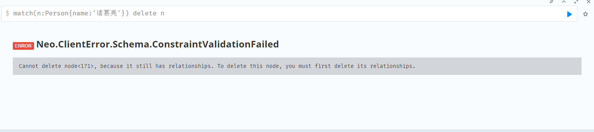

# neo4j

## 语法入门

- 节点：存储实体数据，**可以理解为关系型数据库中的行**。

- 关系：描述节点之间的关系，**个人理解**为关系型数据库中的外键约束。

- 属性：**可以理解为关系型数据库中的字段**。

- 标签：标签是对节点的分类。**个人理解**为关系型数据库中的表。

### 创建节点

在Neo4j中使用CREATE命令来创建节点、关系、属性数据。

#### 创建一个节点

```cypher
create(a) return a
```


#### 创建一个带标签的节点

```cypher
create(b:Person) return b
```


#### 创建一个带标签、带属性的节点

```cypher
create(c:Person{name:'刘备'}) return c
```


#### 创建一个多标签、单属性的节点

```cypher
create(d:Person:Moive{name:'阿凡达'}) return d
```


#### 创建一个单标签、多属性的节点

```cypher
create(e:Person{name:"诸葛亮",country:'蜀汉'}) return e
```


#### 总结

多个标签用`:`分隔开，属性定义在`{}`中，多个属性用`,`分隔开。

### 创建关系

> 示例：CREATE (n)-[r:KNOWS]->(m)
>
> 创建n指向m的关系，并且指定关系类型为：KNOWS

#### 给两个新节点创建无属性关系

```cypher
create(f:Person{name:'曹雪芹'})-[r:write]->(g:Book{name:'红楼梦'}) return f,g,r
```


#### 给两个新节点创建有属性关系

```cypher
create(m:Person{name:'卡梅隆'})-[r:make{cost:'28亿RMB'}]->(n:Moive{name:'阿凡达'}) return m,r,n
```


#### 给已存在节点创建无属性关系

```cypher
match(n:Person{name:'刘备'}) 
match(m:Person{name:'诸葛亮'}) 
create(n)-[r:headOf]->(m) 
return n,m,r
```


#### 给已存在节点创建有属性关系

```cypher
match(n:Person{name:'刘备'}) 
match(m:Person{name:'诸葛亮'}) 
create(n)-[r:headOf{desc:'领导'}]->(m) 
return n,m,r
```

### 删除节点&关系

如果需要删除节点，这个节点必须是孤立节点，也就是和其它节点之间没有关系。如果有关系的话，则必须先删除关系，才能删除节点。

#### 删除孤立节点

可以通过`id`删除，也可以通过属性删除。id是neo4j默认分配的，具有唯一性。

如何获取neo4j默认分配的id？请看下图所示：


删除命令如下：

```cypher
match(n:Person) where id(n)=229
delete n
```


通过属性删除

```cypher
match(n:Person{name:'阿凡达'}) delete n
```


如果有多个节点都具有相同的name属性，但由于系统分配的ID不同，因此被视作不同的节点。如果在实际应用中，需要合并相同节点，则使用`merge`来创建节点，不使用create

#### 删除有关系的节点

```cypher
match(n:Person{name:'诸葛亮'}) delete n
```



当直接删除有关系的节点时，提醒先删除关系，再删除节点。如下所示：

```cypher
match(n:Person{name:'诸葛亮'})
match(n)-[r:headOf]-(m)
delete r,n
```


### 删除标签&属性

#### 删除属性

删除指定name属性的节点的name属性。

```cypher
MATCH (n:Person{name:'曹雪芹'})
remove n.name
return n
```

#### 删除标签

删除指定name属性的节点的Person标签。

```cypher
match(n:Person{name:'卡梅隆'})
remove n:Person
return n
```

### 更新

更新针对的是属性，分两个方面，第一个是给现有节点或关系添加属性、第二个是更新属性值。

```cypher
match (n:Moive{name:'阿凡达'})
set n.releasedate='2009-12-18'
return n
```


更新虽然提供了两个功能，但使用的语法都是一样的，不论之前有没有这个属性，直接`set <node-label-name>.<property1-name>`即可，有则修改，无则添加。

### 查询

查询语法：

```cypher
[MATCH WHERE]  //条件查询
[WITH [ORDER BY] [SKIP] [LIMIT]] // 查询的结果以管道的形式传递给下面的语句，聚合查询必须使用WITH
RETURN [ORDER BY] [SKIP] [LIMIT] // 返回、排序、跳过、返回个数
```

示例：分页查询网点，按照bid正序排序，每页查询2条数据。

```
MATCH (n:AGENCY) 
RETURN n ORDER BY n.bid ASC SKIP 0 LIMIT 2
```

#### 查找指定的图数据

```cypher
MATCH (a:Person {name:'Tom Hanks'}) RETURN a
```

### 实操

#### 创建数据

```cypher
// 示例
CREATE (n {name:'迪士尼营业部'})
CREATE (n:AGENCY {name:'航头营业部'})

// 创建浦东新区转运中心、上海转运中心节点，并且创建关系为：IN_LINE，创建完成后返回节点和关系
// TLT -> Two Level Transport（二级转运中心）
// OLT -> One Level Transport（一级转运中心）
// 示例：n-[r:KNOWS]>m 创建n指向m的关系，并且指定关系类型为：KNOWS
CREATE (n:TLT {name:'浦东新区转运中心'}) -[r:IN_LINE]-> (m:OLT {name:'上海转运中心'}) RETURN n,r,m

// 关系也是可以反向，并且可以为关系中指定属性
CREATE (n:TLT {name:'浦东新区转运中心'}) <-[r:OUT_LINE]- (m:OLT {name:'上海转运中心'}) RETURN n,r,m
```

#### 删除数据

删除数据通过`DELETE`、`DETACH DELETE`完成。其中`DELETE`不能删除有关系的节点，删除关系就需要`DETACH DELETE`了。

```cypher
// 删除节点
MATCH (n:AGENCY {name:"航头营业部"}) DELETE n

// 有关系的节点是不能直接删除的
MATCH (n:AGENCY {name:"北京市昌平区新龙城"}) DELETE n

// 删除节点和关系
MATCH (n:AGENCY {name:"北京市昌平区新龙城"}) DETACH DELETE n

//删除所有节点和关系，慎用！
MATCH (n) DETACH DELETE n
```

#### 更新数据

更新数据是使用SET语句进行标签、属性的更新。SET操作是幂等性的。

```cypher
// 更新/设置 属性
MATCH (n:AGENCY {name:"北京市昌平区新龙城"})
SET n.address = "龙跃苑四区3号楼底商101号"
RETURN n

// 通过remove移除属性
MATCH (n:AGENCY {name:"北京市昌平区新龙城"}) REMOVE n.address RETURN n

// 没有address属性的增加属性
MATCH (n:AGENCY) WHERE n.address IS NULL SET n.address = "暂无地址" RETURN n

// 在节点上更新/设置标签
match (n{name:"张三"}) set n:home return n
match (n{name:"张三"}) set n:car:home return n
match (n{name:"张三"}) REMOVE n:car return n
```

#### 查询数据

##### 构造数据

```cypher
CREATE (北京市转运中心:OLT {bid: 8001, name: "北京市转运中心", address: "北京市转运中心", location : point({latitude:39.904179, longitude:116.407387})})
CREATE (上海市转运中心:OLT {bid: 8002, name: "上海市转运中心", address: "上海市转运中心", location : point({latitude:31.230525, longitude:121.473667})})
CREATE (南京市转运中心:OLT {bid: 8003, name: "南京市转运中心", address: "南京市转运中心", location : point({latitude:32.059344, longitude:118.796624})})
CREATE (太原市转运中心:OLT {bid: 8004, name: "太原市转运中心", address: "太原市转运中心", location : point({latitude:37.870451, longitude:112.549656})})
CREATE (郑州市转运中心:OLT {bid: 8005, name: "郑州市转运中心", address: "郑州市转运中心", location : point({latitude:34.745551, longitude:113.624321})})

CREATE
    (北京市转运中心)-[:IN_LINE {cost:10684.9}]->(上海市转运中心),
    (北京市转运中心)<-[:OUT_LINE {cost:10684.9}]-(上海市转运中心),
    (北京市转运中心)-[:IN_LINE {cost:8993.1}]->(南京市转运中心),
    (北京市转运中心)<-[:OUT_LINE {cost:8993.1}]-(南京市转运中心),
    (南京市转运中心)-[:IN_LINE {cost:2699.4}]->(上海市转运中心),
    (南京市转运中心)<-[:OUT_LINE {cost:2699.4}]-(上海市转运中心),
    (太原市转运中心)-[:IN_LINE {cost:3609.7}]->(郑州市转运中心),
    (太原市转运中心)<-[:OUT_LINE {cost:3609.7}]-(郑州市转运中心),
    (郑州市转运中心)-[:IN_LINE {cost:5659.7}]->(南京市转运中心),
    (郑州市转运中心)<-[:OUT_LINE {cost:5659.7}]-(南京市转运中心)

CREATE (昌平区转运中心:TLT {bid: 90001, name: "昌平区转运中心", address: "昌平区转运中心", location : point({latitude:40.220952, longitude:116.231034})})
CREATE (北京市昌平区新龙城:AGENCY {bid: 100260, name: "北京市昌平区新龙城", address: "龙跃苑四区3号楼底商", phone : "010-53049073,010-53576707", location : point({latitude:40.07544443596149, longitude:116.3470535709328})})
CREATE
    (北京市昌平区新龙城)-[:IN_LINE {cost:189.7}]->(昌平区转运中心),
    (北京市昌平区新龙城)<-[:OUT_LINE {cost:189.7}]-(昌平区转运中心)
CREATE (北京市昌平区定泗路:AGENCY {bid: 100280, name: "北京市昌平区定泗路", address: "北七家镇定泗路苍龙街交叉口", phone : "010-86392987", location : point({latitude:40.11765281246394, longitude:116.37212849638287})})
CREATE
    (北京市昌平区定泗路)-[:IN_LINE {cost:166.2}]->(昌平区转运中心),
    (北京市昌平区定泗路)<-[:OUT_LINE {cost:166.2}]-(昌平区转运中心)
CREATE (海淀区转运中心:TLT {bid: 90002, name: "海淀区转运中心", address: "海淀区转运中心", location : point({latitude:39.959893, longitude:116.2977})})
CREATE (北京市海淀区小营:AGENCY {bid: 100347, name: "北京市海淀区小营", address: "北京市昌平区回龙观街道金燕龙大厦停车场", phone : "010-86483817,010-86483817,010-86483817", location : point({latitude:40.06177798692319, longitude:116.32706587559049})})
CREATE
    (北京市海淀区小营)-[:IN_LINE {cost:116.1}]->(海淀区转运中心),
    (北京市海淀区小营)<-[:OUT_LINE {cost:116.1}]-(海淀区转运中心)
CREATE (北京市海淀区万泉河:AGENCY {bid: 100227, name: "北京市海淀区万泉河", address: "北京市海淀区四季青镇杏石口路47号院", phone : "18521852356", location : point({latitude:39.94882822425318, longitude:116.25707017441161})})
CREATE
    (北京市海淀区万泉河)-[:IN_LINE {cost:36.8}]->(海淀区转运中心),
    (北京市海淀区万泉河)<-[:OUT_LINE {cost:36.8}]-(海淀区转运中心)
CREATE
    (昌平区转运中心)-[:IN_LINE {cost:383.3}]->(北京市转运中心),
    (昌平区转运中心)<-[:OUT_LINE {cost:383.3}]-(北京市转运中心),
    (海淀区转运中心)-[:IN_LINE {cost:112.3}]->(北京市转运中心),
    (海淀区转运中心)<-[:OUT_LINE {cost:112.3}]-(北京市转运中心)
CREATE (浦东新区转运中心:TLT {bid: 90003, name: "浦东新区转运中心", address: "浦东新区转运中心", location : point({latitude:31.221461, longitude:121.544346})})
CREATE (上海市浦东新区南汇:AGENCY {bid: 210057, name: "上海市浦东新区南汇", address: "园春路8号", phone : "18821179169", location : point({latitude:31.035240152911637, longitude:121.73459966751048})})
CREATE
    (上海市浦东新区南汇)-[:IN_LINE {cost:275.4}]->(浦东新区转运中心),
    (上海市浦东新区南汇)<-[:OUT_LINE {cost:275.4}]-(浦东新区转运中心)
CREATE (上海市浦东新区周浦:AGENCY {bid: 210127, name: "上海市浦东新区周浦", address: "川周公路3278-8号", phone : "021-68060322", location : point({latitude:31.132409729356993, longitude:121.59815370294322})})
CREATE
    (上海市浦东新区周浦)-[:IN_LINE {cost:111.6}]->(浦东新区转运中心),
    (上海市浦东新区周浦)<-[:OUT_LINE {cost:111.6}]-(浦东新区转运中心)
CREATE (奉贤区转运中心:TLT {bid: 90004, name: "奉贤区转运中心", address: "奉贤区转运中心", location : point({latitude:30.918406, longitude:121.473945})})
CREATE (上海市奉贤区东部:AGENCY {bid: 210017, name: "上海市奉贤区东部", address: "上上海市奉贤区洪庙镇洪兰路351", phone : "021-57171717", location : point({latitude:30.917752751719863, longitude:121.67587819184698})})
CREATE
    (上海市奉贤区东部)-[:IN_LINE {cost:192.9}]->(奉贤区转运中心),
    (上海市奉贤区东部)<-[:OUT_LINE {cost:192.9}]-(奉贤区转运中心)
CREATE (上海市奉贤区青村:AGENCY {bid: 210442, name: "上海市奉贤区青村", address: "姚家村1127号", phone : "021-57566663,021-57566606", location : point({latitude:30.916946897994983, longitude:121.57954144207972})})
CREATE
    (上海市奉贤区青村)-[:IN_LINE {cost:100.9}]->(奉贤区转运中心),
    (上海市奉贤区青村)<-[:OUT_LINE {cost:100.9}]-(奉贤区转运中心)
CREATE
    (浦东新区转运中心)-[:IN_LINE {cost:68.0}]->(上海市转运中心),
    (浦东新区转运中心)<-[:OUT_LINE {cost:68.0}]-(上海市转运中心),
    (奉贤区转运中心)-[:IN_LINE {cost:347.4}]->(上海市转运中心),
    (奉贤区转运中心)<-[:OUT_LINE {cost:347.4}]-(上海市转运中心)
CREATE (玄武区转运中心:TLT {bid: 90004, name: "玄武区转运中心" , location : point({latitude:32.048644, longitude:118.797779})})
CREATE (江苏省南京市玄武区紫金墨香苑:AGENCY {bid: 25073, name: "江苏省南京市玄武区紫金墨香苑", address: "栖霞区燕尧路100号", phone : "025-58765331,025-83241955,025-83241881", location : point({latitude:32.117016089520305, longitude:118.86319310255513})})
CREATE
    (江苏省南京市玄武区紫金墨香苑)-[:IN_LINE {cost:98.0}]->(玄武区转运中心),
    (江苏省南京市玄武区紫金墨香苑)<-[:OUT_LINE {cost:98.0}]-(玄武区转运中心)
CREATE (江苏省南京市玄武区长江路:AGENCY {bid: 25023, name: "江苏省南京市玄武区长江路", address: "观音阁10号", phone : "18521133265,18695799166", location : point({latitude:32.04803554410631, longitude:118.79190455263355})})
CREATE
    (江苏省南京市玄武区长江路)-[:IN_LINE {cost:5.6}]->(玄武区转运中心),
    (江苏省南京市玄武区长江路)<-[:OUT_LINE {cost:5.6}]-(玄武区转运中心)
CREATE
    (玄武区转运中心)-[:IN_LINE {cost:12.0}]->(南京市转运中心),
    (玄武区转运中心)<-[:OUT_LINE {cost:12.0}]-(南京市转运中心)

CREATE (小店区转运中心:TLT {bid: 90005, name: "小店区转运中心" , location : point({latitude:37.736865, longitude:112.565524})})
CREATE (山西省太原市青龙:AGENCY {bid: 351068, name: "山西省太原市青龙", address: "长治路33号经典家园停车场内13号商铺", phone : "0351-2025888", location : point({latitude:37.83589608758359, longitude:112.56059258109424})})
CREATE
    (山西省太原市青龙)-[:IN_LINE {cost:110.3}]->(小店区转运中心),
    (山西省太原市青龙)<-[:OUT_LINE {cost:110.3}]-(小店区转运中心)
CREATE (山西省太原市长风街:AGENCY {bid: 351045, name: "山西省太原市长风街", address: "平阳路104号省农机公司院内", phone : "18636100730", location : point({latitude:37.809964384001226, longitude:112.55299317699505})})
CREATE
    (山西省太原市长风街)-[:IN_LINE {cost:82.1}]->(小店区转运中心),
    (山西省太原市长风街)<-[:OUT_LINE {cost:82.1}]-(小店区转运中心)
CREATE
    (小店区转运中心)-[:IN_LINE {cost:149.4}]->(太原市转运中心),
    (小店区转运中心)<-[:OUT_LINE {cost:149.4}]-(太原市转运中心)

CREATE (中原区转运中心:TLT {bid: 90006, name: "中原区转运中心" , location : point({latitude:34.74828, longitude:113.612966})})
CREATE (河南省郑州市郑上路:AGENCY {bid: 371067, name: "河南省郑州市郑上路", address: "中原西路西四环西北角", phone : "0371-55116757,0371-68014786", location : point({latitude:34.74753024533005, longitude:113.57428550005442})})
CREATE
    (河南省郑州市郑上路)-[:IN_LINE {cost:35.4}]->(中原区转运中心),
    (河南省郑州市郑上路)<-[:OUT_LINE {cost:35.4}]-(中原区转运中心)
CREATE (河南省郑州市颍河路:AGENCY {bid: 371086, name: "河南省郑州市颍河路", address: "航海西路与西三环交叉口向南300米路西中贸商务", phone : "19139415556", location : point({latitude:34.71593280680163, longitude:113.60398506929064})})
CREATE
    (河南省郑州市颍河路)-[:IN_LINE {cost:36.9}]->(中原区转运中心),
    (河南省郑州市颍河路)<-[:OUT_LINE {cost:36.9}]-(中原区转运中心)
CREATE
    (中原区转运中心)-[:IN_LINE {cost:11.5}]->(郑州市转运中心),
    (中原区转运中心)<-[:OUT_LINE {cost:11.5}]-(郑州市转运中心)
```

##### 基本查询

```cypher
// 查询所有的数据，数据量大是勿用
MATCH (n) RETURN n  

// 查询所有的网点（AGENCY）
MATCH (n:AGENCY) RETURN n  

// 查询所有与“北京市转运中心”有关系的节点
MATCH (n:OLT {name: "北京市转运中心"}) -- (m) RETURN n,m 

// 查询所有"北京市转运中心"关联的一级转运中心
MATCH (n:OLT {name:"北京市转运中心"}) --> (m:OLT) RETURN n,m 

// 可以指定关系标签查询
MATCH (n:OLT {name:"北京市转运中心"}) -[r:IN_LINE]- (m) RETURN n,r,m 

// 将查询赋值与变量
MATCH p = (n:OLT {name:"北京市转运中心"}) --> (m:OLT) RETURN p 

//通过 type()函数查询关系类型
MATCH (n:OLT {name:"北京市转运中心"}) -[r]-> (m:OLT {name:"南京市转运中心"}) RETURN type(r)
```

##### 关系深度查询

可以指定关系的深度进行查询，语法格式：`-[:TYPE*minHops..maxHops]->`。

```cypher
// 查询【北京市转运中心】关系中深度为1~2层关系的节点
MATCH (n:OLT {name:"北京市转运中心"}) -[*1..2]->(m) RETURN *

// 也可以这样
MATCH (n:OLT {name:"北京市转运中心"}) -[*..2]->(m) RETURN *

// 也可以通过变量的方式查询
MATCH path = (n:OLT {name:"北京市转运中心"}) -[*..2]->(m)
RETURN path

// 查询关系，relationships()获取结果中的关系，WITH向后传递数据
MATCH path = (n:OLT {name:"北京市转运中心"}) -[*..2]->(m)
WITH n,m, relationships(path) AS r
RETURN r

// 查询两个网点之间所有的路线，最大深度为6，可以查询到2条路线
MATCH path = (n:AGENCY) -[*..6]->(m:AGENCY)
WHERE n.name = "北京市昌平区定泗路" AND m.name = "上海市浦东新区南汇"
RETURN path

// 查询两个网点之间最短路径，查询深度最大为10
MATCH path = shortestPath((n:AGENCY) -[*..10]->(m:AGENCY))
WHERE n.name = "北京市昌平区定泗路" AND m.name = "上海市浦东新区南汇"
RETURN path

// 查询两个网点之间所有的路线中成本最低的路线，最大深度为10（如果成本相同，转运节点最少）
// UNWIND是将列表数据展开操作
// sum()是聚合统计函数，类似还有：avg()、max()、min()等
MATCH path = (n:AGENCY) -[*..10]->(m:AGENCY)
WHERE n.name = "北京市昌平区定泗路" AND m.name = "上海市浦东新区南汇"
UNWIND relationships(path) AS r
WITH sum(r.cost) AS cost, path
RETURN path ORDER BY cost ASC, LENGTH(path) ASC LIMIT 1
```

##### 分页查询

```cypher
// 分页查询网点，按照bid正序排序，每页查询2条数据，第一页
MATCH (n:AGENCY) 
RETURN n ORDER BY n.bid ASC SKIP 0 LIMIT 2

// 第二页
MATCH (n:AGENCY) 
RETURN n ORDER BY n.bid ASC SKIP 2 LIMIT 2

// ...
```

#### 索引

```cypher
// 创建索引语法：OPTIONS子句指定索引提供程序和配置。
CREATE [TEXT] INDEX [index_name] [IF NOT EXISTS]
FOR (n:LabelName)
ON (n.propertyName)
[OPTIONS "{" option: value[, ...] "}"]

//示例：
CREATE TEXT INDEX agency_index_bid IF NOT EXISTS FOR (n:AGENCY) ON (n.bid)

//删除索引语法：
DROP INDEX index_name

//示例：
DROP INDEX agency_index_bid
```