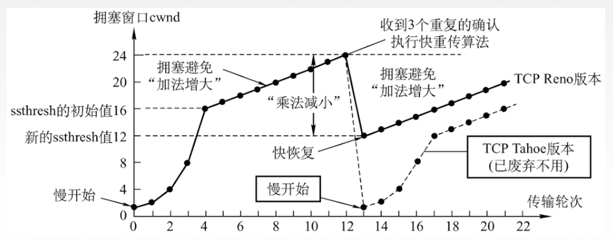
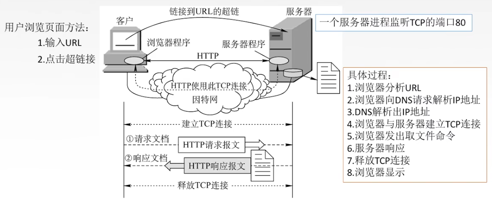

# 网络通信协议

复用：应用层所有的应用进程都可以通过传输层再传输到网络层。

分用：传输层从网络层接收到数据后交付指明的应用进程。

## UDP

UDP只在IP数据报服务之上增加了很少功能，即复用分用和差错检查功能。

UDP（User Datagram Protocol）的主要特点：

1. UDP是无连接的，减少开销和发送数据之前的时延。

2. UDP是不可靠传输，需由应用层程序保证可靠。

3. UDP是面向报文的（即一次发送一个完整报文，对报文既不合并也不拆分），适合一次性传输少量数据的网络应用。

4. UDP无拥塞控制，适合实时应用。

5. UDP首部开销小，占用8B（字节），而TCP占用20B。

### UDP首部格式

```text
|---2 Byte----|----2 Byte------|------------|
| 16位源端口号 | 16位目的端口号  |            |
|-------------|----------------| 首部字段 8B |
| 16位UDP长度 | 16位UDP检验和   |            |
|-------------|----------------|------------|
|             数据             | 数据字段    |
|-------------|----------------|------------|
```

> 16位UDP长度：UDP用户数据报的整个长度。首部占8个字节。
>
> 16位UDP检验和：检车整个UDP数据报是否有错（包括首部字段和数据字段），错就丢弃。

分用时，若找不到对应的目的端口号，则丢弃报文，并给发送方发送ICMP“端口不可达”差错报告报文。

### DUP校验


- 伪首部只有再计算检验和时才出现，不向下传递也不向上递交。

- 17：封装UDP报文的IP数据包首部协议字段是17。

- UDP长度：UDP首部2B+数据部分长度。（不包括伪首部）


在发送端：

1. 添加伪首部。

2. 全0填充检验和字段。

3. 将数据部分不满足4B整数倍的部分用全0填充。

4. `伪首部+首部+数据部分`采用二进制反码求和。

5. 将得出的结果求反码填入检验和字段。

6. 去掉伪首部，发送数据包。

在接收端：

1. 添加伪首部。

2. `伪首部+首部+数据部分`采用二进制反码求和。（注意此时的首部中UDP检验和字段不是全0）

3. 结果全为1则无差错，否则丢弃数据包或者交给应用层附上出差错的警告。

## TCP

TCP协议的特点：

1. TCP是面向连接（虚连接，进程间通信）的传输层协议。

2. 每一条TCP连接只能有两个端点，且每一条TCP连接只能是点对点的。不支持广播和多播。

3. TCP提供可靠传输，无差错、不丢失、不重复、按序到达。

4. TCP提供全双工通信。

  - 发送缓存：准备发送的数据、已发送但尚未收到确认的数据。
  
  - 接收缓存：按序到达但尚未被接收应用程序读取的数据、不按序到达的数据。
  
5. TCP面向字节流，TCP把应用程序传递下来的数据看成仅仅是一连串的无结构的字节流（字节序列）。


### TCP首部格式


- 序号：在一个TCP连接中传输的字节流中的每一个字节都按顺序编号，该字段表示当前报文段所发送数据的第一个字节的序号。

- 确认号：期望收到发送方下一个报文段的第一个数据字节的序号。若确认号为N，则证明到序号N-1为止的所有数据均被正确收到。

- 数据偏移（首部长度）：TCP报文段的数据起始处距离TCP报文段的起始处有多远，以4B为单位，即一个数值是4B。

- 控制位

  - 紧急位URG：URG=1时，表明此报文段中有紧急数据，时高优先级的数据，应尽快传输，不用在缓存里排队，配合紧急指针字段使用。

  - 确认位ACK：ACK=1时确认号有效，在连接建立后所欲传输的报文段都必须把ACK置为1。
  
  - 推送位PSH：PSH=1时，接收方尽快交付接收应用进程，不再等到缓存填满再向上交付。
  
  - 复位RST：RST=1时，表明TCP连接中出现严重差错，必须释放连接，然后再重新建立传输连接。
  
  - 同步位SYN：SYN=1时，表明是一个连接请求/连接接收报文。
  
  - 终止位FIN：FIN=1时，表明此报文段发送方数据已发完，要求释放连接。
  
- 窗口：指的是发送该报文段的一方的接收窗口，即允许对方发送的数据量。（发送方的接收窗口）

- 检验和：和UDP一样，检验首部+数据，检验师要加上12B伪首部，第四个字段为6，UDP为17。

- 紧急指针：URG=1时才有意义，指出该报文段中紧急数据的字节数。

- 选项：最大报文段长度MSS、窗口扩大、事件戳、选择确认...

### TCP连接管理

TCP连接传输的三个阶段：连接建立、数据传输、连接释放。

#### 连接建立

TCP连接的建立采用客户端服务器方式，主动发起连接建立的应用进程称为客户端，而被动等待连接建立的应用进程称为服务器。


- 第一次握手：客户端发送连接请求报文段，无应用层数据。`SYN=1,  seq=x(x为随机数)`

- 第二次握手：服务器段为该TCP连接分配缓存和变量，并向客户端返回确认报文段，允许连接，无应用层数据。`SYN=1, ACK=1, seq=y(y为随机数), ack=x+1`

- 第三次握手：客户端为该TCP连接分配缓存和变量，并向服务器段返回确认的ack，可以携带数据。`SYN=0, ACK=1, seq=x+1, ack=y+1`

为什么连接建立需要三次握手，而不是两次握手？

防止失效的连接请求报文段被服务端接收，从而产生错误。

> 失效的连接请求：若客户端向服务器发送的连接请求因网络原因阻塞了，而客户端等待应答超时后就会再次发送连接请求，此时，上一个连接请求就是“失效的”。

若建立连接只需两次握手，客户端并没有太大的变化，仍然需要获得服务端的应答后才进入ESTABLISHED状态，而服务端在收到连接请求后就进入ESTABLISHED状态。此时如果网络拥塞，客户端发送的连接请求迟迟到不了服务端，客户端便超时重发请求，如果服务端正确接收并确认应答，双方便开始通信，通信结束后释放连接。此时，如果那个失效的连接请求抵达了服务端，由于只有两次握手，服务端收到请求就会进入ESTABLISHED状态，等待发送数据或主动发送数据。但此时的客户端早已进入CLOSED状态，服务端将会一直等待下去，这样浪费服务端连接资源。

#### 连接释放


- 第一次挥手：客户端发送连接释放报文段，停止发送数据，主动关闭TCP连接。`FIN=1, seq=u`

- 第二次挥手：服务器端回送一个确认报文段，客户端到服务器这个放行的连接就释放了，处于半关闭状态。`ACK=1,seq=v, ack=u+1`

- 第三次挥手：服务端发送完数据，就发出连接释放报文段，主动关闭TCP连接。`FIN=1, ACK=1, seq=w, ack=u+1`

- 第四次挥手：客户端回送一个确认报文段，再等到时间等待计时器设置的2MSL（最大报文段寿命）后，连接彻底关闭。`ACK=1, seq=u+1, ack=w+1`

### TCP可靠传输

传输层可以使用TCP实现可靠传输，而网络层是提供尽最大努力交付，不可靠传输。

所谓可靠是指：保证接收方进程从缓存区读出的字节流与发送方发出的字节流是完全一样的。

TCP实现可靠传输的机制：

- 校验：与UDP校验一样，增加伪首部。使用二进制反码求和的方式，来判断是否发生错误。

- 序号：序号字段指的是一个报文段第一个字节的序号。

- 确认：TCP默认使用累计确认。期望收到发送方下一个报文段的第一个数据字节的序号。若确认号为N，则证明到序号N-1为止的所有数据均被正确收到。

- 重传：TCP的发送方在超时时间内没有收到确认就要重传已发送的报文段。（超时重传）。TCP采用自适应算法，动态改变重传时间RTTs（加权平均往返时间）

> 每个报文段都有一个RTT，

冗余ACK（冗余确认，（快速重传机制））：每当比期望序号大的失序报文段到达时，发送一个冗余ACK，指明下一个期待字节的序号。而发送方如果收到3个对于失序报文段的冗余ACK，则认为失序报文段丢失，重传失序报文段。


### TCP流量控制

TCP利用**滑动窗口**机制实现流量控制。

在通信过程中，接收方根据自己接收缓存的大小，动态地调整发送方的发送窗口大小。即接收窗口rwnd（接收方设置确认报文段的**窗口字段**来将rwnd通知给发送方），而发送方的**发送窗口**取决于**接收窗口rwnd**和**拥塞窗口cwnd**的最小值。

假设：A向B发送数据，连接建立时，B告诉A：”B的rwnd=400（字节）“。且每一个报文段100B，报文段序号初值为1。


如果此时，B给A发送了带有窗口的报文段，恰好报文段在传输途中因网络原因丢失了，导致A没收到。则会导致，B因为发送了窗口报文段，会一直等待A发送数据，但是因为网络原因，A没有接收到B的窗口报文段。A无法发送数据。即互相等待，这种现象类似于死锁。解决方案是利用持续计时器进行探测。

TCP为每一个连接设有一个持续计时器，只要TCP连接的一方收到对方的零窗口通知，旧启动持续计时器。（在本例中，A会启动持续计时器）

当持续计时器设置的时间到期，就发送一个零窗口探测报文段。接收方收到探测报文段时会给出现在的窗口值。

若窗口仍然是0，那么发送方旧重新设置持续计时器。

### TCP拥塞控制

出现拥塞的条件：对需求资源的总和 > 可用资源。（网络堵塞）

拥塞控制：防止过多的数据注入到网络中。

#### 慢开始和拥塞避免


传输轮次：发送了一批报文段并收到它们的确认的时间，一个往返时延RTT。即开始**发送一批拥塞窗口内的报文段**到开始**发送下一批拥塞窗口内的报文段**的**时间**。

#### 快重传和快恢复



## HTTP



用于在浏览器键入URL后会发生什么？

1. 浏览器分析URL。

2. 浏览器向DNS请求解析IP地址。

3. DNS解析出IP地址。

4. 浏览器与服务器建立TCP连接。

5. 浏览器发送请求命令。

6. 服务器响应。

7. 释放TCP连接。

8. 浏览器渲染页面。

HTTP 协议的无状态的。HTTP采用TCP作为传输层协议，但HTTP协议本身是无连接的（即通信双方在交换HTTP报文之前不需要先建立HTTP连接）。

### HTTP报文结构

