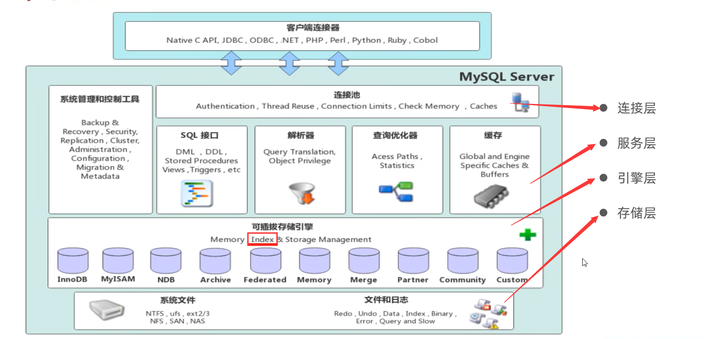

# Java Guide


- [ ] [Dubbo](JavaGuide/Dubbo.md)
- [ ] [HashMap](JavaGuide/HashMap.md)
- [ ] [JavaGuide](JavaGuide/JavaGuide.md)
- [ ] [JUC](JavaGuide/JUC.md)
- [ ] [JVM](JavaGuide/JVM.md)
- [ ] [Kafka](JavaGuide/Kafka.md)
- [ ] [Linux](JavaGuide/Linux.md)
- [ ] [MyBatis](JavaGuide/MyBatis.md)
- [x] [MySQL](JavaGuide/MySQL.md)
- [ ] [Netty](JavaGuide/Netty.md)
- [ ] [Redis](JavaGuide/Redis.md)
- [ ] [RocketMQ](JavaGuide/RocketMQ.md)
- [ ] [SpringBoot](JavaGuide/SpringBoot.md)
- [ ] [Zookeeper](JavaGuide/Zookeeper.md)


| 文档     | 视频     | 时长     |
| -------- | -------- | -------- |
| Dubbo | `https://www.bilibili.com/video/BV1ns411c7jV/` | 4h17' |
| HashMap | `https://www.bilibili.com/video/BV1nJ411J7AA/` | 3h54' |
| JavaGuide |  |  |
| JUC | `1：https://www.bilibili.com/video/BV16J411h7Rd/` <br/> `2：https://www.bilibili.com/video/BV1ar4y1x727/` | 24h18' <br/> 32h36' |
| JVM | `https://www.bilibili.com/video/BV1yE411Z7AP/` | 17h35' |
| Kafka | `https://www.bilibili.com/video/BV1vr4y1677k/` | 12h57' |
| Linux | `https://www.bilibili.com/video/BV1WY4y1H7d3/` | 20h33' |
| MyBatis |  |  |
| MySQL | `https://www.bilibili.com/video/BV1Kr4y1i7ru/` | 29h52' |
| Netty | `https://www.bilibili.com/video/BV1py4y1E7oA/` | 23h47' |
| Redis | `1：https://www.bilibili.com/video/BV1cr4y1671t/` <br/> `2：https://www.bilibili.com/video/BV13R4y1v7sP/` | 42h46' <br/> 42h06' |
| RocketMQ | `https://www.bilibili.com/video/BV1cf4y157sz/` | 19h20' |
| SpringBoot | `https://www.bilibili.com/video/BV19K4y1L7MT/` | 26h12' |
| Zookeeper | `https://www.bilibili.com/video/BV1to4y1C7gw/` | 5h52' |
| SpringCloud | `https://www.bilibili.com/video/BV18E411x7eT/` | 25h36' |
|  |  | 249h479'（一天8h，32天） |


## 面试题整理
### Dubbo
### HashMap
### JavaGuide
### JUC
### JVM
### Kafka
### Linux
### MyBatis
### MySQL
1. 对 MySQL 进行过调优吗？
```txt
`场景可以使用抽奖系统`

是的，我有对 MySQL 进行调优的经验。通过对其进行调优可以提高数据库的性能和吞吐量。
在进行 MySQL 调优时，我会考虑以下几个方面：
1. 索引优化
    分析查询语句，确定需要创建的索引，并确保索引的选择和使用时有效的。
2. 查询优化
    重构查询语句，以减少不必要的操作和数据量。将热点数据放入缓存。数据分页。
    记录慢查询日志
3. 配置优化
    根据服务器的硬件配置和应用需求，调整MySQL的缓冲区大小，减少磁盘IO操作。设置`innodb_buffer_pool_size`参数
    调整并发连接数，增大`max_connections`参数，需要注意控制并发连接数的上限，避免资源耗尽和性能下降。
    根据系统负载和硬件资源情况，调整线程池的大小。配置如`innodb_thread_concurrency`和`thread_cache_size`参数。
4. 数据库设计优化
5. 性能监控及调优    
    首先，我会分析慢查询日志（Slow Query Log），并评估其执行计划和性能瓶颈，例如添加索引、重构查询语句或者调整表结构。
    其次，我会利用 Performance Schema 来监控数据库的性能指标，如查询次数、锁等待、I/O操作等。如果发现某个表的锁等待时间过长，我可能需要优化并发控制，如使用更合适的事务隔离级别或调整锁策略。如果发现磁盘I/O负载过高，我可能需要考虑使用缓存技术或者调整存储引擎配置。
    此外，我还会监控数据库服务器的硬件资源使用情况，如CPU利用率、内存使用情况和磁盘IO等。如果发现资源瓶颈，我可能需要考虑升级硬件或者调整数据库配置参数，以提高性能和吞吐量。
```
2. 讲一下数据库分库分表的实现；
```txt
数据库分库分表的实现方式可以分为两个层面：垂直分库分表和水平分库分表。
1. 垂直分库
    将不同的数据表按照业务或功能划分到不同的数据库实例中，使每个数据库实例只负责特定的数据表。（如可以将用户表、订单表、商品表等根据其关联性拆分到不同的数据库中）
2. 垂直分表
    将一个大表按照列的划分规则，拆分为多个较小的表，每个拆分后的表只包含部分列数据（用主键或外键关联）。减少单表的数据量，提高查询性能。
3. 水平分库
    将数据按照给定规则划分到多个数据库实例中，每个数据库实例存储部分数据，通过分片将查询请求路由到相应的数据库实例。这样可以提高并发处理能力和数据存储容量。
4. 水平分表
    按照拆分策略，将一个表的数据拆分到多个表中
    每个库的表结构都一样
    每个库的数据都不一样
    所有表的并集构成全量数据
    
在实现数据库分库分表时，需要考虑以下几个关键点：
1. 数据分片规则
    确保数据能够均匀地分布到不同的数据库实例或表中，避免热点数据集中和数据倾斜的问题。
2. 数据一致性
    如果某个事务涉及到多个数据库实例或表的操作，需要使用分布式事务或者其它一致性机制来保证数据的一致性。
3. 跨节点查询
    当需要跨多个数据库实例或表进行查询时，需要设计合适的查询路由和跨节点的查询策略，确保查询的效率和正确性。
```
3. 索引对数据库的作用是什么？
```txt
B+树
1. 索引（index）是帮助 MySQL 高效获取数据的数据结构（有序）。在数据之外，数据库系统还维护着满足特定查找算法的数据结构，这些数据结构以某种方式引用（指向）数据。这种数据结构就是索引。
2. 优化排序和分组操作（有序且默认按照升序排序）。
3. 唯一性约束。
4. 减少数据存储空间（B+树索引只有叶子节点才存储数据，非叶子节点只用来索引）。
```
4. 索引的数据结构是什么？什么是 B+ 树？
```txt
索引在数据库中使用的数据结构通常使B+树。

B+树是一种自平衡的树型数据结构，它是一种基于 B树的一种变种，相较于B树，B+树在叶子节点上进行了优化，使得所有叶子节点按照键值的大小顺序形成一个有序链表。
B+树的特点如下：
    1. 非叶子节点都会出现在叶子节点的链表中，而且叶子节点之间由指针进行连接，形成一个有序的链表结构。
    2. 非叶子节点只用来索引，不存储数据记录。使得每个节点可以存储更多的索引信息。这样减少了树的层级，提高了查询效率。
```
5. MySQL 如何保证事务的一致性？
```txt
MySQL通过使用ACID（原子性、一致性、隔离性和持久性）属性来保证事务的一致性。
1. 原子性：MySQL 通过 undo log（回滚日志）来实现原子性。
2. 一致性：MySQL 通过 undo log（回滚日志）和 redo log（事务/重做日志）来实现一致性。
3. 隔离性：锁 + MVCC
4. 持久性：redo log

redo log：该日志文件由两部分组成：重做日志缓冲（redo log buffer）以及重做日志文件（redo log file），前者是在内存中，后者在磁盘中。当事务提交后会把所有修改信息都存到该日志文件中，用于在刷新脏页到磁盘发生错误时，进行数据恢复使用。
undo log：日志解决事务的原子性。事务的原子性依赖于 undo log。undo log和redo log记录物理日志不一样，undo log是逻辑日志。可以认为当 delete 一条记录时，undo log中会记录一条对应的 insert 记录，反之亦然，当 update 一条记录时，它记录一条对应相反的 update 记录。当执行 rollback 时，就可以从 undo log 中的逻辑记录中读取到相应的内容并进行回滚。（undo log 记录的是变更前的数据）
```
6. Redis 和 MySQL 有什么区别？
```txt
Redis和MySQL在数据模型、存储介质、数据一致性和应用场景等方面存在明显的区别。
1. Redis是基于键值对的内存数据库；MySQL是关系型数据库，关系型模型表明了数据库中所存储的数据之间的联系。
2. Redis主要使用内存作为存储介质（Redis也能够实现持久化）；MySQL存储在磁盘上，MySQL的数据存储方式通常更适合长期存储大量数据。
3. Redis通常不保证数据的强一致性；MySQL使用日志和锁等机制来保证数据的可靠性。
4. Redis适合用于高并发的读写场景，如缓存、排行榜，适合对响应时间有较高要求的场景；MySQL适合用于需要复杂查询和事务处理的场景，如电商。
```
7.一个 SQL 语句在 MySQL 中的执行流程。
```txt
1. 语法解析和词法分析：MySQL首先对SQL语句进行语法解析和词法分析，将其拆分成合法的语法单元，如关键字、表名、列名等。这个过程会检查语句的语法是否正确，以及各个元素的合法性。
2. 查询优化和执行计划生成：MySQL会对解析后的SQL语句进行查询优化，以确定最佳的执行计划。优化器会根据表的统计信息、索引情况和查询条件等，选择合适的索引、连接方式和操作顺序，生成一个执行计划。
3. 执行计划执行：MySQL接下来会执行生成的执行计划。具体的执行过程会根据SQL语句的类型而有所不同。
    - 对于查询语句（SELECT），MySQL会根据执行计划逐步获取需要的数据。它可能会使用索引进行快速定位，进行表扫描或索引扫描，根据查询条件过滤数据，并对结果进行排序、分组等操作。
    - 对于修改语句（INSERT、UPDATE、DELETE），MySQL会根据执行计划进行相应的数据修改操作。它可能会涉及表锁、行锁等并发控制机制，确保数据的一致性和完整性。
4. 结果返回：执行完成后，MySQL会将查询结果返回给客户端。对于SELECT语句，返回的是查询结果集；对于INSERT、UPDATE、DELETE语句，返回的是受影响的行数。

查询语句的执行流程：权限校验 ➡ 查询缓存（如果命中缓存，直接返回给客户端） ➡ 分析器 ➡ 优化器 ➡ 权限校验 ➡ 执行器 ➡ 引擎
查询缓存在 MySQL 8.0 之后被移除。

更新语句的执行流程：分析器 ➡ 权限校验 ➡ 执行器 ➡ 引擎 ➡ redo log（prepare 状态） ➡ binlog ➡ redo log（commit 状态）
```
8. MySQL 怎么删除数据。
```txt
可以使用DELETE语句来删除数据

DELETE语句的原理是通过以下步骤实现数据删除：
1. 解析 SQL 语句
    MySQL首先对DELETE语句进行语法解析和词法分析，确保语句的语法正确，并提取出要删除数据的表名和删除条件。
2. 锁定表（或者行）
    在执行DELETE语句之前，MySQL会根据事务隔离级别的设置以及表的锁定机制来锁定待删除的表，确保在删除过程中不会有其他并发操作对数据产生干扰。
3. 执行删除操作
    MySQL会根据DELETE语句中指定的表名和删除条件，逐行地遍历表中的数据。对于每一行数据，MySQL会检查是否满足删除条件。如果满足条件，就将该行数据从表中删除。
4. 日志记录
    binlog、undo log
5. 释放锁
```
9. delete和truncate的区别
```txt
1. 数据删除方式
    delete是数据删除操作，以行为单位，delete语句可以使用条件来指定要删除的数据，不带条件就是删除全部数据。
    truncate是表操作，通过截断（即删除）整个表来删除数据，truncate语句会删除表中的所有数据，但保留表结构。
2. 数据库日志和事务
    delete会产生日志，可以被回滚、撤销等操作。
    truncate也会产生日志，但它在删除操作之前会将整个表结构存储在日志中，由于truncate是DDL（数据定义语言）操作，它无法在事务中进行，也无法被回滚。
3. 数据库空间释放
    delete语句删除行数据时，数据库会将已删除数据所占用的空间标记为可重用，但不会立即释放空间。这意味着表的大小会保持不变，但已删除的数据所占用的空间可以被后续插入的数据重用。
    truncate table语句删除整个表的数据，并释放表所占用的空间。truncate操作将重置表的大小，并且表中的数据将无法恢复。
4. 删除速度
    truncate table通常比delete语句更快，因为它是通过截断整个表来删除数据，而不是逐行删除。truncate操作是一种DDL操作，直接操作表的元数据，因此效率较高。
    delete语句是一种DML操作，它需要逐行删除数据，执行速度可能相对较慢，特别是在删除大量数据时。
```
10. 写查询语句的时候应该从哪些方面考虑来注意性能。
```txt
1. 使用合适的索引
    通过分析查询条件和经常访问的列，可以确定是否需要添加索引。
2. 缩小查询范围
    避免全表扫描，使用WHERE子句来限制返回的数据行数，并确保查询条件能够使用索引。
3. 避免全表连接
    尽量避免在查询中使用多个表的全表连接操作，特别是当表的数据量很大时。如果必须进行连接操作，确保连接字段上有适当的索引。
4. 避免使用 select *
5. 考虑分页
...
```
11. 什么是联合索引，为什么要建联合索引？
```txt
联合索引（即一个索引包含了多个列）

在业务场景中，如果存在多个查询条件，考虑针对于查询字段建立索引时，建立建立联合索引，而非单列索引。
尽量使用联合索引，减少单列索引，查询时，联合索引很多时候可以覆盖索引，节省存储空间，避免回表，提高查询效率
```
12. a,b,c,d，四个字段，查询语句的where条件a=b，order by c。（mysql翻页越翻越慢怎么优化，满足a=b的字段很多，怎么高效的排序，分页查询）
```txt
mysql翻页越翻越慢怎么优化
通过覆盖索引和子查询能够比较好地提高性能
如：select s.* from tb_sku s, (select id from tb_sku order by id limit 2000000, 10) c where s.id = c.id

满足a=b的字段很多
如果 b 是字符串类型的字段，字段的长度较长，可以针对于字段的特点，建立前缀索引。

怎么高效的排序
排序字段建立索引

分页查询
通过覆盖索引和子查询能够比较好地提高性能
如：select s.* from tb_sku s, (select id from tb_sku order by id limit 2000000, 10) c where s.id = c.id
```
13. sql题：一个学生成绩表，里面有学号，科目，成绩，统计出总成绩前十个的学号。
```sql
SELECT 学号
FROM 学生成绩表
GROUP BY 学号
ORDER BY SUM(成绩) DESC
LIMIT 10;
```
14. SQL explain 会输出哪些信息？
```txt
EXPLAIN SELECT * FROM emp WHERE id=1;

    id  select_type  table   partitions  type    possible_keys  key      key_len  ref       rows  filtered  Extra   
------  -----------  ------  ----------  ------  -------------  -------  -------  ------  ------  --------  --------
     1  SIMPLE       emp     (NULL)      const   PRIMARY        PRIMARY  8        const        1    100.00  (NULL)  
     
id
    select 查询的序列号，表示查询中执行 select 子句(子查询)或者是操作表的顺序（id相同，执行顺序从上到下；id不同(子查询)，值越大，越先执行）。
select_type
    表示 select 的类型，常见的取值有 SIMPLE（简单表，即不适用表连接或者子查询）、PRIMARY（子查询，即外层的查询）、UNION（UNION中的第二个或者后面的查询语句）、SUBQUERY（select/where之后包含了子查询）等。
type
    表示连接类型，性能由好到差的连接类型为：NULL、system、const（主键或唯一索引出现）、er_ref、ref（非唯一索引会出现）、range、index、all。
possible_keys
    显示可能应用在这张表上的索引，一个或多个。
key
    实际使用的索引，如果为NULL，则没有使用索引。
...
```
15. sql怎么手动加锁
```txt
全局锁：
    flush tables with read lock;
表锁：
    lock tables 表名 read;
    select ... lock in share mode
    select ... for update
```
16. 介绍一些mysql底层结构？
```txt
连接层
    最上层的是一些客户端和连接服务，主要完成一些连接处理、授权认证以及相关的安全方案。服务器也会为安全接入的客户端验证它所具有的操作权限。
服务层
    服务层架构主要完成大多数的核心服务功能，如 SQL 接口、完成缓存的查询、SQL 的分析和优化、部分内置函数的执行。所有跨存储引擎的功能也在这一层实现。如存储过程、函数等。
引擎层
    存储引擎真正的负责了 MySQL 中数据的存储和提取，服务器通过 API 和存储引擎进行通信。不同的存储引擎具有不同的功能。我们可以根据自己的需求，来选择合适的存储引擎。
存储层
    主要是将数据存储再文件系统之上，并完成与存储引擎的交互。【持久化】
```


17. mysql设计索引的注意事项？ 
```txt
设计原则
1. 针对于数据量较大，且查询比较频繁的表建立索引。（百万以上的数据考虑建立索引）
2. 针对于常作为查询条件（where）、排序（order by）、分组（group by）操作的字段建立索引。
3 .尽量选择区分度高的列作为索引，尽量建立唯一索引，区分度越高，使用索引的效率越高。（比如员工id、身份证号、手机号等）
4 .如果是字符串类型的字段，字段的长度较长，可以针对于字段的特点，建立前缀索引。
5 .尽量使用联合索引，减少单列索引，查询时，联合索引很多时候可以覆盖索引，节省存储空间，避免回表，提高查询效率
6 .要控制索引的数量，索引越多，维护索引结构的代价也就越大，会影响增删改的效率。
7 .如果索引列不能存储 NULL 值，请在创建表时使用 NOT NULL 约束。当优化器知道每列是否包含 NULL 值时，它能够更好地确定哪个索引最有效地用于查询。
```

18. 你之前mysql怎么加锁的？
```txt
select ... lock in share mode

如：select * from score where id = 1 lock in share mode;
lock in share mode：为这一行加上行锁的共享锁，同时为 score 表加上意向共享锁
```

19. 慢SQL问题出现了要怎么解决？
```txt
1. 定位慢SQL
2. 分析慢SQL
3. 优化慢SQL
4. 使用缓存技术

索引优化、数据库配置优化等方面的工作
```

### Netty
### Redis
### RocketMQ
### SpringBoot
### Zookeeper
### SpringCloud


